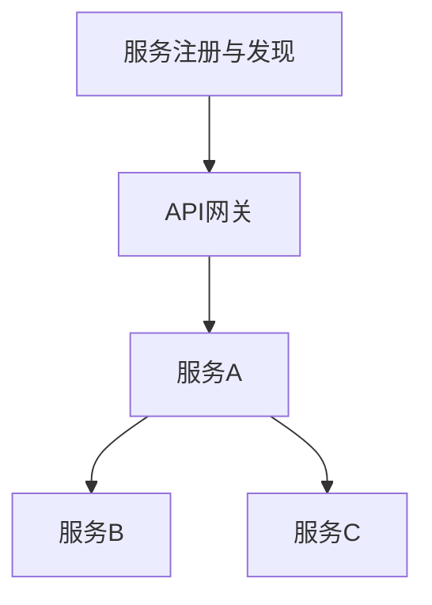
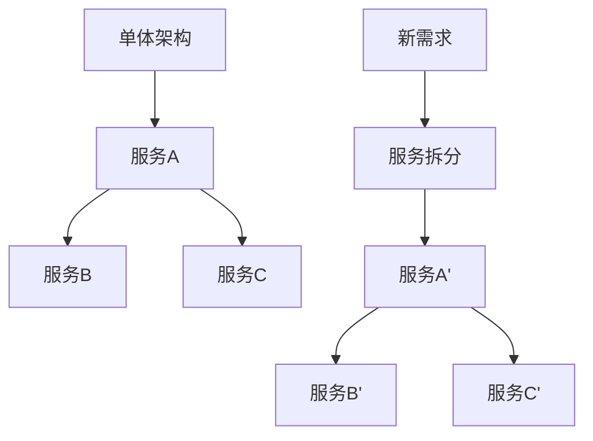
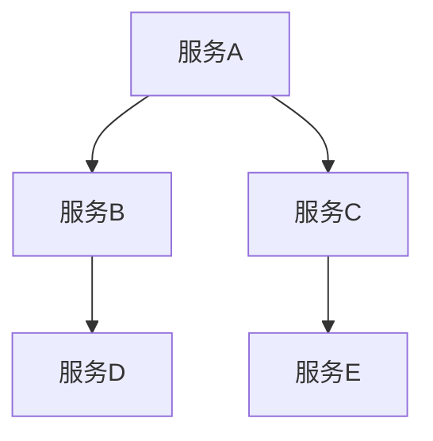

                 

### 文章标题：微服务架构：设计、实现与运维挑战

在当今快速发展的IT行业，微服务架构已经成为企业构建高性能、高可扩展性系统的一种主流模式。随着云计算、容器化、自动化运维等技术的不断发展，微服务架构的优势愈发凸显。本文将带领读者深入探讨微服务架构的设计、实现与运维挑战，旨在帮助开发者更好地理解和应用微服务架构，提升系统的可靠性和效率。

关键词：微服务架构、设计原则、实现策略、运维挑战、持续集成、持续部署

摘要：本文首先介绍了微服务架构的基本概念和背景，分析了微服务与传统单体架构的区别。接着，深入探讨了微服务设计的原则和开发最佳实践，包括服务拆分策略、通信机制、监控与优化等。随后，文章转向微服务的实现与架构设计，介绍了微服务间的通信与协调机制，以及持续集成与持续部署的最佳实践。在第三部分，文章重点关注微服务架构的运维挑战与应对策略，包括运维实践、安全挑战和案例分析。通过本文的阅读，读者将全面了解微服务架构的各个方面，为实际项目中的应用提供有力支持。

### 第一部分：微服务架构概述与背景

#### 第1章：微服务架构简介

##### 1.1 微服务的概念与优势

微服务（Microservices）是一种软件架构风格，它通过将应用程序划分为一组小而独立的、可相互协作的服务来实现。每个服务都是围绕业务功能构建的，具有自己的数据库、后端逻辑和前端界面。微服务的核心特点是独立部署、独立运行，能够快速响应变化，提高系统的可扩展性和可维护性。

微服务的优势主要体现在以下几个方面：

1. **可扩展性**：通过将应用程序分解为小服务，可以更灵活地扩展和优化特定功能，而不会影响到整个系统。
2. **高可维护性**：服务之间解耦，使得开发、测试和部署更加独立，降低了故障的影响范围和修复成本。
3. **高灵活性**：每个服务都可以独立开发、部署和扩展，支持不同的编程语言和技术栈。
4. **快速迭代**：服务之间松耦合，可以并行开发，缩短了开发周期。

##### 1.2 微服务架构的发展历程

微服务架构的概念最早可以追溯到20世纪90年代，当时基于Web的服务和分布式计算开始流行。随着互联网和移动设备的普及，单体架构逐渐暴露出其局限性，如系统复杂性高、可扩展性差、维护困难等。为了应对这些挑战，微服务架构逐渐兴起，并在2010年左右得到广泛关注。

微服务架构的发展历程可以分为以下几个阶段：

1. **单体架构**：传统的应用程序通常采用单体架构，所有功能模块集成在一个庞大的应用程序中。
2. **服务导向架构（SOA）**：为了提高系统的可维护性和扩展性，一些企业开始采用服务导向架构，通过将应用程序分解为多个独立的服务来实现。
3. **微服务架构**：在SOA的基础上，微服务架构进一步将服务拆分为更小、更独立的服务，使得系统能够更好地适应快速变化的需求。

##### 1.3 微服务架构的核心组件

微服务架构的核心组件包括服务注册与发现、API网关、服务拆分与合并、负载均衡、服务熔断与降级、服务监控与追踪等。

1. **服务注册与发现**：服务注册与发现是微服务架构的基础，它使得服务能够动态地注册到服务中心，并发现其他服务的位置。常见的实现方式有Eureka、ZooKeeper等。
2. **API网关**：API网关是微服务架构中的关键组件，它负责处理外部请求，将请求路由到相应的服务，并提供统一的接口和认证机制。常见的API网关有Kong、Traefik等。
3. **服务拆分与合并**：服务拆分是将大型服务分解为更小、更独立的服务，以便于管理和扩展；服务合并则是将多个服务合并为一个大型服务，以简化系统的复杂度。拆分与合并策略需要根据业务需求和系统特点进行合理设计。
4. **负载均衡**：负载均衡是将请求分发到多个服务实例上，以实现系统的横向扩展和负载均衡。常见的负载均衡算法有轮询、最小连接数、随机等。
5. **服务熔断与降级**：服务熔断和降级是应对服务异常的重要机制。服务熔断是在服务不可用时快速返回错误，避免对系统造成更大的影响；服务降级则是将部分功能暂时关闭，以保证核心功能的正常运行。
6. **服务监控与追踪**：服务监控与追踪是确保系统稳定运行的重要手段。通过监控工具（如Prometheus、Kubernetes等）和追踪工具（如Zipkin、Jaeger等），可以实时了解系统的运行状态，快速定位和解决问题。

### 第二部分：微服务设计与开发原则

#### 第2章：微服务设计与开发原则

##### 2.1 微服务设计原则

微服务设计原则是指在进行微服务架构设计时需要遵循的一系列指导原则，以确保系统的高可用性、高可扩展性和高可维护性。以下是微服务设计中的几个核心原则：

1. **单一职责原则**：每个服务应该只负责一个业务功能，避免服务过大或过小，以便于管理和扩展。
2. **开放封闭原则**：服务应该是开放的，易于扩展和修改，但同时也应该是封闭的，不轻易受到外部变更的影响。
3. **里氏替换原则**：服务之间应该是可替换的，即一个服务可以被另一个服务替换而不影响整个系统的行为。
4. **接口隔离原则**：服务的接口应该明确且独立，避免服务间的耦合，提高系统的可维护性和可扩展性。
5. **依赖倒置原则**：服务之间的依赖关系应该采用倒置依赖，即高层模块不依赖于低层模块，而是通过抽象接口进行依赖。

##### 2.2 微服务开发最佳实践

微服务开发最佳实践是指在开发过程中需要遵循的一系列指导原则和最佳实践，以确保系统的可靠性、性能和可维护性。以下是微服务开发中的一些核心最佳实践：

1. **使用微服务框架**：选择合适的微服务框架（如Spring Boot、Node.js等）可以提高开发效率和系统的可靠性。框架应该提供完整的支持，包括服务注册与发现、负载均衡、熔断与降级等。
2. **服务间通信协议**：选择合适的服务间通信协议（如HTTP、gRPC、RESTful API等）可以提高系统的性能和可扩展性。不同的协议适用于不同的场景，需要根据实际需求进行选择。
3. **服务版本控制**：服务版本控制是确保系统稳定运行的重要手段。通过版本控制，可以避免服务更新时的兼容性问题，提高系统的可靠性和可维护性。
4. **容器化与容器编排**：容器化（如使用Docker）和容器编排（如使用Kubernetes）可以提高系统的可移植性、可扩展性和可靠性。通过容器化，可以将服务打包为一个独立的运行时环境，实现快速部署和横向扩展；通过容器编排，可以实现服务的自动化部署、监控和管理。
5. **自动化测试**：自动化测试是确保系统质量的重要手段。通过编写单元测试、集成测试和端到端测试，可以确保服务的功能和性能符合预期，提高系统的可靠性和可维护性。

### 第三部分：微服务实现与架构设计

#### 第3章：微服务的持续集成与持续部署

##### 3.1 持续集成（CI）实践

持续集成（Continuous Integration，简称CI）是一种软件开发实践，旨在通过频繁地将代码集成到主干分支，快速发现和解决代码冲突和错误。持续集成的核心目标是提高代码质量、缩短发布周期和降低风险。

持续集成实践主要包括以下几个方面：

1. **代码仓库管理**：使用版本控制系统（如Git）管理代码仓库，确保代码的可追踪性和版本控制。
2. **自动化构建**：使用构建工具（如Maven、Gradle等）自动化构建项目，包括编译、打包、测试等步骤。
3. **自动化测试**：编写单元测试、集成测试和端到端测试，确保服务的功能和性能符合预期。
4. **代码评审**：采用代码评审机制（如GitHub的Pull Request、GitLab的Merge Request等），确保代码质量和一致性。
5. **持续交付**：将集成后的代码部署到测试环境或生产环境，进行进一步的测试和验证。

常见的CI工具包括Jenkins、GitLab CI、Travis CI等，这些工具提供了丰富的插件和配置选项，可以满足不同场景的需求。

##### 3.2 持续部署（CD）实践

持续部署（Continuous Deployment，简称CD）是一种软件开发实践，旨在通过自动化流程将代码部署到生产环境，确保快速、可靠地交付新功能和服务。持续部署的核心目标是提高发布频率、减少发布风险和降低运营成本。

持续部署实践主要包括以下几个方面：

1. **自动化构建和测试**：与持续集成类似，持续部署也依赖于自动化构建和测试，以确保代码的质量和稳定性。
2. **部署脚本**：编写部署脚本，实现自动部署和服务配置，包括环境变量、依赖库等。
3. **环境隔离**：在部署过程中，使用环境隔离技术（如容器、虚拟机等），确保部署过程对其他环境的影响最小。
4. **自动化测试**：在部署前执行自动化测试，确保部署的服务符合预期，并避免部署失败造成的影响。
5. **部署策略**：根据业务需求和系统特点，选择合适的部署策略（如蓝绿部署、滚动部署等），确保部署过程的平滑和可控。

常见的CD工具包括Jenkins、GitLab CI、Kubernetes等，这些工具提供了丰富的部署策略和监控功能，可以满足不同场景的需求。

### 第四部分：微服务架构的运维挑战与应对策略

#### 第4章：微服务运维挑战分析

##### 4.1 微服务运维的挑战

微服务架构在带来众多好处的同时，也带来了一系列运维挑战。以下是一些常见的微服务运维挑战：

1. **服务拆分与维护的挑战**：服务拆分需要考虑业务需求、数据一致性、技术栈等因素，如何合理地拆分服务是一个难题。此外，拆分后的服务需要持续维护，包括更新、优化和修复等。
2. **服务间通信的稳定性**：微服务架构中，服务间通信依赖于网络和第三方服务，如何确保通信的稳定性和可靠性是一个挑战。可能面临的网络延迟、网络故障、服务不可达等问题需要有效应对。
3. **架构的动态变化与适应**：微服务架构具有高度动态性，服务数量和配置可能频繁变化。如何快速适应这些变化，确保系统稳定运行，是一个重要挑战。
4. **运维团队的转型与建设**：微服务架构要求运维团队具备更高的技术能力和自动化能力，如何实现团队的转型和建设是一个挑战。

##### 4.2 运维团队的转型与建设

为了应对微服务架构的运维挑战，运维团队需要进行转型和建设。以下是一些关键措施：

1. **技术能力的提升**：运维团队需要掌握容器技术（如Docker、Kubernetes）、自动化运维工具（如Ansible、Puppet）和监控工具（如Prometheus、Grafana）等，提高技术能力。
2. **自动化运维**：通过自动化工具实现运维流程的自动化，减少手动操作，提高效率和可靠性。自动化运维包括部署、监控、告警、故障恢复等环节。
3. **运维流程的标准化**：制定标准化的运维流程和规范，确保运维操作的规范性和一致性。标准化流程有助于提高运维效率，降低故障风险。
4. **团队协作与沟通**：建立有效的团队协作机制和沟通渠道，确保团队成员之间的信息共享和协同工作。团队协作有助于快速响应和解决问题。

#### 第5章：微服务运维最佳实践

##### 5.1 日志管理最佳实践

日志管理是微服务运维的重要组成部分，以下是一些日志管理的最佳实践：

1. **日志收集与存储**：使用集中式的日志收集和存储工具（如ELK、Logstash等），实现日志的集中管理和分析。确保日志数据的完整性和安全性。
2. **日志分析与可视化**：使用日志分析工具（如Grok、Kibana等），对日志数据进行实时分析和可视化，帮助运维团队快速定位和解决问题。
3. **日志告警与通知**：设置日志告警机制，当出现异常日志时，及时通知运维团队进行处理。告警通知可以采用邮件、短信、电话等多种方式。

##### 5.2 监控与告警最佳实践

监控与告警是确保微服务架构稳定运行的重要手段，以下是一些监控与告警的最佳实践：

1. **监控指标的选择**：选择合适的监控指标，包括系统指标（如CPU、内存、磁盘等）、应用指标（如响应时间、错误率等）和业务指标（如订单量、用户活跃度等）。监控指标应根据业务需求和系统特点进行合理选择。
2. **告警策略的设计与执行**：根据监控指标设置告警阈值和告警策略，确保在出现异常时及时触发告警。告警策略应考虑告警的优先级、重复告警、告警通知等环节。
3. **自动化处理与恢复**：对于一些常见问题，可以通过自动化脚本实现自动处理和恢复，减少人工干预，提高运维效率。

##### 5.3 故障恢复与业务连续性

故障恢复与业务连续性是微服务架构运维的重要目标，以下是一些故障恢复与业务连续性的最佳实践：

1. **故障检测与自动恢复**：通过监控工具和自动化脚本实现故障检测和自动恢复，确保在出现故障时能够快速响应和恢复。
2. **业务连续性规划与实施**：制定业务连续性计划，包括备份策略、数据恢复、业务切换等环节。根据业务需求和风险等级，合理分配资源，确保业务连续性。

### 第五部分：微服务架构的案例分析

#### 第6章：微服务架构的经典案例

##### 6.1 eBay的微服务实践

eBay是一家全球领先的电子商务公司，其业务规模庞大，系统复杂性高。为了应对业务增长和技术发展的挑战，eBay于2011年开始实施微服务架构转型。以下是eBay的微服务实践：

1. **服务拆分**：eBay将原有单体架构拆分为多个独立的服务，包括用户服务、商品服务、交易服务、支付服务等。每个服务都有自己独立的数据库、后端逻辑和前端界面。
2. **服务治理**：eBay采用服务注册与发现、API网关、服务熔断与降级等技术，实现了服务的治理和协调。通过服务治理，eBay能够快速响应业务变化和技术更新。
3. **容器化与编排**：eBay采用Docker和Kubernetes进行容器化与编排，实现了服务的自动化部署、扩展和监控。通过容器化，eBay能够快速部署和测试新功能，提高开发效率。

##### 6.2 Netflix的微服务架构

Netflix是一家全球领先的视频流媒体公司，其业务规模和技术复杂性也极高。Netflix于2011年全面采用微服务架构，以下是其微服务架构的特点：

1. **服务拆分**：Netflix将业务拆分为多个独立的服务，包括用户服务、内容服务、推荐服务、播放服务、计费服务等。每个服务都有自己独立的数据库、后端逻辑和前端界面。
2. **服务通信**：Netflix采用gRPC作为服务间通信协议，实现了高效、可靠的通信。gRPC支持多语言、低延迟、高吞吐量，能够满足Netflix大规模服务的需求。
3. **容错与弹性**：Netflix通过服务熔断、限流、超时等技术，实现了服务的容错和弹性。通过容错和弹性设计，Netflix能够应对大规模并发和流量波动的挑战。

#### 第7章：微服务架构的挑战与解决方案

##### 7.1 微服务架构的挑战

尽管微服务架构具有众多优势，但在实际应用中也面临一些挑战：

1. **跨服务事务处理**：微服务架构中，服务间往往存在复杂的依赖关系，如何实现跨服务的原子事务处理是一个难题。
2. **服务依赖管理**：在微服务架构中，服务数量众多，如何管理和跟踪服务之间的依赖关系，确保服务的可靠性和稳定性是一个挑战。
3. **架构的可扩展性与弹性**：微服务架构需要能够快速扩展和适应业务变化，如何设计可扩展性和弹性架构是一个关键问题。

##### 7.2 微服务架构的解决方案

针对微服务架构的挑战，以下是一些解决方案：

1. **分布式事务处理**：通过分布式事务处理技术（如TCC、SAGA等），实现跨服务的原子事务处理。TCC（Try、Confirm、Cancel）是一种补偿事务机制，SAGA是一种基于最终一致性的分布式事务模型。
2. **服务依赖管理**：通过服务注册与发现、API网关等技术，实现服务依赖的管理和监控。使用服务治理工具（如Consul、Eureka等），可以动态地管理和监控服务之间的依赖关系。
3. **架构的可扩展性与弹性**：通过容器化、自动化部署、负载均衡等技术，实现架构的可扩展性和弹性。使用容器编排工具（如Kubernetes、Docker Swarm等），可以实现服务的自动化部署、扩展和监控。

### 总结

本文系统地介绍了微服务架构的设计、实现与运维挑战。通过分析微服务的概念、优势、核心组件，探讨了微服务设计的原则和开发最佳实践。随后，本文转向微服务的实现与架构设计，介绍了服务拆分策略、通信机制、监控与优化等。在第三部分，本文重点关注微服务架构的运维挑战与应对策略，包括运维实践、安全挑战和案例分析。通过本文的阅读，读者可以全面了解微服务架构的各个方面，为实际项目中的应用提供有力支持。

### 附录

#### 附录A：微服务相关工具与技术

**A.1 服务注册与发现工具**

- **Eureka**：Eureka是Spring Cloud组件之一，用于服务注册与发现。它支持多实例部署，可以提供高可用性和故障转移功能。
- **ZooKeeper**：ZooKeeper是一个分布式服务协调框架，提供分布式应用中的一致性服务。它支持服务注册、发现和协调等功能。

**A.2 API网关**

- **Kong**：Kong是一个高性能、可扩展的API网关，支持RESTful API和gRPC。它具有丰富的插件体系，可以实现路由、认证、限流等功能。
- **Traefik**：Traefik是一个开源的HTTP反向代理和负载均衡器，支持多种后端服务，如Docker、Kubernetes等。

**A.3 持续集成与持续部署工具**

- **Jenkins**：Jenkins是一个开源的持续集成和持续部署工具，支持多种插件和构建后端，如Git、Docker等。
- **GitLab CI**：GitLab CI是一个基于Git的持续集成和持续部署工具，集成在GitLab仓库中，支持多种构建后端和测试框架。

**A.4 容器化与容器编排工具**

- **Docker**：Docker是一个开源的容器化平台，用于打包、交付和运行应用。它提供了轻量级、可移植的容器化环境，可以简化应用部署和运维。
- **Kubernetes**：Kubernetes是一个开源的容器编排平台，用于自动化部署、扩展和管理容器化应用。它提供了高可用性、负载均衡、服务发现等功能。

### 附录B：微服务架构的 Mermaid 流程图

**B.1 微服务架构流程图**



**B.2 服务拆分与重构流程图**



**B.3 服务通信与协调流程图**



### 附录C：微服务架构的伪代码示例

**C.1 服务A的伪代码**

```python
def service_a(request):
    # 处理请求
    result = do_something(request)
    return result
```

**C.2 服务B的伪代码**

```python
def service_b(request):
    # 处理请求
    result = do_something_else(request)
    return result
```

**C.3 服务间通信的伪代码**

```python
def call_service_a(request):
    response = http_request("http://service-a/api", request)
    return response

def call_service_b(request):
    response = http_request("http://service-b/api", request)
    return response
```

### 附录D：微服务架构的数学模型和公式

**D.1 服务响应时间的公式**

$$
响应时间 = 处理时间 + 网络延迟
$$

**D.2 服务可用性的公式**

$$
可用性 = (1 - 故障时间 / 总时间) \times 100\%
$$

### 附录E：微服务架构的实战案例分析

**E.1 开发环境搭建**

1. 安装Docker：在服务器上安装Docker，并启动Docker服务。
2. 安装Kubernetes：在服务器上安装Kubernetes，并配置Kubernetes集群。
3. 安装Jenkins：在服务器上安装Jenkins，并配置Jenkins服务。

**E.2 源代码详细实现和代码解读**

1. 编写服务A的源代码，实现业务逻辑。
2. 编写服务B的源代码，实现业务逻辑。
3. 编写服务间的通信代码，实现服务调用。
4. 代码解读：详细解释每个函数、类和模块的作用，以及它们之间的关系。

**E.3 代码应用解读与分析**

1. 分析服务的功能和工作流程，解释每个服务的职责和作用。
2. 分析服务间的依赖关系和通信机制，确保系统的稳定性和可靠性。

**E.4 实际案例分析和详细讲解剖析**

1. 分析eBay和Netflix的微服务实践，总结其优点和挑战。
2. 分析实际项目中的微服务架构，找出存在的问题和改进措施。

**E.5 项目小结**

1. 总结项目的成功经验和教训，为后续项目提供参考。
2. 提出改进建议，优化微服务架构，提高系统的性能和可靠性。

### 最佳实践 Tips、小结、注意事项、拓展阅读

**最佳实践 Tips**

1. **合理拆分服务**：根据业务需求和数据一致性要求，合理拆分服务，避免服务过大或过小。
2. **服务版本控制**：使用服务版本控制，确保服务更新时的兼容性和稳定性。
3. **容器化与编排**：使用容器化技术，简化服务的部署和扩展。
4. **自动化测试**：编写自动化测试，确保服务的质量和稳定性。

**小结**

本文系统地介绍了微服务架构的设计、实现与运维挑战，包括微服务的概念、核心组件、设计原则、开发最佳实践、实现策略、运维挑战与应对策略和案例分析。通过本文的阅读，读者可以全面了解微服务架构的各个方面，为实际项目中的应用提供有力支持。

**注意事项**

1. 微服务架构需要合理规划和管理，避免过度拆分或不足拆分。
2. 微服务架构的运维需要具备一定的技术能力和自动化能力。
3. 微服务架构的应用需要根据业务需求和系统特点进行合理设计。

**拓展阅读**

1. 《微服务设计》 - Sam Newman
2. 《微服务架构实战》 - Lewis C.翻炒
3. 《Kubernetes权威指南》 - Kelsey Hightower

### 附录

**附录A：微服务相关工具与技术**

- **服务注册与发现工具**：Eureka、ZooKeeper
- **API网关**：Kong、Traefik
- **持续集成与持续部署工具**：Jenkins、GitLab CI
- **容器化与容器编排工具**：Docker、Kubernetes

**附录B：微服务架构的 Mermaid 流程图**

- **微服务架构流程图**
- **服务拆分与重构流程图**
- **服务通信与协调流程图**
- **服务监控与追踪流程图**

**附录C：微服务架构的伪代码示例**

- **服务A的伪代码**
- **服务B的伪代码**
- **服务间通信的伪代码**

**附录D：微服务架构的数学模型和公式**

- **服务响应时间的公式**
- **服务可用性的公式**

**附录E：微服务架构的实战案例分析**

- **开发环境搭建**
- **源代码详细实现和代码解读**
- **代码应用解读与分析**
- **实际案例分析和详细讲解剖析**
- **项目小结**

