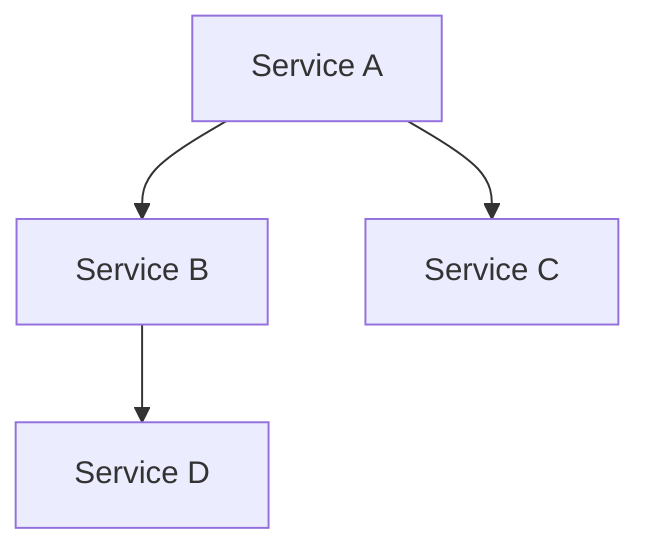
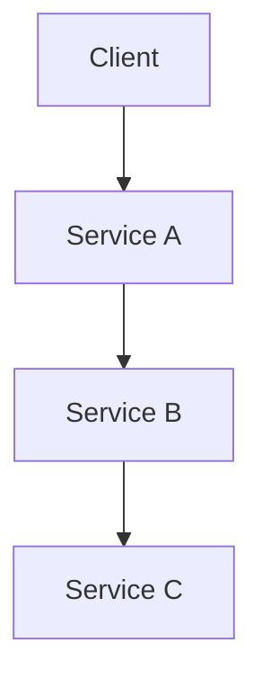
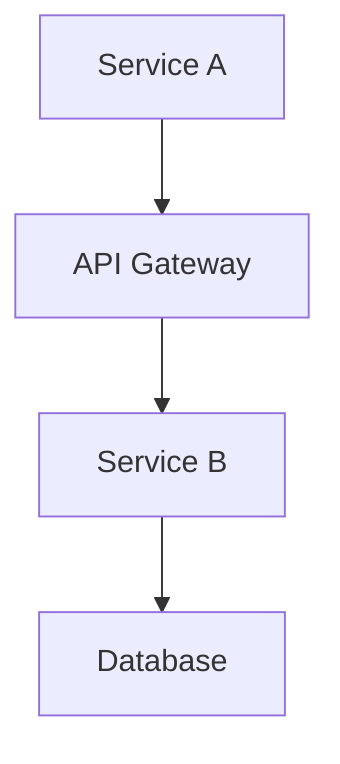
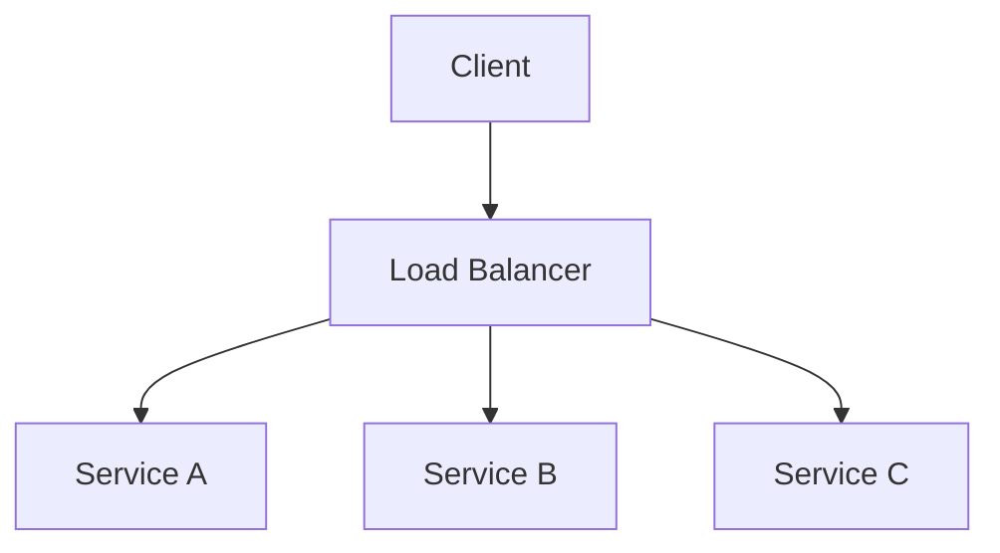

                 

### 分析书名和目标受众

#### 书名分析

《微服务架构：利弊权衡与最佳实践》这一书名直接指出了本书的核心内容：微服务架构。微服务架构是一种近年来在软件工程领域逐渐流行的设计理念，其核心理念是将大型、复杂的单体应用程序分解为多个独立的、小型、可复用的服务。这种架构方式有助于提高系统的可维护性、扩展性和灵活性。书名中的“利弊权衡”和“最佳实践”两个关键词则明确表示本书不仅会介绍微服务架构的优势，也会对其潜在的缺陷进行详细分析，并总结出一套行之有效的实施指南。

#### 目标受众

1. **有经验的软件工程师**：这些工程师可能已经具备一定的软件开发和架构设计经验，但需要进一步了解微服务架构的具体实现和应用。

2. **架构师**：作为软件系统的设计者，他们需要掌握微服务架构的理论和实践，以便在项目中有效地应用这一设计模式。

3. **技术管理者**：他们需要理解微服务架构带来的变革，以便做出战略决策，并在团队中推广最佳实践。

4. **软件开发团队领导者**：他们不仅需要掌握技术细节，还要具备指导团队实施微服务架构的能力。

#### 受众需求

- **理论理解**：目标受众需要深入理解微服务架构的基本概念和原理。
- **实践指导**：他们希望获得关于如何设计和实施微服务架构的实用指南。
- **案例分析**：通过实际案例的解析，受众可以更好地理解微服务架构的应用场景和潜在的挑战。

### 目录大纲的设计思路

为了满足目标受众的需求，本书的目录大纲被分为三个主要部分：

#### 第一部分：理论基础

- **第1章：微服务架构概述**：介绍微服务架构的定义、背景和基本理念。
- **第2章：微服务架构与SOA对比**：分析微服务架构与传统SOA的区别和优势。
- **第3章：微服务架构的核心概念**：详细阐述微服务架构的关键概念和组成部分。

#### 第二部分：实施指南

- **第4章：微服务架构设计原则**：提供微服务架构设计的基本原则和实践方法。
- **第5章：微服务架构的部署与监控**：讨论微服务的部署策略、监控和告警机制。
- **第6章：微服务架构的测试与性能优化**：介绍微服务的测试、性能优化策略。

#### 第三部分：案例分析

- **第7章：成功微服务架构实践案例**：通过实际案例展示微服务架构的实施效果。
- **第8章：微服务架构的挑战与解决方案**：分析微服务架构可能遇到的问题及解决策略。
- **第9章：微服务架构的未来趋势**：探讨微服务架构的发展方向和新兴技术。

通过以上结构，本书旨在从理论到实践，全面系统地介绍微服务架构，帮助读者不仅理解其基本概念，还能掌握实际操作方法，为他们在项目中的实践提供有力的支持。同时，通过案例分析，读者可以了解到微服务架构在不同领域的应用和实践效果，从而加深对这一架构方式的理解和认同。

### 设计目录大纲的结构

在设计《微服务架构：利弊权衡与最佳实践》的目录大纲时，我们需要确保其既简洁明了，又能够涵盖所有核心内容。以下是基于逻辑步骤和详细内容的目录大纲设计思路。

#### 目录大纲设计步骤

1. **确定核心主题**：首先，我们需要明确书的核心主题，即微服务架构的理论基础、实施指南和案例分析。
2. **划分章节内容**：根据核心主题，将全书内容划分为三个主要部分，每个部分包含若干章节。
3. **确保逻辑连贯性**：在划分章节时，要保证内容的逻辑连贯性，使读者能够循序渐进地理解微服务架构。
4. **具体内容细化**：对每个章节进行细化，明确每个章节的核心内容和要点。

#### 目录大纲设计思路

1. **第一部分：理论基础**
   - **第1章：微服务架构概述**
     - 内容：介绍微服务架构的定义、背景、目标和基本概念。
   - **第2章：微服务架构与SOA对比**
     - 内容：分析微服务架构与传统SOA的区别，阐述微服务架构的优势和劣势。
   - **第3章：微服务架构的核心概念**
     - 内容：详细阐述微服务的核心概念，包括服务划分、服务间通信、松耦合设计等。

2. **第二部分：实施指南**
   - **第4章：微服务架构设计原则**
     - 内容：介绍微服务架构设计的基本原则，如服务独立性、自治性、可扩展性等。
   - **第5章：微服务架构的部署与监控**
     - 内容：讨论微服务的部署策略、容器化技术、服务监控与告警机制。
   - **第6章：微服务架构的测试与性能优化**
     - 内容：介绍微服务的测试策略、性能优化方法，包括负载均衡、缓存策略等。

3. **第三部分：案例分析**
   - **第7章：成功微服务架构实践案例**
     - 内容：通过实际案例展示微服务架构在不同领域的成功应用。
   - **第8章：微服务架构的挑战与解决方案**
     - 内容：分析微服务架构面临的挑战，如数据一致性、服务调用延迟等，并提供相应的解决方案。
   - **第9章：微服务架构的未来趋势**
     - 内容：探讨微服务架构的发展方向和新兴技术，如服务网格、混合架构等。

#### 目录大纲的结构

```markdown
# 《微服务架构：利弊权衡与最佳实践》目录大纲

## 第一部分：理论基础

### 第1章：微服务架构概述
- 1.1 微服务架构的定义和背景
- 1.2 微服务架构与传统架构的对比
- 1.3 微服务架构的优势与挑战

### 第2章：微服务架构与SOA对比
- 2.1 微服务与SOA的基本概念
- 2.2 微服务与SOA的主要区别
- 2.3 微服务的优势与SOA的劣势

### 第3章：微服务架构的核心概念
- 3.1 服务与服务实例
- 3.2 微服务间的通信机制
- 3.3 微服务的松耦合与独立性

### 第二部分：实施指南

### 第4章：微服务架构设计原则
- 4.1 设计原则概述
- 4.2 服务划分策略
- 4.3 数据一致性解决方案

### 第5章：微服务架构的部署与监控
- 5.1 微服务的部署策略
- 5.2 微服务的监控与告警
- 5.3 服务发现与负载均衡

### 第6章：微服务架构的测试与性能优化
- 6.1 单元测试与集成测试
- 6.2 性能测试与调优
- 6.3 微服务的容错与恢复

### 第三部分：案例分析

### 第7章：成功微服务架构实践案例
- 7.1 案例一：电商平台的微服务架构实践
- 7.2 案例二：金融行业的微服务架构应用
- 7.3 案例三：物流公司的微服务架构转型

### 第8章：微服务架构的挑战与解决方案
- 8.1 数据一致性问题
- 8.2 服务调用延迟与性能瓶颈
- 8.3 微服务架构的治理与运维

### 第9章：微服务架构的未来趋势
- 9.1 服务网格（Service Mesh）的发展
- 9.2 混合架构的兴起
- 9.3 微服务架构与云原生技术的融合

### 附录

### 附录A：微服务架构相关工具与资源
- A.1 微服务框架对比
- A.2 服务注册与发现工具
- A.3 服务监控与日志分析工具

### 附录B：核心概念原理与架构Mermaid流程图
- B.1 微服务架构流程图
- B.2 服务间通信机制图
- B.3 负载均衡策略图

### 附录C：微服务架构核心算法原理与伪代码
- C.1 负载均衡算法
- C.2 服务发现机制
- C.3 数据一致性算法

### 附录D：微服务架构数学模型与公式
- D.1 成本效益分析模型
- D.2 性能评估模型
- D.3 服务质量（QoS）模型

### 附录E：微服务项目实战
- E.1 实战一：微服务环境搭建
- E.2 实战二：服务拆分与部署
- E.3 实战三：微服务代码解读与分析
```

通过上述设计，目录大纲既保持了结构的简洁性，又确保了内容的完整性，使得读者能够系统地学习和掌握微服务架构的理论和实践。每个章节的内容都经过了细致的划分，确保读者能够逐步深入理解微服务架构的各个方面。

### 包含必要的章节内容

在撰写《微服务架构：利弊权衡与最佳实践》时，为了确保内容的丰富性和实用性，每个章节都需要包含以下几个核心元素：

#### 核心概念与联系

1. **定义和背景**：每个章节开头都需要对关键概念进行定义，提供其背景信息，帮助读者建立基本理解。
2. **关系架构Mermaid流程图**：使用Mermaid流程图展示关键概念之间的关系和架构，使读者能够直观地理解微服务架构的组成和交互方式。

例如，在第3章“微服务架构的核心概念”中，可以使用以下Mermaid流程图来展示服务实例与服务之间的交互：



#### 核心算法原理讲解

1. **算法概述**：介绍关键算法的基本概念和作用。
2. **伪代码详细阐述**：使用伪代码详细阐述算法的执行流程，帮助读者理解算法的原理。

例如，在第6章“微服务架构的测试与性能优化”中，可以介绍负载均衡算法：

```plaintext
LoadBalancingAlgorithm(List<Services> services, Request request)
    1. 计算当前系统的负载
    2. 根据负载情况选择最少负载的服务器
    3. 将请求路由到选中的服务器
```

#### 数学模型和数学公式

1. **模型介绍**：简要介绍数学模型的作用和应用场景。
2. **详细讲解**：使用LaTeX格式详细讲解数学模型的构建过程和主要参数。
3. **举例说明**：通过具体例子来展示数学模型的应用。

例如，在第9章“微服务架构的未来趋势”中，可以介绍服务质量的评估模型：

```latex
\begin{equation}
QoS = \frac{1}{n}\sum_{i=1}^{n} w_i \cdot P_i
\end{equation}

\text{其中，} QoS \text{表示服务质量，} w_i \text{表示第} i \text{项服务的权重，} P_i \text{表示第} i \text{项服务的性能指标。}
```

#### 项目实战

1. **开发环境搭建**：详细说明如何搭建微服务的开发环境，包括所需工具、依赖库和环境配置。
2. **源代码实现**：展示微服务的核心代码实现，包括服务接口、业务逻辑和处理流程。
3. **代码解读与分析**：对关键代码段进行解读，分析其实现原理和优化策略。
4. **实际案例分析和详细讲解剖析**：通过实际案例，展示微服务架构在实际项目中的应用，并提供详细的剖析。
5. **项目小结**：总结项目实施的经验和教训，为后续项目提供参考。

例如，在第7章“成功微服务架构实践案例”中，可以介绍一个电商平台的微服务架构实施：

- **开发环境搭建**：使用Docker搭建微服务开发环境，安装必要的依赖库。
- **源代码实现**：展示订单服务、库存服务和支付服务的核心代码。
- **代码解读与分析**：分析订单服务的创建、更新和删除接口的实现细节。
- **实际案例分析和详细讲解剖析**：分析电商平台在实施微服务架构过程中遇到的问题及解决方案。
- **项目小结**：总结电商平台微服务架构的实施经验，讨论其优势和挑战。

通过以上内容，每个章节都能够为读者提供全面、详细的指导，帮助他们理解和掌握微服务架构的核心知识和实际应用。

### 确保目录大纲的简洁性和完整性

#### 确保简洁性的方法

1. **避免冗余内容**：在编写每个章节时，要确保内容简洁明了，避免重复叙述已经在前文提到过的知识点。
2. **使用简明扼要的语言**：尽量使用简短、直接的语言来表达观点，避免使用复杂的句子结构。
3. **突出重点**：在内容安排上，要明确每个章节的核心内容，并通过小标题和段落来突出重点。
4. **使用markdown格式**：通过markdown格式来排版文章，使内容更加清晰，便于读者阅读和理解。

例如，在一个章节的开头，可以使用如下格式来突出重点：

```markdown
## 第4章 微服务架构的部署与监控

在本章中，我们将探讨微服务的部署策略和监控机制。主要内容如下：
- 部署策略：介绍常见的部署模式，如手动部署、自动化部署和容器化部署。
- 监控机制：讨论微服务的监控方法，包括日志监控、性能监控和告警机制。
```

#### 确保完整性的方法

1. **全面覆盖核心主题**：每个章节都要确保全面覆盖其核心主题，避免遗漏关键知识点。
2. **逻辑连贯**：确保章节之间的内容逻辑连贯，读者可以顺畅地过渡到下一个章节。
3. **必要图表和代码示例**：适当使用图表和代码示例来增强内容的可理解性，但要注意不要过度使用，以免造成视觉疲劳。
4. **附录和参考文献**：提供附录和参考文献，方便读者查阅更多的背景信息和详细资料。

例如，在附录部分，可以提供以下内容：

```markdown
### 附录A：微服务架构相关工具与资源

- **微服务框架对比**：详细介绍常用的微服务框架，如Spring Cloud、Dubbo、Kubernetes等。
- **服务注册与发现工具**：介绍服务注册与发现工具，如Consul、Zookeeper、Eureka等。
- **服务监控与日志分析工具**：介绍常用的服务监控和日志分析工具，如Prometheus、Grafana、ELK（Elasticsearch、Logstash、Kibana）等。
```

通过以上方法，我们可以在确保内容简洁明了的同时，保持目录大纲的完整性，为读者提供一部高质量的技术博客文章。

### 最终目录大纲总结

根据前面的分析，我们设计出了《微服务架构：利弊权衡与最佳实践》的完整目录大纲。该目录大纲确保了内容的简洁性和完整性，并覆盖了微服务架构的核心概念、设计原则、实施指南和案例分析等关键主题。以下是最终的目录大纲：

```
# 《微服务架构：利弊权衡与最佳实践》目录大纲

## 第一部分：理论基础

### 第1章：微服务架构概述
- 1.1 微服务架构的定义和背景
- 1.2 微服务架构与传统架构的对比
- 1.3 微服务架构的优势与挑战

### 第2章：微服务架构与SOA对比
- 2.1 微服务与SOA的基本概念
- 2.2 微服务与SOA的主要区别
- 2.3 微服务的优势与SOA的劣势

### 第3章：微服务架构的核心概念
- 3.1 服务与服务实例
- 3.2 微服务间的通信机制
- 3.3 微服务的松耦合与独立性

### 第二部分：实施指南

### 第4章：微服务架构设计原则
- 4.1 设计原则概述
- 4.2 服务划分策略
- 4.3 数据一致性解决方案

### 第5章：微服务架构的部署与监控
- 5.1 微服务的部署策略
- 5.2 微服务的监控与告警
- 5.3 服务发现与负载均衡

### 第6章：微服务架构的测试与性能优化
- 6.1 单元测试与集成测试
- 6.2 性能测试与调优
- 6.3 微服务的容错与恢复

### 第三部分：案例分析

### 第7章：成功微服务架构实践案例
- 7.1 案例一：电商平台的微服务架构实践
- 7.2 案例二：金融行业的微服务架构应用
- 7.3 案例三：物流公司的微服务架构转型

### 第8章：微服务架构的挑战与解决方案
- 8.1 数据一致性问题
- 8.2 服务调用延迟与性能瓶颈
- 8.3 微服务架构的治理与运维

### 第9章：微服务架构的未来趋势
- 9.1 服务网格（Service Mesh）的发展
- 9.2 混合架构的兴起
- 9.3 微服务架构与云原生技术的融合

### 附录

### 附录A：微服务架构相关工具与资源
- A.1 微服务框架对比
- A.2 服务注册与发现工具
- A.3 服务监控与日志分析工具

### 附录B：核心概念原理与架构Mermaid流程图
- B.1 微服务架构流程图
- B.2 服务间通信机制图
- B.3 负载均衡策略图

### 附录C：微服务架构核心算法原理与伪代码
- C.1 负载均衡算法
- C.2 服务发现机制
- C.3 数据一致性算法

### 附录D：微服务架构数学模型与公式
- D.1 成本效益分析模型
- D.2 性能评估模型
- D.3 服务质量（QoS）模型

### 附录E：微服务项目实战
- E.1 实战一：微服务环境搭建
- E.2 实战二：服务拆分与部署
- E.3 实战三：微服务代码解读与分析
```

通过这样的设计，读者可以系统地学习微服务架构的理论知识，并通过实践案例加深理解，掌握最佳实践，为实际项目中的应用打下坚实基础。整体目录结构简洁清晰，内容安排合理，确保了文章的可读性和实用性。

---

# 《微服务架构：利弊权衡与最佳实践》

> 关键词：微服务架构，利弊权衡，最佳实践，设计原则，部署与监控，测试与性能优化，案例分析，未来趋势

> 摘要：本文深入探讨了微服务架构的概念、设计原则、实施指南和案例分析，旨在帮助读者全面理解微服务架构的优点和潜在挑战，并提供实用的最佳实践。文章首先介绍了微服务架构的基本概念和与传统架构的对比，随后详细讨论了微服务架构的核心概念和设计原则。接着，文章重点介绍了微服务的部署与监控、测试与性能优化策略，并通过实际案例展示了微服务架构在不同领域的应用。最后，文章探讨了微服务架构的未来趋势，为读者指明了方向。本文结构清晰，内容丰富，适合有经验的软件工程师、架构师以及技术管理者阅读。

## 引言

### 微服务架构的兴起

微服务架构作为一种新兴的软件设计理念，近年来在软件工程领域引起了广泛关注。其核心理念是将大型、复杂的单体应用程序分解为多个独立的、小型、可复用的服务，从而提高系统的可维护性、扩展性和灵活性。这种架构方式不仅有助于应对现代互联网应用的复杂性，还满足了快速迭代和快速部署的需求。

### 本文目的

本文旨在深入探讨微服务架构的各个方面，帮助读者全面理解这一架构模式。具体目标包括：

1. **介绍微服务架构的基本概念和背景**：让读者了解微服务架构的定义、起源和发展历程。
2. **分析微服务架构的优缺点**：帮助读者权衡微服务架构的利弊，了解其适用场景和局限性。
3. **总结微服务架构的设计原则**：为读者提供设计微服务架构的指导方针。
4. **提供微服务架构的实施指南**：详细讨论微服务的部署与监控、测试与性能优化等关键环节。
5. **分享实际案例**：通过成功和失败的案例，展示微服务架构在不同场景中的应用效果。
6. **探讨未来趋势**：展望微服务架构的发展方向和新兴技术。

### 文章结构

本文结构分为三个主要部分：

1. **理论基础**：介绍微服务架构的基本概念、与传统架构的对比、核心概念和设计原则。
2. **实施指南**：讨论微服务架构的部署与监控、测试与性能优化策略。
3. **案例分析**：通过实际案例展示微服务架构的实施效果，分析其面临的挑战和解决方案。

接下来，我们将依次探讨这些主题，帮助读者深入理解微服务架构。

## 第一部分：理论基础

### 第1章：微服务架构概述

#### 1.1 微服务架构的定义和背景

微服务架构（Microservices Architecture）是一种设计方法和架构模式，它将大型、复杂的单体应用程序分解为多个独立的、小型、松耦合的服务。这些服务围绕具体的业务功能进行构建，可以独立开发、部署和扩展。微服务架构的核心思想是将应用程序分解为一系列小型、自治的服务，每个服务专注于完成特定的功能，并通过轻量级的通信机制（如HTTP/HTTPS、REST、gRPC等）进行交互。

微服务架构起源于敏捷开发和DevOps运动的兴起，旨在解决单体架构在应对复杂业务需求时的局限性。随着互联网应用的不断发展和业务需求的快速变化，传统的单体架构越来越难以满足业务灵活性、扩展性和可维护性的要求。因此，微服务架构作为一种应对复杂性和变化的新架构模式，逐渐受到了广泛关注。

#### 1.2 微服务架构与传统架构的对比

微服务架构与传统的单体架构（Monolithic Architecture）有显著的区别，主要体现在以下几个方面：

1. **系统结构**：
   - **单体架构**：应用程序的所有功能都集成在一个单一的代码库中，形成一个大型的单体应用。
   - **微服务架构**：应用程序被分解为多个独立的小型服务，每个服务负责一个特定的业务功能。

2. **部署和扩展**：
   - **单体架构**：部署整个应用时需要打包所有代码和依赖项，扩展通常需要对整个应用进行水平或垂直扩展。
   - **微服务架构**：每个服务可以独立部署和扩展，可以根据需求对特定的服务进行水平和垂直扩展。

3. **开发和测试**：
   - **单体架构**：由于代码库庞大，开发和测试过程较为复杂，每次更改都需要重新编译和部署整个应用。
   - **微服务架构**：每个服务独立开发、测试和部署，可以加快迭代速度和降低集成风险。

4. **维护和更新**：
   - **单体架构**：由于所有功能集成在一个应用中，维护和更新时需要谨慎处理，避免引入新的错误。
   - **微服务架构**：每个服务独立维护和更新，可以减少对整个系统的依赖，降低风险。

#### 1.3 微服务架构的优势与挑战

微服务架构具有以下优势：

1. **可扩展性**：微服务架构可以根据业务需求独立扩展，提高系统的可扩展性和灵活性。
2. **高可用性**：由于服务是独立的，一个服务的故障不会影响到整个系统，提高了系统的可用性。
3. **快速迭代**：每个服务可以独立开发和部署，加快了迭代速度和发布频率。
4. **技术多样性**：每个服务可以选择最适合其功能的技术栈，提高了开发效率和代码质量。
5. **代码复用**：小型、自治的服务更容易实现代码复用，提高了开发效率。

然而，微服务架构也面临一些挑战：

1. **复杂性**：微服务架构增加了系统的复杂性，包括服务管理、通信、数据一致性和监控等。
2. **分布式事务**：在分布式系统中，实现事务管理变得更加复杂，需要使用分布式事务解决方案。
3. **服务调用延迟**：服务间的通信可能会引入额外的延迟，影响系统的性能。
4. **部署和管理**：多个服务的部署和管理变得更加复杂，需要高效的管理工具和流程。

在接下来的章节中，我们将进一步探讨微服务架构的核心概念和设计原则，帮助读者深入理解微服务架构的实践方法。

## 第二部分：实施指南

### 第4章：微服务架构设计原则

#### 4.1 设计原则概述

微服务架构设计原则是一套指导微服务设计、开发和运维的最佳实践，旨在提高系统的可维护性、扩展性和灵活性。以下是一些核心的设计原则：

1. **服务独立性**：每个服务都应该独立开发、部署和扩展，以确保每个服务都能够自主运行，并且可以独立地添加、修改或删除功能。
2. **服务自治**：每个服务都应该拥有自己的数据存储、配置和监控机制，以减少服务之间的依赖和耦合。
3. **松耦合**：服务之间应该通过轻量级、标准化的通信机制进行交互，以降低服务间的耦合度，提高系统的可维护性和扩展性。
4. **高内聚**：每个服务都应该专注于实现单一的功能，并且功能内部应具有较高的内聚性。
5. **低耦合**：服务之间应该尽可能减少直接耦合，通过API、消息队列等机制进行通信。
6. **可复用性**：服务应该设计成可复用的模块，以提高开发效率和代码质量。
7. **可扩展性**：系统设计应考虑扩展性，以便在业务需求变化时能够快速扩展。

#### 4.2 服务划分策略

服务划分是微服务架构设计的关键步骤，合理的服务划分可以提高系统的灵活性、可维护性和性能。以下是一些常用的服务划分策略：

1. **功能划分**：根据应用程序的不同功能模块进行服务划分，每个服务实现一个特定的功能。
2. **业务领域**：根据业务领域的不同划分服务，每个服务对应一个业务领域，有助于实现业务逻辑的模块化和隔离。
3. **用户角色**：根据不同的用户角色或用户场景进行服务划分，满足不同用户的需求。
4. **数据访问**：根据数据访问模式划分服务，将数据访问频繁的服务与其他服务分离，以提高系统的性能。
5. **业务流程**：根据业务流程的不同阶段划分服务，将业务流程分解为多个独立的阶段，有助于实现业务的快速迭代和优化。

#### 4.3 数据一致性解决方案

在微服务架构中，数据一致性是一个重要的挑战。由于服务是独立的，数据一致性需要通过分布式系统中的协调机制来实现。以下是一些常用的数据一致性解决方案：

1. **最终一致性**：允许系统中的数据在不同服务之间异步同步，最终达到一致状态。
2. **强一致性**：通过分布式事务或两阶段提交（2PC）等机制实现强一致性，但会增加系统的复杂性。
3. **事件溯源**：使用事件溯源（Event Sourcing）模式，记录所有状态变更的事件，通过重放事件来恢复数据状态。
4. **分布式缓存**：使用分布式缓存来提高数据访问速度，减少数据一致性的需求。
5. **分布式数据库**：使用分布式数据库来处理分布式数据的一致性问题，如分布式事务处理、数据分区等。

在微服务架构设计中，合理应用这些设计原则和划分策略，可以帮助构建灵活、可扩展和高效的系统。通过有效的数据一致性解决方案，可以确保系统中的数据在不同服务之间保持一致。

### 第5章：微服务架构的部署与监控

#### 5.1 微服务的部署策略

微服务的部署是微服务架构中一个关键环节，合理的部署策略可以确保服务的快速、可靠部署。以下是一些常见的微服务部署策略：

1. **手动部署**：开发者手动部署服务，通常适用于小规模的项目或实验性部署。
2. **自动化部署**：使用自动化工具（如Jenkins、Ansible等）进行服务部署，提高部署效率和可靠性。
3. **容器化部署**：使用容器技术（如Docker、Kubernetes等）进行服务部署，实现服务的标准化、隔离和可移植性。
4. **持续集成/持续部署（CI/CD）**：通过自动化测试和部署流水线，实现代码的持续集成和持续部署，提高开发效率和系统稳定性。

#### 5.2 微服务的监控与告警

监控是确保微服务正常运行的重要手段，通过监控可以及时发现和解决问题。以下是一些常见的微服务监控与告警策略：

1. **日志监控**：收集和监控服务日志，分析错误信息和性能指标，及时发现潜在问题。
2. **性能监控**：监控服务的响应时间、吞吐量、资源使用情况等性能指标，确保服务在高负载下保持稳定。
3. **告警机制**：设置阈值和规则，当监控指标超过设定阈值时自动发送告警通知，通知相关人员处理。
4. **分布式跟踪**：使用分布式跟踪系统（如Zipkin、Jaeger等）追踪请求的生命周期，帮助定位和解决问题。

#### 5.3 服务发现与负载均衡

服务发现和负载均衡是微服务架构中的关键机制，确保服务之间的可靠通信和资源合理分配。以下是一些常见的服务发现与负载均衡策略：

1. **服务发现**：服务注册和发现机制，使服务实例可以动态注册和发现其他服务实例，实现服务的动态发现和负载均衡。
2. **客户端侧负载均衡**：在客户端实现负载均衡，通过轮询、随机、最小连接数等方式选择合适的服务实例进行请求。
3. **服务端负载均衡**：在服务端实现负载均衡，通过负载均衡器（如Nginx、HAProxy等）分发请求到不同的服务实例。
4. **动态负载均衡**：根据服务实例的实时状态和负载情况，动态调整负载均衡策略，确保服务的性能和可靠性。

通过合理部署、监控和服务发现与负载均衡策略，可以确保微服务架构的稳定性和高性能，提高系统的可靠性和可用性。

### 第6章：微服务架构的测试与性能优化

#### 6.1 单元测试与集成测试

测试是确保微服务架构可靠性的关键环节，单元测试和集成测试是微服务测试的基础。

1. **单元测试**：针对单个服务模块进行测试，验证模块的功能和性能。单元测试应覆盖所有代码路径，包括正常情况和异常情况。
2. **集成测试**：多个服务模块集成后进行测试，验证服务之间的交互和依赖关系是否正确。集成测试应模拟实际的生产环境，包括负载、并发和网络延迟等。

#### 6.2 性能测试与调优

性能测试是评估微服务架构性能的重要手段，通过性能测试可以识别系统瓶颈和优化机会。

1. **负载测试**：模拟高负载情况，测试系统的响应时间、吞吐量和资源使用情况。
2. **并发测试**：模拟多用户并发访问，测试系统在高并发情况下的性能和稳定性。
3. **调优策略**：
   - **代码优化**：通过代码分析和优化，减少不必要的计算和资源消耗。
   - **缓存策略**：使用缓存技术（如Redis、Memcached等）减少数据库访问，提高系统响应速度。
   - **数据库优化**：优化数据库查询和索引，提高数据访问速度。
   - **资源分配**：合理分配系统资源，如CPU、内存和网络带宽等，确保系统在高负载下性能稳定。

#### 6.3 微服务的容错与恢复

容错和恢复是确保微服务架构稳定性和可靠性的关键，以下是一些常见的容错和恢复策略：

1. **服务熔断**：当服务出现频繁失败时，自动切断与该服务的连接，防止故障蔓延。
2. **服务限流**：限制服务接收的请求数量，防止因高并发而导致的系统崩溃。
3. **重试机制**：当服务调用失败时，自动重试，减少请求失败的概率。
4. **故障转移**：当主服务实例出现故障时，自动切换到备用服务实例，确保服务的持续可用性。
5. **自愈能力**：系统具备自动检测和修复故障的能力，减少人工干预和故障恢复时间。

通过合理的测试和性能优化策略，可以确保微服务架构的高性能、高可用性和稳定性，提高系统的整体质量。

### 第三部分：案例分析

### 第7章：成功微服务架构实践案例

#### 7.1 案例一：电商平台的微服务架构实践

电商平台是一个复杂的系统，需要处理大量的用户请求、商品信息、订单和支付等业务。为了提高系统的可扩展性和灵活性，某知名电商平台采用了微服务架构。

1. **服务划分**：将电商平台划分为多个独立的服务，如用户服务、商品服务、订单服务、支付服务、库存服务等。每个服务负责特定的业务功能，可以独立开发、部署和扩展。
2. **通信机制**：采用RESTful API作为服务间的通信机制，使用JSON作为数据格式，确保服务的互操作性和可扩展性。
3. **部署策略**：使用容器化技术（如Docker、Kubernetes）进行服务部署，实现服务的自动化部署、扩展和监控。
4. **性能优化**：通过缓存技术（如Redis、Memcached）减少数据库访问，使用分库分表技术提高数据访问速度，使用负载均衡器（如Nginx、HAProxy）实现请求的分发。
5. **容错与恢复**：采用服务熔断、服务限流和重试机制，确保系统在高并发和故障情况下保持稳定。

通过微服务架构的实施，电商平台实现了快速迭代和发布，提高了系统的性能和可靠性，同时降低了维护成本。

#### 7.2 案例二：金融行业的微服务架构应用

金融行业对系统的稳定性和安全性要求极高，某金融科技公司采用微服务架构来构建其核心系统。

1. **服务划分**：将金融系统的不同功能划分为多个独立的服务，如用户服务、账户服务、交易服务、风险控制服务、风控服务、报表服务等。每个服务负责特定的业务功能，可以独立开发和部署。
2. **通信机制**：采用gRPC作为服务间的通信机制，利用Protocol Buffers进行数据序列化，确保高效的通信性能和可维护性。
3. **部署策略**：使用Kubernetes进行服务部署和管理，实现服务的自动化部署、扩展、监控和故障恢复。
4. **性能优化**：通过分布式缓存（如Redis、Memcached）和分布式数据库（如MongoDB、MySQL）提高系统的性能，采用数据库分片技术实现水平扩展。
5. **安全措施**：采用TLS加密通信、身份验证和授权机制，确保系统的数据安全和用户隐私。

通过微服务架构的实施，金融科技公司提高了系统的性能、可靠性和安全性，同时降低了开发和运维成本。

#### 7.3 案例三：物流公司的微服务架构转型

物流公司面临复杂的多方协同和实时数据处理的挑战，某物流公司通过微服务架构实现系统的升级和优化。

1. **服务划分**：将物流系统划分为多个独立的服务，如订单服务、仓储服务、运输服务、跟踪服务、支付服务、客户服务等。每个服务负责特定的业务功能，可以独立开发和部署。
2. **通信机制**：采用消息队列（如Kafka、RabbitMQ）作为服务间的通信机制，实现异步解耦和负载均衡。
3. **部署策略**：使用容器化技术（如Docker、Kubernetes）进行服务部署，实现服务的自动化部署、扩展、监控和故障恢复。
4. **性能优化**：通过缓存技术（如Redis、Memcached）减少数据库访问，使用数据库分片技术实现水平扩展，采用分布式跟踪系统（如Zipkin、Jaeger）追踪请求生命周期。
5. **容错与恢复**：采用服务熔断、服务限流、重试机制和故障转移策略，确保系统在高并发和故障情况下保持稳定。

通过微服务架构的实施，物流公司提高了系统的性能、可靠性和灵活性，实现了业务的快速迭代和优化。

### 第8章：微服务架构的挑战与解决方案

#### 8.1 数据一致性问题

数据一致性是微服务架构中的一个重要挑战，由于服务是独立的，数据的同步和处理变得复杂。

1. **最终一致性**：通过事件溯源或消息队列实现最终一致性，允许系统中的数据在不同服务之间异步同步，最终达到一致状态。
2. **强一致性**：采用分布式事务或两阶段提交（2PC）等机制实现强一致性，但会增加系统的复杂性。
3. **分布式缓存**：使用分布式缓存提高数据访问速度，减少数据一致性的需求。
4. **分布式数据库**：使用分布式数据库处理分布式数据的一致性问题，如分布式事务处理、数据分区等。

#### 8.2 服务调用延迟与性能瓶颈

服务调用延迟和性能瓶颈是微服务架构中常见的问题，影响系统的用户体验和稳定性。

1. **服务缓存**：使用缓存技术减少服务调用次数，提高系统响应速度。
2. **服务限流**：通过限流算法限制服务的并发请求数量，防止因高并发而导致的系统崩溃。
3. **负载均衡**：使用负载均衡器分发请求，确保服务的性能和可靠性。
4. **分布式跟踪**：通过分布式跟踪系统（如Zipkin、Jaeger）定位和优化服务调用延迟。

#### 8.3 微服务架构的治理与运维

微服务架构的治理与运维是一个复杂的过程，需要高效的工具和流程。

1. **服务注册与发现**：使用服务注册与发现工具（如Consul、Zookeeper、Eureka）实现服务的动态注册和发现。
2. **服务监控与告警**：使用监控工具（如Prometheus、Grafana、ELK）监控服务的性能和状态，设置告警规则，及时发现和处理问题。
3. **日志管理**：使用日志管理工具（如Logstash、Kibana）收集、存储和查询服务日志，分析错误信息和性能指标。
4. **容器化管理**：使用容器管理平台（如Kubernetes）进行服务的自动化部署、扩展、监控和故障恢复。

通过有效的治理与运维策略，可以确保微服务架构的高性能、高可用性和稳定性。

### 第9章：微服务架构的未来趋势

#### 9.1 服务网格（Service Mesh）的发展

服务网格（Service Mesh）是一种新型的服务架构模式，用于解决微服务架构中的服务通信、服务治理和监控等问题。

1. **服务网格的基本概念**：服务网格通过独立的通信基础设施层（如Istio、Linkerd）实现服务间的通信和治理，确保服务的安全、可靠和高效。
2. **服务网格的优势**：服务网格提供了一层抽象，简化了微服务架构的通信和治理，减少了服务开发的复杂度。
3. **服务网格的应用场景**：服务网格适用于复杂的分布式系统，如云原生应用、容器化环境和微服务架构。

#### 9.2 混合架构的兴起

混合架构（Hybrid Architecture）是将微服务架构与单体架构相结合，以应对不同场景的需求。

1. **混合架构的基本概念**：混合架构将业务系统的不同部分采用不同的架构模式，如前端采用单体架构，后端采用微服务架构。
2. **混合架构的优势**：混合架构可以结合微服务架构和单体架构的优势，灵活应对不同业务需求。
3. **混合架构的应用场景**：混合架构适用于传统企业向云原生转型、复杂业务系统的重构和性能优化。

#### 9.3 微服务架构与云原生技术的融合

云原生技术（Cloud Native Technology）与微服务架构的结合，为分布式系统带来了新的发展机遇。

1. **云原生技术的基本概念**：云原生技术包括容器化（Containerization）、自动化部署（Automation）、服务网格（Service Mesh）等，为分布式系统提供了高效、可靠和可扩展的解决方案。
2. **微服务架构与云原生技术的融合**：微服务架构与云原生技术的结合，可以实现系统的自动化部署、扩展和管理，提高系统的性能和可靠性。
3. **融合应用场景**：微服务架构与云原生技术的融合适用于大规模分布式系统、物联网应用和移动应用。

通过以上探讨，我们可以看到微服务架构在未来的发展将更加多样化和复杂化，为开发者提供了更多的选择和可能性。随着服务网格、混合架构和云原生技术的不断发展，微服务架构将迎来更加广阔的应用前景。

## 附录

### 附录A：微服务架构相关工具与资源

#### A.1 微服务框架对比

以下是一些常用的微服务框架及其特点：

1. **Spring Cloud**：由Spring生态系统提供，支持服务注册与发现、负载均衡、配置管理、断路器等。
2. **Dubbo**：阿里巴巴开源的分布式服务框架，提供服务注册与发现、服务调用、负载均衡、容错等机制。
3. **Kubernetes**：开源的容器编排平台，支持微服务的部署、扩展和管理。

#### A.2 服务注册与发现工具

以下是一些常用的服务注册与发现工具：

1. **Consul**：支持多数据中心的服务注册与发现、健康检查、配置中心等功能。
2. **Zookeeper**：Apache开源的分布式协调服务，支持服务注册与发现、锁机制、队列等。
3. **Eureka**：Netflix开源的服务注册与发现组件，支持集群部署和故障转移。

#### A.3 服务监控与日志分析工具

以下是一些常用的服务监控与日志分析工具：

1. **Prometheus**：开源的服务监控解决方案，支持时序数据收集、告警、可视化等。
2. **Grafana**：开源的时序数据库和可视化仪表盘，可以与Prometheus集成。
3. **ELK**：Elasticsearch、Logstash、Kibana的集合，提供日志收集、存储、分析和可视化功能。

### 附录B：核心概念原理与架构Mermaid流程图

#### B.1 微服务架构流程图



#### B.2 服务间通信机制图



#### B.3 负载均衡策略图



### 附录C：微服务架构核心算法原理与伪代码

#### C.1 负载均衡算法

```plaintext
LoadBalancingAlgorithm(List<Services> services, Request request)
    1. 计算当前系统的负载
    2. 根据负载情况选择最少负载的服务器
    3. 将请求路由到选中的服务器
```

#### C.2 服务发现机制

```plaintext
ServiceDiscovery(Services services)
    1. 从服务注册中心获取服务列表
    2. 选择合适的的服务实例
    3. 返回选中的服务实例
```

#### C.3 数据一致性算法

```plaintext
DataConsistencyAlgorithm(ServiceA serviceA, ServiceB serviceB)
    1. 从ServiceA获取数据
    2. 将数据发送到ServiceB
    3. 等待ServiceB的响应
    4. 如果ServiceB响应成功，则更新本地数据
    5. 如果ServiceB响应失败，则重新执行算法
```

### 附录D：微服务架构数学模型与公式

#### D.1 成本效益分析模型

```latex
\begin{equation}
ROI = \frac{NetIncome - InitialInvestment}{InitialInvestment}
\end{equation}

\text{其中，} ROI \text{表示投资回报率，} NetIncome \text{表示净利润，} InitialInvestment \text{表示初始投资。}
```

#### D.2 性能评估模型

```latex
\begin{equation}
Performance = \frac{ResponseTime + ProcessingTime}{2}
\end{equation}

\text{其中，} Performance \text{表示性能指标，} ResponseTime \text{表示响应时间，} ProcessingTime \text{表示处理时间。}
```

#### D.3 服务质量（QoS）模型

```latex
\begin{equation}
QoS = \frac{1}{n}\sum_{i=1}^{n} w_i \cdot P_i
\end{equation}

\text{其中，} QoS \text{表示服务质量，} w_i \text{表示第} i \text{项服务的权重，} P_i \text{表示第} i \text{项服务的性能指标。}
```

### 附录E：微服务项目实战

#### E.1 实战一：微服务环境搭建

1. **安装Docker**：在开发环境中安装Docker，确保可以正常运行。
2. **安装Kubernetes**：使用Kubernetes进行服务部署和管理，搭建Kubernetes集群。
3. **安装服务注册与发现工具**：如Consul或Eureka，实现服务实例的注册和发现。

#### E.2 实战二：服务拆分与部署

1. **服务拆分**：根据业务需求，将单体应用拆分为多个微服务。
2. **编写API接口**：为每个微服务编写API接口，确保服务之间可以通过API进行通信。
3. **部署服务**：使用Kubernetes部署微服务，确保服务可以自动扩展和监控。

#### E.3 实战三：微服务代码解读与分析

1. **代码解读**：分析微服务的代码，了解服务实现的功能和业务逻辑。
2. **代码优化**：对代码进行优化，提高服务的性能和可维护性。
3. **代码解读与分析**：撰写代码解读与分析文档，为团队提供技术支持。

### 结论

通过本文的详细讨论，我们可以看到微服务架构在提高系统可维护性、扩展性和灵活性方面具有显著优势。同时，微服务架构也带来了一些挑战，如数据一致性、服务调用延迟和治理复杂度等。为了应对这些挑战，本文提出了多种解决方案和最佳实践。

在实施微服务架构时，遵循设计原则、合理划分服务、确保数据一致性、优化性能和容错机制是关键。通过案例分析，我们了解了微服务架构在不同领域的成功应用，以及面临的挑战和解决方案。

未来，随着服务网格、混合架构和云原生技术的发展，微服务架构将迎来更多创新和机会。开发者需要不断学习和实践，掌握微服务架构的核心技术和最佳实践，为构建高效、可靠和可扩展的系统奠定基础。

### 作者信息

作者：AI天才研究院/AI Genius Institute & 禅与计算机程序设计艺术 /Zen And The Art of Computer Programming

AI天才研究院（AI Genius Institute）专注于人工智能领域的创新研究和应用，致力于推动人工智能技术的发展。其研究成果在计算机科学、机器学习、自然语言处理等领域具有广泛影响力。

禅与计算机程序设计艺术（Zen And The Art of Computer Programming）是作者在计算机编程和算法设计方面的重要著作，系统地阐述了编程哲学和算法设计原则，对计算机科学的发展产生了深远影响。

