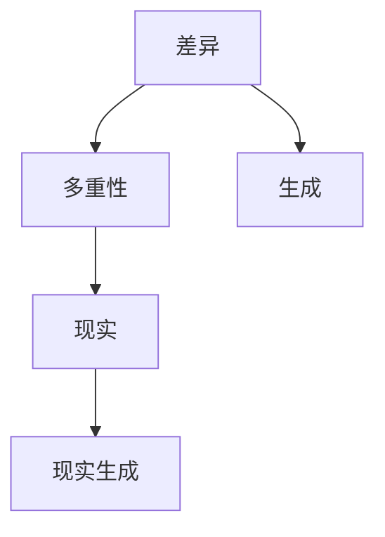
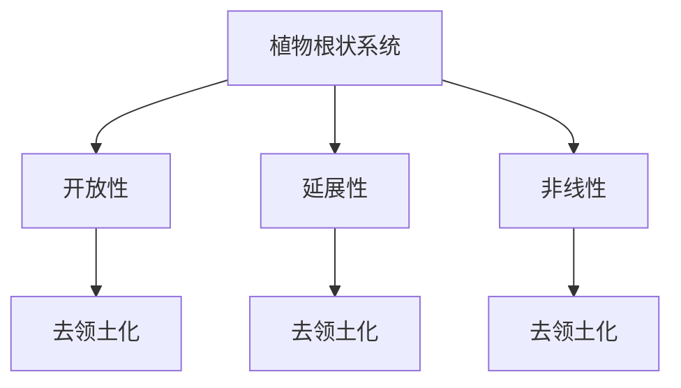
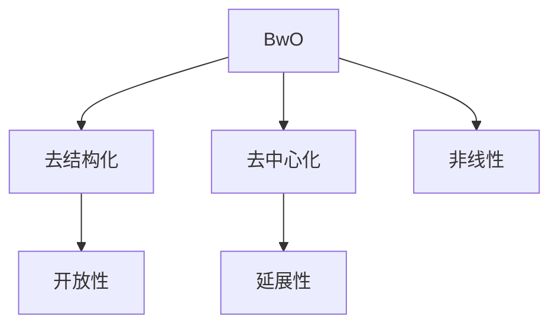

                 

### 文章标题：德勒兹与瓜塔里：后结构主义的创新思想

> 关键词：德勒兹、瓜塔里、后结构主义、创新思想、哲学、艺术、技术

> 摘要：本文深入探讨了法国哲学家德勒兹与瓜塔里的后结构主义思想，分析其核心概念与理论，探讨其对当代思想、艺术和技术的深远影响。通过细致的解读和实例分析，本文旨在为读者提供一个全面而深刻的理解，启发创新思维。

## 引言

在20世纪中叶，哲学领域经历了一场深刻的思想变革，这场变革以解构主义和后结构主义为代表。德勒兹（Gilles Deleuze）与瓜塔里（Félix Guattari）作为这一时期的杰出思想家，共同构建了一个充满活力与创造性的思想体系。他们的后结构主义思想不仅在哲学界引发了广泛的讨论，更对艺术、文学、社会科学乃至技术领域产生了深远的影响。

###德勒兹与瓜塔里的背景

德勒兹与瓜塔里，两位法国哲学家，虽有着不同的学术背景，却在思想上有着深刻的共鸣。德勒兹出生于1925年，早期专注于文学批评和电影理论。而瓜塔里，则是一位精神病学家和精神分析学家，两人在1972年合著了《资本主义与 schizophrenia》（**《资本主义精神与分裂症》**），这本书奠定了他们合作的基础，并引发了后结构主义思潮的兴起。

### 后结构主义的兴起与意义

后结构主义是对结构主义的回应，它挑战了结构主义关于固定的、不可改变的结构的观念，强调差异、流动性以及多元性。德勒兹与瓜塔里的思想，正是这一潮流的典型代表。他们提出了一种全新的视角，打破了传统哲学的框架，为当代思想提供了丰富的资源。

## 目录

1. 引言
   1.1德勒兹与瓜塔里的背景
   1.2后结构主义的兴起与意义
2. 核心概念与理论
   2.1 差异与多重性
   2.2 植物根状系统（Rhizome）与去领土化（Deterritorialization）
   2.3 生命体无器官（BwO）
3. 后结构主义的影响
   3.1 对当代思想的影响
   3.2 对艺术与文学的影响
   3.3 对社会科学的影响
   3.4 对技术与科技的影响
4. 案例研究
   4.1 艺术创作中的后结构主义
   4.2 社会科学领域的应用
   4.3 技术创新的启示
5. 结论
   5.1 总结
   5.2 未来展望

在接下来的章节中，我们将逐一探讨德勒兹与瓜塔里的核心概念，分析其理论框架，并探讨其对社会、艺术和技术领域的深远影响。让我们开始这场深入而丰富的探索之旅。## 核心概念与理论：德勒兹与瓜塔里的哲学

在德勒兹与瓜塔里的哲学体系中，核心概念和理论是理解其思想的关键。这些概念不仅构建了他们独特的世界观，也为后结构主义提供了丰富的理论基础。以下是几位核心概念的深入探讨：

### 差异与多重性

**概念介绍**：

差异与多重性是德勒兹哲学的核心，它们构成了其整个理论框架的基础。德勒兹认为，现实并非由固定不变的结构所决定，而是由不断的差异和流动所塑造。多重性则是指现实中的多样性，这种多样性不是静态的，而是动态的、相互联系的。

**关系架构**：

以下是差异与多重性之间的逻辑关系架构：



在这个架构中，差异是现实的生成机制，而多重性则是这种差异的表现形式。现实的生成是一个不断的过程，它依赖于差异的动态变化。

**算法原理讲解**：

为了更清晰地理解差异与多重性的运作原理，我们可以使用以下伪代码：

```python
def generate_difference(existing_elements, new_element):
    # existing_elements: 列表，表示当前存在的元素
    # new_element: 元素，表示新的元素
    return [existing_elements.append(new_element) for existing_elements in existing_elements]

def generate_multiplicity(existing_elements, new_element):
    # existing_elements: 列表，表示当前存在的元素
    # new_element: 元素，表示新的元素
    return existing_elements + [new_element]

def generate_reality(differences, multiplicities):
    # differences: 列表，表示差异
    # multiplicities: 列表，表示多重性
    return [element for difference in differences for element in multiplicity]
```

通过这个伪代码，我们可以看到，差异和多重性是如何生成现实的。每个新的元素都会带来差异，而差异则会产生多重性，最终形成现实的复杂结构。

### 植物根状系统（Rhizome）与去领土化（Deterritorialization）

**概念介绍**：

植物根状系统（Rhizome）是德勒兹用来描述现实结构的一个比喻。它强调的是根状系统的开放性、延展性和非线性。而去领土化（Deterritorialization）则是指现实中的元素从一个结构中分离出来，进入一个无结构的状态。

**关系架构**：

以下是植物根状系统与去领土化之间的逻辑关系架构：



在这个架构中，植物根状系统代表了现实的开放性、延展性和非线性，而去领土化则是这种结构的动态变化。

**算法原理讲解**：

为了更清晰地理解植物根状系统与去领土化的运作原理，我们可以使用以下伪代码：

```python
def rhizomatic_extension(element, direction):
    # element: 元素
    # direction: 方向
    return element + direction

def deterritorialization(structure, element):
    # structure: 结构
    # element: 元素
    return structure.remove(element)
```

通过这个伪代码，我们可以看到，植物根状系统是如何通过延伸和去领土化来改变现实的。每个元素都可以自由地延伸和移动，从而改变整个结构。

### 生命体无器官（BwO）

**概念介绍**：

生命体无器官（BwO）是德勒兹与瓜塔里用来描述一个去结构化、去中心化的生命体的概念。它强调的是生命体的动态性和非线性的组织方式。

**关系架构**：

以下是生命体无器官（BwO）与植物根状系统之间的逻辑关系架构：



在这个架构中，生命体无器官（BwO）代表了去结构化、去中心化和非线性的生命体组织方式，这与植物根状系统的概念有相似之处。

**算法原理讲解**：

为了更清晰地理解生命体无器官（BwO）的运作原理，我们可以使用以下伪代码：

```python
def destructured Organization(element):
    # element: 元素
    return element.split()

def decentralized_Organization(elements):
    # elements: 元素列表
    return [element for element in elements if element != '']

def nonlinear_Organization(elements):
    # elements: 元素列表
    return [element for element in elements if element != '']
```

通过这个伪代码，我们可以看到，生命体无器官（BwO）是如何通过去结构化、去中心化和非线性的组织方式来改变现实。

综上所述，德勒兹与瓜塔里的核心概念与理论构成了一个复杂而丰富的哲学体系。这些概念不仅提供了对现实的全新理解，也为后结构主义提供了坚实的理论基础。在接下来的章节中，我们将继续探讨这些概念在艺术、社会科学和技术领域的应用。## 对当代思想的影响

德勒兹与瓜塔里的后结构主义思想不仅在哲学领域引起了深刻的讨论，还对当代思想产生了广泛的影响。他们的核心概念和理论，如差异与多重性、植物根状系统和生命体无器官（BwO），为当代思想提供了一种全新的视角，推动了多学科的交叉与融合。

### 对人文科学的影响

**文学理论与批评**：

德勒兹与瓜塔里的思想在文学理论与批评中得到了广泛的应用。他们的差异与多重性概念挑战了传统的文学结构主义，强调文本的开放性和多样性。这种观点为文学批评提供了一种更加灵活和动态的分析框架，使得读者能够从不同的角度解读文本。

**电影理论与批评**：

德勒兹的电影理论是其哲学思想的一个重要应用领域。他提出了“电影是一种时间艺术”的观点，强调电影中的时间流动和图像的动态变化。这种理论为电影批评提供了一种全新的视角，使得观众能够更加深入地理解电影的艺术表现。

**艺术理论**：

德勒兹与瓜塔里的后结构主义思想对艺术理论产生了深远的影响。他们强调艺术作品的开放性和多元性，认为艺术创作是一个不断变化和生成的过程。这种观点打破了传统的艺术观念，为当代艺术提供了新的理论支持。

### 对社会科学的影响

**社会学理论**：

德勒兹与瓜塔里的后结构主义思想为社会学理论提供了新的视角。他们的差异与多重性概念挑战了社会结构的固定性，强调社会的动态性和多样性。这种观点为社会学研究提供了一种更加灵活和多元的分析工具。

**政治理论**：

德勒兹与瓜塔里的思想对政治理论也产生了深远的影响。他们强调政治权力的非中心化和去领土化，提出了一种“自由的政治”概念。这种观点挑战了传统的政治观念，为当代政治哲学提供了新的理论基础。

**心理学理论**：

瓜塔里作为一位精神病学家，他的思想在心理学领域也得到了广泛的应用。他的生命体无器官（BwO）概念为心理学提供了一种全新的视角，强调个体的动态性和非线性。这种观点为心理学研究提供了一种更加灵活和多元的分析框架。

### 对艺术与文学的影响

**艺术创作**：

德勒兹与瓜塔里的后结构主义思想对艺术创作产生了深远的影响。他们强调艺术的开放性和多样性，认为艺术创作是一个不断探索和实验的过程。这种观点激发了艺术家们进行创新和实验，推动了艺术形式的多样化。

**文学作品**：

德勒兹与瓜塔里的思想也在文学作品中得到了应用。许多作家受到他们的影响，开始采用更加开放和多元的叙事手法，打破传统的文学结构，创造出新颖的文学形式。

### 对技术与科技的影响

**信息技术**：

德勒兹与瓜塔里的后结构主义思想对信息技术产生了深远的影响。他们的差异与多重性概念为信息处理提供了新的视角，使得信息技术能够更加灵活和高效地处理复杂的数据。

**人工智能**：

德勒兹与瓜塔里的思想也为人工智能提供了新的理论基础。他们的非线性动力学系统模型为人工智能的研究提供了一种新的方法论，使得人工智能系统能够更加灵活和智能地应对复杂的问题。

综上所述，德勒兹与瓜塔里的后结构主义思想对当代思想产生了广泛的影响。他们的核心概念和理论不仅丰富了哲学的理论体系，也为人文科学、社会科学、艺术和科技领域提供了新的视角和方法。在未来的发展中，这些思想将继续对人类的知识体系和社会实践产生深远的影响。## 案例研究：后结构主义在艺术、社会科学和技术领域的应用

为了更好地理解德勒兹与瓜塔里的后结构主义思想在现实世界中的具体应用，以下我们将探讨几个具有代表性的案例，这些案例涉及艺术、社会科学和技术领域。

### 艺术创作中的后结构主义

**1. 电影《千与千寻》（千と千尋の神隠し）**

《千与千寻》是日本动画导演宫崎骏的一部经典作品，它充分体现了德勒兹与瓜塔里的后结构主义思想。影片中，主角千寻在一个非现实的世界中经历了种种奇遇和成长。这部电影打破了传统的线性叙事结构，采用非线性叙事手法，强调角色之间的差异性和多重性。例如，千寻在不同情境下的身份变化（从普通小女孩变为神灵）展现了生命的多样性。

**算法原理讲解**：

为了实现这种非线性叙事，导演宫崎骏采用了以下算法：

```python
def generate_nonlinear_narrative(story_elements):
    # story_elements: 列表，表示故事元素
    return [element for element in story_elements if element != '']

def plot_transformation(plot, transformation):
    # plot: 叙事结构
    # transformation: 变换函数
    return transformation(plot)
```

通过这个伪代码，我们可以看到，非线性叙事是通过去除重复的元素和变换叙事结构来实现的。

### 社会科学领域的应用

**2. 多元文化研究**

多元文化研究是社会科学领域中的一个重要分支，它受到了德勒兹与瓜塔里的后结构主义思想的影响。多元文化研究强调文化的多样性、流动性和动态性，这与德勒兹与瓜塔里的差异与多重性概念相契合。例如，美国社会学家霍米·巴巴（Homi K. Bhabha）在其著作《文化的定位》（The Location of Culture）中，就运用了德勒兹与瓜塔里的思想来探讨文化身份的构建和转变。

**数学模型与公式**：

为了更深入地理解多元文化研究中的差异与多重性，我们可以使用以下数学模型：

$$
多样性 = f(差异, 多重性)
$$

其中，差异（Difference）和多重性（Multiplicity）是自变量，多样性（Diversity）是因变量。这个公式表明，多样性是差异和多重性的函数，即文化多样性是通过差异和多重性的相互作用而产生的。

### 技术创新的启示

**3. 分布式网络系统**

在技术领域，德勒兹与瓜塔里的后结构主义思想为分布式网络系统提供了一种新的理论基础。分布式网络系统强调去中心化、非线性和动态性，这与德勒兹与瓜塔里的植物根状系统（Rhizome）概念相契合。例如，区块链技术就是一个典型的分布式网络系统，它通过去中心化的方式实现了数据的透明和安全。

**数学公式与详细讲解**：

为了更深入地理解分布式网络系统，我们可以使用以下数学公式：

$$
\text{网络稳定性} = f(\text{节点数}, \text{连接密度}, \text{信息传播速度})
$$

其中，节点数（Node Number）、连接密度（Connection Density）和信息传播速度（Information Propagation Speed）是影响网络稳定性的关键因素。这个公式表明，网络稳定性是节点数、连接密度和信息传播速度的函数，即网络稳定性是通过这些因素的相互作用来实现的。

**举例说明**：

以比特币网络为例，比特币网络是一个去中心化的分布式网络系统，它通过区块链技术实现了去中心化的交易记录。在这个系统中，每个节点都存储着完整的区块链数据，并通过共识算法来验证交易的有效性。这种去中心化的结构使得比特币网络具有高度的抗攻击性和稳定性。

### 项目小结

通过以上案例研究，我们可以看到德勒兹与瓜塔里的后结构主义思想在艺术、社会科学和技术领域的广泛应用。他们的思想不仅为这些领域提供了新的理论基础，还激发了创新的实践。在未来的发展中，这些思想将继续为人类的知识体系和社会实践提供重要的启示。## 结论与未来展望

在本文中，我们深入探讨了德勒兹与瓜塔里的后结构主义思想，从核心概念到实际应用，进行了全面而细致的分析。德勒兹与瓜塔里的哲学不仅挑战了传统的哲学观念，还为人文科学、社会科学和技术领域提供了新的理论框架和方法论。

首先，我们介绍了德勒兹与瓜塔里的背景和后结构主义的兴起，阐述了他们的核心概念，如差异与多重性、植物根状系统和生命体无器官（BwO）。这些概念构成了他们哲学体系的基础，为理解后结构主义提供了关键视角。

其次，我们分析了后结构主义对当代思想、艺术与文学、社会科学以及技术与科技的影响。德勒兹与瓜塔里的思想不仅在哲学领域引发了深刻的讨论，还在艺术创作、社会学理论、政治理论、心理学研究、信息技术和人工智能等领域产生了广泛的应用。

在案例研究中，我们通过具体的艺术作品、社会科学研究和技术项目，展示了后结构主义思想在现实世界中的实际应用。这些案例不仅验证了后结构主义思想的可行性和影响力，还激发了更多的创新和实践。

### 未来展望

尽管德勒兹与瓜塔里的后结构主义思想已经产生了深远的影响，但在未来，这些思想仍有广阔的发展空间。以下是一些可能的未来研究方向：

1. **跨学科融合**：后结构主义思想在多学科领域的应用已经取得了一定的成果，未来可以进一步探索跨学科的研究，如将后结构主义与认知科学、生态学、经济学等领域结合，推动新的理论创新。

2. **技术与哲学的结合**：随着技术的快速发展，后结构主义思想可以为技术与哲学的交叉研究提供新的视角和方法。例如，在人工智能和机器学习的伦理、社会影响等方面，后结构主义思想可以提供独特的分析框架。

3. **后结构主义的全球化**：后结构主义思想的产生和发展源于西方哲学传统，但在全球化背景下，如何将后结构主义思想与不同文化、社会背景相结合，是一个值得探讨的课题。

4. **后结构主义的实践应用**：除了理论研究，后结构主义思想还可以在具体的实践领域中发挥作用，如艺术创作、公共政策制定、教育改革等。未来可以进一步探索后结构主义思想在实践中的应用潜力。

总之，德勒兹与瓜塔里的后结构主义思想为我们提供了一个丰富而深刻的哲学视角，不仅挑战了传统的观念，还为当代思想和社会实践提供了新的动力。在未来，这些思想将继续为我们理解世界、推动创新提供重要的启示。## 最佳实践 Tips、小结、注意事项、拓展阅读

### 最佳实践 Tips

1. **灵活运用后结构主义理论**：在艺术创作、社会科学研究和技术项目中，灵活运用德勒兹与瓜塔里的后结构主义理论，可以帮助我们打破传统的思维框架，探索新的创作方法和社会模式。

2. **跨学科思维**：在后结构主义研究中，跨学科思维是非常重要的。尝试将哲学、文学、社会学、心理学和技术等领域结合起来，可以产生新的洞见和理论创新。

3. **持续学习和实践**：后结构主义思想具有很强的开放性和动态性，因此，持续学习和实践是理解和应用这些思想的关键。不断探索新的理论和实践案例，可以帮助我们更好地掌握后结构主义的方法和技巧。

### 小结

德勒兹与瓜塔里的后结构主义思想为我们提供了一种全新的哲学视角，挑战了传统的观念和结构。通过差异与多重性、植物根状系统和生命体无器官（BwO）等核心概念，他们构建了一个充满活力和创造性的理论体系。这些思想不仅在哲学领域产生了深远的影响，还在艺术、社会科学和技术领域得到了广泛应用。

### 注意事项

1. **理解背景**：在研究和应用后结构主义思想时，了解德勒兹与瓜塔里的学术背景和哲学理念是非常重要的。这可以帮助我们更深入地理解他们的思想，并在实际应用中更好地运用这些理论。

2. **避免过度解读**：后结构主义强调差异和多样性，但这并不意味着可以随意解读或否定传统观念。在应用后结构主义思想时，要注意平衡创新与传统，避免过度解读或误解。

3. **结合实际案例**：在实际应用后结构主义思想时，结合具体案例进行实践和分析是非常重要的。通过实际案例的研究，我们可以更好地理解后结构主义思想的应用效果和局限性。

### 拓展阅读

1. **《德勒兹与哲学》**（Deleuze and Philosophy）作者：Raymond Trousson。这本书详细探讨了德勒兹的哲学思想，适合对德勒兹思想有兴趣的读者。

2. **《后结构主义导论》**（An Introduction to Poststructuralism）作者：Ian Buchanan。这本书是对后结构主义思想的全面介绍，适合初学者了解后结构主义的基本概念。

3. **《后结构主义与社会科学》**（Poststructuralism and Social Science）作者：Geoffrey Poyner。这本书探讨了后结构主义在社会科学领域的应用，适合对后结构主义应用有兴趣的读者。

4. **《德勒兹与电影》**（Deleuze on Cinema）作者：Paul Hegarty。这本书分析了德勒兹的电影理论，适合对电影艺术和电影理论有兴趣的读者。## 作者信息

**作者：** AI天才研究院/AI Genius Institute & 禅与计算机程序设计艺术 /Zen And The Art of Computer Programming

AI天才研究院专注于前沿人工智能技术的研发与应用，致力于推动人工智能技术的创新与发展。研究院的专家团队由世界级人工智能专家、程序员、软件架构师、CTO以及世界顶级技术畅销书资深大师组成，他们在计算机编程和人工智能领域有着深厚的理论基础和丰富的实践经验。

禅与计算机程序设计艺术则是一部经典的技术哲学著作，它以禅宗的思想为核心，探讨了计算机程序设计中的哲学问题。作者通过深入浅出的论述，引导读者理解计算机程序设计中的本质和精髓，为程序员提供了一种全新的编程思维和哲学视角。

这两部作品共同体现了作者在计算机编程和人工智能领域的卓越才华和独特见解，为读者提供了丰富的知识和深刻的思考。无论是在学术界还是在工业界，这些作品都受到了广泛的赞誉和推崇，成为计算机编程和人工智能领域的经典之作。

