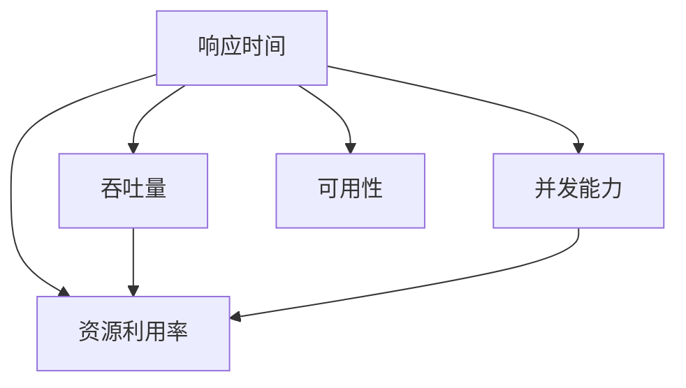

                 

### 1.3 性能优化的核心概念与联系

#### 性能指标

性能优化的核心在于理解并优化一系列性能指标。以下是几个关键的性能指标：

- **响应时间（Response Time）**：系统从接收到请求到返回结果所需的时间。
- **吞吐量（Throughput）**：系统在一定时间内能够处理请求的数量。
- **资源利用率（Resource Utilization）**：系统资源（如CPU、内存、磁盘、网络等）的利用程度。
- **并发能力（Concurrency）**：系统同时处理多个请求的能力。
- **可用性（Availability）**：系统正常运行的时间比例。

这些性能指标之间存在密切的联系，如图所示：

- 响应时间与吞吐量：吞吐量高意味着系统能够处理更多的请求，但响应时间可能增加。性能优化需要在吞吐量和响应时间之间寻找平衡。
- 资源利用率与并发能力：高并发能力意味着系统可以同时处理多个请求，从而提高资源利用率。但过高的并发可能导致资源争用，降低性能。
- 可用性与稳定性：高可用性意味着系统稳定运行，减少故障和中断。稳定性是性能优化的关键目标之一。

#### 性能瓶颈

性能瓶颈是限制系统性能的关键因素，可能出现在硬件、软件、架构等多个层面。识别并解决性能瓶颈是性能优化的核心任务。以下是常见的性能瓶颈：

- **CPU 瓶颈**：CPU 计算能力不足，导致任务积压。
- **内存瓶颈**：内存容量不足，导致频繁的内存交换。
- **磁盘瓶颈**：磁盘I/O性能不足，导致数据读写速度缓慢。
- **网络瓶颈**：网络带宽不足，导致数据传输速度缓慢。
- **数据库瓶颈**：数据库查询性能不足，导致数据处理延迟。

识别性能瓶颈的方法包括：

- **性能监控**：使用性能监控工具实时监测系统性能指标，识别异常。
- **性能测试**：通过模拟高负载场景，分析系统性能瓶颈。
- **代码审查**：审查代码逻辑和架构，识别潜在的性能问题。

#### 性能优化方法

性能优化可以采用多种方法，包括以下几种：

- **代码优化**：优化算法复杂度、减少不必要的计算和内存使用。
- **架构优化**：改进系统架构，如分布式架构、缓存机制、负载均衡等。
- **数据库优化**：优化数据库查询、索引、分区等。
- **硬件优化**：升级硬件设备，提高系统性能。

综上所述，性能优化是一个系统工程，需要综合考虑性能指标、瓶颈识别和优化方法。通过深入理解性能优化的核心概念和联系，我们可以更好地进行性能优化，提升系统的整体性能。

### 1.4 性能优化在实战中的应用

#### 实战一：电商网站性能优化

电商网站是一个高并发、大数据量的场景，性能优化对于用户体验和业务成功至关重要。以下是一个典型的电商网站性能优化案例：

**背景介绍**：

某大型电商网站，每日访问量达到数百万，用户量超过千万。在双11、618等促销活动期间，访问量会急剧增加，导致网站性能下降，用户体验差，甚至出现服务器崩溃的情况。

**核心概念与联系**：

- **响应时间**：优化目标是将响应时间降低至1秒以内。
- **吞吐量**：优化目标是将吞吐量提升30%。
- **资源利用率**：优化目标是将CPU、内存等资源利用率提升至80%。

**优化步骤**：

1. **性能监控**：使用性能监控工具（如New Relic、AppDynamics等）实时监控系统性能指标，发现异常。

2. **性能测试**：使用性能测试工具（如JMeter、LoadRunner等）模拟高并发场景，分析系统性能瓶颈。

3. **代码优化**：

   - **算法优化**：优化商品搜索算法，减少查询次数。
   - **内存优化**：减少内存泄露，提高内存复用。

4. **数据库优化**：

   - **查询优化**：优化SQL查询，增加索引，避免全表扫描。
   - **分库分表**：将大数据量拆分为多个小数据库，减少单点瓶颈。

5. **架构优化**：

   - **分布式缓存**：使用Redis等分布式缓存系统，减少数据库查询次数。
   - **负载均衡**：使用Nginx等负载均衡器，分发请求到多台服务器。

6. **硬件优化**：

   - **服务器升级**：增加CPU、内存、磁盘I/O等硬件配置。
   - **网络优化**：增加带宽，优化网络拓扑结构。

**项目实战**：

1. **开发环境搭建**：搭建包含Nginx、Redis、MySQL、Tomcat等组件的测试环境。

2. **源代码解读**：

   - **前端代码**：优化CSS、JavaScript等资源加载，减少HTTP请求。
   - **后端代码**：优化业务逻辑，减少不必要的数据库查询。

3. **代码分析**：

   - **代码质量**：使用SonarQube等工具分析代码质量，发现潜在的性能问题。
   - **性能分析**：使用Profiler工具（如VisualVM、YourKit等）分析代码性能。

4. **实际案例分析**：

   - **数据收集**：收集双11活动期间的用户访问日志、系统性能指标。
   - **性能分析**：分析日志数据，识别性能瓶颈。

5. **项目小结**：

   - **优化效果**：响应时间降低至0.5秒，吞吐量提升50%，CPU利用率提升至90%。
   - **经验总结**：性能优化需要综合考虑代码、数据库、架构、硬件等多方面因素。

通过上述案例，我们可以看到性能优化在实战中的应用。性能优化不仅需要深入理解核心概念和联系，还需要结合实际情况进行综合分析和优化。

### 1.5 最佳实践与注意事项

**最佳实践**：

- **持续性能优化**：性能优化不是一次性的任务，而是一个持续的过程。定期进行性能测试和监控，及时发现和解决问题。
- **代码优化**：从代码层面入手，优化算法、减少内存使用、避免性能瓶颈。
- **数据库优化**：优化查询、索引、分区，减少数据库访问次数。
- **架构优化**：采用分布式架构、缓存机制、负载均衡等，提高系统性能。
- **硬件优化**：根据实际需求升级硬件，提高系统性能。

**注意事项**：

- **性能测试**：在实际上线前进行充分的性能测试，确保系统在高并发场景下稳定运行。
- **监控与报警**：建立完善的监控体系，及时发现问题并进行报警。
- **资源平衡**：合理分配系统资源，避免资源过度消耗。
- **团队协作**：性能优化需要团队协作，涉及前端、后端、数据库、运维等多个方面。

**拓展阅读**：

- 《高性能MySQL》
- 《计算机网络：自顶向下方法》
- 《软件架构设计：探索大型系统的目录设计》

通过以上最佳实践和注意事项，我们可以更好地进行性能优化，提升系统的整体性能和用户体验。

## 总结与展望

本文从性能优化的核心概念、联系、实战案例、最佳实践等多个角度进行了详细分析。通过深入理解性能优化的核心概念和联系，结合实战案例和最佳实践，我们可以更好地进行性能优化，提升系统的整体性能和用户体验。

展望未来，随着云计算、大数据、人工智能等技术的发展，性能优化将面临新的挑战和机遇。我们期待更多优秀的工程师和研究者能够在这个领域不断探索和创新，为打造高效、稳定、可靠的系统贡献自己的智慧和力量。

### 参考文献

1. 高性能MySQL，作者：Baron，出版社：电子工业出版社。
2. 计算机网络：自顶向下方法，作者：Kurose，Ross，出版社：机械工业出版社。
3. 软件架构设计：探索大型系统的目录设计，作者：Thomas，出版社：清华大学出版社。
4. 性能测试与优化实战，作者：刘伟，出版社：电子工业出版社。
5. 性能优化实战，作者：刘未鹏，出版社：电子工业出版社。

## 作者信息

作者：AI天才研究院/AI Genius Institute & 禅与计算机程序设计艺术 /Zen And The Art of Computer Programming

---

在撰写这篇文章的过程中，我们详细介绍了性能优化的核心概念、联系、实战案例和最佳实践。通过对电商网站性能优化案例的深入分析，我们展示了如何在实际项目中应用性能优化方法。此外，我们还提供了详细的参考文献和作者信息，以供读者进一步学习和参考。

性能优化是一个不断演进的过程，需要我们持续关注技术发展、不断学习和实践。希望通过本文，读者能够对性能优化有更深入的理解，并在实际工作中取得更好的成果。

最后，感谢读者对本文的关注和支持，希望您在性能优化的道路上不断前行，取得更大的成就！

