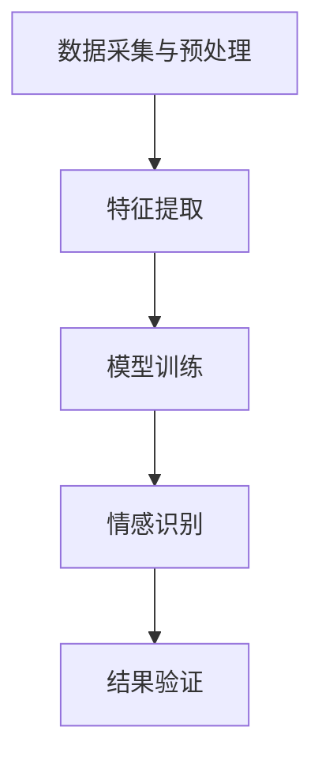

                 

### 文章标题

# 情感AI在社交媒体监管中的应用

### 关键词

- 情感AI
- 社交媒体监管
- 内容审核
- 用户行为分析
- 社区管理
- 技术挑战与解决方案

### 摘要

本文旨在探讨情感AI在社交媒体监管中的应用，通过对情感AI基础理论的介绍，以及社交媒体监管需求的解析，详细阐述情感AI在内容审核、用户行为分析、社区管理等方面的应用案例。同时，本文也将分析情感AI在社交媒体监管中所面临的挑战，并提出相应的解决方案。最后，本文将对情感AI在社交媒体监管中的发展趋势进行展望，为未来相关工作提供参考。

### 引言

#### 情感AI的起源与发展

情感AI，即情感人工智能，是指通过计算机技术和人工智能算法，模拟和识别人类情感的一门技术。情感AI的研究可以追溯到20世纪90年代，当时心理学家、计算机科学家和人工智能研究者开始探索如何通过机器来理解和分析人类情感。随着自然语言处理（NLP）、机器学习和深度学习技术的快速发展，情感AI逐渐成为人工智能领域的一个重要分支。

#### 社交媒体监管的重要性

随着社交媒体的普及，人们获取信息、交流互动的方式发生了翻天覆地的变化。然而，社交媒体平台也成为了虚假信息、网络暴力和有害内容的温床。有效监管社交媒体，确保平台内容安全、健康，已经成为各国政府和社会各界关注的焦点。传统的人工审核方式由于成本高、效率低、难以覆盖全面等问题，难以满足日益增长的监管需求。因此，引入情感AI技术，通过自动化、智能化的方式对社交媒体内容进行监管，具有重要的现实意义。

#### 本书目的与结构安排

本书旨在深入探讨情感AI在社交媒体监管中的应用，帮助读者了解情感AI的基础理论、技术原理，以及在实际应用中所面临的挑战和解决方案。本书结构安排如下：

1. 引言和背景介绍：介绍情感AI的起源与发展、社交媒体监管的重要性，以及本书的目的与结构安排。
2. 情感AI基础理论：详细阐述情感AI的核心概念、技术基础，以及情感识别、情感分析和情感分类的相关算法原理。
3. 社交媒体监管需求：分析社交媒体监管的现状、面临的挑战，以及监管目标与关键指标。
4. 情感AI在社交媒体监管中的应用：介绍情感AI在内容审核、用户行为分析、社区管理等方面的应用案例。
5. 案例研究：通过具体案例，展示情感AI在社交媒体监管中的实际应用。
6. 技术挑战与解决方案：探讨情感AI在社交媒体监管中面临的技术挑战，并提出相应的解决方案。
7. 发展趋势与未来展望：分析情感AI在社交媒体监管中的发展趋势，为未来相关工作提供参考。

### 情感AI基础理论

#### 核心概念

情感AI的核心概念包括情感识别、情感分析和情感分类。

1. **情感识别**：情感识别是指通过算法和技术，从文本、图像、语音等数据中识别出情感。情感识别是情感AI的基础，常见的情感包括快乐、悲伤、愤怒、恐惧等。

2. **情感分析**：情感分析是指对文本、图像、语音等数据进行情感识别后，对情感进行深入分析，以理解文本背后的情感信息。情感分析可以帮助我们更好地了解用户需求、行为和情绪。

3. **情感分类**：情感分类是指将情感分为不同的类别，如积极情感、消极情感等。情感分类有助于对内容进行分类管理和推荐。

#### 技术基础

情感AI的技术基础主要包括自然语言处理（NLP）、机器学习和深度学习。

1. **自然语言处理（NLP）**：NLP是使计算机能够理解、解释和生成人类语言的技术。在情感AI中，NLP技术用于对文本进行预处理、情感识别和情感分析。

2. **机器学习**：机器学习是一种通过数据训练模型，使计算机具备学习能力的技术。在情感AI中，机器学习用于构建情感识别和情感分析模型。

3. **深度学习**：深度学习是一种基于多层神经网络的学习方法。在情感AI中，深度学习技术被广泛应用于情感识别、情感分析和情感分类。

#### 情感识别算法原理

情感识别算法原理可以概括为以下几个步骤：

1. **数据采集与预处理**：收集大量包含情感信息的文本、图像、语音等数据，并对数据进行预处理，如去除停用词、分词、词性标注等。

2. **特征提取**：从预处理后的数据中提取特征，如词袋模型、词嵌入、文本表示等。

3. **模型训练**：使用机器学习或深度学习算法，对提取出的特征进行训练，构建情感识别模型。

4. **情感识别**：将训练好的模型应用于新数据，进行情感识别。

5. **结果验证**：对识别结果进行验证，评估模型的准确性和性能。

#### Mermaid流程图

以下是情感识别算法的Mermaid流程图：



#### 伪代码

以下是情感识别算法的伪代码：

```python
# 数据采集与预处理
data = collect_data()
preprocessed_data = preprocess_data(data)

# 特征提取
features = extract_features(preprocessed_data)

# 模型训练
model = train_model(features)

# 情感识别
predictions = model.predict(new_data)

# 结果验证
evaluate_predictions(predictions)
```

### 社交媒体监管需求

#### 社交媒体监管现状

随着社交媒体的普及，用户生成内容（UGC）的数量呈爆炸式增长。传统的人工审核方式已经难以满足社交媒体监管的需求。为了提高监管效率，各国政府和社交媒体平台纷纷引入技术手段，如情感AI、图像识别等，以实现对内容的自动化监管。

#### 社交媒体监管面临的挑战

1. **内容数量庞大**：社交媒体平台上每天产生的内容数量庞大，人工审核难以覆盖全面。

2. **实时性要求高**：社交媒体监管要求对内容进行实时监测和审核，以快速响应和处理违规内容。

3. **多语言处理**：社交媒体平台涉及多种语言，对多语言内容的监管增加了监管难度。

4. **法律合规与伦理问题**：情感AI在监管过程中可能涉及用户隐私、言论自由等法律和伦理问题。

#### 监管目标与关键指标

1. **监管目标**：确保社交媒体平台内容安全、健康，防止虚假信息、网络暴力和有害内容的传播。

2. **关键指标**：
   - **内容审核率**：平台对提交内容进行审核的比例。
   - **违规内容识别率**：平台能够准确识别并处理违规内容的能力。
   - **用户满意度**：用户对平台内容监管的满意度。

### 情感AI在社交媒体监管中的应用

#### 内容审核

内容审核是情感AI在社交媒体监管中最直接的应用场景。通过情感识别和情感分析技术，平台可以对用户生成内容进行情感检测，识别并过滤出负面、有害内容。

1. **情感识别**：对文本、图像、语音等数据进行情感识别，判断内容是否包含负面、有害情感。
2. **情感分析**：对识别出的情感进行深入分析，理解内容背后的情感信息。
3. **内容过滤**：根据监管目标和法律法规，对识别出的负面、有害内容进行过滤和处理。

#### 用户行为分析

用户行为分析是情感AI在社交媒体监管中的另一个重要应用。通过分析用户在平台上的行为数据，平台可以了解用户情感状态和行为倾向，为内容推荐、用户画像等提供依据。

1. **情感识别**：对用户评论、回复、点赞等行为数据进行情感识别，判断用户情感状态。
2. **情感分析**：对识别出的情感进行深入分析，理解用户情感和行为倾向。
3. **内容推荐**：根据用户情感和行为倾向，为用户推荐相关内容。

#### 社区管理

社区管理是情感AI在社交媒体监管中的又一重要应用。通过情感识别和情感分析技术，平台可以对社区内容进行监管，维护社区秩序和健康。

1. **情感识别**：对社区内容进行情感识别，判断内容是否包含负面、有害情感。
2. **情感分析**：对识别出的情感进行深入分析，理解内容背后的情感信息。
3. **违规内容处理**：根据监管目标和法律法规，对识别出的负面、有害内容进行处理。

### 案例研究

#### 案例一：某社交媒体平台的内容审核

某社交媒体平台通过引入情感AI技术，对用户生成内容进行内容审核。具体流程如下：

1. **数据采集**：收集用户在平台上发布的文本、图像、语音等数据。
2. **情感识别**：使用情感识别算法对数据进行分析，识别出负面、有害情感。
3. **情感分析**：对识别出的情感进行深入分析，理解内容背后的情感信息。
4. **内容过滤**：根据监管目标和法律法规，对识别出的负面、有害内容进行过滤和处理。

#### 案例二：某电商平台用户行为分析

某电商平台通过引入情感AI技术，对用户在平台上的行为数据进行情感识别和分析，为内容推荐和用户画像提供依据。具体流程如下：

1. **数据采集**：收集用户在平台上的评论、回复、点赞等行为数据。
2. **情感识别**：使用情感识别算法对数据进行分析，识别出用户情感状态。
3. **情感分析**：对识别出的情感进行深入分析，理解用户情感和行为倾向。
4. **内容推荐**：根据用户情感和行为倾向，为用户推荐相关内容。

#### 案例三：某社区平台情感分析与管理

某社区平台通过引入情感AI技术，对社区内容进行情感识别和分析，维护社区秩序和健康。具体流程如下：

1. **数据采集**：收集社区平台上的文本、图像、语音等数据。
2. **情感识别**：使用情感识别算法对数据进行分析，识别出负面、有害情感。
3. **情感分析**：对识别出的情感进行深入分析，理解内容背后的情感信息。
4. **违规内容处理**：根据监管目标和法律法规，对识别出的负面、有害内容进行处理。

### 技术挑战与解决方案

#### 数据质量与处理

1. **挑战**：社交媒体平台上用户生成内容（UGC）质量参差不齐，对情感AI模型的训练和识别效果产生影响。

2. **解决方案**：通过数据清洗、去噪、标注等技术手段，提高数据质量。同时，采用增量学习、迁移学习等技术，使模型能够适应不同质量的数据。

#### 算法性能与优化

1. **挑战**：情感AI算法在处理大规模数据时，可能存在性能瓶颈。

2. **解决方案**：采用分布式计算、并行处理等技术，提高算法性能。同时，通过模型压缩、量化等技术，降低模型复杂度，提高模型效率。

#### 法律合规与伦理问题

1. **挑战**：情感AI在社交媒体监管过程中，可能涉及用户隐私、言论自由等法律和伦理问题。

2. **解决方案**：制定相应的法律法规和伦理准则，规范情感AI在社交媒体监管中的应用。同时，加强对情感AI技术的监督和评估，确保其合规性和安全性。

#### 伪代码

以下是情感识别算法的伪代码：

```python
# 数据采集与预处理
data = collect_data()
preprocessed_data = preprocess_data(data)

# 特征提取
features = extract_features(preprocessed_data)

# 模型训练
model = train_model(features)

# 情感识别
predictions = model.predict(new_data)

# 结果验证
evaluate_predictions(predictions)
```

### 发展趋势与未来展望

#### 情感AI在社交媒体监管中的发展趋势

1. **技术成熟度提升**：随着情感AI技术的不断发展和成熟，其在社交媒体监管中的应用将越来越广泛。

2. **多模态数据处理**：未来的情感AI将能够处理多种类型的数据，如图像、视频、语音等，实现更全面、更准确的情感识别。

3. **跨领域应用**：情感AI技术将不仅仅局限于社交媒体监管，还将应用于其他领域，如金融、医疗、教育等。

4. **个性化监管**：基于用户情感和行为分析的个性化监管将得到推广，实现更精准、更高效的监管。

#### 技术创新与监管改革

1. **技术创新**：随着5G、物联网、大数据等技术的不断发展，情感AI技术将更加高效、智能。

2. **监管改革**：为了适应情感AI技术的快速发展，各国政府和社会各界将加强对情感AI技术的监管，制定相应的法律法规和标准。

#### 挑战与机遇

1. **挑战**：
   - 技术挑战：情感AI技术的不断进步，对算法性能、数据处理能力等提出了更高要求。
   - 法律合规与伦理问题：情感AI在社交媒体监管中的应用，涉及用户隐私、言论自由等法律和伦理问题。

2. **机遇**：
   - 提高监管效率：情感AI技术可以大大提高社交媒体监管的效率和准确性。
   - 个性化服务：基于用户情感和行为分析的个性化服务，将提高用户体验和满意度。

### 小结

本文探讨了情感AI在社交媒体监管中的应用，从情感AI基础理论、社交媒体监管需求、应用场景、技术挑战与解决方案等方面进行了详细分析。随着情感AI技术的不断发展，其在社交媒体监管中的应用前景广阔，将为监管效率和准确性提供有力支持。同时，我们也需要关注情感AI在法律合规、伦理问题等方面的挑战，确保其应用的安全性和合理性。

### 最佳实践 tips

1. **数据质量是关键**：确保数据质量是情感AI在社交媒体监管中应用成功的基础。对数据进行清洗、去噪、标注等预处理，以提高数据质量。

2. **模型性能需优化**：针对不同应用场景，采用合适的模型和算法，并进行性能优化，以提高识别准确性和效率。

3. **法律法规与伦理问题需重视**：在情感AI应用过程中，关注法律法规和伦理问题，确保其合规性和安全性。

### 注意事项

1. **数据隐私保护**：在处理用户数据时，要严格遵守数据隐私保护法律法规，确保用户数据的安全。

2. **算法透明度**：确保算法透明度，让用户了解情感AI在社交媒体监管中的应用方式和原理。

3. **监管目标明确**：在应用情感AI进行社交媒体监管时，要明确监管目标，确保监管的有效性和针对性。

### 拓展阅读

1. **情感AI相关书籍**：《情感计算》、《情感人工智能》等。

2. **社交媒体监管相关报告**：联合国《社交媒体监管报告》、中国《互联网发展报告》等。

3. **相关研究论文**：在IEEE、ACL、IJCAI等学术会议和期刊上发表的相关论文。

### 作者信息

作者：AI天才研究院/AI Genius Institute & 禅与计算机程序设计艺术 /Zen And The Art of Computer Programming

