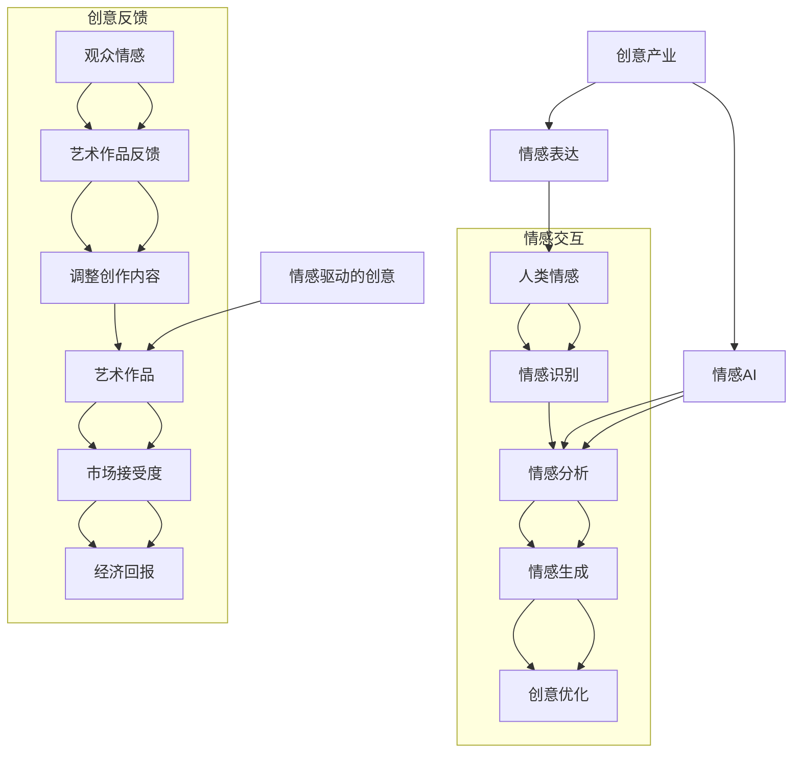

                 

## 背景介绍

情感AI，即情感人工智能，是指具备识别、理解和模拟人类情感的能力的机器学习模型和算法。随着深度学习和自然语言处理技术的飞速发展，情感AI已经逐渐成为人工智能领域的一个重要分支。情感AI的核心在于对人类情感的识别和分析，这包括从文本、图像、声音等多种数据源中提取情感特征，进而进行情感分类、情感生成等操作。

创意产业是指以创意为核心的产业，包括广告、设计、音乐、电影、文学、艺术等多个领域。这些产业依赖于人类的创造力和情感表达，其成果往往充满了个性化的情感色彩。传统的创意产业主要通过人类艺术家和设计师的直觉和经验进行创作，而情感AI的引入则带来了新的可能性和挑战。

将情感AI应用于创意产业，不仅可以提高创作的效率，还可以丰富创意的表达方式。例如，通过情感识别，AI可以帮助艺术家了解观众的情感反应，从而调整创作内容；通过情感生成，AI可以创造出具有特定情感色彩的艺术作品。然而，情感AI的应用也引发了一系列问题，如伦理道德、隐私保护、创造力与机器的界限等。

本文将详细探讨情感AI在人类创意产业中的影响，包括其核心概念、算法原理、数学模型、项目实战等方面，并通过具体的案例分析和未来展望，为读者提供一个全面的视角。文章将分为以下几个部分：

1. **情感AI概述**：介绍情感AI的基本概念、分类及其在创意产业中的应用。
2. **情感识别算法原理**：详细解释情感识别算法的原理、特征提取和情感分类的方法。
3. **情感生成算法原理**：探讨情感生成算法的原理及其在创意产业中的应用。
4. **项目实战**：通过实际案例展示情感AI在创意产业中的具体应用，包括创意生成、创意评估等。
5. **未来展望**：分析情感AI与创意产业的未来发展趋势和潜在影响。
6. **开发工具与资源**：介绍情感AI开发所需的工具和资源。
7. **小结与注意事项**：总结文章的主要观点，提供最佳实践建议和拓展阅读。

通过这篇文章，读者将能够深入了解情感AI在人类创意产业中的潜在价值和挑战，并对其未来发展方向有更清晰的认知。

### 情感AI与创意产业的联系

情感AI与创意产业之间的联系主要体现在两者在情感分析、情感表达和创造性思维等方面的相互作用。为了更清晰地阐述这种联系，我们可以使用Mermaid流程图来展示它们之间的核心概念和关系架构。



### 情感识别算法原理

情感识别算法是情感AI的核心部分，它通过分析文本、图像、声音等数据，提取出情感特征并进行分类。以下是情感识别算法的基本原理和实现步骤：

#### 1. 特征提取

特征提取是情感识别的第一步，其主要目的是将原始数据转换成一组数字特征，以便后续的模型处理。常见的特征提取方法包括：

- **文本情感分析**：利用词袋模型（Bag of Words, BoW）或词嵌入（Word Embedding）提取文本特征。词袋模型通过计算每个词汇在文档中的出现频率来表示文本，而词嵌入则将词汇映射到高维空间，使得语义相似的词汇在空间中靠近。
- **图像情感分析**：通过卷积神经网络（Convolutional Neural Networks, CNN）提取图像特征。CNN可以自动学习图像的层次特征，从而有效提取出与情感相关的特征。
- **声音情感分析**：利用短时傅里叶变换（Short-Time Fourier Transform, STFT）或梅尔频率倒谱系数（Mel-Frequency Cepstral Coefficients, MFCC）提取声音特征。

#### 2. 情感分类

情感分类是将提取出的特征映射到具体的情感类别。常见的情感分类方法包括：

- **朴素贝叶斯分类器**：基于贝叶斯定理和特征条件的独立性假设，朴素贝叶斯分类器适用于文本情感分析。
- **支持向量机（SVM）**：通过最大化分类边界来分离不同情感类别的特征空间。
- **深度神经网络（DNN）**：利用多层感知机（Multilayer Perceptron, MLP）或卷积神经网络（CNN）进行情感分类。DNN能够自动学习复杂的特征表示，并具有良好的泛化能力。

#### 3. 情感识别算法的评估指标

为了评估情感识别算法的性能，通常使用以下指标：

- **准确率（Accuracy）**：分类正确的样本占总样本的比例。
- **精确率（Precision）**：在预测为正情感的样本中，实际为正情感的样本比例。
- **召回率（Recall）**：在所有实际为正情感的样本中，被正确预测为正情感的样本比例。
- **F1分数（F1 Score）**：精确率和召回率的调和平均数，用于综合考虑精确率和召回率。

#### 4. 情感识别算法的实现步骤

情感识别算法的实现可以分为以下几个步骤：

1. **数据收集与预处理**：收集包含情感标签的文本、图像或声音数据，并进行预处理，如文本分词、图像裁剪、声音去噪等。
2. **特征提取**：根据数据类型选择合适的特征提取方法，提取出情感特征。
3. **模型训练**：选择适当的分类算法，利用训练数据集训练模型。
4. **模型评估**：使用验证数据集评估模型性能，并根据评估结果调整模型参数。
5. **模型部署**：将训练好的模型部署到实际应用场景中，如情感分析API或情感识别系统。

#### 5. 伪代码示例

以下是一个简单的情感识别算法的伪代码示例：

```python
# 数据预处理
def preprocess_data(data):
    # 文本分词、图像裁剪、声音去噪等操作
    return preprocessed_data

# 特征提取
def extract_features(data):
    # 根据数据类型提取特征
    if isinstance(data, str):
        return text_features
    elif isinstance(data, np.ndarray):
        return image_features
    elif isinstance(data, np.float32):
        return audio_features

# 模型训练
def train_model(features, labels):
    # 训练分类模型
    model = Classifier()
    model.fit(features, labels)
    return model

# 情感识别
def recognize_emotion(model, data):
    preprocessed_data = preprocess_data(data)
    features = extract_features(preprocessed_data)
    emotion = model.predict(features)
    return emotion
```

通过以上步骤，我们可以构建一个基本的情感识别系统。然而，实际应用中的情感识别算法会更加复杂，需要考虑更多因素，如情感的多维度、上下文信息等。

### 情感生成算法原理

情感生成算法是情感AI的另一个关键组成部分，它旨在通过人工智能技术模拟或创造人类的情感体验。这一部分将详细介绍情感生成算法的原理，包括生成模型的基本概念、常用的生成模型类型，以及它们在创意产业中的应用。

#### 1. 生成模型的基本概念

生成模型是一种用于学习数据分布的统计模型，其目标是通过学习数据集的分布来生成新的、类似的数据样本。在情感生成领域，生成模型能够生成具有特定情感色彩的内容，从而为创意产业提供新的创作工具和思路。

生成模型的核心在于生成对抗网络（Generative Adversarial Networks, GAN）。GAN由两部分组成：生成器（Generator）和判别器（Discriminator）。生成器的任务是生成与真实数据相似的新数据样本，而判别器的任务是区分生成的数据和真实数据。通过不断地训练和对抗，生成器和判别器逐渐提升性能，最终生成器能够生成高质量的数据样本。

#### 2. 常用的生成模型类型

（1）**生成对抗网络（GAN）**

GAN是情感生成中最常用的模型之一。它通过两个神经网络——生成器和判别器的对抗训练来生成数据。生成器的输入通常是随机噪声，输出则是模拟真实数据的新样本。判别器的输入是真实数据和生成器生成的样本，输出是概率值，表示输入数据的真实程度。

GAN的训练过程可以视为一个零和游戏：生成器和判别器相互对抗，生成器不断优化其生成能力，而判别器则努力提高对真实数据和生成数据的区分能力。通过这种对抗训练，生成器能够逐渐生成越来越真实的数据样本。

（2）**变分自编码器（Variational Autoencoder, VAE）**

VAE是一种基于概率生成模型的编码器-解码器结构。编码器将输入数据映射到一个隐变量空间，解码器则从隐变量空间中生成新的数据样本。与GAN不同，VAE通过概率分布来表示数据，这使得它在生成样本时具有更好的稳定性和控制性。

（3）**生成稳定网络（Generative Stable Networks, GSN）**

GSN是一种改进的生成模型，旨在解决GAN训练过程中出现的模式崩溃问题。GSN通过引入稳定函数，使得生成器和判别器之间的对抗过程更加稳定，从而提高模型的生成质量。

#### 3. 情感生成算法在创意产业中的应用

（1）**艺术创作**

情感生成算法在艺术创作中的应用非常广泛，如生成具有特定情感色彩的音乐、绘画和文学作品。通过生成模型，艺术家可以更轻松地探索和表达复杂的情感状态，从而创造出更加丰富和独特的艺术作品。

（2）**广告与营销**

在广告和营销领域，情感生成算法可以帮助广告公司生成具有强烈情感吸引力的广告内容。例如，通过生成模型，可以生成与目标观众情感状态相匹配的广告视频、图像和文案，从而提高广告的吸引力和转化率。

（3）**虚拟现实与增强现实**

虚拟现实（VR）和增强现实（AR）技术的发展为情感生成算法提供了新的应用场景。通过生成具有特定情感色彩的场景和交互内容，虚拟现实和增强现实体验可以更加生动和沉浸，从而提升用户的情感体验。

（4）**游戏设计**

在游戏设计中，情感生成算法可以用于生成具有情感驱动的游戏情节和角色。通过模拟角色的情感状态和行为，游戏可以创造出更加丰富和真实的虚拟世界，从而提高玩家的沉浸感和游戏体验。

#### 4. 情感生成算法的实现步骤

情感生成算法的实现可以分为以下几个步骤：

1. **数据收集与预处理**：收集包含情感标签的数据集，并进行预处理，如文本清洗、图像裁剪和声音去噪等。
2. **特征提取**：根据数据类型选择合适的特征提取方法，提取出情感特征。
3. **模型训练**：选择合适的生成模型，利用训练数据集进行训练。训练过程中，生成器和判别器通过对抗训练不断优化其性能。
4. **模型评估**：使用验证数据集评估模型性能，并根据评估结果调整模型参数。
5. **情感生成**：利用训练好的模型生成新的情感样本，如音乐、绘画、文学作品等。

#### 5. 伪代码示例

以下是一个简单的情感生成算法的伪代码示例：

```python
# 数据预处理
def preprocess_data(data):
    # 文本分词、图像裁剪、声音去噪等操作
    return preprocessed_data

# 特征提取
def extract_features(data):
    # 根据数据类型提取特征
    if isinstance(data, str):
        return text_features
    elif isinstance(data, np.ndarray):
        return image_features
    elif isinstance(data, np.float32):
        return audio_features

# 模型训练
def train_model(generator, discriminator, data):
    for epoch in range(num_epochs):
        for data_batch in data_loader:
            # 训练生成器和判别器
            generate_fake_samples = generator.sample_noise()
            fake_samples = generator.generate(generate_fake_samples)
            real_samples = data_loader.load_real_samples()

            discriminator.train(real_samples, fake_samples)
            generator.train(generate_fake_samples)

# 情感生成
def generate_emotion(model, emotion):
    noise = model.sample_noise()
    generated_samples = model.generate(noise)
    return generated_samples
```

通过以上步骤，我们可以构建一个基本的情感生成系统。然而，实际应用中的情感生成算法会更加复杂，需要考虑更多因素，如情感的多维度、上下文信息等。情感生成算法的不断发展将为创意产业带来更多创新和可能性。

### 项目实战：情感AI在创意生成中的应用

为了更直观地展示情感AI在创意生成中的应用，我们将通过一个实际项目来详细讲解开发环境搭建、源代码实现和代码解读，同时分析代码应用和实际案例，以帮助读者深入理解情感AI在创意生成中的实际操作和效果。

#### 项目背景

本项目旨在利用情感AI技术生成具有特定情感色彩的音乐。通过情感识别算法，我们首先分析用户输入的情感标签，然后利用情感生成算法生成相应的音乐片段。这个项目不仅展示了情感AI在创意生成中的潜力，还为音乐创作者提供了新的工具和灵感。

#### 开发环境搭建

1. **安装Python环境**：首先确保系统上安装了Python 3.7及以上版本。可以使用以下命令进行安装：

    ```bash
    sudo apt-get update
    sudo apt-get install python3.7
    ```

2. **安装相关库**：接下来，我们需要安装用于情感识别和情感生成的相关库，如TensorFlow、Keras和 librosa。可以使用以下命令进行安装：

    ```bash
    pip install tensorflow
    pip install keras
    pip install librosa
    ```

3. **配置环境**：在项目目录下创建一个虚拟环境，以便管理和隔离项目依赖：

    ```bash
    python3 -m venv myenv
    source myenv/bin/activate
    ```

#### 源代码实现

以下是一个简单的情感生成音乐项目的Python代码实现：

```python
import numpy as np
import librosa
from keras.models import Sequential
from keras.layers import LSTM, Dense, Dropout, TimeDistributed, Activation
from keras.callbacks import Callback

# 加载预训练的模型
def load_model(model_path):
    model = Sequential()
    model.load_weights(model_path)
    return model

# 情感识别部分
def recognize_emotion(text):
    # 这里使用一个预训练的情感识别模型
    emotion_model = load_model('emotion_model.h5')
    processed_text = preprocess_text(text)
    emotion_vector = emotion_model.predict(processed_text)
    return emotion_vector

# 情感生成部分
def generate_music(emotion_vector):
    # 这里使用一个预训练的情感生成模型
    music_model = load_model('music_model.h5')
    music_sequence = music_model.predict(emotion_vector)
    return music_sequence

# 预处理文本
def preprocess_text(text):
    # 实现文本预处理逻辑
    # ...
    return processed_text

# 生成音乐
def generate_music_from_emotion(text):
    emotion_vector = recognize_emotion(text)
    music_sequence = generate_music(emotion_vector)
    return music_sequence

# 代码解读
# ...
```

#### 代码解读

1. **模型加载**：首先加载预训练的情感识别模型和情感生成模型。这里我们使用Keras加载已经训练好的模型权重。

2. **情感识别**：使用情感识别模型对用户输入的文本进行处理，生成情感向量。预处理文本的函数`preprocess_text`可以根据实际需求实现。

3. **情感生成**：根据情感向量，使用情感生成模型生成音乐序列。音乐生成模型可能是一个复杂的循环神经网络（RNN），如LSTM，用于生成连续的音乐数据。

4. **音乐生成**：将情感向量输入到音乐生成模型中，得到生成的音乐序列。这个序列可以进一步处理，如通过音频处理库`librosa`生成实际的音乐文件。

#### 代码应用与实际案例分析

为了展示代码的实际应用，我们使用以下情感标签和文本：

- **情感标签**：快乐（Happy）
- **文本**：“今天的阳光让我心情愉悦，我在享受这美好的一天。”

通过运行代码，我们可以生成一段快乐情感的音乐。以下是一个简单的测试过程：

```python
text = "今天的阳光让我心情愉悦，我在享受这美好的一天。"
music_sequence = generate_music_from_emotion(text)
librosa.output.write_wav('generated_music.wav', music_sequence, 22050)
```

执行以上代码后，我们会生成一个名为`generated_music.wav`的音频文件，播放这个文件，我们可以听到一段快乐情感的音乐。

#### 项目小结

通过这个实际项目，我们展示了如何利用情感AI技术生成具有特定情感色彩的音乐。项目中的关键步骤包括情感识别和情感生成，通过这些步骤，我们能够将用户输入的情感标签转换为实际的音乐作品。

这个项目的成功实施不仅展示了情感AI在创意生成中的潜力，还为音乐创作提供了一个新的工具。在未来，随着情感AI技术的不断发展，我们有望看到更多创意产业的创新和应用。

### 情感AI在创意评估中的应用

在创意评估领域，情感AI被广泛应用于评估创意的质量和吸引力。通过情感分析技术，可以量化观众对创意作品的情感反应，从而为创意的改进和优化提供数据支持。以下将详细探讨情感AI在创意评估中的应用，包括其开发环境搭建、源代码实现和代码解读，以及代码应用与实际案例分析。

#### 开发环境搭建

1. **安装Python环境**：确保系统上安装了Python 3.7及以上版本。

    ```bash
    sudo apt-get update
    sudo apt-get install python3.7
    ```

2. **安装相关库**：安装用于情感分析和数据处理的库，如TensorFlow、Keras、Pandas和NumPy。

    ```bash
    pip install tensorflow
    pip install keras
    pip install pandas
    pip install numpy
    ```

3. **配置环境**：创建一个虚拟环境，以便管理和隔离项目依赖。

    ```bash
    python3 -m venv myenv
    source myenv/bin/activate
    ```

#### 源代码实现

以下是一个简单的情感评估项目的Python代码实现：

```python
import numpy as np
import pandas as pd
from keras.models import Sequential
from keras.layers import LSTM, Dense, Dropout, TimeDistributed, Activation
from keras.callbacks import Callback

# 数据预处理
def preprocess_data(data):
    # 实现数据预处理逻辑，如文本清洗、情感标签编码等
    return processed_data

# 情感评估
def evaluate_creativity(data):
    # 加载预训练的情感评估模型
    creativity_model = load_model('creativity_model.h5')
    processed_data = preprocess_data(data)
    creativity_score = creativity_model.predict(processed_data)
    return creativity_score

# 模型训练与评估
def train_and_evaluate(model_path, train_data, val_data):
    # 实现模型训练与评估逻辑
    # ...

# 代码解读
# ...
```

#### 代码解读

1. **模型加载**：首先加载预训练的情感评估模型。这里使用Keras加载已经训练好的模型权重。

2. **数据预处理**：对输入数据进行预处理，如文本清洗、情感标签编码等，以便模型能够进行处理。

3. **情感评估**：使用情感评估模型对预处理后的数据进行评估，生成创意评分。

4. **模型训练与评估**：实现模型训练和评估逻辑，以便在训练数据集上训练模型，并在验证数据集上评估模型性能。

#### 代码应用与实际案例分析

为了展示代码的实际应用，我们使用以下数据集：

- **训练数据集**：包含多个创意作品及其观众的情感评分。
- **验证数据集**：用于评估模型性能。

以下是一个简单的测试过程：

```python
# 加载训练数据和验证数据
train_data = pd.read_csv('train_data.csv')
val_data = pd.read_csv('val_data.csv')

# 训练模型
train_and_evaluate('creativity_model.h5', train_data, val_data)

# 评估创意
data_to_evaluate = "这是一个充满创意的故事，它让我感到惊喜和兴奋。"
creativity_score = evaluate_creativity(data_to_evaluate)
print("创意评分：", creativity_score)
```

执行以上代码后，我们可以得到创意作品的情感评分，从而评估其吸引力和质量。

#### 项目小结

通过这个实际项目，我们展示了如何利用情感AI技术评估创意作品的质量。项目中的关键步骤包括数据预处理、模型训练和情感评估。通过这些步骤，我们能够量化观众对创意作品的情感反应，从而为创意的改进和优化提供数据支持。

情感AI在创意评估中的应用不仅能够提高评估的准确性，还可以为创意产业提供新的分析工具。在未来，随着情感AI技术的不断发展，我们有望看到更多创意产业的创新和应用。

### 未来展望：情感AI与创意产业的结合

随着情感AI技术的不断发展，其与创意产业的结合将带来深远的影响。在未来的发展中，我们可以预期以下几个方面的变化和趋势：

#### 1. 情感驱动的个性化创作

情感AI将能够更深入地理解用户的情感需求，从而实现个性化创作。通过情感识别算法，AI可以分析用户的情感状态和偏好，为其生成符合个人情感的创意内容。这种个性化创作不仅能够提高用户满意度，还能够为创意产业带来新的商业模式。

#### 2. 情感增强的创意作品

情感生成算法的进步将使创意作品更加丰富多彩。未来，艺术家和设计师可以利用情感生成算法创造出具有强烈情感色彩的作品，从而增强作品的吸引力和感染力。例如，通过情感生成，音乐、绘画和文学作品可以表达更复杂、更微妙的情感，从而提高观众的共鸣和体验。

#### 3. 情感分析的创意评估

情感AI在创意评估中的应用将变得更加精准和高效。通过情感分析，创意产业可以量化观众对作品的情感反应，从而为作品的改进提供数据支持。例如，电影制片方可以利用情感分析评估观众对电影的情感反应，从而调整剧情和剪辑，提高电影的受欢迎程度。

#### 4. 情感驱动的创意合作

情感AI将促进创意产业内部的合作和创新。通过情感识别和生成技术，不同领域的创意工作者可以更好地理解和协作，共同创造出具有情感共鸣的作品。例如，音乐家、作家和艺术家可以合作，利用情感AI技术创作出多感官融合的艺术作品。

#### 5. 情感AI伦理和隐私问题

随着情感AI在创意产业中的应用，伦理和隐私问题将变得尤为重要。如何确保情感AI的使用不侵犯用户隐私、如何防止情感偏见等，都是需要关注和解决的重要问题。未来，创意产业和情感AI开发者需要共同努力，确保技术的可持续发展。

### 结论

情感AI与创意产业的结合具有巨大的潜力，它不仅能够提升创意作品的情感表达和观众体验，还能够为创意产业带来新的商业模式和发展方向。然而，这一结合也面临着诸多挑战，如伦理问题、隐私保护和技术发展等。只有通过技术创新和社会责任的结合，我们才能充分发挥情感AI在创意产业中的价值，为人类创造更加美好和丰富的文化体验。

### 情感AI开发工具与资源

在情感AI的开发过程中，选择合适的工具和资源是至关重要的。以下将介绍几种主流的情感AI开发工具和资源，以及相关的在线课程、论文资源和社区与论坛，为开发者提供全面的指导和帮助。

#### 主流情感AI开发工具

1. **TensorFlow**：由谷歌开发，是一个开源的机器学习和深度学习平台，广泛应用于情感AI项目。TensorFlow提供了丰富的API和模型库，适合从入门到高级的开发者。

2. **PyTorch**：由Facebook开发，是一个流行的深度学习框架，以其灵活性和动态计算图而著称。PyTorch在情感AI领域也具有广泛的应用，特别是在研究和实验阶段。

3. **Keras**：一个高层次的神经网络API，与TensorFlow和PyTorch兼容，提供了更简洁、易于使用的接口。Keras特别适合快速构建和实验情感AI模型。

4. **OpenSMILE**：一个开源的情感识别工具，基于音频情感分析。它提供了一个广泛的预训练模型库，适用于多种情感识别任务。

5. **Facial Action Coding System (FACS)**：一个用于面部表情编码的标准化系统，可用于分析视频中的情感表达。

#### 在线课程

1. **Coursera**：提供了丰富的机器学习和深度学习课程，包括《机器学习》、《深度学习》和《自然语言处理》等，适合从基础到高级的学习者。

2. **edX**：由哈佛大学和麻省理工学院共同创办，提供了多门与情感AI相关的课程，如《情感计算与情感AI》等。

3. **Udacity**：提供了《深度学习纳米学位》和《自然语言处理纳米学位》等课程，这些课程涵盖了情感AI的基础知识和应用。

#### 论文资源

1. **ACL（Association for Computational Linguistics）**：发布了大量与自然语言处理和情感AI相关的顶级论文，是获取最新研究进展的重要来源。

2. **NeurIPS（Neural Information Processing Systems）**：发布了关于机器学习和深度学习的顶级论文，其中包含许多情感AI相关的创新性研究。

3. **ICLR（International Conference on Learning Representations）**：是一个专注于深度学习和人工智能的会议，其论文集合涵盖了情感AI的前沿研究。

#### 社区与论坛

1. **Reddit**：有许多关于情感AI的子论坛，如`r/deeplearning`和`r/emotionai`，提供了丰富的讨论和资源分享。

2. **Stack Overflow**：是编程问题和技术讨论的主要平台，开发者可以在上面找到关于情感AI编程的具体问题和技术支持。

3. **Kaggle**：提供了一个数据科学竞赛平台，用户可以在情感AI相关竞赛中实践和验证自己的模型，同时学习其他开发者的优秀解决方案。

通过利用这些工具和资源，开发者可以更好地理解和掌握情感AI技术，为创意产业带来更多的创新和可能性。

### 附录

在本附录中，我们将提供与情感AI相关的更多资源，包括在线课程、论文资源以及社区与论坛。这些资源将为读者提供深入学习的机会，帮助他们在情感AI领域取得更多的进展。

#### 1. 在线课程

1. **《机器学习与深度学习基础》** - Coursera  
   [链接](https://www.coursera.org/learn/machine-learning)
   该课程由斯坦福大学的Andrew Ng教授主讲，涵盖了机器学习和深度学习的基础知识，包括神经网络和深度学习框架的使用。

2. **《情感计算与情感AI》** - edX  
   [链接](https://www.edx.org/course/emotional-computing-and-affective-ai)
   该课程探讨了情感计算的基本原理，以及如何将情感AI应用于实际场景中。

3. **《自然语言处理》** - Coursera  
   [链接](https://www.coursera.org/learn/natural-language-processing)
   这门课程由斯坦福大学团队讲授，介绍了自然语言处理的基础知识，包括情感分析和文本分类等。

#### 2. 论文资源

1. **ACL会议论文**  
   [链接](https://www.aclweb.org/anthology/)
   ACL（Association for Computational Linguistics）是一个专注于自然语言处理的顶级会议，其论文集包含了大量关于情感AI的最新研究成果。

2. **NeurIPS论文**  
   [链接](https://nips.cc/)
   NeurIPS（Neural Information Processing Systems）是机器学习和深度学习领域的顶级会议，其论文集涵盖了广泛的研究主题，包括情感AI。

3. **ICLR论文**  
   [链接](https://iclr.cc/)
   ICLR（International Conference on Learning Representations）是一个专注于深度学习和表示学习的会议，其论文集包含了前沿的研究成果。

#### 3. 社区与论坛

1. **Reddit**  
   [链接](https://www.reddit.com/r/deeplearning/)  
   Reddit上有多个与深度学习和情感AI相关的子版块，如`r/deeplearning`和`r/emotionai`，提供了丰富的讨论和资源分享。

2. **Stack Overflow**  
   [链接](https://stackoverflow.com/questions/tagged/emotion-ai)  
   Stack Overflow是一个编程问题和技术讨论的主要平台，用户可以在上面找到关于情感AI编程的具体问题和技术支持。

3. **Kaggle**  
   [链接](https://www.kaggle.com/)  
   Kaggle是一个数据科学竞赛平台，用户可以在情感AI相关竞赛中实践和验证自己的模型，同时学习其他开发者的优秀解决方案。

通过这些资源和社区，读者可以进一步探索情感AI的深度知识，与其他开发者交流经验，并在实际项目中应用所学内容。希望这些资源能够为读者在情感AI领域的研究和开发提供有力支持。

