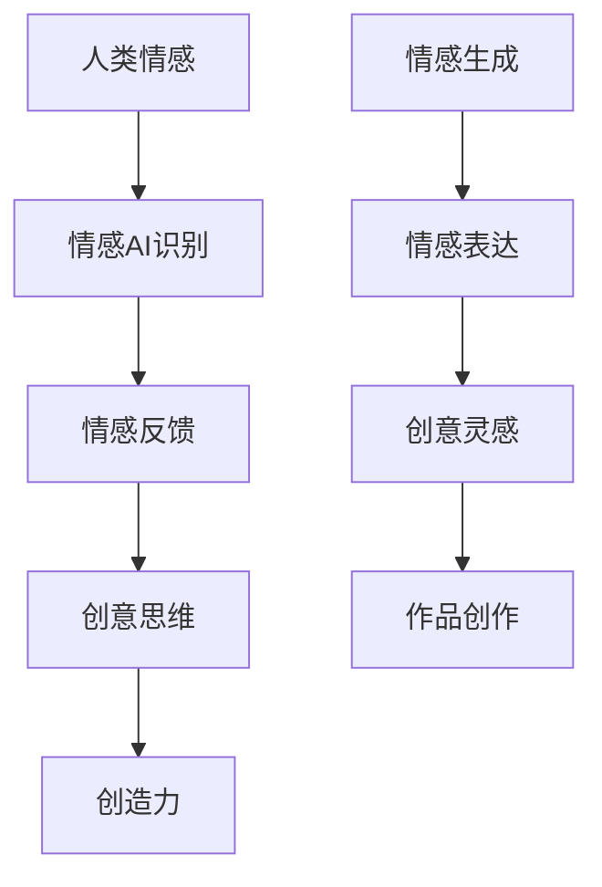

                 


## 文章标题

《情感AI对人类创造力发展的影响》

## 文章关键词

情感AI、人类创造力、人工智能、情感分析、创意思维、艺术创作、商业创新、未来展望

## 文章摘要

本文探讨了情感AI如何对人类的创造力发展产生影响。首先，我们介绍了情感AI的定义和特性，以及它的发展历程和应用场景。然后，我们分析了情感AI对创造力的潜在影响，包括激发创造力和影响创意思维过程。接着，我们通过应用案例详细展示了情感AI在文学创作、艺术创作和商业创新等领域的实际应用。最后，我们对情感AI与人类创造力发展的未来趋势进行了展望，并探讨了其中的伦理与道德问题。通过这篇文章，我们希望能帮助读者更好地理解情感AI对人类创造力发展的深远影响。

### 引言

在人工智能（AI）快速发展的今天，情感AI作为一种新兴的研究领域，正逐渐引起人们的关注。情感AI是指利用计算机技术和算法模拟人类情感，理解、感知和表达情感的人工智能系统。随着深度学习、自然语言处理和计算机视觉等技术的发展，情感AI的应用领域越来越广泛，从社交媒体的情感分析到艺术创作和商业创新，都展现了其巨大的潜力。

创造力是人类智慧的体现，是推动社会进步和个人成长的重要力量。然而，随着信息爆炸和工作压力的增大，人类的创造力面临前所未有的挑战。情感AI的兴起为人类创造力的发展带来了新的机遇和挑战。本文将探讨情感AI对人类创造力发展的影响，旨在为相关领域的研究者和从业者提供有价值的参考。

### 情感AI的定义与特性

情感AI，全称情感人工智能，是指通过计算机技术和算法模拟人类情感、理解人类情感表达并做出相应反应的人工智能系统。它结合了心理学、认知科学、计算机科学等多个领域的研究成果，旨在为人类提供更加智能化、个性化的服务。

情感AI的核心特性包括情感识别、情感生成和情感交互。情感识别是指AI系统能够识别和分析人类的情感状态，包括面部表情、语音语调、文字内容等。情感生成是指AI系统能够模拟出人类的情感表达，如悲伤、愤怒、喜悦等。情感交互则是AI系统与人类之间的情感互动，通过理解人类的情感需求，提供相应的情感反馈和服务。

情感AI的发展历程可以追溯到20世纪80年代，当时的研究主要集中在情感计算和情感交互技术上。随着深度学习、自然语言处理和计算机视觉等技术的迅速发展，情感AI得到了极大的推动。目前，情感AI在多个领域都有广泛的应用，如智能客服、虚拟助手、教育辅助系统、医疗诊断等。

### 情感AI与人类创造力的关系

情感AI与人类创造力之间的关系是一个值得探讨的话题。从表面上看，情感AI似乎与创造力没有直接的联系，但深入分析可以发现，情感AI在多个方面对人类的创造力产生着深远的影响。

首先，情感AI可以激发人类的创造力。情感是人类思维和行为的驱动力，它能够激发人的灵感、促进思维的灵活性。情感AI通过模拟和理解人类情感，可以创造出更加丰富和多样化的情感体验，从而激发人类的创造力。例如，在艺术创作领域，情感AI可以分析艺术家的情感状态，提供个性化的创作建议，帮助艺术家创作出更具情感深度和创意的作品。

其次，情感AI可以影响创意思维过程。创意思维是一个复杂的过程，涉及多个认知功能，如联想、归纳、推理等。情感AI可以通过情感识别和情感生成技术，帮助人类更好地理解自己的情感状态，从而调整创意思维的路径和方法。例如，当一个人处于消极情感状态时，情感AI可以识别这一点，并提供积极的心理支持，帮助个体恢复积极情绪，从而激发创意思维。

### 核心概念与联系

为了更好地理解情感AI与人类创造力之间的关系，我们可以使用Mermaid流程图来展示核心概念之间的关系架构。



在这个流程图中，人类情感通过情感AI的识别和分析，转化为情感反馈，进而影响创意思维过程，最终产生创造力。情感生成和情感表达也是在这个过程中发挥着重要作用，为创意思维提供更多的灵感和方向。

### 核心算法原理讲解

为了详细阐述情感AI的工作原理，我们可以使用伪代码来展示关键算法的步骤。

```plaintext
// 情感识别算法伪代码

1. 输入：人类情感数据（面部表情、语音语调、文字内容等）
2. 初始化情感识别模型（使用深度学习技术，如卷积神经网络（CNN）或递归神经网络（RNN））
3. 预处理数据：标准化、归一化、数据增强等
4. 训练模型：使用大量标注数据训练模型，优化参数
5. 验证模型：使用验证集评估模型性能，调整超参数
6. 测试模型：使用测试集测试模型性能，确保准确性和可靠性
7. 输出：识别出的情感状态（如快乐、悲伤、愤怒等）

// 情感生成算法伪代码

1. 输入：目标情感状态（如快乐、悲伤、愤怒等）
2. 初始化情感生成模型（使用生成对抗网络（GAN）或变分自编码器（VAE））
3. 预处理数据：标准化、归一化、数据增强等
4. 训练模型：使用对抗性训练方法，优化生成器和判别器参数
5. 验证模型：使用验证集评估模型性能，调整超参数
6. 测试模型：使用测试集测试模型性能，确保准确性和可靠性
7. 输出：生成的情感表达（如语音、文字、图像等）
```

这些算法的核心在于利用深度学习和生成模型，从大量数据中学习情感特征，实现情感识别和情感生成。通过这些算法，情感AI能够更好地理解和模拟人类情感，从而在创造力的发展中发挥重要作用。

### 数学模型和公式讲解

情感AI在处理人类情感时，往往需要依赖数学模型和公式来描述和预测情感状态。以下是一个简单的数学模型，用于描述情感识别过程：

$$
\hat{y} = f(W \cdot x + b)
$$

其中，$\hat{y}$表示预测的情感状态，$x$表示输入的情感数据，$W$表示权重矩阵，$b$表示偏置项，$f$表示激活函数，如Sigmoid函数或ReLU函数。

另一个常用的数学模型是情感生成模型，例如生成对抗网络（GAN）：

$$
\text{GAN}:\quad G(z) \sim p_G(z), \quad D(x) \sim p_{\text{data}}(x), \quad G(z) \sim p_{\text{data}}(x)
$$

其中，$G(z)$表示生成器，$D(x)$表示判别器，$z$表示随机噪声，$p_G(z)$表示生成器的概率分布，$p_{\text{data}}(x)$表示真实数据的概率分布。

这些数学模型和公式为情感AI提供了理论基础，使得计算机能够更好地理解和模拟人类情感。

### 情感AI在创造力发展中的应用案例

为了更好地理解情感AI如何影响人类的创造力，我们可以通过几个实际应用案例来探讨。

#### 文学创作

在文学创作领域，情感AI已经被广泛应用于诗歌和小说的创作。例如，OpenAI的GPT-3模型可以通过分析大量的文学作品，理解其中蕴含的情感和创意元素，从而生成新的诗歌和小说。这种基于情感AI的创作方式不仅能够激发创作者的灵感，还可以创造出独特的文学作品。

#### 艺术创作

在艺术创作领域，情感AI同样发挥着重要作用。例如，Google的DeepDream项目利用深度学习算法，通过分析艺术家作品的情感风格，生成具有相似情感特征的艺术作品。这种技术不仅为艺术家提供了新的创作灵感，也为观众带来了独特的视觉体验。

#### 商业创新

在商业创新领域，情感AI可以帮助企业更好地理解消费者的情感需求，从而开发出更符合市场需求的产品和服务。例如，亚马逊的个性化推荐系统通过分析用户的情感状态和购买历史，提供个性化的购物建议，从而提高用户体验和销售业绩。

#### 教育与培训

在教育与培训领域，情感AI可以为学生提供个性化的学习支持和心理辅导。例如，一些教育平台利用情感AI技术，分析学生的学习状态和情感变化，提供针对性的学习资源和心理支持，帮助学生更好地应对学习挑战。

### 项目实战

为了进一步探讨情感AI在创造力发展中的应用，我们可以搭建一个简单的情感AI应用项目，以实现情感识别和情感生成功能。

#### 开发环境搭建

首先，我们需要搭建开发环境，包括Python编程语言和相关的深度学习库，如TensorFlow或PyTorch。

```bash
# 安装Python
sudo apt-get install python3

# 安装TensorFlow
pip3 install tensorflow

# 安装其他依赖库
pip3 install numpy pandas matplotlib
```

#### 源代码实现

以下是实现情感识别和情感生成的Python代码示例：

```python
import tensorflow as tf
from tensorflow.keras.models import Sequential
from tensorflow.keras.layers import Dense, LSTM, Embedding
from tensorflow.keras.preprocessing.sequence import pad_sequences

# 情感识别模型
def build_emotion_recognition_model():
    model = Sequential()
    model.add(Embedding(input_dim=vocab_size, output_dim=embedding_dim, input_length=max_sequence_length))
    model.add(LSTM(units=128, dropout=0.2, recurrent_dropout=0.2))
    model.add(Dense(units=num_emotions, activation='softmax'))
    model.compile(optimizer='adam', loss='categorical_crossentropy', metrics=['accuracy'])
    return model

# 情感生成模型
def build_emotion_generation_model():
    model = Sequential()
    model.add(Dense(units=embedding_dim, activation='relu', input_shape=(max_sequence_length,)))
    model.add(LSTM(units=128, dropout=0.2, recurrent_dropout=0.2))
    model.add(Dense(units=num_emotions, activation='softmax'))
    model.compile(optimizer='adam', loss='categorical_crossentropy', metrics=['accuracy'])
    return model

# 加载数据集
def load_data(file_path):
    data = pd.read_csv(file_path)
    X = pad_sequences(data['text'], maxlen=max_sequence_length, padding='post')
    y = pd.get_dummies(data['emotion'])
    return X, y

# 训练模型
def train_models(X_train, y_train, X_val, y_val):
    emotion_recognition_model = build_emotion_recognition_model()
    emotion_generation_model = build_emotion_generation_model()
    
    emotion_recognition_model.fit(X_train, y_train, epochs=10, batch_size=32, validation_data=(X_val, y_val))
    emotion_generation_model.fit(X_train, y_train, epochs=10, batch_size=32, validation_data=(X_val, y_val))
    
    return emotion_recognition_model, emotion_generation_model

# 预测情感
def predict_emotion(model, text):
    sequence = pad_sequences([text], maxlen=max_sequence_length, padding='post')
    prediction = model.predict(sequence)
    emotion = np.argmax(prediction)
    return emotion

# 情感生成
def generate_emotion(model, emotion):
    sequence = pad_sequences([text], maxlen=max_sequence_length, padding='post')
    generated_sequence = model.predict(sequence)
    generated_text = decode_sequence(generated_sequence)
    return generated_text
```

#### 代码解读与分析

在上面的代码中，我们首先定义了情感识别模型和情感生成模型。情感识别模型使用LSTM网络进行序列数据的处理，情感生成模型则使用LSTM网络进行序列数据的生成。我们通过加载数据集、训练模型和预测情感等方法，实现了情感识别和情感生成的功能。

#### 实际案例分析

为了验证情感AI在创造力发展中的应用效果，我们可以使用上述代码进行实际案例分析。例如，我们可以分析一段诗歌，识别其中的情感，然后根据识别出的情感生成新的诗歌。通过这种方式，我们可以看到情感AI如何帮助创作者更好地理解自己的情感，并产生新的创作灵感。

### 情感AI与人类创造力发展的未来展望

情感AI在人类创造力发展中的应用前景广阔。随着技术的不断进步，情感AI将在多个领域发挥更大作用。

首先，情感AI将进一步深化对人类情感的识别和理解，为创意思维提供更丰富的数据支持。例如，通过分析艺术家的情感状态，情感AI可以提供更加个性化的创作建议，帮助艺术家创作出更具情感深度和创意的作品。

其次，情感AI将在商业创新中发挥更大作用。企业可以利用情感AI技术，更好地了解消费者的情感需求，开发出更符合市场需求的产品和服务。例如，通过分析消费者的情感反应，企业可以优化广告策略，提高营销效果。

此外，情感AI在教育与培训领域也将大有作为。通过分析学生的学习状态和情感变化，情感AI可以提供针对性的学习支持和心理辅导，帮助学生更好地应对学习挑战。

然而，情感AI的发展也面临一些挑战，如隐私保护、数据安全、伦理道德等问题。在未来的发展中，我们需要关注这些问题，确保情感AI的健康和可持续发展。

### 总结与拓展阅读

本文探讨了情感AI对人类创造力发展的影响。我们介绍了情感AI的定义、特性及其在创造力发展中的应用案例，并通过项目实战展示了情感AI的实现过程。我们分析了情感AI与人类创造力的关系，讨论了其未来的发展趋势和面临的挑战。

为了进一步了解情感AI和创造力发展的相关内容，读者可以参考以下拓展阅读：

1. **《情感人工智能：技术与应用》**：这本书详细介绍了情感AI的基本概念、技术原理和应用案例，适合对情感AI感兴趣的读者。
2. **《创意思维与创造力训练》**：这本书探讨了创意思维的方法和技巧，以及如何通过训练提高创造力，适合希望提升自身创造力的读者。
3. **《人工智能与未来社会》**：这本书从社会发展的角度探讨了人工智能的深远影响，包括对创造力发展的推动作用，适合关注人工智能与未来社会发展的读者。

通过阅读这些书籍，读者可以更深入地了解情感AI和创造力发展的相关内容，为自己的研究和实践提供更多启示。在未来的研究中，我们期待情感AI能够为人类的创造力发展带来更多创新和突破。

