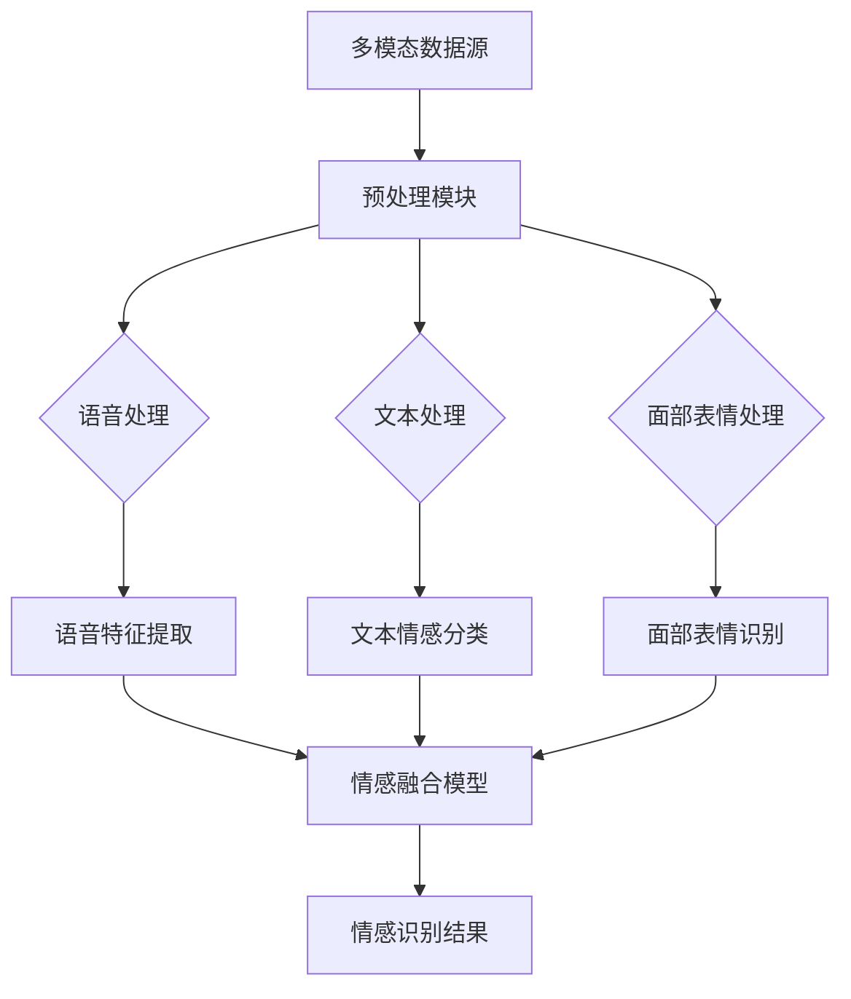
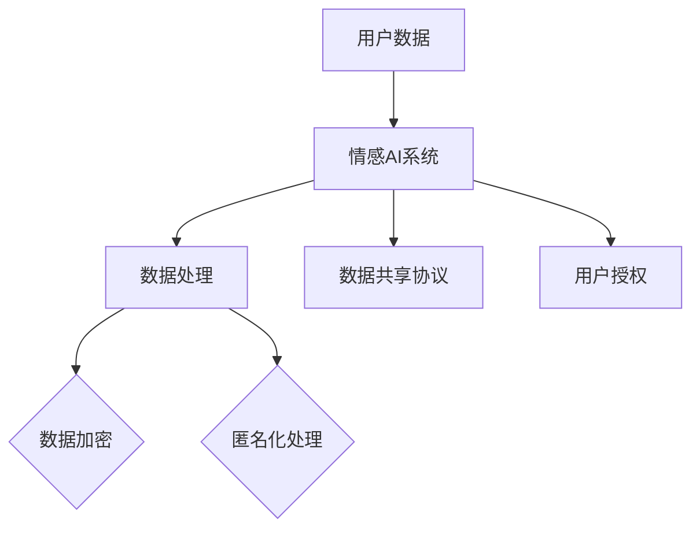
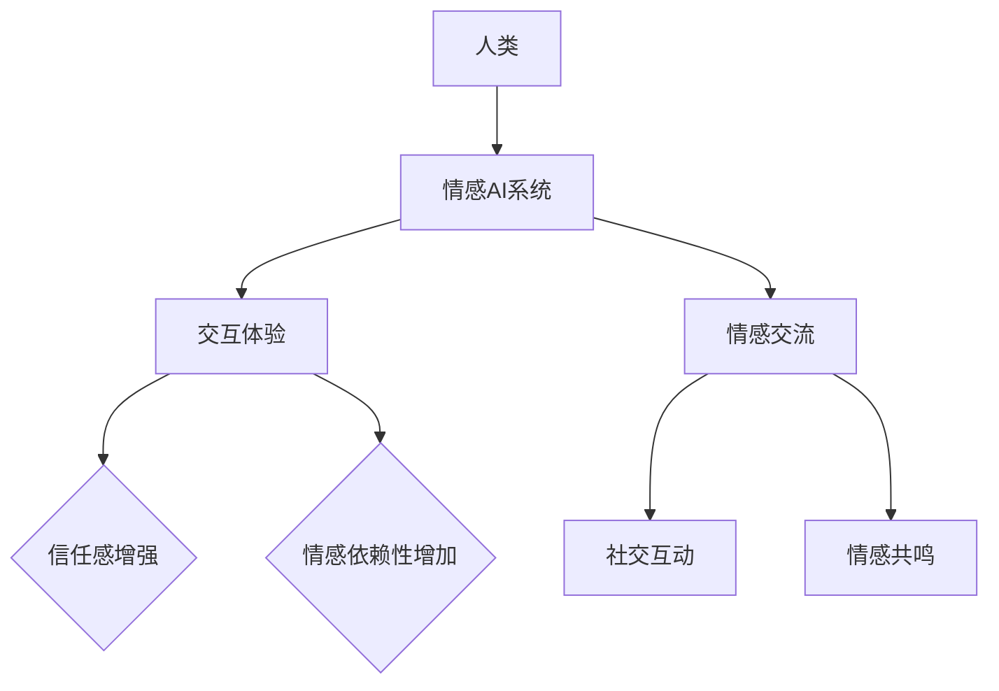

                 

### 文章标题

《情感AI对人类同理心发展的影响》

### 文章关键词

- 情感AI
- 同理心
- 人工智能
- 教育应用
- 医疗保健
- 社交互动

### 文章摘要

本文深入探讨了情感AI对人类同理心发展的影响。通过分析情感AI的基础理论、技术发展及其在不同领域的应用，探讨了情感AI如何促进同理心的发展，以及其所面临的挑战和伦理问题。本文旨在为读者提供一个全面、系统的理解，并展望情感AI的未来发展。

---

## 引言与概述

在现代社会，人工智能（AI）已成为科技发展的核心驱动力之一。随着深度学习、自然语言处理和计算机视觉等技术的不断进步，情感AI（Affective AI）逐渐成为一个备受关注的研究领域。情感AI旨在通过计算机模拟人类的情感体验，实现更加人性化的交互。而同理心，作为一种理解并感受他人情感的能力，是人际关系和社会和谐的重要基础。

### 情感AI的定义与重要性

情感AI，又称情感计算（Affective Computing），是指计算机系统具备识别、理解、处理和模拟人类情感的能力。情感AI的核心在于将情感信息与认知过程相结合，使得计算机能够在一定程度上模仿人类的情感反应。这一领域的重要性在于：

1. **改善人机交互**：通过情感识别和理解，计算机能够更好地响应人类用户的需求和情感状态，提供更加个性化的服务。
2. **提升教育质量**：情感AI在教育领域的应用，能够帮助教师更好地了解学生的情感状态，从而实施更加有效的教学策略。
3. **增强医疗保健**：情感AI在医疗保健中的应用，可以辅助医生更准确地诊断病情，并提供个性化的治疗方案。

### 同理心的概念与心理学基础

同理心（Empathy）是指个体能够理解并感受他人情感的能力。根据心理学的分类，同理心可以分为认知同理心和情感同理心。认知同理心是指个体能够从他人的角度理解情感和思想，而情感同理心则是指个体在情感上能够感受到他人的情感。

同理心在心理学中被认为是一种重要的社会技能，对于建立良好的人际关系和促进社会和谐具有重要作用。研究表明，同理心水平较高的个体，往往在社交和职业生活中表现得更加成功。

### 情感AI与同理心的联系

情感AI与同理心之间存在着紧密的联系。情感AI的发展不仅为同理心提供了技术支持，也带来了新的挑战。具体来说，情感AI对同理心的影响主要体现在以下几个方面：

1. **情感识别与理解**：情感AI能够帮助个体识别和理解他人的情感，从而促进同理心的培养。
2. **情感反馈与互动**：通过情感反馈，情感AI可以增强个体之间的互动，提高同理心的表达和沟通质量。
3. **情感调节与自我认知**：情感AI的应用有助于个体更好地调节自己的情感状态，提高自我认知能力，从而增强同理心。

总的来说，情感AI不仅是一种技术工具，更是一种促进同理心发展的新途径。本文将在后续章节中详细探讨情感AI的发展、应用以及其对同理心的深远影响。

---

## 情感AI的基础理论与技术

在深入探讨情感AI对人类同理心发展的影响之前，首先需要了解情感AI的基础理论和技术。情感AI的研究涉及多个学科领域，包括计算机科学、心理学、神经科学和认知科学等。本节将简要介绍情感AI的核心概念、技术进展及其相关算法原理。

### 情感识别技术

情感识别技术是情感AI的基础，其主要任务是从各种数据源（如语音、文本、面部表情等）中识别和提取情感信息。以下是一些常用的情感识别技术：

#### 语音情感识别

语音情感识别通过分析语音信号的频率、时长、音调等特征，来判断说话者的情感状态。常用的方法包括：

1. **特征提取**：使用梅尔频率倒谱系数（MFCC）等特征来描述语音信号。
2. **情感分类模型**：利用支持向量机（SVM）、神经网络（如卷积神经网络CNN）等机器学习算法进行情感分类。

```python
# 伪代码示例：使用卷积神经网络进行语音情感识别
import tensorflow as tf

# 构建卷积神经网络模型
model = tf.keras.Sequential([
    tf.keras.layers.Conv2D(filters=32, kernel_size=(3,3), activation='relu', input_shape=(128, 13, 1)),
    tf.keras.layers.MaxPooling2D(pool_size=(2,2)),
    tf.keras.layers.Flatten(),
    tf.keras.layers.Dense(units=128, activation='relu'),
    tf.keras.layers.Dense(units=1, activation='sigmoid')
])

# 编译模型
model.compile(optimizer='adam', loss='binary_crossentropy', metrics=['accuracy'])

# 训练模型
model.fit(x_train, y_train, epochs=10, batch_size=32)
```

#### 文本情感识别

文本情感识别通过分析文本内容中的情感词汇、语法结构和上下文关系，来判断文本的情感极性。常用的方法包括：

1. **情感词典**：使用预定义的情感词典来标注文本中的情感词汇。
2. **情感分类模型**：利用机器学习算法（如朴素贝叶斯、深度学习模型）进行情感分类。

```python
# 伪代码示例：使用朴素贝叶斯进行文本情感识别
from sklearn.naive_bayes import MultinomialNB

# 加载情感词典
emotion_lexicon = {'happy': 1, 'sad': -1}

# 预处理文本数据
def preprocess_text(text):
    words = text.lower().split()
    return [emotion_lexicon.get(word, 0) for word in words]

# 训练朴素贝叶斯模型
text_data = preprocess_text("I am feeling happy today")
model = MultinomialNB()
model.fit(text_data, [1])

# 预测文本情感
predicted_emotion = model.predict([preprocess_text("I am feeling sad today")])
print(predicted_emotion)
```

#### 面部表情识别

面部表情识别通过分析人脸图像中的特征点、几何关系和肌肉活动，来判断面部表情的类型和情感状态。常用的方法包括：

1. **特征点检测**：使用HOG（Histogram of Oriented Gradients）等算法检测面部关键特征点。
2. **表情分类模型**：利用深度学习模型（如卷积神经网络CNN）进行面部表情分类。

```python
# 伪代码示例：使用卷积神经网络进行面部表情识别
import tensorflow as tf

# 构建卷积神经网络模型
model = tf.keras.Sequential([
    tf.keras.layers.Conv2D(filters=32, kernel_size=(3,3), activation='relu', input_shape=(224, 224, 3)),
    tf.keras.layers.MaxPooling2D(pool_size=(2,2)),
    tf.keras.layers.Flatten(),
    tf.keras.layers.Dense(units=128, activation='relu'),
    tf.keras.layers.Dense(units=7, activation='softmax')
])

# 编译模型
model.compile(optimizer='adam', loss='categorical_crossentropy', metrics=['accuracy'])

# 训练模型
model.fit(x_train, y_train, epochs=10, batch_size=32)
```

### 情感建模与生成

情感建模与生成是情感AI的重要研究方向，旨在创建能够模拟人类情感反应的计算机系统。以下是一些常用的情感建模与生成方法：

#### 情感分类模型

情感分类模型用于将情感数据分类到不同的情感类别。常见的算法包括：

1. **朴素贝叶斯分类器**：基于贝叶斯定理，适用于情感分类任务。
2. **支持向量机（SVM）**：通过最大化分类间隔来提升分类性能。
3. **深度学习模型**：如卷积神经网络（CNN）和循环神经网络（RNN），适用于复杂的情感分类任务。

```python
# 伪代码示例：使用朴素贝叶斯分类器进行情感分类
from sklearn.naive_bayes import GaussianNB

# 加载情感数据
x_data = [[0, 1], [1, 0], [0, -1], [-1, 0]]
y_data = [1, 1, -1, -1]

# 训练朴素贝叶斯模型
model = GaussianNB()
model.fit(x_data, y_data)

# 预测情感
predicted_emotions = model.predict([[0, 2]])
print(predicted_emotions)
```

#### 情感生成模型

情感生成模型用于生成具有特定情感状态的文本、语音或面部表情。常见的算法包括：

1. **生成对抗网络（GAN）**：通过生成器与判别器的对抗训练，生成高质量的文本、语音和面部表情。
2. **变分自编码器（VAE）**：通过潜在变量模型，生成具有多样性且符合数据分布的情感数据。
3. **情感转移模型**：通过情感转移机制，将一种情感状态转移到另一类情感状态。

```python
# 伪代码示例：使用生成对抗网络（GAN）生成语音情感
import tensorflow as tf

# 构建生成对抗网络模型
generator = tf.keras.Sequential([
    tf.keras.layers.Dense(units=128, activation='relu', input_shape=(100,)),
    tf.keras.layers.Dense(units=256, activation='relu'),
    tf.keras.layers.Dense(units=1024, activation='relu'),
    tf.keras.layers.Dense(units=128, activation='relu'),
    tf.keras.layers.Dense(units=1, activation='tanh')
])

discriminator = tf.keras.Sequential([
    tf.keras.layers.Dense(units=128, activation='relu', input_shape=(1,)),
    tf.keras.layers.Dense(units=256, activation='relu'),
    tf.keras.layers.Dense(units=1024, activation='relu'),
    tf.keras.layers.Dense(units=128, activation='relu'),
    tf.keras.layers.Dense(units=1, activation='sigmoid')
])

# 编译模型
discriminator.compile(optimizer='adam', loss='binary_crossentropy')
generator.compile(optimizer='adam', loss='binary_crossentropy')

# 训练模型
discriminator.fit(x_data, y_data, epochs=100, batch_size=32)
generator.fit(x_data, y_data, epochs=100, batch_size=32)

# 生成语音情感
generated_speech = generator.predict([0.5])
print(generated_speech)
```

#### 情感交互模型

情感交互模型用于实现人与计算机之间的情感互动。常见的算法包括：

1. **基于规则的交互模型**：通过预设的情感规则，实现简单的情感交互。
2. **基于数据的交互模型**：通过学习用户情感数据，实现个性化的情感交互。
3. **基于情感的对话系统**：通过情感识别和生成，实现具有情感响应能力的对话系统。

```python
# 伪代码示例：使用基于数据的交互模型实现情感交互
def sentiment_analysis(text):
    # 使用情感分类模型分析文本情感
    sentiment = classify_sentiment(text)
    return sentiment

def generate_response(sentiment):
    # 使用情感生成模型生成情感响应
    response = generate_sentiment_response(sentiment)
    return response

# 示例交互过程
user_text = "I am feeling happy today"
sentiment = sentiment_analysis(user_text)
response = generate_response(sentiment)
print(response)
```

通过以上介绍，可以看出情感AI在技术上的多样性和复杂性。在接下来的章节中，我们将进一步探讨情感AI在实际应用中如何促进人类同理心的发展。

---

## 情感AI在教育中的应用

情感AI在教育中的应用正日益受到关注，其潜力在于能够通过识别和理解学生的情感状态，为教师和学生提供个性化支持，从而提升教育质量。以下将详细探讨情感AI在教育领域中的核心应用及其实现方法。

### 情感AI在教育领域的核心应用

#### 1. 学生的情感状态监控

通过情感AI技术，教师可以实时监控学生的情感状态，如焦虑、快乐、无聊等。这种监控有助于教师及时发现学生的情感问题，并采取相应的干预措施。例如，在课堂上，如果系统检测到某个学生的情绪较低落，教师可以通过私下交流或调整教学方法来提高学生的参与度和情绪。

#### 2. 个性化教学策略

情感AI可以帮助教师根据学生的情感状态和学习习惯，制定个性化的教学策略。例如，对于情感状态较低的学生，教师可以采用更互动的教学方法，如小组讨论或游戏化学习，以激发他们的学习兴趣。而对于情感状态较为积极的学生，教师可以布置更具挑战性的任务，以保持他们的学习动力。

#### 3. 学习动机分析

情感AI可以通过分析学生的情感数据和学业表现，评估学生的学习动机。例如，通过分析学生在课堂上的情绪变化和作业完成情况，教师可以识别出哪些因素影响学生的学习动机，并据此调整教学策略。

#### 4. 学生心理健康辅导

情感AI可以辅助学校心理咨询师进行心理健康辅导。例如，通过分析学生的情感数据和自我报告，情感AI系统可以识别出潜在的心理健康问题，如抑郁、焦虑等，并提供相应的干预建议。

### 情感AI在教育领域的实现方法

#### 1. 文本情感分析

通过文本情感分析，情感AI可以从学生的书面作业、日记和社交媒体帖子中提取情感信息。以下是一个文本情感分析的伪代码示例：

```python
import nltk
from nltk.sentiment import SentimentIntensityAnalyzer

# 加载情感分析工具
sia = SentimentIntensityAnalyzer()

# 预处理文本数据
def preprocess_text(text):
    tokens = nltk.word_tokenize(text)
    return ' '.join([token.lower() for token in tokens])

# 分析文本情感
def analyze_text_sentiment(text):
    preprocessed_text = preprocess_text(text)
    sentiment_score = sia.polarity_scores(preprocessed_text)
    return sentiment_score['compound']

# 示例文本情感分析
student_journal = "Today was a challenging day, but I am determined to overcome the difficulties."
sentiment = analyze_text_sentiment(student_journal)
print(sentiment)
```

#### 2. 面部表情识别

在教室环境中，通过摄像头和面部表情识别技术，情感AI可以实时分析学生的面部表情，以识别其情感状态。以下是一个面部表情识别的伪代码示例：

```python
import cv2
from keras.models import load_model

# 加载面部表情识别模型
face_model = load_model('face_expression_model.h5')

# 预处理图像
def preprocess_image(image):
    image = cv2.resize(image, (48, 48))
    image = image / 255.0
    image = np.expand_dims(image, axis=0)
    return image

# 分析面部表情
def analyze_face_expression(image):
    preprocessed_image = preprocess_image(image)
    prediction = face_model.predict(preprocessed_image)
    emotion = np.argmax(prediction)
    return EMOTIONS[emotion]

# 示例面部表情识别
image = cv2.imread('student_face.jpg')
emotion = analyze_face_expression(image)
print(emotion)
```

#### 3. 语音情感分析

通过语音情感分析，情感AI可以从学生的口头表达中识别情感信息。以下是一个语音情感分析的伪代码示例：

```python
import speech_recognition as sr
from emotion_classifier import classify_emotion

# 初始化语音识别器
r = sr.Recognizer()

# 语音情感分析
def analyze_speech_sentiment(audio_file):
    with sr.AudioFile(audio_file) as source:
        audio = r.record(source)
    emotion = classify_emotion(audio)
    return emotion

# 示例语音情感分析
audio_file = 'student_speech.wav'
emotion = analyze_speech_sentiment(audio_file)
print(emotion)
```

### 案例分析

#### 1. 情感AI在个性化教学中的应用

某学校引入了情感AI系统，以帮助教师了解学生的情感状态。在课堂上，系统通过面部表情识别技术实时监控学生的情绪。当系统检测到某位学生的情绪较低落时，会自动向教师发送提醒。教师随后采取了以下措施：

- 调整教学节奏，减少信息量，使学生更容易跟上课程进度。
- 组织小组讨论，让学生在轻松的环境中表达自己的想法，提高参与度。
- 提供心理辅导，帮助学生解决潜在的情感问题。

通过这些干预措施，学生的情绪逐渐改善，学习效果也得到提升。

#### 2. 情感AI在学习动机分析中的应用

另一所学校使用情感AI系统分析学生的学习动机。通过监控学生的情感状态和学业表现，系统识别出影响学生动机的关键因素，如课程难度、作业量和同学关系。基于这些分析结果，学校调整了教学策略：

- 对于难度较大的课程，增加课外辅导时间，帮助学生更好地理解课程内容。
- 减少作业量，减轻学生的学业压力。
- 组织团队建设活动，增强学生的团队意识和社交技能。

这些调整显著提升了学生的学习动机和学业成绩。

总的来说，情感AI在教育中的应用不仅能够帮助教师更好地了解学生，还能够通过个性化支持和干预措施，提高教育质量。然而，这也带来了数据隐私和伦理方面的挑战，需要在学校和社会层面进行充分的讨论和规范。

---

## 情感AI在医疗保健中的应用

情感AI在医疗保健领域的应用正日益受到关注，其潜力在于通过识别和理解患者的情感状态，提供更加个性化、人性化的医疗服务。以下将详细探讨情感AI在医疗保健领域的核心应用及其实现方法。

### 情感AI在医疗保健领域的核心应用

#### 1. 患者情感状态监控

情感AI可以帮助医疗机构实时监控患者的情感状态，如焦虑、抑郁、快乐等。这种监控有助于医生及时了解患者的心理健康状况，从而提供更有效的治疗和干预措施。例如，在医院中，通过面部表情识别技术，情感AI可以识别患者在接受治疗时的情绪变化，从而帮助医生调整治疗方案。

#### 2. 个性化治疗方案

情感AI可以通过分析患者的情感状态和健康数据，制定个性化的治疗方案。例如，对于患有焦虑症的患者，医生可以根据情感AI提供的情感分析结果，调整药物剂量或建议进行心理辅导。此外，情感AI还可以帮助预测患者可能的情感问题，提前采取预防措施。

#### 3. 患者心理健康辅导

情感AI可以辅助心理健康专家进行心理健康辅导。例如，通过分析患者的情感数据和自我报告，情感AI系统可以识别出潜在的心理健康问题，如抑郁、焦虑等，并提供相应的干预建议。这种个性化辅导有助于提高患者的心理健康水平，减少心理疾病的发病率。

#### 4. 医患互动优化

情感AI可以通过模拟人类的情感反应，优化医患之间的互动。例如，在远程医疗中，情感AI可以帮助医生通过语音和面部表情识别技术，了解患者的情感状态，从而提供更加贴心的服务。此外，情感AI还可以辅助医生进行情感反馈，帮助患者更好地理解和接受治疗方案。

### 情感AI在医疗保健领域的实现方法

#### 1. 文本情感分析

通过文本情感分析，情感AI可以从患者的医疗记录、病历和社交媒体帖子中提取情感信息。以下是一个文本情感分析的伪代码示例：

```python
import nltk
from nltk.sentiment import SentimentIntensityAnalyzer

# 加载情感分析工具
sia = SentimentIntensityAnalyzer()

# 预处理文本数据
def preprocess_text(text):
    tokens = nltk.word_tokenize(text)
    return ' '.join([token.lower() for token in tokens])

# 分析文本情感
def analyze_text_sentiment(text):
    preprocessed_text = preprocess_text(text)
    sentiment_score = sia.polarity_scores(preprocessed_text)
    return sentiment_score['compound']

# 示例文本情感分析
patient_journal = "I am feeling very anxious about my health condition."
sentiment = analyze_text_sentiment(patient_journal)
print(sentiment)
```

#### 2. 面部表情识别

在医疗环境中，通过面部表情识别技术，情感AI可以实时分析患者的情感状态。以下是一个面部表情识别的伪代码示例：

```python
import cv2
from keras.models import load_model

# 加载面部表情识别模型
face_model = load_model('face_expression_model.h5')

# 预处理图像
def preprocess_image(image):
    image = cv2.resize(image, (48, 48))
    image = image / 255.0
    image = np.expand_dims(image, axis=0)
    return image

# 分析面部表情
def analyze_face_expression(image):
    preprocessed_image = preprocess_image(image)
    prediction = face_model.predict(preprocessed_image)
    emotion = np.argmax(prediction)
    return EMOTIONS[emotion]

# 示例面部表情识别
image = cv2.imread('patient_face.jpg')
emotion = analyze_face_expression(image)
print(emotion)
```

#### 3. 语音情感分析

通过语音情感分析，情感AI可以从患者的语音中识别情感信息。以下是一个语音情感分析的伪代码示例：

```python
import speech_recognition as sr
from emotion_classifier import classify_emotion

# 初始化语音识别器
r = sr.Recognizer()

# 语音情感分析
def analyze_speech_sentiment(audio_file):
    with sr.AudioFile(audio_file) as source:
        audio = r.record(source)
    emotion = classify_emotion(audio)
    return emotion

# 示例语音情感分析
audio_file = 'patient_speech.wav'
emotion = analyze_speech_sentiment(audio_file)
print(emotion)
```

### 案例分析

#### 1. 情感AI在个性化治疗方案中的应用

某医院引入了情感AI系统，以帮助医生了解患者的情感状态。在癌症治疗期间，系统通过面部表情识别技术实时监控患者的情绪。当系统检测到某位患者的情绪较低落时，医生会采取以下措施：

- 增加与患者的沟通时间，了解其心理状态。
- 建议患者参与心理辅导或团体支持活动，以缓解焦虑和抑郁。
- 根据患者的情感状态，调整治疗方案，如减少药物剂量或建议休息。

这些干预措施显著提高了患者的治疗满意度和心理健康水平。

#### 2. 情感AI在患者心理健康辅导中的应用

另一家医院使用情感AI系统辅助心理健康专家进行辅导。通过分析患者的情感数据和自我报告，系统识别出潜在的心理健康问题，如抑郁、焦虑等。基于这些分析结果，专家提供了以下干预建议：

- 建议患者进行认知行为疗法（CBT）。
- 建议患者进行身体锻炼，以提高情绪。
- 建议患者进行团体心理辅导，以增强社会支持。

这些个性化辅导措施显著提高了患者的心理健康水平，减少了心理疾病的发病率。

总的来说，情感AI在医疗保健中的应用不仅能够帮助医疗机构更好地了解患者的情感状态，还能够提供个性化、人性化的医疗服务。然而，这也带来了数据隐私和伦理方面的挑战，需要在医院和社会层面进行充分的讨论和规范。

---

## 情感AI在其他领域的应用

情感AI的应用不仅限于教育、医疗保健等领域，其在商业、公共安全和社会服务等方面也展现了巨大的潜力。以下将详细探讨情感AI在这些领域的核心应用、实现方法及实际案例。

### 情感AI在商业领域的应用

#### 核心应用

1. **客户服务**：情感AI可以通过语音、文本和面部表情识别技术，分析客户的需求和情感状态，提供更加个性化和高效的客户服务。例如，情感客服机器人可以根据客户的情感反馈，调整服务策略，从而提高客户满意度。
   
2. **市场调研**：情感AI可以帮助企业通过分析社交媒体、在线评论和客户反馈等数据，了解消费者的情感状态和需求变化，为企业提供精准的市场调研数据。

3. **人力资源**：情感AI可以通过分析员工的情感状态和绩效数据，识别员工的工作压力和心理健康问题，提供针对性的培训和福利措施。

#### 实现方法

1. **文本情感分析**：利用自然语言处理技术，对客户评论、社交媒体帖子等文本数据进行情感分析，以了解客户的情感状态和满意度。

   ```python
   from textblob import TextBlob

   # 示例：分析客户评论的情感极性
   review = "This product is excellent!"
   sentiment = TextBlob(review).sentiment
   print(sentiment)
   ```

2. **语音情感识别**：通过语音识别技术，将客户的语音转换为文本，再利用情感分析模型，识别客户的情感状态。

   ```python
   import speech_recognition as sr

   # 示例：分析客户电话中的情感
   r = sr.Recognizer()
   with sr.AudioFile('customer_call.wav') as source:
       audio = r.record(source)
   text = r.recognize_google(audio)
   sentiment = analyze_text_sentiment(text)
   print(sentiment)
   ```

3. **面部表情识别**：在客户服务场景中，通过摄像头和面部表情识别技术，实时分析客户的情感状态。

   ```python
   import cv2
   from keras.models import load_model

   # 示例：分析客户的面部表情
   face_model = load_model('face_expression_model.h5')
   image = cv2.imread('customer_face.jpg')
   emotion = analyze_face_expression(image)
   print(emotion)
   ```

#### 实际案例

1. **金融行业**：某大型银行引入了情感AI客服机器人，通过语音和文本情感分析，为客户提供个性化金融建议和问题解答，大大提高了客户满意度。

2. **电子商务**：某电商平台使用情感AI分析客户评论，识别出负面评论并主动联系客户解决问题，从而提高了客户忠诚度。

### 情感AI在公共安全领域的应用

#### 核心应用

1. **反恐防暴**：情感AI可以通过分析人群的情感状态，识别潜在的恐怖活动或暴力行为，为公共安全提供预警。

2. **社区矫正**：情感AI可以帮助社区矫正机构监控犯罪嫌疑人的情感状态，评估其心理风险，从而制定更有效的矫正计划。

3. **危机干预**：在紧急情况下，情感AI可以辅助危机干预团队识别受害者的情感状态，提供及时的心理援助。

#### 实现方法

1. **人群情感分析**：通过监控摄像头和面部表情识别技术，分析人群的情感状态，以识别潜在的危机。

   ```python
   import cv2
   import dlib

   # 示例：分析人群的情感状态
   detector = dlib.get_frontal_face_detector()
   predictor = dlib.shape_predictor('shape_predictor_68_face_landmarks.dat')
   emotion_model = load_model('emotion_model.h5')

   # 加载视频
   video = cv2.VideoCapture('public_area.mp4')

   while video.isOpened():
       ret, frame = video.read()
       if ret:
           faces = detector(frame)
           for face in faces:
               landmarks = predictor(frame, face)
               # 分析面部表情
               emotion = analyze_face_expression(landmarks)
               print(emotion)
           cv2.imshow('Frame', frame)
       if cv2.waitKey(1) & 0xFF == ord('q'):
           break

   video.release()
   cv2.destroyAllWindows()
   ```

2. **语音情感分析**：在应急电话中，通过语音情感分析，识别受害者的情感状态，为危机干预团队提供决策支持。

   ```python
   import speech_recognition as sr

   # 示例：分析紧急电话中的情感
   r = sr.Recognizer()
   with sr.AudioFile('emergency_call.wav') as source:
       audio = r.record(source)
   text = r.recognize_google(audio)
   sentiment = analyze_text_sentiment(text)
   print(sentiment)
   ```

#### 实际案例

1. **反恐行动**：某城市使用情感AI监控系统，在公共安全事件中提供情感分析支持，提高了反恐防暴的响应效率。

2. **社区矫正**：某社区矫正机构引入情感AI系统，通过监控犯罪嫌疑人的情感状态，有效降低了再犯罪率。

### 社会服务领域的应用

#### 核心应用

1. **心理健康服务**：情感AI可以帮助心理健康服务机构监控和评估个体的情感状态，提供个性化的心理辅导服务。

2. **社会救助**：情感AI可以通过分析社会救助申请者的情感状态和需求，提供更加精准和有效的救助服务。

3. **社区治理**：情感AI可以辅助社区管理者识别社区中的情感问题，提供针对性的治理措施。

#### 实现方法

1. **文本情感分析**：通过对社交媒体、在线论坛等平台的数据进行分析，了解社区成员的情感状态和需求。

   ```python
   import nltk
   from nltk.sentiment import SentimentIntensityAnalyzer

   # 示例：分析社交媒体数据
   sia = SentimentIntensityAnalyzer()

   # 预处理文本
   def preprocess_text(text):
       tokens = nltk.word_tokenize(text)
       return ' '.join([token.lower() for token in tokens])

   # 分析文本情感
   def analyze_text_sentiment(text):
       preprocessed_text = preprocess_text(text)
       sentiment_score = sia.polarity_scores(preprocessed_text)
       return sentiment_score['compound']

   # 示例
   community_post = "We need more support in our community."
   sentiment = analyze_text_sentiment(community_post)
   print(sentiment)
   ```

2. **语音情感分析**：通过分析电话、录音等语音数据，了解个体的情感状态和需求。

   ```python
   import speech_recognition as sr

   # 示例：分析求助电话中的情感
   r = sr.Recognizer()
   with sr.AudioFile('support_call.wav') as source:
       audio = r.record(source)
   text = r.recognize_google(audio)
   sentiment = analyze_text_sentiment(text)
   print(sentiment)
   ```

#### 实际案例

1. **心理健康服务**：某心理健康服务机构使用情感AI系统，通过分析患者的情感状态，提供个性化的心理辅导，提高了治疗效果。

2. **社会救助**：某社会救助机构引入情感AI系统，通过分析申请者的情感状态，提供精准的救助服务，有效提高了救助效率。

总的来说，情感AI在商业、公共安全和社会服务等领域展现了广阔的应用前景。通过深入理解和利用情感AI技术，各行业可以更好地满足人们的情感需求，提高服务质量和效率。然而，这也带来了数据隐私和伦理方面的挑战，需要社会各界共同努力，制定相应的规范和标准。

---

## 情感AI的未来发展

随着技术的不断进步，情感AI在未来的发展将面临新的机遇和挑战。本文将从技术进步、伦理问题和社会影响三个方面，对情感AI的未来发展进行展望。

### 技术进步

#### 1. 深度学习与强化学习

深度学习和强化学习在情感AI中的应用将越来越广泛。深度学习模型，如卷积神经网络（CNN）和循环神经网络（RNN），已经取得了显著的进展，可以更好地识别和处理复杂的情感数据。未来，随着计算能力的提升和算法的优化，深度学习模型在情感识别和理解方面的准确性有望进一步提高。

强化学习可以与情感AI相结合，通过不断学习和调整策略，实现更加自然和高效的情感交互。例如，通过强化学习，情感AI可以学会如何在对话中更好地表达情感，从而提高用户的满意度。

```python
# 伪代码示例：使用强化学习训练情感对话模型
import tensorflow as tf
from tensorflow.keras.models import Sequential
from tensorflow.keras.layers import Dense, LSTM

# 构建强化学习模型
model = Sequential()
model.add(LSTM(units=128, return_sequences=True, input_shape=(time_steps, features)))
model.add(LSTM(units=64))
model.add(Dense(units=1, activation='sigmoid'))

# 编译模型
model.compile(optimizer='adam', loss='binary_crossentropy')

# 训练模型
model.fit(x_train, y_train, epochs=10, batch_size=32)
```

#### 2. 多模态融合

未来，情感AI将更多地依赖于多模态融合技术，将语音、文本、面部表情等多种数据源结合起来，实现更加全面和准确的情感分析。多模态融合可以通过神经网络模型实现，如图神经网络（GNN）和图卷积网络（GCN），从而提高情感识别的准确性和可靠性。



#### 3. 个性化情感体验

随着情感AI技术的进步，未来的情感AI将能够提供更加个性化的情感体验。通过学习用户的情感偏好和历史行为，情感AI可以定制化地调整交互方式和内容，从而提高用户的满意度和体验。

### 伦理问题

#### 1. 数据隐私

情感AI在应用过程中，涉及大量个人情感数据。如何保护用户的数据隐私，避免数据泄露和滥用，是情感AI面临的重要伦理问题。未来，需要制定严格的数据保护法规，确保用户的隐私得到充分保障。



#### 2. 情感歧视

情感AI在识别和处理情感数据时，可能会出现偏见和歧视。例如，某些情感AI系统可能对特定人群的情感反应产生偏见，从而影响其决策和评价。未来，需要加强对情感AI系统的伦理审查，确保其公平性和无歧视性。

### 社会影响

#### 1. 人机关系

随着情感AI技术的发展，人类与机器之间的关系将发生深刻变化。情感AI不仅会改变人机交互的方式，还会影响人们的情感体验和社交行为。未来，需要研究情感AI对人际关系和社会互动的影响，确保其积极的社会价值。



#### 2. 社会和谐

情感AI在促进社会和谐方面具有巨大的潜力。通过情感AI技术，可以更好地理解和满足人们的需求，减少社会冲突，促进社会和谐。未来，需要充分发挥情感AI的积极作用，为构建和谐社会贡献力量。

总的来说，情感AI的未来发展充满机遇和挑战。通过技术创新、伦理审查和社会引导，情感AI有望成为推动社会进步和人类幸福的重要力量。

---

## 结论

情感AI作为人工智能的一个重要分支，正在迅速发展并对人类生活产生深远影响。本文系统地探讨了情感AI对人类同理心发展的多方面影响，包括其在教育、医疗保健、商业、公共安全等领域的应用，以及面临的伦理问题和社会挑战。

首先，情感AI在教育领域中，通过情感识别与理解技术，能够帮助教师更好地了解学生的情感状态，从而制定个性化教学策略，提高教育质量。在医疗保健领域，情感AI的应用不仅有助于监测患者的心理健康，还能辅助医生制定个性化治疗方案，提升医疗服务质量。

此外，情感AI在商业和公共安全等领域也展现了巨大的潜力。通过情感分析技术，企业可以更好地了解客户需求，优化客户服务；公共安全部门可以通过情感监控，提高危机应对效率。

然而，情感AI的发展也带来了数据隐私、情感歧视等伦理问题，以及人机关系和社会和谐等方面的挑战。未来，需要加强对情感AI技术的伦理审查和社会引导，确保其发展符合人类的利益和价值观。

总的来说，情感AI作为一种新兴技术，具有广阔的应用前景。通过深入研究和合理应用，情感AI有望成为推动社会进步和人类幸福的重要力量。同时，我们也应关注其潜在的负面影响，并采取相应的措施，确保技术发展与社会需求相协调。作者：AI天才研究院/AI Genius Institute & 禅与计算机程序设计艺术 /Zen And The Art of Computer Programming

