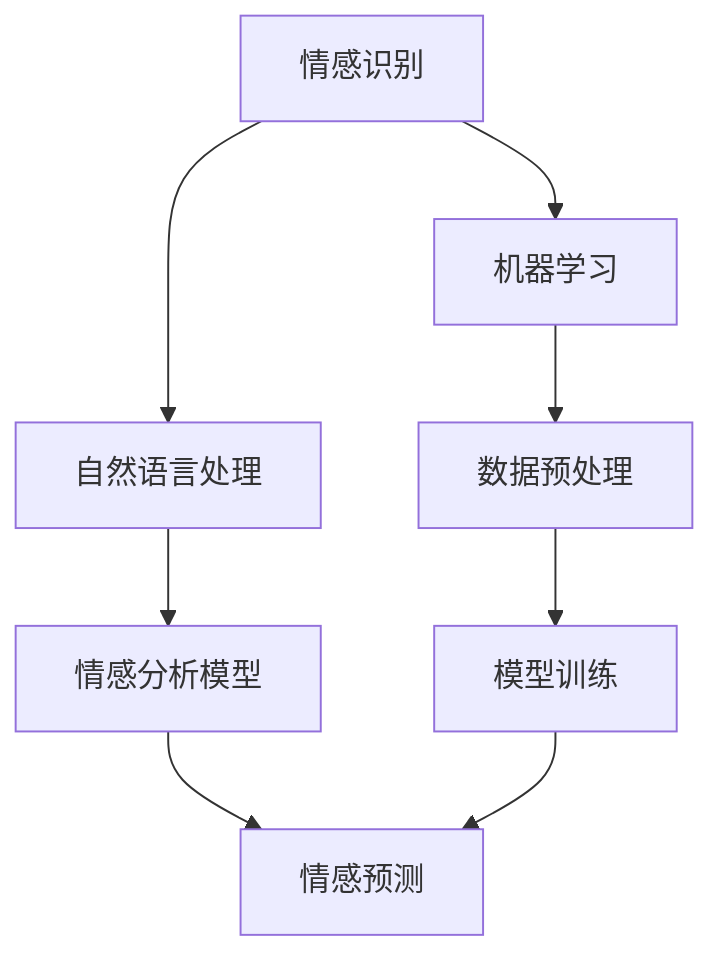

                 


## 情感AI对人类心理健康的影响

### 文章标题

《情感AI对人类心理健康的影响：技术、应用与未来展望》

### 关键词

情感AI、心理健康、机器学习、自然语言处理、数据隐私、伦理挑战

### 摘要

本文将深入探讨情感AI对人类心理健康的影响。我们将从基础概念入手，逐步分析情感AI的工作原理及其在心理健康领域的应用，包括监测、预测和干预。同时，我们将讨论情感AI面临的技术挑战和伦理问题，并展望其未来的发展趋势。

## 第一部分：情感AI基础

### 第1章：情感AI概述

#### 1.1 情感AI的定义与重要性

情感AI是指能够理解和模拟人类情感的人工智能系统。在心理健康领域，情感AI的重要性体现在其能够帮助识别、预测和干预心理健康问题，从而提供更加个性化和有效的心理健康服务。

#### 1.2 情感AI的核心技术

情感AI的核心技术主要包括机器学习、自然语言处理和计算机视觉。这些技术使得情感AI能够从大量的数据中提取情感特征，进而进行情感识别和情感分析。

#### 1.3 情感识别的基本原理

情感识别是情感AI的核心任务之一。它主要通过以下步骤实现：

1. 数据收集：收集包含情感信息的文本、语音或视频数据。
2. 特征提取：从数据中提取与情感相关的特征，如文本中的情感词汇、语音的音调、视频中的面部表情等。
3. 模型训练：使用机器学习算法训练情感识别模型，使其能够根据提取的特征预测情感标签。

### 第2章：情感AI在心理健康中的应用

#### 2.1 心理健康与情感AI的联系

心理健康是指个体在情绪、认知和行为方面的良好状态。情感AI能够通过监测和预测心理健康问题，提供个性化的心理健康服务，从而改善心理健康状况。

#### 2.2 情感AI在心理健康诊断中的应用

情感AI在心理健康诊断中的应用主要体现在情感分析。通过对文本、语音或视频中的情感特征进行分析，情感AI可以识别出个体的心理健康问题，如抑郁、焦虑等。

#### 2.3 情感AI在心理健康干预中的应用

情感AI在心理健康干预中的应用主要体现在情感干预。通过实时监测个体的情感状态，情感AI可以提供个性化的情感干预方案，如心理疏导、放松训练等。

### 第3章：情感AI的核心算法原理

#### 3.1 情感识别算法

情感识别算法主要包括以下步骤：

1. 数据预处理：对原始数据进行清洗和格式化，使其符合机器学习算法的要求。
2. 特征提取：使用自然语言处理和计算机视觉技术提取情感特征。
3. 模型训练：使用机器学习算法训练情感识别模型。
4. 情感预测：使用训练好的模型对新的数据进行情感预测。

#### 3.2 情感分析模型

情感分析模型通常采用分类算法，如支持向量机（SVM）、决策树（DT）和深度神经网络（DNN）等。这些模型通过学习大量的情感标注数据，能够识别出文本、语音或视频中的情感。

## 第二部分：情感AI在心理健康领域的应用

### 第4章：情感AI在心理健康监测中的应用

#### 4.1 心理健康监测的重要性

心理健康监测是早期发现心理健康问题的关键。情感AI通过实时监测个体的情感状态，可以帮助早期发现心理健康问题，从而及时采取干预措施。

#### 4.2 情感AI在监测中的应用

情感AI在心理健康监测中的应用主要包括：

1. 实时情感监测：通过实时分析个体的文本、语音或视频数据，监测其情感状态。
2. 回顾性分析：通过分析历史数据，评估个体的情感变化趋势。

### 第5章：情感AI在心理健康预测中的应用

#### 5.1 心理健康预测的重要性

心理健康预测是预防心理健康问题的关键。情感AI通过分析个体的情感特征，可以预测其未来的心理健康状况，从而提前采取预防措施。

#### 5.2 情感AI在预测中的应用

情感AI在心理健康预测中的应用主要包括：

1. 早期预测：通过实时监测和回顾性分析，预测个体在短期内可能出现的心理健康问题。
2. 长期预测：通过分析历史数据和实时监测数据，预测个体在较长时期内可能出现的心理健康问题。

### 第6章：情感AI在心理健康干预中的应用

#### 6.1 心理健康干预的重要性

心理健康干预是解决心理健康问题的关键。情感AI通过提供个性化的干预方案，可以帮助个体改善心理健康状况。

#### 6.2 情感AI在干预中的应用

情感AI在心理健康干预中的应用主要包括：

1. 个性化干预：通过分析个体的情感特征，提供个性化的心理疏导和放松训练方案。
2. 自动化干预：通过情感识别和预测，实现心理健康问题的自动化诊断和干预。

## 第三部分：情感AI在心理健康领域的挑战与未来

### 第7章：情感AI在心理健康领域的挑战

#### 7.1 技术挑战

情感AI在心理健康领域面临的主要技术挑战包括：

1. 数据质量：高质量的情感数据对于训练准确的情感识别模型至关重要。
2. 模型准确性：提高情感识别和预测的准确性是当前研究的热点问题。
3. 模型泛化能力：如何使情感AI在不同情境和应用场景中保持良好的性能。

#### 7.2 伦理挑战

情感AI在心理健康领域面临的伦理挑战主要包括：

1. 数据隐私：如何保护个体的情感数据不被滥用。
2. 算法偏见：如何避免情感AI在识别和预测过程中出现偏见。
3. 责任归属：如何明确情感AI在心理健康诊断和干预中的责任。

### 第8章：情感AI在心理健康领域的未来趋势

#### 8.1 技术发展趋势

情感AI在心理健康领域的技术发展趋势主要包括：

1. 深度学习：深度学习在情感识别和预测中表现出色，未来将成为情感AI的主要研究方向。
2. 强化学习：强化学习可以帮助情感AI更好地适应复杂的应用场景。
3. 聊天机器人：聊天机器人结合情感AI，可以实现更加自然和有效的心理健康服务。

#### 8.2 应用领域拓展

情感AI在心理健康领域的应用领域拓展主要包括：

1. 临床应用：情感AI在心理健康诊断和治疗中的应用将得到进一步发展。
2. 教育领域：情感AI可以帮助学校更好地关注学生的心理健康问题。
3. 工作场所：情感AI可以帮助企业更好地管理员工的心理健康。

### 第9章：情感AI对心理健康领域的长期影响

#### 9.1 情感AI的长期影响

情感AI对心理健康领域的长期影响主要体现在：

1. 提高心理健康服务的效率和质量：情感AI可以帮助心理健康专家更高效地诊断和干预心理健康问题。
2. 改善心理健康状况：通过提供个性化的心理健康服务，情感AI可以帮助更多人改善心理健康状况。
3. 促进心理健康研究的发展：情感AI为心理健康研究提供了新的数据和技术手段。

## 总结与结论

本文从基础概念、技术应用、挑战与未来展望等多个角度，深入探讨了情感AI对人类心理健康的影响。随着技术的不断进步，情感AI在心理健康领域的应用将越来越广泛，为人类心理健康带来更多的机遇和挑战。

### 作者信息

作者：AI天才研究院/AI Genius Institute & 禅与计算机程序设计艺术/Zen And The Art of Computer Programming

在撰写这篇文章时，我们会按照以下步骤进行：

### 1. 背景介绍
在文章开头，我们将简要介绍情感AI的概念和心理健康的重要性，以及为什么情感AI对心理健康领域有着重要的影响。

### 2. 核心概念与联系
在这一部分，我们将详细解释情感AI的基础概念，包括情感识别、机器学习、自然语言处理等。同时，我们还将使用Mermaid流程图展示这些核心概念之间的关系。

#### Mermaid流程图示例


### 3. 情感AI的工作原理
在这一部分，我们将详细解释情感AI的工作原理，包括数据收集、特征提取、模型训练和预测等过程。我们将使用伪代码来展示算法原理。

#### 伪代码示例
```python
# 数据收集
data = collect_data()

# 特征提取
features = extract_features(data)

# 模型训练
model = train_model(features)

# 情感预测
prediction = model.predict(new_data)
```

### 4. 心理学和健康领域的联系
在这一部分，我们将探讨情感AI如何应用于心理健康领域，包括如何监测和预测心理健康问题，以及如何提供个性化心理健康服务。

### 5. 应用案例分析
在这一部分，我们将提供一些真实案例，展示情感AI在改善心理健康方面的具体应用。这些案例将包括情感AI在心理健康诊断、干预和监测中的应用。

### 6. 技术挑战与解决方案
在这一部分，我们将讨论情感AI在心理健康应用中面临的技术挑战，如数据质量、模型准确性和泛化能力。同时，我们还将介绍可能的解决方案。

### 7. 伦理和法律问题
在这一部分，我们将探讨情感AI在心理健康领域的伦理和法律问题，如数据隐私、算法偏见和责任归属。我们将提供一些解决方案和最佳实践。

### 8. 未来展望
在这一部分，我们将讨论情感AI对心理健康领域未来的影响和潜在发展。我们将展望情感AI在心理健康领域的广泛应用和其对人类生活的影响。

### 9. 总结与结论
最后，我们将总结全文内容，强调情感AI在心理健康领域的潜力，并给出未来研究的方向和可能的趋势。

### 文章结构示例

```markdown
# 《情感AI对人类心理健康的影响》

## 第一部分：情感AI基础

### 第1章：情感AI概述

#### 1.1 情感AI的定义与重要性

#### 1.2 情感AI的核心技术

#### 1.3 情感识别的基本原理

### 第2章：情感AI在心理健康中的应用

#### 2.1 心理健康与情感AI的联系

#### 2.2 情感AI在心理健康诊断中的应用

#### 2.3 情感AI在心理健康干预中的应用

### 第3章：情感AI的核心算法原理

#### 3.1 情感识别算法

#### 3.2 情感分析模型

### 第二部分：情感AI在心理健康领域的应用

### 第4章：情感AI在心理健康监测中的应用

### 第5章：情感AI在心理健康预测中的应用

### 第6章：情感AI在心理健康干预中的应用

### 第三部分：情感AI在心理健康领域的挑战与未来

### 第7章：情感AI在心理健康领域的挑战

### 第8章：情感AI在心理健康领域的未来趋势

### 第9章：情感AI对心理健康领域的长期影响

### 总结与结论

### 作者信息

```

通过这样的结构，我们可以确保文章内容清晰、逻辑性强，同时为读者提供了全面的信息和深刻的见解。

