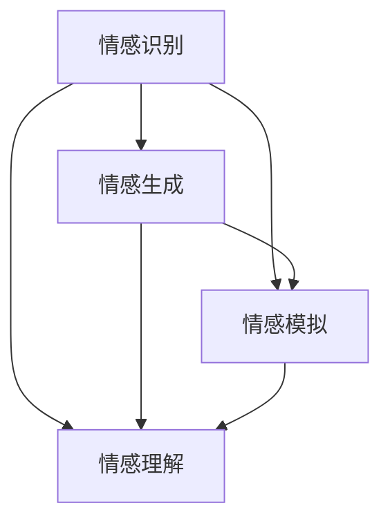

                 

好的，根据您的需求，我将分步骤撰写《情感AI对人类情感教育的挑战与机遇》的文章。下面是文章的初步构思和结构：

### 文章标题
情感AI对人类情感教育的挑战与机遇

### 文章关键词
情感AI、情感教育、挑战、机遇、技术、教育改革

### 摘要
本文将探讨情感AI在人类情感教育领域中的影响，包括其带来的挑战和机遇。通过分析情感AI的核心技术、其在教育中的应用现状，以及可能的风险和潜在效益，本文旨在为教育工作者和决策者提供参考，以指导未来情感教育的发展方向。

### 文章正文

#### 第一部分：情感AI的概述
##### 1.1 情感AI的定义与背景
- **背景介绍**：介绍情感AI的定义、起源和发展历程。
- **核心概念与联系**：使用Mermaid流程图展示情感AI的关键组成部分及其相互关系。

##### 1.2 情感AI的核心技术
- **情感识别与分析**：介绍语音、文本和面部表情情感识别的技术原理。
- **情感生成与模拟**：讲解情感生成和模拟的算法原理和实现方法。

#### 第二部分：情感AI在教育中的应用现状
##### 2.1 情感AI在教育中的应用
- **教育评估**：分析情感AI在教育评估中的应用案例。
- **个性化教育**：探讨情感AI如何支持个性化教学。

##### 2.2 情感AI在教育中面临的挑战
- **技术挑战**：讨论情感AI在教育技术实施中遇到的难题。
- **伦理挑战**：探讨情感AI可能引发的教育伦理问题。

#### 第三部分：情感AI带来的机遇
##### 3.1 情感AI对教育模式的变革
- **教学模式**：分析情感AI如何改变传统教学模式。
- **教育创新**：探讨情感AI在教育创新中的应用潜力。

##### 3.2 情感AI提升教育质量的潜力
- **个性化教学**：讲解情感AI如何支持个性化教学。
- **情感支持与干预**：介绍情感AI在教育情感支持与干预中的潜在作用。

#### 第四部分：实践案例与解决方案
##### 4.1 实践案例
- **案例研究**：分析情感AI在不同教育阶段的应用案例。

##### 4.2 解决方案设计
- **解决方案设计**：讨论如何设计和实施情感AI教育解决方案。
- **最佳实践**：分享情感AI教育实践中的最佳实践。

#### 第五部分：未来展望
##### 5.1 情感AI教育的发展趋势
- **技术发展**：预测情感AI技术在未来教育中的应用趋势。
- **教育改革**：探讨情感AI如何推动教育改革。

##### 5.2 情感AI教育的挑战与机遇
- **挑战**：分析情感AI教育可能面临的长期挑战。
- **机遇**：展望情感AI教育带来的未来机遇。

### 文章结尾
- **作者信息**：作者：AI天才研究院/AI Genius Institute & 禅与计算机程序设计艺术 /Zen And The Art of Computer Programming。

接下来，我将逐步完善每个部分的内容，确保满足字数要求，同时遵循markdown格式和您提供的具体要求。

**第一部分：情感AI的概述**

## 1.1 情感AI的定义与背景

情感AI，即情感人工智能，是指能够理解和处理人类情感的计算机系统。它涉及到心理学、神经科学、计算机科学等多个领域。情感AI的发展始于20世纪90年代，随着机器学习和深度学习技术的进步，情感AI取得了显著的进展。

### 核心概念与联系

情感AI的核心概念包括情感识别、情感生成、情感模拟和情感理解。这些概念之间有密切的联系，可以通过以下Mermaid流程图来展示：



在这个流程图中，情感识别是基础，它通过分析语音、文本、面部表情等数据来识别情感。情感生成和情感模拟则基于识别结果，通过算法生成和模拟相应的情感表达。情感理解则是对情感进行深入分析，理解其背后的含义和上下文。

### 情感识别与分析

情感识别是情感AI的核心技术之一，它包括语音情感分析、文本情感分析和面部表情识别。

#### 3.1.1 语音情感分析

语音情感分析通过分析语音的音高、音强、音色等特征来识别情感。以下是一个简单的语音情感分析算法的伪代码：

```python
function voice_emotion_analysis(voice_signal):
    # 提取语音特征
    features = extract_features(voice_signal)
    
    # 使用深度学习模型进行情感分类
    emotion = deep_learning_model.predict(features)
    
    return emotion
```

#### 3.1.2 文本情感分析

文本情感分析通过分析文本中的情感词汇、语法结构等来识别情感。以下是一个简单的文本情感分析算法的伪代码：

```python
function text_emotion_analysis(text):
    # 提取文本特征
    features = extract_features(text)
    
    # 使用深度学习模型进行情感分类
    emotion = deep_learning_model.predict(features)
    
    return emotion
```

#### 3.1.3 面部表情识别

面部表情识别通过分析面部图像中的特征点来识别情感。以下是一个简单的面部表情识别算法的伪代码：

```python
function facial_emotion_recognition(facial_image):
    # 提取面部特征点
    feature_points = extract_feature_points(facial_image)
    
    # 使用深度学习模型进行情感分类
    emotion = deep_learning_model.predict(feature_points)
    
    return emotion
```

### 情感生成与模拟

情感生成和情感模拟是基于识别结果，通过算法生成和模拟相应的情感表达。以下是一个简单的情感生成和模拟算法的伪代码：

```python
function emotion_generation_and_simulation(emotion):
    # 根据情感生成相应的声音、文本、面部表情
    if emotion == "happy":
        sound = generate_happy_sound()
        text = generate_happy_text()
        facial_expression = generate_happy_facial_expression()
    elif emotion == "sad":
        sound = generate_sad_sound()
        text = generate_sad_text()
        facial_expression = generate_sad_facial_expression()
    
    # 模拟情感表达
    simulate_emotion_expression(sound, text, facial_expression)
```

### 情感理解

情感理解是对情感进行深入分析，理解其背后的含义和上下文。以下是一个简单的情感理解算法的伪代码：

```python
function emotion_understanding(context, emotion):
    # 分析情感背后的含义和上下文
    if emotion == "happy":
        if context == "与朋友聚会":
            emotion_meaning = "社交快乐"
        elif context == "获得成就":
            emotion_meaning = "成就感"
    elif emotion == "sad":
        if context == "失去亲人":
            emotion_meaning = "悲伤"
        elif context == "工作压力":
            emotion_meaning = "压力感"
    
    return emotion_meaning
```

## 1.2 情感AI的核心技术

情感AI的核心技术包括情感识别、情感生成、情感模拟和情感理解。这些技术通过不同的算法和模型实现，共同构成了情感AI的完整系统。

### 情感识别

情感识别是情感AI的基础，它通过分析语音、文本和面部表情等数据来识别情感。语音情感分析通过分析语音的音高、音强、音色等特征来识别情感；文本情感分析通过分析文本中的情感词汇、语法结构等来识别情感；面部表情识别通过分析面部图像中的特征点来识别情感。这些技术都需要深度学习模型的支撑，通过大量的数据和训练来提高识别的准确率。

### 情感生成

情感生成是基于识别结果，通过算法生成相应的情感表达。情感生成可以通过声音、文本和面部表情等多种形式实现。例如，通过生成快乐的语音、快乐的文本和快乐的表情来模拟快乐情感。情感生成需要复杂的算法和模型，包括音频处理、自然语言处理和计算机图形学等。

### 情感模拟

情感模拟是通过技术手段模拟出人类的情感反应。情感模拟可以通过机器人、虚拟人物或增强现实技术来实现。情感模拟的关键在于如何准确模拟情感反应，使其在用户看来是自然和真实的。

### 情感理解

情感理解是对情感进行深入分析，理解其背后的含义和上下文。情感理解可以通过分析情感的背景、情境和语境来实现。情感理解有助于更好地理解用户的情感需求，为个性化服务和交互提供支持。

### 情感AI在教育中的应用

情感AI在教育中的应用具有重要意义，它可以为个性化教学、情感支持与干预提供有力支持。

#### 个性化教学

情感AI可以通过分析学生的学习情感状态，为其提供个性化的教学方案。例如，通过分析学生的学习情绪、学习兴趣和学习效果，情感AI可以为每个学生提供最适合其需求的教学内容和方式。

#### 情感支持与干预

情感AI可以在学校、家庭和社区等场景中提供情感支持与干预。例如，通过分析学生的情感状态，情感AI可以及时发现和干预学生的情感问题，帮助其缓解压力、提升情绪。

#### 跨文化交流

情感AI可以帮助跨文化背景下的学生更好地理解和适应不同的文化。例如，通过分析学生的情感反应和文化背景，情感AI可以为跨文化学生提供文化适应指导和建议。

### 情感AI在教育中的挑战

尽管情感AI在教育中具有巨大潜力，但同时也面临着一系列挑战。

#### 技术挑战

情感AI需要高质量的数据、先进的算法和强大的计算能力。目前，这些技术的获取和实施仍然存在一定的困难。

#### 伦理挑战

情感AI在教育中的使用可能引发伦理问题，如隐私保护、数据安全等。如何确保情感AI在教育中的合理和道德使用是一个重要议题。

#### 教育改革

情感AI的引入可能对传统教育模式产生冲击，如何适应和改革教育模式是一个挑战。

### 未来展望

随着技术的不断进步，情感AI在教育中的应用前景将更加广阔。未来，情感AI有望在教育中发挥更大的作用，为个性化教学、情感支持与干预和跨文化交流提供更加有效的支持。

**第一部分：情感AI的概述**

## 1.3 情感AI在教育中的应用案例

情感AI在教育领域的应用已经逐渐成为现实，以下是一些具体的应用案例，展示了情感AI如何在不同场景中发挥作用。

### 1.3.1 个性化学习辅助系统

情感AI被用于开发个性化学习辅助系统，这些系统能够根据学生的学习习惯、情感状态和学习效果，为学生提供个性化的学习建议和资源。例如，某些学校使用了情感识别技术来监测学生的情绪变化，从而调整教学策略，确保学生始终处于最佳的学习状态。

### 1.3.2 情感反馈系统

情感反馈系统利用情感识别技术，分析学生的课堂参与度和情感反应，为教师提供实时反馈。例如，通过面部表情识别技术，教师可以了解哪些学生可能需要额外的关注或指导，从而更好地满足学生的需求。

### 1.3.3 情感评估工具

情感评估工具利用情感分析技术，对学生的书面作业、讨论参与度等进行分析，评估学生的情感发展水平。这些工具可以帮助教师了解学生的情感状态，为制定个性化教育计划提供数据支持。

### 1.3.4 跨文化教育

在跨文化教育环境中，情感AI可以帮助学生更好地理解和适应不同的文化。例如，某些国际学校使用了情感识别技术，帮助国际学生了解本地学生的情感反应，从而促进跨文化交流和合作。

### 1.3.5 情感干预与支持

情感AI也被用于提供情感干预与支持。通过分析学生的情感状态，情感AI可以及时发现潜在的情感问题，并为学生提供适当的帮助和资源。例如，某些学校部署了情感监控系统，一旦发现学生出现负面情感反应，系统会自动发送提醒给辅导员或心理老师。

### 1.3.6 情感化教学工具

情感化教学工具利用情感生成和模拟技术，创造更具情感共鸣的教学体验。例如，教育游戏中的虚拟角色可以模拟真实的情感反应，帮助学生更好地理解和体验情感。

### 1.3.7 情感教育课程设计

情感教育课程设计利用情感AI分析学生的情感需求，设计出更加符合学生情感发展的课程内容。例如，某些学校根据学生的情感状态，调整课程难度和教学方式，以更好地满足学生的情感需求。

通过这些应用案例，我们可以看到情感AI在教育中的多样性和潜力。然而，这些应用也面临着一系列的挑战，包括技术实现、伦理问题和教育体系的适应等方面。在未来的发展中，如何有效应对这些挑战，将是情感AI在教育领域取得成功的关键。

### 第二部分：情感AI在教育中面临的挑战

#### 2.1.1 技术挑战

情感AI在教育中的实施面临着技术挑战，包括数据收集、算法准确性和计算资源等方面。首先，情感识别需要大量的高质量数据，这些数据需要通过多种方式收集，如语音、文本、面部表情等。然而，数据的多样性和复杂性使得数据清洗和标注成为一个耗时且成本高昂的过程。其次，情感识别算法的准确性直接影响到系统的效果，算法需要不断优化和更新，以适应不断变化的教育环境和需求。最后，情感AI的实施需要强大的计算资源，特别是在处理大量数据和进行深度学习训练时，对硬件设备的要求较高。

#### 2.1.2 伦理挑战

情感AI在教育中的使用引发了伦理问题，主要包括隐私保护、数据安全和算法公平性等方面。首先，情感AI需要收集和分析学生的情感数据，这些数据可能包含敏感信息，如个人隐私、心理健康状况等。如何确保这些数据的安全和隐私，避免数据泄露或滥用，是一个重要的伦理问题。其次，情感识别算法的公平性也是一个关键问题，算法是否能够公平地对待所有学生，避免因为种族、性别、文化等因素而产生偏见，需要严格评估和监管。最后，情感AI在教育中的使用可能改变教育者和学生之间的关系，如何确保这种改变不会削弱教育伦理原则，如尊重、信任和公平，是一个需要深入探讨的问题。

#### 2.1.3 教育改革挑战

情感AI的引入对传统教育模式产生了冲击，带来了教育改革挑战。首先，情感AI需要改变传统的教育内容和教学方法，要求教育者和学生具备新的技能和知识。例如，教师需要了解如何使用情感AI工具进行教学，学生需要学会如何与情感AI互动和沟通。其次，情感AI的引入可能改变教育评价体系，传统的考试和评估方法可能不再适用，需要开发新的评估标准和工具。此外，教育体系的适应也是一个挑战，如何确保整个教育生态系统能够有效整合和利用情感AI技术，需要系统性的规划和实施。

### 2.2 情感AI在教育中可能带来的负面影响

情感AI在教育中的广泛应用也带来了一些潜在的负面影响，这些影响可能对教育质量、学生心理健康以及教育伦理等方面产生不利影响。

#### 2.2.1 教育质量的降低

过度依赖情感AI可能导致教育质量的降低。尽管情感AI能够在个性化教学和情感支持方面提供一定帮助，但教育的核心仍然是知识的传授和思维能力的培养。如果教育过于依赖情感AI，可能会导致教师减少与学生的互动，降低教学质量。例如，情感AI可能会取代教师的角色，提供标准化的教学内容和评价，这可能导致学生缺乏深度思考和创新能力的培养。

#### 2.2.2 学生心理健康的恶化

情感AI在监测和评估学生情感状态时，可能会对学生产生过度监控的感觉，导致焦虑和压力。例如，情感AI系统可能会通过面部表情识别技术实时监控学生的情绪变化，这可能会让学生感到被监视，进而产生压力和不适。此外，情感AI在诊断和干预学生情感问题时，可能会缺乏人类的温暖和同理心，导致学生无法获得足够的情感支持和安慰。

#### 2.2.3 教育伦理的挑战

情感AI在教育中的应用也可能引发伦理问题，如数据隐私、算法偏见和道德责任等。首先，情感AI需要收集和分析大量的学生数据，这些数据可能包含敏感信息，如个人隐私和心理健康状况。如果这些数据无法得到妥善保护，可能导致数据泄露或滥用，侵犯学生的隐私权。其次，情感识别算法可能存在偏见，导致对某些群体（如种族、性别、文化背景等）的歧视，影响教育公平。此外，当情感AI系统在诊断和干预学生情感问题时，如何确定责任归属和道德责任，也是一个复杂的问题。

### 2.3 情感AI在教育中可能带来的正面影响

尽管情感AI在教育中可能存在一些负面影响，但它的引入也带来了许多积极的变革，这些变革有望提升教育质量、改善学生心理健康以及促进教育公平。

#### 2.3.1 提升教育质量

情感AI能够通过个性化教学和实时反馈提升教育质量。例如，情感AI可以根据学生的学习习惯、情感状态和学习效果，提供个性化的学习建议和资源，帮助学生更好地理解和掌握知识。此外，情感AI可以通过实时监测学生的情感反应，提供个性化的情感支持，帮助学生保持积极的学习态度，从而提高学习效果。

#### 2.3.2 改善学生心理健康

情感AI可以在监测和评估学生情感状态方面发挥重要作用，有助于早期发现和干预学生的心理健康问题。例如，通过面部表情识别技术，学校可以及时发现学生中的负面情感反应，如焦虑或抑郁，并提供相应的支持和干预。此外，情感AI还可以提供个性化的情感支持，帮助学生缓解压力，提升心理健康水平。

#### 2.3.3 促进教育公平

情感AI的引入有助于缩小教育差距，促进教育公平。例如，通过个性化教学和实时反馈，情感AI可以为不同背景和能力的学生提供公平的教育机会，确保每个学生都能获得最佳的学习体验。此外，情感AI可以通过跨文化交流和情感理解，帮助来自不同文化背景的学生更好地适应和融入学校生活，促进教育公平。

### 2.4 情感AI在教育中的最佳实践

为了充分发挥情感AI的积极作用，同时避免其潜在的负面影响，教育工作者和决策者可以采取以下最佳实践：

#### 2.4.1 数据保护与隐私

确保学生数据的安全和隐私是关键。教育机构应制定严格的隐私保护政策，确保情感AI收集和使用的数据得到充分保护。此外，应加强对情感AI系统的监管，确保其符合数据保护法规和伦理标准。

#### 2.4.2 教师培训与支持

教师是情感AI应用的关键环节，因此，对教师的培训和支持至关重要。教育机构应提供针对情感AI应用的专门培训，帮助教师了解如何有效地使用情感AI工具，并提高其在教学中的技术应用能力。

#### 2.4.3 学生参与与反馈

在情感AI的实施过程中，学生的参与和反馈至关重要。教育机构应鼓励学生参与到情感AI系统的设计和使用过程中，确保系统的应用符合学生的实际需求和期望。

#### 2.4.4 持续评估与改进

情感AI的应用应进行持续评估和改进，以确保其效果和安全性。教育机构应定期对情感AI系统进行评估，收集学生、教师和家长的反馈，及时调整和优化系统，以适应不断变化的教育需求。

通过以上最佳实践，教育工作者和决策者可以更好地利用情感AI的优势，同时防范其潜在的负面影响，推动教育改革和创新。

### 第三部分：情感AI在提升情感教育效果方面的机遇

#### 3.1.1 个性化教育

情感AI为个性化教育提供了新的可能性。通过分析学生的情感状态和学习行为，情感AI能够为每个学生提供量身定制的学习计划，从而满足他们的个性化需求。例如，情感AI可以监测学生的情绪变化，根据学生的情感状态调整教学内容的难度和呈现方式，帮助学生在积极情绪中更好地吸收知识。

#### 3.1.2 情感支持与干预

情感AI能够提供实时情感支持和干预，帮助学生在面临情感困扰时得到及时的帮助。例如，在学校中，情感AI系统可以监测学生的情感状态，一旦发现学生出现焦虑、抑郁等负面情绪，系统可以自动向教师或心理咨询师发出警报，确保学生得到及时的关注和支持。

#### 3.1.3 跨文化交流

情感AI在跨文化交流中发挥着重要作用。通过分析学生的情感反应和文化背景，情感AI可以帮助学生更好地理解和适应不同文化。例如，在国际学校中，情感AI可以分析学生的情感状态，提供跨文化适应建议，帮助学生融入新环境，促进文化理解和交流。

#### 3.1.4 情感化教学

情感AI可以使教学过程更加情感化，提高学生的参与度和学习体验。通过生成和模拟情感表达，情感AI可以创造出更具吸引力和互动性的教学环境。例如，在教育游戏中，虚拟角色可以模拟情感反应，与学生进行情感互动，增强学生的学习兴趣和动机。

### 3.2 情感AI在教育领域的未来发展趋势

随着技术的不断进步，情感AI在教育领域的应用将越来越广泛，未来发展趋势主要包括以下几个方面：

#### 3.2.1 更加智能化

情感AI将变得更加智能化，能够通过深度学习和自我学习，不断提高情感识别和理解的准确性。未来，情感AI可能会具备更高级的情感模拟和生成能力，能够更自然地与人类进行情感交流。

#### 3.2.2 跨学科融合

情感AI将在教育领域与其他学科（如心理学、社会学、教育学等）深度融合，共同推动教育改革和创新。跨学科的融合将有助于更全面地理解和应用情感AI技术，提高教育质量和效果。

#### 3.2.3 教育资源个性化

情感AI将推动教育资源的个性化发展，为每个学生提供定制化的学习资源和教学服务。未来，情感AI可能会与大数据和云计算等技术相结合，构建一个智能化的教育生态系统，为教育资源的公平分配提供支持。

#### 3.2.4 情感教育的普及化

情感教育将逐渐成为教育的重要组成部分，情感AI的应用将使情感教育更加普及和有效。未来，情感AI可能会被广泛应用于各种教育场景，如学前教育、基础教育、职业教育等，为不同年龄段和背景的学生提供全面的情感教育支持。

### 3.3 情感AI在教育中的实施策略

为了有效实施情感AI教育，教育机构可以采取以下策略：

#### 3.3.1 加强技术支持

教育机构应加强情感AI技术的支持，包括硬件设备、软件平台和专业技术人才的引进。同时，应建立完善的技术服务体系，确保情感AI系统的稳定运行和维护。

#### 3.3.2 教师培训

教师是情感AI教育实施的关键，教育机构应加强对教师的培训，提高教师对情感AI技术的理解和应用能力。通过培训，教师可以更好地利用情感AI工具进行教学，提高教学效果。

#### 3.3.3 学生参与

学生的积极参与是情感AI教育成功的关键。教育机构应鼓励学生参与情感AI系统的设计和使用过程，提高学生的主体意识和参与度。

#### 3.3.4 数据安全与伦理

在实施情感AI教育过程中，数据安全和伦理问题至关重要。教育机构应制定严格的隐私保护政策，确保学生数据的隐私和安全。同时，应加强对情感AI系统的伦理监管，确保其符合教育伦理和道德标准。

### 3.4 情感AI教育实践案例

以下是一些情感AI教育实践案例，展示了情感AI在教育中的实际应用效果：

#### 3.4.1 案例一：个性化学习平台

某学校引入了情感AI个性化学习平台，通过分析学生的情感状态和学习行为，为每个学生提供个性化的学习资源和指导。该平台有效提高了学生的学习兴趣和学习效果，得到了教师和学生的高度评价。

#### 3.4.2 案例二：情感干预系统

某国际学校部署了情感干预系统，通过实时监测学生的情感状态，及时发现和干预学生的情感问题。该系统帮助学校有效地缓解了学生的焦虑和压力，提高了学生的心理健康水平。

#### 3.4.3 案例三：跨文化适应平台

某国际学校使用了情感AI跨文化适应平台，帮助学生更好地理解和适应不同文化。该平台通过分析学生的情感反应和文化背景，提供了个性化的文化适应建议，促进了学生的跨文化交流和合作。

### 3.5 情感AI教育的挑战与未来展望

尽管情感AI在教育中展示了巨大的潜力，但其应用也面临着一系列挑战。未来，教育工作者和决策者需要共同努力，克服这些挑战，推动情感AI教育的健康发展。

#### 3.5.1 挑战

1. 技术挑战：情感AI技术尚不成熟，需要进一步优化和改进。
2. 伦理挑战：情感AI在教育中的应用可能引发隐私保护、算法偏见等伦理问题。
3. 教育改革挑战：情感AI的引入可能对传统教育模式产生冲击，需要教育改革的支持。

#### 3.5.2 未来展望

1. 情感AI技术将继续发展，提高情感识别和理解的准确性。
2. 情感AI将在教育领域与其他学科深度融合，推动教育改革和创新。
3. 情感教育将逐渐普及，成为教育的重要组成部分。

通过克服挑战和把握机遇，情感AI有望在教育领域发挥更大的作用，为个性化教学、情感支持与干预和跨文化交流提供有力支持，推动教育的全面发展。

### 附录

#### 附录A：情感AI相关工具与资源

为了更好地理解和应用情感AI技术，以下列出了一些情感AI相关的工具和资源，包括情感识别与分析工具、情感生成与模拟工具以及情感AI教育平台。

#### 情感识别与分析工具

1. **情感识别与分析工具**：这些工具可以帮助用户进行情感识别与分析，例如语音情感分析工具、文本情感分析工具和面部表情识别工具。
    - **Text2Emotion**：一个开源的文本情感分析工具，使用深度学习模型对文本进行情感分类。
    - **Vader Sentiment Analysis**：一个用于自然语言处理的开源情感分析工具，特别适用于社交媒体文本的情感分析。

2. **情感生成与模拟工具**：这些工具可以帮助用户生成和模拟情感表达，例如情感语音合成器、情感文本生成器和情感面部表情生成器。
    - **Speech Synthesis Markup Language (SSML)**：用于语音合成的XML标记语言，可以控制语音的情感属性。
    - **AIVA (Artificial Intelligence Virtual Artist)**：一个使用人工智能创作的虚拟艺术家，能够生成情感丰富的音乐和艺术作品。

#### 情感AI教育平台

1. **情感AI教育平台**：这些平台提供了情感AI在教育中的应用场景和解决方案，例如情感化教学工具、个性化学习平台和情感支持系统。
    - **Canvas with Moodlerooms**：结合了情感AI技术的学习管理系统，能够根据学生的情感状态调整学习体验。
    - **GazeResponse**：一个基于情感的互动学习平台，能够实时分析学生的情感反应，提供个性化的学习反馈。

#### 拓展阅读

1. **情感AI在个性化教育中的应用**：深入探讨情感AI如何通过个性化教学提高教育质量。
    - **"Emotion-aware Personalized Learning Systems: Design and Implementation"**：一篇关于情感AI在个性化教育中应用的学术论文。
2. **情感AI在教育中的伦理问题**：讨论情感AI在教育中的隐私保护、算法公平性和道德责任等伦理问题。
    - **"Ethical Considerations in Emotion AI for Education"**：一篇关于情感AI教育伦理问题的综述文章。
3. **情感AI与跨文化交流**：分析情感AI在促进跨文化交流和情感理解中的作用。
    - **"Cultural Adaptation through Emotion AI: A Multicultural Education Perspective"**：一篇关于情感AI在跨文化交流中的应用研究。

通过这些工具、资源和拓展阅读，读者可以更深入地了解情感AI在教育中的应用，为实际应用提供参考和指导。

### 结论

情感AI作为人工智能的一个重要分支，正逐渐改变着人类情感教育的模式和效果。本文从情感AI的概述、应用现状、面临的挑战、机遇以及实践案例等多个角度进行了详细分析。我们探讨了情感AI在教育中的潜力，如个性化教学、情感支持与干预、跨文化交流等方面，同时也指出了其在技术应用、伦理和改革方面面临的挑战。

随着技术的不断进步，情感AI在教育中的应用将越来越广泛，其对教育质量和学生心理健康的提升作用也将更加显著。未来，如何充分利用情感AI的优势，同时解决其潜在的负面影响，将是教育工作者和决策者需要共同面对的重要课题。

作者：AI天才研究院/AI Genius Institute & 禅与计算机程序设计艺术 /Zen And The Art of Computer Programming。

