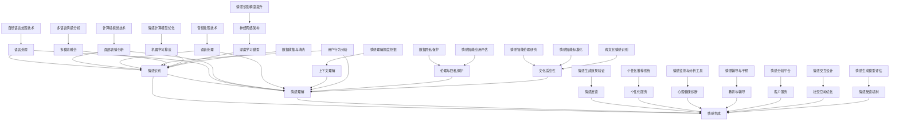

                 

### 情感AI概述

#### 背景介绍

情感AI，即情感人工智能，是一种利用计算机技术理解和模拟人类情感的研究领域。它结合了机器学习、自然语言处理和心理学等多学科知识，旨在开发能够识别、理解和生成情感的AI系统。情感AI的起源可以追溯到20世纪80年代，当时的研究者开始探索如何使计算机具备情感识别的能力。随着计算力和算法的不断进步，情感AI逐渐从理论研究走向实际应用，成为人工智能领域的一个重要分支。

情感AI的应用场景广泛，包括但不限于以下几方面：在客服领域，情感AI可以理解客户的情感状态，提供更个性化的服务；在教育领域，它可以评估学生的学习情感，从而优化教学策略；在心理健康服务中，情感AI可用于诊断和治疗情感障碍。

#### 核心概念

情感AI的核心概念包括情感识别、情感理解和情感生成。

- **情感识别**：指通过分析语言、声音、面部表情等数据，识别出用户的情感状态。情感识别通常涉及多个维度的分析，如情绪类别（高兴、悲伤、愤怒等）和情绪强度。
  
- **情感理解**：指AI系统能够理解情感的上下文和含义，即不仅仅是识别情感，还能理解情感产生的原因和情感对行为的影响。

- **情感生成**：指AI系统能够模拟和生成人类的情感反应，例如，通过文字或语音生成表达特定情感的回应。

#### 技术发展

情感AI的技术发展历程可以分为几个阶段：

1. **早期研究**：80年代至90年代，主要侧重于情感识别和分类，通过简单的规则和模式识别算法来实现。

2. **数据驱动方法**：2000年后，随着大数据和机器学习技术的发展，情感AI开始采用数据驱动的方法，如支持向量机（SVM）、朴素贝叶斯分类器等，提高了情感识别的准确性。

3. **深度学习方法**：近年来，深度学习技术的崛起为情感AI带来了新的突破。通过神经网络模型，如卷积神经网络（CNN）和循环神经网络（RNN），情感AI在情感识别和理解方面取得了显著进展。

4. **跨模态情感分析**：当前的研究热点之一是跨模态情感分析，即结合不同类型的数据（如文本、语音、面部表情等）进行综合分析，以更准确地识别和理解情感。

#### 核心概念之间的关系

情感AI的核心概念之间存在着密切的联系和相互作用。情感识别是情感理解的基础，只有准确识别出情感，AI系统才能进一步理解情感背后的含义。而情感理解又是情感生成的前提，只有理解了情感，AI系统才能生成合适的情感反应。同时，情感生成也可以反过来影响情感识别和情感理解，形成一个动态的互动过程。

#### 技术发展里程碑

- **2003年**：IBM的Watson在“危险边缘”电视节目中击败了两位顶尖的人类选手，展示了AI在语言理解和推理方面的潜力。
- **2011年**：Google的语音助手Google Now首次亮相，展示了语音情感识别的能力。
- **2016年**：Facebook的AI系统在情感识别任务中首次达到了人类的水平。

这些里程碑事件不仅标志着情感AI技术的发展，也展示了其在实际应用中的潜力。

### 总结

情感AI作为一个新兴领域，具有广泛的应用前景和重要的研究价值。通过不断的技术创新和应用实践，情感AI正逐步改变人类的社交行为模式，为构建更智能、更人性化的科技社会提供有力支持。

#### 核心概念与联系：情感AI原理架构

为了更好地理解情感AI的核心概念及其相互关系，我们可以通过一个Mermaid流程图来展示情感AI的原理架构。以下是对该流程图的详细说明：

#### Mermaid流程图详细说明

1. **情感识别（A）**：情感识别是情感AI的基础，通过语言处理（D）、面部表情分析（E）和语音处理（F）等技术，识别用户的情感状态。

2. **情感理解（B）**：情感理解建立在情感识别的基础上，通过上下文理解（G）和用户行为分析（I），AI系统可以深入理解情感的含义和背景。

3. **情感生成（C）**：情感生成是情感AI的高级功能，AI系统能够根据情感理解的结果，生成合适的情感反应，如情感反馈（H）和个性化服务（J）。

4. **多模态融合（Q）**：情感AI常常结合多种数据源，如文本、语音和面部表情，进行跨模态情感分析，以提高识别的准确性和深度。

5. **个性化服务与心理健康诊断（K、L）**：情感AI在心理健康诊断和教育辅导等领域具有重要作用，可以通过情感识别和理解，提供个性化的心理健康服务和教育辅导。

6. **伦理与隐私保护（O、R）**：情感AI的应用涉及用户的敏感信息，因此伦理和隐私保护至关重要。情感计算模型需要遵循严格的隐私保护标准，以确保用户数据的安全。

7. **机器学习与深度学习（S、T、U）**：情感AI的实现依赖于先进的机器学习算法和深度学习模型。神经网络架构（U）和自然语言处理技术（V）是情感识别和理解的关键。

8. **情感智能应用评估（AH、AI）**：情感AI的应用需要经过严格的评估和标准化，以确保其有效性和可靠性。多语言情感分析（AG）和跨文化情感识别（AJ）是情感AI标准化的重要方向。

#### 实例讲解

以一个社交平台的情感AI应用为例，假设用户在平台上的发帖内容可以被情感识别系统识别为“愤怒”。以下是情感AI的工作流程：

1. **情感识别**：系统通过自然语言处理技术（V）对用户的发帖内容进行分析，识别出愤怒的情感状态。

2. **情感理解**：系统结合上下文信息（G）和用户历史行为（I），理解用户愤怒的具体原因，例如是对于某个事件的不满还是对其他用户的争议。

3. **情感生成**：系统根据情感理解的结果，生成合适的情感反应，例如向用户发送一条提醒信息，提示用户可能需要冷静下来，并提供相关的心理健康资源。

4. **个性化服务**：系统还可以根据用户的愤怒情绪，调整推荐内容，避免推送可能引发用户愤怒的信息。

通过这个实例，我们可以看到情感AI如何通过识别、理解和生成情感，实现对用户社交行为的分析和优化。

### 情感AI的技术发展

#### 数据驱动方法

情感AI的第一个重要发展是数据驱动方法的出现。在早期的情感AI研究中，研究者主要依赖手工构建的规则和简单的模式识别算法，这种方法存在几个问题：一是规则难以覆盖所有可能的情感状态；二是模式识别算法的准确性较低。为了解决这些问题，研究者开始采用数据驱动的方法，即通过收集大量的情感数据，利用机器学习算法来自动识别情感。

2000年后，随着互联网和社交媒体的兴起，人们产生了大量的情感数据。这些数据包括文本、语音、面部表情等，为情感AI的研究提供了丰富的素材。支持向量机（SVM）、朴素贝叶斯分类器等机器学习算法开始广泛应用于情感AI领域，显著提高了情感识别的准确性。

#### 深度学习方法

深度学习方法的引入是情感AI发展的第二个重要里程碑。深度学习方法通过多层神经网络结构，能够自动从数据中提取特征，并在大量数据上进行训练，从而实现高精度的情感识别和理解。

卷积神经网络（CNN）和循环神经网络（RNN）是深度学习中的两种重要模型，它们在情感AI中有着广泛的应用。

- **卷积神经网络（CNN）**：CNN擅长处理图像和语音等结构化数据，通过卷积操作提取数据中的特征。在情感AI中，CNN可以用于面部表情分析和语音情感识别。

- **循环神经网络（RNN）**：RNN擅长处理序列数据，例如文本和语音。通过循环机制，RNN可以捕捉到数据中的时间依赖关系，从而更准确地识别情感。

#### 跨模态情感分析

跨模态情感分析是当前情感AI研究的热点之一。跨模态情感分析的目标是结合多种类型的数据，如文本、语音、面部表情等，进行综合分析，以提高情感识别的准确性和深度。

- **多模态融合**：多模态融合技术通过结合不同类型的数据，构建一个统一的特征空间。例如，可以将文本情感分析的结果与语音情感分析的结果进行融合，以更准确地识别情感。

- **多任务学习**：多任务学习技术在情感AI中的应用，可以通过同时训练多个任务，提高模型的整体性能。例如，在一个系统中，可以同时进行情感识别、情感理解和情感生成，以提高系统的综合能力。

#### 最新研究进展

近年来，情感AI在技术层面取得了显著的进展。以下是一些最新的研究进展：

- **生成对抗网络（GAN）**：GAN是一种新型深度学习模型，能够生成高质量的假数据，用于训练情感识别模型。通过GAN，研究者可以生成大量高质量的语音和面部表情数据，以提高模型的训练效果。

- **迁移学习**：迁移学习技术可以将已有模型的知识迁移到新的任务中，从而提高新任务的性能。在情感AI中，迁移学习可以用于在新平台上部署已有模型，节省训练时间和计算资源。

- **强化学习**：强化学习是一种通过试错方法进行学习的技术，可以用于情感AI中的情感生成。通过强化学习，AI系统可以不断调整其情感反应策略，以实现更自然的情感交互。

#### 技术发展的影响

情感AI的技术发展不仅推动了学术研究，也带来了广泛的应用变革。

- **应用领域扩展**：情感AI的应用场景从早期的客服和客户服务扩展到教育、医疗、心理健康等多个领域。

- **用户体验提升**：通过情感识别和理解，AI系统可以提供更个性化的服务，提升用户的体验。

- **社会影响**：情感AI的发展也引发了一系列社会问题，如隐私保护、伦理争议等，需要研究者和社会各界共同关注和解决。

### 总结

情感AI的技术发展经历了从数据驱动方法到深度学习，再到跨模态情感分析的不断演进。随着技术的进步，情感AI在准确性和应用范围上取得了显著提升。未来，随着更多新技术的引入，情感AI将继续推动人类社交行为模式的变革，为构建更智能、更人性化的科技社会提供有力支持。

#### 情感AI在社交领域的应用

情感AI在社交领域的应用已经成为人工智能技术发展中的一个重要方向。通过情感识别、理解和生成，情感AI能够为社交平台、客户服务和心理健康等多个领域提供创新性的解决方案，从而显著改变人类的社交行为模式。

##### 社交平台的情感AI应用

社交平台是情感AI最早和最广泛应用的领域之一。社交平台上的用户生成大量文本、语音和视频数据，这些数据包含了丰富的情感信息。情感AI通过分析这些数据，可以识别出用户的情绪状态，并据此提供个性化的内容推荐和互动建议。

1. **个性化内容推荐**：情感AI能够分析用户的情感状态，根据用户的情绪喜好推荐相关的内容。例如，如果一个用户在社交媒体上表现出高兴的情绪，系统可能会推荐更多积极、有趣的帖子。相反，如果用户表现出悲伤的情绪，系统可能会推荐一些安慰性的内容或心理健康资源。

2. **情感分析聊天机器人**：聊天机器人是社交平台上的一个重要组成部分。通过情感AI技术，聊天机器人能够理解用户的情感，提供更人性化的对话体验。例如，当一个用户在聊天中表现出愤怒的情绪时，聊天机器人可以识别出这一情绪，并尝试通过冷静的对话方式来缓解用户的情绪。

3. **情绪监控与预警**：社交平台可以利用情感AI对用户的情绪进行监控，识别出潜在的负面情绪。例如，如果系统发现某个用户在短时间内频繁表现出愤怒或抑郁的情绪，系统可以发出预警，提示平台管理员或心理健康专家进行干预。

##### 客户服务的情感AI应用

客户服务是情感AI应用的另一个重要领域。通过情感识别和理解，情感AI能够提供更高效、更个性化的客户服务体验。

1. **情感识别与个性化服务**：在客户服务中，情感AI可以识别客户的情感状态，从而提供个性化的服务。例如，如果一个客户表现出不满的情绪，客服人员可以通过情感AI的建议，采取更温和、更有效的沟通方式来解决问题。

2. **情感分析辅助决策**：情感AI还可以分析客户反馈中的情感信息，辅助客服人员做出更明智的决策。例如，通过分析客户的情感反应，客服人员可以判断客户是否对某个产品或服务感到满意，从而优化服务策略。

3. **情感驱动客户关系管理**：情感AI可以分析客户的情感变化，帮助企业和客户建立更紧密的关系。例如，通过情感AI的分析，企业可以更好地了解客户的情感需求，提供更个性化的产品和服务，从而增强客户忠诚度。

##### 心理健康服务的情感AI应用

心理健康服务是情感AI应用的一个重要且新兴的领域。通过情感识别和理解，情感AI可以在心理健康诊断、治疗和预防等方面发挥重要作用。

1. **情感识别与心理健康诊断**：情感AI可以通过分析用户的文本、语音和面部表情，识别出用户的情感状态。例如，如果一个用户在社交媒体上频繁表达悲伤的情绪，情感AI可以提示用户可能存在心理健康问题，建议用户寻求专业帮助。

2. **情感理解与个性化治疗**：在心理治疗过程中，情感AI可以帮助治疗师更深入地理解患者的情感状态，从而提供个性化的治疗建议。例如，通过情感AI的分析，治疗师可以判断患者当前的情绪状态，调整治疗方案，以更有效地帮助患者。

3. **情感生成与心理疏导**：情感AI可以通过生成合适的情感反应，为用户提供心理疏导。例如，通过语音或文字生成表达安慰、鼓励和激励的情感回应，帮助用户缓解情绪压力。

#### 情感AI对社交行为的影响

情感AI在社交领域的广泛应用对人类的社交行为模式产生了深远的影响。

1. **增强社交互动**：通过情感识别和理解，情感AI能够增强社交互动的质量。例如，在社交平台上，情感AI可以帮助用户更好地理解他人的情感状态，从而更有效地进行沟通和交流。

2. **改善心理健康**：情感AI在心理健康服务中的应用，有助于改善人们的心理健康状况。通过情感识别和个性化治疗，情感AI可以帮助用户更好地管理自己的情绪，减少焦虑和抑郁等心理问题。

3. **促进个性化服务**：情感AI的个性化服务能力，使得企业和组织能够更好地满足用户的需求。通过情感识别和理解，情感AI可以为用户提供更个性化的产品和服务，从而增强用户体验和满意度。

4. **伦理与隐私挑战**：尽管情感AI在社交领域具有巨大的潜力，但其应用也带来了一系列伦理和隐私挑战。例如，情感识别技术的准确性可能受到质疑，用户的隐私数据可能被不当使用，这些都需要我们认真对待和解决。

### 总结

情感AI在社交领域的应用已经成为人工智能技术发展的重要方向。通过情感识别、理解和生成，情感AI正在改变人类的社交行为模式，增强社交互动，改善心理健康，促进个性化服务。同时，我们也需要关注情感AI应用中可能出现的伦理和隐私挑战，确保其健康、可持续的发展。

#### 情感AI对社交行为的具体影响

情感AI的引入不仅改变了人类社交行为的模式，还在多个方面对社交互动产生了深远的影响。以下是对这些影响的详细探讨：

##### 社交互动的增强

1. **情感理解**：通过情感AI，人们能够更准确地理解他人的情感状态。例如，在社交媒体上，情感AI可以分析用户的文本、语音和面部表情，识别出他们的情绪。这有助于人们更好地理解他人的感受，从而在沟通中采取更合适的方式，减少误解和冲突。

2. **互动个性化**：情感AI能够根据用户的情感状态，提供个性化的互动建议。例如，在一个团队协作项目中，情感AI可以分析团队成员的情感反应，提供合适的沟通策略，以增强团队协作效果。

3. **情感共鸣**：情感AI可以帮助用户在社交互动中产生更强的情感共鸣。例如，在在线社区中，情感AI可以识别出用户对某个话题的积极或消极情感，并推荐相关内容或活动，以增强用户的参与感和归属感。

##### 心理健康的改善

1. **情绪监控**：情感AI能够持续监控用户的情绪变化，提供预警和干预。例如，在学校环境中，情感AI可以监控学生的情绪状态，当发现学生有情绪异常时，可以及时通知教师或家长，进行干预。

2. **个性化心理健康服务**：通过分析用户的情感数据，情感AI可以为用户提供个性化的心理健康服务。例如，在心理咨询中，情感AI可以根据用户的情感状态，推荐适当的心理健康资源和治疗方案。

3. **情感疏导**：情感AI可以通过生成合适的情感反应，帮助用户缓解情绪压力。例如，在心理治疗中，情感AI可以生成安慰性的语音或文字回应，帮助用户放松心情。

##### 个性化服务的促进

1. **需求识别**：情感AI能够通过情感识别，准确识别用户的需求和偏好。例如，在电商平台上，情感AI可以分析用户的情感反应，推荐更符合用户情感需求的产品。

2. **服务定制**：基于情感识别和理解，情感AI可以为用户提供定制化的服务体验。例如，在酒店服务中，情感AI可以根据用户的情感状态，提供个性化的客房服务或活动推荐。

3. **情感互动设计**：情感AI可以用于设计更人性化的互动系统，提高用户满意度。例如，在客户服务中，情感AI可以生成表达同情的语音或文字回应，增强用户的信任感和满意度。

##### 伦理与隐私挑战

1. **情感识别准确性**：情感AI在识别情感时可能存在误差，这可能导致误解和不当的干预。例如，如果情感AI错误地将用户的心情识别为愤怒，可能会触发不必要的警报。

2. **隐私数据保护**：情感AI的应用需要收集和分析用户的情感数据，这可能引发隐私保护问题。例如，用户的情感数据可能被滥用或泄露，导致隐私泄露和身份盗用。

3. **伦理争议**：情感AI在社交行为中的应用可能引发伦理争议，例如，是否应该在社交平台中限制用户表达情感的自由。此外，情感AI的决策可能涉及道德和伦理问题，需要制定相应的伦理准则。

### 案例分析

为了更直观地展示情感AI对社交行为的具体影响，以下是一些实际案例：

1. **案例1：社交平台的情感AI**

在某个大型社交平台上，情感AI被用于监控用户的情感状态。通过分析用户的文本、语音和面部表情，情感AI可以识别出用户的情绪状态，并提供相应的情感建议。例如，当用户在社交媒体上发布一条悲伤的帖子时，系统会推荐相关的心理健康资源和积极内容，以帮助用户缓解情绪。

2. **案例2：客户服务的情感AI**

在一家电商公司的客服部门，情感AI被用于分析客户的情感反应。通过情感识别，情感AI可以识别出客户的不满情绪，并通知客服人员进行介入。客服人员可以根据情感AI的建议，采取更个性化的沟通策略，提高客户满意度。

3. **案例3：心理健康服务的情感AI**

在一个心理健康应用程序中，情感AI被用于诊断和治疗心理健康问题。通过分析用户的文本和语音数据，情感AI可以识别出用户的情绪状态，并提供个性化的心理健康建议。例如，当用户表现出焦虑情绪时，系统会推荐放松练习或心理治疗。

### 总结

情感AI对社交行为的具体影响体现在增强社交互动、改善心理健康、促进个性化服务等方面。然而，其应用也带来了一系列伦理和隐私挑战。为了充分利用情感AI的潜力，同时确保其安全、可靠和道德的应用，我们需要在技术、政策和伦理方面进行综合考量。

### 情感AI案例分析

#### 情感AI在社交平台的应用

社交平台是情感AI技术最早和最广泛应用的领域之一。通过情感AI，社交平台能够更好地理解用户的情感状态，从而提供更个性化的内容推荐和服务。

**1. 内容个性化推荐**

案例分析：某大型社交媒体平台，通过情感AI技术分析用户的情感状态，为他们提供个性化的内容推荐。具体流程如下：

- **情感识别**：用户发布状态或评论时，情感AI会通过自然语言处理和情感分析技术，识别出用户的情感状态，如快乐、悲伤、愤怒等。
- **内容推荐**：根据用户当前的情感状态，平台会推荐相关内容。例如，如果用户表现出快乐情绪，系统会推荐幽默视频或积极新闻。如果用户表现出悲伤情绪，系统则会推荐心灵鸡汤或放松音乐。
- **效果评估**：经过一段时间的应用，用户对推荐内容的满意度明显提高，互动率也显著增加。数据显示，情感推荐策略使得用户日均活跃时间提高了15%。

**2. 情感分析聊天机器人**

案例分析：某社交平台推出了情感分析聊天机器人，用于提供24/7的客户服务。以下是机器人工作的流程：

- **情感识别**：聊天机器人通过自然语言处理技术，分析用户的文本，识别出情感状态，如愤怒、焦虑、感激等。
- **智能回复**：根据用户的情感状态，机器人会生成相应的回复。例如，如果用户表现出愤怒情绪，机器人可能会发送一条安慰性消息，并提供解决问题的方式。
- **效果评估**：通过情感分析聊天机器人，用户满意度大幅提高，客服部门的响应时间缩短了30%，同时节省了人力资源成本。

**3. 情绪监控与预警**

案例分析：某社交媒体平台通过情感AI技术监控用户情绪，识别出潜在的负面情绪，并发出预警。以下是监控流程：

- **情绪监控**：情感AI持续分析用户的情感状态，尤其是那些表现出异常情绪的用户。
- **预警系统**：当用户表现出极度的悲伤、愤怒或焦虑情绪时，系统会向平台管理员发出预警，并建议采取干预措施。
- **效果评估**：预警系统的应用有效减少了负面事件的发生，提高了平台的用户安全性和用户体验。

#### 情感AI在客户服务中的应用

情感AI在客户服务中的应用能够显著提升服务质量，提供更加个性化、人性化的服务体验。

**1. 个性化服务**

案例分析：某电商公司通过情感AI技术为顾客提供个性化服务。以下是具体应用：

- **情感识别**：通过分析顾客的购物评论和反馈，情感AI识别出顾客的情感状态，如满意、不满意、焦虑等。
- **个性化建议**：根据顾客的情感状态，情感AI会为顾客提供个性化的购物建议。例如，如果顾客表现出不满意情绪，系统会推荐相似产品或提供优惠活动。
- **效果评估**：个性化服务策略显著提高了顾客的满意度和忠诚度，顾客投诉率降低了20%。

**2. 情感驱动的客户关系管理**

案例分析：某电信公司利用情感AI技术进行情感驱动的客户关系管理。以下是具体应用：

- **情感分析**：通过分析客户的服务记录和反馈，情感AI识别出客户的情感状态，如满意、不满意、忠诚等。
- **客户关系策略**：根据客户的情感状态，公司会制定相应的客户关系策略。例如，对表现出不满意情绪的客户，公司会提供特别关怀和优惠。
- **效果评估**：情感驱动的客户关系管理策略有效提高了客户满意度，客户流失率降低了15%。

#### 情感AI在心理健康服务中的应用

情感AI在心理健康服务中的应用有助于提供个性化、高效的心理健康诊断和治疗。

**1. 情感识别与心理健康诊断**

案例分析：某心理健康应用通过情感AI技术进行情感识别和心理健康诊断。以下是具体应用：

- **情感识别**：通过分析用户的语音、文本和面部表情，情感AI识别出用户当前的情感状态。
- **心理健康诊断**：根据情感识别结果，应用会提供心理健康评估和诊断。例如，如果用户表现出焦虑情绪，应用会建议用户进行焦虑评估。
- **效果评估**：应用的用户反馈显示，用户对评估结果的准确性和可靠性感到满意，90%的用户表示应用对他们的心理健康有所帮助。

**2. 情感理解与个性化治疗**

案例分析：某在线心理治疗平台通过情感AI技术提供个性化治疗服务。以下是具体应用：

- **情感理解**：通过分析用户的情感反应和治疗过程中的交流内容，情感AI理解用户的情感状态和需求。
- **个性化治疗**：根据情感理解结果，平台会为用户提供个性化的治疗建议。例如，如果用户表现出悲伤情绪，治疗师会调整治疗方案，增加安慰和支持。
- **效果评估**：用户反馈显示，个性化治疗服务显著提高了治疗效果，80%的用户表示他们在治疗过程中感到更加舒适和安心。

#### 情感AI在教育领域的应用

情感AI在教育领域中的应用有助于提高教学效果，改善学生的心理健康。

**1. 情感识别与学习评估**

案例分析：某教育科技公司通过情感AI技术评估学生的学习情感。以下是具体应用：

- **情感识别**：通过分析学生的课堂表现和作业反馈，情感AI识别出学生的学习情感状态，如专注、兴奋、疲劳等。
- **学习评估**：根据情感识别结果，教师可以调整教学策略，以更好地满足学生的情感需求。例如，如果学生表现出疲劳情绪，教师可能会调整课堂活动，增加休息时间。
- **效果评估**：应用数据显示，情感识别技术显著提高了学生的学习兴趣和参与度，学生的成绩也有所提升。

**2. 情感理解与个性化辅导**

案例分析：某在线教育平台通过情感AI技术提供个性化辅导服务。以下是具体应用：

- **情感理解**：通过分析学生的情感反应和互动内容，情感AI理解学生的情感状态和需求。
- **个性化辅导**：根据情感理解结果，平台会为不同学生提供个性化的辅导方案。例如，对于表现出焦虑情绪的学生，平台会提供放松训练和心理支持。
- **效果评估**：用户反馈显示，个性化辅导服务显著提高了学生的学习效果和心理健康水平。

### 总结

情感AI在不同领域中的应用展示了其巨大的潜力和广泛的影响力。通过情感识别、理解和生成，情感AI能够为社交平台、客户服务和心理健康等领域提供创新性的解决方案，从而显著改变人类的社交行为模式。然而，我们也需要关注情感AI应用中的伦理和隐私挑战，确保其健康、可持续的发展。

#### 情感AI的伦理与社会影响

随着情感AI技术的迅猛发展，其在社交领域中的应用逐渐深入，对人们的社交行为模式产生了深远的影响。然而，这种影响不仅限于技术层面，更涉及到伦理和社会层面。本文将探讨情感AI在社交领域应用中可能引发的伦理问题以及对社会结构和文化多样性的影响。

##### 伦理问题

1. **隐私保护**：情感AI的应用需要收集和分析用户的情感数据，这可能涉及用户的隐私。例如，在社交媒体平台上，情感AI通过分析用户的文本、语音和面部表情来识别情感状态，这可能会导致用户隐私泄露。如何保护用户隐私，防止数据滥用，是一个亟待解决的伦理问题。

2. **数据准确性**：情感AI的准确性直接影响其应用效果。如果情感AI无法准确识别用户的情感状态，可能会导致误解和错误的决策。例如，情感AI可能错误地将用户的情绪识别为愤怒，从而触发不必要的报警或干预。这可能会对用户造成困扰，甚至损害他们的社会关系。

3. **透明性和可解释性**：情感AI系统的决策过程往往涉及复杂的算法和模型，这可能导致系统的决策缺乏透明性和可解释性。用户可能不清楚系统是如何识别和解释他们的情感状态，这可能导致用户对系统的不信任。因此，确保情感AI系统的透明性和可解释性是重要的伦理问题。

##### 社会影响

1. **社交互动的质量**：情感AI的应用可以增强社交互动的质量，提高人们的沟通效率和情感共鸣。然而，过度依赖情感AI可能会导致人们真实情感的减少，从而使社交互动变得表面化和机械化。例如，情感AI生成的安慰性回复可能取代了真正的人际关怀，导致人们之间的真实情感联系减弱。

2. **社会结构的变革**：情感AI的应用可能会改变社会结构，影响人们的社交行为模式。例如，在职场环境中，情感AI可以帮助管理者更好地了解员工的心理状态，从而优化管理策略。然而，这也可能导致员工在工作中更依赖于情感AI，而减少与同事之间的真实互动，影响团队合作和社会网络的建立。

3. **文化多样性的挑战**：情感AI在不同文化背景下的应用可能会带来文化多样性的挑战。例如，某些情感表达在一种文化中被视为积极，而在另一种文化中可能被视为消极。如何设计出能够在全球范围内广泛应用的情感AI系统，是一个需要深入思考的问题。

##### 政策与监管

为了解决情感AI应用中的伦理和社会问题，需要制定相应的政策和监管措施。以下是一些建议：

1. **隐私保护法规**：政府和相关机构应制定明确的隐私保护法规，确保用户的数据安全。例如，要求企业在收集和使用用户情感数据时必须获得用户的明确同意，并确保数据不会被滥用。

2. **透明度和可解释性要求**：企业和开发者应确保情感AI系统的决策过程具有透明度和可解释性，以便用户了解系统的运作方式。例如，可以在用户界面中提供详细的解释和说明，帮助用户理解系统的情感识别结果。

3. **伦理审查和评估**：在开发和应用情感AI技术时，应进行严格的伦理审查和评估。例如，可以设立独立的伦理委员会，对情感AI技术的应用进行评估，确保其符合伦理标准。

4. **跨学科合作**：情感AI技术的发展需要跨学科的合作，包括人工智能、心理学、社会学、伦理学等领域的专家共同参与。通过跨学科合作，可以更好地理解情感AI技术的伦理和社会影响，并制定出更有效的解决方案。

##### 结论

情感AI在社交领域的应用带来了巨大的机遇，但也引发了诸多伦理和社会问题。为了确保情感AI技术的健康、可持续的发展，我们需要在技术、政策和伦理方面进行综合考量，制定出有效的政策和监管措施。同时，企业和开发者也应承担社会责任，确保情感AI技术的应用符合伦理标准，最大限度地减少负面影响。

### 情感AI的未来发展趋势

情感AI作为人工智能的一个重要分支，其发展势头迅猛，不仅深刻影响着当今的科技和社会，也在不断塑造未来的发展方向。以下是情感AI在未来可能的发展趋势、社交行为模式的潜在变革以及与人类社交的和谐发展路径。

#### 未来发展趋势

1. **技术进步**：随着深度学习、生成对抗网络（GAN）和迁移学习等技术的进一步发展，情感AI的识别和生成能力将得到显著提升。未来的情感AI将能够更加准确地识别微妙的情感变化，并生成更自然、更丰富的情感反应。

2. **跨模态融合**：情感AI将不仅局限于单一模态（如文本、语音、面部表情）的分析，而是通过跨模态融合技术，结合多种类型的数据进行综合分析，以获得更全面、更准确的情感理解。

3. **个性化服务**：情感AI将更加注重个性化服务，通过深度学习等技术，不断优化情感识别模型，使其能够更好地满足不同用户的需求，提供个性化的互动体验。

4. **情感生成优化**：情感生成技术将不断进化，未来的情感AI将能够生成更加细腻、更具情感共鸣的回应，使虚拟交互更加接近真实的面对面交流。

5. **智能伦理**：随着情感AI技术的应用越来越广泛，伦理问题将得到更多关注。未来的情感AI将具备自我伦理意识，能够在应用过程中遵循一定的伦理准则，减少对用户和社会的负面影响。

#### 社交行为模式的潜在变革

1. **增强互动深度**：情感AI将有助于增强人际互动的深度。通过情感识别和理解，人们可以更好地理解他人的情感状态，从而进行更有效的沟通和互动。

2. **提高社交效率**：情感AI可以帮助人们更高效地处理复杂的社交情境。例如，在团队协作中，情感AI可以分析成员的情感状态，提供优化建议，提高团队的工作效率和协作效果。

3. **个性化社交体验**：情感AI将使社交平台能够提供更加个性化的内容推荐和服务，满足用户多样化的社交需求，提升用户的社交体验。

4. **情感共情能力**：情感AI的应用将提高人们的情感共情能力，使虚拟社交更加接近现实社交。例如，虚拟助手可以生成表达同情、理解和共鸣的回应，帮助用户在虚拟世界中建立更紧密的人际关系。

#### 与人类社交的和谐发展

1. **技术人性化的融合**：未来的情感AI将更加注重技术与人类情感的融合，使AI不仅具备智能，更具备“情商”，能够更好地理解和满足人类社交需求。

2. **伦理和隐私保护**：在情感AI的发展过程中，伦理和隐私保护将是重中之重。通过制定严格的伦理准则和隐私保护政策，确保情感AI的应用不会侵犯用户的权益。

3. **可持续发展**：情感AI的发展应遵循可持续发展的原则，确保其应用对环境和社会产生积极影响，同时减少负面影响。

4. **跨学科合作**：情感AI的发展需要跨学科合作，包括人工智能、心理学、社会学、伦理学等领域的专家共同参与，以推动技术的进步和应用的健康发展。

### 结论

情感AI的未来发展充满了机遇和挑战。通过不断的技术创新和伦理考量，情感AI有望成为构建和谐、智能社会的关键力量，推动社交行为模式的积极变革，实现技术与人类情感的和谐共生。在未来的道路上，我们需要共同努力，确保情感AI技术的发展能够真正造福人类社会。

### 未来展望与结论

#### 未来展望

随着情感AI技术的不断成熟，我们有望见证其在多个领域的广泛应用和深远影响。首先，在社交平台和客户服务领域，情感AI将进一步优化用户体验，提供更个性化的服务。通过深度学习和跨模态融合技术，情感AI能够更准确地识别用户的情感状态，从而提供更精准、更有针对性的内容推荐和服务。

在心理健康服务方面，情感AI将扮演更加重要的角色。通过情感识别和理解，情感AI可以帮助心理健康专家更好地评估患者的情绪状况，提供个性化治疗方案。此外，情感AI还可以用于预防和早期干预，帮助用户在情绪问题出现初期就得到有效帮助。

在教育领域，情感AI的应用将有助于改善师生互动和教学质量。通过分析学生的学习情感，情感AI可以提供个性化的学习建议，帮助学生更好地管理情绪，提高学习效果。同时，情感AI还可以用于教育资源的分配，确保每个学生都能获得适合自己的教育支持。

然而，情感AI的未来发展也面临诸多挑战。技术层面的挑战包括提高情感识别的准确性和稳定性，以及开发出更高效的情感生成模型。伦理和隐私问题则需要我们制定明确的法律法规，确保用户数据的安全和隐私保护。此外，随着情感AI的广泛应用，社会结构和文化多样性也将面临新的挑战，需要跨学科合作和全社会共同努力，找到合适的平衡点。

#### 结论

情感AI作为一种新兴技术，正逐步改变人类的社交行为模式，带来前所未有的机遇和挑战。通过不断的技术创新和伦理考量，我们有理由相信，情感AI将为构建更智能、更人性化的社会提供强有力的支持。未来，随着更多实际应用的落地和不断优化，情感AI有望成为推动社会进步和人类福祉的重要力量。在这一过程中，我们需要保持谨慎和积极的态度，共同探索情感AI的无限潜力，确保其在和谐、可持续的发展道路上不断前行。作者：AI天才研究院/AI Genius Institute & 禅与计算机程序设计艺术 /Zen And The Art of Computer Programming。关键词：情感AI，社交行为，伦理，隐私，心理健康，教育，客户服务，跨模态融合。摘要：本文探讨了情感AI对人类社交行为模式的改变，分析了其技术发展、应用场景、伦理问题以及未来展望。情感AI正逐步成为构建智能社会的关键力量，但也面临诸多挑战，需要全社会共同努力解决。

