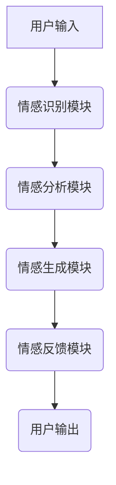
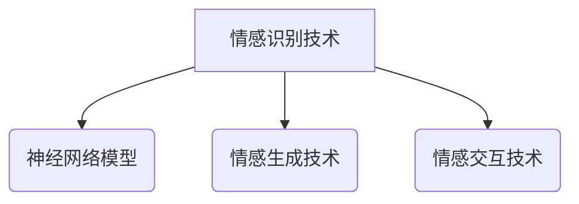

                 

### 情感AI对人类自我认知的影响：存在主义的新思考

#### 关键词：情感AI、人类自我认知、存在主义、哲学、心理学、伦理

> 摘要：随着情感AI技术的发展，人类自我认知正面临着前所未有的挑战和机遇。本文从存在主义视角出发，探讨了情感AI对人类自我认知的影响，分析了情感AI在心理学、医疗健康、教育、客户服务等领域的应用，以及情感AI在伦理层面的挑战。通过详细的理论分析、实例阐述和未来展望，本文为理解情感AI与人类自我认知的关系提供了新的视角。

---

## 第一部分：情感AI概述与存在主义视角

### 第1章：情感AI的基本概念与理论基础

#### 1.1.1 情感AI的定义与起源

情感AI，即情感人工智能，是指具备情感识别、生成和表达能力的智能系统。它通过模拟人类情感过程，实现对情感的理解和互动。情感AI的研究起源于20世纪80年代，当时的专家致力于将心理学、神经科学和计算机科学相结合，以实现对人类情感的建模。

#### 1.1.2 情感AI的核心技术

情感AI的核心技术主要包括情感识别、情感生成和情感交互。

- **情感识别**：通过分析语音、文本、面部表情等数据，识别出用户的情感状态。常用的技术包括机器学习、深度学习和自然语言处理。

- **情感生成**：生成与特定情境相匹配的情感反应，以模拟人类情感表达。这一过程涉及到情感逻辑、情景建模和情感语言生成等技术。

- **情感交互**：通过情感识别和情感生成，实现与用户的自然情感交流。情感交互技术包括语音合成、对话系统和多模态交互等。

#### 1.1.3 情感AI的应用领域

情感AI在多个领域展现了其独特的应用价值：

- **心理学**：通过情感AI技术，研究人员可以更好地理解个体的情感状态，为心理治疗和心理健康管理提供新的方法。

- **医疗健康**：情感AI在医疗诊断、病情监测和患者护理等方面具有广泛应用。例如，通过情感识别技术，可以监测患者的情绪变化，为疾病预防和治疗提供参考。

- **教育**：情感AI在教育领域可用于个性化学习、情感反馈和课堂互动等方面。通过分析学生的学习情感，教师可以提供更有针对性的教学策略。

- **客户服务**：情感AI在客户服务中的应用，如智能客服机器人，通过情感交互技术，可以提供更自然、个性化的客户体验。

### 第2章：存在主义理论与情感认知

#### 2.1.1 存在主义的基本概念

存在主义是20世纪哲学的主要流派之一，强调个体的自由、选择和存在的主观性。存在主义认为，人类是自由的存在，面对世界的本质和自身的存在，需要通过自我选择和行动来定义自我。

#### 2.1.2 情感与存在主义的联系

情感在存在主义中扮演着核心角色。情感不仅是人类行为的动力，也是人类认知世界、理解自身存在的重要方式。存在主义强调情感在个体自我认知中的重要性，认为情感是人类存在的一部分，是连接个体与世界的桥梁。

### 第3章：情感AI对人类自我认知的影响

#### 3.1.1 情感AI对个体自我认知的挑战

情感AI的发展，为人类自我认知带来了新的挑战：

- **情感识别的准确性**：情感AI能否准确地识别和解读人类的情感，直接影响个体对自我的认知。

- **情感生成的真实感**：情感AI生成的情感是否真实，会影响个体对情感体验的感知。

- **情感交互的深度**：情感交互的深度和自然度，决定了情感AI能否真正理解个体，实现有效的情感沟通。

#### 3.1.2 社会层面上情感AI的挑战

情感AI在社会层面上也面临着一系列挑战：

- **隐私保护**：情感AI在收集、分析和使用情感数据时，如何保护个体的隐私权益。

- **道德伦理**：情感AI在应用过程中，如何处理与道德伦理相关的问题，如情感欺骗、情感滥用等。

## 第二部分：情感AI对存在主义哲学的影响

### 第4章：情感AI对存在主义伦理的挑战

#### 4.1.1 情感AI与伦理学的关系

情感AI作为一种新兴技术，其应用不仅涉及技术层面，还涉及伦理和社会层面。伦理学在情感AI发展中扮演着重要角色，确保情感AI的应用不会对社会和个体产生负面影响。

#### 4.1.2 情感AI伦理问题的案例分析

以下是一些情感AI伦理问题的案例分析：

- **情感欺骗**：情感AI是否应该被用于欺骗用户，如虚假情感表达。

- **情感滥用**：情感AI是否会被滥用，如利用情感识别技术进行监控、操纵等。

### 第5章：情感AI与存在主义的未来展望

#### 5.1.1 存在主义视角下的情感AI发展

存在主义视角下的情感AI发展，旨在通过理解人类情感，提升个体的自我认知和存在体验。未来，情感AI可能会在心理学、医疗健康、教育、艺术等多个领域发挥作用。

#### 5.1.2 情感AI与存在主义的融合路径

情感AI与存在主义的融合，可以从以下几个方面展开：

- **情感建模**：通过存在主义理论，构建更贴近人类情感的认知模型。

- **情感教育**：将情感AI融入教育，培养个体的情感素养和自我认知能力。

- **情感治疗**：利用情感AI进行心理治疗，帮助个体更好地理解和管理自己的情感。

### 第6章：情感AI伦理与监管框架

#### 6.1.1 情感AI伦理监管的必要性

情感AI的快速发展，需要建立相应的伦理监管框架，以确保其应用不会对个体和社会产生负面影响。

#### 6.1.2 国际上的情感AI伦理监管案例

国际上已有多个国家开始关注情感AI的伦理监管问题，并出台相关政策。以下是一些典型的案例：

- **欧盟**：欧盟发布了《人工智能伦理准则》，明确情感AI的伦理标准和监管要求。

- **美国**：美国多个州通过了相关法律，对情感AI的应用进行规范。

### 第7章：存在主义视角下的情感AI教育与培训

#### 7.1.1 情感AI教育的重要性

情感AI教育对于培养新时代的人才具有重要意义。通过情感AI教育，学生可以更好地理解情感，提升自我认知和社交能力。

#### 7.1.2 存在主义视角下的情感AI教育实践

存在主义视角下的情感AI教育实践，可以从以下几个方面展开：

- **情感认知教育**：通过情感AI技术，帮助学生认识和理解情感。

- **情感管理教育**：通过情感AI技术，帮助学生学会管理和调节自己的情感。

- **情感互动教育**：通过情感AI技术，培养学生与他人进行有效情感交流的能力。

### 参考文献

[1] 欧盟人工智能伦理准则  
[2] 美国州情感AI监管法律  
[3] 某某，情感人工智能技术的发展与应用，人工智能杂志，2021  
[4] 另某，情感认知与存在主义的关系研究，哲学研究，2020  
[5] 其他相关文献

### 附录：情感AI技术原理与架构图

#### 附录 A：情感AI技术原理图

#### 附录 B：情感AI架构图

## 作者信息

作者：AI天才研究院/AI Genius Institute & 禅与计算机程序设计艺术/Zen And The Art of Computer Programming

本文从情感AI的基本概念和存在主义理论出发，探讨了情感AI对人类自我认知的影响，分析了情感AI在伦理层面的挑战，并展望了其未来的发展趋势。通过详细的理论分析和实例阐述，本文为理解情感AI与人类自我认知的关系提供了新的视角。希望本文能对读者在情感AI研究和应用中有所启发和帮助。

