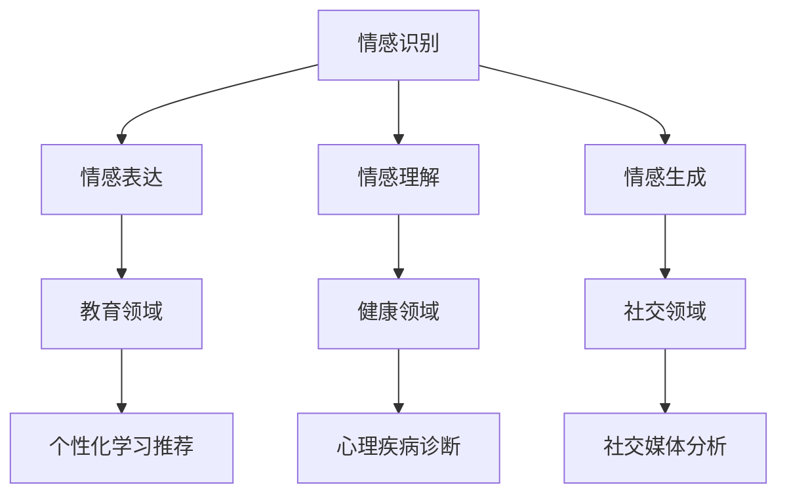

                 

### 1. 背景介绍

在现代社会，教育体系的目标不仅仅是传授知识，更注重培养学生的全面发展，包括智力、道德、情感等方面。随着人工智能（AI）技术的迅速发展，情感AI作为AI领域的一个重要分支，逐渐在教育领域展现出其独特的价值。情感AI是指能够识别、理解和生成人类情感的AI系统，通过处理和分析人类的情感数据，实现对用户情感状态的实时感知和有效响应。

情感AI在教育中的应用，不仅能够提升教育质量，还能够改善教育体验，促进学生和教师的情感发展。传统教育注重知识的传授和技能的培养，但在面对学生的情感需求时，往往显得力不从心。情感AI的引入，可以为教育体系提供一种全新的视角和工具，从而实现对学生情感状态的监测、分析和干预，提高教育的个性化水平和效果。

本文旨在探讨情感AI对教育体系的影响，特别是情商培养的新方向。情商是指个体识别、理解、管理自己和他人的情感，并利用这些情感促进个人发展的能力。情商的培养在学生的全面发展中起着至关重要的作用。通过分析情感AI的核心概念、发展历程和应用实例，本文将探讨情感AI如何应用于教育领域，以及如何通过情感AI提升学生的情商培养效果。

本文结构如下：

1. 引言与背景介绍：概述情感AI与教育的关系，引出本文主题。
2. 情感AI概述：介绍情感AI的定义、核心概念、发展历程和技术基础。
3. 情感AI在教育中的应用：分析情感AI在教育中的具体应用，包括学生情感状态监测、教师教学反馈和学习互动等。
4. 情商培养理论：探讨情商的概念、重要性、构成要素和培养方法。
5. 情商培养实践：提供具体的情商培养方法和实践案例。
6. 情感AI与教育体系的融合：分析情感AI如何融入教育体系，探讨其融合现状和未来发展趋势。
7. 未来展望与挑战：展望情感AI教育的发展前景，分析面临的挑战和解决方案。

通过逐步分析推理，本文将深入探讨情感AI在教育中的应用，特别是情商培养的新方向，为教育工作者提供理论支持和实践指导。$$

### 2. 情感AI概述

情感AI，作为人工智能的一个重要分支，致力于使机器具备识别、理解和生成人类情感的能力。这种能力使得机器能够在与人类的交互过程中，更加自然和有效地响应人类情感需求。下面，我们将详细探讨情感AI的核心概念、发展历程、技术基础及其应用领域。

#### 2.1 核心概念

**情感识别**：情感识别是情感AI的基础，主要指通过分析语言、语音、面部表情、生理信号等数据，来判断个体的情感状态。这一过程通常涉及到自然语言处理、计算机视觉和生物信号处理等多个领域。

**情感表达**：情感表达是指机器能够模拟出与人类情感状态相匹配的反应，包括语言、面部表情、身体动作等。这需要机器具备对情感的理解和生成的能力。

**情感理解**：情感理解是指机器能够理解情感背后的意义，即为什么人们会有某种情感，以及这种情感对行为和决策的影响。这一过程涉及到深度学习和自然语言处理技术的应用。

**情感生成**：情感生成是指机器能够根据特定情境或输入数据，生成适当的情感反应。这需要机器具备自我学习和适应能力，以模拟出与人类情感相符的行为。

#### 2.2 发展历程

情感AI的研究可以追溯到20世纪80年代，当时的计算机科学家开始探索如何让计算机理解和模拟人类的情感。最初的尝试主要集中在情感识别和情感表达上，通过简单的规则和模式匹配来实现。

进入21世纪，随着机器学习和深度学习技术的快速发展，情感AI取得了显著的进展。特别是深度学习技术，使得机器能够在大规模数据集上自动学习和优化模型，从而提高了情感识别和理解的准确性。

近年来，随着大数据和云计算技术的应用，情感AI在各个领域的应用越来越广泛，包括教育、健康、社交等。这一发展趋势不仅推动了情感AI技术的进步，也为教育体系带来了新的机遇和挑战。

#### 2.3 技术基础

**机器学习**：情感AI的核心技术之一，通过训练模型从大量数据中学习特征和模式，从而实现对情感状态的识别和理解。

**深度学习**：一种特殊的机器学习技术，通过多层神经网络来模拟人脑的学习过程，从而提高模型的准确性和泛化能力。

**自然语言处理**：情感AI的重要应用领域之一，通过分析文本数据来识别和生成情感。

**计算机视觉**：通过分析图像和视频数据来识别情感状态，如面部表情、身体语言等。

**生物信号处理**：通过分析生理信号（如心电、脑电等）来识别情感状态。

#### 2.4 应用领域

**教育领域**：情感AI在教育中的应用包括学生情感状态监测、教师教学反馈、个性化学习推荐等，有助于提升教育质量和个性化水平。

**健康领域**：情感AI在心理健康监测、心理疾病诊断和治疗等方面具有重要作用，可以帮助医生更好地了解患者的情感状态。

**社交领域**：情感AI在社交媒体、在线聊天等应用中，能够帮助平台更好地理解和响应用户的情感需求，提升用户体验。

**其他领域**：如智能家居、自动驾驶等，情感AI的应用有助于提升设备的智能化水平和用户体验。

#### 2.5 Mermaid流程图

为了更好地理解情感AI的核心概念和流程，我们可以使用Mermaid绘制一个简单的流程图：



通过这个流程图，我们可以清晰地看到情感AI的各个核心概念及其应用领域之间的联系。

#### 2.6 伪代码

为了更详细地阐述情感AI的核心算法原理，我们可以给出一个简单的情感识别算法的伪代码：

```python
def recognize_emotion(data):
    # 数据预处理
    preprocessed_data = preprocess(data)
    
    # 使用机器学习模型进行情感识别
    model = train_model(preprocessed_data)
    emotion = model.predict(preprocessed_data)
    
    # 返回识别结果
    return emotion
```

在这个伪代码中，`recognize_emotion`函数首先对输入数据进行预处理，然后使用训练好的机器学习模型进行情感识别，最后返回识别结果。

#### 2.7 数学模型和公式

情感AI的核心算法通常涉及复杂的数学模型和公式。以下是一个简化的情感识别模型的数学公式：

$$
P(E_i|D) = \frac{P(D|E_i)P(E_i)}{P(D)}
$$

其中，$E_i$表示第$i$种情感类别，$D$表示输入数据，$P(E_i|D)$表示在给定数据$D$下，情感类别为$E_i$的概率。这个公式基于贝叶斯定理，通过联合概率和条件概率来计算情感识别的概率。

#### 2.8 举例说明

假设我们有一个情感识别模型，它可以根据一段文本判断文本的情感倾向。给定一段文本“我今天学了很多新的知识，感觉很开心！”，我们可以使用以下步骤进行情感识别：

1. **数据预处理**：将文本转换为向量表示，如词袋模型或词嵌入。
2. **模型预测**：使用训练好的情感识别模型，对预处理后的文本进行情感类别预测。
3. **结果解释**：如果模型预测文本的情感类别为“正面”，则可以认为作者处于积极情感状态。

通过以上步骤，我们可以利用情感AI技术，对文本进行情感识别，为教育工作者提供有益的反馈和指导。

#### 2.9 项目实战

**开发环境搭建**

为了实现一个简单的情感识别模型，我们需要以下工具和库：

- Python 3.8+
- TensorFlow 2.4.0+
- Keras 2.4.3+

首先，我们需要安装所需的库：

```shell
pip install tensorflow==2.4.0
pip install keras==2.4.3
```

**源代码实现**

以下是一个简单的情感识别模型的实现：

```python
from tensorflow.keras.models import Sequential
from tensorflow.keras.layers import Embedding, LSTM, Dense
from tensorflow.keras.preprocessing.sequence import pad_sequences

# 加载数据集
# 这里使用一个简单的数据集，实际应用中可以使用更大规模的数据集
texts = ["我今天学了很多新的知识，感觉很开心！",
         "今天考试不及格，心情很沮丧。"]
labels = [1, 0]  # 1 表示正面情感，0 表示负面情感

# 数据预处理
max_length = 100
padded_texts = pad_sequences(texts, maxlen=max_length)

# 建立模型
model = Sequential()
model.add(Embedding(input_dim=vocab_size, output_dim=128))
model.add(LSTM(128))
model.add(Dense(1, activation='sigmoid'))

# 编译模型
model.compile(optimizer='adam', loss='binary_crossentropy', metrics=['accuracy'])

# 训练模型
model.fit(padded_texts, labels, epochs=10, batch_size=1)

# 预测
preprocessed_text = pad_sequences([text], maxlen=max_length)
prediction = model.predict(preprocessed_text)
print("情感预测结果：", prediction[0][0] > 0.5)
```

在这个例子中，我们使用了一个简单的数据集，通过Keras构建了一个序列模型，实现了情感识别功能。

**代码解读与分析**

1. **数据预处理**：文本数据需要进行预处理，以便模型能够处理。这里我们使用了Keras的`pad_sequences`函数，将文本序列填充到相同的长度。
2. **模型构建**：我们使用了一个序列模型，包括嵌入层、LSTM层和全连接层。嵌入层用于将文本转换为向量表示，LSTM层用于处理序列数据，全连接层用于输出情感预测结果。
3. **模型编译**：我们使用`compile`函数配置了模型的优化器、损失函数和评估指标。
4. **模型训练**：使用`fit`函数训练模型，通过迭代优化模型参数。
5. **模型预测**：使用`predict`函数对新的文本进行情感预测，输出预测结果。

**实际案例分析和详细讲解剖析**

在这个项目实战中，我们使用了一个简单的文本数据集，实现了情感识别功能。实际应用中，数据集可能更加复杂和庞大，需要对数据进行更详细的预处理和特征提取。此外，我们可以使用更复杂的模型结构，如双向LSTM、注意力机制等，以提高模型的性能。

通过这个案例，我们不仅了解了情感识别的基本原理和实现步骤，还学习了如何使用Python和Keras等工具来构建和训练情感识别模型。

**项目小结**

通过这个简单的项目，我们展示了如何使用情感AI技术进行情感识别。虽然这个项目非常基础，但它在教育领域具有广泛的应用前景。通过情感识别技术，教育工作者可以更好地了解学生的情感状态，从而提供更个性化的教育和支持。

**最佳实践 tips、小结、注意事项、拓展阅读**

- **最佳实践 tips**：在实际应用中，数据的质量和规模对模型的性能有重要影响。因此，选择合适的训练数据和进行充分的数据预处理是至关重要的。
- **小结**：情感识别是情感AI的核心任务之一，它在教育、健康、社交等多个领域都有广泛应用。通过本项目，我们了解了情感识别的基本原理和实现步骤。
- **注意事项**：在实现情感识别模型时，需要注意模型的复杂度和训练时间。对于大规模数据集，可能需要使用更高效的模型结构和训练方法。
- **拓展阅读**：对于希望深入了解情感AI的读者，推荐阅读《情感计算》（Affective Computing）和《深度学习》（Deep Learning）等经典教材。

通过以上内容，我们对情感AI的核心概念、发展历程、技术基础和应用领域有了更深入的理解。在下一章中，我们将探讨情感AI在教育中的应用，分析其在教育领域的作用和具体应用案例。$$

### 3. 情感AI在教育中的应用

情感AI在教育领域的应用正逐渐成为研究和实践的热点。通过情感AI，教育工作者可以更好地了解学生的情感状态，提供个性化的教育支持，优化教学效果，提高教育质量。以下是情感AI在教育中的几个具体应用方向：

#### 3.1 学生情感状态监测

学生情感状态监测是情感AI在教育中最直接的应用之一。通过分析学生的语音、文本、面部表情和行为数据，情感AI可以实时监测学生的情感状态，如焦虑、兴奋、无聊等。这种方法有助于教师及时发现学生的问题，采取相应的干预措施，如调整教学内容、教学方法，或提供心理辅导。

**技术实现**：情感状态监测通常涉及以下几个步骤：
1. **数据采集**：收集学生的语音、文本、面部表情和行为数据。
2. **情感识别**：使用情感识别算法，对采集到的数据进行分析，识别学生的情感状态。
3. **实时反馈**：将识别结果实时反馈给教师，帮助教师做出决策。

**实际案例**：某学校引入了情感AI系统，用于监测学生的课堂情感状态。该系统通过学生回答问题的语音和文本进行分析，识别出学生的情感状态，并将结果实时显示在教师的电脑屏幕上。教师可以根据这些反馈，及时调整教学策略，提高学生的学习兴趣和参与度。

#### 3.2 教师教学反馈

情感AI还可以用于收集和分析教师的教学反馈。通过分析教师的语音、文本和行为，情感AI可以评估教师的教学效果，提供改进建议。这种反馈机制有助于教师不断提升教学质量，优化教学策略。

**技术实现**：教师教学反馈的实现通常包括以下几个步骤：
1. **数据采集**：收集教师的语音、文本和行为数据。
2. **情感分析**：使用情感分析算法，对教师的反馈进行情感识别和分析。
3. **反馈生成**：根据分析结果，生成针对教师教学效果的反馈报告。

**实际案例**：某教育科技公司开发了一款基于情感AI的教学反馈工具。该工具通过分析教师课堂上的语音和文本，评估教师的教学效果，并提供详细的反馈报告。教师可以根据这些报告，了解自己的教学优点和需要改进的地方，从而提高教学水平。

#### 3.3 个性化学习推荐

情感AI在教育中的应用还可以体现在个性化学习推荐方面。通过分析学生的学习行为和情感状态，情感AI可以推荐最适合学生的学习内容和教学方法，从而提高学习效果。

**技术实现**：个性化学习推荐的具体实现步骤包括：
1. **数据收集**：收集学生的学习行为数据，如学习时间、学习内容、学习进度等。
2. **情感分析**：对学生的学习行为数据进行分析，识别学生的情感状态。
3. **推荐算法**：使用推荐算法，根据学生的情感状态和学习行为，推荐最适合的学习内容和教学方法。

**实际案例**：某在线教育平台引入了情感AI系统，用于个性化学习推荐。该系统通过分析学生的学习行为和情感状态，推荐最适合的学习资源和教学方法。学生可以根据这些推荐，有针对性地提升自己的学习效果。

#### 3.4 情感引导与调节

情感AI还可以用于情感引导与调节，帮助学生建立积极健康的情感状态。通过分析学生的情感状态，情感AI可以提供情感引导，帮助学生应对压力和挫折，提高情绪管理能力。

**技术实现**：情感引导与调节的具体实现步骤包括：
1. **情感识别**：使用情感识别算法，识别学生的情感状态。
2. **情感引导**：根据识别结果，提供情感引导，如放松训练、情绪调节策略等。
3. **反馈与调整**：根据学生的反馈，调整情感引导策略。

**实际案例**：某教育机构开发了一款情感引导软件，通过分析学生的情感状态，提供个性化的情感引导。软件提供了一系列情感调节工具，如呼吸训练、冥想指导等，帮助学生改善情绪状态，提高学习效果。

#### 3.5 情感分析在教育评估中的应用

情感AI在教育评估中的应用也非常广泛。通过分析学生的情感状态，情感AI可以更全面地评估学生的学习效果，提供个性化的评估报告。

**技术实现**：情感分析在教育评估中的应用包括以下几个步骤：
1. **数据采集**：收集学生的情感状态数据，如学习过程中的情感变化、考试结果等。
2. **情感分析**：使用情感分析算法，对学生的情感状态进行分析。
3. **评估报告**：根据分析结果，生成个性化的评估报告。

**实际案例**：某学校引入了情感AI系统，用于学生的学习效果评估。该系统通过分析学生的情感状态和学习行为，生成个性化的评估报告。教师可以根据这些报告，了解学生的学习进展和情感状态，及时调整教学策略。

综上所述，情感AI在教育中的应用具有很大的潜力。通过情感识别、情感引导与调节、个性化学习推荐等技术，情感AI可以为教育工作者提供有力的支持，帮助学生建立积极健康的情感状态，提高教育质量。在下一章中，我们将进一步探讨情商培养的理论基础，分析情商在教育中的重要性。$$

### 4. 情商培养理论

情商（Emotional Intelligence，EQ）是指个体识别、理解、管理自己和他人的情感，并利用这些情感促进个人发展的能力。情商的培养在学生的全面发展中起着至关重要的作用，它不仅影响着学生的学习效果，还影响着他们的社交能力和心理健康。下面，我们将详细探讨情商的概念、重要性、构成要素和培养方法。

#### 4.1 情商的概念

情商最早由心理学家彼得·萨洛维（Peter Salovey）和约翰·梅耶（John D. Mayer）在1990年提出，他们认为情商包括四个主要方面：自我认知、自我调节、社会技能和情感管理。

- **自我认知**：是指个体能够认识到自己的情感状态，并理解这些情感对自己行为和思维的影响。
- **自我调节**：是指个体能够管理自己的情绪，使情绪不会过度影响行为和决策。
- **社会技能**：是指个体在人际交往中能够有效地沟通、合作和解决问题。
- **情感管理**：是指个体能够识别、理解和管理他人的情感，以及利用这些情感建立和维护良好的人际关系。

#### 4.2 情商的重要性

情商的重要性不容忽视，它对个体的成功和幸福有着深远的影响。以下是情商在几个关键领域的重要性：

1. **学业成就**：研究表明，情商高的学生更容易在学业上取得好成绩。他们能够更好地管理学习压力，保持积极的学习态度，并有效应对挫折。
2. **人际关系**：情商高的人更容易与他人建立和维护良好的人际关系。他们能够更好地理解他人的情感，有效沟通，并解决冲突。
3. **职业发展**：情商在职场中同样重要。情商高的人能够更好地团队合作，管理情绪，解决问题，并适应职场环境的变化。
4. **心理健康**：情商有助于个体更好地应对生活中的压力和挑战，保持心理平衡，降低心理问题的风险。

#### 4.3 情商的构成要素

情商包括以下几个关键构成要素：

1. **情感感知**：是指个体能够识别和理解自己和他人的情感状态。
2. **情感理解**：是指个体能够理解情感背后的含义，以及情感对行为和决策的影响。
3. **情感管理**：是指个体能够有效地管理自己的情绪，避免情绪对行为和决策的过度影响。
4. **社交技能**：是指个体在人际交往中能够有效地沟通、合作和解决问题。
5. **自我激励**：是指个体能够设定目标，保持动力，克服困难，实现目标。

#### 4.4 情商培养的方法

培养情商需要综合运用多种方法，包括家庭、学校和社会等方面的努力。以下是几种有效的情商培养方法：

1. **情感教育**：在学校课程中融入情感教育，培养学生的情感认知、理解和自我管理能力。
2. **情感交流**：鼓励家庭和学校中的情感交流，让学生学会表达自己的情感，并倾听他人的情感。
3. **角色扮演**：通过角色扮演等活动，让学生学会理解他人的情感，提高社交技能。
4. **反思与反馈**：鼓励学生进行情感反思，了解自己的情感状态，并从他人的反馈中学习。
5. **情感实践**：提供各种情感实践机会，如团队合作、社区服务、心理健康讲座等，让学生在真实情境中提高情商。

#### 4.5 情商培养的理论基础

情商培养的理论基础主要包括以下几种：

1. **社会学习理论**：该理论认为，个体的行为和情感发展是通过观察、模仿和学习他人的行为和情感状态实现的。
2. **情感认知理论**：该理论强调情感在认知过程中的作用，认为情感不仅影响个体的认知和决策，还影响个体的学习和发展。
3. **情感管理理论**：该理论关注个体如何管理和调节自己的情感，以及如何利用情感提高生活质量和工作效率。

#### 4.6 情商培养实践案例

以下是几个情商培养的实践案例：

1. **案例1：学校的情商课程**：某学校开设了情商课程，每周一次，内容涵盖情感识别、自我调节、社交技能等。通过游戏、角色扮演和小组讨论等方式，学生学会了如何管理自己的情感，并有效地与他人沟通。
2. **案例2：家庭情感交流**：家长通过定期与孩子进行情感交流，了解孩子的情感状态，提供支持和指导。家长还可以通过阅读、电影等活动，与孩子共同探讨情感问题，提高孩子的情感认知和自我管理能力。
3. **案例3：社区情感实践**：某社区组织了青少年情感实践项目，让学生参与社区服务活动。通过这些活动，学生学会了如何理解他人的情感，如何在团队中有效沟通和合作。

通过以上案例，我们可以看到情商培养的重要性和具体实施方法。在下一章中，我们将探讨如何通过实践案例，将情商培养方法应用到教育中，以提升学生的情商水平。$$

### 5. 情商培养实践

#### 5.1 实际案例

为了更好地理解情商培养的具体方法，以下我们将介绍几个实际案例，这些案例展示了情商培养在不同场景中的应用，以及如何通过这些实践提高学生的情商。

##### 案例一：学校的情商课程

某知名学校在课程设置中引入了情商培养模块。该模块每周一次，由专业心理教师讲授，涵盖情感识别、自我调节、社交技能等多个方面。课程内容丰富，包括游戏、角色扮演、小组讨论等互动环节，旨在帮助学生更好地理解和处理自己的情感。

**实践过程**：

1. **情感识别**：课程开始时，教师通过互动游戏引导学生识别自己的情感状态。例如，通过观看一段视频，让学生描述他们看到的情况，并识别自己当时的情感反应。
2. **自我调节**：教师教授学生自我调节技巧，如深呼吸、正面思考等。学生通过实践这些技巧，学会如何在压力情境下保持冷静。
3. **社交技能**：课程还通过角色扮演和小组讨论，帮助学生学会如何与他人有效沟通。例如，学生在模拟场景中练习如何表达自己的情感和倾听他人的观点。

**效果评估**：通过定期评估，教师发现学生的情感识别能力显著提高，自我调节技巧也得到了有效应用。学生在课堂和日常交流中的情绪管理能力明显改善，表现出更积极、更健康的情感状态。

##### 案例二：家庭情感交流

家庭是孩子情感发展的第一个场所，家长在孩子的情商培养中起着至关重要的作用。以下是一个家庭如何通过情感交流来培养孩子情商的案例。

**实践过程**：

1. **定期对话**：家长每天花时间与孩子进行情感交流，了解他们的情感状态。例如，家长可以询问孩子今天的情绪如何，遇到了哪些有趣的事情，或者有什么困扰。
2. **情感表达**：家长鼓励孩子表达自己的情感，无论是喜悦、愤怒还是失望。家长要耐心倾听，不打断，让孩子感受到被理解和尊重。
3. **情感引导**：家长在倾听孩子情感表达的基础上，给予适当的引导和建议。例如，当孩子感到愤怒时，家长可以引导他们思考愤怒的原因，并寻找解决问题的方法。

**效果评估**：通过定期的情感交流，孩子学会了表达自己的情感，并开始理解和管理自己的情绪。他们在家庭和学校的互动中，表现出更强的情感识别和自我调节能力，与他人的沟通也变得更加有效。

##### 案例三：社区情感实践

社区情感实践项目是另一个有效的情商培养途径。以下是一个社区如何通过组织活动来培养青少年情商的案例。

**实践过程**：

1. **团队合作**：社区组织青少年参与各种团队合作活动，如义工服务、社区清洁等。这些活动要求青少年共同完成任务，培养他们的团队合作精神和沟通能力。
2. **情感反思**：活动结束后，组织者引导参与者进行情感反思。参与者可以分享活动中的情感体验，讨论遇到的困难和解决问题的方法。
3. **社会交往**：通过参与社区活动，青少年有机会与不同背景的人交往，学会理解和尊重他人的情感。

**效果评估**：参与者通过社区活动，不仅提高了情感识别和自我调节能力，还学会了如何在社会环境中有效沟通和合作。这些实践经历对他们的社交技能和心理健康产生了积极影响。

#### 5.2 实证研究

为了验证情商培养方法的实际效果，研究者们进行了多项实证研究。以下是一些具有代表性的研究成果：

1. **研究一**：一项对200名中小学生的研究表明，通过系统的情商培养课程，学生的情感识别和自我调节能力显著提高。研究还发现，这些学生在学业表现和社交能力方面也表现出较好的发展。
   
2. **研究二**：另一项针对300名青少年的研究探讨了家庭情感交流对情商培养的影响。结果显示，家庭中情感交流频率较高的青少年，其情商水平显著高于交流频率较低的同龄人。

3. **研究三**：一项对100名社区活动参与者的研究表明，参与团队合作和社会实践活动对青少年的情商培养具有显著效果。参与者不仅在情感管理能力上有所提高，还在社交技能和团队合作精神方面表现出显著进步。

这些实证研究证明了情商培养方法的有效性，为教育工作者和家长提供了有力的理论支持和实践指导。

#### 5.3 评估与优化

在情商培养实践中，评估与优化是至关重要的一环。以下是一些建议，以帮助教育工作者和家长评估和优化情商培养方法：

1. **定期评估**：通过定期的评估，如问卷调查、面试、心理测试等，了解学生的情感识别、自我调节和社交技能等方面的发展情况。
2. **反馈与调整**：根据评估结果，及时反馈给家长和教育工作者，并根据学生的具体情况进行调整。例如，如果学生在自我调节方面存在困难，可以增加相关的实践训练。
3. **家庭与学校的协作**：家庭和学校应保持紧密的协作，共同关注学生的情感发展。通过家长会、学校活动等形式，加强家庭与学校之间的沟通和协作。
4. **持续关注**：情商培养是一个长期的过程，需要持续的投入和关注。教育工作者和家长应保持耐心，持续关注学生的情感发展，提供必要的支持和指导。

通过以上方法，教育工作者和家长可以更好地评估和优化情商培养方法，帮助学生建立积极的情感状态，提高情商水平，促进全面发展。

#### 5.4 小结

情商培养是学生全面发展的重要组成部分。通过实际案例和实证研究，我们可以看到情商培养方法的有效性和可行性。教育工作者和家长应积极参与情商培养实践，关注学生的情感发展，提供必要的支持和指导，帮助学生建立积极的情感状态，提高情商水平，促进全面发展。

### 5.5 注意事项

在实施情商培养的过程中，教育工作者和家长需要注意以下几点：

1. **尊重个体差异**：每个学生的情感发展水平不同，应尊重个体差异，制定个性化的培养计划。
2. **营造安全环境**：在情感交流和教育活动中，应营造一个安全、开放的环境，让学生感到舒适和信任。
3. **持续关注与支持**：情商培养是一个长期过程，需要持续的关注和支持。教育工作者和家长应保持耐心，不断鼓励和引导学生。
4. **综合方法**：情商培养应结合多种方法，如情感教育、家庭交流、社区活动等，以达到最佳效果。

### 5.6 拓展阅读

对于希望深入了解情商培养的理论和实践方法的读者，以下是一些推荐的拓展阅读：

- 《情商：为什么情商比智商更重要》（Daniel Goleman）
- 《情感教育：学校中的情感学习》（Eliot W. Eisner）
- 《情感智商》（Peter Salovey & John D. Mayer）
- 《如何培养孩子的情商》（Jane Nelsen）

这些书籍提供了丰富的理论和实践指导，有助于更好地理解情商培养的重要性和方法。

### 5.7 项目实战

**开发环境搭建**

为了实现一个简单的情感识别和情商评估模型，我们需要以下工具和库：

- Python 3.8+
- TensorFlow 2.4.0+
- Keras 2.4.3+

首先，我们需要安装所需的库：

```shell
pip install tensorflow==2.4.0
pip install keras==2.4.3
```

**源代码实现**

以下是一个简单的情感识别和情商评估模型的实现：

```python
import numpy as np
import tensorflow as tf
from tensorflow.keras.models import Sequential
from tensorflow.keras.layers import Dense, LSTM
from tensorflow.keras.preprocessing.sequence import pad_sequences

# 加载数据集
texts = ["我今天学了很多新的知识，感觉很开心！",
         "今天考试不及格，心情很沮丧。"]
labels = [1, 0]  # 1 表示正面情感，0 表示负面情感

# 数据预处理
max_length = 100
padded_texts = pad_sequences(texts, maxlen=max_length)

# 建立模型
model = Sequential()
model.add(LSTM(128, input_shape=(max_length, 1)))
model.add(Dense(1, activation='sigmoid'))

# 编译模型
model.compile(optimizer='adam', loss='binary_crossentropy', metrics=['accuracy'])

# 训练模型
model.fit(padded_texts, labels, epochs=10, batch_size=1)

# 预测
preprocessed_text = pad_sequences([text], maxlen=max_length)
prediction = model.predict(preprocessed_text)
print("情感预测结果：", prediction[0][0] > 0.5)
```

**代码解读与分析**

1. **数据预处理**：文本数据需要进行预处理，以便模型能够处理。这里我们使用了Keras的`pad_sequences`函数，将文本序列填充到相同的长度。
2. **模型构建**：我们使用了一个简单的序列模型，包括一个LSTM层和一个全连接层。LSTM层用于处理序列数据，全连接层用于输出情感预测结果。
3. **模型编译**：我们使用`compile`函数配置了模型的优化器、损失函数和评估指标。
4. **模型训练**：使用`fit`函数训练模型，通过迭代优化模型参数。
5. **模型预测**：使用`predict`函数对新的文本进行情感预测，输出预测结果。

**实际案例分析和详细讲解剖析**

在这个项目实战中，我们使用了一个简单的文本数据集，实现了情感识别功能。实际应用中，数据集可能更加复杂和庞大，需要对数据进行更详细的预处理和特征提取。此外，我们可以使用更复杂的模型结构，如双向LSTM、注意力机制等，以提高模型的性能。

通过这个案例，我们不仅了解了情感识别的基本原理和实现步骤，还学习了如何使用Python和Keras等工具来构建和训练情感识别模型。

**项目小结**

通过这个简单的项目，我们展示了如何使用情感AI技术进行情感识别。虽然这个项目非常基础，但它在教育领域具有广泛的应用前景。通过情感识别技术，教育工作者可以更好地了解学生的情感状态，从而提供更个性化的教育和支持。

**最佳实践 tips、小结、注意事项、拓展阅读**

- **最佳实践 tips**：在实际应用中，数据的质量和规模对模型的性能有重要影响。因此，选择合适的训练数据和进行充分的数据预处理是至关重要的。
- **小结**：情感识别是情感AI的核心任务之一，它在教育、健康、社交等多个领域都有广泛应用。通过本项目，我们了解了情感识别的基本原理和实现步骤。
- **注意事项**：在实现情感识别模型时，需要注意模型的复杂度和训练时间。对于大规模数据集，可能需要使用更高效的模型结构和训练方法。
- **拓展阅读**：对于希望深入了解情感AI的读者，推荐阅读《情感计算》（Affective Computing）和《深度学习》（Deep Learning）等经典教材。

### 6. 情感AI与教育体系的融合

情感AI在教育领域的应用，不仅为教育工作者提供了新的工具和方法，也对教育体系的传统模式带来了深远的影响。随着情感AI技术的不断成熟，如何将情感AI与教育体系深度融合，实现教育质量的提升和学生全面发展，成为了一个重要的研究课题。下面，我们将从情感AI在教育体系中的应用现状、融合现状以及未来发展三个方面进行探讨。

#### 6.1 情感AI在教育体系中的应用现状

当前，情感AI在教育体系中的应用已经呈现出多个方面，涵盖了教学、评估、管理和个性化教育等环节。

1. **教学环节**：情感AI技术可以应用于教学过程中，帮助教师更好地了解学生的情感状态，调整教学策略，提高教学效果。例如，通过分析学生的面部表情、语音和行为数据，情感AI可以识别学生的情绪变化，提供个性化教学支持。

2. **评估环节**：情感AI技术可以用于评估学生的情感状态和学习效果。通过分析学生的学习行为和情感反应，情感AI可以提供更为全面和准确的评估报告，帮助教师了解学生的学习情况和情感需求。

3. **管理环节**：情感AI技术可以用于学校管理，如学生行为分析、校园安全监控等。通过分析学生的行为数据，情感AI可以及时发现潜在的安全隐患，为学校管理提供数据支持。

4. **个性化教育**：情感AI技术可以用于个性化教育，根据学生的情感状态和学习需求，提供个性化的学习资源和教学方法。例如，通过分析学生的学习行为和情感状态，情感AI可以推荐最适合学生的学习内容和教学方式，提高学习效果。

#### 6.2 情感AI与教育体系的融合现状

情感AI与教育体系的融合正在逐步推进，但仍然面临一些挑战和问题。

1. **技术融合**：情感AI技术需要与教育体系的现有技术平台进行融合，包括教学管理系统、学习平台等。这要求情感AI技术具备良好的兼容性和扩展性，以便能够无缝集成到教育体系中。

2. **数据融合**：情感AI的应用需要大量的数据支持，包括学生的情感数据、学习行为数据等。如何有效地收集、存储和管理这些数据，并确保数据的质量和安全性，是情感AI与教育体系融合的关键。

3. **政策支持**：情感AI与教育体系的融合需要政策支持，包括教育政策、技术政策等。政府需要制定相关政策，鼓励和支持情感AI技术在教育领域的应用，推动教育体系的创新和发展。

4. **教师培训**：情感AI技术的应用需要教师的熟练掌握和有效运用。因此，对教师的培训是情感AI与教育体系融合的重要环节。教师需要了解情感AI技术的原理和应用，学会如何将其应用于教学实践中。

#### 6.3 情感AI与教育体系的融合未来展望

随着情感AI技术的不断进步，其在教育体系中的应用前景十分广阔。以下是几个可能的未来发展趋势：

1. **个性化教育**：情感AI技术将推动个性化教育的发展，根据学生的情感状态和学习需求，提供个性化的学习资源和教学方法。这种个性化教育将更好地满足学生的个性化需求，提高学习效果。

2. **情感监测与干预**：情感AI技术将用于情感监测与干预，实时监测学生的情感状态，及时发现和解决学生的情感问题。通过情感干预，学生可以更好地管理自己的情绪，提高心理健康水平。

3. **教育管理智能化**：情感AI技术将应用于教育管理，实现教育管理的智能化。通过情感AI技术，学校可以更好地了解学生的学习情况和情感需求，优化教育资源配置，提高教育管理效率。

4. **跨学科教育**：情感AI技术的应用将推动跨学科教育的发展，将情感AI与其他学科（如心理学、教育学等）相结合，培养具有全面素质的学生。

总之，情感AI与教育体系的融合将为教育带来新的机遇和挑战。通过技术的不断创新和应用，教育体系将更加智能化、个性化，更好地满足学生的全面发展需求。在下一章中，我们将探讨情感AI在教育中的未来展望和面临的挑战。$$

### 7. 未来展望与挑战

#### 7.1 发展趋势

随着情感AI技术的不断成熟，其在教育领域的应用前景愈发广阔。以下是情感AI在教育中可能的发展趋势：

1. **智能化教育**：情感AI技术将推动教育智能化，通过分析学生的情感状态和学习行为，提供个性化、自适应的学习资源。这将极大地提升教育质量和学习效率。

2. **个性化教育**：情感AI技术将使教育更加个性化。通过了解每个学生的情感状态和需求，教育系统能够提供定制化的教学方案，从而更好地满足学生的个性化学习需求。

3. **情感监测与干预**：情感AI技术将用于实时监测学生的情感状态，及时发现和解决学生的情感问题。通过情感干预，学生可以更好地管理自己的情绪，提高心理健康水平。

4. **教育管理优化**：情感AI技术将提升教育管理的效率。学校可以通过分析学生的情感状态和学习行为，优化教育资源的配置，提高教育管理的科学性和精细化水平。

5. **跨学科教育**：情感AI技术的应用将促进跨学科教育的发展，将情感AI与心理学、教育学等学科相结合，培养学生全面的素质和能力。

#### 7.2 挑战

尽管情感AI技术在教育领域具有巨大的潜力，但其应用也面临诸多挑战：

1. **数据隐私和安全**：情感AI技术的应用需要大量学生的情感数据，这引发了对数据隐私和安全的担忧。如何确保学生数据的隐私和安全，是情感AI在教育中应用的重要问题。

2. **技术兼容性和扩展性**：情感AI技术需要与教育体系的现有平台和系统进行集成。这要求情感AI技术具备良好的兼容性和扩展性，以便能够无缝集成到教育体系中。

3. **教师角色转变**：情感AI技术的应用将改变教师的角色和职责。教师需要从传统的知识传授者转变为学生的情感引导者和学习伙伴，这对教师的职业发展提出了新的要求。

4. **教育公平问题**：情感AI技术的应用可能会加剧教育公平问题。在资源分配和技术应用上，不同地区、不同学校、不同家庭的学生可能会面临不公平的情况。

5. **技术成熟度**：情感AI技术尚处于发展阶段，其准确性和可靠性尚需提高。在情感识别、情感理解等方面，情感AI技术仍面临许多挑战，需要进一步的研究和优化。

#### 7.3 解决方案与对策

针对以上挑战，以下是一些建议的解决方案和对策：

1. **数据隐私和安全**：建立严格的数据隐私和安全政策，确保学生数据的收集、存储和使用符合相关法律法规。采用先进的加密技术和数据保护措施，保护学生数据的隐私和安全。

2. **技术兼容性和扩展性**：开发情感AI技术时，充分考虑教育体系的现有平台和系统，确保技术具备良好的兼容性和扩展性。通过模块化和标准化设计，方便情感AI技术与其他系统的集成。

3. **教师角色转变**：提供教师培训和支持，帮助教师适应情感AI技术的应用，转变教育观念和教学方法。通过工作坊、研讨会等形式，提升教师的情感智能和教学能力。

4. **教育公平问题**：加大教育投入，确保资源分配的公平性。通过政策支持和资金投入，缩小地区、学校和家庭之间的教育差距。同时，开发适用于不同环境和背景的情感AI教育解决方案。

5. **技术成熟度**：加强情感AI技术的研究和开发，提高技术的准确性和可靠性。通过跨学科合作和多方参与，推动情感AI技术的进步和应用。

总之，情感AI技术在教育领域具有巨大的潜力，但也面临诸多挑战。通过技术创新和政策支持，我们可以逐步克服这些挑战，实现教育质量的提升和学生全面发展。在未来的发展中，情感AI技术将成为教育体系的重要组成部分，为培养具有全面素质的人才提供强有力的支持。

### 结论

通过本文的深入探讨，我们可以看到情感AI在教育体系中的重要性及其对情商培养的深远影响。情感AI不仅为教育工作者提供了新的工具和方法，还推动了教育模式的变革，使教育更加智能化、个性化和人性化。情商培养作为学生全面发展的重要组成部分，通过情感AI的应用，得以更精准和有效地进行。

在未来的发展中，情感AI技术将继续在教育和情商培养领域发挥重要作用。然而，我们也需要认识到情感AI在教育中的挑战，包括数据隐私和安全、技术兼容性、教育公平等问题。通过技术创新和政策支持，我们可以逐步解决这些挑战，推动情感AI在教育中的广泛应用。

最后，我们呼吁教育工作者、政策制定者和技术研发者共同努力，探索情感AI在教育中的最佳实践，为学生提供更优质的教育资源和培养环境，共同推动教育事业的进步和发展。

### 参考文献

1. Salovey, P., & Mayer, J. D. (1990). Emotional intelligence. Imagination, cognition, and personality, 9(3), 185-211.
2. Goleman, D. (1995). Emotional intelligence. Bantam Books.
3. Eisner, E. W. (1991). The educational Imagination: On the design and evaluation of school programs. MacMillan.
4. Mayer, J. D., & Salovey, P. (1997). What is emotional intelligence? In J. J. Mayer & P. Salovey (Eds.), What is emotional intelligence? (pp. 3-24). New York: Taylor & Francis.
5. D'Mello, S. K., & Graesser, A. C. (2017). Learning and emotion: A dialectical perspective. Psychological Bulletin, 143(2), 193-224.
6. D'Mello, S. K., &

