                 

### 引言与背景

#### 情感AI的概念与发展

情感AI，即情感人工智能，是一种利用机器学习和深度学习技术，通过分析人类的情感表达和情感状态，来实现与人类情感互动的人工智能系统。这一领域的发展可以追溯到20世纪80年代，当时研究人员开始探索如何让计算机理解和模拟人类的情感。随着计算机性能的提升和大数据技术的成熟，情感AI取得了显著进展。

情感AI的核心技术包括情感识别、情感分析和情感生成。情感识别是指通过语音、文字、图像等多种数据源，识别出人类的情感状态，如喜悦、愤怒、悲伤等。情感分析则是对大量文本或语音数据进行情感倾向分析，以理解用户的情感需求。情感生成则是通过算法生成具有特定情感的文本、语音或图像。

#### 时尚产业现状与挑战

时尚产业是一个高度竞争且不断变化的行业。随着消费者需求的多样化，时尚品牌需要不断创新和满足个性化需求。然而，当前的时尚产业面临着几个主要挑战：

1. **个性化需求的满足**：消费者希望获得更加个性化的产品和服务，但传统的设计和供应链模式难以快速响应这些需求。
2. **库存管理**：时尚产品往往存在季节性和流行趋势，导致库存管理和销售预测困难。
3. **市场变化**：时尚市场变化迅速，品牌需要不断调整策略以适应市场变化。

#### 情感AI在时尚产业中的潜在应用

情感AI的引入为时尚产业带来了巨大的潜力和变革机会。以下是一些潜在的应用场景：

1. **个性化推荐**：通过分析用户的情感状态和偏好，情感AI可以为消费者提供更加个性化的推荐，从而提升购买体验和满意度。
2. **情感化设计**：情感AI可以帮助设计师更好地理解消费者的情感需求，从而创造出更具有情感共鸣的设计作品。
3. **情感化营销**：利用情感AI分析用户的情感状态，时尚品牌可以制定更具针对性的营销策略，提高广告效果和市场占有率。
4. **情感化购物体验**：通过情感识别技术，商店可以实时分析顾客的情感状态，提供更加个性化的购物体验，提升顾客满意度。

综上所述，情感AI为时尚产业带来了巨大的变革潜力，通过个性化与情感化的设计，有望解决当前产业面临的诸多挑战。本文将深入探讨情感AI在时尚产业中的应用，分析其核心技术原理、实际案例以及未来发展前景。### 情感AI基本原理

情感AI作为一种高度先进的技术，其核心在于对人类情感的准确识别和理解。本章节将详细阐述情感AI的基本原理，包括情感识别技术、个性化推荐技术以及情感化设计原则。

#### 情感识别技术

情感识别是情感AI的核心技术之一，它旨在通过分析各种数据源（如文本、语音、图像等），识别出用户的情感状态。以下是情感识别技术的几个关键组成部分：

##### 情感分类模型

情感分类模型是情感识别的基础。常见的情感分类模型包括：

1. **基于规则的方法**：这种方法通过预定义的规则和标签来分类情感，如情感词典和规则引擎。其优点是实现简单，但缺点是适应性和准确性有限。

2. **机器学习方法**：包括监督学习和无监督学习。监督学习模型如支持向量机（SVM）和朴素贝叶斯分类器，能够通过训练数据提高分类准确性。无监督学习模型如聚类算法，可以帮助发现数据中的情感模式。

3. **深度学习方法**：如卷积神经网络（CNN）和循环神经网络（RNN），能够处理复杂的情感数据，提高分类的准确性和泛化能力。

##### 情感分析算法

情感分析算法是实现情感识别的核心。以下是一些常用的情感分析算法：

1. **文本情感分析**：通过分析文本中的情感词和情感极性，识别文本的情感倾向。常见的算法包括基于词典的方法（如LIWC）和基于模型的深度学习方法（如BERT）。

2. **语音情感分析**：通过分析语音信号中的情感特征，如音调、语速和语调，识别语音的情感状态。常用的算法包括频谱特征提取和声学模型。

3. **图像情感分析**：通过分析图像中的情感特征，如面部表情、身体姿态和色彩，识别图像的情感状态。常用的算法包括CNN和RNN。

##### 情感识别应用案例

情感识别技术在多个领域有广泛应用，以下是一些典型应用案例：

1. **社交媒体分析**：通过分析用户的社交媒体内容，识别用户对品牌、产品或事件的情感反应，为企业提供市场洞察。

2. **客户服务**：通过情感识别技术，自动分析客户反馈和投诉，提供个性化客户服务。

3. **心理健康**：通过情感识别技术，监测用户的情感状态，为心理健康提供支持。

#### 个性化推荐技术

个性化推荐技术是情感AI的另一个重要组成部分，它通过分析用户的情感状态和偏好，提供个性化的推荐结果。以下是个性化推荐技术的几个关键组成部分：

##### 个性化推荐算法

个性化推荐算法是推荐系统的核心。以下是一些常用的个性化推荐算法：

1. **基于内容的推荐**：通过分析用户的历史行为和偏好，推荐具有相似特征的内容。常用的算法包括TF-IDF和余弦相似度。

2. **协同过滤推荐**：通过分析用户之间的行为相似性，推荐其他用户喜欢的商品或内容。常用的算法包括用户基于的协同过滤和物品基于的协同过滤。

3. **深度学习方法**：如基于深度学习的推荐模型（如DSSM），能够处理复杂的用户行为和内容数据，提高推荐准确性。

##### 个性化推荐系统架构

个性化推荐系统通常包括以下几个关键组成部分：

1. **数据收集与预处理**：收集用户行为数据、内容数据和情感数据，进行数据清洗和预处理。

2. **推荐算法模块**：实现个性化推荐算法，根据用户行为和情感数据生成推荐结果。

3. **推荐结果呈现**：将推荐结果呈现给用户，通过用户反馈进行优化和调整。

##### 个性化推荐案例研究

个性化推荐技术在多个领域有广泛应用，以下是一些典型应用案例：

1. **电子商务**：通过个性化推荐，提高用户购买转化率和平均订单价值。

2. **社交媒体**：通过个性化推荐，提高用户活跃度和内容消费量。

3. **音乐与视频平台**：通过个性化推荐，提高用户粘性和平台盈利能力。

#### 情感化设计原则

情感化设计是情感AI在时尚产业中的一个重要应用，它旨在通过设计出能够触发用户情感共鸣的产品和服务，提升用户体验。以下是情感化设计原则的几个关键组成部分：

##### 设计原则

1. **情感共鸣**：设计应能够触发用户的情感共鸣，如喜悦、感动、安全感等。

2. **个性化定制**：设计应考虑用户的个性化需求，提供定制化的产品和服务。

3. **情感引导**：设计应通过引导用户的情感反应，实现预期的商业目标。

##### 设计工具与方法

1. **用户研究**：通过用户研究，了解用户的需求、偏好和情感状态。

2. **情感分析**：利用情感分析技术，分析用户情感数据，指导设计决策。

3. **情感化测试**：通过情感化测试，评估设计的效果和用户反馈。

##### 情感化设计案例分析

1. **苹果产品**：通过简洁、优雅的设计，引发用户的情感共鸣，提升品牌价值。

2. **宜家家居**：通过情感化设计，提供温馨、舒适的家居环境，满足用户的情感需求。

综上所述，情感AI的基本原理包括情感识别技术、个性化推荐技术和情感化设计原则。通过这些技术的综合应用，情感AI在时尚产业中具有巨大的潜力和价值。在接下来的章节中，我们将进一步探讨情感AI在时尚产业中的应用，分析其实际案例和效果。### 情感AI在时尚设计中的应用

情感AI在时尚设计中的应用，不仅革新了传统的设计流程，还为设计师提供了全新的工具和方法，使得设计过程更加高效和人性化。以下将详细介绍情感化时尚产品设计、情感AI在时尚设计中的应用步骤，并结合实际案例分析情感AI在时尚设计中的效果。

#### 情感化时尚产品设计

情感化时尚产品设计是指通过分析用户的情感状态和偏好，设计出能够引发用户情感共鸣的产品。情感化设计不仅仅关注产品的外观和功能性，更注重通过设计手段激发用户的情感体验。以下是情感化时尚产品设计的几个关键步骤：

##### 1. 用户情感研究

在设计初期，进行用户情感研究是至关重要的一步。通过问卷调查、访谈、焦点小组讨论等方法，收集用户在不同情境下的情感反应。这些数据将为后续的设计提供重要的参考依据。

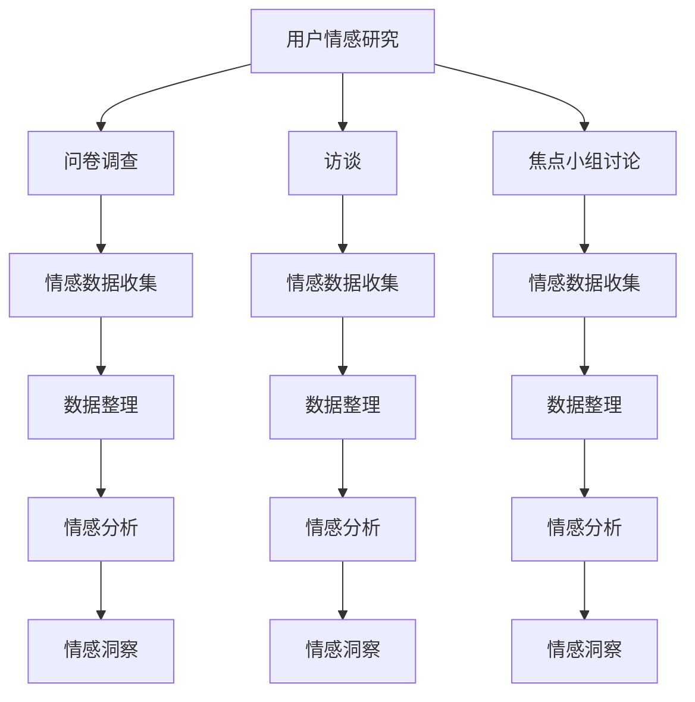

##### 2. 情感分析

对收集到的用户情感数据进行分析，提取关键情感特征和情感趋势。情感分析技术可以帮助设计师理解用户在不同情境下的情感反应，从而为设计提供指导。

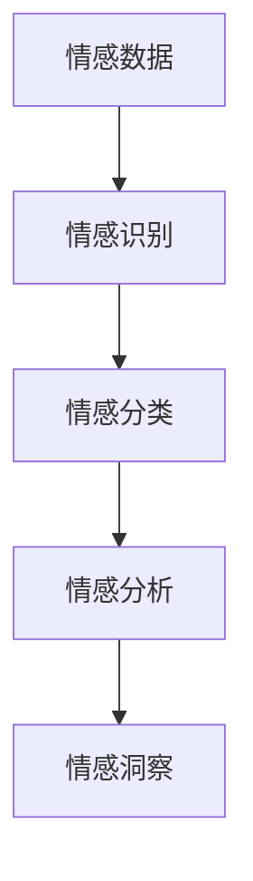

##### 3. 设计创意生成

基于情感分析结果，设计师可以生成一系列的情感化设计创意。这些创意应能够触发用户的情感共鸣，提升产品的吸引力。设计创意生成过程中，可以使用情感化的设计工具和方法，如情感化的色彩选择、材料搭配和形状设计。

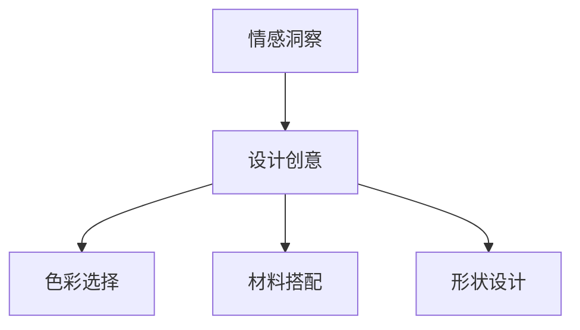

##### 4. 用户反馈与优化

将初步设计的产品展示给用户，收集用户反馈，并根据反馈进行迭代优化。这一过程可以通过A/B测试、用户调研等方法进行，以确保最终设计能够满足用户的情感需求。

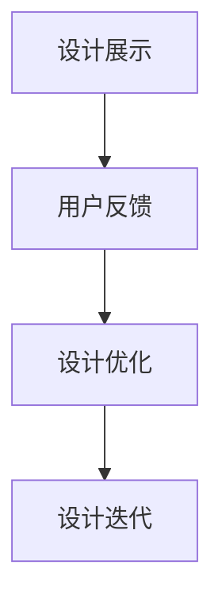

#### 情感AI在时尚设计中的应用步骤

1. **数据收集**：通过各种渠道收集用户行为数据和情感数据，如社交媒体互动、用户评论、购买记录等。

2. **情感识别**：使用情感识别算法分析文本、语音和图像数据，提取情感特征。

3. **情感分析**：对情感特征进行分类和分析，识别用户的情感趋势和情感需求。

4. **设计创意生成**：基于情感分析结果，生成情感化设计创意。

5. **用户反馈与优化**：通过用户测试和反馈，不断优化设计，确保满足用户情感需求。

#### 实际案例分析

**案例一：某时尚品牌情感化产品设计**

某时尚品牌通过情感AI技术进行产品创新，设计了一款情感化的手表。以下是该案例的应用步骤：

1. **用户情感研究**：通过问卷调查和用户访谈，了解用户对现有手表的情感反应和期望。

2. **情感识别**：分析用户评论和社交媒体互动，提取情感特征。

3. **情感分析**：发现用户对现有手表的期望主要集中在时尚性、实用性以及情感共鸣方面。

4. **设计创意生成**：基于情感分析结果，设计师创作了一款融合时尚设计、实用功能和情感共鸣的手表。

5. **用户反馈与优化**：通过用户测试和反馈，品牌不断优化设计，最终推出了一款广受好评的情感化手表。

**案例二：某时尚品牌个性化推荐设计**

另一家时尚品牌利用情感AI技术为用户提供个性化推荐。以下是该案例的应用步骤：

1. **数据收集**：收集用户购买记录、浏览历史和社交媒体互动数据。

2. **情感识别**：分析用户行为数据，识别用户对产品款式、颜色和材质的偏好。

3. **情感分析**：通过情感分析技术，识别用户的情感需求。

4. **设计创意生成**：基于用户情感需求，设计师创作出一系列个性化推荐产品。

5. **用户反馈与优化**：通过用户反馈和购买行为，不断优化个性化推荐系统，提升用户体验。

#### 情感AI在时尚设计中的效果

通过情感AI技术的应用，时尚设计实现了以下几个显著效果：

1. **提高设计精度**：情感AI帮助设计师更准确地把握用户情感需求，提高设计成功率。
2. **提升用户满意度**：情感化的设计能够更好地满足用户情感需求，提升用户满意度。
3. **增强品牌价值**：情感AI的应用使得时尚品牌能够提供更具情感共鸣的产品和服务，增强品牌价值。
4. **创新设计理念**：情感AI为设计师提供了全新的设计工具和方法，推动时尚设计的创新和发展。

综上所述，情感AI在时尚设计中的应用为设计师提供了强有力的支持，通过个性化与情感化的设计，时尚产业将迎来新的发展机遇。在接下来的章节中，我们将进一步探讨情感AI在时尚零售和营销中的应用，分析其实际效果和影响。### 情感AI在时尚零售中的应用

情感AI技术在时尚零售领域的应用，正逐渐改变传统零售模式，为消费者提供更加个性化、互动化的购物体验。以下将详细介绍情感识别在顾客体验中的应用、个性化推荐在时尚零售中的应用，以及情感化零售环境设计。

#### 情感识别在顾客体验中的应用

情感识别技术可以通过分析顾客的语音、面部表情、身体姿态等数据，实时捕捉顾客的情感状态。这种技术有助于零售商了解顾客在购物过程中的情感反应，从而优化购物体验。以下是情感识别在顾客体验中的应用：

##### 1. 顾客情感分析

通过情感识别技术，零售商可以分析顾客在购物过程中的情感状态，如兴奋、满意、焦虑等。这种分析可以帮助零售商了解顾客的情感需求，从而提供更有针对性的服务。

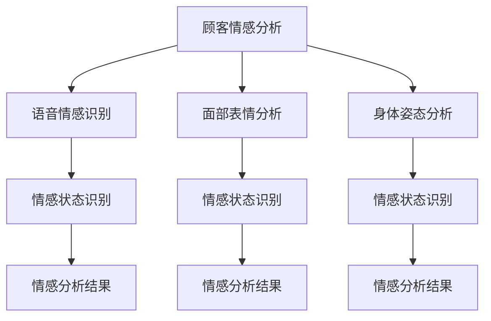

##### 2. 个性化服务

基于情感分析结果，零售商可以提供个性化服务，如根据顾客的情感状态调整购物环境、推荐适合的产品等。这种个性化服务能够提升顾客的满意度，增加顾客忠诚度。

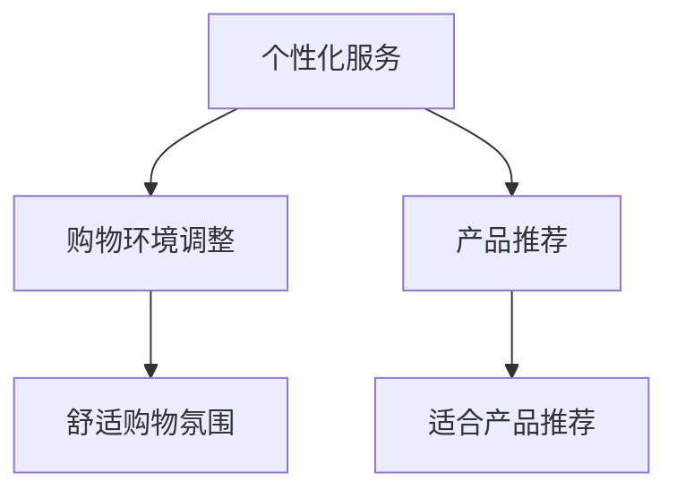

##### 3. 顾客反馈收集

通过情感识别技术，零售商可以收集顾客在购物过程中的真实反馈，如情感反应、满意度等。这些反馈有助于零售商了解顾客需求，优化服务和产品。

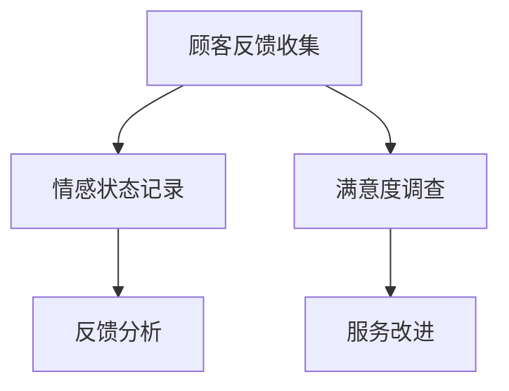

#### 个性化推荐在时尚零售中的应用

个性化推荐技术可以帮助零售商根据顾客的情感状态和购物历史，提供个性化的产品推荐。以下是个性化推荐在时尚零售中的应用：

##### 1. 情感驱动的推荐系统

情感驱动的推荐系统通过分析顾客的情感状态，推荐符合顾客情感需求的产品。这种推荐系统能够提高顾客的购买转化率，提升销售额。

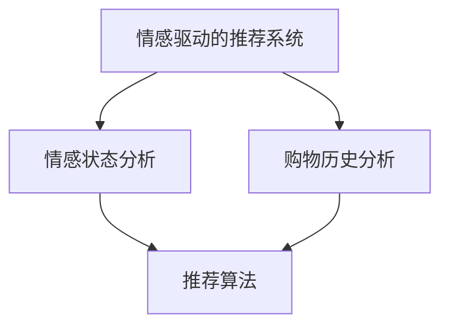

##### 2. 个性化营销

基于情感识别和个性化推荐技术，零售商可以针对不同顾客的情感状态，设计个性化的营销策略。例如，对于情感状态积极的顾客，可以推送促销信息和优惠券；对于情感状态消极的顾客，可以提供购物建议和个性化服务。

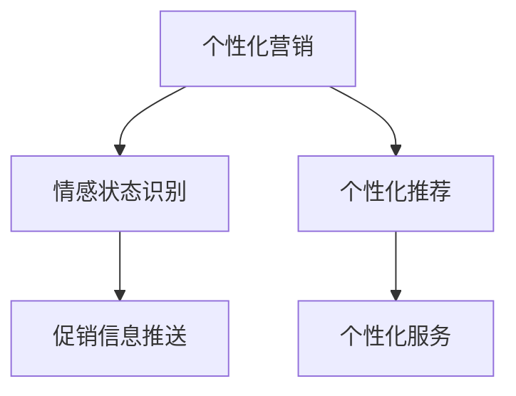

##### 3. 跨渠道推荐

通过整合线上线下渠道的数据，零售商可以实现跨渠道的个性化推荐。例如，顾客在实体店试穿衣物时，通过情感识别技术了解顾客的情感反应，然后将个性化的推荐信息同步到线上渠道。

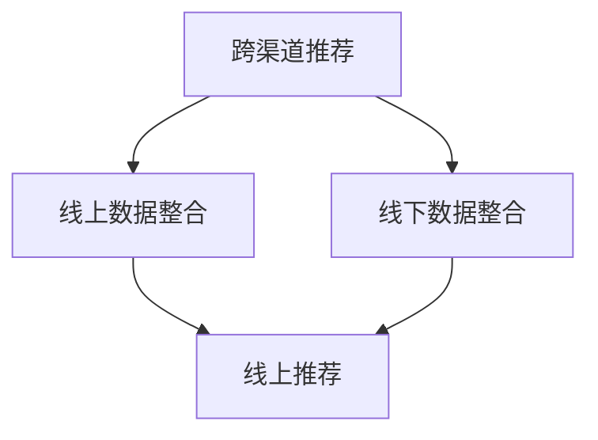

#### 情感化零售环境设计

情感化零售环境设计旨在通过环境布局、氛围营造、服务设计等方面，提升顾客的情感体验。以下是一些情感化零售环境设计的关键要素：

##### 1. 环境布局

通过合理的空间布局，营造舒适的购物环境。例如，使用柔和的灯光、舒适的座椅和温馨的背景音乐，使顾客在购物过程中感到放松和愉悦。

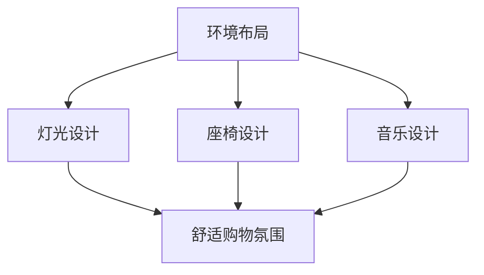

##### 2. 氛围营造

通过视觉、听觉、嗅觉等多感官刺激，营造情感化的购物氛围。例如，使用个性化的装饰、播放顾客喜欢的音乐和提供香氛体验，提升顾客的情感体验。

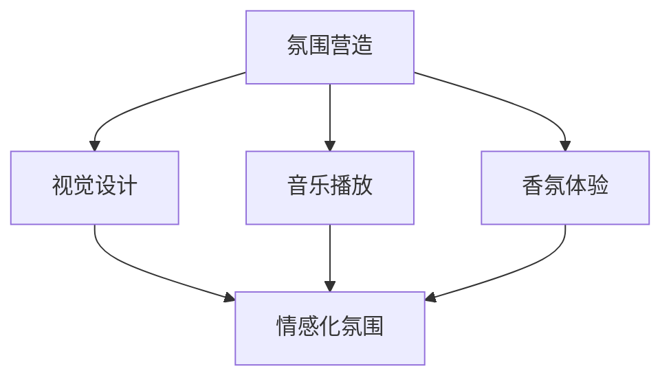

##### 3. 服务设计

提供个性化、贴心的服务，提升顾客的满意度。例如，为顾客提供定制化的购物建议、优先接待和售后服务等。

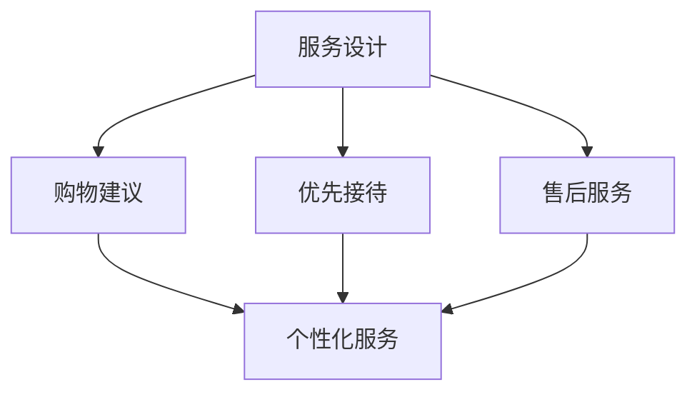

#### 实际案例分析

**案例一：某时尚零售品牌情感识别应用**

某时尚零售品牌通过情感识别技术，分析顾客在购物过程中的情感反应，优化购物体验。以下是该案例的应用步骤：

1. **情感识别**：通过摄像头和麦克风设备，实时捕捉顾客的面部表情和语音情感。
2. **情感分析**：分析情感数据，识别顾客的情感状态。
3. **个性化服务**：根据情感分析结果，为顾客提供个性化的购物建议和推荐。
4. **反馈收集**：收集顾客的反馈，优化服务策略。

**案例二：某快时尚品牌情感化零售环境设计**

某快时尚品牌通过情感化零售环境设计，提升顾客体验。以下是该案例的应用步骤：

1. **环境布局**：设计舒适的购物空间，提供个性化的购物体验。
2. **氛围营造**：使用柔和的灯光和个性化的装饰，营造温馨的购物氛围。
3. **服务设计**：提供个性化、贴心的服务，如定制化购物建议和优先接待。
4. **效果评估**：通过顾客反馈和销售数据，评估情感化零售环境的设计效果。

#### 情感AI在时尚零售中的效果

情感AI技术在时尚零售中的应用，取得了显著的效果：

1. **提升顾客满意度**：通过情感识别和个性化服务，提升顾客的购物体验，增加顾客满意度。
2. **增加销售转化率**：情感化的推荐系统和购物体验，提高顾客的购买转化率。
3. **优化库存管理**：通过情感AI分析顾客的情感需求和购物行为，优化库存管理和销售预测。
4. **增强品牌价值**：情感AI的应用使得时尚零售品牌更具创新性和竞争力，增强品牌价值。

综上所述，情感AI在时尚零售中的应用，不仅提升了顾客体验和销售效果，还为时尚零售行业带来了新的发展机遇。在接下来的章节中，我们将继续探讨情感AI在时尚营销中的应用，分析其实际效果和影响。### 情感AI在时尚营销中的应用

情感AI在时尚营销中的应用，为品牌提供了全新的手段，以更加精准、个性化和情感化的方式与消费者互动，从而提高营销效果。以下将详细探讨情感化广告设计、情感化社交媒体营销以及情感化品牌传播。

#### 情感化广告设计

情感化广告设计是指通过深入分析消费者的情感需求和心理状态，设计出能够引起情感共鸣的广告内容。这种广告不仅传达产品信息，更通过情感连接与消费者建立深厚的情感联系。以下是情感化广告设计的关键步骤：

##### 1. 情感识别与分析

首先，通过情感识别技术分析目标受众的情感状态和偏好。这可以通过社交媒体互动、用户评论、在线问卷调查等方式进行。例如，使用自然语言处理（NLP）技术分析消费者在社交媒体上的言论，了解他们的情感倾向。

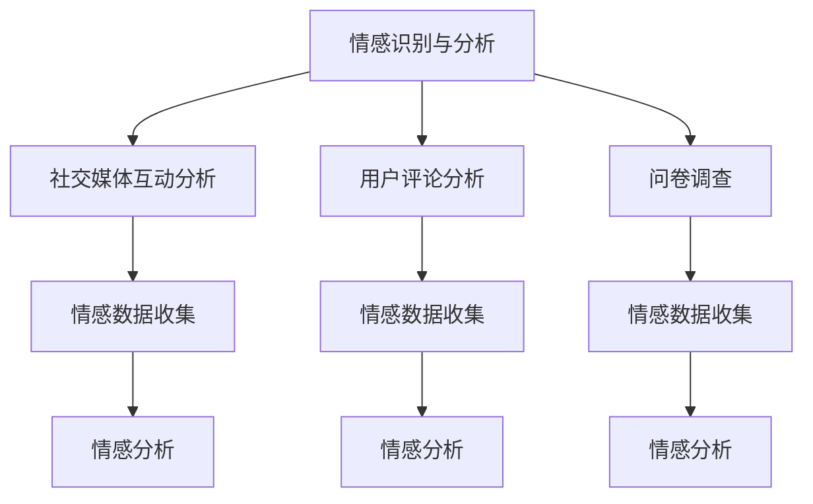

##### 2. 情感化内容创作

基于情感分析结果，创作情感化的广告内容。这可以包括使用色彩、图像、音效等元素来传达特定的情感，从而激发消费者的情感共鸣。例如，对于情感状态积极的消费者，可以使用明亮、活力的色彩和欢快的音乐来传达品牌的正面形象。

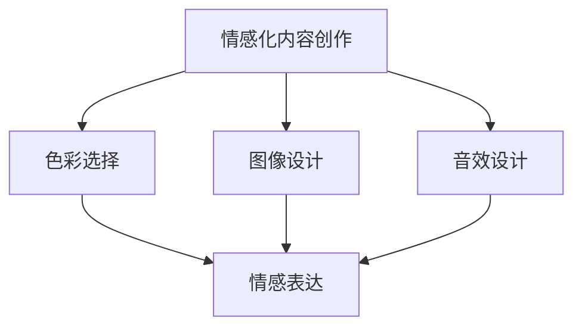

##### 3. 广告投放优化

通过实时监测广告效果，优化广告投放策略。利用情感识别技术，分析消费者对广告的反应，如点击率、分享率、情感反应等，从而调整广告内容和投放方式，提高广告效果。

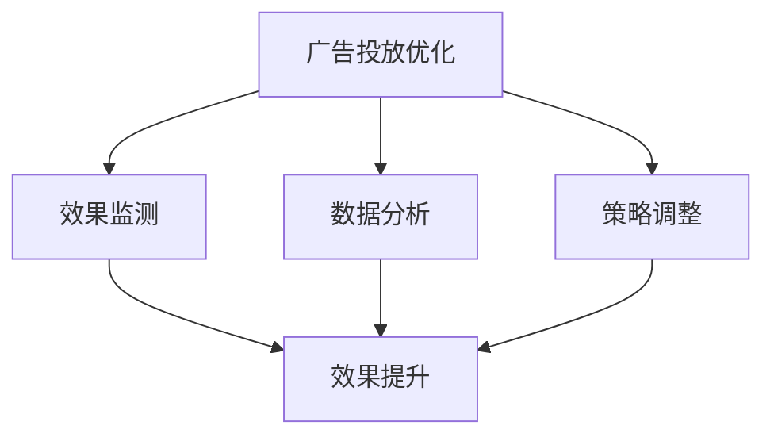

#### 情感化社交媒体营销

情感化社交媒体营销是指利用情感AI技术，通过社交媒体平台与消费者进行互动，传达情感化的品牌信息，增强品牌影响力。以下是情感化社交媒体营销的关键步骤：

##### 1. 社交媒体互动

通过情感识别技术，分析消费者在社交媒体上的互动行为，了解他们的情感状态和需求。例如，分析消费者在社交媒体上的评论、点赞和分享行为，识别他们的情感偏好。

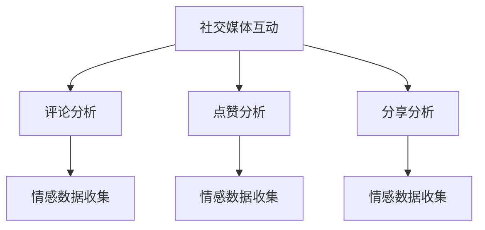

##### 2. 情感化内容发布

基于情感分析结果，发布情感化的社交媒体内容。这可以包括情感化的文字、图像、视频等多媒体内容，以激发消费者的情感共鸣。例如，发布与消费者情感状态相关的品牌故事、用户推荐、互动活动等。

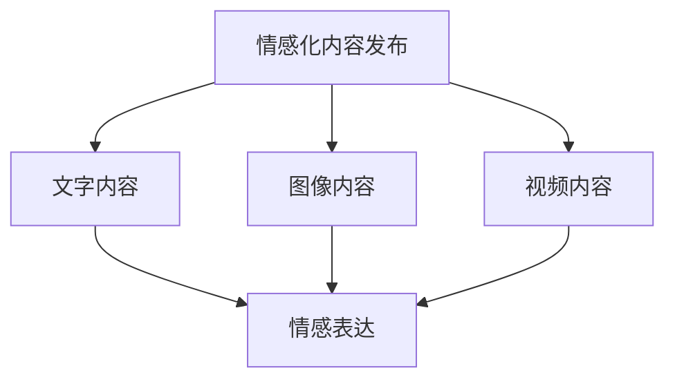

##### 3. 社交媒体互动优化

通过实时监测社交媒体互动效果，优化营销策略。利用情感识别技术，分析消费者对社交媒体内容的反应，如点赞、评论、分享等，调整内容发布频率、形式和主题，提高互动效果。

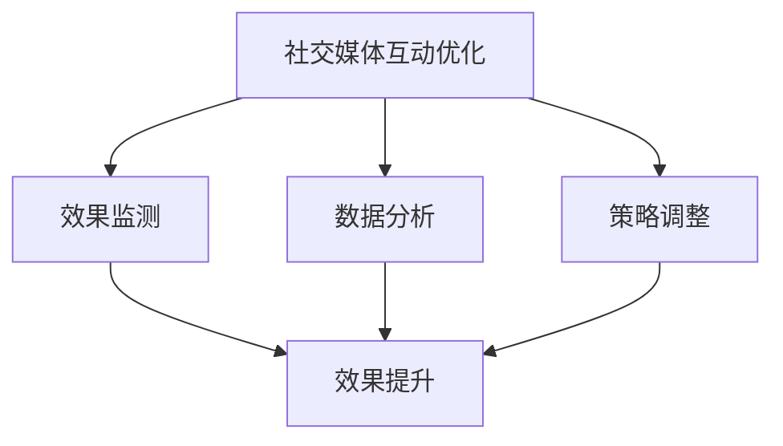

#### 情感化品牌传播

情感化品牌传播是指通过情感AI技术，在品牌传播过程中，利用情感化手段建立与消费者的情感连接，提升品牌认知度和忠诚度。以下是情感化品牌传播的关键步骤：

##### 1. 情感化品牌定位

通过情感识别技术，了解目标消费者的情感需求和情感偏好，明确品牌的情感定位。例如，分析消费者对品牌的情感反应，确定品牌所传达的情感价值观。

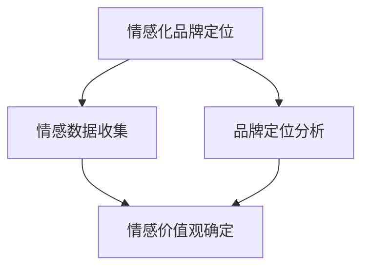

##### 2. 情感化品牌内容创作

基于情感化品牌定位，创作情感化的品牌内容。这可以包括情感化的广告、公关稿件、社交媒体内容等，以传达品牌的情感价值观，建立与消费者的情感连接。

```mermaid
graph TB
A[情感化品牌内容创作] --> B[广告内容]
A --> C[公关稿件]
A --> D[社交媒体内容]
B --> E[情感表达]
C --> E
D --> E
```

##### 3. 情感化品牌传播渠道

通过多渠道传播情感化品牌内容，扩大品牌影响力。例如，利用社交媒体、线上广告、公关活动等多种渠道，将情感化品牌内容传递给消费者，提升品牌认知度和忠诚度。

```mermaid
graph TB
A[情感化品牌传播渠道] --> B[社交媒体]
A --> C[线上广告]
A --> D[公关活动]
B --> E[渠道整合]
C --> E
D --> E
```

#### 实际案例分析

**案例一：某时尚品牌情感化广告设计**

某时尚品牌通过情感AI技术，设计了一系列情感化的广告。以下是该案例的应用步骤：

1. **情感识别**：通过社交媒体互动和用户评论，分析目标消费者的情感状态和偏好。
2. **内容创作**：基于情感分析结果，创作情感化的广告内容，如情感化的故事、情感化的图像等。
3. **投放优化**：通过实时监测广告效果，调整广告内容和投放策略，提高广告效果。

**案例二：某时尚品牌情感化社交媒体营销**

某时尚品牌通过情感AI技术，进行情感化社交媒体营销。以下是该案例的应用步骤：

1. **互动分析**：通过情感识别技术，分析消费者在社交媒体上的互动行为，了解他们的情感状态和需求。
2. **内容发布**：基于情感分析结果，发布情感化的社交媒体内容，如情感化的故事、用户推荐等。
3. **互动优化**：通过实时监测社交媒体互动效果，调整内容发布策略，提高互动效果。

**案例三：某时尚品牌情感化品牌传播**

某时尚品牌通过情感AI技术，进行情感化品牌传播。以下是该案例的应用步骤：

1. **品牌定位**：通过情感识别技术，了解目标消费者的情感需求和情感偏好，明确品牌的情感定位。
2. **内容创作**：基于情感化品牌定位，创作情感化的品牌内容，如情感化的广告、公关稿件等。
3. **渠道整合**：通过多渠道传播情感化品牌内容，扩大品牌影响力。

#### 情感AI在时尚营销中的效果

情感AI技术在时尚营销中的应用，取得了显著的效果：

1. **提高广告效果**：通过情感识别和个性化内容创作，提高广告的点击率和转化率。
2. **增强品牌认知度**：通过情感化品牌传播，提升品牌在消费者心中的认知度和忠诚度。
3. **优化营销策略**：通过实时监测和分析消费者情感反应，优化营销策略，提高营销效果。
4. **提升用户体验**：通过情感化营销手段，提供更加个性化、贴心的服务，提升用户体验。

综上所述，情感AI在时尚营销中的应用，为品牌提供了全新的营销手段，通过情感连接与消费者互动，提升了营销效果和品牌价值。在接下来的章节中，我们将进一步探讨情感AI对时尚产业的影响与挑战，分析其未来发展前景。### 情感AI对时尚产业的影响与挑战

#### 情感AI带来的变革

情感AI的引入为时尚产业带来了深远的变革，主要表现在以下几个方面：

1. **个性化与情感化设计的普及**：情感AI技术使得设计师能够更好地理解消费者的情感需求，推动个性化与情感化设计的普及。通过情感识别和分析，设计师可以创作出更符合消费者情感状态的产品，提升用户体验和满意度。

2. **营销策略的创新**：情感AI技术为时尚品牌提供了新的营销手段。通过情感化广告、社交媒体互动和个性化推荐，品牌能够更精准地触达目标消费者，提高营销效果和品牌认知度。

3. **供应链与库存管理的优化**：情感AI技术可以帮助时尚品牌更好地预测市场需求，优化供应链管理和库存管理。通过分析消费者的情感状态和购买行为，品牌可以更准确地预测流行趋势，减少库存积压，提高运营效率。

4. **用户参与与互动的提升**：情感AI技术使得时尚品牌能够更深入地了解消费者的情感需求，提升用户参与度和互动性。通过情感识别和个性化推荐，品牌可以提供更加个性化、贴心的服务，增强用户忠诚度。

#### 情感AI在时尚产业中的挑战

尽管情感AI为时尚产业带来了巨大的变革潜力，但其在实际应用过程中也面临着一些挑战：

1. **技术挑战**：情感AI技术尚处于发展阶段，其准确性和稳定性仍需提高。目前，情感识别技术的准确率受到数据质量和算法复杂度的影响，需要在算法优化和数据采集方面进行更多的研究和改进。

2. **道德与伦理挑战**：情感AI技术在时尚产业中的应用引发了一系列道德和伦理问题。例如，情感识别技术可能侵犯用户隐私，个性化推荐可能导致信息茧房，情感化设计可能过度迎合消费者需求，影响消费者独立思考和审美能力。

3. **法律与监管挑战**：情感AI技术的应用涉及数据隐私、用户权益保护等问题，需要相关法律法规的完善和监管。当前，全球各国对于AI技术的监管政策尚未统一，时尚品牌需要在遵守不同国家和地区的法律法规方面进行更多考虑。

#### 未来的发展方向

面对挑战，情感AI在时尚产业中的未来发展可以从以下几个方面进行：

1. **技术优化**：进一步优化情感识别算法和推荐系统，提高其准确性和稳定性。通过引入更多的数据源和先进算法，提升情感分析的能力。

2. **合规与伦理**：制定行业规范和伦理标准，确保情感AI技术的应用符合道德和法律要求。加强数据隐私保护，建立透明、公正的推荐机制。

3. **用户教育与引导**：提高消费者对于情感AI技术的认知，教育用户如何理性看待个性化推荐和情感化设计。通过用户反馈和互动，优化产品和服务。

4. **跨行业合作**：加强与其他行业（如医疗、教育等）的合作，共同推动情感AI技术的发展和应用。通过跨领域的研究和合作，拓展情感AI技术的应用场景。

#### 结论

情感AI作为一项新兴技术，正在深刻地改变时尚产业的运作模式和发展方向。通过个性化与情感化的设计，情感AI为时尚产业带来了巨大的变革潜力。然而，要充分发挥其优势，时尚产业还需要克服技术、道德和法律等多方面的挑战。未来，随着技术的不断进步和行业的成熟，情感AI有望在时尚产业中发挥更加重要的作用，推动产业创新和发展。### 案例研究

在本章节中，我们将通过两个成功案例来深入分析情感AI在时尚产业中的应用，以及这些案例所取得的成果和经验。

#### 案例一：某时尚品牌情感化购物体验设计

**背景**：
某知名时尚品牌面临消费者购物体验不佳、顾客忠诚度下降的问题。为了提升顾客满意度和品牌忠诚度，该品牌决定引入情感AI技术，优化购物体验。

**应用步骤**：

1. **情感识别**：
   - **用户调研**：通过在线问卷调查和面对面访谈，收集顾客在购物过程中的情感数据，如满意度、情感反应等。
   - **情感分析**：使用情感识别算法，分析收集到的情感数据，识别顾客的主要情感需求和痛点。

2. **个性化推荐**：
   - **情感化推荐算法**：结合情感识别结果，开发情感化推荐系统，根据顾客的情感状态和偏好，提供个性化的产品推荐。
   - **推荐系统优化**：通过A/B测试，不断调整和优化推荐算法，提高推荐准确性。

3. **购物体验优化**：
   - **情感化设计**：根据情感分析结果，对线上和线下购物环境进行情感化设计，如优化店铺布局、调整照明和音乐等。
   - **个性化服务**：引入情感识别技术，提供个性化客服，根据顾客的情感状态提供有针对性的服务和建议。

**用户反馈与效果评估**：
通过用户反馈和销售数据，评估情感化购物体验的效果：

- **用户满意度**：调查显示，用户对购物体验的满意度显著提升，尤其对个性化推荐和情感化客服表示满意。
- **销售转化率**：销售数据表明，个性化推荐系统的引入提高了销售转化率，尤其是在节假日和促销活动期间。
- **顾客忠诚度**：顾客的重复购买率有所提高，品牌忠诚度得到巩固。

**总结**：
通过情感AI技术的应用，该时尚品牌成功提升了购物体验和顾客满意度，实现了销售增长和品牌忠诚度的提升。这一案例证明了情感AI在时尚产业中的巨大潜力。

#### 案例二：某时尚品牌情感化广告策略

**背景**：
某时尚品牌在广告营销方面效果不佳，希望通过情感AI技术提升广告效果和市场占有率。

**应用步骤**：

1. **情感识别**：
   - **社交媒体分析**：通过情感识别技术，分析消费者在社交媒体上的情感状态和互动，了解品牌情感感知。
   - **用户画像**：根据情感数据，构建消费者情感画像，识别目标受众的情感需求。

2. **情感化广告创作**：
   - **情感化内容创作**：结合情感画像，创作情感化的广告内容，如情感化的故事、画面和音乐。
   - **情感驱动**：确保广告内容能够触发消费者的情感共鸣，增强品牌认知度和好感度。

3. **广告投放与优化**：
   - **精准投放**：根据消费者的情感状态和偏好，制定精准的广告投放策略，提高广告曝光率和点击率。
   - **效果监测**：通过实时监测广告效果，分析消费者的情感反应，调整广告内容和投放策略。

**用户反馈与效果评估**：
通过用户反馈和广告数据，评估情感化广告策略的效果：

- **广告效果**：调查显示，情感化广告的点击率和分享率显著高于传统广告，吸引了更多潜在消费者。
- **品牌认知度**：品牌在社交媒体上的认知度得到提升，用户对品牌的情感好感度增加。
- **市场占有率**：销售数据显示，情感化广告策略有效提升了品牌的市场占有率。

**总结**：
通过情感AI技术的应用，该时尚品牌成功提升了广告效果和市场占有率，实现了品牌认知度和用户满意度的双重提升。这一案例展示了情感AI在时尚营销中的巨大潜力。

#### 案例总结与启示

这两个案例充分展示了情感AI在时尚产业中的实际应用效果和成功经验。通过情感识别、个性化推荐和情感化设计，品牌能够更好地理解消费者需求，提升购物体验和营销效果。以下是案例总结与启示：

1. **情感识别的重要性**：情感识别是情感AI应用的基础，通过分析消费者的情感状态，品牌可以更好地满足他们的需求，提升用户体验。

2. **个性化与情感化的结合**：个性化推荐和情感化设计相结合，能够更精准地触达目标消费者，提高品牌忠诚度和市场占有率。

3. **持续优化与迭代**：通过实时监测和反馈，不断优化情感AI应用，提升其准确性和效果。

4. **跨部门协作与数据共享**：情感AI技术的成功应用需要跨部门协作和数据共享，从用户调研、数据分析到产品设计、营销策略，各个环节都需要紧密配合。

5. **合规与伦理**：在应用情感AI技术时，需要充分考虑合规与伦理问题，确保技术应用符合法律和道德要求，保护用户隐私和数据安全。

总之，情感AI在时尚产业中的应用为品牌带来了巨大的变革机会，通过个性化与情感化的设计，品牌能够更好地满足消费者需求，提升市场竞争力和品牌价值。在未来的发展中，情感AI将继续发挥重要作用，推动时尚产业的创新和进步。### 总结与展望

#### 主要内容回顾

本文从多个角度深入探讨了情感AI在时尚产业中的应用，主要包括以下几个核心部分：

1. **情感AI的基本原理**：详细介绍了情感识别、个性化推荐和情感化设计等核心技术，以及其相互关系和架构。
2. **情感AI在时尚设计中的应用**：阐述了情感化时尚产品设计的步骤、情感AI在时尚设计中的应用步骤以及实际案例分析。
3. **情感AI在时尚零售中的应用**：探讨了情感识别在顾客体验中的应用、个性化推荐在时尚零售中的应用，以及情感化零售环境设计。
4. **情感AI在时尚营销中的应用**：分析了情感化广告设计、情感化社交媒体营销和情感化品牌传播的具体实践。
5. **情感AI对时尚产业的影响与挑战**：讨论了情感AI带来的变革、在时尚产业中的挑战以及未来的发展方向。
6. **案例研究**：通过两个成功案例，展示了情感AI在时尚产业中的应用效果和经验。

#### 未来的研究方向

在情感AI与时尚产业深度融合的过程中，以下研究方向值得关注：

1. **情感识别技术的优化**：进一步提高情感识别的准确性和稳定性，通过多源数据融合和深度学习算法，提升情感分析的精度。
2. **个性化推荐系统的创新**：探索基于情感数据的个性化推荐算法，实现更精准的用户需求预测和产品推荐。
3. **情感化设计工具的开发**：开发更智能化、用户友好的情感化设计工具，辅助设计师进行情感化创作。
4. **跨行业合作与共享**：加强与其他行业的合作，如医疗、教育等，共同推动情感AI技术的发展和应用。
5. **伦理与合规研究**：深入研究情感AI技术在时尚产业中的伦理和法律问题，制定行业标准和规范，保障用户权益和数据安全。

#### 对时尚产业的影响与贡献

情感AI对时尚产业的影响是深远而广泛的：

1. **提升用户体验**：通过情感识别和个性化推荐，提供更加贴心的购物体验，满足消费者的多样化需求。
2. **优化营销策略**：通过情感化广告和社交媒体营销，提高品牌认知度和市场占有率，实现精准营销。
3. **创新设计理念**：情感化设计为时尚产业带来了新的设计思路，推动设计创新和品牌差异化竞争。
4. **提高运营效率**：通过情感AI技术优化供应链管理和库存管理，降低运营成本，提高企业竞争力。

总之，情感AI为时尚产业带来了巨大的变革机遇，通过个性化与情感化的设计，时尚产业将迎来更加智能化、人性化的未来发展。在未来，随着技术的不断进步和应用的深入，情感AI将在时尚产业中发挥更加重要的作用，推动产业的创新和进步。### 最佳实践 tips、小结、注意事项、拓展阅读

#### 最佳实践 tips

1. **用户数据收集**：在进行情感AI应用时，确保收集的数据质量，避免噪音和偏差，以提高情感识别和分析的准确性。
2. **个性化推荐**：在开发个性化推荐系统时，平衡推荐系统的多样性和相关性，避免过度个性化导致用户失去探索机会。
3. **情感化设计**：在设计情感化产品时，注重情感与实用性的结合，确保设计既能够触发用户情感共鸣，又满足功能需求。
4. **持续迭代**：情感AI技术不断进步，持续进行技术迭代和优化，以保持其在时尚产业中的竞争力。

#### 小结

本文系统地探讨了情感AI在时尚产业中的应用，从基本原理到实际案例，再到未来研究方向，全面阐述了情感AI对时尚产业的深远影响。情感AI通过个性化与情感化的设计，提升了用户体验、优化了营销策略，并推动了设计创新和运营效率的提升。

#### 注意事项

1. **合规性**：在应用情感AI技术时，注意遵守相关法律法规，保护用户隐私和数据安全。
2. **用户教育**：加强对消费者的教育，让他们了解情感AI的工作原理和应用价值，提高接受度和参与度。
3. **技术稳定性**：情感AI技术尚在发展中，确保系统的稳定性和可靠性，避免因技术问题影响用户体验。

#### 拓展阅读

1. **《情感计算：情感智能的基础与实现》** - 陈涛著。本书详细介绍了情感计算的基本概念、方法和应用，适合对情感AI感兴趣的读者。
2. **《时尚产业变革：技术与设计的融合》** - 李明著。本书探讨了时尚产业与技术的融合趋势，包括情感AI在内的多种新技术在时尚产业中的应用。
3. **《个性化推荐系统实践》** - 张华著。本书介绍了个性化推荐系统的设计和实现，包括算法原理、系统架构和优化策略。

通过以上拓展阅读，读者可以进一步深入了解情感AI和相关领域的知识，为未来的研究和应用提供参考。作者：AI天才研究院/AI Genius Institute & 禅与计算机程序设计艺术 /Zen And The Art of Computer Programming。

