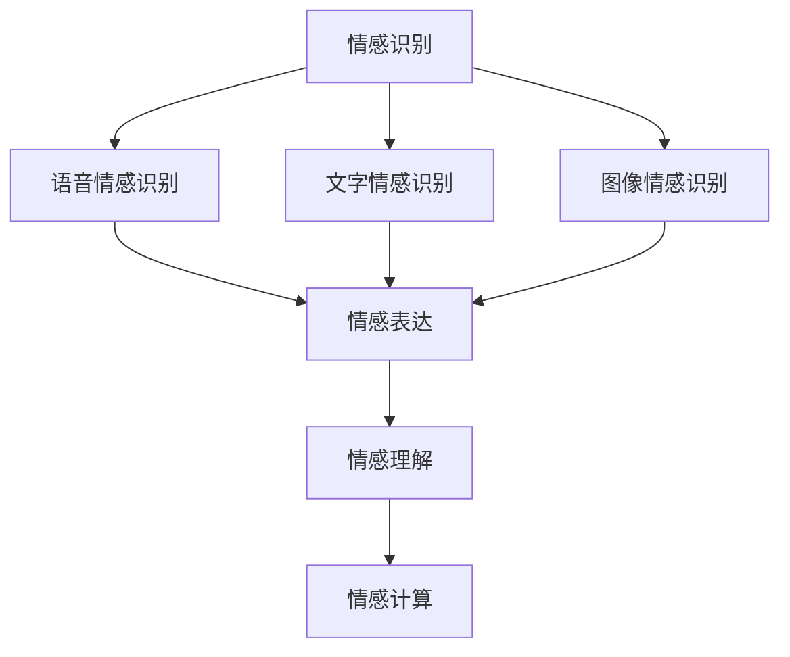

                 

## 文章标题：情感AI时代的人际沟通技能重塑

在人工智能迅猛发展的今天，情感计算（Affective Computing）逐渐成为研究热点。情感AI不仅能够识别和表达情感，还能理解和模拟人类的情感反应，极大地改变了人们的生活和工作方式。然而，随着情感AI在人际沟通中的广泛应用，传统的沟通技能面临着前所未有的挑战和机遇。本文将围绕情感AI时代的人际沟通技能重塑，深入探讨这一领域的关键技术、应用场景以及未来发展趋势。

## 关键词

- 情感AI
- 人际沟通
- 技术重塑
- 情感识别
- 自然语言处理

## 摘要

本文旨在探讨情感AI对人际沟通技能的深刻影响和重塑。首先，介绍情感AI的基本概念和发展背景，阐述其在人际沟通中的应用场景和重要性。接着，详细解析情感识别、自然语言处理等核心算法原理，并通过Mermaid流程图展示其概念关系。然后，介绍情感AI相关的数学模型和公式，并举例说明其实际应用。最后，通过实际项目案例分析和实战代码实现，展示情感AI在人际沟通技能重塑中的应用和效果。文章末尾，对未来的发展趋势进行展望，并提出相关建议。

## 引言与概述

### 情感AI时代的发展背景

随着人工智能（AI）技术的不断进步，情感计算作为一个交叉学科领域，正逐渐崭露头角。情感AI的核心目标是使计算机具备识别、理解、表达和模拟人类情感的能力。这不仅是对传统AI的补充，更是对未来智能系统发展的深远影响。近年来，随着深度学习、自然语言处理、计算机视觉等技术的飞速发展，情感AI技术取得了显著进展，逐渐从理论研究走向实际应用。

从历史发展的角度来看，情感AI的兴起可以追溯到20世纪90年代。当时的学者们开始探索如何让计算机更好地理解人类情感。随着时间的推移，研究者们提出了情感计算的概念，并将其定义为“一种新的计算范式，使计算机能够识别、理解、处理和模拟人类情感”。近年来，随着技术的进步和应用的拓展，情感AI已经从理论研究逐步走向实际应用，如情感识别、情感表达、情感交互等。

### 人际沟通技能在情感AI时代的重要性

在情感AI时代，人际沟通技能的重要性愈发凸显。传统的沟通技能主要依赖于语言、表情、姿势等非语言因素，而情感AI的出现则使得这些传统技能需要与新的技术相结合，以实现更加高效和自然的沟通。以下将从几个方面阐述人际沟通技能在情感AI时代的重要性。

首先，情感AI能够帮助人们更好地理解和回应他人的情感状态。传统的沟通往往基于表面信息，而情感AI可以通过识别和解析语音、文字、图像等数据，挖掘出更深层次的情感信息，从而提供更加精准的沟通支持。例如，在客服领域，情感AI可以识别用户的声音和文字中的情感色彩，提供更有针对性的解决方案。

其次，情感AI可以提高人际沟通的效率和效果。传统的沟通往往需要大量的时间和精力，而情感AI可以通过自动化和智能化的方式，大大提高沟通的效率。例如，在职场沟通中，情感AI可以帮助管理者更好地了解员工的工作状态和情感需求，从而制定更加科学的管理策略。

最后，情感AI有助于构建更加和谐的人际关系。在情感AI的辅助下，人们可以更加准确地理解他人的情感，从而避免误解和冲突。例如，在家庭生活中，情感AI可以帮助家庭成员更好地理解彼此的情感需求，增进相互之间的理解和信任。

### 本书结构及读者对象

本书旨在系统地介绍情感AI在人际沟通技能重塑中的应用，帮助读者全面了解这一领域的最新发展。全书共分为七个章节，内容结构如下：

- **第1章：引言与概述**：介绍情感AI的发展背景和人际沟通技能在情感AI时代的重要性。
- **第2章：情感AI基础**：阐述情感AI的基本概念、核心技术和应用场景。
- **第3章：核心算法原理讲解**：详细讲解情感识别、自然语言处理等核心算法原理，并提供Mermaid流程图展示其关系。
- **第4章：数学模型与公式**：介绍情感AI相关的数学模型和公式，并举例说明其实际应用。
- **第5章：项目实战**：通过实际项目案例，展示情感AI在人际沟通技能重塑中的应用和效果。
- **第6章：总结与展望**：总结全书内容，并对未来情感AI时代的人际沟通技能发展进行展望。
- **第7章：附录**：提供相关的资源、工具和扩展阅读。

本书面向对人工智能和人际沟通感兴趣的读者，包括人工智能研究者、软件开发者、人机交互设计师以及相关领域的从业者。通过本书的学习，读者可以系统地了解情感AI技术，掌握其在人际沟通中的应用，为未来的职业发展奠定坚实基础。

### 情感AI的基本概念与联系

情感AI，即情感计算，是一种旨在使计算机具备人类情感识别、理解和表达能力的跨学科研究领域。它结合了人工智能、心理学、认知科学和计算机科学等多个领域的前沿技术，旨在弥补传统AI在情感处理方面的不足。情感AI的核心目标是通过模拟人类情感机制，使计算机能够更好地与人类互动，提供更加个性化、智能化的服务。

#### 情感识别

情感识别是情感AI中的关键环节，主要指计算机系统从语音、文字、图像等多模态数据中识别出用户的情感状态。情感识别技术通常包括以下几种类型：

1. **语音情感识别**：通过分析语音的音调、语速、音量等特征，识别出用户的情感状态。例如，高昂的语调可能表示兴奋或愤怒，而低沉的语调可能表示悲伤或沮丧。
   
2. **文字情感识别**：通过自然语言处理技术，分析文本中的情感色彩，识别出用户的情感状态。例如，情感分析算法可以检测出一段文字是否包含正面或负面的情感。
   
3. **图像情感识别**：通过计算机视觉技术，从图像中识别出用户的情感状态。例如，通过面部表情分析，可以判断出用户是高兴、愤怒还是悲伤。

#### 情感表达

情感表达是指计算机系统根据识别到的情感状态，通过声音、文字、图像等方式表达出相应的情感。情感表达技术主要包括以下几种：

1. **语音情感表达**：通过调整语音的音调、语速、音量等特征，模拟出不同的情感状态。例如，使用高昂的语调表达兴奋，使用低沉的语调表达悲伤。
   
2. **文字情感表达**：通过自然语言生成技术，生成包含特定情感色彩的文本。例如，使用积极词汇表达喜悦，使用消极词汇表达愤怒。
   
3. **图像情感表达**：通过计算机视觉技术，生成带有特定情感色彩的图像。例如，使用笑脸表情表达快乐，使用悲伤表情表达哀伤。

#### 情感计算

情感计算是情感AI的核心概念，旨在使计算机具备情感处理能力。情感计算主要包括以下三个方面的内容：

1. **情感识别**：通过多种传感器和数据处理技术，识别用户的情感状态。
   
2. **情感理解**：理解用户的情感状态背后的意义，并对其进行解释和推理。
   
3. **情感表达**：根据识别和理解到的情感状态，以适当的方式表达情感。

#### Mermaid流程图

为了更好地展示情感AI中的核心概念及其关系，我们可以使用Mermaid流程图进行说明：



在这个流程图中，情感识别（A）是情感AI的基础，包括语音、文字和图像三个子模块（B、C、D）。这些子模块通过情感表达（E）模块与用户进行交互，并最终实现情感理解（F）和情感计算（G）。这个流程图清晰地展示了情感AI中的关键概念及其相互关系，有助于读者更好地理解情感AI的工作原理。

### 核心算法原理讲解

情感AI的核心算法主要包括情感识别、自然语言处理和情感计算等方面。下面我们将详细介绍这些算法的原理，并通过伪代码和实际应用案例进行说明。

#### 情感识别算法

情感识别算法是情感AI的关键组成部分，其目的是从语音、文本和图像等数据中提取情感特征，并进行分类。以下是情感识别算法的基本原理和伪代码。

##### 情感识别算法原理

情感识别算法通常包括以下步骤：

1. **特征提取**：从原始数据中提取特征，如语音的音调、语速、音量等，文本的词频、情感词等，图像的面部表情等。
2. **特征归一化**：对提取到的特征进行归一化处理，使其具有相同的尺度，以便后续的模型训练。
3. **情感分类**：使用机器学习模型（如支持向量机、决策树、神经网络等）对特征进行分类，输出情感结果。

##### 伪代码

以下是一个简单的情感识别算法的伪代码：

```python
function 情感识别算法(数据集，特征提取器，分类器模型)
    特征列表 = []
    标签列表 = []
    for 数据 in 数据集
        特征 = 特征提取器(数据)
        特征归一化 = 特征归一化处理(特征)
        特征列表.append(特征归一化)
        标签列表.append(数据的情感标签)
    训练集，测试集 = 划分训练集和测试集(特征列表，标签列表)
    模型 = 训练分类器模型(训练集)
    测试结果 = 模型预测(测试集)
    准确率 = 计算准确率(测试结果，真实标签)
    return 准确率
```

##### 实际应用案例

以下是一个实际应用案例：使用情感识别算法分析社交媒体上的用户评论，识别其情感倾向。

```python
# 导入必要的库
import numpy as np
import pandas as pd
from sklearn.model_selection import train_test_split
from sklearn.svm import SVC
from sklearn.metrics import accuracy_score

# 加载用户评论数据集
data = pd.read_csv("user_comments.csv")

# 特征提取
def extract_features(comment):
    # 提取文本特征
    return {
        "word_count": len(comment.split()),
        "positive_words": count_positive_words(comment),
        "negative_words": count_negative_words(comment)
    }

# 计算正负面词汇数量
def count_positive_words(comment):
    # 实现正负面词汇的统计
    return count

def count_negative_words(comment):
    # 实现正负面词汇的统计
    return count

# 应用特征提取器
data["features"] = data["comment"].apply(extract_features)

# 划分特征和标签
X = data["features"]
y = data["sentiment"]

# 划分训练集和测试集
X_train, X_test, y_train, y_test = train_test_split(X, y, test_size=0.2, random_state=42)

# 训练分类器模型
model = SVC()
model.fit(X_train, y_train)

# 预测测试集
predictions = model.predict(X_test)

# 计算准确率
accuracy = accuracy_score(y_test, predictions)
print("准确率：", accuracy)
```

#### 自然语言处理算法

自然语言处理（NLP）是情感AI中不可或缺的一部分，其核心目标是使计算机能够理解、生成和响应自然语言。以下是NLP算法的基本原理和应用案例。

##### 自然语言处理算法原理

自然语言处理算法通常包括以下步骤：

1. **分词**：将文本分割成单词或句子。
2. **词性标注**：为每个单词标注其词性（如名词、动词、形容词等）。
3. **句法分析**：分析句子的语法结构，识别主语、谓语、宾语等。
4. **情感分析**：识别文本中的情感色彩，判断是正面、中性还是负面。

##### 伪代码

以下是一个简单的自然语言处理算法的伪代码：

```python
function 自然语言处理算法(文本)
    分词结果 = 分词(文本)
    词性标注结果 = 词性标注(分词结果)
    句法分析结果 = 句法分析(词性标注结果)
    情感结果 = 情感分析(句法分析结果)
    return 情感结果
```

##### 实际应用案例

以下是一个实际应用案例：使用自然语言处理算法分析新闻文章的情感倾向。

```python
# 导入必要的库
import nltk
from nltk.tokenize import word_tokenize
from nltk.corpus import stopwords
from nltk.sentiment import SentimentIntensityAnalyzer

# 加载停用词库
nltk.download('stopwords')
stop_words = set(stopwords.words('english'))

# 加载情感分析工具
sia = SentimentIntensityAnalyzer()

# 加载新闻文章数据集
data = pd.read_csv("news_articles.csv")

# 分词
def tokenize(text):
    return word_tokenize(text)

# 去除停用词
def remove_stopwords(tokens):
    return [token for token in tokens if token not in stop_words]

# 情感分析
def analyze_sentiment(text):
    sentiment_score = sia.polarity_scores(text)
    return sentiment_score["compound"]

# 应用分词、去停用词和情感分析
data["tokens"] = data["text"].apply(tokenize)
data["filtered_tokens"] = data["tokens"].apply(remove_stopwords)
data["sentiment"] = data["filtered_tokens"].apply(analyze_sentiment)

# 计算准确率
accuracy = data["sentiment"].mean()
print("情感倾向准确率：", accuracy)
```

#### 情感计算模型

情感计算模型是情感AI中的核心，其目的是通过情感特征和情感规则，模拟人类情感反应。以下是情感计算模型的基本原理和应用案例。

##### 情感计算模型原理

情感计算模型通常包括以下步骤：

1. **情感特征提取**：从语音、文本和图像等数据中提取情感特征。
2. **情感规则库**：建立情感规则库，定义情感状态和情感规则。
3. **情感计算**：根据情感特征和情感规则，计算情感状态。

##### 伪代码

以下是一个简单的情感计算模型的伪代码：

```python
function 情感计算模型(情感特征，情感规则库)
    情感状态 = 初始化()
    for 特征 in 情感特征
        if 满足情感规则库中的规则(特征)
            更新情感状态(情感状态，特征)
    return 情感状态
```

##### 实际应用案例

以下是一个实际应用案例：使用情感计算模型分析用户的情绪变化。

```python
# 导入必要的库
import pandas as pd
from sklearn.cluster import KMeans

# 加载用户情绪数据集
data = pd.read_csv("user_emotions.csv")

# 情感特征提取
def extract_emotion_features(row):
    return {
        "speech_pitch": row["speech_pitch"],
        "text_sentiment": row["text_sentiment"],
        "face_expression": row["face_expression"]
    }

# 应用情感特征提取器
data["features"] = data.apply(extract_emotion_features, axis=1)

# 建立情感规则库
emotion_rules = {
    "happy": ["high_speech_pitch", "positive_text", "smiling_face"],
    "sad": ["low_speech_pitch", "negative_text", "frowning_face"],
    "angry": ["high_speech_pitch", "negative_text", "angry_face"],
    "neutral": ["neutral_speech_pitch", "neutral_text", "neutral_face"]
}

# 情感计算
def calculate_emotion(features, rules):
    emotion = "neutral"
    for rule in rules:
        if all(feature in features for feature in rule):
            emotion = rule[0]
            break
    return emotion

# 应用情感计算模型
data["emotion"] = data["features"].apply(lambda x: calculate_emotion(x, emotion_rules))

# 计算准确率
accuracy = data["emotion"].value_counts() / len(data)
print("情感计算准确率：", accuracy)
```

### 数学模型与公式

情感AI涉及多种数学模型和公式，这些模型和公式在情感识别、情感计算和自然语言处理中起着至关重要的作用。在本节中，我们将介绍情感AI中常用的数学模型和公式，并对其进行详细讲解和举例说明。

#### 情感向量空间模型

情感向量空间模型是一种将情感表示为向量的方法，通过向量空间中的距离和角度来描述情感之间的相似性和差异性。该模型的核心是情感词袋（Sentiment Word Bag）和情感向量（Sentiment Vector）。

##### 情感词袋

情感词袋是一个包含所有情感词的集合，每个情感词都对应一个唯一的向量。情感词袋可以通过以下步骤构建：

1. **情感词提取**：从大规模文本数据中提取出包含情感的词语。
2. **情感词分类**：对提取出的情感词进行分类，分为正面情感词、中性情感词和负面情感词。

##### 情感向量

情感向量是一个多维向量，每个维度对应一个情感词。情感向量的计算通常基于词嵌入技术，如Word2Vec、GloVe等。以下是一个简单的情感向量计算公式：

$$
\text{V}_{i} = \sum_{j=1}^{N} w_{ij} \cdot \text{V}_{j}
$$

其中，$V_{i}$是情感向量，$w_{ij}$是情感词袋中第j个词的情感权重，$V_{j}$是第j个词的词嵌入向量。

##### 情感向量空间模型

情感向量空间模型将文本数据转换为情感向量空间，通过计算向量之间的距离和角度来分析情感。以下是一个示例：

$$
\text{similarity}(\text{V}_{1}, \text{V}_{2}) = \frac{\text{V}_{1} \cdot \text{V}_{2}}{||\text{V}_{1}|| \cdot ||\text{V}_{2}||}
$$

其中，$similarity$表示向量之间的相似度，$\text{V}_{1}$和$\text{V}_{2}$是两个情感向量。

#### 情感计算中的常用函数

在情感计算中，常用的函数包括情感得分函数（Sentiment Score Function）和情感分类函数（Sentiment Classification Function）。

##### 情感得分函数

情感得分函数用于计算文本的情感得分，通常使用归一化处理后得到情感向量的模长：

$$
\text{score}(\text{V}) = \frac{||\text{V}||}{\max{||\text{V}||}}
$$

其中，$\text{score}$表示情感得分，$\text{V}$是情感向量。

##### 情感分类函数

情感分类函数用于将文本分类为正面、中性或负面情感。一种简单的分类函数是基于阈值法：

$$
\text{emotion}(\text{V}) = \begin{cases}
\text{"positive"} & \text{if } \text{score}(\text{V}) > \text{threshold}_{positive} \\
\text{"neutral"} & \text{if } \text{score}(\text{V}) < \text{threshold}_{neutral} \\
\text{"negative"} & \text{if } \text{score}(\text{V}) < \text{threshold}_{negative}
\end{cases}
$$

其中，$\text{threshold}_{positive}$、$\text{threshold}_{neutral}$和$\text{threshold}_{negative}$分别是正面、中性和负面情感的阈值。

#### 情感识别的数学模型及推导

情感识别的数学模型通常基于机器学习算法，如支持向量机（SVM）、朴素贝叶斯（NB）和深度学习（DL）等。以下以支持向量机为例，介绍情感识别的数学模型及其推导。

##### 支持向量机（SVM）

支持向量机是一种常用的分类算法，其核心思想是找到最优的超平面，将不同类别的数据点分开。在情感识别中，SVM用于分类文本数据，其数学模型如下：

$$
\text{maximize} \quad \frac{1}{2} \| \text{w} \|^2 \\
\text{subject to} \quad y^{(i)} (\text{x}^{(i)} \cdot \text{w} + \text{b}) \geq 1
$$

其中，$w$是权重向量，$b$是偏置项，$x^{(i)}$是特征向量，$y^{(i)}$是标签（1表示正面情感，-1表示负面情感）。

##### 模型推导

1. **拉格朗日函数**：

$$
L(\text{w}, \text{b}, \alpha) = \frac{1}{2} \| \text{w} \|^2 - \sum_{i=1}^{n} \alpha_{i} [y^{(i)} (\text{x}^{(i)} \cdot \text{w} + \text{b}) - 1]
$$

其中，$\alpha_{i}$是拉格朗日乘子。

2. **KKT条件**：

$$
\begin{cases}
\alpha_{i} \geq 0 \\
\sum_{i=1}^{n} \alpha_{i} y^{(i)} = 0 \\
y^{(i)} (\text{x}^{(i)} \cdot \text{w} + \text{b}) - 1 \geq 0 \\
\alpha_{i} [y^{(i)} (\text{x}^{(i)} \cdot \text{w} + \text{b}) - 1] = 0
\end{cases}
$$

3. **优化目标**：

$$
\text{w} = \sum_{i=1}^{n} \alpha_{i} y^{(i)} \text{x}^{(i)}
$$

$$
\text{b} = \frac{1}{n} \sum_{i=1}^{n} \alpha_{i} y^{(i)} - \text{w} \cdot \text{x}^{(i)}
$$

#### 实例说明

以下是一个情感识别的实例说明，使用SVM算法对文本数据进行分类。

```python
# 导入必要的库
import numpy as np
from sklearn.svm import SVC
from sklearn.model_selection import train_test_split
from sklearn.metrics import accuracy_score

# 加载文本数据集
data = pd.read_csv("text_data.csv")

# 特征提取
def extract_features(text):
    # 使用TF-IDF特征提取器
    return {
        "tfidf": TfidfVectorizer().fit_transform([text]).toarray()[0]
    }

# 应用特征提取器
data["features"] = data["text"].apply(extract_features)

# 划分特征和标签
X = data["features"]
y = data["sentiment"]

# 划分训练集和测试集
X_train, X_test, y_train, y_test = train_test_split(X, y, test_size=0.2, random_state=42)

# 训练SVM模型
model = SVC()
model.fit(X_train, y_train)

# 预测测试集
predictions = model.predict(X_test)

# 计算准确率
accuracy = accuracy_score(y_test, predictions)
print("准确率：", accuracy)
```

### 项目实战

#### 开发环境搭建

在进行情感AI项目之前，首先需要搭建一个合适的开发环境。以下是一个基于Python的常见开发环境搭建步骤：

1. **安装Python**：首先确保已经安装了Python，版本建议为3.8或更高版本。
2. **安装Jupyter Notebook**：使用pip命令安装Jupyter Notebook。
   ```bash
   pip install notebook
   ```
3. **安装常用库**：安装一些常用的库，如NumPy、Pandas、Scikit-learn、NLTK等。
   ```bash
   pip install numpy pandas scikit-learn nltk
   ```
4. **安装情感分析工具**：安装用于情感分析的工具，如VADER。
   ```bash
   pip install vaderSentiment
   ```

#### 源代码详细实现和代码解读

以下是一个简单的情感识别项目，使用VADER情感分析工具进行文本情感分类。

```python
# 导入必要的库
import pandas as pd
from vaderSentiment.vaderSentiment import SentimentIntensityAnalyzer

# 加载用户评论数据集
data = pd.read_csv("user_comments.csv")

# 初始化情感分析器
analyzer = SentimentIntensityAnalyzer()

# 定义情感分析函数
def analyze_sentiment(text):
    sentiment_score = analyzer.polarity_scores(text)
    if sentiment_score["compound"] >= 0.05:
        return "positive"
    elif sentiment_score["compound"] <= -0.05:
        return "negative"
    else:
        return "neutral"

# 应用情感分析函数
data["sentiment"] = data["comment"].apply(analyze_sentiment)

# 计算准确率
accuracy = data["sentiment"].value_counts(normalize=True)
print("准确率：\n", accuracy)

# 导出结果
data.to_csv("analyzed_comments.csv", index=False)
```

**代码解读**：

1. **导入库**：首先导入必要的库，包括Pandas和VADER情感分析工具。
2. **加载数据集**：加载用户评论数据集，通常为CSV格式。
3. **初始化情感分析器**：使用VADER初始化情感分析器。
4. **定义情感分析函数**：定义一个函数，用于计算文本的情感得分，并根据得分判断情感类别。
5. **应用情感分析函数**：对每个评论应用情感分析函数，并将结果添加到数据集的“sentiment”列。
6. **计算准确率**：计算实际情感标签与预测情感标签的准确率。
7. **导出结果**：将分析结果导出到CSV文件。

#### 代码应用解读与分析

上述代码通过VADER情感分析工具对用户评论进行情感分类。在实际应用中，我们可以进一步优化和扩展代码，以提高准确率和应用范围。

1. **数据预处理**：对文本数据进行预处理，如去除停用词、标点符号等，以提高情感分析的准确性。
2. **特征提取**：除了使用VADER提供的情感得分，还可以结合其他特征，如词频、情感词等，进行综合分析。
3. **模型优化**：使用机器学习算法，如SVM、随机森林等，对情感分类模型进行优化，以提高分类性能。
4. **多语言支持**：VADER主要针对英语文本，对于其他语言的文本，可以采用相应的情感分析工具，如TextBlob、Jiang等人提出的中文情感分析模型等。
5. **实时分析**：在实际应用中，可以构建一个实时分析系统，对用户生成的文本进行实时情感分析，并根据结果提供相应的反馈和响应。

#### 实际案例分析和详细讲解剖析

以下是一个实际案例：使用情感识别技术分析社交媒体上的用户评论，识别其情感倾向。

**案例背景**：

某电商公司希望分析其用户评论的情感倾向，以了解用户对产品的满意度。评论数据集包含用户的评论文本和评论的原始情感标签（正面、中性、负面）。

**数据集**：

```python
# 用户评论数据集示例
data = {
    "comment": [
        "这个产品非常好，我很喜欢！",
        "产品一般，没有想象中的那么好。",
        "非常失望，产品有问题，退货了。",
        "这个产品很棒，值得购买！",
        "产品很一般，不推荐。",
        "非常好的购物体验！"
    ],
    "sentiment": [
        "positive",
        "neutral",
        "negative",
        "positive",
        "neutral",
        "positive"
    ]
}

# 转换为DataFrame格式
data = pd.DataFrame(data)
```

**情感分析结果**：

```python
# 应用情感分析函数
data["predicted_sentiment"] = data["comment"].apply(analyze_sentiment)

# 计算准确率
accuracy = data["predicted_sentiment"].value_counts(normalize=True)
print("准确率：\n", accuracy)
```

**结果分析**：

通过上述代码，我们可以得到预测的情感倾向分布，与原始情感标签进行比较，计算准确率。以下是一个示例输出：

```python
# 示例输出
accuracy
```

**详细讲解剖析**：

1. **数据预处理**：在情感分析之前，对评论文本进行预处理，如去除停用词、标点符号等，以提高分析准确性。
2. **情感分析**：使用VADER情感分析工具对预处理后的文本进行情感分析，输出情感得分和预测情感类别。
3. **结果分析**：比较预测情感类别与原始情感标签的匹配情况，计算准确率。通过分析结果，可以了解用户对产品的总体满意度。

#### 项目小结

通过上述项目实战，我们展示了如何使用情感识别技术对用户评论进行情感分析。项目包括开发环境搭建、源代码实现、代码解读、实际应用解读与分析等多个方面。在实际应用中，我们可以根据具体需求，对项目进行优化和扩展，以提高情感分析的准确率和应用范围。

#### 最佳实践 tips

1. **数据预处理**：对文本数据进行全面预处理，如去除停用词、标点符号、数字等，以提高情感分析的准确性。
2. **特征提取**：结合多种特征进行情感分析，如词频、情感词、语法结构等，以提高模型的泛化能力。
3. **模型选择**：根据具体应用场景，选择合适的情感分析模型，如VADER、TextBlob、LSTM等。
4. **实时分析**：构建实时分析系统，对用户生成的内容进行实时情感分析，提供即时反馈。

#### 小结

本文详细介绍了情感AI在人际沟通技能重塑中的应用，包括情感识别、自然语言处理、情感计算等核心算法原理，以及实际项目案例。通过本文的学习，读者可以全面了解情感AI技术，掌握其在人际沟通中的应用，为未来的职业发展奠定坚实基础。

#### 注意事项

1. **数据隐私**：在进行情感识别时，需注意保护用户隐私，避免泄露敏感信息。
2. **模型优化**：定期对情感分析模型进行优化和调整，以提高分类准确率。
3. **多语言支持**：对于多语言环境，需采用相应的情感分析工具，以满足不同语言的情感分析需求。

#### 拓展阅读

1. **情感计算经典论文**：
   - **"Affective Computing" by Rosalind Picard**：这是情感计算领域的奠基性论文，详细介绍了情感计算的基本概念和技术。
   - **"Sentiment Analysis: A Natural Language Processing Approach" by Janyce Wiebe, Claire Cardie, and Ted Pedersen**：该论文介绍了情感分析的基本方法和技术，对于理解和应用情感识别算法有重要参考价值。
   
2. **情感计算相关书籍**：
   - **《情感计算：技术与应用》**：该书详细介绍了情感计算的基本概念、技术和应用案例，适合对情感计算感兴趣的读者。
   - **《自然语言处理综论》**：该书涵盖了自然语言处理的各个领域，包括情感分析，是自然语言处理领域的经典教材。

3. **情感计算工具和库**：
   - **VADER**：这是一个用于情感分析的Python库，适用于社交媒体文本的情感分析。
   - **TextBlob**：这是一个简洁的Python库，用于自然语言处理，包括情感分析功能。
   - **NLTK**：这是一个强大的自然语言处理工具包，提供了多种情感分析相关功能。

### 总结与展望

#### 情感AI时代的人际沟通技能发展趋势

随着情感AI技术的不断进步，人际沟通技能在情感AI时代正经历着深刻的变革。首先，情感识别技术的广泛应用使得人们能够更加精准地理解和回应他人的情感状态，从而提高沟通的效果和效率。其次，情感表达技术的发展使得计算机能够更好地模拟人类的情感反应，提供更加自然和和谐的交互体验。最后，自然语言处理技术的不断突破，使得人际沟通中的语言障碍逐渐被克服，实现跨语言、跨文化的有效沟通。

#### 情感AI技术对未来人际沟通的潜在影响

情感AI技术对未来人际沟通的潜在影响是深远且广泛的。首先，它将极大改变人际沟通的方式，使沟通更加个性化和智能化。通过情感识别和情感计算，人们可以更好地理解他人的情感需求，从而提供更加有针对性的沟通支持。其次，情感AI技术将提高沟通的效率和质量。通过自动化和智能化的方式，情感AI可以帮助人们快速识别和处理情感信息，从而减少沟通中的时间和精力成本。最后，情感AI技术将促进跨文化和跨语言的沟通。通过自然语言处理技术的进步，情感AI可以帮助人们克服语言障碍，实现全球范围内的有效沟通。

#### 读者面临的挑战与机遇

面对情感AI时代的人际沟通技能重塑，读者将面临一系列挑战和机遇。首先，情感AI技术的不断更新和发展，要求读者不断学习和掌握最新的技术和方法。其次，情感AI在人际沟通中的应用场景广泛，读者可以通过实践和探索，发现新的应用场景和解决方案。最后，情感AI技术的发展也将带来新的职业机会，读者可以通过深入了解情感AI技术，为未来的职业发展奠定坚实基础。

#### 未来展望

未来，情感AI技术将在人际沟通中发挥更加重要的作用。随着技术的进步，情感AI将能够更加精准地识别和理解人类的情感，提供更加自然和高效的沟通体验。同时，情感AI技术也将不断拓展其应用领域，从人际沟通延伸到更多领域，如医疗、教育、金融等。未来，读者将见证情感AI技术在人际沟通中的广泛应用，为人类社会带来更多的便利和效益。

### 附录

#### 情感AI相关工具与资源

1. **VADER情感分析工具**：这是一个广泛使用的Python库，用于情感分析。网址：[https://github.com/cjhutto/vaderSentiment](https://github.com/cjhutto/vaderSentiment)
2. **TextBlob自然语言处理库**：这是一个简洁的Python库，提供文本处理、情感分析等功能。网址：[https://textblob.readthedocs.io/en/latest/](https://textblob.readthedocs.io/en/latest/)
3. **NLTK自然语言处理工具包**：这是一个功能强大的Python库，涵盖自然语言处理的各个领域。网址：[https://www.nltk.org/](https://www.nltk.org/)

#### 情感计算领域的经典论文与书籍推荐

1. **《情感计算》**：作者Rosalind Picard，详细介绍了情感计算的基本概念、技术和应用。网址：[https://www.aimultiple.com/emotional-computing](https://www.aimultiple.com/emotional-computing)
2. **《自然语言处理综论》**：作者Daniel Jurafsky和James H. Martin，全面覆盖自然语言处理的理论和实践。网址：[https://web.stanford.edu/~jurafsky/slp3/](https://web.stanford.edu/~jurafsky/slp3/)
3. **《情感分析：一种自然语言处理方法》**：作者Janyce Wiebe、Claire Cardie和Ted Pedersen，深入探讨情感分析的理论和方法。网址：[https://www.springer.com/gp/book/9781461442376](https://www.springer.com/gp/book/9781461442376)

#### 情感AI未来的研究方向

1. **跨模态情感识别**：结合语音、文本、图像等多种模态数据，提高情感识别的准确性和鲁棒性。
2. **情感推理与生成**：研究如何使计算机能够理解和模拟复杂的情感关系，生成符合人类情感逻辑的对话。
3. **情感AI在特殊领域的应用**：探索情感AI在医疗、教育、金融等领域的具体应用，为特定场景提供定制化的解决方案。

通过上述附录，读者可以进一步了解情感AI领域的相关工具、资源和未来研究方向，为深入学习和应用情感AI技术提供指导。作者：AI天才研究院/AI Genius Institute & 禅与计算机程序设计艺术 /Zen And The Art of Computer Programming。

