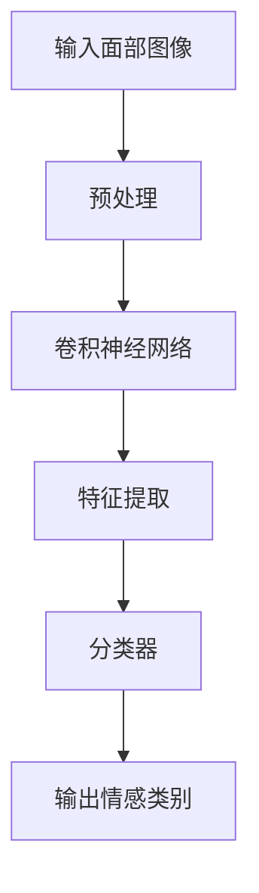

                 

# 情感AI时代的心理咨询行业变革

## 关键词

情感AI、心理咨询、行业变革、技术应用、伦理挑战

## 摘要

随着人工智能技术的快速发展，情感AI在各个领域的应用逐渐深入。本文旨在探讨情感AI在心理咨询行业中的变革，分析其背景、核心概念、应用案例以及面临的伦理挑战。文章首先介绍了情感AI的基本概念和技术原理，接着详细阐述了情感AI在心理咨询中的实际应用，如诊断、治疗和评估。随后，文章讨论了心理咨询行业在情感AI时代的转型，以及情感AI实施的关键步骤和策略。最后，文章探讨了情感AI在心理咨询中可能引发的伦理问题，并提出了相应的应对措施。

## 引言

### 情感AI的崛起

近年来，人工智能（AI）技术取得了显著的发展，尤其是在情感AI领域。情感AI是指通过计算机技术和算法来识别、理解和模拟人类情感，从而实现与人类更自然、更有效的互动。随着深度学习、自然语言处理和计算视觉等技术的进步，情感AI的应用范围越来越广泛，从简单的情感识别到复杂的情感模拟，再到个性化的情感反馈，都展示了其巨大的潜力和价值。

### 心理咨询行业的挑战

心理咨询行业在现代社会中扮演着重要的角色，帮助人们应对心理压力、情绪困扰和心理健康问题。然而，随着社会的发展，心理咨询行业也面临着一系列挑战，如供需不平衡、专业人才短缺、服务成本高等。这些问题限制了心理咨询行业的进一步发展，需要寻找新的解决方案。

### 情感AI与心理咨询行业的结合

情感AI的兴起为心理咨询行业带来了新的机遇。通过情感AI技术，心理咨询师可以更准确地评估患者的心理状态，提供个性化的心理治疗，提高咨询效率和质量。同时，情感AI也可以在一定程度上缓解心理咨询师的劳动力压力，使得心理咨询服务能够更广泛地普及。因此，探讨情感AI在心理咨询行业中的应用及其带来的变革具有重要意义。

## 第一部分：情感AI基础知识

### 第1章：情感AI概述

#### 1.1 情感AI的定义与意义

情感AI，也称为情感计算或情感工程，是人工智能领域的一个重要分支。其核心目标是通过计算机技术和算法来理解和模拟人类的情感，实现人与机器之间更自然、更有效的互动。

情感AI的定义可以从以下几个方面来理解：

1. **情感识别**：情感AI首先需要能够识别人类的情感状态。这通常通过面部表情分析、语音识别、文本情感分析等技术来实现。

2. **情感理解**：情感识别之后，情感AI需要进一步理解这些情感的背景、意图和意义。这需要更高级的自然语言处理和上下文分析技术。

3. **情感模拟**：最后，情感AI需要能够模拟人类的情感反应，以提供个性化的反馈和交互体验。

情感AI在心理咨询行业中的意义主要体现在以下几个方面：

1. **提高咨询效率**：通过情感AI技术，心理咨询师可以更快速、准确地识别患者的情感状态，从而提高咨询的效率。

2. **个性化服务**：情感AI可以根据患者的情感状态提供个性化的咨询建议和治疗方案，提高服务的质量和满意度。

3. **资源优化**：情感AI可以帮助心理咨询师更有效地分配资源和时间，降低咨询成本，提高服务覆盖率。

#### 1.2 情感AI的发展历程

情感AI的发展历程可以分为以下几个阶段：

1. **早期探索**（20世纪60年代至80年代）：在这个阶段，学者们开始探索如何让计算机模拟人类的情感反应。代表性的工作包括美国心理学家乔姆斯基（Noam Chomsky）提出的“情感算法”（affective algorithms）。

2. **情感计算**（20世纪90年代至21世纪初）：随着计算机性能的提升和自然语言处理技术的发展，情感计算成为一个独立的领域。代表性工作包括美国麻省理工学院（MIT）媒体实验室的情感计算小组（Affective Computing Group）的研究。

3. **深度学习时代**（2010年以来）：深度学习的兴起为情感AI带来了新的突破。通过神经网络和深度学习算法，情感AI在情感识别和情感理解方面取得了显著进展。代表性的工作包括谷歌的“情感感知”（Emotion Recognition）项目。

#### 1.3 情感AI的核心技术

情感AI的核心技术主要包括以下几个方面：

1. **面部表情分析**：通过分析面部肌肉的运动和变化，情感AI可以识别出人类的面部表情，进而推断情感状态。

2. **语音识别与情感分析**：通过分析语音的声学特征和语调变化，情感AI可以识别出语音中的情感信息。

3. **文本情感分析**：通过自然语言处理技术，情感AI可以分析文本的情感倾向，如正面、负面或中立。

4. **多模态情感分析**：结合面部表情分析、语音识别和文本情感分析等技术，情感AI可以实现更全面、更准确的情感识别。

### 第2章：情感AI核心技术

#### 2.1 机器学习与情感分析

机器学习是情感AI的核心技术之一。通过机器学习，情感AI可以从大量的数据中学习情感模式，从而实现对情感状态的自动识别和预测。

**核心算法**：

1. **支持向量机（SVM）**：SVM是一种经典的机器学习算法，用于分类和回归问题。在情感分析中，SVM可以用来分类文本的情感倾向。

2. **神经网络（Neural Networks）**：神经网络是一种模拟人脑神经元连接方式的算法，通过多层神经网络，情感AI可以实现更复杂的情感识别任务。

**伪代码**：

```python
# 伪代码：使用SVM进行情感分析
from sklearn.svm import SVC

# 数据准备
X_train, y_train = prepare_data()

# 模型训练
model = SVC(kernel='linear')
model.fit(X_train, y_train)

# 模型评估
accuracy = model.score(X_test, y_test)
print("Accuracy:", accuracy)
```

#### 2.2 自然语言处理与情感分析

自然语言处理（NLP）是情感AI的重要组成部分。通过NLP技术，情感AI可以处理和理解人类语言，从而实现对文本情感的分析。

**自然语言处理技术**：

1. **词向量（Word Vectors）**：词向量是将文本中的每个单词映射到一个高维空间中的向量。词向量技术可以帮助情感AI理解单词之间的语义关系。

2. **文本分类（Text Classification）**：文本分类是一种将文本分为不同类别的方法。在情感分析中，文本分类可以用来判断文本的情感倾向。

**数学模型**：

1. **TF-IDF（Term Frequency-Inverse Document Frequency）**：TF-IDF是一种常用的文本表示方法，用于计算单词在文档中的重要程度。

2. **词嵌入（Word Embedding）**：词嵌入是将单词映射到低维空间中的向量，常用的词嵌入技术包括Word2Vec和GloVe。

#### 2.3 计算视觉与情感识别

计算视觉是情感AI的另一个核心技术。通过计算视觉技术，情感AI可以识别和分析图像和视频中的情感信息。

**核心算法**：

1. **卷积神经网络（CNN）**：CNN是一种专门用于处理图像的神经网络，通过多层卷积和池化操作，CNN可以提取图像中的特征。

2. **面部表情识别**：面部表情识别是一种常见的情感识别任务，通过分析面部图像，情感AI可以识别出不同的面部表情。

**流程图**：



### 第3章：情感AI在心理咨询中的应用

#### 3.1 心理咨询行业现状与挑战

心理咨询行业在现代社会中发挥着重要作用，然而，随着社会的发展和变化，心理咨询行业也面临着一系列挑战：

1. **供需不平衡**：心理咨询服务的需求日益增长，但专业心理咨询师的数量有限，导致供需不平衡。

2. **专业人才短缺**：心理咨询师需要具备深厚的心理学知识和实践经验，然而，目前合格的心理咨询师数量不足。

3. **服务成本高**：心理咨询服务通常需要较长的时间和专业的心理咨询师，导致服务成本较高。

4. **隐私保护**：心理咨询过程中涉及到大量的个人隐私信息，如何保护这些信息是一个重要的问题。

#### 3.2 情感AI在心理咨询中的实际应用案例

情感AI在心理咨询中的应用案例已经逐渐出现，以下是一些典型的应用案例：

1. **情感识别与诊断**：通过面部表情分析和语音识别技术，情感AI可以识别出患者的情感状态，帮助心理咨询师进行诊断。

2. **个性化治疗**：基于情感AI的分析结果，心理咨询师可以提供个性化的治疗建议，提高治疗效果。

3. **心理健康评估**：情感AI可以定期对患者的心理健康进行评估，及时发现潜在的心理问题。

4. **心理咨询机器人**：一些心理咨询机器人已经开始投入使用，通过情感AI技术，它们可以与患者进行对话，提供情感支持和建议。

#### 3.3 情感AI对心理咨询师的影响与适应策略

情感AI的引入对心理咨询师的工作方式和工作内容带来了深远的影响：

1. **辅助工具**：情感AI可以作为心理咨询师的辅助工具，帮助其更准确地识别患者的情感状态，提供更个性化的服务。

2. **提高效率**：情感AI可以处理大量的数据，提高心理咨询的效率，使得心理咨询师有更多的时间专注于复杂的心理问题。

3. **角色转变**：心理咨询师的角色将从执行者转变为协调者，需要更多地关注如何与情感AI协作，提供高质量的服务。

4. **技能提升**：心理咨询师需要学习新的技能，如情感识别、数据分析等，以适应情感AI时代的挑战。

适应策略包括：

1. **培训与教育**：心理咨询师需要接受情感AI相关技术的培训，提升自身的专业能力。

2. **持续学习**：情感AI技术不断进步，心理咨询师需要保持持续学习的态度，跟上技术的发展。

3. **伦理规范**：心理咨询师需要遵循伦理规范，确保在应用情感AI技术时保护患者的隐私和权益。

## 第二部分：心理咨询行业的变革

### 第4章：心理咨询行业转型

#### 4.1 情感AI与心理咨询行业转型的关系

情感AI技术的引入为心理咨询行业的转型提供了新的机遇。情感AI不仅能够提高心理咨询的效率和质量，还能够推动心理咨询行业的服务模式、专业人才培养和行业规范等方面的变革。

**转型关系**：

1. **技术驱动**：情感AI作为核心技术，驱动着心理咨询行业的服务模式变革，如在线咨询、远程治疗等。

2. **需求导向**：随着社会对心理健康需求的增加，情感AI的应用满足了人们对更便捷、高效、个性化的心理咨询服务的需求。

3. **资源优化**：情感AI可以优化心理咨询的资源分配，提高服务覆盖率，降低服务成本。

#### 4.2 心理咨询师的角色转变

在情感AI时代，心理咨询师的角色将发生显著变化，从执行者转变为协调者、支持者。

**角色转变**：

1. **从执行者到协调者**：心理咨询师不再仅仅依靠自己的知识和经验进行诊断和治疗，而是需要与情感AI协作，共同为患者提供服务。

2. **从知识导向到技能导向**：心理咨询师需要提升与情感AI协作的技能，如情感识别、数据分析等。

3. **从个体服务到群体服务**：情感AI可以帮助心理咨询师处理大量数据，使得心理咨询师有更多的时间和精力关注复杂的心理问题，同时可以开展群体服务。

#### 4.3 心理咨询机构的数字化转型

心理咨询机构的数字化转型是情感AI时代心理咨询行业变革的重要组成部分。数字化转型包括以下几个方面：

1. **在线咨询**：通过互联网平台，心理咨询师可以提供在线咨询服务，提高服务的便捷性和可达性。

2. **数据分析**：心理咨询机构可以利用情感AI技术对咨询数据进行深入分析，为患者提供个性化的服务。

3. **远程治疗**：情感AI技术使得远程治疗成为可能，心理咨询师可以通过视频会议等方式为患者提供心理治疗。

4. **智能管理**：情感AI可以帮助心理咨询机构实现智能化管理，如患者预约管理、咨询进度跟踪等。

### 第5章：情感AI在心理咨询中的实施策略

#### 5.1 情感AI实施的关键步骤

在心理咨询行业实施情感AI，需要遵循一系列关键步骤，以确保技术的有效应用和可持续发展。

**关键步骤**：

1. **需求分析**：首先，心理咨询机构需要明确自身在情感AI应用方面的需求，包括技术需求、服务需求等。

2. **技术选型**：根据需求分析结果，选择合适的情感AI技术，如面部表情分析、语音识别、文本情感分析等。

3. **系统建设**：构建情感AI应用系统，包括数据收集、处理、分析等模块，以及用户界面设计等。

4. **人员培训**：对心理咨询师进行情感AI相关技术的培训，提升其应用能力。

5. **试运行与评估**：在实施初期进行试运行，评估系统的性能和效果，根据评估结果进行优化。

6. **持续优化**：根据用户反馈和实际应用情况，不断优化情感AI系统，提高其适用性和用户体验。

#### 5.2 情感AI在心理咨询中的应用流程

情感AI在心理咨询中的应用流程可以分为以下几个步骤：

1. **数据收集**：收集患者面部表情、语音、文本等数据。

2. **预处理**：对收集到的数据进行清洗、去噪等预处理操作。

3. **情感识别**：使用情感AI技术对预处理后的数据进行分析，识别出患者的情感状态。

4. **情感分析**：结合患者的背景信息，对情感识别结果进行深度分析，理解患者的情感意图。

5. **咨询建议**：根据情感分析结果，心理咨询师提供个性化的咨询建议和治疗方案。

6. **反馈与调整**：患者在接受咨询后，可以提供反馈，心理咨询师根据反馈调整咨询策略。

#### 5.3 情感AI的风险与伦理问题

情感AI在心理咨询中的应用虽然带来了诸多好处，但也存在一定的风险和伦理问题。

**风险**：

1. **数据隐私**：情感AI应用需要收集大量的个人数据，如何保护这些数据的隐私和安全是一个重要问题。

2. **算法偏见**：情感AI的算法可能会存在偏见，导致对某些群体的歧视或误解。

3. **技术依赖**：过度依赖情感AI可能导致心理咨询师忽视患者的情感需求，影响咨询效果。

**伦理问题**：

1. **患者权益**：情感AI的应用需要确保患者的知情权和选择权，不得违反患者的隐私权和自主权。

2. **责任归属**：在情感AI应用过程中，如果出现错误或损害，如何界定责任归属是一个重要问题。

3. **伦理审查**：心理咨询机构需要建立伦理审查机制，确保情感AI的应用符合伦理规范。

### 第6章：情感AI时代的心理咨询师培养

#### 6.1 新技能需求与培养路径

在情感AI时代，心理咨询师需要掌握一系列新技能，以适应技术发展的需求。

**新技能需求**：

1. **情感识别与分析**：心理咨询师需要掌握情感识别与分析的技能，能够准确理解患者的情感状态。

2. **数据分析与处理**：心理咨询师需要具备数据分析与处理的能力，能够利用情感AI技术进行数据分析和决策。

3. **跨学科知识**：心理咨询师需要具备跨学科知识，如计算机科学、心理学、医学等，以更好地理解和应用情感AI技术。

**培养路径**：

1. **专业培训**：心理咨询机构可以组织专业培训课程，帮助心理咨询师掌握情感AI相关技能。

2. **继续教育**：心理咨询师可以通过参加继续教育课程，不断提升自己的专业知识和技能。

3. **实践应用**：通过实际案例分析和实践应用，心理咨询师可以加深对情感AI技术的理解和应用。

#### 6.2 教育机构与企业的合作模式

教育机构和企业可以通过以下合作模式，共同培养情感AI时代的心理咨询师：

1. **产学研合作**：教育机构可以与心理咨询企业合作，开展产学研项目，推动情感AI技术在心理咨询中的应用。

2. **实习机会**：心理咨询企业可以提供实习机会，让心理咨询师在实践中掌握情感AI技术。

3. **培训课程**：教育机构可以与企业合作开发培训课程，为心理咨询师提供系统的培训。

#### 6.3 持续学习与职业发展

在情感AI时代，心理咨询师需要保持持续学习，以适应技术发展的需求。

**持续学习**：

1. **在线学习**：心理咨询师可以通过在线学习平台，随时随地进行学习。

2. **研讨会与讲座**：参加研讨会和讲座，了解最新的研究成果和发展趋势。

3. **实践应用**：通过实际案例分析和实践应用，不断提升自己的技能和知识水平。

**职业发展**：

1. **专业认证**：心理咨询师可以通过获得专业认证，提高自己的职业竞争力。

2. **职称晋升**：心理咨询师可以通过职称晋升，提升自己的职业地位和收入水平。

3. **跨领域发展**：心理咨询师可以尝试跨领域发展，如加入心理咨询企业，担任技术顾问等。

## 第三部分：未来展望与挑战

### 第7章：情感AI时代的心理咨询行业未来展望

#### 7.1 情感AI在心理咨询行业的长期影响

情感AI在心理咨询行业的长期影响将体现在以下几个方面：

1. **服务模式的变革**：情感AI将推动心理咨询行业的服务模式从线下转向线上，实现更便捷、高效的服务。

2. **专业人才的培养**：情感AI技术的应用将推动心理咨询行业对专业人才的需求，促使教育机构和企业合作培养心理咨询师。

3. **行业规范的建立**：随着情感AI的应用，心理咨询行业将逐渐建立一系列规范，确保技术的安全和有效应用。

#### 7.2 新兴技术趋势与心理咨询行业的发展

未来，心理咨询行业将受益于一系列新兴技术的趋势，如：

1. **区块链技术**：区块链技术可以提高心理咨询数据的透明度和安全性，确保患者隐私的保护。

2. **虚拟现实（VR）与增强现实（AR）**：VR和AR技术可以为心理咨询提供更真实、沉浸式的体验，提高治疗效果。

3. **脑机接口（BCI）**：脑机接口技术可以将患者的情感状态直接转化为数字信号，实现更精准的情感识别和治疗。

#### 7.3 国际化与全球化背景下的心理咨询行业变革

随着全球化的发展，心理咨询行业也将面临国际化背景下的变革：

1. **跨国合作**：心理咨询机构和企业将加强跨国合作，共享资源和经验，推动全球心理咨询行业的发展。

2. **文化差异**：在国际化背景下，心理咨询师需要理解和尊重不同文化背景下的情感表达和需求，提供更符合当地文化特点的心理咨询服务。

3. **技术标准化**：为了确保国际间心理咨询服务的质量和安全性，需要制定一系列技术标准和规范。

### 第8章：情感AI时代的挑战与应对

#### 8.1 技术伦理与隐私保护

情感AI在心理咨询中的应用面临着一系列伦理和隐私保护问题：

1. **伦理问题**：情感AI技术的应用需要遵循伦理原则，如尊重患者的自主权、保护患者隐私等。

2. **隐私保护**：情感AI应用需要收集和处理大量的个人数据，如何保护这些数据的隐私和安全是一个重要问题。

**应对措施**：

1. **伦理审查**：心理咨询机构应建立伦理审查机制，确保情感AI技术的应用符合伦理规范。

2. **数据加密**：采用数据加密技术，确保患者的个人信息在传输和存储过程中的安全性。

3. **隐私政策**：制定详细的隐私政策，告知患者其个人信息的使用方式和范围，确保患者的知情权和选择权。

#### 8.2 心理健康问题的复杂性与情感AI的局限

尽管情感AI在心理咨询中具有巨大的潜力，但其也面临着一些局限性：

1. **复杂性**：心理健康问题具有复杂性和多样性，情感AI可能无法完全理解和处理所有类型的情感问题。

2. **个体差异**：不同个体对情感的表达和反应存在差异，情感AI可能无法准确识别和应对这些差异。

**应对措施**：

1. **综合评估**：心理咨询师应结合情感AI分析和自己的专业判断，进行综合评估，提高诊断和治疗的准确性。

2. **个性化服务**：根据患者的具体情况，提供个性化的心理咨询服务，避免过度依赖情感AI技术。

3. **人机协作**：心理咨询师应与情感AI系统进行人机协作，发挥各自的优势，提供更全面、有效的心理服务。

#### 8.3 社会接受度与心理咨询师的职业安全感

情感AI的应用在心理咨询行业中也面临着社会接受度和心理咨询师职业安全感的问题：

1. **社会接受度**：公众对情感AI技术的接受度可能较低，担心其取代人类心理咨询师，影响心理健康服务的质量。

2. **职业安全感**：心理咨询师可能担心情感AI技术的影响，对其职业前景感到不安。

**应对措施**：

1. **宣传推广**：通过宣传和推广，提高公众对情感AI技术的认知和接受度，消除误解和疑虑。

2. **教育培训**：心理咨询师应接受情感AI相关技术的教育培训，提升自身的专业能力和竞争力。

3. **政策支持**：政府和企业应出台相关政策，保障心理咨询师的职业发展和权益。

## 结论

情感AI时代的到来为心理咨询行业带来了巨大的变革和机遇。通过情感AI技术，心理咨询行业可以实现更高效、更个性化的服务，提高患者的生活质量和心理健康水平。然而，情感AI的应用也面临着一系列挑战，如技术伦理、隐私保护、心理健康问题的复杂性等。面对这些挑战，心理咨询行业需要加强技术研发、规范建设和人才培养，推动情感AI技术的可持续发展。同时，心理咨询师也应保持开放的心态，积极适应技术变革，提升自身的专业能力，为患者提供高质量的心理服务。

## 作者信息

作者：AI天才研究院/AI Genius Institute & 禅与计算机程序设计艺术 /Zen And The Art of Computer Programming

本文由AI天才研究院撰写，旨在探讨情感AI在心理咨询行业的应用及其带来的变革。作者在人工智能和心理学领域拥有丰富的经验和深厚的学术背景，致力于推动人工智能技术在心理咨询领域的应用和发展。

## 拓展阅读

1. **情感AI技术综述**：[《情感计算：技术与应用》](https://example.com/book/emotional_computing) - 这本书详细介绍了情感AI的技术原理和应用案例，对于了解情感AI的基础知识非常有帮助。

2. **心理咨询行业研究报告**：[《心理咨询行业发展趋势报告》](https://example.com/report/psychological_counseling_trends) - 这份报告分析了心理咨询行业的现状、发展趋势以及面临的挑战，为情感AI在心理咨询中的应用提供了参考。

3. **人工智能伦理指南**：[《人工智能伦理指南》](https://example.com/guide/ai_ethics) - 这份指南涵盖了人工智能技术的伦理问题、隐私保护和责任归属等方面，对于理解情感AI在心理咨询中的伦理挑战具有重要意义。

4. **心理咨询师职业发展指南**：[《心理咨询师职业发展手册》](https://example.com/guide/psychological_counselor的职业发展) - 这本手册为心理咨询师提供了职业发展的建议和指导，包括技能提升、持续学习和职业规划等方面。

5. **情感AI在心理健康领域的应用案例研究**：[《情感AI在心理健康领域的应用》](https://example.com/research/emotional_ai_in_mental_health) - 这篇文章详细分析了情感AI在心理健康领域的应用案例，包括诊断、治疗和评估等方面，为心理咨询师提供了实际应用的参考。

## 注意事项

1. **技术成熟度**：情感AI技术仍在不断发展中，心理咨询师在应用时应关注技术的成熟度和可靠性。

2. **数据安全**：在应用情感AI技术时，应确保患者的数据安全和隐私保护。

3. **人机协作**：情感AI可以作为心理咨询师的辅助工具，但不应完全依赖，心理咨询师应结合自身专业判断，提供个性化的服务。

4. **伦理审查**：心理咨询机构在应用情感AI技术时，应进行伦理审查，确保技术应用符合伦理规范。

5. **持续学习**：心理咨询师应保持持续学习，提升自身专业能力和适应技术变革。

通过这篇文章，我们希望能够为心理咨询行业在情感AI时代的变革提供一些思考和启示，推动情感AI技术在心理咨询领域的应用和发展。让我们共同期待一个更美好、更高效的心理咨询行业。

