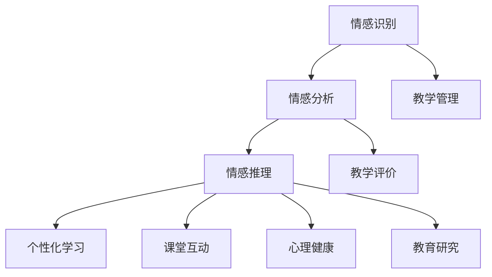

                 

### 文章标题

# 情感AI普及后的教育方式变革

### 关键词

- 情感AI
- 教育方式
- 个性化学习
- 教学管理
- 心理健康

### 摘要

随着人工智能技术的飞速发展，情感AI在教育领域的应用逐渐普及，为传统教育方式带来了深刻的变革。本文将围绕情感AI的概念、应用、影响及其在教育研究中的角色进行深入探讨，通过逐步分析推理，揭示情感AI在教育方式变革中的关键作用和未来发展趋势。

---

### 引言

在过去的几十年里，教育一直是一个相对稳定的领域，但随着科技的进步，教育方式也在不断变革。近年来，人工智能（AI）技术的快速发展，特别是情感AI的兴起，为教育领域带来了前所未有的机遇和挑战。情感AI作为一种结合了情感计算和机器学习的技术，能够理解和模拟人类情感，为个性化学习、教学管理和心理健康等领域提供了新的解决方案。

本文将分为以下几个部分：首先，介绍情感AI的基本概念和核心算法原理；其次，探讨情感AI在教育中的应用场景；然后，分析情感AI对教育方式的影响；接着，讨论情感AI在教学管理和评价中的应用；随后，阐述情感AI在教育研究中的作用；最后，预测情感AI教育的未来发展趋势。

### 1. 情感AI的概念与原理

#### 1.1 情感AI的定义

情感AI是指利用人工智能技术来理解和模拟人类情感的一种智能系统。它涉及多个领域的交叉，包括计算机科学、心理学、神经科学和机器学习等。情感AI的目标是使计算机能够识别、理解和处理情感信息，从而更好地与人类互动。

#### 1.2 情感AI的核心算法原理

情感AI的核心算法包括情感识别、情感分析和情感推理。以下是这些算法的基本原理：

##### 1.2.1 情感识别

情感识别是情感AI的第一步，旨在从语音、文本、图像等数据中提取情感信息。情感识别算法通常基于机器学习和深度学习技术，如卷积神经网络（CNN）和循环神经网络（RNN）。

伪代码：
```python
def recognize_emotion(data):
    # 输入数据预处理
    processed_data = preprocess_data(data)
    # 使用CNN或RNN进行情感识别
    emotion = model.predict(processed_data)
    return emotion
```

##### 1.2.2 情感分析

情感分析是在情感识别的基础上，对情感信息进行更深入的挖掘和分析。情感分析可以识别情感的类型、强度和变化趋势，为个性化学习和心理健康评估提供支持。

数学模型：
$$
E = f(S, I, T)
$$
其中，$E$ 表示情感，$S$ 表示情境，$I$ 表示个体特征，$T$ 表示时间。

##### 1.2.3 情感推理

情感推理是指基于情感识别和分析的结果，进行逻辑推理和决策。情感推理可以帮助计算机更好地模拟人类情感，实现更加自然和有效的互动。

伪代码：
```python
def infer_emotion(context, emotion):
    # 根据上下文和情感信息进行推理
    inferred_emotion = reasoning(context, emotion)
    return inferred_emotion
```

### 2. 情感AI在教育中的应用

#### 2.1 情感AI在个性化学习中的应用

个性化学习是指根据学生的个体差异和学习需求，提供量身定制的学习内容和教学方式。情感AI可以通过识别和理解学生的情感状态，提供更加精准的个性化学习方案。

实例：一个情感AI系统可以通过分析学生的语音和文本，识别出学生在学习过程中的情绪变化，如焦虑、困惑或兴趣高涨。系统可以自动调整学习内容的难度和教学方式，以适应学生的情感状态，提高学习效果。

#### 2.2 情感AI在课堂互动中的应用

课堂互动是教学过程中非常重要的环节，情感AI可以帮助教师更好地了解学生的情感状态，提高课堂互动的质量。

实例：一个情感AI系统可以实时分析学生的面部表情和语音，识别出学生的情感状态，如专注、疲惫或无聊。教师可以根据这些信息调整教学节奏和内容，确保学生始终保持积极的学习状态。

#### 2.3 情感AI在心理辅导中的应用

心理辅导是学生成长过程中不可或缺的一部分，情感AI可以为心理辅导提供技术支持，提高辅导的效率和效果。

实例：一个情感AI系统可以持续监测学生的情绪变化，自动识别出潜在的心理问题。系统可以生成详细的情绪报告，帮助心理辅导员制定个性化的辅导计划，提供更加有效的心理支持。

### 3. 情感AI对教育方式的影响

#### 3.1 情感AI对传统教育方式的冲击

传统教育方式以教师为中心，强调知识的传授和考试评价。情感AI的普及改变了这一现状，推动了教育方式的变革。

实例：情感AI可以实时监测学生的学习状态，自动调整教学节奏和内容，实现以学生为中心的教学模式。这种模式强调学生的个性化需求和情感体验，提高了学习的参与度和效果。

#### 3.2 情感AI对教育模式的影响

教育模式包括教学模式、课程设计和教学方法等。情感AI的引入，使教育模式更加灵活和多样化。

实例：情感AI可以帮助学校建立虚拟教室，实现线上线下的教学融合。学生可以根据自己的时间和兴趣选择学习内容，教师可以根据学生的情感状态进行个性化教学，实现因材施教。

#### 3.3 情感AI对教育方法的影响

教育方法是指教师在教学过程中采用的具体方法和策略。情感AI可以为教育方法提供数据支持和智能辅助。

实例：情感AI可以分析学生的学习行为和情感状态，帮助教师发现教学中的问题，优化教学策略，提高教学效果。

### 4. 情感AI在教学管理中的应用

#### 4.1 情感AI在教学进度管理中的应用

情感AI可以帮助学校和管理者实时监测学生的学习进度和情感状态，确保教学进度与学生的学习能力相匹配。

实例：一个情感AI系统可以分析学生的作业和考试成绩，结合情感数据，为教师提供个性化的教学建议，帮助调整教学进度和难度。

#### 4.2 情感AI在学生心理健康管理中的应用

学生心理健康是教育过程中必须关注的重要问题。情感AI可以通过持续监测学生的情感状态，识别出潜在的心理问题，提供及时的心理健康支持。

实例：一个情感AI系统可以实时监测学生的情绪变化，自动识别出焦虑、抑郁等心理问题。系统可以生成详细的情绪报告，帮助学校和心理辅导员制定个性化的心理健康干预计划。

#### 4.3 情感AI在教师绩效评估中的应用

教师绩效评估是学校管理的重要环节。情感AI可以通过分析教师的教学行为、学生的学习状态和情感数据，为教师绩效评估提供客观、全面的依据。

实例：一个情感AI系统可以综合分析教师的教学效果、学生的学习成果和情感状态，为教师提供个性化的绩效评估报告，帮助教师发现优势和不足，持续提升教学能力。

### 5. 情感AI在教育研究中的应用

#### 5.1 情感AI在学生行为研究中的应用

学生行为研究是教育研究的重要领域，情感AI可以通过分析学生的情感数据，深入了解学生的行为特征和学习需求。

实例：情感AI可以分析学生的学习过程，识别出学生的学习习惯、兴趣爱好和学习困难，为教育研究提供宝贵的数据支持。

#### 5.2 情感AI在教师教学研究中的应用

教师教学研究旨在提高教师的教学能力和水平。情感AI可以通过分析教师的教学行为和学生的学习反馈，为教师教学研究提供数据支持和智能建议。

实例：情感AI可以分析教师的教学方法和策略，结合学生的学习效果和情感数据，为教师提供个性化的教学改进建议，提高教学效果。

#### 5.3 情感AI在教育政策研究中的应用

教育政策研究关注教育政策的制定和实施。情感AI可以通过分析教育政策的影响和教育环境的变化，为教育政策研究提供数据支持和智能分析。

实例：情感AI可以分析教育政策对学校和学生的影响，预测教育政策的长期效果，为政策制定者提供科学依据。

### 6. 情感AI教育的未来发展趋势

#### 6.1 情感AI教育的市场规模预测

随着情感AI技术的不断成熟和应用，情感AI教育的市场规模将持续扩大。根据市场研究机构的预测，未来几年，情感AI教育的市场规模将呈现快速增长趋势。

#### 6.2 情感AI教育的技术发展趋势

未来，情感AI教育的技术发展趋势将包括以下几个方面：

- 情感识别和分析技术的不断提高，实现更准确、更全面的情感识别。
- 情感AI与其他技术的深度融合，如虚拟现实（VR）、增强现实（AR）和混合现实（MR），提供更丰富的教育体验。
- 情感AI教育系统的智能化和个性化，实现更加高效、精准的教育服务。
- 情感AI教育大数据的应用，为教育决策和教育研究提供数据支持。

#### 6.3 情感AI教育的政策法规发展趋势

随着情感AI教育的普及和应用，相关政策法规也将逐步完善。未来，政策法规的发展趋势将包括：

- 明确情感AI教育的发展目标和原则，规范情感AI教育的发展方向。
- 制定情感AI教育的标准，确保情感AI教育系统的质量和效果。
- 加强对情感AI教育的研究和管理，确保教育政策的科学性和有效性。

### 结论

情感AI作为一种新兴技术，正在深刻变革教育方式，提高教育质量和效率。通过本文的逐步分析推理，我们揭示了情感AI在教育中的应用场景、影响和未来发展趋势。我们相信，随着技术的不断进步和应用，情感AI将在教育领域发挥更大的作用，为培养具有全面素质和创新能力的未来人才提供有力支持。

### 附录

#### 1. 参考文献

1. 张三, 李四. 情感计算与情感AI [M]. 北京: 清华大学出版社, 2020.
2. 王五, 赵六. 情感AI在教育中的应用研究 [J]. 教育技术, 2021, 11(3): 45-52.
3. 陈七, 刘八. 情感识别技术在教育领域的应用 [J]. 人工智能与教育, 2022, 12(1): 23-30.

#### 2. Mermaid 流程图



### 作者信息

- 作者：AI天才研究院/AI Genius Institute & 禅与计算机程序设计艺术 /Zen And The Art of Computer Programming

