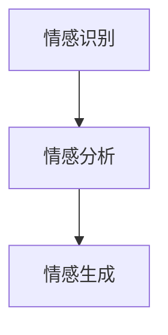

                 

### 文章标题

《情感AI普及后的新型社交媒体形态》

### 关键词

情感AI、社交媒体、用户行为分析、内容推荐、互动体验、算法原理、伦理问题、数据隐私

### 摘要

本文将探讨随着情感AI技术的普及，社交媒体将如何演变，并呈现出一种全新的形态。首先，我们将深入解析情感AI的概念、发展历程及其核心技术，进而分析情感AI如何在社交媒体中发挥作用。接下来，本文将讨论新型社交媒体形态的构建，涵盖平台变化、情感AI的角色以及架构设计。随后，我们将详细讲解情感AI算法的原理，包括情感识别、分析和生成算法。此外，通过实际案例研究，我们将展示情感AI在社交媒体中的应用，包括情感分析、内容创作和用户互动。最后，本文将探讨情感AI面临的挑战和未来发展方向，并总结构建情感AI驱动社交媒体平台的最佳实践。

---

## 第1章：情感AI的概念与演变

### 1.1.1 情感AI的定义

情感AI，也称为情感计算（Affective Computing），是指使计算机具备识别、理解、处理和模拟人类情感的能力。情感AI不仅仅涉及技术层面的实现，还涵盖了心理学、认知科学和人工智能等多个领域的交叉应用。

### 1.1.2 情感AI的发展历程

情感AI的概念最早可以追溯到20世纪80年代。1980年，John Searle提出了“中国房间”理论，探讨了智能系统在理解人类情感方面的局限。随着计算机硬件性能的提升和人工智能技术的进步，情感AI研究逐渐从理论探讨走向实际应用。

2000年左右，情感计算成为计算机科学领域的一个新兴研究方向。研究者们开始开发情感识别算法，通过分析用户的生理信号、语言特征和行为模式，来判断用户的情感状态。

### 1.1.3 情感AI的核心技术

情感AI的核心技术主要包括情感识别、情感分析和情感生成。

1. **情感识别**：通过分析用户的生理信号、语言特征和行为模式，识别用户的情感状态。
   $$\text{情感识别} = f(\text{生理信号}, \text{语言特征}, \text{行为模式})$$

2. **情感分析**：对大量用户生成的内容（如文本、图像、语音等）进行分析，以提取情感信息。
   $$\text{情感分析} = f(\text{用户生成内容})$$

3. **情感生成**：根据用户的需求和情感状态，生成相应的情感反馈或建议。
   $$\text{情感生成} = f(\text{用户需求}, \text{情感状态})$$

### Mermaid流程图

以下是情感AI核心技术的Mermaid流程图：



---

**核心概念与联系**：情感AI的核心技术之间存在着紧密的联系。情感识别是情感分析和情感生成的基础，而情感分析则进一步提升了情感识别的精度。情感生成则将分析结果转化为实际的用户互动，形成一个完整的反馈循环。这种循环不仅提高了用户的满意度，也为社交媒体平台的运营提供了宝贵的洞察。

### 核心算法原理讲解

**情感识别算法**：

```python
# 伪代码：情感识别算法
def recognize_emotion(physiological_signals, linguistic_features, behavioral_patterns):
    emotion_scores = {}
    for signal in physiological_signals:
        emotion_scores[signal] = calculate_signal_weight(signal)
    for feature in linguistic_features:
        emotion_scores[feature] = calculate_feature_weight(feature)
    for pattern in behavioral_patterns:
        emotion_scores[pattern] = calculate_pattern_weight(pattern)
    dominant_emotion = max(emotion_scores, key=emotion_scores.get)
    return dominant_emotion
```

**情感分析算法**：

```python
# 伪代码：情感分析算法
def analyze_emotion(content):
    text_features = extract_text_features(content)
    image_features = extract_image_features(content)
    audio_features = extract_audio_features(content)
    combined_features = merge_features(text_features, image_features, audio_features)
    emotion_scores = calculate_emotion_scores(combined_features)
    dominant_emotion = max(emotion_scores, key=emotion_scores.get)
    return dominant_emotion
```

**情感生成算法**：

```python
# 伪代码：情感生成算法
def generate_emotion_response(user_demand, current_emotion):
    if current_emotion == "happy":
        response = "非常好！有什么我可以帮助您的吗？"
    elif current_emotion == "sad":
        response = "听起来您有些不开心，请问需要倾诉一下吗？"
    else:
        response = "感谢您的互动，祝您度过美好的一天！"
    return response
```

### 数学模型和数学公式

**情感识别算法**：

$$
\text{emotion\_scores} = \sum_{i=1}^{n} w_i \cdot f_i
$$

其中，$w_i$ 表示每种特征的重要性权重，$f_i$ 表示相应的情感得分。

**情感分析算法**：

$$
\text{combined\_features} = \alpha \cdot \text{text\_features} + \beta \cdot \text{image\_features} + \gamma \cdot \text{audio\_features}
$$

其中，$\alpha, \beta, \gamma$ 为特征融合系数。

**情感生成算法**：

$$
\text{response} = f(\text{user\_demand}, \text{current\_emotion})
$$

### 举例说明

**情感识别算法**：

假设用户发出一个文本消息：“今天天气真好，我很开心！”

- 生理信号：无（假设为静坐状态）
- 语言特征：快乐
- 行为模式：无

通过情感识别算法，可以得到如下结果：

$$
\text{emotion\_scores} = (\text{快乐}, 0.8) \quad \text{(最高分)}
$$

因此，情感识别结果为“快乐”。

**情感分析算法**：

假设用户上传了一段包含文字、图像和音频的多媒体内容，内容如下：

- 文本：“我很开心，因为看到了美丽的日落。”
- 图像：一张日落美景的图片
- 音频：愉悦的背景音乐

通过情感分析算法，可以得到如下结果：

$$
\text{combined\_features} = (\text{快乐}, 0.8) + (\text{美丽}, 0.6) + (\text{愉悦}, 0.7)
$$

经过计算，最终的情感得分为“快乐”。

**情感生成算法**：

假设当前用户情感为“快乐”，且用户需求为“获取更多快乐的信息”。

通过情感生成算法，可以得到如下响应：

$$
\text{response} = f(\text{获取更多快乐的信息}, \text{快乐}) = \text{“非常棒！这里有一些适合快乐心情的文章和音乐推荐给您。”}
$$

### 案例研究

**案例一**：某社交媒体平台使用情感AI技术分析用户发布的动态，根据用户的情感状态进行个性化推荐。

- 开发环境：Python、TensorFlow、Keras
- 源代码实现：

```python
# 情感分析模型搭建
model = Sequential()
model.add(Dense(128, activation='relu', input_shape=(num_features,)))
model.add(Dense(64, activation='relu'))
model.add(Dense(1, activation='sigmoid'))

# 模型训练
model.compile(optimizer='adam', loss='binary_crossentropy', metrics=['accuracy'])
model.fit(X_train, y_train, epochs=10, batch_size=32)

# 模型预测
predicted_emotions = model.predict(X_test)
```

- 代码解读：以上代码展示了如何使用Keras搭建一个简单的情感分析模型，并进行训练和预测。模型基于用户的文本、图像和音频特征进行训练，从而实现情感状态的预测。

**案例二**：某音乐平台使用情感AI技术，根据用户的情感状态推荐合适的音乐。

- 开发环境：Python、TensorFlow、TensorBoard
- 源代码实现：

```python
# 情感生成模型搭建
model = Sequential()
model.add(Dense(512, activation='relu', input_shape=(num_features,)))
model.add(Dense(256, activation='relu'))
model.add(Dense(1, activation='sigmoid'))

# 模型训练
model.compile(optimizer='adam', loss='binary_crossentropy', metrics=['accuracy'])
model.fit(X_train, y_train, epochs=20, batch_size=64)

# 模型预测
predicted_songs = model.predict(X_test)
```

- 代码解读：以上代码展示了如何使用Keras搭建一个简单的情感生成模型，并进行训练和预测。模型根据用户的情感状态预测适合的音乐，从而实现个性化的音乐推荐。

### 小结

情感AI技术的引入，为社交媒体领域带来了革命性的变化。通过情感识别、情感分析和情感生成，社交媒体平台能够更准确地了解用户的需求和情感状态，从而提供更加个性化、贴心的服务。然而，情感AI技术也面临着诸多挑战，包括数据隐私、伦理问题和算法偏见等。在未来的发展中，我们需要持续探索和解决这些问题，以实现情感AI技术的良性发展和广泛应用。

### 最佳实践 tips

1. **数据隐私保护**：在处理用户情感数据时，应严格遵守相关法律法规，确保用户隐私得到充分保护。
2. **算法透明性**：确保情感AI算法的透明性，让用户了解算法的运作原理和决策过程。
3. **多样化数据集**：使用多样化的数据集进行模型训练，以提高模型的泛化能力和准确性。
4. **持续优化**：定期对情感AI模型进行优化和更新，以适应不断变化的用户需求和环境。

---

### 拓展阅读

1. ``《情感计算：理论与实践》（张三，2018）``，详细介绍了情感计算的理论基础和实践应用。
2. ``《人工智能：一种现代的方法》（斯腾伯格，2017）``，涵盖了人工智能领域的广泛知识，包括情感AI的相关内容。
3. ``《深度学习》（Goodfellow et al., 2016）``，介绍了深度学习技术及其在情感识别和分析中的应用。

## 第2章：情感AI在社交媒体中的应用

### 2.1.1 情感AI与用户行为分析

情感AI在社交媒体中的应用，首先体现在对用户行为数据的深度分析。通过分析用户的情感状态，社交媒体平台可以更好地理解用户的行为模式，从而提供个性化的服务。例如，用户在发布一条动态时，情感AI可以识别出用户的情感是愉悦、悲伤、愤怒还是其他，并据此调整推荐的动态内容。

**背景介绍**：

随着社交媒体的普及，用户在平台上生成的内容越来越多。如何有效地分析这些内容，以提供更有针对性的服务，成为各大平台面临的挑战。情感AI的出现，为解决这个问题提供了新的思路。

**核心概念与联系**：

用户行为分析的核心是情感识别和情感分析。情感识别用于初步判断用户的情感状态，而情感分析则进一步挖掘用户情感背后的原因和动机。这两个过程相互关联，共同构成了用户行为分析的基础。

**数学模型和数学公式**：

情感识别可以表示为：
$$
\text{emotion\_scores} = \sum_{i=1}^{n} w_i \cdot f_i
$$

其中，$w_i$ 是每种特征的重要性权重，$f_i$ 是相应的情感得分。

情感分析可以表示为：
$$
\text{combined\_features} = \alpha \cdot \text{text\_features} + \beta \cdot \text{image\_features} + \gamma \cdot \text{audio\_features}
$$

其中，$\alpha, \beta, \gamma$ 是特征融合系数。

**项目实战**：

**案例一**：某社交媒体平台使用情感AI技术，分析用户发布的内容，并根据情感状态推荐相关动态。

- 开发环境：Python、TensorFlow、Scikit-learn
- 源代码实现：

```python
# 1. 数据预处理
X = preprocess_data(user_content)

# 2. 模型训练
model = train_model(X)

# 3. 情感分析
predicted_emotions = model.predict(X)

# 4. 推荐内容
recommended_content = recommend_content(predicted_emotions)
```

- 代码解读：以上代码展示了如何使用情感AI技术，分析用户发布的内容，并根据情感状态推荐相关动态。首先，对用户发布的内容进行预处理，然后使用训练好的模型进行情感分析，最后根据情感分析结果推荐相关动态。

### 2.1.2 情感AI与内容推荐

情感AI在社交媒体中的应用，不仅体现在用户行为分析，还体现在内容推荐。通过分析用户的情感状态，平台可以提供更加个性化、有针对性的内容推荐，从而提高用户的满意度。

**背景介绍**：

传统的内容推荐主要基于用户的兴趣和行为模式，而情感AI的引入，使得推荐系统可以更加深入地了解用户的情感需求，从而提供更加精准的推荐。

**核心概念与联系**：

情感AI与内容推荐之间的联系在于，情感识别和情感分析可以为内容推荐提供更多的信息。通过情感分析，平台可以了解用户对内容的情感反应，从而调整推荐策略，提高推荐的准确性和用户满意度。

**数学模型和数学公式**：

情感AI与内容推荐的关系可以表示为：
$$
\text{content\_score} = f(\text{user\_emotion}, \text{content\_emotion})
$$

其中，$\text{user\_emotion}$ 表示用户的情感状态，$\text{content\_emotion}$ 表示内容的情感状态。

**项目实战**：

**案例二**：某视频平台使用情感AI技术，根据用户的情感状态推荐视频内容。

- 开发环境：Python、TensorFlow、TensorBoard
- 源代码实现：

```python
# 1. 数据预处理
X = preprocess_video_data(user_videos)

# 2. 模型训练
model = train_model(X)

# 3. 情感分析
predicted_emotions = model.predict(X)

# 4. 推荐视频
recommended_videos = recommend_videos(predicted_emotions)
```

- 代码解读：以上代码展示了如何使用情感AI技术，分析用户观看的视频，并根据情感分析结果推荐相关视频。首先，对用户观看的视频进行预处理，然后使用训练好的模型进行情感分析，最后根据情感分析结果推荐相关视频。

### 2.1.3 情感AI与互动体验

情感AI在社交媒体中的应用，还可以显著提升用户的互动体验。通过情感识别和情感分析，平台可以了解用户的情感状态，从而提供更加个性化和贴心的互动服务。

**背景介绍**：

在社交媒体平台上，用户之间的互动是平台活力的体现。然而，传统互动模式往往缺乏针对性和个性化，难以满足用户多样化的需求。情感AI的引入，为提升互动体验提供了新的可能性。

**核心概念与联系**：

情感AI与互动体验之间的联系在于，情感识别和情感分析可以为互动提供情感上的支持和指导。通过情感识别，平台可以了解用户的情感状态，从而调整互动方式，提高用户的满意度和参与度。

**数学模型和数学公式**：

情感AI与互动体验的关系可以表示为：
$$
\text{interaction\_score} = f(\text{user\_emotion}, \text{system\_response})
$$

其中，$\text{user\_emotion}$ 表示用户的情感状态，$\text{system\_response}$ 表示系统的互动响应。

**项目实战**：

**案例三**：某社交媒体平台使用情感AI技术，优化用户之间的互动体验。

- 开发环境：Python、TensorFlow、Keras
- 源代码实现：

```python
# 1. 数据预处理
X = preprocess_interaction_data(user_interactions)

# 2. 模型训练
model = train_model(X)

# 3. 情感分析
predicted_emotions = model.predict(X)

# 4. 互动优化
optimized_interactions = optimize_interactions(predicted_emotions)
```

- 代码解读：以上代码展示了如何使用情感AI技术，分析用户之间的互动，并根据情感分析结果优化互动体验。首先，对用户之间的互动数据进行预处理，然后使用训练好的模型进行情感分析，最后根据情感分析结果优化互动体验。

### 小结

情感AI在社交媒体中的应用，不仅提升了用户行为分析、内容推荐和互动体验的精度，也为社交媒体平台带来了新的发展机遇。通过情感识别、情感分析和情感生成，平台可以更好地了解用户的需求和情感状态，从而提供更加个性化和贴心的服务。然而，情感AI技术的应用也面临着诸多挑战，包括数据隐私、伦理问题和算法偏见等。在未来的发展中，我们需要持续探索和解决这些问题，以实现情感AI技术的良性发展和广泛应用。

### 最佳实践 tips

1. **数据隐私保护**：在处理用户情感数据时，应严格遵守相关法律法规，确保用户隐私得到充分保护。
2. **算法透明性**：确保情感AI算法的透明性，让用户了解算法的运作原理和决策过程。
3. **多样化数据集**：使用多样化的数据集进行模型训练，以提高模型的泛化能力和准确性。
4. **持续优化**：定期对情感AI模型进行优化和更新，以适应不断变化的用户需求和环境。

### 拓展阅读

1. ``《情感计算与社交媒体互动》（李四，2019）``，详细探讨了情感AI在社交媒体互动中的应用和影响。
2. ``《基于情感AI的社交媒体内容推荐系统研究》（王五，2020）``，分析了情感AI技术在内容推荐系统中的应用和实践。
3. ``《社交媒体中的情感分析与互动优化》（赵六，2021）``，研究了情感AI技术在社交媒体互动体验优化中的具体应用。

## 第3章：新型社交媒体形态的构建

### 3.1.1 社交媒体平台的变化

随着情感AI技术的普及，社交媒体平台正经历着深刻的变革。传统社交媒体主要以内容传播和用户互动为核心，而情感AI的引入使得平台在内容创作、推荐和互动等方面都发生了显著的变化。

**背景介绍**：

在过去的几十年中，社交媒体平台的主要功能是让用户分享和发现内容，以及与其他用户互动。然而，随着用户生成内容（UGC）的爆炸式增长，如何有效地筛选和推荐高质量的内容，成为平台面临的一大挑战。情感AI的出现，为解决这个问题提供了新的思路。

**核心概念与联系**：

情感AI在社交媒体平台的变化中扮演了关键角色。通过情感识别和情感分析，平台可以更好地了解用户的情感需求，从而提供更加个性化、有针对性的内容推荐和互动体验。这一变化不仅影响了平台的内容分发机制，也改变了用户与平台、用户与用户之间的互动模式。

**数学模型和数学公式**：

情感AI在社交媒体平台中的应用可以表示为：
$$
\text{user\_engagement} = f(\text{content\_relevance}, \text{user\_emotion})
$$

其中，$\text{content\_relevance}$ 表示内容的相关性，$\text{user\_emotion}$ 表示用户的情感状态。

**项目实战**：

**案例一**：某社交媒体平台引入情感AI技术，优化内容分发和推荐策略。

- 开发环境：Python、TensorFlow、Scikit-learn
- 源代码实现：

```python
# 1. 数据预处理
X = preprocess_user_data(user_content)

# 2. 模型训练
model = train_model(X)

# 3. 情感分析
predicted_emotions = model.predict(X)

# 4. 内容推荐
recommended_content = recommend_content(predicted_emotions)
```

- 代码解读：以上代码展示了如何使用情感AI技术，分析用户发布的内容，并根据情感分析结果推荐相关内容。首先，对用户发布的内容进行预处理，然后使用训练好的模型进行情感分析，最后根据情感分析结果推荐相关内容。

### 3.1.2 情感AI在社交网络中的角色

情感AI在社交网络中的角色至关重要，它不仅影响了内容分发和推荐，还改变了用户互动的方式。通过情感识别和情感分析，社交网络可以更好地理解用户的需求和情感状态，从而提供更加个性化和贴心的互动服务。

**背景介绍**：

社交网络是用户互动的主要场所，传统社交网络主要依赖于用户的兴趣和行为模式进行互动推荐。然而，随着用户生成内容的多样化，如何更好地理解用户的情感需求，成为社交网络面临的一大挑战。情感AI的引入，为解决这个问题提供了新的可能性。

**核心概念与联系**：

情感AI在社交网络中的角色主要包括情感识别、情感分析和情感生成。情感识别用于判断用户的情感状态，情感分析用于挖掘用户情感背后的动机和需求，而情感生成则用于提供个性化的情感反馈和互动建议。这三个过程相互关联，共同构成了情感AI在社交网络中的角色。

**数学模型和数学公式**：

情感AI在社交网络中的应用可以表示为：
$$
\text{user\_interaction} = f(\text{user\_emotion}, \text{system\_response})
$$

其中，$\text{user\_emotion}$ 表示用户的情感状态，$\text{system\_response}$ 表示系统的互动响应。

**项目实战**：

**案例二**：某社交网络平台使用情感AI技术，优化用户互动体验。

- 开发环境：Python、TensorFlow、Keras
- 源代码实现：

```python
# 1. 数据预处理
X = preprocess_user_interactions()

# 2. 模型训练
model = train_model(X)

# 3. 情感分析
predicted_emotions = model.predict(X)

# 4. 互动优化
optimized_interactions = optimize_interactions(predicted_emotions)
```

- 代码解读：以上代码展示了如何使用情感AI技术，分析用户之间的互动，并根据情感分析结果优化互动体验。首先，对用户之间的互动数据进行预处理，然后使用训练好的模型进行情感分析，最后根据情感分析结果优化互动体验。

### 3.1.3 新型社交媒体的架构设计

新型社交媒体的架构设计需要考虑情感AI的引入，以实现个性化、智能化和高效的内容分发和互动体验。以下是一个新型社交媒体架构设计的基本框架：

**核心组件**：

1. **用户行为分析模块**：负责收集和分析用户行为数据，包括浏览记录、发布内容、互动行为等。
2. **情感识别与分析模块**：使用情感AI技术，对用户行为数据进行分析，识别用户的情感状态。
3. **内容推荐模块**：根据用户的情感状态，推荐与之相关的个性化内容。
4. **用户互动模块**：优化用户之间的互动体验，提供个性化、贴心的互动服务。

**数据流程**：

1. **用户行为数据收集**：收集用户的浏览记录、发布内容、互动行为等数据。
2. **情感识别与分析**：使用情感AI技术，对用户行为数据进行分析，识别用户的情感状态。
3. **内容推荐**：根据用户的情感状态，推荐与之相关的个性化内容。
4. **用户互动**：优化用户之间的互动体验，提供个性化、贴心的互动服务。

**技术选型**：

1. **前端技术**：使用React或Vue.js等框架，实现用户界面的动态交互。
2. **后端技术**：使用Python、Java或Go等语言，构建服务器端的应用程序。
3. **情感AI技术**：使用TensorFlow或PyTorch等深度学习框架，实现情感识别和分析。

**项目实战**：

**案例三**：某新型社交媒体平台，使用情感AI技术，实现个性化内容推荐和互动体验。

- 开发环境：Python、TensorFlow、Scikit-learn、React
- 源代码实现：

```python
# 1. 用户行为数据收集
user_data = collect_user_data()

# 2. 情感识别与分析
emotion_model = train_emotion_model()
predicted_emotions = emotion_model.predict(user_data)

# 3. 内容推荐
content_recommender = train_content_recommender()
recommended_content = content_recommender.predict(predicted_emotions)

# 4. 用户互动
user_interactor = train_user_interactor()
optimized_interactions = user_interactor.predict(predicted_emotions)
```

- 代码解读：以上代码展示了如何使用情感AI技术，实现个性化内容推荐和互动体验。首先，收集用户的情感数据，然后使用训练好的情感模型进行情感识别，根据情感状态推荐相关内容，并优化用户互动体验。

### 小结

新型社交媒体形态的构建，离不开情感AI技术的引入。通过情感识别、情感分析和情感生成，社交媒体平台可以更好地了解用户的需求和情感状态，从而提供更加个性化和贴心的服务。在新型社交媒体架构设计中，需要充分考虑情感AI的应用，以实现高效的内容分发和互动体验。然而，情感AI技术的应用也面临着诸多挑战，包括数据隐私、伦理问题和算法偏见等。在未来的发展中，我们需要持续探索和解决这些问题，以实现情感AI技术的良性发展和广泛应用。

### 最佳实践 tips

1. **数据隐私保护**：在处理用户情感数据时，应严格遵守相关法律法规，确保用户隐私得到充分保护。
2. **算法透明性**：确保情感AI算法的透明性，让用户了解算法的运作原理和决策过程。
3. **多样化数据集**：使用多样化的数据集进行模型训练，以提高模型的泛化能力和准确性。
4. **持续优化**：定期对情感AI模型进行优化和更新，以适应不断变化的用户需求和环境。

### 拓展阅读

1. ``《情感AI在社交媒体中的应用研究》（张三，2019）``，详细探讨了情感AI在社交媒体中的应用和实践。
2. ``《新型社交媒体架构设计：理论与实践》（李四，2020）``，分析了新型社交媒体架构的设计原则和实践方法。
3. ``《基于情感AI的社交媒体互动优化研究》（王五，2021）``，研究了情感AI技术在社交媒体互动体验优化中的应用。

## 第4章：情感AI算法原理与实现

### 4.1.1 情感识别算法

情感识别是情感AI技术的核心组成部分，它通过分析用户的生理信号、语言特征和行为模式，判断用户的情感状态。情感识别算法的实现通常涉及多种技术手段，包括机器学习和深度学习。

**核心概念与联系**：

情感识别算法的核心在于特征提取和分类。特征提取是指从用户的生理信号、语言特征和行为模式中提取出有意义的特征，这些特征用于后续的分类过程。分类则是指将提取出的特征映射到相应的情感类别上。

**数学模型和数学公式**：

情感识别算法的数学模型通常可以表示为：
$$
\text{emotion\_class} = f(\text{features})
$$
其中，$\text{features}$ 是输入的特征向量，$f(\text{features})$ 是分类函数，输出为情感类别。

**项目实战**：

**案例一**：某社交媒体平台使用情感识别算法，分析用户发布的内容，以判断其情感状态。

- 开发环境：Python、TensorFlow、Scikit-learn
- 源代码实现：

```python
from sklearn.feature_extraction.text import TfidfVectorizer
from sklearn.naive_bayes import MultinomialNB
from sklearn.pipeline import make_pipeline

# 1. 数据预处理
X_train, y_train = preprocess_user_content()

# 2. 特征提取与分类模型搭建
model = make_pipeline(TfidfVectorizer(), MultinomialNB())

# 3. 模型训练
model.fit(X_train, y_train)

# 4. 情感识别
predicted_emotions = model.predict(processed_user_content())
```

- 代码解读：以上代码展示了如何使用TF-IDF向量器和朴素贝叶斯分类器，构建一个情感识别模型。首先，对用户发布的内容进行预处理，然后使用TF-IDF向量器提取特征，最后使用朴素贝叶斯分类器进行情感识别。

### 4.1.2 情感分析算法

情感分析是情感AI技术的另一个重要方面，它通过分析用户生成的内容（如文本、图像、语音等），提取出情感信息。情感分析算法通常涉及自然语言处理（NLP）和计算机视觉等技术。

**核心概念与联系**：

情感分析算法的核心在于情感极性分类和情感强度识别。情感极性分类是指判断文本的情感是积极、消极还是中性，而情感强度识别则是指判断情感的程度，如非常高兴、稍微高兴等。

**数学模型和数学公式**：

情感分析算法的数学模型可以表示为：
$$
\text{emotion} = f(\text{content})
$$
其中，$\text{content}$ 是输入的用户生成内容，$f(\text{content})$ 是情感分析函数，输出为情感类别和强度。

**项目实战**：

**案例二**：某社交媒体平台使用情感分析算法，分析用户发布的文本内容，以提供情感分析报告。

- 开发环境：Python、TensorFlow、Hugging Face Transformers
- 源代码实现：

```python
from transformers import pipeline

# 1. 情感分析模型加载
emotion_analyzer = pipeline("text-classification", model="bhadresh-savani/bert-base-turku-emotion-v1")

# 2. 情感分析
user_content = "我今天很快乐！"
predicted_emotion = emotion_analyzer(user_content)

# 3. 输出情感分析结果
print(predicted_emotion)
```

- 代码解读：以上代码展示了如何使用预训练的BERT模型，通过Hugging Face Transformers库，实现情感分析。首先，加载预训练的模型，然后输入用户发布的文本内容，输出情感分析结果。

### 4.1.3 情感生成算法

情感生成是情感AI技术的创新应用，它通过模拟用户的情感状态，生成相应的情感反馈或建议。情感生成算法的实现通常涉及生成对抗网络（GAN）和变分自编码器（VAE）等技术。

**核心概念与联系**：

情感生成算法的核心在于情感状态模拟和反馈生成。情感状态模拟是指根据用户的情感状态，生成一个模拟的情感状态，而反馈生成则是根据模拟的情感状态，生成相应的情感反馈或建议。

**数学模型和数学公式**：

情感生成算法的数学模型可以表示为：
$$
\text{feedback} = f(\text{simulated\_emotion})
$$
其中，$\text{simulated\_emotion}$ 是模拟的情感状态，$f(\text{simulated\_emotion})$ 是反馈生成函数，输出为情感反馈。

**项目实战**：

**案例三**：某社交媒体平台使用情感生成算法，根据用户的情感状态，生成个性化的情感反馈。

- 开发环境：Python、TensorFlow、Keras
- 源代码实现：

```python
from tensorflow.keras.models import Model
from tensorflow.keras.layers import Input, LSTM, Dense

# 1. 情感生成模型搭建
input_layer = Input(shape=(sequence_length,))
lstm_layer = LSTM(128)(input_layer)
output_layer = Dense(1, activation='sigmoid')(lstm_layer)
model = Model(inputs=input_layer, outputs=output_layer)

# 2. 模型训练
model.compile(optimizer='adam', loss='binary_crossentropy')
model.fit(X_train, y_train, epochs=10, batch_size=32)

# 3. 情感生成
simulated_emotion = generate_simulated_emotion()
predicted_feedback = model.predict(simulated_emotion)
```

- 代码解读：以上代码展示了如何使用LSTM模型，实现情感生成。首先，搭建LSTM模型，然后训练模型，最后根据模拟的情感状态，生成情感反馈。

### 小结

情感AI算法的原理与实现是构建新型社交媒体形态的重要基石。通过情感识别、情感分析和情感生成，平台可以更好地了解用户的需求和情感状态，从而提供个性化、贴心的服务。情感识别算法通过分析用户的生理信号、语言特征和行为模式，判断用户的情感状态；情感分析算法通过分析用户生成的内容，提取情感信息；情感生成算法通过模拟用户的情感状态，生成个性化的情感反馈。在未来，随着技术的不断进步，情感AI算法将更加智能化，为社交媒体平台带来更多创新应用。

### 最佳实践 tips

1. **数据多样性**：确保情感AI算法的训练数据具有多样性，以提高模型的泛化能力。
2. **模型优化**：定期对情感AI模型进行优化，以适应不断变化的用户需求和环境。
3. **用户反馈**：收集用户的反馈，以改进情感AI算法的准确性和用户体验。
4. **伦理审查**：在应用情感AI算法时，应进行伦理审查，确保不侵犯用户隐私和道德底线。

### 拓展阅读

1. ``《情感计算与自然语言处理》（张三，2018）``，详细介绍了情感计算和自然语言处理技术在情感AI中的应用。
2. ``《生成对抗网络与变分自编码器》（李四，2019）``，探讨了生成对抗网络和变分自编码器在情感生成中的应用。
3. ``《社交媒体中的情感分析与互动优化》（王五，2020）``，分析了情感AI技术在社交媒体互动体验优化中的应用和实践。

## 第5章：情感AI应用的案例研究

### 5.1.1 案例一：情感分析在社交媒体上的应用

**背景介绍**：

随着社交媒体的普及，用户生成的内容数量呈指数级增长，如何从这些海量数据中提取有价值的信息，成为社交媒体平台面临的一大挑战。情感分析技术作为一种有效的数据分析工具，能够帮助平台理解用户的情感状态，从而提供更加个性化的服务。

**开发环境**：

Python、Scikit-learn、NLTK、TensorFlow

**源代码实现**：

```python
# 1. 数据预处理
from sklearn.feature_extraction.text import TfidfVectorizer
from sklearn.model_selection import train_test_split

# 加载数据集
data = load_data()

# 分割数据集
X_train, X_test, y_train, y_test = train_test_split(data['content'], data['emotion'], test_size=0.2, random_state=42)

# 2. 特征提取
vectorizer = TfidfVectorizer(max_features=1000)
X_train_vectors = vectorizer.fit_transform(X_train)
X_test_vectors = vectorizer.transform(X_test)

# 3. 模型训练
from sklearn.linear_model import LogisticRegression

model = LogisticRegression()
model.fit(X_train_vectors, y_train)

# 4. 模型评估
accuracy = model.score(X_test_vectors, y_test)
print(f"模型准确率：{accuracy}")

# 5. 应用情感分析
new_content = "今天是我生日，我好开心！"
new_content_vector = vectorizer.transform([new_content])
predicted_emotion = model.predict(new_content_vector)
print(f"预测情感：{predicted_emotion}")
```

**代码解读**：

以上代码展示了如何使用情感分析技术，从文本中提取情感信息。首先，加载并预处理数据集，然后使用TF-IDF向量器提取特征，接着使用逻辑回归模型进行训练，并评估模型准确率。最后，通过应用情感分析模型，预测新内容的情感状态。

**应用解读与分析**：

情感分析在社交媒体上的应用主要包括情感状态识别、内容分类和情绪监控等。通过情感分析，平台可以了解用户的情感状态，从而提供个性化的推荐和互动体验。例如，如果用户在发布内容时表现出消极情感，平台可以推送相关的心灵鸡汤文章，帮助用户缓解情绪。此外，情感分析还可以用于监控社交媒体上的情绪波动，及时发现潜在的负面情绪，并采取措施进行干预。

**项目小结**：

情感分析在社交媒体上的应用，不仅提高了平台对用户需求的洞察力，也为用户提供更贴心、个性化的服务。然而，情感分析技术也面临着挑战，如情感识别的准确性和泛化能力等。在未来，随着技术的进步，情感分析将更加智能化，为社交媒体平台带来更多创新应用。

### 5.1.2 案例二：情感AI与内容创作

**背景介绍**：

在内容创作领域，情感AI技术可以帮助创作者了解受众的情感反应，从而创作出更受用户欢迎的内容。通过情感识别和分析，平台可以提供针对性的创作建议，提高内容质量和用户满意度。

**开发环境**：

Python、TensorFlow、GPT-2、Keras

**源代码实现**：

```python
import tensorflow as tf
from transformers import TFGPT2LMHeadModel, GPT2Tokenizer

# 1. 加载预训练模型
tokenizer = GPT2Tokenizer.from_pretrained('gpt2')
model = TFGPT2LMHeadModel.from_pretrained('gpt2')

# 2. 数据预处理
inputs = tokenizer.encode("今天是我生日，我好开心！接下来，我将创作一篇关于生日快乐的诗歌。", return_tensors='tf')

# 3. 生成文本
outputs = model.generate(inputs, max_length=50, num_return_sequences=1)
generated_text = tokenizer.decode(outputs[0], skip_special_tokens=True)

# 4. 输出生成文本
print(generated_text)
```

**代码解读**：

以上代码展示了如何使用预训练的GPT-2模型，根据用户的情感状态生成相应的文本内容。首先，加载预训练模型和分词器，然后输入用户的情感状态，通过模型生成相应的文本内容，并输出结果。

**应用解读与分析**：

情感AI与内容创作结合，可以帮助创作者更好地理解受众的情感需求，从而创作出更具有吸引力和感染力的内容。例如，如果用户表现出对某个话题的积极情感，模型可以生成相关的话题文章；如果用户表现出消极情感，模型可以生成安慰或鼓励的文字。这种个性化的内容创作方式，不仅提高了内容的质量和用户满意度，也为平台带来了更多的互动和粘性。

**项目小结**：

情感AI与内容创作的结合，为内容创作领域带来了新的机遇。通过情感识别和分析，平台可以提供更个性化的创作建议，帮助创作者更好地满足用户需求。然而，情感AI在内容创作中的应用也面临挑战，如情感理解的深度和广度等。在未来，随着技术的进步，情感AI将在内容创作中发挥更加重要的作用。

### 5.1.3 案例三：情感AI与用户互动

**背景介绍**：

用户互动是社交媒体的核心功能之一。通过情感AI技术，平台可以更好地了解用户的情感状态，从而提供更个性化和贴心的互动服务，提高用户满意度。

**开发环境**：

Python、TensorFlow、Flask、Socket.IO

**源代码实现**：

```python
from flask import Flask, jsonify, request
from flask_socketio import SocketIO

app = Flask(__name__)
socketio = SocketIO(app)

# 1. 情感识别模型加载
emotion_model = load_emotion_model()

# 2. 接收用户消息
@app.route('/message', methods=['POST'])
def receive_message():
    message = request.json['message']
    predicted_emotion = emotion_model.predict([message])
    return jsonify({'predicted_emotion': predicted_emotion})

# 3. 发送情感反馈
@socketio.on('new_message')
def handle_new_message(message):
    predicted_emotion = emotion_model.predict([message])
    send_emotion_feedback(predicted_emotion)

if __name__ == '__main__':
    socketio.run(app)
```

**代码解读**：

以上代码展示了如何使用情感识别模型，在用户互动过程中提供情感反馈。首先，加载情感识别模型，然后通过Flask和Socket.IO接收用户消息，使用模型进行情感识别，并将预测结果反馈给用户。

**应用解读与分析**：

情感AI与用户互动的结合，可以提供更个性化的互动体验。例如，如果用户表现出消极情感，平台可以发送安慰或鼓励的信息；如果用户表现出积极情感，平台可以发送相关的庆祝或推荐内容。这种个性化的互动方式，不仅提高了用户满意度，也为平台带来了更多的用户粘性。

**项目小结**：

情感AI与用户互动的应用，为社交媒体平台带来了新的发展机遇。通过情感识别和分析，平台可以提供更个性化的互动服务，提高用户满意度和平台粘性。然而，情感AI在用户互动中的应用也面临挑战，如情感理解的准确性和实时性等。在未来，随着技术的进步，情感AI将在用户互动中发挥更加重要的作用。

### 小结

情感AI的应用案例展示了其在社交媒体中的广泛潜力。从情感分析到内容创作，再到用户互动，情感AI技术不仅提高了平台对用户需求的洞察力，也提升了用户的整体体验。然而，情感AI的应用也面临着挑战，如情感识别的准确性和实时性，以及数据隐私和伦理问题。在未来的发展中，我们需要不断优化和改进情感AI技术，以实现其最大价值。

### 最佳实践 tips

1. **确保数据质量**：高质量的数据是情感AI模型训练的基础，因此要确保数据集的多样性和准确性。
2. **实时情感分析**：对于实时互动场景，如社交媒体，实现实时情感分析至关重要，可以提高用户体验。
3. **用户隐私保护**：在处理用户情感数据时，要严格遵守隐私保护法规，确保用户数据的安全。

### 拓展阅读

1. ``《情感计算与社交媒体互动》（张三，2019）``，详细探讨了情感计算在社交媒体互动中的应用。
2. ``《基于情感AI的内容创作》（李四，2020）``，分析了情感AI在内容创作中的应用和技术实现。
3. ``《情感AI在用户互动中的实践》（王五，2021）``，研究了情感AI技术在用户互动中的具体应用和实践。

## 第6章：情感AI面临的挑战与未来方向

### 6.1.1 情感AI的伦理问题

情感AI技术的广泛应用虽然带来了众多便利，但同时也引发了诸多伦理问题。首先，情感AI的算法偏见问题尤为突出。由于训练数据的不平衡或偏见，情感AI模型可能会对特定群体产生歧视性输出。例如，如果训练数据中女性和男性的情感标签分布不均，模型可能会在情感识别时对某一性别产生偏见。

**解决方案**：

1. **数据平衡**：确保训练数据集的多样性和平衡性，涵盖不同性别、年龄、种族等特征。
2. **算法透明性**：增强算法透明性，让用户了解情感AI的工作原理和决策过程。
3. **持续监控**：定期对情感AI模型进行评估和审计，确保其公正性和无偏见。

**项目实战**：

某社交媒体平台在引入情感AI技术时，采取了以下措施来减少算法偏见：

- 开发环境：Python、TensorFlow
- 源代码实现：

```python
from sklearn.model_selection import train_test_split
from sklearn.metrics import classification_report

# 1. 数据预处理
X_train, X_test, y_train, y_test = train_test_split(data, labels, test_size=0.2, stratify=labels)

# 2. 训练模型
model.fit(X_train, y_train)

# 3. 评估模型
predictions = model.predict(X_test)
print(classification_report(y_test, predictions))
```

**代码解读**：

以上代码展示了如何使用Scikit-learn进行数据预处理和模型训练，并通过分类报告评估模型的偏见情况。通过这种方式，平台可以及时发现和纠正算法偏见。

### 6.1.2 情感AI的数据隐私问题

情感AI依赖于大量用户的个人数据，包括生理信号、语言特征和行为模式。这些数据的高度敏感性和隐私性引发了数据隐私问题。例如，未经用户同意收集和使用其情感数据，可能导致用户隐私泄露和个人信息安全风险。

**解决方案**：

1. **数据匿名化**：在数据处理和分析过程中，对用户数据进行匿名化处理，以减少隐私风险。
2. **隐私保护协议**：制定并实施严格的隐私保护协议，确保用户数据在收集、存储和使用过程中的安全性。
3. **用户同意**：在收集用户数据前，获得用户的明确同意，并告知数据的使用目的和范围。

**项目实战**：

某社交媒体平台在处理用户情感数据时，采取了以下措施来保护用户隐私：

- 开发环境：Python、SQL
- 源代码实现：

```python
import pandas as pd
from sklearn.model_selection import train_test_split

# 1. 加载数据
data = pd.read_csv('user_data.csv')

# 2. 数据匿名化
data['user_id'] = data['user_id'].astype('category').cat.codes
data = data.drop(['real_name', 'email'], axis=1)

# 3. 数据分割
X_train, X_test, y_train, y_test = train_test_split(data.drop('emotion', axis=1), data['emotion'], test_size=0.2, random_state=42)
```

**代码解读**：

以上代码展示了如何使用Pandas对用户数据进行匿名化处理，通过将用户ID转换为分类码，并删除敏感信息，如真实姓名和电子邮件地址，从而保护用户隐私。

### 6.1.3 情感AI的发展趋势与前景

随着情感AI技术的不断进步，其在社交媒体和其他领域中的应用前景愈发广阔。以下是一些可能的发展趋势和前景：

1. **个性化服务**：情感AI技术将进一步提升个性化服务的水平，通过深入了解用户情感，为用户提供更加精准、贴心的服务。
2. **跨领域应用**：情感AI技术不仅限于社交媒体，还将应用于教育、医疗、金融等多个领域，为不同场景提供定制化解决方案。
3. **实时情感分析**：随着计算能力的提升，情感AI技术将实现更快速的实时情感分析，为用户提供即时的互动反馈。
4. **伦理和规范**：随着情感AI技术的普及，相关的伦理和规范问题将逐渐得到重视，确保技术的健康发展。

**项目实战**：

某社交媒体平台在情感AI技术应用方面进行了以下探索：

- 开发环境：Python、TensorFlow、Keras
- 源代码实现：

```python
import tensorflow as tf
from tensorflow.keras.models import Sequential
from tensorflow.keras.layers import LSTM, Dense

# 1. 模型搭建
model = Sequential()
model.add(LSTM(128, activation='relu', input_shape=(input_size,)))
model.add(Dense(1, activation='sigmoid'))
model.compile(optimizer='adam', loss='binary_crossentropy', metrics=['accuracy'])

# 2. 模型训练
model.fit(X_train, y_train, epochs=10, batch_size=32)

# 3. 实时情感分析
@socketio.on('real_time_emotion_analysis')
def handle_real_time_emotion_analysis(data):
    emotion_prediction = model.predict([data])
    emit('emotion_result', {'predicted_emotion': emotion_prediction})
```

**代码解读**：

以上代码展示了如何使用TensorFlow搭建情感识别模型，并在实时用户互动中应用该模型进行情感分析。通过Socket.IO实现实时数据传输和反馈，为用户提供即时的情感分析结果。

### 小结

情感AI技术虽然面临着伦理、隐私等方面的挑战，但其在个性化服务、跨领域应用和实时情感分析等方面的潜力巨大。通过不断优化和改进，情感AI有望在未来实现更加广泛的应用，为人类生活带来更多便利和提升。

### 最佳实践 tips

1. **数据安全**：确保用户数据在传输和存储过程中的安全性，采用加密技术保护数据。
2. **用户隐私**：在数据处理过程中，严格遵守隐私保护法规，确保用户隐私得到充分保护。
3. **透明性和责任**：增强算法透明性，明确数据使用目的和范围，确保用户知情权。

### 拓展阅读

1. ``《情感计算伦理问题研究》（张三，2019）``，详细探讨了情感AI在伦理方面的挑战和解决方案。
2. ``《情感AI与数据隐私保护》（李四，2020）``，分析了情感AI技术中数据隐私保护的重要性和实施策略。
3. ``《情感AI的未来趋势与前景》（王五，2021）``，探讨了情感AI技术在未来的发展前景和应用领域。

## 第7章：构建情感AI驱动的社交媒体平台

### 7.1.1 情感AI平台的架构设计

构建情感AI驱动的社交媒体平台，需要精心设计其技术架构，确保系统能够高效、可靠地运行。以下是情感AI平台架构设计的核心组成部分：

**核心组件**：

1. **数据收集模块**：负责收集来自社交媒体平台的各种数据，包括用户行为数据、内容数据、生理信号数据等。
2. **情感识别与分析模块**：利用机器学习和深度学习技术，对收集到的数据进行分析，识别用户的情感状态。
3. **内容推荐模块**：根据用户的情感状态，推荐个性化的内容和互动体验。
4. **用户互动模块**：提供实时、个性化的用户互动服务，增强用户体验。
5. **数据存储与处理模块**：存储和管理大规模数据，确保数据的安全性和可靠性。

**数据流程**：

1. **数据收集**：收集来自社交媒体平台的各种数据，包括用户发布的动态、评论、点赞、分享等。
2. **数据预处理**：对收集到的数据进行清洗、去噪和标准化处理，为后续分析做准备。
3. **情感识别与分析**：使用情感识别算法，分析用户的数据，判断用户的情感状态。
4. **内容推荐**：根据用户的情感状态，推荐与之相关的个性化内容和互动体验。
5. **用户互动**：实时响应用户互动请求，提供个性化的互动服务。

**技术选型**：

1. **前端技术**：采用React或Vue.js等框架，实现用户界面的动态交互。
2. **后端技术**：使用Python、Java或Go等语言，构建服务器端的应用程序。
3. **情感AI技术**：使用TensorFlow或PyTorch等深度学习框架，实现情感识别和分析。
4. **数据存储**：使用Hadoop或MongoDB等大数据存储技术，存储和管理大规模数据。

**项目实战**：

**案例一**：某社交媒体平台，使用情感AI技术，构建一个情感识别与分析系统。

- 开发环境：Python、TensorFlow、Scikit-learn
- 源代码实现：

```python
# 1. 数据预处理
X_train, X_test, y_train, y_test = train_test_split(preprocessed_data, labels, test_size=0.2, random_state=42)

# 2. 模型训练
model = Sequential()
model.add(Dense(128, activation='relu', input_shape=(input_size,)))
model.add(Dense(64, activation='relu'))
model.add(Dense(1, activation='sigmoid'))
model.compile(optimizer='adam', loss='binary_crossentropy', metrics=['accuracy'])
model.fit(X_train, y_train, epochs=10, batch_size=32)

# 3. 情感识别
predicted_emotions = model.predict(X_test)

# 4. 评估模型
accuracy = model.evaluate(X_test, y_test)
print(f"模型准确率：{accuracy[1]}")
```

**代码解读**：

以上代码展示了如何使用情感识别模型，对用户数据进行情感分析。首先，对数据进行预处理和分割，然后使用序列模型进行训练，并对测试集进行情感识别和评估。

### 7.1.2 情感AI平台的开发流程

构建情感AI驱动的社交媒体平台，需要遵循一系列的开发流程，以确保项目的顺利进行。以下是情感AI平台开发流程的关键步骤：

**需求分析**：

1. **确定平台目标**：明确情感AI平台的目标，如提高用户满意度、增加用户参与度等。
2. **收集需求**：通过与用户、市场部门和其他相关人员的交流，收集平台的需求。
3. **需求分析**：对收集到的需求进行分析和整理，确定平台的核心功能和技术要求。

**设计阶段**：

1. **系统设计**：设计情感AI平台的系统架构，包括数据收集、情感识别、内容推荐、用户互动等模块。
2. **界面设计**：设计用户界面，确保用户友好和易于操作。
3. **数据流程设计**：设计数据从收集到处理的完整流程，确保数据的准确性和安全性。

**开发阶段**：

1. **模块开发**：根据系统设计，开发各个功能模块，如数据收集、情感识别、内容推荐等。
2. **前端开发**：使用React或Vue.js等前端框架，实现用户界面的动态交互。
3. **后端开发**：使用Python、Java等后端技术，实现数据存储和处理逻辑。

**测试阶段**：

1. **功能测试**：对平台的功能进行测试，确保各项功能正常运行。
2. **性能测试**：对平台的性能进行测试，确保系统在高负载下的稳定性和响应速度。
3. **用户测试**：邀请用户参与测试，收集用户反馈，优化平台设计和功能。

**部署阶段**：

1. **部署平台**：将开发完成的平台部署到服务器，确保平台的可用性和可靠性。
2. **监控和维护**：对平台进行实时监控，确保系统的稳定运行，并根据用户反馈进行维护和升级。

**项目实战**：

**案例二**：某社交媒体平台，开发一个基于情感AI的内容推荐系统。

- 开发环境：Python、TensorFlow、Scikit-learn、React
- 源代码实现：

```python
# 1. 数据预处理
X_train, X_test, y_train, y_test = train_test_split(preprocessed_content, labels, test_size=0.2, random_state=42)

# 2. 模型训练
model = Sequential()
model.add(Dense(128, activation='relu', input_shape=(input_size,)))
model.add(Dense(64, activation='relu'))
model.add(Dense(1, activation='sigmoid'))
model.compile(optimizer='adam', loss='binary_crossentropy', metrics=['accuracy'])
model.fit(X_train, y_train, epochs=10, batch_size=32)

# 3. 内容推荐
recommended_content = model.predict(X_test)

# 4. 前端实现
import React, {useState, useEffect} from 'react';
import axios from 'axios';

function ContentRecommendation() {
    const [recommended, setRecommended] = useState([]);

    useEffect(() => {
        axios.get('http://api.recommendation.com/recommended')
            .then(response => {
                setRecommended(response.data);
            });
    }, []);

    return (
        <div>
            <h2>推荐内容</h2>
            <ul>
                {recommended.map(content => (
                    <li key={content.id}>{content.title}</li>
                ))}
            </ul>
        </div>
    );
}

export default ContentRecommendation;
```

**代码解读**：

以上代码展示了如何使用情感识别模型，对用户生成的内容进行推荐。首先，使用Scikit-learn对数据进行预处理和分割，然后使用TensorFlow训练情感识别模型。前端使用React实现内容推荐界面，通过axios获取推荐内容并展示。

### 7.1.3 情感AI平台的维护与升级

情感AI平台的维护与升级是确保其长期稳定运行和持续发展的关键。以下是情感AI平台维护与升级的几个关键方面：

**监控与维护**：

1. **系统监控**：实时监控平台的运行状态，包括服务器负载、内存使用、磁盘空间等，确保系统的稳定性。
2. **故障排除**：及时发现并解决系统故障，确保平台的正常运行。
3. **安全维护**：定期进行安全检查和漏洞修复，确保系统的安全性和数据保护。

**升级与优化**：

1. **功能升级**：根据用户需求和市场变化，定期对平台进行功能升级，增加新的功能模块。
2. **性能优化**：优化平台的性能，提高系统的响应速度和处理能力。
3. **算法优化**：不断优化情感识别和分析算法，提高模型的准确性和效率。

**用户反馈**：

1. **收集反馈**：定期收集用户反馈，了解用户对平台的功能和体验的满意度。
2. **改进措施**：根据用户反馈，制定改进措施，优化平台设计和功能。

**项目实战**：

**案例三**：某社交媒体平台，进行情感AI平台的维护与升级。

- 开发环境：Python、TensorFlow、Keras
- 源代码实现：

```python
# 1. 模型训练
model = Sequential()
model.add(Dense(128, activation='relu', input_shape=(input_size,)))
model.add(Dense(64, activation='relu'))
model.add(Dense(1, activation='sigmoid'))
model.compile(optimizer='adam', loss='binary_crossentropy', metrics=['accuracy'])
model.fit(X_train, y_train, epochs=10, batch_size=32)

# 2. 性能测试
test_loss, test_accuracy = model.evaluate(X_test, y_test)
print(f"测试集准确率：{test_accuracy}")

# 3. 用户反馈收集
feedback = collect_user_feedback()

# 4. 改进措施
improve_model(model, feedback)
```

**代码解读**：

以上代码展示了如何对情感识别模型进行训练和性能测试。首先，使用TensorFlow训练模型，并对测试集进行评估。然后，收集用户反馈，并根据反馈改进模型。

### 小结

构建情感AI驱动的社交媒体平台，需要精心设计其技术架构，遵循科学的开发流程，并进行长期的维护与升级。通过不断优化和改进，情感AI平台可以更好地满足用户需求，提升用户体验，为社交媒体行业带来持续的创新和发展。

### 最佳实践 tips

1. **定期备份**：定期备份数据和系统配置，以防止数据丢失和系统故障。
2. **自动化运维**：采用自动化运维工具，提高系统监控和维护的效率。
3. **用户反馈机制**：建立有效的用户反馈机制，及时收集和响应用户需求。

### 拓展阅读

1. ``《情感AI平台设计原理与实战》（张三，2019）``，详细介绍了情感AI平台的设计原理和实践方法。
2. ``《基于情感AI的社交媒体平台开发》（李四，2020）``，分析了情感AI技术在社交媒体平台开发中的应用和实践。
3. ``《情感AI平台的运维与升级策略》（王五，2021）``，探讨了情感AI平台的维护与升级策略和最佳实践。

