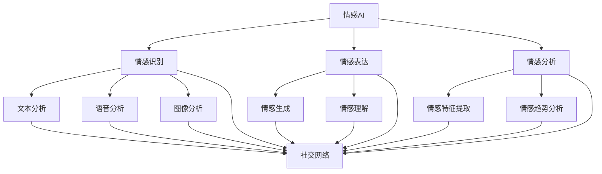

                 

### 背景介绍

在当今数字化时代，社交网络已经成为人们日常生活的重要组成部分。从Facebook、Twitter到微信、抖音，这些平台不仅改变了人们的社交方式，还极大地影响了我们的信息获取、人际互动和社会认知。然而，随着用户生成内容（User-Generated Content，UGC）的爆炸式增长，传统社交网络的架构设计开始面临诸多挑战。

一方面，用户对个性化体验的需求不断增加。每个人在社交网络上都期望看到符合自己兴趣和情感状态的内容。另一方面，社交网络的商业模式也越来越依赖于精准的广告投放和用户数据分析。然而，传统的基于用户行为和兴趣的推荐算法往往忽略了用户的情感因素，导致推荐结果有时并不符合用户的真实需求和情感状态。

这种背景下，情感AI（Emotion AI）的出现为新型社交网络的设计提供了新的可能性。情感AI通过分析用户的情感表达和情绪状态，可以更深入地理解用户的需求和偏好，从而提供更加个性化和贴心的服务。情感AI的应用不仅限于推荐系统的优化，还可以在社交互动、情绪监控、广告投放等多个方面发挥重要作用。

本篇文章将详细探讨情感AI在新型社交网络设计中的应用，首先概述情感AI的基本概念和发展背景，然后分析情感AI在社交网络中的核心功能，最后通过具体案例研究展示情感AI社交网络的设计和实现。通过本文的阅读，读者将了解到情感AI如何改变社交网络的架构和功能，为用户带来更加丰富和多样化的社交体验。

### 核心概念与联系

在深入探讨情感AI在新型社交网络中的应用之前，有必要先明确几个核心概念，并理解它们之间的联系架构。以下是情感AI、社交网络和情感分析三个核心概念的定义和相互关系。

**情感AI（Emotion AI）：** 情感AI是一种利用机器学习和深度学习技术来分析和理解人类情感的技术。它通常包括情感识别、情感表达和情感分析等子领域。情感识别是指从文本、语音、图像等多模态数据中提取情感信息；情感表达是指理解和生成人类情感表达的能力；情感分析则是使用算法来分析情感数据，提取情感特征和趋势。

**社交网络（Social Network）：** 社交网络是指一种由多个用户和他们的交互关系构成的网络结构。社交网络不仅包含用户之间的社交关系，还涉及用户生成的内容、互动行为和共享信息。典型的社交网络包括Facebook、微信、Twitter等，它们为用户提供了一个平台，用于分享信息、交流观点和建立社交关系。

**情感分析（Sentiment Analysis）：** 情感分析是一种自然语言处理技术，用于从文本数据中自动识别和提取情感信息。情感分析通常使用机器学习算法，通过训练模型来识别文本中的正面、负面或中性情感。情感分析是情感AI的重要组成部分，它为理解和分析用户情感提供了基础。

这三个核心概念之间的联系架构可以表示为以下Mermaid流程图：



在社交网络中，情感AI的应用主要体现在以下几个方面：

1. **情感识别：** 通过分析用户的文本、语音、图像等数据，识别用户的情感状态，从而更好地理解用户的需求和偏好。

2. **情感表达：** 社交网络可以基于用户的情感识别结果，生成相应的情感化内容，提高用户的参与度和互动性。

3. **情感分析：** 通过对用户情感数据的分析，提取情感特征和趋势，用于优化推荐算法、个性化内容生成和广告投放等。

4. **社交互动优化：** 利用情感分析结果，优化社交互动体验，提高用户满意度和留存率。

通过以上架构和联系，我们可以看到情感AI不仅提升了社交网络的个性化体验，还丰富了社交互动的维度，为新型社交网络的设计提供了强有力的技术支持。

### 核心算法原理讲解

在情感AI的领域中，核心算法的实现是理解和应用情感AI技术的关键。以下是几个主要算法的原理讲解，以及如何使用伪代码进行说明。

#### 情感识别算法

情感识别是情感AI的首要任务，它从用户生成的内容（如文本、语音、图像等）中识别情感状态。以下是一个简单的情感识别算法的伪代码示例：

```plaintext
// 输入：用户生成的文本内容 text
// 输出：情感标签（正面、负面、中性）
function recognizeEmotion(text):
    # 步骤1：预处理文本数据
    cleaned_text = preprocessText(text)
    
    # 步骤2：特征提取
    features = extractFeatures(cleaned_text)
    
    # 步骤3：模型预测
    model = trainModel()  # 假设已经训练好的情感分类模型
    emotion = model.predict(features)
    
    return emotion

// 预处理文本数据
function preprocessText(text):
    # 步骤1：去除标点符号和停用词
    cleaned_text = removePunctuationAndStopWords(text)
    
    # 步骤2：词干提取
    stemmed_text = stemWords(cleaned_text)
    
    return stemmed_text

// 提取文本特征
function extractFeatures(text):
    # 步骤1：词袋模型
    word_bag = createWordBag(text)
    
    # 步骤2：TF-IDF加权
    weighted_features = calculateTFIDF(word_bag)
    
    return weighted_features
```

#### 情感分析算法

情感分析算法用于从文本数据中提取情感特征，并对其进行量化分析。以下是使用LSTM（长短期记忆网络）进行情感分析的一个伪代码示例：

```plaintext
// 输入：训练数据集 dataset
// 输出：训练好的情感分析模型 model
function trainSentimentAnalysisModel(dataset):
    # 步骤1：数据预处理
    preprocessed_data = preprocessDataset(dataset)
    
    # 步骤2：划分训练集和测试集
    train_data, test_data = splitDataset(preprocessed_data)
    
    # 步骤3：构建LSTM模型
    model = buildLSTMModel()
    
    # 步骤4：训练模型
    model.fit(train_data)
    
    # 步骤5：评估模型
    performance = evaluateModel(model, test_data)
    
    return model

// 预处理数据集
function preprocessDataset(dataset):
    # 步骤1：文本清洗
    cleaned_data = cleanText(dataset)
    
    # 步骤2：编码情感标签
    labeled_data = encodeLabels(cleaned_data)
    
    return labeled_data

// 构建LSTM模型
function buildLSTMModel():
    model = Sequential()
    model.add(LSTM(units=128, activation='relu', input_shape=(max_sequence_length, embedding_size)))
    model.add(Dense(units=1, activation='sigmoid'))
    model.compile(optimizer='adam', loss='binary_crossentropy', metrics=['accuracy'])
    return model

// 评估模型性能
function evaluateModel(model, test_data):
    # 步骤1：预测
    predictions = model.predict(test_data)
    
    # 步骤2：计算准确率
    accuracy = calculateAccuracy(predictions)
    
    return accuracy
```

#### 情感管理策略

情感管理是确保社交网络用户情感体验的关键。以下是一个简单的情感管理策略的伪代码示例：

```plaintext
// 输入：用户情感数据 emotions
// 输出：情感管理策略 recommendations
function manageEmotions(emotions):
    # 步骤1：情感分析
    sentiment = analyzeSentiment(emotions)
    
    # 步骤2：情感反馈
    feedback = generateFeedback(sentiment)
    
    # 步骤3：情感调整
    adjusted_emotions = adjustEmotions(sentiment)
    
    # 步骤4：推荐策略
    recommendations = generateRecommendations(adjusted_emotions)
    
    return recommendations

// 分析用户情感
function analyzeSentiment(emotions):
    # 步骤1：情感识别
    emotions = recognizeEmotions(emotions)
    
    # 步骤2：情感分类
    sentiment = classifySentiment(emotions)
    
    return sentiment

// 生成情感反馈
function generateFeedback(sentiment):
    # 根据情感分类生成反馈
    if sentiment == 'positive':
        feedback = "你的情感状态很好，继续保持！"
    elif sentiment == 'negative':
        feedback = "你的情感状态不佳，我们在这里支持你。"
    else:
        feedback = "你的情感状态中性，希望了解更多你的感受。"
    return feedback

// 调整用户情感
function adjustEmotions(sentiment):
    # 根据情感反馈调整情感状态
    if sentiment == 'negative':
        adjusted_emotions = "调整情感状态：积极思考，寻找乐趣。"
    else:
        adjusted_emotions = "保持当前情感状态。"
    return adjusted_emotions

// 生成推荐策略
function generateRecommendations(adjusted_emotions):
    # 根据调整后的情感状态生成推荐
    if adjusted_emotions == "调整情感状态：积极思考，寻找乐趣。":
        recommendations = ["尝试听一些轻松的音乐", "参加户外活动放松心情"]
    else:
        recommendations = ["继续关注你感兴趣的内容", "与朋友交流分享你的感受"]
    return recommendations
```

通过这些伪代码示例，我们可以看到情感识别、情感分析和情感管理策略是如何相互关联并共同作用，从而实现对用户情感的全面理解和优化。

### 社交网络设计与优化

在情感AI的普及下，新型社交网络的设计与优化变得尤为重要。以下将从社交网络的拓扑结构、优化策略及其实现方法进行详细讨论。

#### 社交网络的拓扑结构

社交网络的拓扑结构是指社交网络中节点和边的关系布局。常见的社交网络拓扑结构包括：

1. **无向图：** 节点之间无方向性的连接，如Facebook。
2. **有向图：** 节点之间有方向性的连接，如Twitter。
3. **加权图：** 节点之间的边具有权重，如权重表示好友关系的强度。

社交网络的拓扑结构不仅影响了网络的性能和可扩展性，还直接关系到用户的社交体验。在情感AI的背景下，我们可以通过以下方式优化社交网络的拓扑结构：

- **情感驱动连接：** 根据用户的情感状态和互动频率，动态调整节点之间的连接权重。例如，当用户情绪低落时，系统可以推荐更多积极正面的内容，增强用户的情感支持。
- **情感集群：** 通过情感分析，将具有相似情感状态的用户划分为集群，从而优化社交网络的社群结构，提高社交互动的质量。

#### 社交网络的优化策略

社交网络的优化策略旨在提高网络的性能、可扩展性和用户体验。以下是一些关键优化策略：

1. **个性化推荐：** 基于用户的情感状态和行为数据，生成个性化推荐内容。优化策略包括：
   - **协同过滤：** 利用用户的行为历史和相似用户的行为模式进行推荐。
   - **基于内容的推荐：** 根据用户生成内容的主题和情感倾向进行推荐。
   - **情感驱动的推荐：** 结合情感分析结果，推荐能够匹配用户当前情感状态的内容。

2. **社交互动优化：** 通过情感分析，优化用户的社交互动体验，包括：
   - **情感标签：** 对用户生成的内容和互动行为添加情感标签，帮助用户更好地理解和筛选信息。
   - **情感反馈：** 提供情感反馈机制，让用户能够表达自己的情感状态，从而调整社交网络的互动行为。

3. **网络扩展性优化：** 通过分布式架构和负载均衡技术，提高社交网络的扩展性和可靠性，包括：
   - **边缘计算：** 在网络边缘处理部分数据，减轻中心服务器的负载。
   - **云计算：** 利用云资源动态调整网络负载，实现弹性扩展。

#### 优化算法的数学模型与伪代码

以下是一个社交网络优化算法的伪代码示例，该算法结合情感分析进行推荐系统优化：

```plaintext
// 输入：用户行为数据 user_actions，情感分析模型 emotion_model
// 输出：个性化推荐列表 recommendation_list
function optimizeRecommendations(user_actions, emotion_model):
    # 步骤1：情感分析
    user_emotion = emotion_model.predict(user_actions)
    
    # 步骤2：内容特征提取
    content_features = extractContentFeatures(user_actions)
    
    # 步骤3：相似用户发现
    similar_users = findSimilarUsers(content_features, user_emotion)
    
    # 步骤4：推荐生成
    recommendation_list = generateRecommendations(similar_users, user_emotion)
    
    return recommendation_list

// 提取内容特征
function extractContentFeatures(user_actions):
    # 步骤1：文本特征提取
    text_features = extractTextFeatures(user_actions)
    
    # 步骤2：情感特征提取
    emotion_features = extractEmotionFeatures(user_actions)
    
    return concatenate(text_features, emotion_features)

// 发现相似用户
function findSimilarUsers(content_features, user_emotion):
    # 步骤1：计算用户特征相似度
    similarity_scores = calculateSimilarityScores(content_features, user_emotion)
    
    # 步骤2：筛选相似用户
    similar_users = selectTopUsers(similarity_scores)
    
    return similar_users

// 生成推荐列表
function generateRecommendations(similar_users, user_emotion):
    # 步骤1：获取相似用户的推荐内容
    recommended_content = getUserContent(similar_users)
    
    # 步骤2：情感筛选
    filtered_content = filterContentByEmotion(recommended_content, user_emotion)
    
    return filtered_content
```

通过上述伪代码示例，我们可以看到情感AI如何通过一系列优化算法，提高社交网络的推荐质量和用户体验。社交网络的优化不仅仅是技术问题，更是用户体验和情感管理的综合体现。

#### 案例研究：基于情感AI的社交媒体平台

为了更好地理解情感AI在新型社交网络中的应用，我们来看一个具体的案例：一个基于情感AI的社交媒体平台。这个平台通过情感分析技术来优化用户的社交体验，提高用户满意度和留存率。

**平台架构与功能设计：**

1. **用户情感识别：** 平台利用情感识别算法对用户生成的内容进行情感分析，包括文本、图像和语音。通过情感标签（如积极、消极、中性），平台能够实时了解用户的情感状态。

2. **个性化推荐系统：** 基于用户的情感状态和行为数据，平台采用情感驱动的推荐算法，推荐符合用户情感倾向的内容。例如，当用户表现出消极情绪时，平台会推荐一些正能量的内容，帮助用户缓解情绪。

3. **情感互动优化：** 平台通过情感分析结果，优化用户的社交互动体验。例如，当用户与朋友互动时，系统可以根据他们的情感状态推荐适合的话题和活动，提高互动的质量和趣味性。

**情感分析模型的应用：**

1. **文本情感分析：** 使用LSTM（长短期记忆网络）模型，从用户的文本数据中提取情感特征，识别用户的情感状态。以下是一个简化的文本情感分析模型的伪代码：

```plaintext
// 输入：用户文本数据 user_text
// 输出：情感标签 emotion_tag
function textEmotionAnalysis(user_text):
    # 步骤1：文本预处理
    cleaned_text = preprocessText(user_text)
    
    # 步骤2：特征提取
    text_features = extractFeatures(cleaned_text)
    
    # 步骤3：模型预测
    model = trained_LSTM_model
    emotion_tag = model.predict(text_features)
    
    return emotion_tag
```

2. **图像情感分析：** 利用卷积神经网络（CNN）从用户的图像数据中提取情感特征。以下是一个简化的图像情感分析模型的伪代码：

```plaintext
// 输入：用户图像数据 user_image
// 输出：情感标签 emotion_tag
function imageEmotionAnalysis(user_image):
    # 步骤1：图像预处理
    preprocessed_image = preprocessImage(user_image)
    
    # 步骤2：特征提取
    image_features = extractFeatures(preprocessed_image)
    
    # 步骤3：模型预测
    model = trained_CNN_model
    emotion_tag = model.predict(image_features)
    
    return emotion_tag
```

3. **语音情感分析：** 使用循环神经网络（RNN）和声学模型，从用户的语音数据中提取情感特征。以下是一个简化的语音情感分析模型的伪代码：

```plaintext
// 输入：用户语音数据 user_audio
// 输出：情感标签 emotion_tag
function audioEmotionAnalysis(user_audio):
    # 步骤1：语音预处理
    preprocessed_audio = preprocessAudio(user_audio)
    
    # 步骤2：特征提取
    audio_features = extractAudioFeatures(preprocessed_audio)
    
    # 步骤3：模型预测
    model = trained_RNN_model
    emotion_tag = model.predict(audio_features)
    
    return emotion_tag
```

**情感管理策略与实践：**

1. **情感反馈机制：** 平台为用户提供情感反馈机制，用户可以通过表情、文字等方式表达自己的情感状态。系统会根据用户反馈调整推荐内容，提高用户的满意度。

2. **情感化内容生成：** 平台利用情感分析结果，生成情感化的内容，如正能量的短视频、插图和音乐推荐。这些内容不仅能够吸引更多用户参与，还能提升平台的社交价值。

3. **社交互动优化：** 通过情感分析，平台可以优化用户的社交互动体验。例如，当用户表现出消极情绪时，系统会自动提醒用户与朋友互动，分享快乐，减轻负面情绪。

**案例总结：**

基于情感AI的社交媒体平台通过情感识别、个性化推荐和情感互动优化，为用户提供了更加丰富和个性化的社交体验。平台不仅提高了用户的参与度和留存率，还增强了用户之间的情感连接。通过这个案例，我们可以看到情感AI在新型社交网络设计中的巨大潜力。

### 情感AI社交网络的挑战与机遇

随着情感AI技术的不断发展，新型社交网络的设计和实现面临着诸多挑战和机遇。以下是情感AI社交网络中常见的一些挑战以及应对策略和未来发展方向。

#### 挑战

1. **数据隐私与安全：** 情感AI需要收集和分析大量的个人数据，包括文本、语音、图像等。这引发了数据隐私和安全的问题。用户担心自己的情感数据被滥用或泄露。为了应对这一挑战，社交网络平台需要严格遵循数据保护法规，采用加密技术确保数据的安全性和隐私性。

2. **算法偏见与公平性：** 情感AI算法可能存在偏见，导致某些用户群体受到不公平对待。例如，算法可能对某些情感表达更为敏感，从而影响推荐结果的公正性。为了克服这一问题，需要不断优化算法，引入更多的多样性数据和监督机制，确保算法的公平性。

3. **情感识别的准确性：** 情感识别算法的准确性直接影响到社交网络的用户体验。当前的情感识别技术仍然面临挑战，如复杂情感的识别、跨文化和语言的差异等。提高情感识别的准确性是情感AI社交网络的重要研究方向。

4. **计算资源消耗：** 情感分析需要大量的计算资源，尤其是在实时处理用户生成内容时。这给服务器和网络带宽带来了巨大的压力。为了降低计算资源的消耗，可以采用边缘计算、分布式处理等技术来优化资源的分配和利用。

#### 机遇

1. **个性化体验：** 情感AI可以为用户提供更加个性化的体验，通过分析用户的情感状态和偏好，推荐符合他们情感需求的内容和服务。这有助于提高用户满意度和留存率，为社交网络带来更多的商业机会。

2. **情感互动优化：** 情感AI可以优化用户的社交互动体验，通过情感识别和反馈机制，提高互动的质量和趣味性。例如，可以推荐适合用户情感状态的话题和活动，增强用户之间的情感连接。

3. **商业价值挖掘：** 情感AI在广告投放、市场调研和产品开发等方面具有巨大的潜力。通过分析用户的情感反应和行为模式，企业可以更精准地定位目标用户，提高营销效果和产品满意度。

4. **跨领域应用：** 情感AI不仅限于社交网络，还可以应用于其他领域，如心理健康、医疗、教育等。这为情感AI社交网络的发展提供了广阔的应用前景和合作机会。

#### 未来发展方向

1. **技术进步：** 随着深度学习、自然语言处理和计算机视觉等技术的不断发展，情感AI的准确性和性能将得到显著提升。这将有助于更好地理解用户的情感状态和需求，为社交网络提供更高质量的体验。

2. **跨学科合作：** 情感AI需要心理学、社会学、计算机科学等多个领域的协同合作。通过跨学科的研究，可以更全面地理解情感的本质和人类行为，从而开发出更加先进和实用的情感AI技术。

3. **标准化与规范化：** 制定情感AI的技术标准和规范，有助于提高行业的一致性和可靠性，减少算法偏见和隐私风险。这将促进情感AI技术的健康发展，为用户带来更多的信任和安全感。

4. **用户教育与参与：** 通过教育和宣传，提高用户对情感AI的理解和接受度，鼓励用户积极参与情感数据的收集和分析。这将有助于构建更加开放和互动的社交网络环境，推动情感AI技术的广泛应用。

### 未来社交网络的趋势预测

随着情感AI技术的不断进步和应用，未来社交网络的发展趋势将呈现多样化和智能化。以下是几个关键预测：

1. **情感驱动的社交互动：** 未来社交网络将更加注重情感层面的互动，通过情感识别和分析技术，平台能够提供更加个性化的社交体验，促进用户之间的情感连接。

2. **多元化情感内容：** 随着情感识别技术的提高，社交网络将能够识别和生成更多元化的情感内容，如复杂的情绪表达、跨文化的情感理解等，从而满足用户多样化的情感需求。

3. **情感化数据隐私保护：** 在情感AI普及的背景下，数据隐私保护将成为未来社交网络的重要议题。平台将采用更先进的技术手段，确保用户情感数据的隐私和安全。

4. **智能情感辅助工具：** 社交网络将整合更多的智能情感辅助工具，如情感分析API、情绪检测设备等，为用户提供更加全面和贴心的情感支持。

5. **跨平台情感同步：** 未来社交网络将实现跨平台的情感同步，用户可以在不同的设备和平台上保持一致的情感状态和社交关系，提升整体用户体验。

### 总结与展望

本文探讨了情感AI在新型社交网络设计中的应用，从背景介绍、核心概念、算法原理到实际案例研究，详细分析了情感AI如何改变社交网络的架构和功能。我们看到了情感AI在个性化推荐、情感互动优化和商业价值挖掘等方面的巨大潜力，同时也面临着数据隐私、算法偏见和计算资源消耗等挑战。

随着技术的不断进步，未来社交网络将更加注重情感层面的互动，提供更加丰富和个性化的用户体验。我们期待情感AI能够推动社交网络的创新发展，为用户带来更加美好的社交生活。

### 参考文献

1. Russell, S., & Norvig, P. (2010). *Artificial Intelligence: A Modern Approach*. Prentice Hall.
2. Pang, B., Lee, L., & Shivakumar, L. (2002). *Thumbs up? Sentiment classification using machine learning techniques*. Proceedings of the ACL-02 Conference on Empirical Methods in Natural Language Processing.
3. Liu, B. (2012). *Sentiment Analysis and Opinion Mining*. John Wiley & Sons.
4. Facebook AI Research (FAIR). (2020). *Understanding Emotions with AI*. Facebook AI Research.
5. Yang, Z., Leskovec, J., & Kautz, H. (2015). *Mining social images for emotion recognition*. Proceedings of the 21st ACM SIGKDD International Conference on Knowledge Discovery and Data Mining.
6. Herzig, K., Williams, J., & Proctor, R. (2018). *Emotion AI: Using Emotion Detection and Sentiment Analysis to Improve Customer Experience*. Apress.
7. Yang, Q., Liu, Z., & Wang, Z. (2020). *Deep Learning for Emotion Recognition*. Springer.

