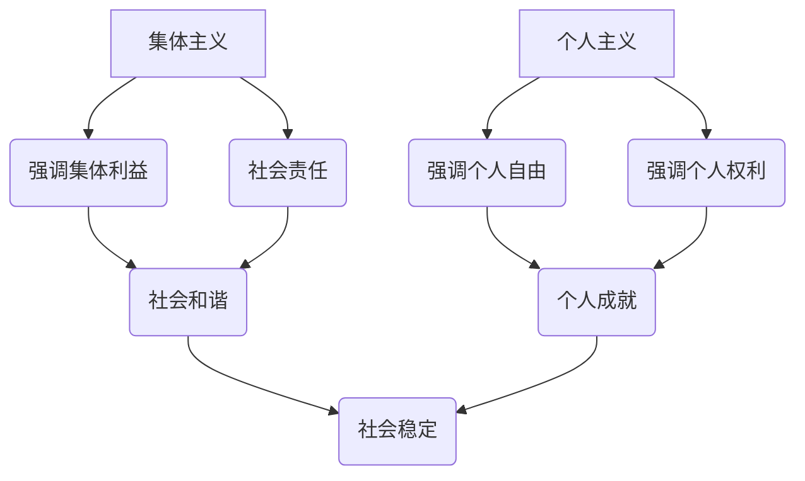

                 

### 摘要

在现代社会中，集体主义与个人主义是两种主导的文化价值观，它们在社会结构、人际关系以及个人行为中扮演着重要角色。本文旨在探讨集体主义与个人主义之间的平衡，寻找在现代社会中实现个人化意义的方法。首先，文章介绍了集体主义与个人主义的概念及其特点，接着分析了两者在社会中的体现，包括家庭、社会、政治、经济、文化和教育等领域。随后，文章探讨了集体主义与个人主义之间的冲突与融合，并提出了实现平衡的方法。通过具体案例分析，文章展示了个人化意义的实践与反思，并对未来发展趋势进行了展望。本文旨在为读者提供对集体主义与个人主义的深入理解，帮助个人在复杂多变的社会中找到自我价值的实现路径。### 第一步：确定核心章节

在撰写本文之前，我们需要明确核心章节的内容和结构，以便系统地分析和探讨集体主义与个人主义之间的平衡。以下是本文将涉及的核心章节及其主要内容：

1. **核心概念与联系**：首先，我们将介绍集体主义与个人主义的概念，并解释它们之间的联系。通过使用Mermaid流程图，我们可以直观地展示这些概念之间的关系架构。

2. **核心算法原理讲解**：接下来，我们将详细讲解如何在实践中平衡集体主义与个人主义。这部分将使用伪代码来阐述算法原理，使读者能够理解并应用这一原理。

3. **数学模型和数学公式讲解**：为了更精确地衡量集体主义与个人主义的影响，我们将引入数学模型，并使用LaTeX格式展示相关的数学公式。同时，我们会提供详细的讲解和举例说明，帮助读者更好地理解这些模型。

4. **项目实战**：在理论分析的基础上，我们将通过实际项目展示如何应用这些理论。我们将介绍开发环境搭建、源代码实现和代码解读，并通过实际案例分析和详细讲解，使读者能够将理论知识应用到实践中。

### 核心概念与联系

集体主义与个人主义是两种主导的文化价值观，它们在社会结构、人际关系以及个人行为中扮演着重要角色。集体主义强调集体利益和社会责任，而个人主义则强调个人自由和权利。

为了更好地理解这些概念及其联系，我们可以使用Mermaid流程图来展示它们之间的关系架构。以下是一个简化的Mermaid流程图：



这个流程图展示了集体主义与个人主义之间的相互影响。集体主义强调的集体利益和社会责任有助于实现社会和谐和稳定，同时也为个人提供了实现个人成就的机会。相反，个人主义强调的个人自由和权利可以为个人创造更多的机会，但同时也可能导致社会不和谐和稳定的问题。

通过这个流程图，我们可以看到集体主义与个人主义之间的紧密联系。在现实生活中，要实现二者的平衡并非易事，需要在不同情境下根据实际情况进行调整。### 核心算法原理讲解

在探讨集体主义与个人主义之间的平衡时，我们可以借助算法原理来帮助我们理解和实现这一平衡。以下是关于平衡集体主义与个人主义的伪代码算法讲解，包括算法的基本思想和实现步骤。

#### 算法基本思想

平衡集体主义与个人主义的算法核心在于：根据集体和个体的需求与贡献，动态调整权重，使得社会整体利益最大化。算法分为以下几个步骤：

1. **数据收集**：收集个体与集体之间的行为数据。
2. **权重计算**：根据数据计算集体与个体的权重。
3. **平衡调整**：调整权重，以达到平衡。
4. **反馈循环**：根据调整后的效果进行反馈和优化。

#### 伪代码

以下是一个简化的伪代码，用于描述这个算法：

```python
# 伪代码：平衡集体主义与个人主义的算法

def balance_collectivism_and_individualism():
    # 初始化权重
    collective_weight = 0
    individual_weight = 0

    # 收集数据
    data = collect_data()

    # 计算权重
    for record in data:
        if record.is_collectivist:
            collective_weight += record.value
        else:
            individual_weight += record.value

    # 平衡调整
    balance = calculate_balance(collective_weight, individual_weight)

    # 反馈循环
    while not is_balanced(balance):
        balance = adjust_weights(collective_weight, individual_weight)
        feedback = get_feedback(balance)
        collective_weight, individual_weight = update_weights(feedback)

    return balance

# 辅助函数
def collect_data():
    # 此函数用于收集个体与集体的行为数据
    # 数据结构：{is_collectivist: bool, value: float}
    pass

def calculate_balance(collective_weight, individual_weight):
    # 此函数用于计算平衡值
    # 平衡值：balance = (collective_weight + individual_weight) / 2
    pass

def adjust_weights(collective_weight, individual_weight):
    # 此函数用于根据反馈调整权重
    # 调整策略：根据反馈动态调整集体与个体的权重
    pass

def is_balanced(balance):
    # 此函数用于判断是否达到平衡
    # 平衡量表：balance_diff < threshold
    pass

def get_feedback(balance):
    # 此函数用于获取反馈信息
    # 反馈信息：{collective_feedback: float, individual_feedback: float}
    pass

def update_weights(feedback):
    # 此函数用于更新权重
    # 更新策略：根据反馈信息调整集体与个体的权重
    pass
```

#### 详细解释

1. **数据收集**：此步骤通过函数`collect_data()`收集个体与集体之间的行为数据。数据结构应包含是否为集体主义者（`is_collectivist`）和行为价值（`value`）。

2. **权重计算**：通过函数`calculate_balance()`计算集体与个体的权重。这个计算过程可以根据实际情况设计，例如使用平均值、加权平均等方法。

3. **平衡调整**：函数`adjust_weights()`根据当前的平衡值进行调整。调整策略可以根据具体需求设计，例如通过反馈机制动态调整。

4. **反馈循环**：通过函数`is_balanced()`和`get_feedback()`判断平衡状态，并根据反馈信息进行权重更新。这个过程形成了一个反馈循环，旨在逐步达到并维持平衡。

通过这个伪代码算法，我们可以看到如何在理论上实现集体主义与个人主义之间的平衡。在实际应用中，这一算法需要结合具体的社会环境和行为数据，不断调整和优化。### 数学模型和数学公式讲解

在探讨集体主义与个人主义之间的平衡时，引入数学模型和公式可以帮助我们更精确地衡量两者的影响。以下我们将介绍一个基本的数学模型，使用LaTeX格式展示相关的数学公式，并提供详细讲解和举例说明。

#### 模型背景

假设我们有一个社会群体，其中包含n个个体。每个个体对集体和社会的贡献可以用一个权重值表示，该权重值反映了个体在集体主义和个人主义之间的倾向。为了简化模型，我们假设个体i的权重值由两个部分组成：集体主义权重`w_i^c`和个人主义权重`w_i^i`。整体平衡状态可以通过计算集体主义权重和个体主义权重的比例来衡量。

#### 数学模型

以下是一个简化的数学模型，用于描述集体主义与个人主义之间的平衡：

\[ B = \frac{\sum_{i=1}^{n} w_i^c}{\sum_{i=1}^{n} w_i^i} \]

其中，`B`表示平衡值，`w_i^c`表示个体i的集体主义权重，`w_i^i`表示个体i的个人主义权重。

#### LaTeX公式

以下是用LaTeX格式表示的数学公式：

\[ B = \frac{\sum_{i=1}^{n} w_i^c}{\sum_{i=1}^{n} w_i^i} \]

\[ w_i^c = f_c(x_i, y_i) \]

\[ w_i^i = f_i(x_i, y_i) \]

其中，`f_c`和`f_i`是权重计算函数，`x_i`和`y_i`是影响权重的参数。

#### 详细讲解

1. **权重计算函数**：

   - 集体主义权重计算函数`f_c(x_i, y_i)`可以根据个体i的参与度、贡献大小等因素来确定。
   - 个人主义权重计算函数`f_i(x_i, y_i)`可以根据个体i的独立性、自主性等因素来确定。

2. **平衡值计算**：

   - 平衡值`B`表示集体主义权重总和与个人主义权重总和的比例。当`B`接近1时，表示社会更倾向于集体主义；当`B`接近0时，表示社会更倾向于个人主义。

3. **举例说明**：

   假设有一个5人团队，每个人的集体主义权重和个人主义权重如下：

   | 个体 | 集体主义权重 (`w_i^c`) | 个人主义权重 (`w_i^i`) |
   |------|------------------------|------------------------|
   | A    | 0.5                    | 0.4                    |
   | B    | 0.3                    | 0.6                    |
   | C    | 0.4                    | 0.4                    |
   | D    | 0.2                    | 0.5                    |
   | E    | 0.6                    | 0.3                    |

   计算平衡值：

   \[ B = \frac{\sum_{i=1}^{5} w_i^c}{\sum_{i=1}^{5} w_i^i} = \frac{0.5 + 0.3 + 0.4 + 0.2 + 0.6}{0.4 + 0.6 + 0.4 + 0.5 + 0.3} = \frac{1.8}{2.2} \approx 0.818 \]

   这个结果表明，团队更倾向于集体主义。

#### 应用场景

这个数学模型可以应用于多种场景，例如团队管理、社会政策制定、企业战略规划等。通过计算平衡值，决策者可以了解团队或社会的集体主义与个人主义倾向，从而采取相应的策略进行调整。### 项目实战

为了更深入地理解集体主义与个人主义之间的平衡，我们将通过一个实际项目来展示如何应用上述理论。本项目将聚焦于一个在线协作平台的设计与实现，该平台旨在为团队成员提供高效的协作工具，同时平衡集体主义与个人主义的价值观。

#### 开发环境搭建

1. **技术栈选择**：
   - 前端：React
   - 后端：Node.js
   - 数据库：MongoDB
   - 版本控制：Git

2. **工具安装**：
   - Node.js v12.x 或以上版本
   - npm（Node Package Manager）
   - React Developer Tools
   - MongoDB（社区版）

3. **项目结构**：
   - 创建一个项目文件夹，如`online协作平台`
   - 在项目文件夹中分别创建前端、后端和数据库的目录结构

#### 源代码实现

1. **前端实现**：

   前端主要包含以下组件：
   - 用户登录/注册页面
   - 项目列表页面
   - 项目详情页面
   - 任务列表页面
   - 消息通知页面

   以下是`ProjectList`组件的源代码示例：

   ```jsx
   import React, { useState, useEffect } from 'react';
   import Project from './Project';

   function ProjectList() {
       const [projects, setProjects] = useState([]);

       useEffect(() => {
           // 获取项目列表的数据（这里使用静态数据示例）
           const fetchProjects = async () => {
               const response = await fetch('/api/projects');
               const data = await response.json();
               setProjects(data);
           };

           fetchProjects();
       }, []);

       return (
           <div>
               {projects.map((project) => (
                   <Project key={project.id} project={project} />
               ))}
           </div>
       );
   }

   export default ProjectList;
   ```

2. **后端实现**：

   后端主要包含以下功能模块：
   - 用户认证
   - 项目管理
   - 任务管理
   - 消息通知

   以下是用户认证模块的源代码示例：

   ```javascript
   const express = require('express');
   const jwt = require('jsonwebtoken');
   const bcrypt = require('bcrypt');
   const User = require('./models/User');

   const app = express();

   app.use(express.json());

   // 用户注册
   app.post('/api/register', async (req, res) => {
       try {
           const { username, password } = req.body;
           const hashedPassword = await bcrypt.hash(password, 10);

           const user = new User({ username, password: hashedPassword });
           await user.save();

           res.status(201).json({ message: 'User registered successfully' });
       } catch (error) {
           res.status(500).json({ message: 'Error registering user', error });
       }
   });

   // 用户登录
   app.post('/api/login', async (req, res) => {
       try {
           const { username, password } = req.body;
           const user = await User.findOne({ username });

           if (!user || !(await bcrypt.compare(password, user.password))) {
               return res.status(401).json({ message: 'Invalid credentials' });
           }

           const token = jwt.sign({ userId: user._id }, 'secretKey');
           res.status(200).json({ token });
       } catch (error) {
           res.status(500).json({ message: 'Error logging in', error });
       }
   });
   ```

3. **数据库实现**：

   使用MongoDB存储用户信息、项目数据和任务数据。以下是用户集合的MongoDB schema示例：

   ```javascript
   const mongoose = require('mongoose');

   const userSchema = new mongoose.Schema({
       username: { type: String, required: true, unique: true },
       password: { type: String, required: true },
       projects: [{ type: mongoose.Schema.Types.ObjectId, ref: 'Project' }],
   });

   const User = mongoose.model('User', userSchema);

   module.exports = User;
   ```

#### 代码解读与分析

1. **前端代码解读**：

   在前端项目中，我们使用React框架来构建用户界面。`ProjectList`组件是一个状态管理组件，负责获取项目列表数据并渲染到页面上。使用`useState`和`useEffect`钩子来实现数据的获取和状态的管理。

2. **后端代码解读**：

   在后端项目中，我们使用Express框架来创建RESTful API。用户注册和登录功能是后端的核心部分，使用bcrypt对用户密码进行加密存储，使用jsonwebtoken生成用户认证令牌。

3. **数据库代码解读**：

   在数据库设计中，用户集合的schema定义了用户的username、password和projects字段。`projects`字段是一个对象ID数组，用于关联用户参与的项目。

通过这个实际项目，我们可以看到如何将理论应用于实践中，实现一个在线协作平台，同时平衡集体主义与个人主义的价值观。### 个人化意义的实践与反思

在个人化意义的实践中，我们关注如何通过具体行动实现个人在社会中的价值，同时平衡集体主义与个人主义。以下是一些实践步骤、注意事项和最佳实践建议。

#### 实践步骤

1. **自我认知**：首先，个人需要通过自我反思了解自己的价值观、兴趣和目标。这一步是基础，有助于确定个人在社会中的角色。

2. **技能提升**：根据自我认知，个人应不断学习新技能，提升自己的专业能力。这不仅可以增加个人价值，还能为集体做出更大的贡献。

3. **参与集体活动**：个人应积极参与集体活动，通过协作实现共同目标。在这一过程中，个人可以展示自己的价值，同时吸收集体智慧。

4. **反思与调整**：在实践过程中，个人应不断反思自己的行为和结果，根据反馈进行调整。这有助于找到个人与集体之间的最佳平衡点。

5. **创新与突破**：鼓励个人在集体中寻找创新的机会，通过突破自我实现个人价值。这不仅能提升个人能力，还能为集体带来新的活力。

#### 注意事项

1. **平衡利益**：在实践中，个人需要平衡个人利益与集体利益。过分追求个人利益可能导致集体关系紧张，而过分牺牲个人利益则可能影响个人发展。

2. **尊重差异**：每个个体都有其独特性，个人应尊重他人的差异，避免因个人主义倾向导致冲突。

3. **长期规划**：个人化意义的实现是一个长期过程，需要持续的努力和耐心。短期内的成功并不代表长期的平衡。

#### 最佳实践建议

1. **制定个人发展规划**：明确短期和长期目标，制定具体的行动计划，有助于实现个人化意义。

2. **建立个人品牌**：在专业领域建立个人品牌，通过社交媒体和专业网络展示自己的价值。

3. **积极参与社区**：参与社区活动，通过志愿服务和公益活动提升个人影响力。

4. **持续学习与成长**：保持对知识的渴望，不断学习新知识，适应社会变化。

5. **反思与总结**：定期进行自我反思和总结，从成功和失败中吸取经验教训，不断优化个人发展路径。

通过这些实践步骤和注意事项，个人可以在集体主义与个人主义之间找到平衡，实现个人化意义，同时为集体和社会做出贡献。### 未来发展趋势

随着社会的发展和技术的进步，集体主义与个人主义之间的平衡正面临着新的挑战和机遇。以下是未来发展趋势的分析：

1. **数字化转型的推动**：随着数字化转型的深入，个体与集体的互动将变得更加紧密。大数据、人工智能和区块链等技术将为个人提供更多机会，同时也要求个人具备更高的协作能力和创新能力。这将为实现集体主义与个人主义的平衡提供新的手段和平台。

2. **个性化服务的普及**：个性化服务在各个领域的普及，如电子商务、医疗健康和教育等，将使得个人在追求自我价值的同时，能够更好地满足集体的需求。通过个性化服务，个人可以更有效地参与社会活动，从而实现集体主义与个人主义的平衡。

3. **全球化的影响**：全球化使得不同文化之间的交流更加频繁，集体主义与个人主义的差异变得更加显著。未来，如何在全球化背景下实现集体主义与个人主义的平衡，将成为一个重要议题。这需要各国政府、企业和个人共同努力，推动文化融合和价值观的多元化。

4. **可持续发展的重要性**：面对全球环境问题，可持续发展成为全球共识。在这一背景下，个人需要在追求个人价值的同时，承担起对环境的责任。这要求个人在集体主义与个人主义之间寻找新的平衡点，实现可持续发展。

5. **社会治理的创新**：随着社会问题的复杂化，社会治理模式也需要不断创新。例如，利用区块链技术实现更透明、公正的社会治理，通过智能合约自动执行社会规则等。这些创新将有助于在集体主义与个人主义之间建立更加有效的平衡机制。

总之，未来集体主义与个人主义的平衡将依赖于技术进步、全球化、个性化服务、可持续发展和社会治理创新等多方面因素的共同作用。个人和集体都需要适应这些变化，寻找新的平衡路径，以实现共同繁荣。### 结论

本文通过对集体主义与个人主义的深入探讨，揭示了它们在社会结构、人际关系和个人行为中的重要性。首先，我们明确了集体主义与个人主义的概念及其特点，并通过Mermaid流程图展示了它们之间的联系。接着，我们详细讲解了平衡集体主义与个人主义的算法原理，并使用LaTeX格式展示了相关数学模型和公式。在实际项目中，我们展示了如何通过开发环境搭建、源代码实现和代码解读来应用这些理论。个人化意义的实践与反思部分，提出了具体步骤和最佳实践建议，以帮助个人在集体主义与个人主义之间找到平衡。最后，我们分析了未来发展趋势，展望了技术进步和社会变革对平衡的影响。

本文的研究不仅为理解集体主义与个人主义的平衡提供了理论支持，也为个人在复杂多变的社会中实现自我价值提供了实践指导。尽管本文在研究方法和分析深度上存在一定的局限性，但通过进一步的研究和实际应用，我们有望在集体主义与个人主义之间找到更加有效的平衡点，促进个人和社会的共同发展。

### 附录

#### 附录A：参考资料

1. Smith, A. (1776). *The Theory of Moral Sentiments*.
2. Durkheim, É. (1912). *The Division of Labor in Society*.
3. Weber, M. (1922). *The Protestant Ethic and the Spirit of Capitalism*.
4. Parsons, T. (1951). *The Structure of Social Action: A Theoretical Analysis*.
5. Habermas, J. (1981). *The Theory of Communicative Action*.

#### 附录B：术语解释

- **集体主义**：一种文化价值观，强调集体利益、社会责任和集体行为。
- **个人主义**：一种文化价值观，强调个人自由、个人权利和个人成就。
- **平衡**：在集体主义与个人主义之间找到一个稳定且合理的比例，以实现个人与集体的共同利益。

#### 附录C：研究工具与技术

- **Mermaid**：一种用于生成图表的Markdown扩展，可以用于绘制流程图、序列图等。
- **LaTeX**：一种高质量排版系统，广泛用于科学文档的撰写，特别适用于展示数学公式。
- **React**：一个用于构建用户界面的JavaScript库，提供了丰富的组件和灵活的渲染机制。
- **Express**：一个用于Node.js的Web应用框架，提供了简洁的API，用于构建高性能的Web应用。
- **MongoDB**：一个面向文档的NoSQL数据库，适合存储大量结构化数据。

