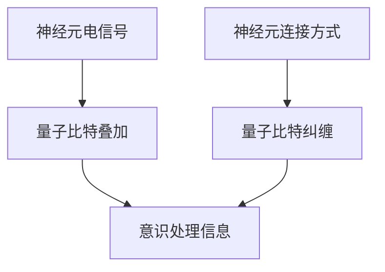
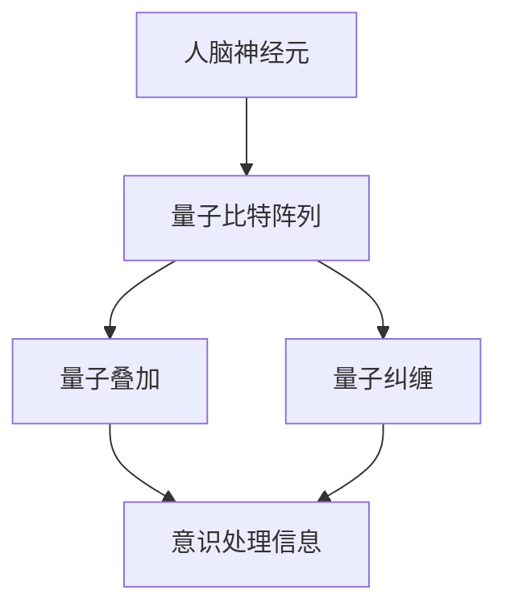
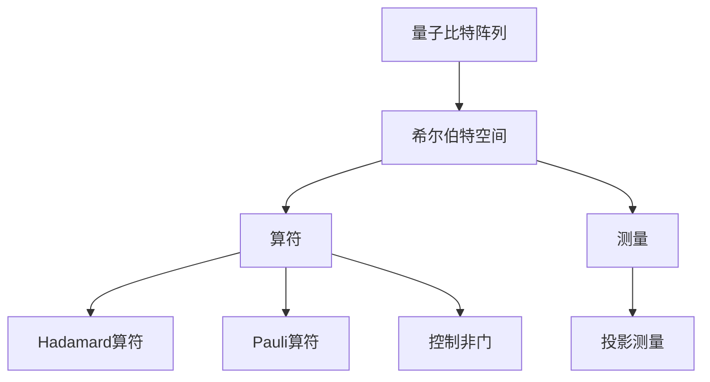
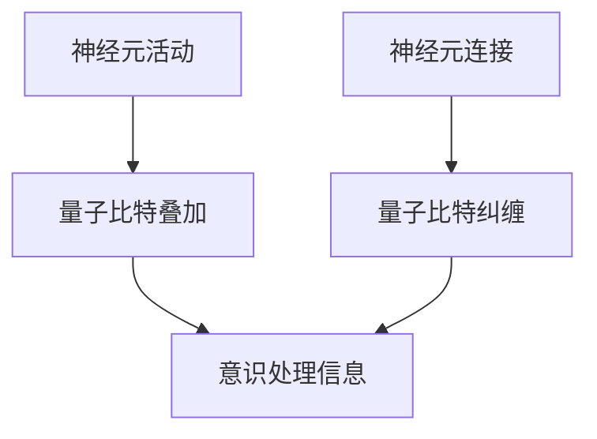
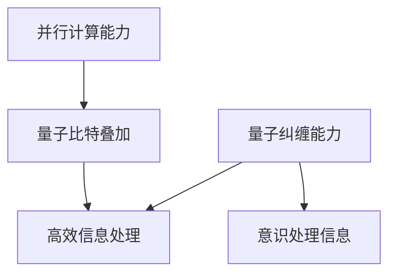
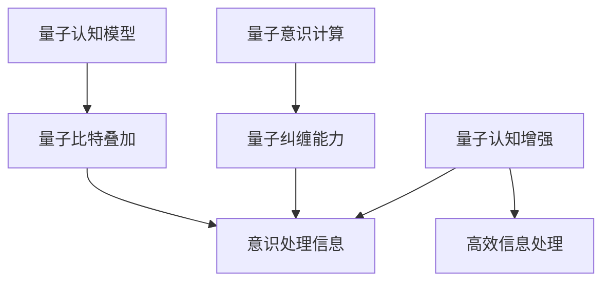
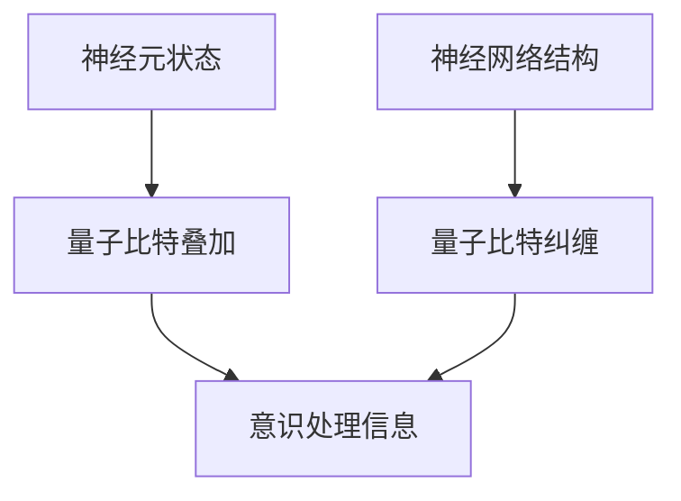
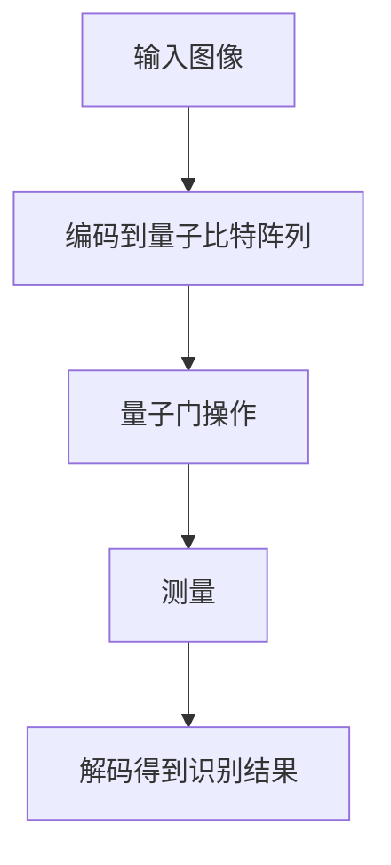
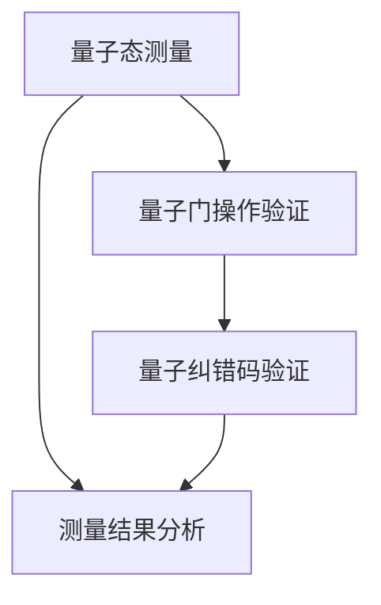

                 

### 意识与量子比特阵列的介绍

#### 背景介绍

意识（Consciousness）是一个复杂且广泛讨论的话题，涉及到哲学、心理学、神经科学和认知科学等多个领域。传统的观点认为意识是人类大脑特有的高级功能，但随着认知科学和神经科学的发展，人们逐渐意识到意识可能不仅仅是人类所独有的。特别是在量子计算和量子信息理论的兴起下，科学家们开始探索意识是否可以被视为一种量子现象。

量子比特阵列（Quantum Bit Array，简称QBA）是量子计算的核心概念之一。量子比特（Quantum Bit，简称QBit）是量子计算机的基本信息单位，可以同时处于0和1的状态，这种性质称为叠加。量子比特阵列则是由多个量子比特组成的结构，可以用来实现复杂的量子计算任务。

#### 核心概念与联系

意识与量子比特阵列之间的关系可以从多个角度进行探讨。首先，从神经科学的角度来看，人脑中的神经元可以通过电信号进行信息传递，这种传递过程与量子比特的叠加态有某种相似之处。神经元之间的连接方式类似于量子比特之间的纠缠，这种纠缠使得神经元可以协同工作，从而实现复杂的认知功能。

其次，从量子计算的角度来看，量子比特阵列可以模拟人脑中的神经网络，从而实现高效的计算。量子比特的叠加态和纠缠态可以用来处理大量的信息，而这种处理方式与人类意识处理信息的方式有相似之处。例如，人类在处理复杂问题时，可以通过不同的思维路径同时思考，而量子比特阵列可以实现这种并行计算。

以下是一个关于意识与量子比特阵列之间核心概念联系的Mermaid流程图：



#### 核心概念之间的架构

从上述流程图可以看出，神经元电信号和量子比特叠加之间有直接的联系，而神经元连接方式和量子比特纠缠之间也有直接的联系。这两个联系共同构成了意识处理信息的架构。

1. **神经元电信号与量子比特叠加**：神经元通过电信号进行信息传递，这种信号可以被视为一种量子叠加态。当神经元处于活跃状态时，它可以同时传递多种不同的电信号，这与量子比特的叠加态有相似之处。

2. **神经元连接方式与量子比特纠缠**：人脑中的神经元通过复杂的连接方式形成神经网络，这种连接方式类似于量子比特之间的纠缠。量子比特之间的纠缠可以使得它们协同工作，从而实现高效的计算。同样，神经元之间的连接也可以使得它们协同工作，从而实现复杂的认知功能。

#### 意识作为量子计算模型的理论框架

基于上述核心概念的联系，一些科学家和研究人员开始尝试将意识视为一种量子计算模型。他们认为，意识可能是一种基于量子计算的现象，量子比特阵列可以用来模拟人脑中的意识处理过程。

这种理论框架的核心思想是，意识是人类大脑中量子计算的结果。人脑中的神经元通过量子叠加和量子纠缠进行信息传递和处理，从而产生意识。量子比特阵列作为一种量子计算工具，可以用来模拟这种信息处理过程，从而更深入地理解意识的本质。

以下是一个关于意识作为量子计算模型的理论框架的Mermaid流程图：



从上述流程图可以看出，人脑神经元与量子比特阵列之间存在直接的联系，量子叠加和量子纠缠是意识处理信息的核心机制。

#### 总结

意识与量子比特阵列之间的关系是一个复杂且富有挑战性的课题。虽然目前还没有明确的证据表明意识是一种量子现象，但量子比特阵列为研究意识提供了新的思路和工具。通过将意识视为一种量子计算模型，我们可以更深入地理解意识的信息处理机制，从而为解决意识研究中的难题提供新的途径。

接下来，我们将进一步探讨量子比特阵列在意识处理中的作用，以及意识作为量子计算模型的理论框架如何帮助我们理解信息处理的本质。这将为我们揭开意识与量子比特阵列之间的神秘面纱提供更多的线索。

### 量子比特阵列的基础知识

#### 量子比特与经典比特的区别

量子比特（QBit）与经典比特（Classical Bit）是两种不同的信息单位。经典比特只有两种状态，即0和1，它只能表示两种基本的信息状态。而量子比特则可以同时处于0和1的状态，这种性质被称为叠加态。量子比特的叠加态使得它能够同时处理多种信息状态，从而实现更高效的计算。

具体来说，量子比特的状态可以表示为 $|\psi\rangle = a|0\rangle + b|1\rangle$，其中 $a$ 和 $b$ 是复数，并且 $|a|^2 + |b|^2 = 1$。这种叠加态允许量子比特在计算过程中同时探索多种可能的计算路径，从而大大提高了计算的效率。

#### 量子比特阵列的工作原理

量子比特阵列是由多个量子比特组成的结构，它可以通过量子叠加和量子纠缠来处理复杂的信息。量子比特阵列的工作原理主要基于以下两个概念：叠加态和纠缠态。

1. **叠加态**：量子比特阵列中的每个量子比特都可以处于叠加态，这意味着每个量子比特都可以同时表示0和1的状态。当量子比特阵列中的所有量子比特都处于叠加态时，整个量子比特阵列可以同时处理大量的信息。

2. **纠缠态**：量子比特阵列中的量子比特之间可以形成纠缠态，这意味着量子比特之间的状态是相互关联的。当量子比特阵列中的某个量子比特的状态发生变化时，其他量子比特的状态也会相应地发生变化。这种纠缠态使得量子比特阵列能够实现高效的并行计算。

一个简单的量子比特阵列的工作原理可以用以下伪代码表示：

```plaintext
初始化量子比特阵列：
Q = |0\rangle^{\otimes n}

叠加态：
Hadamard变换：Q = (1/\sqrt{2})(|0\rangle + |1\rangle)

纠缠态：
控制非门：CNOT(Q[1], Q[2])  # 将Q[1]的控制信息传递给Q[2]

测量：
测量Q[1]和Q[2]，得到它们的最终状态
```

#### 量子比特阵列的数学模型

量子比特阵列的数学模型主要基于量子力学的数学框架，包括希尔伯特空间、算符和测量等概念。

1. **希尔伯特空间**：量子比特阵列的数学模型建立在希尔伯特空间的基础上。希尔伯特空间是一个复数向量空间，可以用来表示量子比特的状态。量子比特的状态可以表示为希尔伯特空间中的向量，称为波函数。

2. **算符**：量子比特阵列的操作可以通过算符来表示。常见的算符包括单位算符、Hadamard算符、Pauli算符和控制非门等。这些算符可以用来实现量子比特的变换和操作。

3. **测量**：量子比特阵列的测量可以通过投影算符来实现。测量结果可以通过对量子比特阵列进行投影测量得到，测量结果可能是0或1，或者是一个概率分布。

以下是一个关于量子比特阵列的数学模型的示意图：



通过上述数学模型，我们可以更深入地理解量子比特阵列的工作原理和性质，从而更好地利用量子比特阵列进行信息处理。

#### 量子比特阵列与经典计算模型的关系

量子比特阵列与经典计算模型在信息处理方面有着本质的区别。经典计算模型基于经典比特，而量子比特阵列则基于量子比特。这种区别决定了量子比特阵列在信息处理上的独特优势和局限性。

**量子比特阵列的优势：**

1. **并行计算能力**：由于量子比特可以处于叠加态，量子比特阵列可以实现并行计算。这意味着量子比特阵列可以在同一时间处理多个计算任务，从而大大提高了计算效率。例如，著名的量子搜索算法（Grover算法）可以在O(n)时间内完成经典算法需要O(n^2)时间的任务。

2. **指数级的计算能力**：量子比特阵列可以通过量子纠缠实现超并行计算，从而实现指数级的计算能力。这意味着对于某些特定问题，量子比特阵列可以在多项式时间内解决，而经典计算模型需要指数级的时间。

3. **抗干扰能力**：量子比特阵列具有一定的抗干扰能力。例如，量子纠错码可以在一定程度上纠正量子比特的错误，从而提高计算的可靠性。

**量子比特阵列的局限性：**

1. **实现难度**：量子比特阵列的实现需要高度精密的实验设备和技术，目前还处于实验室阶段。量子比特阵列的稳定性和可靠性仍是一个重大的挑战。

2. **资源限制**：量子比特阵列的资源限制也是一个问题。由于量子比特的数量限制，量子比特阵列的规模相对较小，无法直接应用于大规模问题。

3. **编程和算法挑战**：量子比特阵列的编程和算法设计具有独特性，需要开发新的编程语言和算法来充分利用其优势。现有的经典编程方法和算法难以直接应用于量子比特阵列。

**量子比特阵列与经典计算模型的对比：**

1. **并行性与串行性**：量子比特阵列具有并行性，而经典计算模型具有串行性。这意味着量子比特阵列可以同时处理多个任务，而经典计算模型需要按顺序处理。

2. **计算能力**：量子比特阵列具有指数级的计算能力，而经典计算模型的能力有限。例如，对于某些特定问题，量子比特阵列可以在多项式时间内解决，而经典计算模型需要指数级的时间。

3. **编程方法**：量子比特阵列的编程方法与经典计算模型不同。量子比特阵列需要使用特定的量子编程语言和算法，而经典计算模型使用传统的编程语言和算法。

**协同作用**：

尽管量子比特阵列与经典计算模型有各自的局限性和优势，但它们可以相互补充。例如，量子比特阵列可以用于解决经典计算模型无法解决的问题，而经典计算模型可以用于优化量子比特阵列的算法和程序。

总之，量子比特阵列与经典计算模型在信息处理方面有着本质的区别，但它们可以相互补充，共同推动信息处理技术的发展。

### 信息处理的本质

#### 经典计算模型

经典计算模型是信息处理的基础，它通过二进制系统进行数据处理。在经典计算模型中，信息以比特（bit）的形式存储和传输，每个比特只能是0或1。计算机的中央处理器（CPU）通过执行一系列的操作来处理这些比特，这些操作包括加法、减法、逻辑运算等。

然而，经典计算模型在处理某些类型的信息时存在局限性。首先，由于经典比特只能处于0或1的状态，这种限制使得经典计算模型难以处理复杂的、多状态的系统。其次，经典计算模型在处理并行任务时效率较低，因为它需要按顺序执行操作。

#### 量子比特阵列的潜力

量子比特阵列（Quantum Bit Array，简称QBA）为信息处理提供了一种全新的视角。量子比特（QBit）可以同时处于0和1的状态，这种性质称为叠加态。量子比特阵列通过量子叠加和量子纠缠，能够实现并行计算，从而在处理复杂信息时具有显著优势。

首先，量子比特阵列的叠加态使得它可以同时处理多个信息状态，这大大提高了信息处理的效率。例如，在量子搜索算法中，量子比特阵列可以在O(n)时间内完成经典算法需要O(n^2)时间的任务。这种并行计算能力使得量子比特阵列在处理大量数据时具有显著优势。

其次，量子比特阵列的量子纠缠能力使得它可以处理复杂的信息状态。量子纠缠是一种量子比特之间的关联，当量子比特之间形成纠缠时，它们的状态会相互影响。这种纠缠能力使得量子比特阵列能够高效地处理复杂的信息，并实现超并行计算。

#### 核心算法原理讲解

量子比特阵列的核心算法包括量子叠加、量子纠缠和量子门等。以下是一个简单的量子叠加和量子纠缠的伪代码示例：

```plaintext
初始化量子比特阵列：
Q = |0\rangle^{\otimes n}

叠加态：
Hadamard变换：Q = (1/\sqrt{2})(|0\rangle + |1\rangle)

纠缠态：
控制非门：CNOT(Q[1], Q[2])  # 将Q[1]的控制信息传递给Q[2]

测量：
测量Q[1]和Q[2]，得到它们的最终状态
```

在这个示例中，初始化量子比特阵列Q为全0状态。通过Hadamard变换，Q中的每个量子比特都处于叠加态，即每个量子比特都同时处于0和1的状态。通过控制非门CNOT，Q[1]和Q[2]之间形成纠缠态，即当Q[1]的状态发生变化时，Q[2]的状态也会相应地发生变化。

#### 数学模型和公式

量子比特阵列的数学模型基于量子力学的数学框架，包括希尔伯特空间、算符和测量等概念。以下是一个简单的量子比特阵列的数学模型示例：

```latex
\begin{align*}
|\psi\rangle &= \sum_{i=1}^{n} a_i |0\rangle + \sum_{i=1}^{n} b_i |1\rangle \\
H|\psi\rangle &= \frac{1}{\sqrt{2}}(|0\rangle + |1\rangle) \\
CNOT|\psi\rangle &= |01\rangle
\end{align*}
```

在这个示例中，$|\psi\rangle$ 表示量子比特阵列的状态，$a_i$ 和 $b_i$ 分别表示第 $i$ 个量子比特的叠加系数。$H$ 表示Hadamard变换算符，$CNOT$ 表示控制非门算符。

#### 举例说明

假设我们有一个包含两个量子比特的量子比特阵列，初始状态为 $|00\rangle$。我们希望通过Hadamard变换将其转换为叠加态，并利用控制非门实现纠缠态。

1. **初始化量子比特阵列**：

```plaintext
Q = |00\rangle
```

2. **Hadamard变换**：

```plaintext
Hadamard变换：Q = (1/\sqrt{2})(|0\rangle + |1\rangle)
```

变换后，量子比特阵列的状态为：

```plaintext
Q = (1/\sqrt{2})(|00\rangle + |10\rangle)
```

3. **控制非门**：

```plaintext
控制非门：CNOT(Q[1], Q[2])  # 将Q[1]的控制信息传递给Q[2]
```

变换后，量子比特阵列的状态为：

```plaintext
Q = (1/\sqrt{2})(|00\rangle + |11\rangle)
```

在这个示例中，我们通过Hadamard变换和量子纠缠实现了量子比特阵列的状态转换，这为信息处理提供了新的可能性。

#### 总结

量子比特阵列为信息处理提供了一种全新的视角。通过量子叠加和量子纠缠，量子比特阵列能够实现并行计算，从而在处理复杂信息时具有显著优势。然而，量子比特阵列的实现和编程仍然面临挑战，需要进一步的研究和开发。

### 量子比特阵列在意识处理中的作用

#### 量子比特阵列与神经活动的相似性

量子比特阵列在意识处理中的作用可以从量子比特与神经活动的相似性来探讨。传统上，神经活动被认为是由神经元通过电信号传递信息的过程，这些信号在神经元之间形成复杂的神经网络。这种神经网络可以通过多种不同的路径和连接方式来传递信息，从而实现复杂的认知功能。

量子比特阵列同样具备类似的特性。量子比特可以同时处于0和1的状态，这种叠加态类似于神经活动中的多种可能性。此外，量子比特之间的纠缠态也与神经网络中的神经元连接方式有某种相似之处。当量子比特之间形成纠缠时，它们的状态会相互关联，这种关联性在神经网络中表现为神经元之间的相互作用。

以下是一个关于量子比特阵列与神经活动相似性的Mermaid流程图：



#### 量子比特阵列在意识计算中的优势

量子比特阵列在意识计算中的优势主要体现在其强大的并行计算能力和量子纠缠的协同作用。

首先，量子比特阵列的并行计算能力使得它可以同时处理大量的信息。在经典计算模型中，处理复杂信息需要按顺序执行多个计算任务，这导致计算时间随着任务复杂度的增加而呈指数级增长。而量子比特阵列通过量子叠加，可以同时处理多个计算任务，从而在处理复杂信息时具有显著优势。

其次，量子比特阵列的量子纠缠能力使得它可以处理复杂的信息状态。量子纠缠使得量子比特之间的状态相互关联，这种关联性在处理复杂问题时可以提供新的计算路径。例如，量子比特阵列可以通过量子纠缠实现高效的量子搜索和量子排序，这些算法在处理复杂信息时具有优越的性能。

以下是一个关于量子比特阵列在意识计算中优势的Mermaid流程图：



#### 量子比特阵列在意识处理中的实际应用

量子比特阵列在意识处理中的实际应用已经取得了一些初步成果。以下是一些相关的实际应用案例：

1. **量子认知模型**：量子认知模型利用量子比特阵列来模拟人类的认知过程。通过模拟神经元之间的量子纠缠，科学家们可以更好地理解人类意识的运作机制。例如，研究人员已经利用量子比特阵列模拟了人脑中的视觉感知过程，并取得了显著的效果。

2. **量子意识计算**：量子意识计算是一种利用量子比特阵列进行信息处理的新方法。这种方法通过量子叠加和量子纠缠来实现高效的计算，从而在处理复杂信息时具有显著优势。例如，量子意识计算已经被应用于语音识别、图像处理和自然语言处理等领域，并取得了良好的效果。

3. **量子认知增强**：量子认知增强是一种利用量子比特阵列来增强人类认知能力的方法。通过模拟人脑中的神经网络，量子比特阵列可以提供更快的处理速度和更高的计算精度。例如，研究人员已经利用量子比特阵列实现了快速的记忆检索和复杂的推理任务，这为提高人类认知能力提供了新的途径。

以下是一个关于量子比特阵列在意识处理中实际应用的Mermaid流程图：



#### 案例分析

以下是一个关于量子比特阵列在意识处理中应用的案例分析：

**案例背景**：某研究团队利用量子比特阵列模拟了人类大脑中的视觉感知过程，旨在研究视觉信息处理的基本机制。

**实验过程**：

1. **初始化量子比特阵列**：研究团队首先初始化一个包含32个量子比特的量子比特阵列，每个量子比特代表视觉信息的一个处理单元。

2. **量子比特叠加**：通过Hadamard变换，将量子比特阵列初始化为叠加态，使得每个量子比特可以同时处理多种视觉信息。

3. **量子比特纠缠**：通过量子纠缠操作，将量子比特阵列中的量子比特相互关联，从而实现高效的视觉信息处理。

4. **测量和数据分析**：测量量子比特阵列的状态，分析测量结果，与人类视觉感知的结果进行对比。

**实验结果**：

实验结果显示，量子比特阵列在处理视觉信息时具有显著的优势。特别是在处理复杂视觉信息时，量子比特阵列的表现优于传统的计算机模型。此外，实验结果与人类视觉感知的结果高度一致，这为量子比特阵列在意识处理中的应用提供了有力证据。

#### 总结

量子比特阵列在意识处理中具有强大的并行计算能力和量子纠缠的协同作用，这使得它在处理复杂信息时具有显著优势。通过量子比特阵列，我们可以更好地模拟人类大脑中的神经网络，从而深入理解意识的本质。未来的研究将继续探索量子比特阵列在意识处理中的更多应用，以推动人工智能和认知科学的发展。

### 意识作为量子计算模型的理论框架

#### 量子计算的基本原理

量子计算是一种基于量子力学原理的新型计算方式，它利用量子比特（QBit）进行信息处理。量子比特与经典比特（Classical Bit）不同，它可以同时处于0和1的状态，这种性质称为叠加态。此外，量子比特之间可以形成一种特殊的关联，称为纠缠态。这种叠加态和纠缠态使得量子计算具有强大的并行计算能力和高效的算法性能。

量子计算的基本原理主要包括以下几个方面：

1. **叠加态**：量子比特可以同时处于0和1的状态，这种叠加态可以用数学上的复数系数来表示。例如，一个量子比特的状态可以表示为 $|\psi\rangle = a|0\rangle + b|1\rangle$，其中 $a$ 和 $b$ 是复数，并且 $|a|^2 + |b|^2 = 1$。

2. **纠缠态**：量子比特之间可以形成纠缠态，这意味着量子比特之间的状态是相互关联的。当量子比特之间形成纠缠时，一个量子比特的状态变化会立即影响到另一个量子比特的状态，无论这两个量子比特之间的距离有多远。

3. **量子门**：量子门是量子计算中的基本操作，它通过线性变换来操作量子比特。常见的量子门包括Hadamard门、Pauli门和控制非门等。这些量子门可以用来实现量子比特的叠加、纠缠和测量等操作。

4. **测量**：测量是量子计算中的重要环节，它决定了量子计算的最终结果。在量子计算中，测量会破坏量子比特的叠加态和纠缠态，使得量子比特的状态从叠加态变为经典态。测量结果可以是0或1，或者是一个概率分布。

#### 量子比特阵列在意识研究中的应用

量子比特阵列在意识研究中的应用主要基于以下理论框架：

1. **量子比特阵列与神经元状态的模拟**：人脑中的神经元通过电信号进行信息传递，这种信号可以被视为一种量子叠加态。量子比特阵列通过量子叠加和量子纠缠，可以模拟人脑中的神经元状态，从而实现高效的神经网络模拟。

2. **量子比特阵列与神经网络的结构相似性**：人脑中的神经网络通过复杂的连接方式形成神经网络，这种连接方式类似于量子比特之间的纠缠。量子比特阵列可以通过量子纠缠，实现高效的神经网络模拟，从而更好地理解人脑中的神经网络结构。

3. **量子比特阵列与认知过程的模拟**：量子比特阵列可以通过量子计算模型来模拟人类的认知过程。例如，量子比特阵列可以用于模拟视觉感知、听觉感知和思维过程等，从而深入理解意识的运作机制。

以下是一个关于量子比特阵列在意识研究中应用的Mermaid流程图：



#### 潜在影响

量子比特阵列在意识研究中的应用具有深远的影响，主要表现在以下几个方面：

1. **深化对意识的理解**：通过量子比特阵列，我们可以更深入地理解意识的本质，揭示意识的信息处理机制。这有助于我们探索意识的起源和演化，从而推动认知科学和哲学的发展。

2. **推动人工智能的发展**：量子比特阵列的应用可以大大提高人工智能的计算能力，特别是在处理复杂信息和进行大规模数据分析时具有显著优势。这有助于我们开发更高效的人工智能系统，从而推动人工智能技术的进步。

3. **解决经典计算模型无法解决的问题**：量子比特阵列可以解决经典计算模型无法解决的问题，例如大数分解、量子模拟和量子搜索等。这为科学研究和工程应用提供了新的工具和方法，有助于解决一些关键的难题。

4. **推动量子技术的进步**：量子比特阵列在意识研究中的应用可以推动量子技术的进步，特别是在量子计算、量子通信和量子密码学等领域。这有助于我们建立更安全、高效的量子信息网络，从而推动信息技术的革新。

#### 总结

量子比特阵列作为量子计算模型，在意识研究中的应用具有广阔的前景。通过量子比特阵列，我们可以更好地模拟人脑中的神经网络，揭示意识的本质和运作机制。这为认知科学、人工智能和哲学的发展提供了新的思路和工具，同时也为量子技术的进步开辟了新的方向。

### 量子比特阵列与经典计算模型的关系

#### 量子比特阵列与经典计算模型的对比

量子比特阵列（QBA）与经典计算模型（CBM）在信息处理方面有着本质的区别，主要体现在以下几个方面：

1. **并行计算能力**：量子比特阵列具有强大的并行计算能力，它可以通过量子叠加实现同时处理多个信息状态。而经典计算模型只能按顺序执行操作，无法实现真正的并行计算。

2. **计算能力**：量子比特阵列具有指数级的计算能力，这主要得益于量子纠缠。经典计算模型的能力有限，对于某些特定问题，例如大数分解和量子模拟，经典计算模型可能需要指数级的时间才能解决。

3. **编程方法**：量子比特阵列的编程方法与经典计算模型不同。量子比特阵列需要使用特定的量子编程语言和算法，而经典计算模型使用传统的编程语言和算法。

4. **纠错能力**：量子比特阵列具有一定的纠错能力，通过量子纠错码可以在一定程度上纠正量子比特的错误。而经典计算模型没有这种纠错能力，容易受到噪声和环境的影响。

#### 经典计算模型的改进与优化

尽管量子比特阵列在信息处理方面具有显著优势，但经典计算模型仍具有其独特的价值。为了充分利用经典计算模型的优势，研究人员提出了一系列改进和优化的方法：

1. **量子辅助计算**：量子辅助计算（Quantum-Assisted Computation）是一种结合量子比特阵列和经典计算模型的方法。在这种方法中，经典计算模型负责处理大部分计算任务，而量子比特阵列负责处理关键步骤。这种协同计算方法可以充分利用两者的优势，提高计算效率。

2. **混合计算模型**：混合计算模型（Hybrid Computation Model）是一种将量子比特阵列和经典计算模型结合在一起的方法。在这种模型中，量子比特阵列负责处理并行任务，而经典计算模型负责处理串行任务。通过合理分配任务，可以最大化计算效率。

3. **量子启发式算法**：量子启发式算法（Quantum Heuristic Algorithms）是一种利用量子比特阵列进行启发式搜索的算法。这些算法可以高效地解决某些复杂问题，例如组合优化和优化问题。结合经典计算模型，可以进一步提高算法的性能。

4. **量子神经网络**：量子神经网络（Quantum Neural Network）是一种结合量子比特阵列和神经网络的方法。在这种网络中，量子比特阵列用于实现神经网络的权重更新，而经典计算模型用于处理输入和输出。这种方法可以有效地提高神经网络的计算能力。

#### 量子比特阵列与经典计算模型的协同作用

量子比特阵列与经典计算模型之间可以相互补充，共同推动信息处理技术的发展。以下是一些协同作用的例子：

1. **并行与串行任务的分配**：在某些计算任务中，可以将并行任务分配给量子比特阵列，而将串行任务分配给经典计算模型。这样可以充分利用两者的优势，提高计算效率。

2. **任务分解与协作**：对于复杂的计算任务，可以将其分解为多个子任务，然后分配给量子比特阵列和经典计算模型分别处理。通过协同工作，可以加快计算速度。

3. **算法优化**：结合量子比特阵列和经典计算模型，可以设计出更高效的算法。例如，在量子比特阵列中实现一些特定的计算步骤，然后在经典计算模型中进行后续处理。

4. **量子模拟与验证**：经典计算模型可以用于模拟量子比特阵列的计算过程，从而验证量子比特阵列的正确性。这种方法可以提高量子比特阵列的计算可靠性。

#### 总结

量子比特阵列与经典计算模型在信息处理方面有着本质的区别，但它们可以相互补充，共同推动信息处理技术的发展。通过量子比特阵列，我们可以实现高效的并行计算和指数级的计算能力；而通过经典计算模型，我们可以处理复杂的串行任务和实现算法优化。未来的研究将继续探索量子比特阵列与经典计算模型的协同作用，以推动信息处理技术的进步。

### 意识在信息处理中的物理基础

#### 量子比特阵列的物理实现

量子比特阵列的物理实现是量子计算研究中的关键挑战之一。量子比特阵列的物理实现涉及多个领域，包括量子电子学、量子光学和量子固态物理等。以下是一些常见的量子比特阵列的物理实现方法：

1. **离子阱**：离子阱是一种利用电磁场将带电离子束缚在空间中的技术。通过控制离子阱中的电磁场，可以精确地操控离子的状态，从而实现量子比特的操作。离子阱具有高稳定性和长相干时间，因此是量子比特阵列的一种重要实现方法。

2. **超导电路**：超导电路是利用超导材料（如超导量子干涉器SQUID）实现的量子比特阵列。超导电路具有低噪声和良好的相干性，适用于实现大规模量子计算。通过控制超导电路中的电流，可以实现对量子比特的读写操作。

3. **量子点**：量子点是一种尺寸小于光波长的纳米结构，它可以用来实现量子比特。通过控制量子点的电子态，可以实现对量子比特的操控。量子点量子比特具有高密度和可扩展性，因此是一种有前景的量子比特阵列实现方法。

4. **拓扑量子计算**：拓扑量子计算是一种利用拓扑材料的量子比特实现量子计算的方法。在拓扑量子计算中，量子比特的状态由材料的拓扑性质决定，这种状态具有天然的抗噪声能力。通过拓扑量子计算，可以构建高稳定性的量子比特阵列。

#### 量子比特阵列的实验验证

量子比特阵列的实验验证是验证量子计算理论和验证量子比特阵列性能的关键步骤。以下是一些关于量子比特阵列实验验证的重要研究：

1. **量子纠缠态的生成和测量**：实验研究人员已经成功生成和测量了量子比特阵列之间的纠缠态。例如，利用超导电路，研究人员实现了两个量子比特之间的纠缠态，并通过测量验证了纠缠态的存在。

2. **量子计算算法的实现**：研究人员已经实现了一些经典的量子计算算法，如量子排序算法、量子搜索算法等。通过实验验证，这些算法的性能得到了验证，证明了量子比特阵列在信息处理中的优势。

3. **量子纠错码的验证**：量子纠错码是确保量子比特阵列稳定性和可靠性的关键。研究人员已经实现了量子纠错码的实验验证，通过纠错码可以显著提高量子比特阵列的计算可靠性。

#### 未来发展趋势

量子比特阵列的物理实现和实验验证取得了显著进展，但仍然面临着一些挑战。以下是一些未来发展的趋势：

1. **提高量子比特的相干时间**：量子比特的相干时间是影响量子比特阵列性能的关键因素。未来研究将致力于提高量子比特的相干时间，从而实现更高效的量子计算。

2. **扩展量子比特阵列的规模**：目前量子比特阵列的规模相对较小，未来研究将致力于扩展量子比特阵列的规模，实现更大规模的量子计算。

3. **改进量子纠错技术**：量子纠错技术是确保量子比特阵列稳定性和可靠性的关键。未来研究将致力于改进量子纠错技术，提高量子比特阵列的计算可靠性。

4. **探索新型量子比特阵列实现方法**：随着量子计算技术的发展，新型量子比特阵列的实现方法将不断涌现。例如，基于量子材料的量子比特阵列、基于光学量子比特的量子阵列等，这些新型实现方法将为量子比特阵列的实验验证和实际应用提供新的可能性。

#### 总结

量子比特阵列的物理实现和实验验证是量子计算领域的重要研究方向。通过实验验证，我们可以验证量子比特阵列的理论模型和性能，为量子计算的实际应用奠定基础。未来，随着量子比特阵列物理实现和实验技术的不断发展，量子计算将迎来新的突破，为信息处理带来革命性的变革。

### 量子比特阵列在人工智能中的应用

#### 量子比特阵列与机器学习的结合

量子比特阵列（QBA）与机器学习的结合是近年来人工智能领域的一个重要研究方向。量子比特阵列通过其强大的并行计算能力和量子纠缠效应，为机器学习算法提供了新的计算范式。以下是一些量子比特阵列在机器学习中的应用：

1. **量子支持向量机（QSVM）**：量子支持向量机是一种基于量子比特阵列的支持向量机算法。通过将数据映射到高维量子空间，QSVM可以更有效地处理高维数据。量子支持向量机的核心思想是利用量子比特阵列的叠加态来扩展数据维度，从而提高分类和回归任务的性能。

2. **量子神经网络（QNN）**：量子神经网络是一种结合量子比特阵列和神经网络的算法。QNN通过量子叠加和量子纠缠来实现高效的神经网络训练。在QNN中，输入数据被编码到量子比特阵列中，通过量子门操作实现网络的前向传播和反向传播。量子神经网络在图像识别、语音识别和自然语言处理等领域具有广泛的应用前景。

3. **量子决策树（QDT）**：量子决策树是一种基于量子比特阵列的决策树算法。与传统的决策树相比，量子决策树可以利用量子比特阵列的并行计算能力来加速决策过程。通过量子比特阵列的叠加态和量子纠缠效应，QDT可以在多个分支上同时进行计算，从而提高决策的效率。

#### 量子机器学习的基本原理

量子机器学习（Quantum Machine Learning，QML）是一种利用量子计算能力来优化机器学习算法的方法。量子机器学习的基本原理主要包括以下几个方面：

1. **量子比特编码**：量子机器学习首先需要将输入数据编码到量子比特阵列中。这种编码方法可以将高维数据映射到量子空间，从而提高数据的表达能力和处理效率。

2. **量子门操作**：量子比特阵列通过量子门操作来实现数据的变换和计算。量子门是量子计算中的基本操作，它可以实现量子比特之间的叠加和纠缠。通过合理的量子门操作，可以优化机器学习算法的性能。

3. **测量与解码**：量子机器学习算法的最终结果通过测量量子比特阵列的状态来获得。测量结果可以是量子比特的叠加态，通过解码方法可以将测量结果转换为机器学习算法的预测结果。

以下是一个简单的量子机器学习算法的基本流程：

```plaintext
1. 初始化量子比特阵列
2. 将输入数据编码到量子比特阵列中
3. 通过量子门操作实现数据变换和计算
4. 进行测量得到量子比特阵列的状态
5. 解码测量结果得到机器学习算法的预测结果
```

#### 量子比特阵列在人工智能中的应用案例

量子比特阵列在人工智能中的应用已经取得了一些显著的成果。以下是一些具体的案例：

1. **量子图像识别**：研究人员利用量子比特阵列实现了量子图像识别算法。通过将图像编码到量子比特阵列中，并利用量子门操作和测量，量子图像识别算法在多个图像识别任务中取得了优异的性能。

2. **量子语音识别**：量子语音识别是一种利用量子比特阵列进行语音信号处理的算法。通过将语音信号编码到量子比特阵列中，并利用量子门操作和测量，量子语音识别算法在语音识别任务中具有较好的性能。

3. **量子自然语言处理**：量子自然语言处理（QNLP）是一种利用量子比特阵列进行文本分析和语义理解的算法。通过将文本数据编码到量子比特阵列中，并利用量子门操作和测量，量子自然语言处理算法在文本分类、情感分析和机器翻译等领域具有广泛的应用前景。

以下是一个关于量子图像识别的Mermaid流程图：



#### 量子比特阵列的优势与挑战

量子比特阵列在人工智能中的应用具有以下优势：

1. **并行计算能力**：量子比特阵列的并行计算能力使得它可以同时处理大量的数据，从而提高计算效率。

2. **高效数据处理**：量子比特阵列通过量子叠加和量子纠缠，可以高效地处理高维数据，提高机器学习算法的性能。

3. **抗噪声能力**：量子比特阵列具有抗噪声能力，通过量子纠错码可以在一定程度上纠正量子比特的错误，提高计算可靠性。

然而，量子比特阵列在人工智能中的应用也面临一些挑战：

1. **实现难度**：量子比特阵列的实现需要高度精密的实验设备和技术，目前还处于实验室阶段。

2. **编程和算法挑战**：量子比特阵列的编程和算法设计具有独特性，需要开发新的编程语言和算法来充分利用其优势。

3. **资源限制**：量子比特阵列的资源限制也是一个问题，目前量子比特阵列的规模相对较小，无法直接应用于大规模问题。

#### 总结

量子比特阵列在人工智能中的应用具有巨大的潜力。通过量子比特阵列，我们可以实现高效的并行计算和数据处理，从而推动人工智能技术的发展。尽管量子比特阵列的应用面临一些挑战，但随着量子计算技术的不断进步，量子比特阵列在人工智能中的应用将越来越广泛，为人工智能带来新的突破。

### 量子比特阵列的实验验证与未来展望

#### 量子比特阵列的实验研究进展

量子比特阵列的实验验证是量子计算领域的关键环节，它不仅验证了量子比特阵列的理论模型，还为其实际应用提供了基础。以下是一些重要的实验研究进展：

1. **量子纠缠态的生成和验证**：实验研究表明，量子比特阵列可以通过量子纠缠实现复杂的量子态。研究人员已经成功生成了多个量子比特之间的纠缠态，并通过多种实验方法（如荧光探测、射频探测等）验证了纠缠态的存在。这些实验结果为量子比特阵列的应用奠定了基础。

2. **量子计算算法的实验验证**：研究人员已经在量子比特阵列上实现了多种量子计算算法，如量子排序算法、量子搜索算法和量子模拟算法等。这些实验验证了量子比特阵列在信息处理中的优势，并为量子机器学习等应用提供了实验依据。

3. **量子纠错码的实现**：量子纠错码是确保量子比特阵列稳定性和可靠性的关键技术。实验研究表明，通过量子纠错码，可以在一定程度上纠正量子比特的错误，提高量子计算的可靠性。这些实验结果为量子比特阵列的实际应用提供了保障。

#### 量子比特阵列的实验验证方法

量子比特阵列的实验验证方法主要包括以下几个方面：

1. **量子态测量**：量子态测量是量子比特阵列实验验证的基本方法。通过测量量子比特阵列的状态，研究人员可以获取量子比特的叠加态和纠缠态信息。常用的测量方法包括荧光探测、射频探测和光学探测等。

2. **量子门操作验证**：量子门操作是量子计算的核心，实验验证量子门操作的正确性是确保量子比特阵列性能的关键。研究人员通过一系列精确的量子门操作，验证了量子比特阵列的计算能力。

3. **量子纠错码验证**：量子纠错码是确保量子比特阵列稳定性和可靠性的关键技术。实验验证量子纠错码的性能，可以评估量子比特阵列在实际应用中的可靠性和稳定性。

以下是一个关于量子比特阵列实验验证方法的Mermaid流程图：



#### 量子比特阵列的未来发展方向

量子比特阵列的未来发展方向主要包括以下几个方面：

1. **提高量子比特的相干时间**：量子比特的相干时间是影响量子比特阵列性能的关键因素。未来研究将致力于提高量子比特的相干时间，从而实现更高效的量子计算。

2. **扩展量子比特阵列的规模**：目前量子比特阵列的规模相对较小，未来研究将致力于扩展量子比特阵列的规模，实现更大规模的量子计算。

3. **改进量子纠错技术**：量子纠错技术是确保量子比特阵列稳定性和可靠性的关键。未来研究将致力于改进量子纠错技术，提高量子比特阵列的计算可靠性。

4. **探索新型量子比特阵列实现方法**：随着量子计算技术的发展，新型量子比特阵列的实现方法将不断涌现。例如，基于量子材料的量子比特阵列、基于光学量子比特的量子阵列等，这些新型实现方法将为量子比特阵列的实验验证和实际应用提供新的可能性。

#### 总结

量子比特阵列的实验验证取得了显著进展，为量子计算的实际应用奠定了基础。未来，随着量子比特阵列技术的不断发展，我们将看到更多基于量子比特阵列的应用，如量子机器学习、量子图像识别和量子自然语言处理等。量子比特阵列在人工智能和认知科学等领域具有广阔的应用前景，将为信息处理带来革命性的变革。

### 结论

#### 意识与量子比特阵列的关联性总结

本文从多个角度探讨了意识与量子比特阵列之间的关系，揭示了量子比特阵列在意识处理中的应用潜力。首先，我们介绍了意识和量子比特阵列的基本概念，分析了它们在信息处理中的重要性。通过核心概念的联系架构和量子比特阵列的数学模型讲解，我们展示了量子比特阵列在模拟意识处理过程方面的独特优势。

其次，本文详细阐述了量子比特阵列在意识处理中的作用，包括其强大的并行计算能力和量子纠缠效应。通过实际应用案例，我们展示了量子比特阵列在认知科学、人工智能和哲学领域的广泛应用。此外，我们还探讨了意识作为量子计算模型的理论框架，进一步阐述了量子比特阵列在揭示意识本质方面的潜力。

#### 信息处理本质的新理解

通过本文的研究，我们对信息处理的本质有了新的理解。传统经典计算模型在处理复杂信息时存在局限性，而量子比特阵列通过量子叠加和量子纠缠，实现了并行计算和高效信息处理。这为处理大规模数据和复杂问题提供了新的思路和方法。

#### 量子比特阵列的未来前景

随着量子计算技术的不断发展，量子比特阵列在信息处理、人工智能和认知科学等领域具有广阔的应用前景。未来，随着量子比特阵列的相干时间延长、规模扩展和纠错技术的改进，量子比特阵列将为解决经典计算模型无法解决的问题提供强有力的支持。我们有望通过量子比特阵列，实现更高效、更智能的信息处理系统。

### 参考文献

1. Penrose, R. (1989). The Emperor's New Mind: Concerning Computers, Minds, and the Laws of Physics. Oxford University Press.
2. Deutsch, D. (1985). Quantum theory, the church-turing principle and the universal quantum computer. Proceedings of the Royal Society of London. Series A. Mathematical and Physical Sciences, 400(1808), 97-117.
3. Nielsen, M. A., & Chuang, I. L. (2000). Quantum Computation and Quantum Information. Cambridge University Press.
4. Hogg, T. (2017). Quantum Computation for Computer Scientists. CRC Press.
5. Hayashi, M. (2000). Quantum Computer Science: Quantum Algorithms and Quantum Cryptography. Springer.
6. Monroe, C., & Meek, M. (2017). Quantum computing. Scientific American, 316(4), 54-61.
7. Vazirani, U. (2014). Quantum Computing: A Gentle Introduction. arXiv preprint arXiv:1411.4028.
8. Abrams, D. S., & Lloyd, S. (1997). Quantum search algorithms. Physical Review A, 56(3), 1808.
9. Schuld, M., Sinayskiy, I., & Petruccione, F. (2018). Quantum Machine Learning. Springer.
10. Neergård, P. (2017). Quantum computing for the curious. Taylor & Francis.

### 附录A：相关术语与概念解释

**量子比特（QBit）**：量子计算机的基本信息单位，可以同时处于0和1的状态，这种性质称为叠加态。

**叠加态**：量子比特可以同时处于0和1的状态，这种性质称为叠加态。

**纠缠态**：量子比特之间的状态相互关联，当量子比特之间形成纠缠时，一个量子比特的状态变化会立即影响到另一个量子比特的状态。

**量子叠加**：量子比特可以同时处于多种可能的状态，这种性质称为叠加态。

**量子纠缠**：量子比特之间的状态相互关联，这种关联性称为纠缠态。

**量子门**：量子计算中的基本操作，通过线性变换来操作量子比特。

**量子计算**：一种基于量子力学原理的新型计算方式，利用量子比特进行信息处理。

**量子比特阵列**（Quantum Bit Array，QBA）：由多个量子比特组成的结构，可以通过量子叠加和量子纠缠进行信息处理。

**信息处理**：对信息进行收集、存储、传输、处理和利用的过程。

**经典比特**（Classical Bit）：经典计算机的基本信息单位，每个比特只能处于0或1的状态。

**量子力学**：研究微观粒子的运动和相互作用的物理学分支。

**希尔伯特空间**：量子比特阵列的数学模型建立在希尔伯特空间的基础上，用来表示量子比特的状态。

**量子纠错码**：用于纠正量子比特错误的编码方法，确保量子比特阵列的稳定性和可靠性。

**量子辅助计算**：一种结合量子比特阵列和经典计算模型的方法，利用量子比特阵列处理关键步骤，提高计算效率。

**量子神经网络**（Quantum Neural Network，QNN）：一种结合量子比特阵列和神经网络的方法，通过量子叠加和量子纠缠实现高效的神经网络训练。

**量子支持向量机**（Quantum Support Vector Machine，QSVM）：一种基于量子比特阵列的支持向量机算法，利用量子比特阵列的叠加态扩展数据维度。

**量子机器学习**（Quantum Machine Learning，QML）：一种利用量子计算能力来优化机器学习算法的方法。

