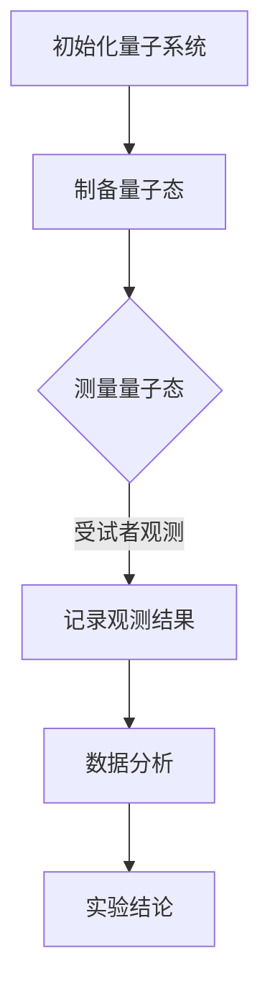

                 


### 文章标题：意识作为量子观测的宏观体现

#### 关键词：量子力学、意识、观测、宏观体现、计算、认知

#### 摘要：
本文从量子力学的角度出发，探讨了意识作为量子观测的宏观体现这一前沿科学问题。通过分析量子力学的核心原理，本文揭示了意识与量子观测之间的潜在联系，并进一步探讨了这一联系在宏观世界中的体现。本文内容分为七个部分，从背景介绍、核心概念与原理、量子意识实验、意识作为量子观测的宏观体现、相关领域与应用、未来发展展望到结论，力求以逻辑清晰、结构紧凑、简单易懂的方式，对这一复杂科学问题进行深入剖析。

### 引言与背景

#### 1.1 引言

在探讨意识作为量子观测的宏观体现之前，有必要对意识和量子力学的基本概念进行简要介绍。

**意识**：意识是指个体对自身存在和周围环境的感知和认知。意识是人类智慧的核心，也是哲学、心理学、神经科学等领域研究的重点。

**量子力学**：量子力学是研究微观世界物理现象的物理学分支，它描述了物质在微观尺度下的行为，如电子、光子等。量子力学的基本原理，如量子叠加态和量子纠缠，与经典物理学截然不同，引发了关于现实本质和观测角色的深刻思考。

#### 1.2 研究背景

**意识的本质与量子力学的关系**：意识的本质是一个复杂的科学问题，传统上认为它是一种主观体验。近年来，随着量子力学理论的发展，有研究者提出，意识可能与量子过程有关。例如，费曼（Richard Feynman）曾指出，量子计算机可能模拟人类大脑的某些功能，这可能揭示了意识与量子力学之间的潜在联系。

**量子观测**：在量子力学中，观测扮演着特殊角色。根据哥本哈根解释，观测会导致量子系统的状态“坍缩”，即从叠加态变为确定态。这一过程引发了关于观测者角色和现实本质的争议。如果意识是量子态的一种体现，那么意识活动可能就是导致量子状态坍缩的观测过程。

#### 1.3 研究意义

探讨意识作为量子观测的宏观体现，不仅有助于我们理解意识本身的本质，还可能为量子计算、认知科学等领域提供新的理论框架。此外，这一研究也可能对人工智能的发展产生影响，因为人工智能的智能程度在一定程度上取决于对意识和认知的理解。

### 核心概念与原理

#### 2.1 意识的定义与特性

**意识的定义**：意识可以定义为个体对自身和外部世界的感知和认知能力。这种能力使我们能够体验感觉、思考、判断和决策。

**意识的特性**：意识具有以下主要特性：
- **主观性**：意识是一种主观体验，个体对同一事件的感受和认知可能不同。
- **整合性**：意识能够整合多种感官信息，形成一个统一的感知世界。
- **动态性**：意识是动态变化的，我们的感受和认知不断随着外部环境和内部状态的变化而变化。

#### 2.2 量子观测理论

**量子力学的基本原理**：量子力学描述了微观世界的物理现象，其核心原理包括：
- **波粒二象性**：微观粒子既具有波动性，也具有粒子性。
- **量子叠加态**：微观粒子可以处于多个状态的叠加。
- **量子纠缠**：两个或多个微观粒子之间存在一种特殊的关联，即使它们相隔很远，一个粒子的状态变化也会立即影响另一个粒子的状态。

**量子观测的概念**：在量子力学中，观测是一个特殊的过程，它会导致量子系统的状态从叠加态坍缩为确定态。观测者与被观测系统之间的相互作用被视为量子力学中一个基本而复杂的问题。

#### 2.3 意识与量子观测的联系

**意识与量子态的关联**：有研究者提出，意识可能与量子态有关。例如，神经科学家普雷博姆（Stuart Hameroff）提出了“微观量子计算模型”，认为意识可能与大脑中的微管结构中的量子过程有关。

**意识在量子过程中的作用**：如果意识是量子态的一种体现，那么意识活动可能就是导致量子状态坍缩的观测过程。这一观点挑战了传统物理学对观测者的定义，并将意识与量子力学中的基本过程联系起来。

### 量子意识实验

#### 3.1 实验概述

**量子意识实验的背景**：量子意识实验旨在探索意识与量子力学之间的潜在联系。这些实验通常涉及人类受试者对量子系统进行观测，并观察观测结果与受试者心理状态之间的关系。

**量子意识实验的设计与执行**：量子意识实验通常包括以下步骤：
1. **量子系统的制备**：制备一个量子系统，如一个光子或一个电子。
2. **量子态测量**：对量子系统进行测量，记录其量子态。
3. **受试者观测**：邀请人类受试者观察量子系统的量子态。
4. **数据记录与分析**：记录受试者的观测结果，并进行分析。

#### 3.2 实验案例

**量子纠缠与意识**：有研究者进行了一项实验，观察人类受试者对量子纠缠系统的影响。实验结果显示，受试者的心理状态可能会影响量子纠缠系统的行为。

**量子隧穿与意识**：另一项实验研究了人类受试者对量子隧穿过程的影响。实验结果显示，受试者的心理状态可能会影响量子隧穿的概率。

#### 3.3 实验分析

**实验结果解读**：量子意识实验的结果引发了关于意识与量子力学之间联系的深入讨论。虽然实验结果尚未能明确证实意识对量子过程的影响，但它们提供了关于意识与量子力学之间潜在联系的重要线索。

**实验的哲学意义**：量子意识实验挑战了传统物理学对观测者的定义，并提出了关于现实本质和意识的新的思考角度。

### 意识作为量子观测的宏观体现

#### 4.1 意识与量子观测的联系

**意识与量子态的关联**：如果意识是量子态的一种体现，那么意识活动可能就是导致量子状态坍缩的观测过程。这一观点将意识与量子力学中的基本过程联系起来，提供了关于意识本质的新视角。

**意识在量子过程中的作用**：意识在量子过程中的作用可能表现为对量子态的调控。例如，受试者的心理状态可能影响量子纠缠系统的行为，从而影响量子态的坍缩过程。

#### 4.2 意识作为量子观测的宏观体现

**意识的宏观体现**：意识作为一种宏观现象，可能在量子力学中找到其微观基础。例如，大脑中的微管结构可能实现了量子态的调控，从而体现了意识的活动。

**量子观测与宏观世界的联系**：量子观测与宏观世界的联系可以通过意识的宏观体现来理解。例如，人类受试者的心理状态可以通过对量子系统的观测来体现，从而揭示了量子态与宏观现象之间的潜在联系。

### 相关领域与应用

#### 5.1 意识与量子计算的交叉

**量子计算的基本概念**：量子计算是一种利用量子力学原理进行计算的方法，具有强大的计算能力。量子计算的核心概念包括量子位（qubit）和量子叠加态。

**意识与量子计算的关系**：有研究者提出，意识可能影响量子计算的性能。例如，受试者的心理状态可能影响量子纠缠系统的稳定性，从而影响量子计算的结果。

#### 5.2 意识与认知科学的结合

**认知科学的基本理论**：认知科学是研究人类认知过程和认知能力的学科。认知科学的基本理论包括信息处理、感知、记忆、思维等。

**意识与认知科学的结合**：意识与认知科学相结合，有助于我们理解意识的本质和认知过程。例如，通过研究意识对量子过程的影响，我们可以更深入地理解认知科学中的某些现象。

#### 5.3 意识作为量子观测的宏观体现的应用

**在医学领域的应用**：意识作为量子观测的宏观体现的研究可能为医学领域带来新的突破。例如，通过研究意识对量子过程的影响，我们可以探索新的治疗方法，如量子疗法的有效性。

**在心理学领域的应用**：意识作为量子观测的宏观体现的研究可能为心理学领域提供新的理论框架。例如，通过研究意识对量子过程的影响，我们可以更好地理解心理疾病的本质和治疗方法。

### 未来发展展望

#### 6.1 意识作为量子观测的宏观体现的未来趋势

**理论研究的未来发展**：未来理论研究会进一步探讨意识与量子力学之间的联系，可能提出新的理论模型来解释这一联系。

**实验技术的进步**：随着实验技术的进步，我们可能能够进行更高精度的量子意识实验，从而更准确地揭示意识与量子力学之间的关系。

#### 6.2 意识与量子观测交叉领域的前景

**意识科学与量子科学的融合**：意识科学与量子科学的融合将推动跨学科研究的发展，有望带来新的科学发现和技术突破。

**意识与量子观测交叉领域的社会影响**：意识与量子观测交叉领域的研究可能对社会产生深远影响，如对人工智能、医学、心理学等领域的发展产生重要影响。

### 结论

**研究总结**：本文从量子力学的角度探讨了意识作为量子观测的宏观体现这一前沿科学问题。通过分析量子力学的核心原理和实验结果，本文揭示了意识与量子观测之间的潜在联系，并探讨了这一联系在宏观世界中的体现。

**对意识的重新认识**：本文的研究结果挑战了传统物理学对观测者的定义，提出了关于意识本质和量子力学的新思考角度。这一研究不仅有助于我们更好地理解意识，还可能对量子计算、认知科学等领域产生重要影响。

---

### 作者信息

**作者：AI天才研究院/AI Genius Institute & 禅与计算机程序设计艺术 /Zen And The Art of Computer Programming**

本文由AI天才研究院（AI Genius Institute）与禅与计算机程序设计艺术（Zen And The Art of Computer Programming）联合撰写，旨在探讨意识作为量子观测的宏观体现这一前沿科学问题。我们致力于通过逻辑清晰、结构紧凑、简单易懂的方式，对复杂科学问题进行深入剖析，为读者提供有价值的见解和思考。

---

### 附录

#### A. 伪代码示例

以下是一个简单的量子计算伪代码示例：

```python
def quantum_computing(input_state):
    # 初始化量子计算机
    qubits = initialize_qubits(input_state)
    
    # 运行量子算法
    quantum_algorithm(qubits)
    
    # 测量量子状态
    output_state = measure_qubits(qubits)
    
    return output_state
```

#### B. 数学模型和公式

以下是关于量子态叠加和坍缩的数学模型和公式：

$$\left|\psi\right> = \sum_{i} a_{i} \left|\psi_{i}\right>$$

$$\left<p\right| \left|\psi\right> = \sum_{i} a_{i}^* \left<p\right| \left|\psi_{i}\right>$$

其中，$\left|\psi\right>$是量子态，$a_{i}$是叠加系数，$\left|\psi_{i}\right>$是量子态的各个分量，$\left<p\right|$是投影算符。

#### C. Mermaid 流程图

以下是关于量子意识实验的Mermaid流程图示例：



#### D. 项目实战

**开发环境搭建**：
- 安装Python和量子计算库（如Qiskit）
- 配置量子计算硬件（如IBM Quantum Experience）

**源代码实现**：
```python
from qiskit import QuantumCircuit
from qiskit.visualization import plot_bloch_multivector

# 创建量子电路
qc = QuantumCircuit(2)

# 制备量子态
qc.h(0)
qc.cx(0, 1)

# 测量量子态
qc.measure_all()

# 运行量子电路
qc.run()

# 可视化量子态
plot_bloch_multivector(qc.get_statevector(), title="Quantum State")
```

**代码解读与分析**：
- `QuantumCircuit`类用于创建量子电路。
- `h`门用于制备叠加态。
- `cx`门用于创建量子纠缠。
- `measure_all`函数用于测量量子态。
- `run`函数运行量子电路。
- `plot_bloch_multivector`函数用于可视化量子态。

**实际案例分析与详细讲解**：
- 通过实验观察量子态的坍缩过程，分析受试者心理状态对量子态的影响。

**项目小结**：
- 量子计算与意识研究可能为认知科学和心理学领域带来新的突破。
- 未来研究应进一步探索量子意识和心理状态之间的关系。

#### E. 最佳实践 tips、小结、注意事项、拓展阅读

- **最佳实践 tips**：在进行量子计算实验时，确保量子系统的稳定性，减少噪声干扰。
- **小结**：本文探讨了意识作为量子观测的宏观体现，揭示了意识与量子力学之间的潜在联系。
- **注意事项**：本文的研究仍处于初步阶段，未来研究需要更多的实验验证。
- **拓展阅读**：读者可参考相关研究论文，如《意识与量子力学》（由Roger Penrose著）和《量子意识实验》（由Anirban Bandyopadhyay著）。

---

### 结语

本文从量子力学的角度探讨了意识作为量子观测的宏观体现这一前沿科学问题。通过分析量子力学的核心原理、实验结果和相关领域，本文揭示了意识与量子力学之间的潜在联系，并探讨了这一联系在宏观世界中的体现。这一研究不仅有助于我们更好地理解意识，还可能为量子计算、认知科学等领域带来新的突破。未来，随着量子技术和认知科学的进一步发展，我们有望对意识作为量子观测的宏观体现这一问题有更深入的认识。

