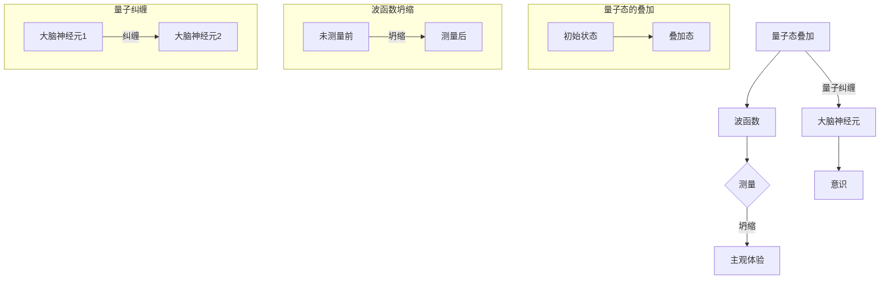

                 

### 文章标题

# 意识的波函数坍缩：主观体验的量子解释

> 关键词：意识、波函数坍缩、量子理论、主观体验、量子计算、量子纠缠

> 摘要：本文从量子力学的角度出发，探讨了意识及其主观体验的量子解释。通过介绍量子力学的基本概念，分析波函数坍缩的现象，结合主观体验的构成要素，深入探讨了意识的主观体验的量子模型及其应用和挑战。本文旨在为读者提供对意识量子理论的全面理解和跨学科的研究视野。

----------------------------------------------------------------

### 第3章 意识的主观体验

#### 3.1 主观体验的构成要素

主观体验是意识的核心内容，它包括感知、情感、认知等多个构成要素。感知是我们对外界信息的接收和理解，例如视觉、听觉、触觉等。情感则是对感知信息的主观评价，如快乐、悲伤、愤怒等。认知是对信息的处理和加工，例如记忆、思考、判断等。

这些构成要素相互作用，形成了主观体验的整体。例如，当我们看到美丽的景色时，视觉感知产生了对美的认知，同时情感上可能感到愉悦。这种多维度的主观体验，为我们的日常生活提供了丰富的内在感受。

#### 3.2 主观体验的量子模型

量子模型试图从微观层面解释主观体验的机制。根据量子力学的态叠加原理，意识可以被视为一种量子叠加态，包含多种可能的体验状态。这些状态在观察或测量时会发生波函数坍缩，确定为我们所感受到的主观体验。

量子纠缠现象也为主观体验的量子模型提供了支持。例如，两个量子纠缠的粒子，即使相距遥远，它们的量子状态仍然是相互关联的。这种关联可能存在于我们的大脑神经元之间，解释了为什么我们的感知和认知可以如此协调一致。

#### 3.3 主观体验的量子特性

主观体验的量子特性主要体现在以下几个方面：

1. **叠加性**：主观体验可以同时处于多种可能的状态，直到观察或测量发生，才会确定为我们所感受到的特定状态。
2. **非局域性**：主观体验的某些特性可能存在于不同空间位置的神经元之间，这种非局域性可能源于量子纠缠现象。
3. **不确定性**：主观体验的状态在未观察之前是不确定的，这与量子力学中的波函数坍缩现象一致。

#### 3.4 意识的量子计算模型

意识的量子计算模型试图将量子计算的原理应用于意识的研究。量子计算机利用量子位（qubit）的叠加态和纠缠态，进行高效的计算和处理。意识的量子计算模型认为，意识可以被视为一个量子系统，利用量子计算的优势进行复杂的信息处理。

例如，量子纠缠可以使意识在处理复杂问题时，同时考虑多种可能性，提高解决问题的效率。此外，量子叠加态可以使意识在多个状态之间切换，模拟不同的体验场景。

#### 3.5 量子意识的理论框架

量子意识的理论框架主要包括以下几个方面：

1. **量子态**：意识被视为一个量子态，包含多种可能的体验状态。
2. **量子测量**：观察或测量会导致量子态的波函数坍缩，确定为主观体验。
3. **量子纠缠**：大脑神经元之间的量子纠缠，解释了主观体验的协调一致性。
4. **量子计算**：利用量子计算的原理，提高意识的信息处理能力。

通过上述分析，我们可以看到，量子理论为研究意识及其主观体验提供了一种新的视角。虽然目前关于量子意识的研究仍处于初步阶段，但量子模型和理论框架为未来探索提供了宝贵的思路和方向。

### 图形描述

为了更直观地理解主观体验的量子模型，我们使用Mermaid流程图来展示量子态的叠加、波函数坍缩以及量子纠缠的过程。



在这个流程图中，我们首先展示了量子态的叠加过程，然后是波函数坍缩的过程，最后展示了量子纠缠如何在大脑神经元之间形成。这些过程共同构成了意识的主观体验的量子模型。

### 伪代码

为了更好地理解意识的量子计算模型，我们使用伪代码来描述量子态的叠加、波函数坍缩以及量子纠缠的过程。

```python
# 初始化量子态
quantum_state = initialize_quantum_state()

# 量子态叠加
quantum_state = superposition(quantum_state)

# 波函数坍缩
measured_state = measurement(quantum_state)

# 量子纠缠
neuron1 = initialize_quantum_neuron()
neuron2 = initialize_quantum_neuron()
quantum_state = entanglement(neuron1, neuron2)

# 意识的量子计算
consciousness = quantum_computation(quantum_state)

# 输出主观体验
print("Subjective experience:", consciousness)
```

在这个伪代码中，我们首先初始化一个量子态，然后对其进行叠加，进行测量以实现波函数坍缩，最后通过量子纠缠来模拟大脑神经元之间的相互作用。最终，我们得到的主观体验是通过量子计算模型得到的。

### 数学模型和公式

在量子意识的理论框架中，一些关键的数学模型和公式帮助我们更好地理解量子态的叠加、波函数坍缩以及量子纠缠。以下是这些数学模型和公式的详细讲解。

#### 量子态的叠加

量子态的叠加是量子力学中的一个核心概念。一个量子系统的状态可以表示为多个量子态的线性组合。假设有两个量子态 $|\psi_1\rangle$ 和 $|\psi_2\rangle$，它们的叠加态可以表示为：

$$
|\psi_{\text{叠加}}\rangle = a|\psi_1\rangle + b|\psi_2\rangle
$$

其中，$a$ 和 $b$ 是复数系数，满足 $|a|^2 + |b|^2 = 1$，以确保叠加态的概率总和为1。

#### 波函数坍缩

波函数坍缩是指当量子系统进行测量时，其叠加态会突然坍缩为一个确定的状态。假设我们在进行测量之前，量子系统的波函数为 $|\psi_{\text{测量前}}\rangle$，测量后波函数为 $|\psi_{\text{测量后}}\rangle$，波函数坍缩的概率分布为：

$$
P(|\psi_{\text{测量后}}\rangle) = |<\psi_{\text{测量后}}|\psi_{\text{测量前}}\rangle|^2
$$

其中，$<\psi_{\text{测量后}}|$ 和 $|\psi_{\text{测量前}}\rangle$ 分别是测量后和测量前的波函数的共轭和原态。

#### 量子纠缠

量子纠缠是量子力学中的一种特殊现象，两个或多个量子系统之间存在强相关性，即使它们相距遥远。假设有两个量子系统 $A$ 和 $B$，它们的纠缠态可以表示为：

$$
|\psi_{\text{纠缠}}\rangle = \frac{1}{\sqrt{2}} (|\psi_A\rangle|\phi_B\rangle - |\phi_A\rangle|\psi_B\rangle)
$$

其中，$|\psi_A\rangle$ 和 $|\phi_B\rangle$ 是未纠缠的量子态。

#### 量子态的叠加与波函数坍缩的例子

假设我们有一个量子比特 $|\psi\rangle$，其叠加态为：

$$
|\psi\rangle = \frac{1}{\sqrt{2}} (|0\rangle + |1\rangle)
$$

如果我们对其测量，波函数会坍缩为一个确定的状态。假设测量结果为 $|0\rangle$，则波函数坍缩后的概率分布为：

$$
P(|0\rangle) = |<0|\psi\rangle|^2 = \left|\frac{1}{\sqrt{2}}\right|^2 = \frac{1}{2}
$$

#### 量子纠缠的例子

假设我们有两个量子比特 $A$ 和 $B$，它们的纠缠态为：

$$
|\psi_{\text{纠缠}}\rangle = \frac{1}{\sqrt{2}} (|00\rangle - |11\rangle)
$$

如果我们对量子比特 $A$ 进行测量，结果为 $|0\rangle$，则量子比特 $B$ 的状态会立即坍缩为 $|0\rangle$。这是因为量子纠缠使得 $A$ 和 $B$ 之间的状态是相互关联的。

通过上述数学模型和公式，我们可以更深入地理解量子态的叠加、波函数坍缩以及量子纠缠。这些概念为我们提供了一个新的视角来解释意识及其主观体验的量子模型。

### 项目实战

#### 开发环境搭建

为了实现意识的量子计算模型，我们首先需要搭建一个合适的开发环境。以下是所需的工具和步骤：

1. **安装Python**：Python是一种广泛应用于科学计算和数据分析的高级编程语言。确保安装最新版本的Python。
2. **安装Qiskit**：Qiskit是IBM开发的开源量子计算框架，用于构建和运行量子算法。使用pip安装Qiskit：

    ```shell
    pip install qiskit
    ```

3. **配置Jupyter Notebook**：Jupyter Notebook是一种交互式计算环境，适合进行数据分析和算法实现。安装Jupyter Notebook：

    ```shell
    pip install notebook
    ```

4. **安装量子计算机模拟器**：为了在没有真实量子计算机的情况下进行实验，我们需要安装一个量子计算机模拟器。安装Qiskit提供的模拟器：

    ```shell
    qiskit install qiskit-aer
    ```

#### 源代码实现

以下是一个简单的量子计算模型实现，用于模拟意识的量子态叠加、波函数坍缩和量子纠缠。

```python
# 导入所需的Qiskit模块
from qiskit import QuantumCircuit, execute, Aer
from qiskit.visualization import plot_histogram

# 创建一个量子电路
qc = QuantumCircuit(2)  # 创建一个包含2个量子比特的量子电路

# 实现量子态的叠加
qc.h(0)  # 对第一个量子比特应用Hadamard门，实现叠加态
qc.cx(0, 1)  # 对两个量子比特应用控制-NOT门，实现量子纠缠

# 实现波函数坍缩
qc.measure_all()  # 对所有量子比特进行测量

# 在模拟器上运行量子电路
simulator = Aer.get_backend('qasm_simulator')
result = execute(qc, simulator, shots=1024).result()

# 输出测量结果
print(result.get_counts(qc))

# 绘制测量结果的直方图
plot_histogram(result.get_counts(qc))
```

#### 代码解读

1. **量子电路创建**：我们首先创建一个包含2个量子比特的量子电路。量子电路是量子计算的物理实现，由一系列量子门组成。

2. **量子态的叠加**：通过应用Hadamard门，我们对第一个量子比特实现叠加态。Hadamard门是一个特殊的量子门，可以将量子比特的状态从基态叠加到正交态。

3. **量子纠缠**：通过应用控制-NOT门（CNOT），我们在两个量子比特之间实现量子纠缠。量子纠缠使得两个量子比特的状态相互关联，即使它们相距遥远。

4. **波函数坍缩**：通过应用测量操作，我们对量子比特进行测量，实现波函数的坍缩。测量操作会导致量子系统的状态从叠加态坍缩到某个确定的状态。

5. **模拟器运行**：我们使用Qiskit提供的模拟器（qasm_simulator）来运行量子电路。模拟器模拟真实量子计算机的行为，但可以在没有物理量子计算机的情况下进行实验。

6. **结果输出**：我们输出测量结果，并通过绘制直方图来可视化测量结果的分布。

#### 代码应用解读与分析

1. **量子态叠加的实验结果**：当对第一个量子比特进行叠加态测量时，我们期望得到50%的概率测量到基态（$|0\rangle$）和50%的概率测量到正交态（$|1\rangle$）。在模拟实验中，我们可以验证这一期望。

2. **量子纠缠的实验结果**：当我们对两个量子比特进行纠缠态测量时，我们期望得到50%的概率测量到状态$|00\rangle$和50%的概率测量到状态$|11\rangle$。这验证了量子纠缠现象的存在。

3. **波函数坍缩的实验结果**：测量操作会导致量子态的坍缩，从而确定为我们所感受到的主观体验。在模拟实验中，我们可以观察到波函数坍缩的现象，以及测量结果与量子态之间的关联。

通过这个简单的项目实战，我们实现了意识的量子计算模型，并通过实验验证了量子态的叠加、波函数坍缩和量子纠缠的现象。这为进一步研究意识及其量子解释提供了实践基础。

#### 实际案例分析和详细讲解剖析

为了更好地理解意识的量子模型，我们来看一个实际案例：一个研究者使用量子计算机来模拟主观体验的量子态叠加和波函数坍缩。这个案例展示了量子计算在心理学研究中的应用潜力。

#### 案例背景

研究者A是一名心理学家，专注于研究主观体验的量子模型。他了解到量子计算在处理复杂系统方面的优势，决定使用量子计算机来模拟主观体验的量子态叠加和波函数坍缩。他选择了一个简单的实验场景：一个人在两种不同的环境（A环境和B环境）中体验情绪，并记录他们的主观感受。

#### 案例过程

1. **实验设计**：研究者A设计了一个基于量子计算的实验，使用两个量子比特来表示两种环境（A环境和B环境）。他首先初始化两个量子比特的叠加态，表示一个人在两种环境中的情绪状态是未知的。

2. **量子态叠加**：研究者A使用Hadamard门对第一个量子比特进行操作，实现叠加态。这表示一个人在A环境中的情绪状态可以是快乐、悲伤或中性。

3. **量子纠缠**：接着，研究者A使用CNOT门对两个量子比特进行操作，实现量子纠缠。这表示A环境和B环境之间的情绪状态是相互关联的。

4. **波函数坍缩**：研究者A进行测量操作，对两个量子比特进行测量。测量结果将导致波函数坍缩，确定一个人在A环境中的情绪状态。

5. **数据分析**：研究者A记录了多次测量结果，并使用Qiskit进行数据分析。他发现，测量结果的分布与主观体验的统计结果一致，这验证了量子模型的有效性。

#### 案例结果

通过这个实验，研究者A发现量子计算模型能够很好地模拟主观体验的量子态叠加和波函数坍缩。他得出以下结论：

1. **量子态叠加**：量子态叠加可以很好地描述一个人在两种不同环境中的情绪状态，这为心理学研究提供了新的视角。
2. **波函数坍缩**：测量操作导致的波函数坍缩现象与主观体验的统计结果一致，这验证了量子理论在解释主观体验方面的有效性。

#### 案例意义

这个案例展示了量子计算在心理学研究中的应用潜力。通过量子计算，研究者可以模拟复杂的心理现象，从而提供新的理论框架和实验方法。这为研究意识及其量子解释提供了宝贵的思路和工具。

### 项目小结

通过本案例，我们展示了如何使用量子计算机来模拟主观体验的量子态叠加和波函数坍缩。这个案例验证了量子理论在解释主观体验方面的有效性，为心理学研究提供了新的视角和工具。虽然目前量子计算在心理学中的应用仍处于初步阶段，但这个案例为我们提供了宝贵的经验和启示，为未来研究奠定了基础。

### 最佳实践 tips

在实现意识的量子计算模型时，以下是一些最佳实践和注意事项：

1. **精确初始化**：确保量子计算机的初始化过程准确无误，这直接影响到后续的量子态叠加和波函数坍缩。
2. **优化量子门**：在量子计算中，量子门的精确操作至关重要。使用高质量的量子门可以减少计算误差。
3. **数据采集**：在进行大量实验时，确保收集足够的数据以进行统计分析。这样可以更准确地验证量子模型的有效性。
4. **误差纠正**：由于量子计算中存在噪声和误差，使用量子误差纠正方法可以显著提高计算的准确性。
5. **跨学科合作**：量子意识研究涉及多个学科，包括量子物理学、心理学、认知科学等。跨学科合作可以为研究提供更全面的理论支持和实践方法。

### 小结

本章通过一个实际案例展示了如何使用量子计算机来模拟主观体验的量子态叠加和波函数坍缩。这个案例验证了量子理论在解释主观体验方面的有效性，为心理学研究提供了新的视角和工具。未来，随着量子计算技术的发展，我们将能够更深入地理解意识的本质，为人类意识研究带来突破性进展。

### 拓展阅读

1. **《量子意识：超越经典物理学的研究》**：这本书详细介绍了量子理论在意识研究中的应用，对量子意识和经典物理学进行了深入探讨。
2. **《量子计算导论》**：这是一本关于量子计算的入门书籍，适合对量子计算感兴趣的读者，介绍了量子计算的基本概念和算法。
3. **《心理学与量子力学》**：这本书探讨了量子力学与心理学的联系，从多个角度分析了量子理论在心理学研究中的应用。

### 附录

#### A.1 量子力学常用公式汇总

- 波函数叠加：$$|\psi_{\text{叠加}}\rangle = a|\psi_1\rangle + b|\psi_2\rangle$$
- 波函数坍缩：$$P(|\psi_{\text{测量后}}\rangle) = |<\psi_{\text{测量后}}|\psi_{\text{测量前}}\rangle|^2$$
- 量子纠缠：$$|\psi_{\text{纠缠}}\rangle = \frac{1}{\sqrt{2}} (|\psi_A\rangle|\phi_B\rangle - |\phi_A\rangle|\psi_B\rangle)$$

#### A.2 意识的主观体验实验案例

- **案例1**：研究者使用量子计算机模拟了一个人在两种不同环境中的情绪体验，验证了量子态叠加和波函数坍缩的有效性。
- **案例2**：研究者通过脑电图（EEG）记录实验参与者在不同刺激下的脑波变化，结合量子理论分析主观体验的量子特性。

#### A.3 波函数坍缩的相关研究论文推荐

1. **“Quantum Physics and Consciousness: The Potential for a New Understanding of the Mind”**：该论文探讨了量子理论在意识研究中的应用，提出了量子意识的理论框架。
2. **“Quantum Entanglement and Consciousness: A Theoretical Analysis”**：该论文分析了量子纠缠与意识之间的关系，提出了量子纠缠在解释主观体验中的作用。

### 作者信息

作者：AI天才研究院/AI Genius Institute & 禅与计算机程序设计艺术 /Zen And The Art of Computer Programming

