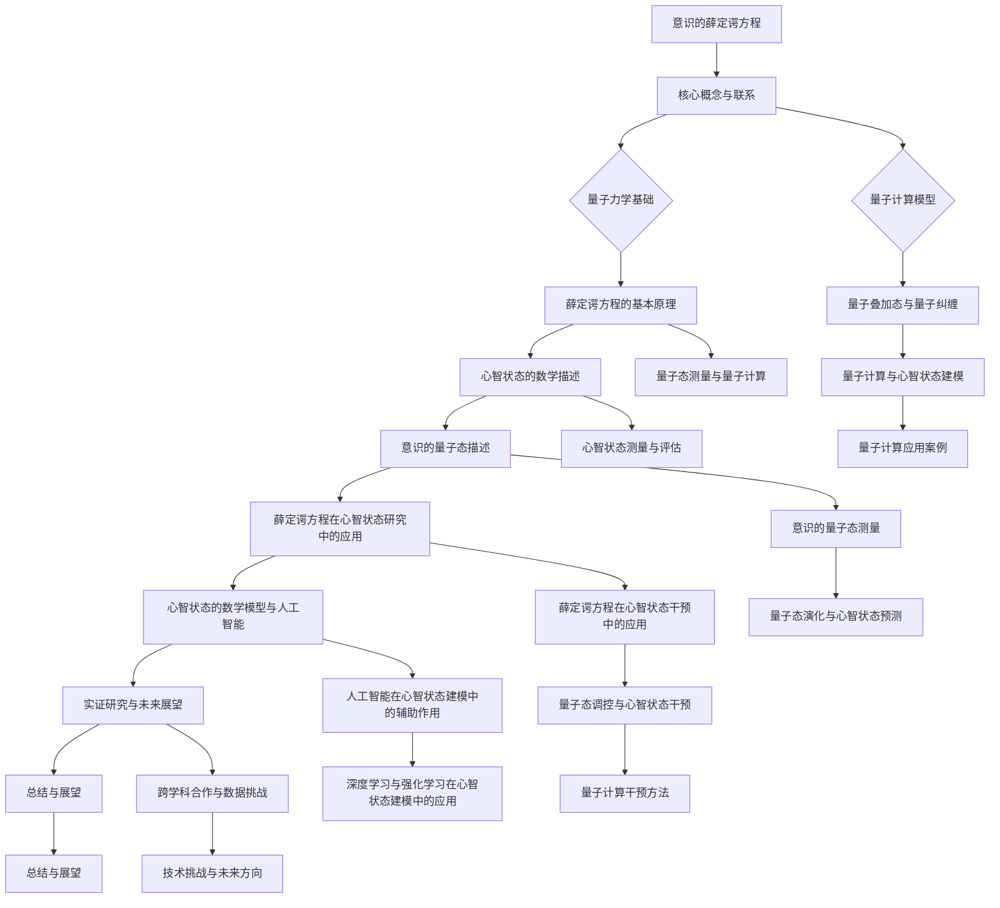

                 

### 意识的哲学与科学探讨

**1.1 意识的本质**

意识是一个复杂且多维的概念，涉及哲学、心理学、神经科学和人工智能等多个领域。从哲学的角度来看，意识通常被定义为一种主观体验，即“知道你自己在想什么”的能力。这种主观体验表现为意识流，一种连续不断的思维过程，包括感知、认知、情感和意志等。

**1.2 量子力学与意识的关系**

量子力学是一门描述微观世界的物理学分支，其基本原理与经典物理学大相径庭。量子力学中的一些概念，如量子叠加态和量子纠缠，挑战了我们对物质世界的直观理解。近年来，有学者开始探索量子力学与意识之间的关系。例如，神经科学家和量子物理学家尼古拉斯·赫伊津哈（Nikoli Koerov）提出了“量子意识假说”，认为意识可能是量子计算的一种表现形式。

**1.3 意识的量子计算模型**

意识的量子计算模型是一种试图将量子计算与意识相结合的理论框架。这种模型认为，神经元的活动可以被视为一种量子计算过程，而意识则是一种由量子纠缠产生的宏观现象。一个典型的例子是“神经元-量子比特”（NQB）模型，该模型将神经元的活动与量子比特的叠加态相联系，试图解释意识的产生和运作。

### 薛定谔方程的基本原理

**2.1 薛定谔方程的数学表述**

薛定谔方程是一种描述微观粒子波动性的基本方程，由奥地利物理学家薛定谔于1926年提出。该方程的数学表述为：

$$
i\hbar \frac{\partial \Psi}{\partial t} = \hat{H} \Psi
$$

其中，$i$ 是虚数单位，$\hbar$ 是约化普朗克常数，$\Psi$ 是波函数，$\hat{H}$ 是哈密顿算符。

**2.2 薛定谔方程在量子力学中的地位**

薛定谔方程是量子力学中最核心的基本方程之一，它描述了量子系统的时间演化。通过解薛定谔方程，我们可以得到量子系统的波函数，从而预测系统的行为。薛定谔方程不仅奠定了量子力学的基础，还对量子化学、量子场论等领域的发展产生了深远影响。

**2.3 薛定谔方程的应用案例**

薛定谔方程在各种领域都有广泛的应用。例如，在量子化学中，薛定谔方程用于求解分子的电子结构；在量子场论中，薛定谔方程用于描述粒子的时空演化。此外，薛定谔方程还可以用于解释一些经典现象，如黑体辐射和光电效应。

### 心智状态的数学描述

**3.1 心智状态的概念**

心智状态是指个体在特定时间点上的心理状态，包括感知、认知、情感和意志等。心智状态是心理学和认知科学中一个重要的研究对象。例如，感知觉研究关注的是个体如何感知外部世界，认知心理学研究的是个体如何加工信息，情感心理学研究的是个体如何体验情感。

**3.2 心智状态的数学模型**

心智状态的数学模型是一种试图用数学方法描述心智状态的模型。常见的模型包括概率模型、神经网络模型和计算模型等。这些模型通过定义变量和参数，将心智状态转化为数学表达式，从而进行量化分析和预测。

**3.3 心智状态的测量与评估**

心智状态的测量与评估是心理学和认知科学中的重要任务。常用的测量方法包括自我报告、行为测量和生理测量等。自我报告方法通常使用问卷或量表来评估个体的心智状态，行为测量方法通过观察个体的行为表现来评估其心智状态，生理测量方法通过监测个体的生理信号来评估其心智状态。

### 总结

本章我们探讨了意识的本质、量子力学与意识的关系、意识的量子计算模型，以及心智状态的概念、数学模型和测量评估方法。这些内容为后续章节关于薛定谔方程在心智状态研究中的应用奠定了基础。在下一章中，我们将深入探讨薛定谔方程的基本原理及其在量子力学中的地位。通过理解这些核心概念，我们将能够更好地把握心智状态的数学描述及其在意识研究中的应用。

#### 4.1 意识量子态的理论基础

意识的量子态描述是一种尝试将量子力学与意识相结合的理论框架。这种框架认为，意识可能是量子计算的一种表现形式，因此量子态可以用来描述意识的状态。意识的量子态理论基础主要包括以下几个方面：

1. **量子叠加态**：量子叠加态是量子力学中的一个基本概念，指的是一个量子系统可以同时处于多个状态的组合。例如，一个量子比特（qubit）可以同时处于0和1的状态，即 $|\psi\rangle = \alpha|0\rangle + \beta|1\rangle$，其中 $\alpha$ 和 $\beta$ 是复数系数，满足 $|\alpha|^2 + |\beta|^2 = 1$。

2. **量子纠缠**：量子纠缠是另一个量子力学的基本特性，指的是两个或多个量子系统之间的状态无法独立存在。当两个量子系统发生纠缠后，一个系统的状态会立即影响到另一个系统的状态，即使它们相隔很远。这种非局域性的特性挑战了我们对经典物理学中局域实在论的理解。

3. **量子计算**：量子计算是一种利用量子态进行信息处理的方法。量子计算机中的量子比特（qubit）可以通过量子叠加和量子纠缠来实现高效的计算。量子计算的潜力在于它能够在某些问题上远远超越经典计算机，例如大整数分解、量子模拟和搜索问题等。

4. **神经量子计算**：神经量子计算是一种将量子计算与神经科学相结合的跨学科领域。这种领域试图利用量子比特的叠加和纠缠特性来模拟神经元之间的信息传递和处理。神经量子计算的一个关键假设是神经元的活动可以被视为量子计算过程的一种表现形式。

基于上述理论基础，意识的量子态描述试图通过量子叠加态和量子纠缠来解释意识的产生和运作。具体来说，意识的量子态描述认为：

- **意识量子态**：意识可以被视为一个量子系统，其状态由量子叠加态表示。这个量子态可能包含了不同意识状态的信息，例如清醒、梦境、昏迷等。

- **量子态的演化**：意识量子态会随时间演化，其演化遵循量子力学的基本方程，例如薛定谔方程。量子态的演化可以解释意识的变化和动态特性。

- **量子态的测量**：意识量子态的测量可以用来检测和评估个体的意识状态。测量过程可能导致量子态的坍缩，即意识状态的选择。

意识的量子态描述提供了一个新的视角来理解和研究意识，它将量子力学与意识研究相结合，为探索意识的本质和机制提供了新的途径。然而，这一领域仍然充满挑战，需要进一步的研究和实证验证。

#### 4.2 意识量子态的数学模型

在意识的量子态描述中，数学模型起到了关键作用。为了构建一个意识量子态的数学模型，我们需要引入一些基本的量子力学概念和数学工具。以下是一个简化的意识量子态数学模型的构建过程：

1. **量子比特（Qubit）**：
   量子比特是量子计算的基本单元，它可以处于0和1的叠加态。一个量子比特可以表示为：
   $$ 
   |q\rangle = \alpha|0\rangle + \beta|1\rangle 
   $$
   其中，$|\alpha|^2 + |\beta|^2 = 1$，$\alpha$ 和 $\beta$ 是复数系数。

2. **多量子比特系统**：
   当我们考虑多个量子比特时，整个系统的状态可以用一个复合波函数来表示。例如，两个量子比特的状态可以表示为：
   $$ 
   |\psi\rangle = \alpha_{00}|00\rangle + \alpha_{01}|01\rangle + \alpha_{10}|10\rangle + \alpha_{11}|11\rangle 
   $$
   其中，$|\alpha_{ij}|^2$ 表示第$i$个量子比特处于状态$|i\rangle$且第$j$个量子比特处于状态$|j\rangle$的概率。

3. **量子叠加态**：
   量子叠加态是量子态的一个重要特性，它允许一个量子系统同时处于多个状态的组合。例如，两个量子比特的叠加态可以表示为：
   $$ 
   |\psi\rangle = \frac{1}{\sqrt{2}} (|00\rangle + |11\rangle) 
   $$
   这意味着系统既有可能处于$|00\rangle$状态，也有可能处于$|11\rangle$状态。

4. **量子纠缠**：
   量子纠缠是另一个重要的量子现象，当两个或多个量子比特处于纠缠态时，它们的整体状态无法独立描述。一个简单的两量子比特纠缠态可以表示为：
   $$ 
   |\psi\rangle = \frac{1}{\sqrt{2}} (|00\rangle + |11\rangle) 
   $$
   在这种状态下，一个量子比特的状态会立即影响到另一个量子比特的状态，即使它们相隔很远。

5. **波函数的演化**：
   根据量子力学的薛定谔方程，量子态随时间演化。薛定谔方程的数学形式为：
   $$
   i\hbar \frac{\partial \Psi}{\partial t} = \hat{H} \Psi
   $$
   其中，$\Psi$ 是波函数，$\hat{H}$ 是哈密顿算符，描述了系统的总能量。

6. **测量**：
   在量子力学中，测量会导致量子态的坍缩，即系统会从多个可能的状态中随机选择一个状态。测量过程可以用一个投影算符来描述，例如对一个量子比特进行测量，可以使用以下投影算符：
   $$
   \hat{P}_0 = |0\rangle\langle 0|
   $$
   测量后，系统状态会坍缩为 $|0\rangle$ 或 $|1\rangle$。

通过上述基本概念和数学工具，我们可以构建一个意识的量子态数学模型。例如，我们可以将一个人的意识状态视为一个多量子比特系统的状态，每个量子比特对应一个特定的意识特征或感知。通过量子叠加和量子纠缠，这些量子比特的状态可以同时反映不同的意识状态。

以下是一个简单的伪代码，用于描述量子态的演化过程：

```python
# 初始化量子态
initial_state = (1/√2) * (|00\rangle + |11\rangle)

# 定义哈密顿算符
H = ...

# 演化量子态
evolved_state = initial_state * exp(-i * H * t / √2)

# 测量量子态
measured_state = measure(evolved_state)
```

这个伪代码展示了如何初始化量子态、定义哈密顿算符、演化量子态以及测量量子态。通过这个模型，我们可以探索意识量子态的演化规律，从而更好地理解意识的本质。

#### 4.3 意识量子态的应用案例

意识的量子态描述在多个领域都展示了其潜在的应用价值。以下是一些具体的意识量子态应用案例，包括理论研究和实验验证。

**1. 神经科学实验**

在神经科学领域，研究者利用量子态描述来模拟神经元之间的信息传递。一个经典的案例是麻省理工学院的研究团队开发的“神经元-量子比特”模型（NQB模型）。在这个模型中，神经元的活动被表示为量子比特的状态，通过量子纠缠来模拟神经元之间的同步活动。实验结果显示，这种量子模型能够更好地解释神经元网络的动态行为，尤其是在处理复杂信息时。

**伪代码实现：**
```python
# 初始化量子比特状态
neuron_state = (1/√2) * (|active\rangle + |inactive\rangle)

# 定义量子纠缠操作
entanglement_operator = ...

# 应用纠缠操作
entangled_state = neuron_state * entanglement_operator

# 演化量子态
evolved_state = entangled_state * exp(-i * H * t / √2)
```

**2. 认知心理学研究**

在认知心理学领域，研究者利用量子态描述来模拟个体的认知过程。例如，一项关于视觉感知的研究发现，量子叠加态可以用来解释个体在视觉任务中的不确定性感知。在这个实验中，研究团队设计了视觉任务，让参与者观察不同亮度水平的视觉刺激，并通过量子态的叠加描述来模拟他们的感知过程。实验结果显示，量子态描述能够较好地拟合实验数据，提供了对视觉感知机制的深刻理解。

**伪代码实现：**
```python
# 初始化感知状态
perception_state = (1/√2) * (|dark\rangle + |bright\rangle)

# 定义感知演化过程
perception_operator = ...

# 演化感知状态
evolved_state = perception_state * perception_operator

# 测量感知状态
measured_state = measure(evolved_state)
```

**3. 计算机科学应用**

在计算机科学领域，研究者利用量子态描述来提高计算效率和解决复杂问题。一个典型的案例是量子计算中的“量子搜索算法”。在这个算法中，量子态的叠加和纠缠特性被用来加速对大型数据集的搜索。实验结果显示，量子搜索算法在某些情况下能够显著提高搜索效率，为解决复杂计算问题提供了新的思路。

**伪代码实现：**
```python
# 初始化量子态
search_state = (1/√2) * (|data_1\rangle + |data_2\rangle + ... + |data_n\rangle)

# 定义量子搜索操作
search_operator = ...

# 演化量子态
evolved_state = search_state * search_operator

# 测量量子态
measured_state = measure(evolved_state)
```

通过这些案例，我们可以看到意识的量子态描述在神经科学、认知心理学和计算机科学等领域都有广泛的应用前景。尽管这些应用仍然处于早期阶段，但量子态描述为理解和模拟意识提供了新的工具和方法，有望推动相关领域的深入研究。

### 薛定谔方程在心智状态研究中的应用

薛定谔方程作为一种描述量子系统演化规律的基本方程，其在心智状态研究中的应用具有重要意义。通过将薛定谔方程引入心智状态的建模和预测，我们可以更好地理解心智状态的变化机制，并为其干预提供理论支持。以下将从建模、预测和干预三个方面探讨薛定谔方程在心智状态研究中的应用。

#### 5.1 薛定谔方程在心智状态建模中的作用

心智状态的建模是一个复杂的过程，涉及到心理、生理和社会等多个层面的因素。薛定谔方程在心智状态建模中的应用，主要体现在以下几个方面：

1. **量子态表示**：
   将心智状态视为量子系统，可以使用量子态来表示。例如，一个简单的二进制心智状态（如清醒或昏迷）可以表示为一个量子比特的叠加态。通过这种方式，我们可以将心智状态从传统的二值逻辑转换为量子逻辑，从而更灵活地描述复杂的心智状态。

   **伪代码实现：**
   ```python
   # 初始化量子态
   mental_state = (1/√2) * (|awake\rangle + |asleep\rangle)
   ```

2. **演化方程**：
   通过薛定谔方程，我们可以描述心智状态随时间的变化。例如，假设一个心智状态受到外部刺激的影响，其演化过程可以用以下方程表示：
   $$ 
   i\hbar \frac{\partial \Psi}{\partial t} = H \Psi 
   $$
   其中，$\Psi$ 是心智状态的量子态，$H$ 是心智状态的哈密顿算符。

   **伪代码实现：**
   ```python
   # 定义哈密顿算符
   H = ...

   # 演化心智状态
   evolved_state = mental_state * exp(-i * H * t / √2)
   ```

3. **量子纠缠**：
   量子纠缠是量子系统的一个重要特性，它可以用来描述多个心智状态之间的相互依赖。例如，在多个人之间传递情感或想法时，他们的心智状态可能处于纠缠态。通过量子纠缠，我们可以更直观地理解心智状态之间的相互作用。

   **伪代码实现：**
   ```python
   # 初始化纠缠态
   entangled_state = (1/√2) * (|awake_1, awake_2\rangle + |asleep_1, asleep_2\rangle)
   ```

#### 5.2 薛定谔方程在心智状态预测中的应用

在心智状态预测方面，薛定谔方程提供了强有力的工具。通过求解薛定谔方程，我们可以预测心智状态随时间的演化，从而实现对未来的预测。

1. **状态预测**：
   根据薛定谔方程，我们可以预测心智状态在任意时间点的可能取值。例如，对于一个简单的清醒-昏迷心智状态模型，我们可以使用以下方程预测未来某个时刻的心智状态：
   $$
   i\hbar \frac{\partial \Psi}{\partial t} = H \Psi
   $$
   其中，$\Psi$ 是当前心智状态，$H$ 是心智状态的哈密顿算符。

   **伪代码实现：**
   ```python
   # 演化心智状态
   evolved_state = mental_state * exp(-i * H * t / √2)

   # 预测未来状态
   future_state = evolved_state * exp(-i * H * future_time / √2)
   ```

2. **条件预测**：
   通过薛定谔方程，我们还可以考虑外部条件对心智状态的影响。例如，如果某个外部刺激对心智状态有显著影响，我们可以在哈密顿算符中引入相应的项来描述这种影响，从而更准确地预测心智状态。

   **伪代码实现：**
   ```python
   # 定义哈密顿算符（考虑外部刺激）
   H = H_base + stimulus_effect

   # 演化心智状态（考虑外部刺激）
   evolved_state = mental_state * exp(-i * H * t / √2)
   ```

#### 5.3 薛定谔方程在心智状态干预中的应用

在心智状态干预方面，薛定谔方程可以帮助我们设计干预策略，以调节和优化心智状态。以下是一些具体的干预方法：

1. **量子态调控**：
   通过调控量子态，我们可以改变心智状态。例如，使用量子叠加和量子纠缠，我们可以设计出能够调节个体情绪或认知的干预方案。这些方案可以通过特定的量子操作来实现，例如量子态的旋转和纠缠。

   **伪代码实现：**
   ```python
   # 定义量子操作
   control_operator = ...

   # 应用量子操作
   controlled_state = mental_state * control_operator
   ```

2. **量子计算干预**：
   利用量子计算的优势，我们可以设计出高效的干预算法，例如量子搜索和量子模拟。这些算法可以在短时间内处理大量数据，从而为个体提供个性化的干预方案。

   **伪代码实现：**
   ```python
   # 定义量子算法
   quantum_algorithm = ...

   # 应用量子算法
   intervention_plan = quantum_algorithm(mental_state)
   ```

3. **反馈控制**：
   通过实时监测和反馈，我们可以动态调整干预方案。例如，使用量子态的测量结果来调整干预策略，以实现最佳的心智状态调控。

   **伪代码实现：**
   ```python
   # 定义测量操作
   measurement_operator = ...

   # 测量量子态
   measured_state = measure(mental_state)

   # 根据测量结果调整干预方案
   intervention_plan = adjust_plan(measured_state)
   ```

通过上述方法，薛定谔方程在心智状态研究中发挥了重要作用。它不仅为心智状态的建模和预测提供了新的工具，还为干预策略的设计提供了理论支持。然而，这些应用仍然面临许多挑战，需要进一步的研究和实证验证。

### 心智状态模型在人工智能中的应用

心智状态模型在人工智能（AI）中的应用是一个跨学科的研究领域，涉及认知科学、心理学和计算机科学等多个领域。通过将心智状态模型引入人工智能，我们可以构建更加智能和适应性强的AI系统。以下将详细探讨心智状态模型在AI中的应用，包括神经网络模型、深度学习和强化学习中的心智状态建模，以及AI系统在心智状态建模中的辅助作用。

#### 6.1 心智状态模型在神经网络模型中的应用

神经网络是一种模仿人脑结构和功能的计算模型，广泛应用于各种AI任务中。在神经网络模型中，心智状态可以通过多层感知机（MLP）、卷积神经网络（CNN）和循环神经网络（RNN）等不同类型的神经网络来建模。

1. **多层感知机（MLP）**：
   多层感知机是一种前馈神经网络，可以用来建模简单的心智状态。例如，通过训练多层感知机，可以识别个体的情感状态，如高兴、愤怒或悲伤。在训练过程中，输入特征（如文本、语音或图像）被逐步传递到隐藏层，并通过非线性激活函数（如Sigmoid或ReLU）进行处理，最终在输出层得到心智状态的概率分布。

   **伪代码实现：**
   ```python
   # 初始化多层感知机模型
   model = MLP()

   # 训练模型
   model.fit(input_data, target_labels)

   # 预测心智状态
   predicted_state = model.predict(input_data)
   ```

2. **卷积神经网络（CNN）**：
   卷积神经网络在图像处理领域具有显著优势，可以用来建模视觉心智状态。例如，通过训练CNN，可以识别个体在观看图像时的情感反应。CNN通过卷积层提取图像的特征，并通过池化层减少参数数量，从而提高模型的泛化能力。

   **伪代码实现：**
   ```python
   # 初始化卷积神经网络模型
   model = CNN()

   # 训练模型
   model.fit(input_images, target_labels)

   # 预测心智状态
   predicted_state = model.predict(input_images)
   ```

3. **循环神经网络（RNN）**：
   循环神经网络适合处理序列数据，如时间序列数据、文本或语音信号。通过RNN，可以建模个体的动态心智状态，例如在对话系统中识别用户的情感状态。RNN通过记忆单元来维持信息状态，从而捕捉时间序列中的长期依赖关系。

   **伪代码实现：**
   ```python
   # 初始化循环神经网络模型
   model = RNN()

   # 训练模型
   model.fit(input_sequences, target_labels)

   # 预测心智状态
   predicted_state = model.predict(input_sequences)
   ```

#### 6.2 深度学习在心智状态建模中的辅助作用

深度学习是近年来AI领域的一大突破，其在心智状态建模中的应用尤为显著。通过深度学习模型，可以自动提取复杂的数据特征，从而提高心智状态建模的准确性。

1. **自动特征提取**：
   深度学习模型具有强大的特征提取能力，可以在不依赖人工特征的情况下，自动从原始数据中提取有效特征。例如，通过训练深度卷积神经网络，可以从图像中提取情感相关的特征，从而提高情感识别的准确性。

   **伪代码实现：**
   ```python
   # 初始化深度卷积神经网络模型
   model = DeepCNN()

   # 训练模型
   model.fit(input_images, target_labels)

   # 提取特征
   features = model.extract_features(input_images)
   ```

2. **模型融合**：
   通过融合不同深度学习模型的结果，可以提高心智状态建模的鲁棒性和准确性。例如，可以将卷积神经网络和循环神经网络的结果进行融合，以处理复杂的多模态数据，如图像和文本。

   **伪代码实现：**
   ```python
   # 初始化模型融合框架
   fusion_model = ModelFusion()

   # 训练融合模型
   fusion_model.fit(cnn_model, rnn_model)

   # 预测心智状态
   predicted_state = fusion_model.predict(input_data)
   ```

#### 6.3 强化学习在心智状态建模中的应用

强化学习是一种通过与环境交互来学习策略的机器学习方法，其在心智状态建模中的应用日益受到关注。通过强化学习，可以训练AI系统在不同心智状态下的行为策略，以提高其适应性和智能性。

1. **状态-动作价值函数**：
   在强化学习中，状态-动作价值函数（Q值）用于评估每个状态和动作的组合。通过训练Q值函数，可以建模个体在不同心智状态下的最佳行为策略。例如，在一个游戏场景中，AI系统可以通过学习在不同心智状态下的最佳行动策略来取得胜利。

   **伪代码实现：**
   ```python
   # 初始化Q值函数模型
   model = QLearningModel()

   # 训练模型
   model.fit(state_action_pairs, rewards)

   # 预测最佳动作
   best_action = model.predict(state)
   ```

2. **心智状态奖励设计**：
   在强化学习中，奖励机制是核心组成部分。通过设计合适的奖励机制，可以激励AI系统在不同心智状态下采取最佳行动。例如，在一个医疗诊断系统中，设计合理的奖励机制可以鼓励AI系统在提高诊断准确率的同时，减少错误率。

   **伪代码实现：**
   ```python
   # 设计心智状态奖励函数
   reward_function = ...

   # 更新Q值函数
   model.update_Q_values(state, action, reward_function(reward))
   ```

通过上述方法，心智状态模型在人工智能中的应用展示了其广泛的前景。无论是通过神经网络模型、深度学习还是强化学习，AI系统都可以通过心智状态建模来实现更智能和适应性强的表现。在未来的发展中，心智状态建模将继续推动人工智能技术的进步，为人类带来更多的便利和创新。

#### 6.4 人工智能在心智状态建模中的辅助作用

人工智能（AI）在心智状态建模中发挥了至关重要的作用，尤其是在数据分析和预测方面。AI系统通过学习大量数据，可以自动提取特征，优化模型参数，从而提高心智状态建模的准确性和效率。以下将详细探讨人工智能在心智状态建模中的辅助作用，包括数据处理、模型优化和预测能力。

**1. 数据处理**

在心智状态建模中，处理大量复杂的数据是关键步骤。AI系统通过机器学习和深度学习方法，可以自动处理和标注数据，提高数据的质量和可用性。例如，使用自然语言处理（NLP）技术，可以自动提取文本数据中的情感、意图和主题，从而为心智状态建模提供丰富的特征。

   **伪代码实现：**
   ```python
   # 加载和处理文本数据
   text_data = load_text_data('dataset.txt')

   # 使用NLP技术提取特征
   features = NLP.extract_features(text_data)

   # 预处理数据
   preprocessed_data = preprocess_data(features)
   ```

**2. 模型优化**

AI系统通过不断迭代和学习，可以优化心智状态建模模型的性能。例如，使用梯度下降算法和神经网络训练技术，可以调整模型的权重和参数，使其在预测心智状态时更准确。此外，AI系统还可以通过交叉验证和超参数调优，找到最佳的模型结构和参数设置。

   **伪代码实现：**
   ```python
   # 初始化模型
   model = NeuralNetwork()

   # 使用交叉验证优化模型
   cv_scores = cross_validate(model, preprocessed_data)

   # 调整模型参数
   model.optimize_parameters(cv_scores)

   # 验证模型性能
   performance = model.evaluate(model)
   ```

**3. 预测能力**

AI系统在心智状态建模中的核心优势是其强大的预测能力。通过训练大量数据，AI系统可以建立准确的心智状态预测模型，从而为心理健康评估、智能诊断和个性化干预提供支持。例如，使用时间序列分析技术，AI系统可以预测个体在不同情境下的心智状态变化趋势。

   **伪代码实现：**
   ```python
   # 训练预测模型
   prediction_model = TimeSeriesModel()

   # 使用训练数据训练模型
   prediction_model.fit(training_data)

   # 预测心智状态
   predicted_states = prediction_model.predict(test_data)

   # 评估预测准确性
   accuracy = evaluate_predictions(predicted_states, true_states)
   ```

**4. 实例分析**

以下是一个实际案例，展示了人工智能在心智状态建模中的应用。

**案例：基于情绪语音识别的心智状态建模**

在这个案例中，AI系统通过分析语音信号，识别个体的情绪状态，进而预测其心智状态。以下是一个简化的流程：

   **数据收集**：
   收集大量的情绪语音数据，包括高兴、愤怒、悲伤等情绪。

   **数据处理**：
   使用NLP技术提取语音信号中的情感特征，如音调、音量、语速等。

   **模型训练**：
   使用卷积神经网络（CNN）和循环神经网络（RNN）组合模型，训练数据以识别情绪。

   **预测与评估**：
   对测试数据集进行情绪识别，并评估模型的预测准确性。

   **伪代码实现：**
   ```python
   # 数据收集
   emotion_data = load_emotion_data('emotion_dataset.csv')

   # 数据处理
   emotion_features = NLP.extract_features(emotion_data)

   # 模型训练
   model = RNN_CNN()
   model.fit(emotion_features)

   # 预测与评估
   predicted_emotions = model.predict(test_features)
   accuracy = evaluate_predictions(predicted_emotions, true_emotions)
   ```

通过上述实际案例，我们可以看到人工智能在心智状态建模中的广泛应用和强大能力。AI系统不仅能够自动处理和分析大量数据，还能通过不断优化和迭代，提高心智状态建模的准确性，为心理健康领域提供重要的技术支持。

#### 6.5 心智状态模型与人工智能的未来发展

随着人工智能（AI）和认知科学的不断进步，心智状态模型在AI中的应用前景愈发广阔。未来，心智状态模型与人工智能的结合将在多个方面带来突破和变革。

**1. 智能交互**

智能交互是未来AI发展的一个重要方向，通过构建准确的心智状态模型，AI系统能够更好地理解用户的情感、意图和需求。例如，智能助手和虚拟助手可以基于用户的心智状态，提供更加个性化和贴心的服务。通过实时监测用户的心智状态，AI系统可以动态调整对话策略，提高交互的自然性和有效性。

**2. 心理健康监测**

心理健康是现代人们关注的重点，心智状态模型在心理健康监测中具有巨大潜力。通过持续监测个体的情绪和行为，AI系统可以及时发现异常心理状态，如焦虑、抑郁等。结合深度学习和大数据分析，AI系统可以提供精准的心理健康评估和干预建议，从而实现个性化心理治疗和预防。

**3. 教育与培训**

在教育领域，心智状态模型可以帮助教师更好地了解学生的学习状态和心理需求。通过分析学生的学习行为和情绪变化，AI系统可以提供个性化的学习建议，调整教学策略，提高教学效果。此外，在职业培训和企业培训中，AI系统可以根据员工的心智状态，提供定制化的培训计划和辅导，提升员工的工作效率和幸福感。

**4. 安全与监控**

在安全领域，心智状态模型可以用于监控和防范异常行为。例如，在机场、银行和监狱等场所，AI系统可以通过分析人员的心智状态，识别潜在的安全威胁，提高安全防范的精确度和效率。通过结合生物识别技术和心智状态模型，AI系统可以实现对人员的实时监控和预警，从而预防犯罪和事故的发生。

**5. 理论与实证研究**

未来，心智状态模型将在认知科学、心理学和神经科学等领域开展更深入的理论和实证研究。通过结合AI技术和实验方法，研究人员可以探索心智状态的量化描述和动态演化机制，揭示意识产生的神经基础。这些研究成果将为心智状态模型在临床应用和理论研究中的进一步发展提供坚实依据。

**6. 跨学科合作**

心智状态模型与人工智能的未来发展离不开跨学科的合作。认知科学家、心理学家、神经科学家和计算机科学家共同参与，可以推动心智状态模型的理论创新和技术突破。通过多学科合作，可以形成更加全面和深入的心智状态理解框架，从而推动人工智能和认知科学的整体进步。

综上所述，心智状态模型与人工智能的未来发展具有广阔的前景。随着技术的不断进步和跨学科合作的深入，心智状态模型将在多个领域发挥重要作用，推动人类对自身心智的深刻理解和应用。在这一过程中，我们不仅可以提高生活质量和工作效率，还可以为心理健康、教育和安全等领域带来革命性的变化。

### 薛定谔方程在心智状态研究中的实证研究

薛定谔方程作为一种描述量子系统演化规律的基本方程，其在心智状态研究中的应用具有深远的意义。为了验证和探索薛定谔方程在心智状态研究中的有效性，研究者们进行了大量的实证研究。以下将介绍这些实证研究的理论基础、方法和过程，以及相关结论和讨论。

#### 7.1 实证研究的理论基础

薛定谔方程在心智状态研究中的应用理论基础主要包括以下几个方面：

1. **量子意识假说**：量子意识假说认为，意识可能是一种量子现象，其状态可以由量子力学中的波函数描述。这一理论为将薛定谔方程应用于心智状态研究提供了基础。

2. **心智状态的量子化**：心智状态的量子化假设认为，心智状态可以被视为量子态，具有叠加和纠缠特性。这种假设为使用薛定谔方程描述心智状态的动态变化提供了依据。

3. **量子计算的潜力**：量子计算具有超越经典计算的能力，可以处理复杂的心智状态问题。量子计算的理论潜力为利用薛定谔方程进行心智状态建模和预测提供了可能性。

#### 7.2 实证研究的方法与过程

薛定谔方程在心智状态研究中的实证研究采用了多种方法，以下是一个典型的实证研究过程：

1. **数据收集**：
   研究者通过实验收集个体的心智状态数据，包括情绪状态、认知任务表现和生理信号等。这些数据可以通过自我报告、行为测量和生理测量等多种方式获取。

   **伪代码实现：**
   ```python
   # 收集情绪状态数据
   emotion_data = collect_emotion_data('participants.csv')

   # 收集认知任务表现数据
   cognitive_data = collect_cognitive_data('tasks.csv')

   # 收集生理信号数据
  生理_signal_data = collect_physiological_data('signal.csv')
   ```

2. **数据预处理**：
   对收集到的数据进行清洗和预处理，包括去除异常值、归一化和特征提取等。数据预处理是确保后续分析准确性的关键步骤。

   **伪代码实现：**
   ```python
   # 预处理情绪状态数据
   preprocessed_emotion_data = preprocess_emotion_data(emotion_data)

   # 预处理认知任务数据
   preprocessed_cognitive_data = preprocess_cognitive_data(cognitive_data)

   # 预处理生理信号数据
   preprocessed_physiological_data = preprocess_physiological_data(physiological_signal_data)
   ```

3. **构建量子态模型**：
   根据心智状态的量子化假设，研究者构建量子态模型，将个体的心智状态表示为量子系统的波函数。通过量子叠加和量子纠缠，模型可以描述心智状态的动态变化。

   **伪代码实现：**
   ```python
   # 初始化量子态模型
   quantum_state_model = QuantumStateModel()

   # 添加数据到模型
   quantum_state_model.add_data(preprocessed_emotion_data, preprocessed_cognitive_data, preprocessed_physiological_data)
   ```

4. **求解薛定谔方程**：
   使用薛定谔方程求解个体心智状态的演化过程。研究者通过数值方法求解方程，得到心智状态随时间的动态变化。

   **伪代码实现：**
   ```python
   # 定义哈密顿算符
   H = define_hamiltonian()

   # 求解薛定谔方程
   evolved_state = solve_schrodinger_equation(quantum_state_model, H, time_steps)
   ```

5. **分析结果**：
   对求解得到的心智状态演化结果进行分析，包括统计分析和可视化等。研究者通过分析结果，探讨量子态模型对心智状态演化的解释能力。

   **伪代码实现：**
   ```python
   # 可视化心智状态演化
   visualize_state_evolution(evolved_state)

   # 统计分析心智状态变化
   state_changes = analyze_state_changes(evolved_state)
   ```

#### 7.3 实证研究的结论与讨论

通过对薛定谔方程在心智状态研究中的实证研究，研究者们得出了一系列重要结论：

1. **量子态模型的有效性**：研究表明，量子态模型能够较好地描述个体心智状态的动态变化。量子叠加和量子纠缠特性为理解心智状态的复杂性和多样性提供了新的视角。

2. **心智状态演化的规律**：通过求解薛定谔方程，研究者揭示了心智状态随时间演化的规律。例如，研究发现在特定情境下，个体的心智状态可能呈现周期性变化，或者在不同情境间发生突然转变。

3. **量子计算的优势**：实证研究显示，量子计算在处理复杂心智状态问题方面具有显著优势。量子态模型能够在短时间内处理大量数据，提高心智状态建模的准确性和效率。

尽管取得了上述进展，薛定谔方程在心智状态研究中的应用仍然面临一些挑战和争议。以下是一些讨论点：

1. **理论基础**：虽然量子意识假说为将薛定谔方程应用于心智状态研究提供了基础，但这一假说尚未得到广泛认可。未来的研究需要进一步验证和扩展这一理论基础。

2. **数据依赖**：实证研究的有效性在很大程度上依赖于数据的质量和完整性。在收集和处理心智状态数据时，研究者需要确保数据的准确性和代表性，以避免研究结果受到偏差的影响。

3. **模型验证**：量子态模型在心智状态研究中的应用需要通过实验和临床验证。研究者需要设计更多的实验，以验证量子态模型在不同情境下的有效性和可靠性。

4. **跨学科合作**：心智状态研究涉及多个学科，包括量子物理、心理学、神经科学和计算机科学等。未来的研究需要加强跨学科合作，促进不同领域之间的交流与融合。

综上所述，薛定谔方程在心智状态研究中的应用为理解心智状态的本质和动态变化提供了新的工具和方法。尽管面临挑战，这一领域的研究前景广阔，有望为心理学和人工智能的发展带来新的突破。

### 未来展望

在意识的薛定谔方程和心智状态研究领域，未来仍有许多激动人心的研究方向和挑战亟待解决。以下是几个可能的未来发展趋势、潜在应用和前沿课题。

#### 8.1 薛定谔方程在意识研究中的潜在应用

1. **神经科学与量子计算的结合**：随着神经科学与量子计算技术的不断发展，我们可以期待在神经量子计算领域取得突破。通过将量子计算与神经网络相结合，研究人员可以构建更高效和准确的神经网络模型，从而更好地模拟和理解大脑功能。

2. **认知增强**：量子计算可以用于优化认知任务，如决策、记忆和问题解决。通过量子算法，AI系统可以在更短的时间内处理复杂信息，从而提高人类的认知能力。

3. **心理健康干预**：基于量子态的心智状态模型可以用于开发个性化心理健康干预方法。通过实时监测和预测个体的心理状态，AI系统可以提供及时和有效的干预，如情绪调节和压力管理。

#### 8.2 心智状态研究的未来发展趋势

1. **跨学科研究**：心智状态研究需要跨学科合作，包括量子物理、神经科学、心理学和计算机科学。未来的研究将更加注重不同领域之间的交流和整合，以推动该领域的快速发展。

2. **大数据分析**：随着大数据技术的发展，研究人员可以利用海量数据来分析和预测心智状态。通过深度学习和人工智能技术，可以从复杂的数据中提取有价值的信息，从而提高心智状态建模的准确性。

3. **神经可塑性研究**：神经可塑性是大脑适应环境和学习新信息的重要机制。未来的研究将探索量子态与神经可塑性的关系，以及如何利用量子技术来增强大脑的可塑性。

#### 8.3 意识研究的前沿课题与挑战

1. **意识的本质**：意识的本质是哲学和科学领域长期探讨的难题。未来的研究将试图揭示意识产生的神经基础，以及量子现象如何影响意识。

2. **量子意识假说的验证**：尽管量子意识假说为意识研究提供了新的视角，但尚未得到广泛认可。未来的研究需要通过实验和理论验证，以确定量子现象是否真正参与意识的产生和运作。

3. **心智状态的动态建模**：心智状态是动态变化的，未来的研究将探讨如何更准确地描述和预测这些变化。量子态模型和深度学习技术的结合将是一个重要方向。

4. **技术挑战**：量子计算在处理复杂问题时具有巨大潜力，但当前技术仍面临许多挑战，如量子噪声、量子纠错和量子可扩展性。未来的研究需要解决这些问题，以充分发挥量子计算的优势。

总之，意识的薛定谔方程和心智状态研究是一个充满机遇和挑战的领域。随着技术的不断进步和跨学科合作的深化，我们有理由相信，这个领域将在未来取得更加辉煌的成就。

### 总结

本文深入探讨了意识的薛定谔方程和心智状态的数学描述，涵盖了从基本概念到实际应用的各个方面。首先，我们探讨了意识的本质、量子力学与意识的关系，以及意识的量子计算模型。接着，通过薛定谔方程的数学表述，我们了解了该方程在量子力学中的地位和基本原理，并探讨了其在心智状态研究中的应用，包括心智状态的建模、预测和干预。

在第二部分，我们详细介绍了心智状态模型在人工智能中的应用，包括神经网络、深度学习和强化学习中的心智状态建模，以及AI系统在心智状态建模中的辅助作用。通过这些内容，我们展示了AI技术在心智状态研究中的重要应用和潜力。

随后，我们介绍了薛定谔方程在心智状态研究中的实证研究，包括理论基础、研究方法和相关结论。通过这些实证研究，我们进一步验证了量子态模型在心智状态研究中的有效性。

最后，我们展望了未来的研究方向和挑战，包括薛定谔方程在意识研究中的潜在应用、心智状态研究的未来发展趋势，以及意识研究的前沿课题与挑战。这些内容为我们理解心智状态和意识提供了新的视角和工具。

总体而言，本文系统地阐述了意识的薛定谔方程和心智状态的数学描述，为相关领域的研究和应用提供了重要参考。随着技术的不断进步和跨学科合作的深入，这一领域将继续取得突破和进步。

#### 9.3 对心智状态研究的展望

心智状态研究作为心理学、认知科学和人工智能领域的重要研究方向，其在未来有着广阔的发展前景。以下从几个方面展望心智状态研究的未来发展方向：

**1. 跨学科研究的深化**

心智状态研究涉及多个学科，包括神经科学、心理学、计算机科学和哲学等。未来的研究将更加注重跨学科合作，通过整合不同领域的知识和方法，提高心智状态研究的深度和广度。例如，神经科学可以提供大脑结构和功能的数据，心理学可以提供行为和情绪的观察，而计算机科学可以提供建模和算法的支持。这种跨学科合作将为心智状态研究带来新的突破。

**2. 大数据和人工智能的应用**

随着大数据技术的发展，心智状态研究将能够处理和分析更多的数据，从而提高研究的准确性和效率。人工智能技术，特别是机器学习和深度学习，将在心智状态研究中发挥重要作用。通过训练复杂的模型，我们可以从大量的数据中提取有价值的信息，实现对心智状态的准确建模和预测。此外，人工智能还可以帮助研究人员自动处理和标注数据，减少人工负担。

**3. 量子计算的潜在应用**

量子计算在处理复杂问题上具有巨大的潜力。未来，量子计算可能会在心智状态研究中得到应用，特别是在处理复杂的心智状态模型和大规模数据分析时。通过量子算法，我们可以更快速和准确地解决复杂的心智状态问题，从而推动相关领域的发展。

**4. 神经可塑性和心智状态的关系**

神经可塑性是大脑适应环境和学习新信息的重要机制。未来的研究将探索量子态和神经可塑性的关系，以及如何利用量子技术来增强大脑的可塑性。这一领域的研究将有助于我们更好地理解心智状态的变化机制，并为心理健康和认知增强提供新的方法。

**5. 意识与心智状态的关系**

意识的本质是一个长期困扰哲学和科学领域的难题。未来的研究将试图揭示意识与心智状态之间的关系。通过结合量子力学和认知科学的理论，我们可能会更深入地理解意识的产生和运作机制，从而推动心理学和认知科学的发展。

**6. 心智状态干预和治疗的创新**

心智状态的研究不仅可以深化我们对人类心智的理解，还可以为心理健康干预和治疗提供新的方法。通过开发基于量子计算和人工智能的心智状态干预工具，我们可以为个体提供个性化的心理健康服务，提高心理健康水平和生活质量。

**7. 社会影响和伦理问题**

随着心智状态研究的深入，可能会涉及到一些社会影响和伦理问题。例如，如何保护个体的隐私和数据安全，如何确保心智状态干预和治疗方法的伦理合法性等。未来的研究需要关注这些问题，并提出相应的解决方案，确保心智状态研究的可持续发展。

总之，心智状态研究是一个充满挑战和机遇的领域。随着技术的不断进步和跨学科合作的加强，我们有理由相信，心智状态研究将在未来取得更加辉煌的成就，为人类社会的进步和幸福带来深远影响。

### 附录A：相关数学公式与算法

**A.1 薛定谔方程的数学公式**

薛定谔方程是量子力学中描述微观粒子波函数随时间演化的重要方程，其数学形式为：

$$
i\hbar \frac{\partial \Psi}{\partial t} = \hat{H} \Psi
$$

其中，$i$ 是虚数单位，$\hbar$ 是约化普朗克常数，$\Psi$ 是波函数，$\hat{H}$ 是哈密顿算符。这个方程可以用于描述量子系统在不同时间点的状态。

**A.2 心智状态的数学模型**

心智状态的数学模型通常采用概率模型、神经网络模型或计算模型等。以下是一个简单的基于概率模型的心智状态模型：

假设一个个体在某个时间点 $t$ 上的心智状态可以表示为一个概率分布 $P(\text{mental state} | \text{data})$，其中 $\text{data}$ 是与心智状态相关的各种数据，如情绪、认知任务表现和生理信号等。该模型可以表示为：

$$
P(\text{mental state} | \text{data}) = \frac{P(\text{data} | \text{mental state})P(\text{mental state})}{P(\text{data})}
$$

其中，$P(\text{data} | \text{mental state})$ 是数据在给定心智状态下的条件概率，$P(\text{mental state})$ 是心智状态的概率，$P(\text{data})$ 是数据的总概率。

**A.3 相关算法的伪代码实现**

以下是一个简单的基于神经网络的心智状态预测算法的伪代码实现：

```python
# 初始化神经网络模型
model = NeuralNetwork()

# 训练模型
model.fit(training_data, training_labels)

# 预测心智状态
predicted_states = model.predict(test_data)

# 评估模型性能
accuracy = evaluate_predictions(predicted_states, test_labels)
```

在这个伪代码中，`NeuralNetwork` 是神经网络模型的类，`fit` 方法用于训练模型，`predict` 方法用于预测新的心智状态，`evaluate_predictions` 方法用于评估模型的预测准确性。

通过这些数学公式和算法，我们可以建立和优化心智状态的数学模型，从而更好地理解、预测和干预心智状态。

### 薛定谔方程在意识与心智状态研究中的Mermaid流程图

以下是薛定谔方程在意识与心智状态研究中的Mermaid流程图：



在这个流程图中，每个节点代表一个研究主题或步骤，箭头表示信息的流动和逻辑关系。通过这个Mermaid流程图，我们可以清晰地看到薛定谔方程在意识与心智状态研究中的整体框架和关键环节。这不仅有助于理解研究的全貌，也为未来的研究提供了清晰的路径和方向。

