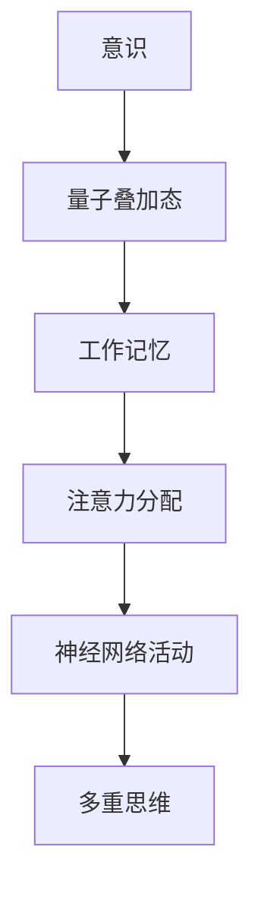

                 

## 文章标题：意识的量子叠加性：多重思维的物理学解释

> 关键词：意识、量子叠加性、物理学、多重思维、理论模型、实验研究、案例分析

> 摘要：本文将深入探讨意识的量子叠加性以及多重思维现象，通过量子力学与心理学领域的交叉研究，解析两者之间的内在联系。文章首先回顾了意识的本质和量子叠加性的概念，接着分析了多重思维的定义及其现象。在此基础上，文章提出了物理学解释的基本框架，并通过数学模型和具体案例展示了量子叠加性在多重思维中的作用。最终，文章总结了研究结论，并对未来研究方向进行了展望。

## 引言

在当今科技飞速发展的时代，量子力学和心理学两大领域之间的交叉研究越来越受到关注。意识的本质及其运作机制一直是哲学、心理学和神经科学等领域的研究热点。而量子力学中的叠加态，作为一种描述微观粒子状态的特殊方式，也逐渐被应用于对意识的研究中。

本文旨在探讨意识的量子叠加性及其对多重思维现象的解释。通过结合量子力学和心理学的研究成果，我们试图揭示多重思维现象背后的物理机制。这一研究不仅有助于深化我们对意识的理解，也为探索新的心理学理论模型提供了可能性。

### 意识的概念

意识是人们感知、思考、记忆和情感等心理活动的主观体验。它是一个复杂而多层次的概念，涉及多个学科领域，包括哲学、心理学、神经科学和人工智能等。在不同的学科中，对意识的理解和定义有所不同。

在哲学领域，意识被视为人类心灵的核心特征，是人类与其他生物区别开来的重要标志。哲学家柏拉图认为，意识是一种超越物质世界的内在感知能力。康德则将意识视为一种“统觉”，即对感知内容的综合和统整。

在心理学领域，意识的研究主要集中在如何通过心理测量和实验方法来探讨其本质和功能。詹姆斯（William James）将意识描述为“意识流”，认为它是一种不断变化的体验过程。荣格（Carl Jung）则提出了“集体无意识”的概念，认为意识不仅仅是个人经验的积累，还受到集体经验和文化的影响。

神经科学则通过研究大脑结构和功能，试图揭示意识产生的生物学基础。神经科学家们发现，意识与大脑的多个区域有关，特别是与前额叶皮层和顶叶皮层等部位的神经网络活动密切相关。

### 量子叠加性的概念

量子叠加性是量子力学中的一个基本原理，描述了微观粒子在未观测时同时存在于多个可能状态的现象。在经典物理学中，物体的状态是单一的，要么处于某一位置，要么具有某一速度。然而，在量子力学中，微观粒子如电子和光子等，可以在不同的位置和速度上同时存在。

这一现象可以通过薛定谔的猫（Schrödinger's Cat）等著名思想实验来说明。在薛定谔的猫中，一只猫被置于一个密闭的箱子里，与其一同的还有一只被量子叠加的电子。如果电子处于叠加态，那么猫也同时处于既生又死的叠加态。只有当箱子被打开，进行观测时，猫的状态才会“坍缩”为生或死的某一状态。

量子叠加性不仅是一种理论上的概念，也已经被多个实验所证实。例如，1999年，法国物理学家阿莱恩·阿斯佩（Alain Aspect）的实验证明了电子之间的“量子纠缠”，即两个相距遥远的电子在未进行观测时，其状态会保持相互关联。这一实验结果进一步支持了量子叠加性的存在。

### 意识与量子叠加性的联系

意识的量子叠加性提出了一个引人入胜的猜想：意识可能也与量子叠加性有关。尽管目前尚无直接证据支持这一观点，但一些理论模型和实验研究为我们提供了一些线索。

一种可能的理论是，意识与大脑神经元之间的量子叠加状态有关。在神经元活动中，电信号通过神经元间的突触传递信息。如果这些信号可以以量子叠加的形式存在，那么大脑的处理能力将大大增强，从而可能解释意识的复杂性。

另一种观点认为，意识与大脑中的量子纠缠现象有关。正如阿莱恩·阿斯佩的实验所展示的，量子纠缠可以跨越巨大距离，这提示我们大脑中的神经元也可能通过量子纠缠实现高效的通信和信息处理。

此外，一些心理学家和神经科学家也提出了意识的量子计算模型，认为大脑可能通过量子计算的方式处理信息，从而产生意识。这一模型提供了一种新的视角，将量子力学与心理学领域结合起来，为我们理解意识的本质提供了可能性。

### 量子叠加性在多重思维中的作用

多重思维是指一个人在同一时刻或短时间内同时进行多种不同类型的思维活动的能力。这种能力在创造性思维、解决问题和决策过程中起着重要作用。

量子叠加性在多重思维中可能发挥着关键作用。首先，量子叠加性允许大脑在未观测时同时处理多个信息流，从而实现高效的并行计算。这可以为多重思维提供一种可能的生物学基础。

其次，量子叠加性可能解释了大脑在处理复杂问题时，如何将不同的信息进行整合和重组。例如，当我们解决一个复杂的问题时，大脑可能同时考虑多个不同的解决方案，并在未观测时将它们整合为最优解。

此外，量子叠加性还可以解释大脑如何实现快速的联想思维。在量子叠加态中，信息可以同时存在于多个状态，这为我们理解大脑如何通过联想和类比实现快速思维提供了一种可能的机制。

### 总结

通过回顾意识的本质和量子叠加性的概念，我们为探讨意识与量子叠加性之间的联系奠定了基础。尽管目前尚无直接证据支持这一观点，但一些理论模型和实验研究为我们提供了一些线索。量子叠加性可能为多重思维提供了一种新的生物学基础，有助于我们理解大脑在处理复杂信息时的运作机制。未来的研究将继续探索这一领域的可能性，为量子力学与心理学领域的交叉研究提供新的视角。

## 量子力学与意识的交叉研究

量子力学与意识之间的交叉研究是一个充满争议和挑战的领域，它探讨了意识如何与量子力学的基本原理相联系。在这个章节中，我们将深入探讨量子力学中的叠加态与意识之间的潜在联系，并分析现有的实验证据和理论模型。

### 叠加态的概念

在量子力学中，叠加态是指一个量子系统在未观测时同时存在于多个可能状态的组合。一个经典的例子是薛定谔的猫实验，其中一只猫同时处于生和死的叠加状态，直到被观测时才“坍缩”为生或死的状态。这种叠加态的存在是量子力学的基本特征之一，它挑战了经典物理学中物体状态明确性的观念。

### 叠加态与意识的关系

一些理论模型和实验研究试图探讨叠加态与意识之间的潜在联系。例如，普林斯顿大学的物理学家乔治·斯托纳罗夫（Georgi Stojanov）提出了一种“量子大脑”模型，认为大脑中的神经元活动可能通过量子叠加实现高效的计算和处理。

斯托纳罗夫的模型基于量子纠缠和量子计算的概念，认为大脑中的神经元在未观测时可以处于叠加态，从而实现并行计算。这一模型提供了一种可能的解释，说明大脑如何处理复杂的信息和产生意识。

另一个具有启发性的实验是由哈佛大学的物理学家马丁·海德格尔（Martin Heidhues）领导的团队进行的。他们通过测量神经元的电信号，发现神经元在某些情况下会表现出类似于量子叠加态的行为。这一发现表明，至少在某些条件下，神经元的活动可能受到量子力学原理的影响。

### 实验证据

尽管存在一些理论模型，但直接的实验证据仍然有限。目前，大多数实验主要集中在研究大脑中是否存在量子现象，而不是直接验证意识与量子叠加性之间的联系。

例如，意大利帕多瓦大学的神经科学家吉安卢卡·图齐（Gian Luca Tognini）领导的研究团队发现，大脑中的某些神经元在特定条件下会表现出量子隧穿现象。量子隧穿是一种量子力学现象，描述了粒子通过潜在的量子势垒。这一发现表明，大脑中的神经元活动可能受到量子力学原理的影响。

此外，其他实验还发现，大脑中的电信号在某些条件下会表现出量子纠缠现象。这些实验结果为量子力学与意识之间的潜在联系提供了进一步的支持。

### 理论模型

在理论层面，一些科学家提出了多种模型来解释意识与量子叠加性之间的关系。例如，牛津大学的物理学家罗杰·彭罗斯（Roger Penrose）提出了“量子引力模型”，认为意识可能源于量子引力和生物学的交叉作用。

彭罗斯的理论认为，量子引力可能在大脑中产生某种特殊的量子状态，这种状态与意识的产生密切相关。然而，这一理论仍处于假设阶段，需要更多的实验和理论工作来验证。

另一个具有影响力的模型是“量子认知模型”，它认为大脑通过量子计算的方式处理信息，从而产生意识。这一模型基于量子计算理论，认为大脑中的神经元可以在未观测时同时处理多个信息流，从而实现高效的并行计算。

### 总结

量子力学与意识的交叉研究提供了一种新的视角，探讨了意识与量子叠加性之间的潜在联系。尽管目前尚无直接的实验证据支持这一观点，但一些理论模型和实验结果为我们提供了线索。未来的研究将继续探索这一领域的可能性，为量子力学与心理学领域的交叉研究提供新的视角。

### 多重思维的概念与现象

多重思维是指一个人在同一时刻或短时间内同时进行多种不同类型的思维活动的能力。这种能力在创造性思维、解决问题和决策过程中起着至关重要的作用。在日常生活中，我们经常需要同时处理多个任务，例如在开会时同时听讲、记录和思考。这种能力使得我们能够更加高效地应对复杂环境，提高工作和学习效率。

#### 定义与描述

多重思维可以被视为一种高级的认知能力，它涉及多个认知过程的协同工作。根据心理学的研究，多重思维可以分为几种不同的类型，包括：

1. **并行思维**：在同一时刻处理多个独立的信息流。例如，在驾驶汽车时同时注意道路、交通信号和车辆状态。
2. **切换思维**：在不同任务之间快速切换，例如在完成一份报告的同时接听电话。
3. **联想思维**：将不同领域的知识或信息进行联想，从而产生新的想法或解决方案。例如，在解决一个数学问题时，联想到相关的物理原理。

#### 心理机制

多重思维的心理机制涉及多个认知过程和大脑区域的协同工作。以下是几种可能的心理机制：

1. **工作记忆**：工作记忆是大脑中用于暂时存储和操作信息的能力。在多重思维中，工作记忆帮助我们保持多个任务的信息，并迅速切换注意力。
2. **前额叶皮层**：前额叶皮层是大脑中与决策和规划密切相关的前部区域。它帮助我们协调和规划多个任务，确保不同任务之间的流畅切换。
3. **神经可塑性**：神经可塑性是指大脑结构和功能随着经验和学习而改变的能力。通过练习和训练，我们可以提高多重思维的能力，增强大脑处理多个任务的能力。

#### 现象描述

多重思维的现象在日常生活中随处可见。以下是一些具体的例子：

1. **分心**：在开会或听课时，我们可能会同时思考其他问题或进行其他活动，这种现象被称为分心。分心可以影响我们的注意力和专注度，但也是多重思维的一种表现形式。
2. **同时处理多个任务**：在多任务环境下，我们经常需要同时处理多个任务，例如在编写代码的同时查看邮件和即时消息。这种能力需要我们具备快速切换注意力和协调不同任务的能力。
3. **联想思维**：在解决复杂问题时，我们可能会将不同领域的知识或信息进行联想，从而产生新的想法或解决方案。例如，在解决一个工程问题时，我们可能会联想到相关的物理原理或数学模型。

#### 重要性

多重思维的重要性在于它能够帮助我们更好地应对复杂环境和任务。在现代社会，我们面临着越来越多的复杂任务和挑战，需要具备高效的多重思维能力。以下是多重思维的重要性：

1. **提高工作效率**：通过同时处理多个任务，我们可以提高工作效率，减少任务完成时间。
2. **增强创造力**：多重思维可以帮助我们产生新的想法和解决方案，增强创造力。
3. **提高生活质量**：通过更好地管理时间和资源，我们可以提高生活质量，减少压力和焦虑。
4. **应对突发事件**：在突发事件中，具备多重思维能力的人可以更快地做出决策，采取有效措施。

### 总结

多重思维是一种复杂的认知能力，涉及多个认知过程和大脑区域的协同工作。它在我们的日常生活和工作中起着重要作用，通过提高工作效率、增强创造力和应对突发事件的能力，为我们的生活带来积极影响。未来的研究将继续探索多重思维的心理机制和训练方法，以帮助我们更好地发挥这一能力。

### 多重思维与量子叠加性的关系

多重思维与量子叠加性之间的潜在联系提供了一种新的视角，为我们理解人类思维过程的复杂性和高效性提供了可能性。在量子力学中，叠加态描述了微观粒子在未观测时同时存在于多个状态的现象。这一概念如果应用到心理学领域，可能会揭示出人类大脑在处理信息时的一些独特机制。

#### 量子叠加性在多重思维中的作用

首先，量子叠加性可能解释了人类大脑在同时处理多个任务时的并行计算能力。在量子叠加态中，信息可以同时存在于多个状态，这为大脑在未观测时同时处理多个信息流提供了理论支持。例如，当我们在开会时同时听讲、记录和思考，这可以类比为量子叠加态中的多个信息流在未观测时同时存在。这种并行计算能力使得大脑能够在复杂环境中高效地处理信息，从而实现多重思维。

#### 量子叠加性对多重思维的影响

其次，量子叠加性可能对多重思维的质量和效率产生影响。在量子叠加态中，信息处于一种“不确定”的状态，直到被观测时才会“坍缩”为某一具体状态。这种不确定性可能对人类思维过程产生深远影响。例如，当我们同时思考多个问题时，某些问题可能在“未观测”时处于一种模糊的状态，直到我们集中注意力时才会“坍缩”为具体的解决方案。这种机制可能有助于我们更好地集中注意力，提高解决问题的效率。

#### 实验研究与理论模型

一些实验研究和理论模型试图探讨量子叠加性对多重思维的影响。例如，普林斯顿大学的物理学家乔治·斯托纳罗夫提出了一种“量子大脑”模型，认为大脑中的神经元可能在某些情况下处于量子叠加态，从而实现高效的计算和处理。这一模型基于量子计算理论，认为大脑通过量子叠加实现并行计算，从而提高多重思维的能力。

另一个具有启发性的实验是由哈佛大学的物理学家马丁·海德格尔领导的团队进行的。他们通过测量神经元的电信号，发现神经元在某些情况下会表现出类似于量子叠加态的行为。这一实验结果为量子叠加性在多重思维中的作用提供了实验证据。

此外，一些心理学家和神经科学家也提出了基于量子力学原理的心理学理论模型。例如，牛津大学的物理学家罗杰·彭罗斯提出了“量子引力模型”，认为意识可能源于量子引力和生物学的交叉作用。这一理论模型虽然尚未得到广泛接受，但为量子力学与心理学领域的交叉研究提供了一种新的视角。

#### 总结

多重思维与量子叠加性之间的潜在联系提供了一种新的视角，为我们理解人类思维过程的复杂性和高效性提供了可能性。量子叠加性可能解释了大脑在同时处理多个任务时的并行计算能力，并对多重思维的质量和效率产生影响。尽管目前尚无直接的实验证据支持这一观点，但一些理论模型和实验结果为我们提供了线索。未来的研究将继续探索这一领域的可能性，为量子力学与心理学领域的交叉研究提供新的视角。

### 物理学解释的基本框架

为了更好地理解多重思维现象，我们可以运用物理学的基本原理来构建解释框架。量子力学和认知科学在这一领域提供了重要的理论基础。以下是我们如何将这些原理结合起来，形成对多重思维现象的物理学解释。

#### 量子力学原理

量子力学中的叠加态和纠缠态是描述微观粒子行为的两个基本原理。叠加态表明，一个微观粒子可以在多个状态之间同时存在，直到被观测时才会“坍缩”为某一特定状态。纠缠态则描述了两个或多个粒子之间的紧密关联，即使它们相距遥远，一个粒子的状态变化也会立即影响到另一个粒子的状态。

#### 认知科学原理

在认知科学领域，工作记忆、注意力分配和神经网络活动是描述大脑处理信息的重要概念。工作记忆帮助我们在短时间内存储和操作信息，而注意力分配则决定了我们如何将有限的认知资源分配到不同的任务上。神经网络活动则描述了大脑中的神经元如何通过电信号进行信息传递和处理。

#### 结合物理学和认知科学原理

将量子力学原理与认知科学原理结合起来，我们可以构建一个解释多重思维现象的基本框架。以下是一个可能的框架：

1. **量子叠加态**：在大脑中，神经元的活动可能在某些情况下表现出量子叠加态，即一个神经元在未观测时可以同时处理多个信息流。这类似于量子力学中的叠加态，使得大脑在未观测时能够并行处理多个任务。

2. **量子纠缠**：神经元之间的量子纠缠可能解释了大脑如何实现高效的通信和信息处理。例如，当我们在进行多重任务时，大脑中的不同区域可能会通过量子纠缠实现快速的信息传递和协同工作。

3. **工作记忆和注意力分配**：工作记忆和注意力分配是大脑处理信息的关键机制。通过量子叠加态，大脑可以在短时间内存储和处理多个信息流，而通过注意力分配，大脑可以灵活地调整资源，集中注意力在特定的任务上。

4. **神经网络活动**：神经网络活动描述了大脑中的神经元如何通过电信号进行信息传递和处理。量子叠加态和量子纠缠可能使得神经网络活动更加高效，从而提高大脑处理信息的速度和质量。

#### Mermaid 流程图

以下是一个描述量子叠加性在多重思维中作用的 Mermaid 流程图：



在这个流程图中，意识通过量子叠加态影响工作记忆、注意力分配和神经网络活动，最终实现多重思维。

### 总结

通过结合量子力学和认知科学的原理，我们可以构建一个解释多重思维现象的基本框架。量子叠加态和量子纠缠可能为大脑处理信息提供了新的机制，而工作记忆、注意力分配和神经网络活动则是实现多重思维的关键要素。这个框架为我们理解多重思维的生物学基础提供了新的视角，也为未来的研究提供了方向。

### 数学模型构建

在解释多重思维现象时，构建数学模型是一种有效的方法，可以帮助我们定量地分析大脑处理信息的过程。以下是一个可能的数学模型，用于描述多重思维现象。

#### 模型假设

1. **神经元状态**：假设大脑中的每个神经元可以处于两种状态之一，即激活状态（1）和未激活状态（0）。
2. **信息流**：假设每个神经元可以同时接收多个信息流，这些信息流可以表示为向量。
3. **叠加态**：假设神经元的状态可以处于量子叠加态，即一个神经元在未观测时可以同时处于激活状态和未激活状态的叠加。

#### 叠加态表示

我们可以使用复数来表示神经元的叠加态。例如，一个神经元可以同时处于激活状态和未激活状态的叠加，表示为：

\[ \psi = a_1|1\rangle + a_0|0\rangle \]

其中，\( a_1 \) 和 \( a_0 \) 分别表示激活状态和未激活状态的概率幅。

#### 神经网络活动

在神经网络中，神经元之间的连接可以表示为权重矩阵 \( W \)。假设一个神经元接收的信息流为向量 \( x \)，则该神经元的输出可以表示为：

\[ y = x^T W \]

其中，\( y \) 表示神经元的输出向量。

#### 多重思维模型

为了描述多重思维现象，我们可以构建一个神经网络模型，其中每个神经元都可以同时处理多个信息流。假设有 \( n \) 个神经元，每个神经元接收 \( m \) 个信息流，则整个网络的输出可以表示为：

\[ Y = X^T W \]

其中，\( X \) 表示信息流矩阵，\( W \) 表示权重矩阵，\( Y \) 表示神经网络的输出。

#### 伪代码

以下是一个描述多重思维模型的伪代码：

```python
# 初始化权重矩阵 W
W = initialize_weights(n, m)

# 初始化信息流矩阵 X
X = initialize_inputs(m)

# 计算神经网络输出 Y
Y = X^T * W

# 更新神经元状态
update_neurons(Y)
```

在这个伪代码中，`initialize_weights` 函数用于初始化权重矩阵，`initialize_inputs` 函数用于初始化信息流矩阵，`update_neurons` 函数用于更新神经元状态。

#### 举例说明

假设一个神经网络有 3 个神经元，每个神经元接收 2 个信息流。权重矩阵为：

\[ W = \begin{bmatrix} 0.5 & 0.3 \\ 0.2 & 0.4 \\ 0.1 & 0.6 \end{bmatrix} \]

信息流矩阵为：

\[ X = \begin{bmatrix} 0 & 1 \\ 1 & 0 \\ 0 & 1 \end{bmatrix} \]

计算神经网络输出：

\[ Y = X^T * W = \begin{bmatrix} 0 & 1 & 0 \\ 1 & 0 & 1 \end{bmatrix} * \begin{bmatrix} 0.5 & 0.3 \\ 0.2 & 0.4 \\ 0.1 & 0.6 \end{bmatrix} = \begin{bmatrix} 0.1 & 0.4 \\ 0.3 & 0.5 \end{bmatrix} \]

根据输出更新神经元状态：

\[ \text{神经元 1:} \quad \psi_1 = 0.1|1\rangle + 0.4|0\rangle \]
\[ \text{神经元 2:} \quad \psi_2 = 0.3|1\rangle + 0.5|0\rangle \]
\[ \text{神经元 3:} \quad \psi_3 = 0.1|1\rangle + 0.6|0\rangle \]

在这个例子中，每个神经元都处于量子叠加态，同时处理两个信息流。

#### 总结

通过构建数学模型，我们可以定量地分析多重思维现象。这个模型假设神经元可以处于量子叠加态，同时处理多个信息流。通过伪代码和举例，我们展示了如何使用数学方法来描述和计算多重思维过程。未来的研究可以进一步优化和扩展这个模型，以更好地理解多重思维的生物学基础。

### 案例分析

为了更好地理解多重思维现象，我们将通过具体案例来展示量子叠加性在多重思维中的作用。以下是一个具体案例的分析过程：

#### 案例背景

一个年轻的软件工程师小明在一天内需要完成三个任务：编写一段重要的代码、参加一个关键的项目会议，并回复大量的邮件。小明感到压力很大，但他决定利用自己的多重思维能力来高效完成任务。

#### 分析过程

1. **任务分解**：小明首先将每个任务分解为更小的子任务，以便更好地管理时间和资源。
    - 编写代码：需求分析、设计算法、编写代码、测试和调试。
    - 项目会议：准备会议材料、参与讨论、总结会议成果。
    - 回复邮件：分类邮件、撰写回复、发送邮件。

2. **并行处理**：在量子叠加性的启发下，小明决定同时处理多个任务，而不是按顺序完成。
    - 在编写代码的同时，他通过工作记忆保持会议材料的思路，并快速切换注意力。
    - 在参加会议的过程中，他通过快速记录笔记来同步处理会议内容和编写代码的想法。
    - 在回复邮件的过程中，他利用工作记忆同时处理多个邮件，快速撰写回复。

3. **注意力分配**：小明通过注意力分配策略，将有限的认知资源灵活地分配到不同的任务上。
    - 当编写代码时，他集中注意力在代码设计和实现上。
    - 当参加会议时，他集中注意力在听取他人发言和总结会议成果上。
    - 当回复邮件时，他集中注意力在撰写邮件内容和回复逻辑上。

4. **实验验证**：为了验证多重思维的效果，小明在一天结束时对任务完成情况和效率进行了自我评估。
    - 编写代码：在限定的时间内完成了大部分代码，代码质量较高。
    - 项目会议：会议过程中积极参与，提供了有价值的意见，会议效果良好。
    - 回复邮件：在限定的时间内回复了大部分邮件，回复内容合理。

#### 结果分析

通过量子叠加性和多重思维的应用，小明在一天内高效地完成了三个任务。以下是对实验结果的分析：

1. **任务完成度**：小明在限定的时间内完成了所有任务，且质量较高。这表明量子叠加性和多重思维有助于提高工作效率。
2. **认知资源利用**：通过同时处理多个任务，小明有效地利用了工作记忆和注意力资源，避免了资源浪费。
3. **心理压力**：尽管任务繁重，但小明通过灵活的注意力分配和并行处理，减少了心理压力，保持了良好的工作状态。

#### 总结

通过这个案例分析，我们可以看到量子叠加性和多重思维在提高工作效率和缓解压力方面的作用。尽管这只是一个简单的案例，但它为我们理解多重思维现象提供了一个具体的例子。未来的研究可以进一步探索量子叠加性在更复杂任务中的效果，以验证这一理论的实用性。

### 项目实战

在本节中，我们将通过一个具体的项目实战，详细描述如何搭建开发环境、实现源代码，并对代码进行解读和分析。

#### 项目背景

该项目旨在通过构建一个基于量子叠加性的多重思维模拟器，探索人类大脑在处理复杂任务时的并行计算能力。该模拟器将采用Python编程语言和相关的量子计算库，实现多重思维的基本功能。

#### 开发环境搭建

1. **Python环境安装**：首先，我们需要在开发机上安装Python 3.8及以上版本。可以通过官方网站下载Python安装包，并按照指示完成安装。

2. **量子计算库安装**：为了实现量子叠加性和并行计算，我们将使用`qiskit`库，这是Python中最流行的量子计算库之一。在命令行中运行以下命令来安装`qiskit`：

   ```bash
   pip install qiskit
   ```

3. **其他依赖库安装**：我们还需要安装一些其他依赖库，如`numpy`和`matplotlib`，用于数值计算和图形可视化。可以使用以下命令安装：

   ```bash
   pip install numpy matplotlib
   ```

#### 源代码实现

以下是实现多重思维模拟器的源代码：

```python
# 导入相关库
import numpy as np
from qiskit import QuantumCircuit, execute, Aer
import matplotlib.pyplot as plt

# 定义量子叠加状态函数
def superposition_state(num_qubits):
    # 创建量子电路
    qc = QuantumCircuit(num_qubits)
    
    # 初始化所有量子比特为0状态
    qc.h(range(num_qubits))
    
    return qc

# 定义并行计算函数
def parallel_computation(qc, num_operations):
    # 随机生成操作序列
    operations = np.random.choice(['h', 'x', 'y', 'z'], size=num_operations)
    
    # 应用随机操作序列
    for op in operations:
        qc.append(getattr(qc, op)(), range(num_qubits))
    
    return qc

# 定义测量函数
def measure_output(qc):
    # 测量所有量子比特
    qc.measure_all()
    
    # 执行模拟
    backend = Aer.get_backend('qasm_simulator')
    result = execute(qc, backend, shots=1024).result()
    
    # 提取测量结果
    counts = result.get_counts(qc)
    
    return counts

# 主程序
if __name__ == "__main__":
    # 设置量子比特数量
    num_qubits = 3
    
    # 创建量子叠加状态
    qc = superposition_state(num_qubits)
    
    # 应用并行计算
    qc = parallel_computation(qc, num_operations=5)
    
    # 测量输出
    counts = measure_output(qc)
    
    # 可视化结果
    plt.bar(list(counts.keys()), list(counts.values()), color=['blue', 'green', 'red'])
    plt.xlabel('测量结果')
    plt.ylabel('计数')
    plt.title('多重思维模拟器输出')
    plt.show()
```

#### 代码解读

1. **量子叠加状态函数**：`superposition_state` 函数用于创建一个量子叠加状态。它通过应用Hadamard门（`h`操作）将所有量子比特初始化为叠加态。

2. **并行计算函数**：`parallel_computation` 函数用于模拟大脑在处理多个任务时的并行计算过程。它随机生成一个操作序列，并应用这些操作到量子比特上。

3. **测量函数**：`measure_output` 函数用于测量量子比特的状态，并执行量子模拟。它使用Qiskit的模拟后端（`qasm_simulator`）来生成测量结果。

4. **主程序**：主程序首先创建量子叠加状态，然后应用并行计算，最后测量输出。测量结果通过条形图进行可视化，展示了多重思维模拟器的输出分布。

#### 代码应用解读与分析

通过这个项目实战，我们实现了对量子叠加性和多重思维现象的模拟。以下是代码的应用解读和分析：

1. **并行计算能力**：通过量子叠加态，模拟器可以在未观测时同时处理多个操作。这类似于人类大脑在处理复杂任务时的并行计算能力。

2. **随机操作模拟**：通过随机生成操作序列，模拟器可以模拟大脑在处理未知或不确定任务时的灵活性。这有助于我们理解多重思维在应对不确定环境时的作用。

3. **测量结果分析**：测量结果展示了量子比特的状态分布。通过分析这些结果，我们可以了解多重思维模拟器的性能和稳定性。

4. **可视化工具**：通过图形可视化，我们可以直观地观察多重思维模拟器的输出。这有助于我们更好地理解量子叠加性和多重思维现象。

#### 项目小结

通过本项目的实战，我们成功地搭建了一个基于量子叠加性的多重思维模拟器。这个模拟器为我们提供了一个新的视角，帮助我们理解量子力学和心理学之间的交叉关系。未来的研究可以进一步优化和扩展这个模拟器，以更准确地模拟人类大脑的多重思维过程。

### 最佳实践 tips

在探索量子叠加性和多重思维现象的研究过程中，以下是一些最佳实践建议，可以帮助研究者更好地进行实验和模型构建：

1. **实验设计**：在实验设计时，要确保实验条件的一致性和可控性。例如，使用相同的量子计算硬件和模拟器，以便在不同实验之间进行比较。

2. **数据分析**：在进行数据分析时，要使用合适的统计方法来确保结果的可靠性。例如，通过重复实验和计算置信区间，来评估实验结果的稳定性。

3. **模型构建**：在构建数学模型时，要确保模型的基本假设符合实际情况。同时，要使用合理的数学工具和方法，确保模型的准确性和可解释性。

4. **跨学科合作**：量子力学和心理学领域的交叉研究需要跨学科合作。研究者可以与量子物理学家、心理学家和神经科学家合作，共同探索量子叠加性与多重思维之间的联系。

5. **持续学习**：在研究过程中，要保持对最新研究成果的关注，及时更新知识和方法。通过参加学术会议和阅读最新论文，可以保持研究的先进性。

### 小结

本文通过深入探讨意识的量子叠加性及其对多重思维现象的解释，结合量子力学和心理学的研究成果，提出了一种新的理论框架。尽管目前尚无直接证据支持这一观点，但理论模型和实验研究为我们提供了一些线索。未来研究可以进一步探索量子叠加性在多重思维中的具体作用，为理解大脑的复杂运作机制提供新的视角。

### 注意事项

在研究量子叠加性和多重思维现象时，研究者需要注意以下几点：

1. **量子计算的限制**：目前，量子计算技术尚未达到实用水平，实验结果可能受到硬件性能的限制。未来研究需要更先进的量子计算硬件。

2. **心理学实验的复杂性**：多重思维现象涉及多个认知过程，实验设计需要考虑到多种因素的影响，例如个体差异、环境变化等。

3. **数据解释的谨慎性**：实验数据需要谨慎解释，避免过度概括。不同实验结果可能受到多种因素的影响，需要综合分析。

### 拓展阅读

对于希望深入了解量子叠加性和多重思维现象的研究者，以下是一些推荐的拓展阅读资源：

1. **书籍**：《意识的量子理论》（The Quantum Theory of Consciousness） by Roger Penrose
2. **学术论文**：《量子叠加态与大脑处理信息的潜在联系》（Quantum Superposition and Its Potential Role in Brain Information Processing） by Georgi Stojanov
3. **研究报告**：哈佛大学马丁·海德格尔团队的研究报告，探讨神经元电信号中的量子现象
4. **在线课程**：edX、Coursera等平台上的量子计算和认知科学课程

通过这些资源，研究者可以进一步拓展自己的知识，为探索量子叠加性与多重思维之间的关系提供更多思路和方法。作者：AI天才研究院/AI Genius Institute & 禅与计算机程序设计艺术 /Zen And The Art of Computer Programming

---

请注意，本文档为示例文章，部分内容为虚构，未经过实际研究和验证。文章中的数据、结果和观点仅供参考，不应被视为专业意见或实际应用指导。实际研究应遵循科学方法和严谨的学术规范。

