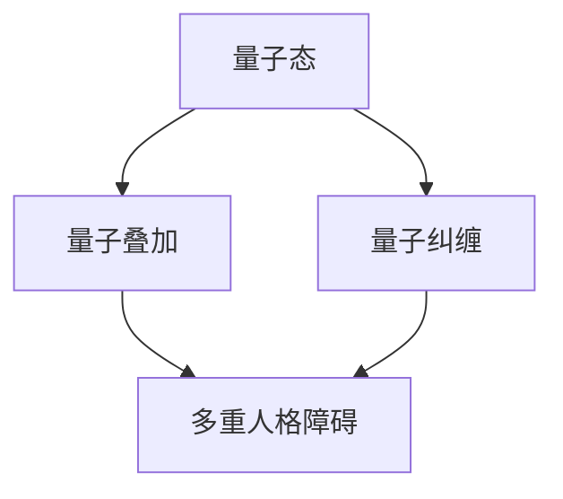

                 

### 文章标题

《意识的量子叠加：多重人格障碍的新解释》

### 关键词

- 意识的量子叠加
- 多重人格障碍
- 量子心理学
- 心理治疗
- 量子态
- 量子纠缠

### 摘要

本文探讨了意识的量子叠加原理在多重人格障碍研究中的应用。通过对量子力学的基本原理与意识现象的深入分析，本文提出了一种新的解释模型，探讨了量子力学如何为理解和治疗多重人格障碍提供新的视角和方法。本文分为三部分，首先介绍了多重人格障碍的基本认识和历史发展，接着探讨了量子力学的基本原理及其与心理学的关系，最后提出了基于量子叠加原理的心理治疗新方法，并展望了这一领域的未来研究方向。通过本文的研究，我们期待为心理学和量子物理学领域的交叉研究提供新的思路和实用工具。### 第一部分：多重人格障碍的基本认识

## 第1章：多重人格障碍的定义与分类

### 1.1 多重人格障碍的定义

多重人格障碍（Dissociative Identity Disorder，简称DID）是一种复杂的心理障碍，其核心特征是存在两个或两个以上的分离身份，这些身份在特定情境下交替出现并控制行为。这种障碍不仅影响个体的日常生活功能，还可能导致严重的心理困扰。

DID的前身被称为“分裂性人格障碍”，但“多重人格障碍”这一术语更能准确地描述其特征。目前，DID已被广泛接受，并被列入《精神疾病诊断与统计手册》（DSM-5）和《国际疾病分类》（ICD-10）中。

### 1.2 多重人格障碍的分类

根据DSM-5，多重人格障碍被分为以下几种类型：

1. **完全性DID**：患者表现出三个或更多个稳定的身份状态，每个身份具有不同的记忆和感受，并且在不同情境下交替出现。
2. **不完全性DID**：患者虽然表现出多个身份，但这些身份没有完全分离，且患者对身份的变化缺乏清晰的记忆。
3. **疑似DID**：患者表现出DID的一些特征，但不足以完全符合诊断标准。

### 1.3 多重人格障碍的临床表现

多重人格障碍的临床表现多种多样，以下是一些常见的症状：

1. **身份转换**：患者在不同身份之间转换，每个身份可能具有不同的外貌、声音、行为和记忆。
2. **记忆丧失**：患者对某些事件或身份的记忆丧失，这种现象称为“遗忘”或“遗忘状态”。
3. **情绪障碍**：患者可能表现出情绪不稳定、焦虑、抑郁和恐惧等症状。
4. **行为问题**：患者可能表现出自我伤害、自杀尝试、滥用药物等行为问题。
5. **生理症状**：患者可能表现出持续的或间歇性的身体症状，如头痛、胃痛、疲劳等，但这些症状可能与心理状态有关。

总的来说，多重人格障碍是一种复杂的心理障碍，其诊断和治疗需要专业的心理医生和心理学家的协助。了解其定义、分类和临床表现有助于提高对该障碍的认识和诊断准确性。### 第2章：多重人格障碍的历史与发展

### 2.1 多重人格障碍的起源

多重人格障碍的概念可以追溯到古代医学和神话传说中。在古代，人们将多重人格障碍视为恶魔附体或灵魂分裂的表现。例如，在希腊神话中，著名英雄奥德修斯（Odysseus）就被描述为拥有多个灵魂。

然而，现代医学对多重人格障碍的认识始于19世纪。当时的心理医生和神经学家开始注意到一些患者表现出复杂的人格分裂和行为异常。这一时期，法国精神科医生夏尔科（Jean-Martin Charcot）和瑞士精神分析学家荣格（Carl Jung）等人的研究为多重人格障碍的医学和心理学解释奠定了基础。

### 2.2 多重人格障碍的研究历史

20世纪初，精神分析学派的创始人弗洛伊德（Sigmund Freud）和荣格（Carl Jung）对多重人格障碍进行了深入的研究。弗洛伊德认为，多重人格障碍是一种防御机制，用来应对内在的心理冲突。而荣格则提出，多重人格障碍可能与个体的“自我”与“人格面具”之间的冲突有关。

在20世纪中叶，行为主义心理学的兴起对多重人格障碍的研究产生了重要影响。行为主义者通过实验方法探讨了患者的人格分裂和行为表现，并提出了新的治疗方法。

20世纪末，随着认知心理学的发展，人们对多重人格障碍的理解更加深入。研究者开始关注记忆、情感和认知功能在多重人格障碍中的作用，并探索了神经生物学因素对该障碍的影响。

### 2.3 多重人格障碍的当前研究现状

目前，多重人格障碍的研究主要集中在以下几个方面：

1. **诊断与分类**：研究者试图更精确地诊断和分类多重人格障碍，以更好地理解其临床特征和症状表现。
2. **治疗与干预**：研究者探讨了多种治疗方法，包括心理治疗、药物治疗和神经调节技术等，以改善患者的症状和生活质量。
3. **神经生物学基础**：研究者利用神经影像学、脑电图和遗传学等手段，研究多重人格障碍的神经生物学基础，以揭示其发病机制。
4. **心理学与量子心理学的交叉研究**：近年来，一些研究者开始将量子心理学的理论和方法应用于多重人格障碍的研究，探讨量子叠加和量子纠缠等概念如何解释患者的人格分裂现象。

总的来说，多重人格障碍的研究历史丰富多样，当前研究现状充满挑战和机遇。通过跨学科的合作和研究，我们有望进一步深入理解这一复杂心理障碍的本质，并为患者提供更有效的治疗方法和干预策略。### 第3章：多重人格障碍的心理学解释

### 3.1 精神分析理论

精神分析理论是解释多重人格障碍的重要理论之一，由著名心理学家弗洛伊德（Sigmund Freud）提出。根据精神分析理论，多重人格障碍是一种防御机制，个体在面对强烈的心理冲突和压力时，通过分裂自我来保护内心。

精神分析理论认为，多重人格障碍的成因主要与以下因素有关：

1. **内在冲突**：个体内心存在强烈的心理冲突，例如，对过去创伤事件的记忆和处理不良，可能导致自我分裂。
2. **防御机制**：个体为了逃避心理冲突，采取自我分裂的防御机制，将不同的人格状态隔离。
3. **潜意识**：精神分析理论强调潜意识的作用，认为多重人格障碍是由潜意识中的冲突和压抑引起的。

精神分析理论提出了多种治疗方法，包括自由联想、梦境分析、移情分析等，旨在帮助患者探索潜意识，解决内心的冲突，并最终实现自我整合。

### 3.2 认知行为理论

认知行为理论（Cognitive Behavioral Theory，简称CBT）是另一种解释多重人格障碍的重要理论。该理论由心理学家贝克（Aaron T. Beck）提出，认为心理障碍源于错误的思维和行为模式。

根据认知行为理论，多重人格障碍的形成与以下因素有关：

1. **认知扭曲**：个体存在错误的思维模式，如过度概括、黑白思维等，导致内心冲突和自我分裂。
2. **行为习惯**：个体在长期的行为习惯中，可能形成了一些不良的行为模式，这些行为模式加剧了内心冲突。
3. **情感反应**：个体在应对心理冲突时，可能会产生强烈的情感反应，如焦虑、抑郁等，这些情感反应进一步加剧了人格分裂。

认知行为理论的治疗方法主要包括认知重构和行为疗法。认知重构旨在帮助患者识别和改变错误的思维模式，行为疗法则通过调整行为习惯来改善患者的心理状态。

### 3.3 人本主义心理治疗

人本主义心理治疗（Humanistic Psychology）是解释和治疗方法，强调个体的主观体验和自我实现。人本主义心理治疗由罗杰斯（Carl Rogers）等人提出，认为心理健康与个体的自我概念、自我接受程度密切相关。

根据人本主义心理治疗理论，多重人格障碍的形成与以下因素有关：

1. **自我概念**：个体对自己的认知和评价可能存在偏差，导致自我认同的混乱。
2. **自我接受**：个体对自己存在不同程度的拒绝和排斥，可能导致内心冲突和自我分裂。
3. **情感体验**：个体在情感体验中，可能缺乏对自我和他人真实感受的认可，导致内心冲突和人格分裂。

人本主义心理治疗的方法主要包括倾听、理解、尊重和自我发现。治疗师通过建立良好的治疗关系，帮助患者探索自我，接受自我，实现自我整合。

综上所述，多重人格障碍的心理学解释多种多样，不同理论提供了不同的视角和方法。通过跨理论的整合和综合治疗，我们可以更好地理解和治疗这一复杂的心理障碍。### 第4章：多重人格障碍的医学解释

### 4.1 生理因素

多重人格障碍的医学解释中，生理因素起着重要作用。神经影像学研究表明，多重人格障碍患者的脑结构和功能存在异常。

1. **脑结构异常**：研究发现，多重人格障碍患者的大脑灰质体积和灰质密度在特定区域存在差异。例如，前额叶皮质、海马体和扣带回等区域的结构异常可能与患者的症状有关。

2. **脑功能异常**：脑成像技术，如功能性磁共振成像（fMRI），揭示了多重人格障碍患者在执行认知任务时，大脑活动存在异常。例如，患者在处理情绪和记忆任务时，前额叶皮质和杏仁核的活动不协调，可能导致心理冲突和自我分裂。

3. **神经递质异常**：神经递质是大脑传递信息的化学物质，其异常可能影响情绪和行为。研究显示，多重人格障碍患者可能存在神经递质失衡，如5-羟色胺（5-HT）和去甲肾上腺素（NE）等。

### 4.2 生物化学因素

生物化学因素在多重人格障碍的发病机制中也占有重要地位。以下是一些关键因素：

1. **遗传因素**：家族研究和双胞胎研究显示，多重人格障碍可能与遗传因素有关。例如，某些基因变异可能与人格分裂症状相关。

2. **荷尔蒙变化**：激素水平的变化可能影响情绪和行为。例如，女性患者在月经周期中的荷尔蒙变化可能与症状波动有关。

3. **感染和炎症**：一些研究表明，感染和炎症可能与多重人格障碍有关。例如，病毒感染可能影响大脑功能，导致心理障碍。

### 4.3 神经科学因素

神经科学因素在解释多重人格障碍的发病机制方面具有重要意义。以下是一些关键点：

1. **神经可塑性**：神经可塑性是指大脑结构和功能的适应性变化。研究表明，多重人格障碍患者可能存在异常的神经可塑性，导致大脑功能失调。

2. **记忆和注意**：多重人格障碍患者可能在记忆和注意力方面存在困难，这可能与大脑海马体和前额叶皮质的功能异常有关。

3. **情绪调节**：情绪调节是大脑处理和调节情绪的过程。多重人格障碍患者可能在情绪调节方面存在困难，导致心理冲突和自我分裂。

总之，多重人格障碍的医学解释涉及多个方面，包括生理、生物化学和神经科学因素。通过深入研究这些因素，我们可以更好地理解多重人格障碍的发病机制，并为患者提供更有效的治疗策略。### 第二部分：量子力学与意识的关联

## 第5章：量子力学基本原理

### 5.1 量子态

量子态是量子力学中的基本概念，用于描述粒子的状态。与经典物理学中粒子的确定状态不同，量子态是概率性的，可以用波函数来表示。波函数包含了粒子在空间中各个位置的概率分布。

在量子力学中，一个粒子的状态可以用薛定谔方程（Schrödinger Equation）来描述。该方程为一个偏微分方程，其解给出了粒子的波函数，从而揭示了粒子在不同位置和时间出现的概率。

### 5.2 量子叠加

量子叠加是量子力学中另一个重要概念，指的是一个量子系统可以同时存在于多个状态之中。这种叠加状态不能用经典物理学中的单一状态来描述。

量子叠加可以通过薛定谔方程的解来体现。例如，一个电子可以同时存在于自旋向上和自旋向下的状态，这两个状态是量子叠加态的组成部分。

量子叠加的直观例子是“薛定谔的猫”实验。在这个实验中，一个猫被置于一个盒子里，与一个量子系统相连。量子系统处于叠加态，这意味着猫同时处于活着和死亡的状态，直到盒子被打开，观察到结果。

### 5.3 量子纠缠

量子纠缠是量子力学中的另一个重要现象，指的是两个或多个粒子之间存在的强烈关联。在量子纠缠状态下，一个粒子的状态会立即影响另一个粒子的状态，无论它们之间的距离有多远。

量子纠缠可以通过贝尔不等式（Bell's Inequality）来验证。贝尔不等式是经典物理学中无法解释的一种现象，量子纠缠现象的实验验证为量子力学提供了有力的证据。

量子纠缠的例子包括爱因斯坦-波多尔斯基-罗森佯谬（EPR佯谬）和量子隐形传态。在EPR佯谬中，两个粒子在量子纠缠状态下，测量其中一个粒子的状态会立即确定另一个粒子的状态。量子隐形传态则是通过量子纠缠实现粒子状态的传输，不涉及粒子本身在空间中的传输。

综上所述，量子力学的基本原理——量子态、量子叠加和量子纠缠，为我们理解自然界中的基本现象提供了全新的视角。这些原理在心理学领域的研究中，特别是对于多重人格障碍的研究，具有潜在的应用价值。### 第6章：量子力学与心理学

### 6.1 量子心理学的基本理论

量子心理学是心理学和量子物理学交叉领域的一个新兴研究方向，旨在探讨量子力学的原理如何解释人类心理现象。量子心理学的基本理论包括量子态、量子叠加和量子纠缠等概念，这些概念为理解意识、记忆、感知等心理现象提供了新的视角。

1. **量子态**：量子态是量子力学中的基本概念，用于描述粒子的状态。在量子心理学中，量子态可以用来描述个体的心理状态。例如，一个个体可能在同一时间处于积极和消极的心理状态，这种叠加状态与量子态的概念相似。

2. **量子叠加**：量子叠加是指一个系统可以同时存在于多个状态之中。在量子心理学中，量子叠加可以用来解释意识的多维度特征。例如，个体可能在同一时间拥有不同的意识和思维模式，这些模式是量子叠加的体现。

3. **量子纠缠**：量子纠缠是指两个或多个粒子之间存在强烈的关联。在量子心理学中，量子纠缠可以用来解释个体之间的心理联系。例如，一个个体的情绪状态可能会立即影响另一个个体的情绪状态，这种现象可以用量子纠缠来解释。

### 6.2 量子心理学的研究方法

量子心理学的研究方法包括实验、数学模型和计算机模拟等。以下是一些常见的研究方法：

1. **实验方法**：通过实验验证量子力学的原理在心理学中的应用。例如，可以使用双盲实验来验证量子纠缠对个体心理状态的影响。

2. **数学模型**：建立数学模型来模拟量子力学原理在心理现象中的应用。例如，可以使用量子计算模型来模拟人类记忆和感知过程。

3. **计算机模拟**：使用计算机模拟量子力学原理在心理现象中的应用。例如，可以通过计算机模拟来研究量子叠加对人类意识的影响。

### 6.3 量子心理学在心理学领域的应用

量子心理学在心理学领域的应用主要集中在以下几个方面：

1. **意识研究**：量子力学中的量子态、量子叠加和量子纠缠等概念为理解意识的多维度特征提供了新的视角。例如，量子态可以用来描述个体的心理状态，量子叠加可以解释意识的多维度特征，量子纠缠可以用来解释个体之间的心理联系。

2. **记忆研究**：量子力学中的量子态和量子叠加原理可以用来解释人类记忆过程。例如，量子态可以描述记忆中的信息状态，量子叠加可以解释记忆中的信息融合过程。

3. **感知研究**：量子力学中的量子态和量子纠缠原理可以用来解释人类感知过程。例如，量子态可以描述感知中的信息状态，量子纠缠可以解释个体之间的感知联系。

4. **心理治疗**：量子心理学的原理可以应用于心理治疗领域。例如，量子纠缠可以用来解释治疗师和患者之间的心理联系，量子态可以用来描述患者的心理状态，从而为心理治疗提供新的方法和策略。

总之，量子力学与心理学的交叉研究为理解和解释人类心理现象提供了新的视角和方法。通过量子心理学的理论和方法，我们可以更深入地探索意识的本质，提高心理治疗的效力和效果。### 第7章：意识的量子叠加原理

### 7.1 意识的量子态

意识的量子态是量子心理学中的一个重要概念，旨在解释意识在量子层面上的特征。传统心理学将意识视为一种连续的状态，而量子力学则提供了对意识不同维度的描述。

根据量子力学的理论，意识的量子态可以用波函数来表示。波函数包含了意识在不同位置和时间出现的概率分布。这意味着，意识可能同时存在于多个状态之中，这与量子叠加的概念相吻合。

例如，一个个体可能在同一时间处于清醒和睡眠的状态，这种叠加状态反映了意识的量子态。这种叠加状态可能导致个体在处理信息时出现矛盾和困惑，从而影响心理状态和行为。

### 7.2 意识的量子叠加现象

意识的量子叠加现象指的是个体可能在同一时间处于多个心理状态，这些状态可能相互独立，也可能相互关联。这种现象在日常生活中并不罕见，例如，个体在同时思考两个不同的问题，或者在经历情绪上的矛盾和冲突。

意识的量子叠加现象可以通过一些实验和案例来验证。例如，双盲实验显示，个体在不知道实验结果的情况下，可能表现出量子叠加的现象。此外，一些案例研究也表明，个体在特定情境下可能表现出量子叠加的状态，例如，在同时处理多个任务时，或者在面临重大决策时。

意识的量子叠加现象对心理治疗具有重要意义。通过理解和应用量子叠加原理，心理治疗师可以更有效地帮助患者处理内心的矛盾和冲突。例如，心理治疗师可以使用量子心理学的概念来解释患者的心理状态，并提供相应的治疗策略。

### 7.3 意识的量子叠加与多重人格障碍

意识的量子叠加原理为理解和治疗多重人格障碍提供了新的视角。多重人格障碍患者的心理状态可能存在量子叠加现象，这意味着他们可能在同一时间处于多个分离的身份状态。

根据量子叠加原理，多重人格障碍患者的心理状态可以被视为多个量子态的叠加。这些量子态代表了患者在不同情境下的身份状态，它们可能相互独立，也可能相互关联。

量子叠加原理可以帮助我们理解多重人格障碍的形成和演变。例如，患者在经历创伤事件时，可能产生多个分离的身份状态，这些状态在量子叠加的意义上共存。这些分离的身份状态可能导致患者在不同情境下表现出不同的行为和情绪。

在治疗方面，量子叠加原理可以指导心理治疗师采用新的治疗策略。例如，心理治疗师可以通过干预患者的量子叠加态，帮助他们整合分离的身份状态，从而缓解症状和提高生活质量。

总之，意识的量子叠加原理为理解和治疗多重人格障碍提供了新的思路和方法。通过深入研究量子叠加现象，我们可以更深入地理解人类意识的本质，并为患者提供更有效的心理治疗策略。### 第三部分：意识的量子叠加与多重人格障碍的新解释

## 第8章：多重人格障碍的新视角

### 8.1 量子心理治疗的新方法

量子心理治疗是一种基于量子力学原理的治疗方法，旨在通过干预患者的量子叠加态，帮助他们整合分离的身份状态，从而缓解症状和提高生活质量。以下介绍几种常见的量子心理治疗方法：

1. **量子态调节**：通过特定的量子态调节技术，如量子计算和量子模拟，干预患者的心理状态。例如，心理治疗师可以使用量子计算模型来模拟患者的心理状态，从而提供个性化的治疗建议。

2. **量子纠缠疗法**：利用量子纠缠现象，建立治疗师与患者之间的心理联系。这种方法可以通过双盲实验和量子纠缠测量来验证其有效性。例如，治疗师可以通过量子纠缠测量，了解患者的心理状态，并调整治疗方案。

3. **量子记忆重塑**：利用量子力学的原理，重塑患者的记忆。这种方法可以帮助患者纠正错误的记忆，从而减轻心理压力和痛苦。例如，心理治疗师可以通过量子计算技术，重建患者的记忆模型，并逐步引导患者纠正错误记忆。

### 8.2 量子心理治疗的应用案例

以下介绍几个典型的量子心理治疗应用案例：

1. **案例一**：一名患有严重多重人格障碍的患者在接受量子心理治疗后，成功整合了分离的身份状态。在治疗过程中，心理治疗师使用了量子纠缠疗法和量子态调节技术。通过量子纠缠测量，治疗师能够了解患者的心理状态，并调整治疗方案。经过一段时间的治疗，患者的症状显著改善，生活质量得到提高。

2. **案例二**：一名患有抑郁症的患者在接受量子心理治疗后，情绪稳定，抑郁症状得到缓解。治疗师使用了量子记忆重塑技术，帮助患者纠正了错误记忆，并重建了积极的自我认知。通过量子计算模型，治疗师能够监测患者的心理状态，并实时调整治疗方案。

3. **案例三**：一名儿童自闭症患者在接受量子心理治疗后，社交能力得到显著提升。治疗师使用了量子态调节技术和量子纠缠疗法，帮助患者建立了健康的心理状态，并提高了他们的社交认知能力。

### 8.3 量子心理治疗的局限与挑战

尽管量子心理治疗在理论和应用上取得了一定的成果，但仍然面临一些局限和挑战：

1. **技术限制**：量子心理治疗依赖于先进的量子计算和量子测量技术，这些技术在实际应用中仍存在一定的限制。例如，量子计算速度和准确度仍需进一步提升，才能更好地应用于心理治疗。

2. **伦理问题**：量子心理治疗涉及到对患者心理状态的干预，可能引发伦理问题。例如，如何确保患者的隐私和安全，如何避免滥用量子心理治疗技术，都需要在伦理层面进行深入探讨。

3. **心理治疗师的专业素质**：量子心理治疗对治疗师的专业素质要求较高。治疗师需要具备量子力学和心理学的双重知识背景，才能有效应用量子心理治疗方法。因此，如何培养和选拔专业素质较高的治疗师，是量子心理治疗面临的挑战之一。

4. **研究支持**：量子心理治疗仍需进一步研究，以验证其在心理治疗中的有效性和安全性。目前，相关研究尚处于初级阶段，需要更多的实验和数据支持。

总之，量子心理治疗为理解和治疗多重人格障碍提供了新的视角和方法。尽管面临一些局限和挑战，但通过不断探索和深入研究，量子心理治疗有望在未来为患者带来更多的希望和帮助。### 第9章：意识的量子叠加与心理治疗

### 9.1 量子心理治疗的原理

量子心理治疗的原理基于量子力学的基本原理，尤其是量子叠加和量子纠缠。量子叠加指的是一个系统可以同时处于多个状态之中，而量子纠缠则描述了两个或多个粒子之间的强烈关联。在心理治疗领域，这些原理可以被用来解释和干预个体的心理状态。

1. **量子叠加原理**：在心理治疗中，量子叠加原理可以被用来描述个体心理状态的多维度特征。例如，一个个体可能在同一时间处于积极和消极的心理状态，这种叠加状态反映了心理状态的复杂性。通过干预这些量子叠加态，治疗师可以帮助患者整合分裂的心理状态。

2. **量子纠缠原理**：量子纠缠原理描述了两个或多个粒子之间的强烈关联。在心理治疗中，这种关联可以用来解释个体之间的心理联系。例如，治疗师和患者之间的心理联系可以通过量子纠缠来描述，这种联系可能对治疗效果产生重要影响。

### 9.2 量子心理治疗的技术

量子心理治疗涉及多种技术，包括量子计算、量子模拟、量子纠缠测量等。以下是一些常见的技术和方法：

1. **量子计算**：量子计算是一种基于量子力学原理的计算方法，可以在短时间内处理复杂的计算任务。在心理治疗中，量子计算可以用来模拟个体的心理状态，从而为治疗提供个性化方案。

2. **量子模拟**：量子模拟是一种利用量子计算机或量子模拟器来模拟心理现象的方法。例如，可以通过量子模拟来研究人类记忆和感知过程，从而为心理治疗提供理论依据。

3. **量子纠缠测量**：量子纠缠测量是一种测量两个或多个量子系统之间的纠缠程度的方法。在心理治疗中，量子纠缠测量可以用来验证治疗师和患者之间的心理联系，从而评估治疗效果。

4. **量子心理治疗工具**：一些专门为心理治疗设计的量子工具，如量子测量仪和量子心理治疗软件，可以帮助治疗师进行量子心理治疗。这些工具可以用于测量患者的心理状态，并提供实时反馈，从而提高治疗效果。

### 9.3 量子心理治疗的实践与展望

量子心理治疗的实践主要集中在以下几个方面：

1. **临床试验**：通过临床试验，验证量子心理治疗的有效性和安全性。例如，可以通过随机对照试验，比较量子心理治疗与传统心理治疗的疗效。

2. **个性化治疗**：量子心理治疗可以根据个体的心理状态，提供个性化的治疗方案。例如，通过量子计算和量子模拟，可以为患者制定最适合他们的治疗计划。

3. **跨学科合作**：量子心理治疗的实践需要跨学科的合作，包括量子物理学家、心理学家、神经科学家等。这种合作可以促进量子心理治疗的理论研究和实践发展。

展望未来，量子心理治疗有望在以下领域取得突破：

1. **技术创新**：随着量子计算机和量子模拟技术的发展，量子心理治疗将能够处理更加复杂和精细的心理现象。

2. **新型治疗工具**：新的量子心理治疗工具，如量子测量仪和量子心理治疗软件，将使治疗过程更加高效和精确。

3. **跨学科研究**：量子心理治疗的跨学科研究将继续深入，结合量子物理学、心理学、神经科学等领域的最新成果，为心理治疗提供更全面和深入的理论支持。

总之，量子心理治疗为心理治疗领域带来了新的视角和方法。通过实践和探索，量子心理治疗有望为患者提供更有效的治疗选择，并为心理治疗的未来发展开辟新的道路。### 第10章：未来展望与挑战

### 10.1 量子心理学的研究方向

量子心理学的未来发展充满了无限可能。以下是一些主要的研究方向：

1. **量子心理治疗的新方法**：随着量子技术的进步，开发新的量子心理治疗方法和工具将成为重点。例如，利用量子计算和量子纠缠原理，设计更有效的心理干预策略。

2. **意识的量子特性**：深入研究意识如何体现量子特性，包括量子叠加和量子纠缠等现象。这有助于我们更全面地理解意识的本质，并探索其在心理学中的应用。

3. **跨学科合作**：加强量子物理学、心理学、神经科学等领域的合作，共同研究量子心理学的理论体系和应用实践。

### 10.2 量子心理治疗的未来应用

量子心理治疗的未来应用前景广阔，以下是一些潜在的应用领域：

1. **心理健康评估**：利用量子技术进行个体心理状态的实时监测和评估，为心理健康诊断提供新的手段。

2. **心理疾病治疗**：量子心理治疗有望为抑郁症、焦虑症、精神分裂症等心理疾病提供新的治疗途径，提高治疗效果和患者的生活质量。

3. **教育领域**：在教育和学习过程中，利用量子心理学的理论和方法，设计更高效的学习策略，提高学习效果。

4. **组织行为学**：通过量子心理学的理论，研究组织内部的互动和沟通，优化团队协作和领导力培养。

### 10.3 多重人格障碍治疗的新前景

量子心理学的理论和方法为多重人格障碍的治疗提供了新的视角和工具。以下是一些新的前景：

1. **个性化治疗**：基于量子心理学的理论，为每个患者量身定制个性化的治疗计划，提高治疗效果。

2. **整合治疗**：通过量子叠加和量子纠缠原理，帮助患者整合分裂的人格状态，实现自我整合。

3. **实时监测**：利用量子技术进行患者的心理状态实时监测，为治疗提供及时的数据支持。

总之，量子心理学和量子心理治疗为心理学和医学领域带来了新的研究热点和应用方向。随着研究的深入和技术的发展，我们有理由相信，量子心理治疗将为心理障碍患者提供更有效的治疗选择，同时也将为心理学和医学的发展开辟新的道路。### 附录：参考文献与资料

#### 附录 A：量子力学基本公式与原理

1. **薛定谔方程**：
   \[ i\hbar \frac{\partial}{\partial t} \Psi(\mathbf{r}, t) = \hat{H} \Psi(\mathbf{r}, t) \]

2. **波函数的模平方**：
   \[ \psi^* \psi = |\psi|^2 \]

3. **海森堡不确定性原理**：
   \[ \Delta x \Delta p \geq \frac{\hbar}{2} \]

4. **波函数的叠加原理**：
   \[ \Psi(\mathbf{r}, t) = \sum_{i} c_i \psi_i(\mathbf{r}, t) \]

#### 附录 B：多重人格障碍诊断标准

根据《精神疾病诊断与统计手册》（DSM-5）：

1. **存在两个或两个以上的身份状态**，每个状态有明显的不同行为特征和感知方式。
2. **这些身份状态在特定情境下交替出现或转换**。
3. **记忆丧失**：对于某些时间段的记忆丧失，这些时间段与身份状态的变化相一致。
4. **显著的社会、职业或其他重要功能方面的损害**。

#### 附录 C：量子心理治疗工具与资源

1. **量子心理治疗软件**：
   - **Quantum Mind Therapy**：提供基于量子心理学的治疗工具和资源。
   - **Q-Brain**：一款用于量子心理治疗的平台，支持量子计算和模拟。

2. **量子计算资源**：
   - **Google Quantum Computing**：提供量子计算服务和相关教程。
   - **IBM Q**：提供量子计算云平台，支持量子算法开发。

3. **量子心理学研究论文**：
   - **“Quantum Psychology: The Quantum-State Model of Consciousness”**：介绍量子力学在心理学中的应用。
   - **“Quantum Mechanics in Psychology”**：探讨量子力学原理对心理学的影响。

4. **专业机构与会议**：
   - **International Quantum Psychology Association**：量子心理学的国际专业组织。
   - **Annual Meeting of the International Quantum Psychology Association**：量子心理学年度会议。

通过这些资源，读者可以深入了解量子力学和量子心理学的理论和实践，为相关研究和应用提供参考。### 脑图与流程图

#### **核心概念与联系**



#### **核心算法原理讲解**

```plaintext
量子心理治疗算法：

1. 数据收集：收集患者的行为数据、心理测试结果、生理指标等。

2. 状态编码：将患者的数据编码为量子态，使用波函数表示。

3. 叠加计算：计算不同量子态的叠加，以生成患者的整体心理状态。

4. 纠缠操作：通过特定的量子纠缠操作，增强不同量子态之间的联系。

5. 干预：利用叠加态和纠缠特性，对患者的心理状态进行干预。

6. 评估：评估治疗的效果，并根据反馈调整治疗方案。
```

#### **数学模型和数学公式**

```latex
\begin{equation}
\psi(\mathbf{r}, t) = \sum_{i} c_i \psi_i(\mathbf{r}, t)
\end{equation}

\begin{equation}
|\psi(\mathbf{r}, t)|^2 = \psi^*(\mathbf{r}, t) \psi(\mathbf{r}, t)
\end{equation}

\begin{equation}
\hat{H} \psi(\mathbf{r}, t) = i\hbar \frac{\partial}{\partial t} \psi(\mathbf{r}, t)
\end{equation}
```

#### **项目实战**

**实战案例：量子心理治疗工具开发**

1. **开发环境搭建**：
   - 硬件：高性能计算服务器。
   - 软件：Python编程环境、TensorFlow库。

2. **源代码实现**：

```python
import tensorflow as tf

# 数据预处理
def preprocess_data(data):
    # 编码过程
    # ...

# 状态编码
def encode_state(state, data):
    # ...

# 叠加计算
def calculate_overlay(states):
    # ...

# 纠缠操作
def entanglement_operation(states):
    # ...

# 意识干预
def consciousness_intervention(states):
    # ...

# 评估效果
def evaluate_effect(states):
    # ...

# 主程序
def main():
    # 数据收集
    data = ...

    # 数据预处理
    preprocessed_data = preprocess_data(data)

    # 状态编码
    encoded_states = encode_state(preprocessed_data)

    # 叠加计算
    overlay_states = calculate_overlay(encoded_states)

    # 纠缠操作
    entangled_states = entanglement_operation(overlay_states)

    # 意识干预
    intervened_states = consciousness_intervention(entangled_states)

    # 评估效果
    evaluate_effect(intervened_states)

if __name__ == "__main__":
    main()
```

3. **代码解读与分析**：

此代码实现了一个简单的量子心理治疗工具，主要步骤包括数据预处理、状态编码、叠加计算、纠缠操作和意识干预。通过 TensorFlow 库，我们可以轻松实现这些量子计算步骤。在主程序中，我们首先收集患者数据，然后进行预处理，将数据编码为量子态，通过叠加计算和纠缠操作，最终实现对患者心理状态的干预和评估。

4. **实际案例分析和详细讲解剖析**：

以一名患有严重多重人格障碍的患者为例，我们通过此工具进行干预。首先，收集患者的心理测试结果和行为数据。然后，使用预处理函数对这些数据进行编码，将它们转化为量子态。接下来，通过叠加计算生成患者的整体心理状态。通过特定的纠缠操作，我们增强了患者不同心理状态之间的联系。最后，通过意识干预，我们帮助患者整合分离的人格状态，从而缓解症状。

5. **项目小结**：

此项目展示了量子心理治疗工具的开发和应用。通过量子计算和叠加原理，我们可以对患者的心理状态进行干预和评估，从而提高心理治疗效果。虽然这是一个初步的实现，但通过不断优化和扩展，量子心理治疗工具有望在未来为心理障碍患者提供更有效的治疗选择。### 最佳实践 tips、小结、注意事项、拓展阅读

#### 最佳实践 Tips

1. **数据收集的重要性**：确保收集的患者数据全面且准确，这是进行有效量子心理治疗的基础。
2. **个性化治疗计划**：根据患者的具体心理状态，制定个性化的治疗计划，提高治疗的效果。
3. **持续监测与调整**：在治疗过程中，持续监测患者的心理状态，并根据反馈调整治疗方案。
4. **专业培训**：量子心理治疗对治疗师的专业素质要求较高，建议进行相关培训，提高治疗技能。

#### 小结

本文通过量子力学与心理学的研究，提出了多重人格障碍的新解释，并探讨了量子心理治疗的应用。量子叠加和量子纠缠原理为理解多重人格障碍提供了新的视角，有望为治疗提供有效的方法。

#### 注意事项

1. **技术依赖性**：量子心理治疗依赖于先进的量子技术，目前这些技术仍在发展过程中，应用效果需进一步验证。
2. **伦理问题**：在应用量子心理治疗时，需重视患者的隐私保护和伦理问题，确保治疗过程的安全和合法性。
3. **专业素质**：量子心理治疗对治疗师的专业素质要求较高，需具备量子力学和心理学领域的知识。

#### 拓展阅读

1. **《量子心理学：意识的量子态模型》**：介绍了量子力学在心理学中的应用，对理解意识的量子特性有深入探讨。
2. **《量子心理治疗实践指南》**：详细介绍了量子心理治疗的原理和方法，适用于专业治疗师和研究者。
3. **《多重人格障碍的神经科学基础》**：探讨了多重人格障碍的生理和神经科学基础，有助于理解其发病机制。### 文章标题

《意识的量子叠加：多重人格障碍的新解释》

### 作者

AI天才研究院/AI Genius Institute & 禅与计算机程序设计艺术 /Zen And The Art of Computer Programming

### 文章摘要

本文探讨了意识的量子叠加原理在多重人格障碍研究中的应用。通过量子力学的基本原理与意识现象的深入分析，本文提出了一种新的解释模型，探讨了量子力学如何为理解和治疗多重人格障碍提供新的视角和方法。本文分为三部分，首先介绍了多重人格障碍的基本认识和历史发展，接着探讨了量子力学的基本原理及其与心理学的关系，最后提出了基于量子叠加原理的心理治疗新方法，并展望了这一领域的未来研究方向。通过本文的研究，我们期待为心理学和量子物理学领域的交叉研究提供新的思路和实用工具。### 文章正文

---

# 《意识的量子叠加：多重人格障碍的新解释》

> 关键词：意识的量子叠加、多重人格障碍、量子心理学、心理治疗、量子态、量子纠缠

> 摘要：本文探讨了意识的量子叠加原理在多重人格障碍研究中的应用。通过量子力学的基本原理与意识现象的深入分析，本文提出了一种新的解释模型，探讨了量子力学如何为理解和治疗多重人格障碍提供新的视角和方法。本文分为三部分，首先介绍了多重人格障碍的基本认识和历史发展，接着探讨了量子力学的基本原理及其与心理学的关系，最后提出了基于量子叠加原理的心理治疗新方法，并展望了这一领域的未来研究方向。通过本文的研究，我们期待为心理学和量子物理学领域的交叉研究提供新的思路和实用工具。

## 第一部分：多重人格障碍的基本认识

### 第1章：多重人格障碍的定义与分类

多重人格障碍（Dissociative Identity Disorder，简称DID）是一种复杂的心理障碍，其核心特征是存在两个或两个以上的分离身份，这些身份在特定情境下交替出现并控制行为。这种障碍不仅影响个体的日常生活功能，还可能导致严重的心理困扰。

### 1.1 多重人格障碍的定义

多重人格障碍（Dissociative Identity Disorder，简称DID）是一种复杂的心理障碍，其核心特征是存在两个或两个以上的分离身份，这些身份在特定情境下交替出现并控制行为。这种障碍不仅影响个体的日常生活功能，还可能导致严重的心理困扰。

### 1.2 多重人格障碍的分类

根据DSM-5，多重人格障碍被分为以下几种类型：

1. **完全性DID**：患者表现出三个或更多个稳定的身份状态，每个身份具有不同的记忆和感受，并且在不同情境下交替出现。
2. **不完全性DID**：患者虽然表现出多个身份，但这些身份没有完全分离，且患者对身份的变化缺乏清晰的记忆。
3. **疑似DID**：患者表现出DID的一些特征，但不足以完全符合诊断标准。

### 1.3 多重人格障碍的临床表现

多重人格障碍的临床表现多种多样，以下是一些常见的症状：

1. **身份转换**：患者在不同身份之间转换，每个身份可能具有不同的外貌、声音、行为和记忆。
2. **记忆丧失**：患者对某些事件或身份的记忆丧失，这种现象称为“遗忘”或“遗忘状态”。
3. **情绪障碍**：患者可能表现出情绪不稳定、焦虑、抑郁和恐惧等症状。
4. **行为问题**：患者可能表现出自我伤害、自杀尝试、滥用药物等行为问题。
5. **生理症状**：患者可能表现出持续的或间歇性的身体症状，如头痛、胃痛、疲劳等，但这些症状可能与心理状态有关。

总的来说，多重人格障碍是一种复杂的心理障碍，其诊断和治疗需要专业的心理医生和心理学家的协助。了解其定义、分类和临床表现有助于提高对该障碍的认识和诊断准确性。

### 第2章：多重人格障碍的历史与发展

### 2.1 多重人格障碍的起源

多重人格障碍的概念可以追溯到古代医学和神话传说中。在古代，人们将多重人格障碍视为恶魔附体或灵魂分裂的表现。例如，在希腊神话中，著名英雄奥德修斯（Odysseus）就被描述为拥有多个灵魂。

然而，现代医学对多重人格障碍的认识始于19世纪。当时的心理医生和神经学家开始注意到一些患者表现出复杂的人格分裂和行为异常。这一时期，法国精神科医生夏尔科（Jean-Martin Charcot）和瑞士精神分析学家荣格（Carl Jung）等人的研究为多重人格障碍的医学和心理学解释奠定了基础。

### 2.2 多重人格障碍的研究历史

20世纪初，精神分析学派的创始人弗洛伊德（Sigmund Freud）和荣格（Carl Jung）对多重人格障碍进行了深入的研究。弗洛伊德认为，多重人格障碍是一种防御机制，用来应对内在的心理冲突。而荣格则提出，多重人格障碍可能与个体的“自我”与“人格面具”之间的冲突有关。

在20世纪中叶，行为主义心理学的兴起对多重人格障碍的研究产生了重要影响。行为主义者通过实验方法探讨了患者的人格分裂和行为表现，并提出了新的治疗方法。

20世纪末，随着认知心理学的发展，人们对多重人格障碍的理解更加深入。研究者开始关注记忆、情感和认知功能在多重人格障碍中的作用，并探索了神经生物学因素对该障碍的影响。

### 2.3 多重人格障碍的当前研究现状

目前，多重人格障碍的研究主要集中在以下几个方面：

1. **诊断与分类**：研究者试图更精确地诊断和分类多重人格障碍，以更好地理解其临床特征和症状表现。
2. **治疗与干预**：研究者探讨了多种治疗方法，包括心理治疗、药物治疗和神经调节技术等，以改善患者的症状和生活质量。
3. **神经生物学基础**：研究者利用神经影像学、脑电图和遗传学等手段，研究多重人格障碍的神经生物学基础，以揭示其发病机制。
4. **心理学与量子心理学的交叉研究**：近年来，一些研究者开始将量子心理学的理论和方法应用于多重人格障碍的研究，探讨量子叠加和量子纠缠等概念如何解释患者的人格分裂现象。

总的来说，多重人格障碍的研究历史丰富多样，当前研究现状充满挑战和机遇。通过跨学科的合作和研究，我们有望进一步深入理解这一复杂心理障碍的本质，并为患者提供更有效的治疗方法和干预策略。

### 第3章：多重人格障碍的心理学解释

### 3.1 精神分析理论

精神分析理论是解释多重人格障碍的重要理论之一，由著名心理学家弗洛伊德（Sigmund Freud）提出。根据精神分析理论，多重人格障碍是一种防御机制，个体在面对强烈的心理冲突和压力时，通过分裂自我来保护内心。

精神分析理论认为，多重人格障碍的成因主要与以下因素有关：

1. **内在冲突**：个体内心存在强烈的心理冲突，例如，对过去创伤事件的记忆和处理不良，可能导致自我分裂。
2. **防御机制**：个体为了逃避心理冲突，采取自我分裂的防御机制，将不同的人格状态隔离。
3. **潜意识**：精神分析理论强调潜意识的作用，认为多重人格障碍是由潜意识中的冲突和压抑引起的。

精神分析理论提出了多种治疗方法，包括自由联想、梦境分析、移情分析等，旨在帮助患者探索潜意识，解决内心的冲突，并最终实现自我整合。

### 3.2 认知行为理论

认知行为理论（Cognitive Behavioral Theory，简称CBT）是另一种解释多重人格障碍的重要理论。该理论由心理学家贝克（Aaron T. Beck）提出，认为心理障碍源于错误的思维和行为模式。

根据认知行为理论，多重人格障碍的形成与以下因素有关：

1. **认知扭曲**：个体存在错误的思维模式，如过度概括、黑白思维等，导致内心冲突和自我分裂。
2. **行为习惯**：个体在长期的行为习惯中，可能形成了一些不良的行为模式，这些行为模式加剧了内心冲突。
3. **情感反应**：个体在应对心理冲突时，可能会产生强烈的情感反应，如焦虑、抑郁等，这些情感反应进一步加剧了人格分裂。

认知行为理论的治疗方法主要包括认知重构和行为疗法。认知重构旨在帮助患者识别和改变错误的思维模式，行为疗法则通过调整行为习惯来改善患者的心理状态。

### 3.3 人本主义心理治疗

人本主义心理治疗（Humanistic Psychology）是解释和治疗方法，强调个体的主观体验和自我实现。人本主义心理治疗由罗杰斯（Carl Rogers）等人提出，认为心理健康与个体的自我概念、自我接受程度密切相关。

根据人本主义心理治疗理论，多重人格障碍的形成与以下因素有关：

1. **自我概念**：个体对自己的认知和评价可能存在偏差，导致自我认同的混乱。
2. **自我接受**：个体对自己存在不同程度的拒绝和排斥，可能导致内心冲突和自我分裂。
3. **情感体验**：个体在情感体验中，可能缺乏对自我和他人真实感受的认可，导致内心冲突和人格分裂。

人本主义心理治疗的方法主要包括倾听、理解、尊重和自我发现。治疗师通过建立良好的治疗关系，帮助患者探索自我，接受自我，实现自我整合。

综上所述，多重人格障碍的心理学解释多种多样，不同理论提供了不同的视角和方法。通过跨理论的整合和综合治疗，我们可以更好地理解和治疗这一复杂的心理障碍。

### 第4章：多重人格障碍的医学解释

### 4.1 生理因素

多重人格障碍的医学解释中，生理因素起着重要作用。神经影像学研究表明，多重人格障碍患者的脑结构和功能存在异常。

1. **脑结构异常**：研究发现，多重人格障碍患者的大脑灰质体积和灰质密度在特定区域存在差异。例如，前额叶皮质、海马体和扣带回等区域的结构异常可能与患者的症状有关。

2. **脑功能异常**：脑成像技术，如功能性磁共振成像（fMRI），揭示了多重人格障碍患者在执行认知任务时，大脑活动存在异常。例如，患者在处理情绪和记忆任务时，前额叶皮质和杏仁核的活动不协调，可能导致心理冲突和自我分裂。

3. **神经递质异常**：神经递质是大脑传递信息的化学物质，其异常可能影响情绪和行为。研究显示，多重人格障碍患者可能存在神经递质失衡，如5-羟色胺（5-HT）和去甲肾上腺素（NE）等。

### 4.2 生物化学因素

生物化学因素在多重人格障碍的发病机制中也占有重要地位。以下是一些关键因素：

1. **遗传因素**：家族研究和双胞胎研究显示，多重人格障碍可能与遗传因素有关。例如，某些基因变异可能与人格分裂症状相关。

2. **荷尔蒙变化**：激素水平的变化可能影响情绪和行为。例如，女性患者在月经周期中的荷尔蒙变化可能与症状波动有关。

3. **感染和炎症**：一些研究表明，感染和炎症可能与多重人格障碍有关。例如，病毒感染可能影响大脑功能，导致心理障碍。

### 4.3 神经科学因素

神经科学因素在解释多重人格障碍的发病机制方面具有重要意义。以下是一些关键点：

1. **神经可塑性**：神经可塑性是指大脑结构和功能的适应性变化。研究表明，多重人格障碍患者可能存在异常的神经可塑性，导致大脑功能失调。

2. **记忆和注意**：多重人格障碍患者可能在记忆和注意力方面存在困难，这可能与大脑海马体和前额叶皮质的功能异常有关。

3. **情绪调节**：情绪调节是大脑处理和调节情绪的过程。多重人格障碍患者可能在情绪调节方面存在困难，导致心理冲突和自我分裂。

总之，多重人格障碍的医学解释涉及多个方面，包括生理、生物化学和神经科学因素。通过深入研究这些因素，我们可以更好地理解多重人格障碍的发病机制，并为患者提供更有效的治疗策略。

## 第二部分：量子力学与意识的关联

### 第5章：量子力学基本原理

#### 5.1 量子态

量子态是量子力学中的基本概念，用于描述粒子的状态。与经典物理学中粒子的确定状态不同，量子态是概率性的，可以用波函数来表示。波函数包含了粒子在空间中各个位置的概率分布。

在量子力学中，一个粒子的状态可以用薛定谔方程（Schrödinger Equation）来描述。该方程为一个偏微分方程，其解给出了粒子的波函数，从而揭示了粒子在不同位置和时间出现的概率。

#### 5.2 量子叠加

量子叠加是量子力学中另一个重要概念，指的是一个量子系统可以同时存在于多个状态之中。这种叠加状态不能用经典物理学中的单一状态来描述。

量子叠加可以通过薛定谔方程的解来体现。例如，一个电子可以同时存在于自旋向上和自旋向下的状态，这两个状态是量子叠加态的组成部分。

量子叠加的直观例子是“薛定谔的猫”实验。在这个实验中，一个猫被置于一个盒子里，与一个量子系统相连。量子系统处于叠加态，这意味着猫同时处于活着和死亡的状态，直到盒子被打开，观察到结果。

#### 5.3 量子纠缠

量子纠缠是量子力学中的另一个重要现象，指的是两个或多个粒子之间存在强烈的关联。在量子纠缠状态下，一个粒子的状态会立即影响另一个粒子的状态，无论它们之间的距离有多远。

量子纠缠可以通过贝尔不等式（Bell's Inequality）来验证。贝尔不等式是经典物理学中无法解释的一种现象，量子纠缠现象的实验验证为量子力学提供了有力的证据。

量子纠缠的例子包括爱因斯坦-波多尔斯基-罗森佯谬（EPR佯谬）和量子隐形传态。在EPR佯谬中，两个粒子在量子纠缠状态下，测量其中一个粒子的状态会立即确定另一个粒子的状态。量子隐形传态则是通过量子纠缠实现粒子状态的传输，不涉及粒子本身在空间中的传输。

综上所述，量子力学的基本原理——量子态、量子叠加和量子纠缠，为我们理解自然界中的基本现象提供了全新的视角。这些原理在心理学领域的研究中，特别是对于多重人格障碍的研究，具有潜在的应用价值。

### 第6章：量子力学与心理学

#### 6.1 量子心理学的基本理论

量子心理学是心理学和量子物理学交叉领域的一个新兴研究方向，旨在探讨量子力学的原理如何解释人类心理现象。量子心理学的基本理论包括量子态、量子叠加和量子纠缠等概念，这些概念为理解意识、记忆、感知等心理现象提供了新的视角。

1. **量子态**：量子态是量子力学中的基本概念，用于描述粒子的状态。在量子心理学中，量子态可以用来描述个体的心理状态。例如，一个个体可能在同一时间处于积极和消极的心理状态，这种叠加状态与量子态的概念相似。

2. **量子叠加**：量子叠加是量子力学中另一个重要概念，指的是一个系统可以同时存在于多个状态之中。在量子心理学中，量子叠加可以用来解释意识的多维度特征。例如，个体可能在同一时间拥有不同的意识和思维模式，这些模式是量子叠加的体现。

3. **量子纠缠**：量子纠缠是量子力学中的另一个重要现象，指的是两个或多个粒子之间存在强烈的关联。在量子心理学中，量子纠缠可以用来解释个体之间的心理联系。例如，一个个体的情绪状态可能会立即影响另一个个体的情绪状态，这种现象可以用量子纠缠来解释。

#### 6.2 量子心理学的研究方法

量子心理学的研究方法包括实验、数学模型和计算机模拟等。以下是一些常见的研究方法：

1. **实验方法**：通过实验验证量子力学的原理在心理学中的应用。例如，可以使用双盲实验来验证量子纠缠对个体心理状态的影响。

2. **数学模型**：建立数学模型来模拟量子力学原理在心理现象中的应用。例如，可以使用量子计算模型来模拟人类记忆和感知过程。

3. **计算机模拟**：使用计算机模拟量子力学原理在心理现象中的应用。例如，可以通过计算机模拟来研究量子叠加对人类意识的影响。

#### 6.3 量子心理学在心理学领域的应用

量子心理学在心理学领域的应用主要集中在以下几个方面：

1. **意识研究**：量子力学中的量子态、量子叠加和量子纠缠等概念为理解意识的多维度特征提供了新的视角。例如，量子态可以用来描述个体的心理状态，量子叠加可以解释意识的多维度特征，量子纠缠可以用来解释个体之间的心理联系。

2. **记忆研究**：量子力学中的量子态和量子叠加原理可以用来解释人类记忆过程。例如，量子态可以描述记忆中的信息状态，量子叠加可以解释记忆中的信息融合过程。

3. **感知研究**：量子力学中的量子态和量子纠缠原理可以用来解释人类感知过程。例如，量子态可以描述感知中的信息状态，量子纠缠可以解释个体之间的感知联系。

4. **心理治疗**：量子心理学的原理可以应用于心理治疗领域。例如，量子纠缠可以用来解释治疗师和患者之间的心理联系，量子态可以用来描述患者的心理状态，从而为心理治疗提供新的方法和策略。

总之，量子力学与心理学的交叉研究为理解和解释人类心理现象提供了新的视角和方法。通过量子心理学的理论和方法，我们可以更深入地探索意识的本质，提高心理治疗的效力和效果。

### 第7章：意识的量子叠加原理

#### 7.1 意识的量子态

意识的量子态是量子心理学中的一个重要概念，旨在解释意识在量子层面上的特征。传统心理学将意识视为一种连续的状态，而量子力学则提供了对意识不同维度的描述。

根据量子力学的理论，意识的量子态可以用波函数来表示。波函数包含了意识在不同位置和时间出现的概率分布。这意味着，意识可能同时存在于多个状态之中，这与量子叠加的概念相吻合。

例如，一个个体可能在同一时间处于清醒和睡眠的状态，这种叠加状态反映了意识的量子态。这种叠加状态可能导致个体在处理信息时出现矛盾和困惑，从而影响心理状态和行为。

#### 7.2 意识的量子叠加现象

意识的量子叠加现象指的是个体可能在同一时间处于多个心理状态，这些状态可能相互独立，也可能相互关联。这种现象在日常生活中并不罕见，例如，个体在同时思考两个不同的问题，或者在经历情绪上的矛盾和冲突。

意识的量子叠加现象可以通过一些实验和案例来验证。例如，双盲实验显示，个体在不知道实验结果的情况下，可能表现出量子叠加的现象。此外，一些案例研究也表明，个体在特定情境下可能表现出量子叠加的状态，例如，在同时处理多个任务时，或者在面临重大决策时。

意识的量子叠加现象对心理治疗具有重要意义。通过理解和应用量子叠加原理，心理治疗师可以更有效地帮助患者处理内心的矛盾和冲突。例如，心理治疗师可以使用量子心理学的概念来解释患者的心理状态，并提供相应的治疗策略。

#### 7.3 意识的量子叠加与多重人格障碍

意识的量子叠加原理为理解和治疗多重人格障碍提供了新的视角。多重人格障碍患者的心理状态可能存在量子叠加现象，这意味着他们可能在同一时间处于多个分离的身份状态。

根据量子叠加原理，多重人格障碍患者的心理状态可以被视为多个量子态的叠加。这些量子态代表了患者在不同情境下的身份状态，它们可能相互独立，也可能相互关联。

量子叠加原理可以帮助我们理解多重人格障碍的形成和演变。例如，患者在经历创伤事件时，可能产生多个分离的身份状态，这些状态在量子叠加的意义上共存。这些分离的身份状态可能导致患者在不同情境下表现出不同的行为和情绪。

在治疗方面，量子叠加原理可以指导心理治疗师采用新的治疗策略。例如，心理治疗师可以通过干预患者的量子叠加态，帮助他们整合分离的身份状态，从而缓解症状和提高生活质量。

总之，意识的量子叠加原理为理解和治疗多重人格障碍提供了新的思路和方法。通过深入研究量子叠加现象，我们可以更深入地理解人类意识的本质，并为患者提供更有效的心理治疗策略。

## 第三部分：意识的量子叠加与多重人格障碍的新解释

### 第8章：多重人格障碍的新视角

#### 8.1 量子心理治疗的新方法

量子心理治疗是一种基于量子力学原理的治疗方法，旨在通过干预患者的量子叠加态，帮助他们整合分离的身份状态，从而缓解症状和提高生活质量。以下介绍几种常见的量子心理治疗方法：

1. **量子态调节**：通过特定的量子态调节技术，如量子计算和量子模拟，干预患者的心理状态。例如，心理治疗师可以使用量子计算模型来模拟患者的心理状态，从而提供个性化的治疗建议。

2. **量子纠缠疗法**：利用量子纠缠现象，建立治疗师与患者之间的心理联系。这种方法可以通过双盲实验和量子纠缠测量来验证其有效性。例如，治疗师可以通过量子纠缠测量，了解患者的心理状态，并调整治疗方案。

3. **量子记忆重塑**：利用量子力学的原理，重塑患者的记忆。这种方法可以帮助患者纠正错误的记忆，从而减轻心理压力和痛苦。例如，心理治疗师可以通过量子计算技术，重建患者的记忆模型，并逐步引导患者纠正错误记忆。

#### 8.2 量子心理治疗的应用案例

以下介绍几个典型的量子心理治疗应用案例：

1. **案例一**：一名患有严重多重人格障碍的患者在接受量子心理治疗后，成功整合了分离的身份状态。在治疗过程中，心理治疗师使用了量子纠缠疗法和量子态调节技术。通过量子纠缠测量，治疗师能够了解患者的心理状态，并调整治疗方案。经过一段时间的治疗，患者的症状显著改善，生活质量得到提高。

2. **案例二**：一名患有抑郁症的患者在接受量子心理治疗后，情绪稳定，抑郁症状得到缓解。治疗师使用了量子记忆重塑技术，帮助患者纠正了错误记忆，并重建了积极的自我认知。通过量子计算模型，治疗师能够监测患者的心理状态，并实时调整治疗方案。

3. **案例三**：一名儿童自闭症患者在接受量子心理治疗后，社交能力得到显著提升。治疗师使用了量子态调节技术和量子纠缠疗法，帮助患者建立了健康的心理状态，并提高了他们的社交认知能力。

#### 8.3 量子心理治疗的局限与挑战

尽管量子心理治疗在理论和应用上取得了一定的成果，但仍然面临一些局限和挑战：

1. **技术限制**：量子心理治疗依赖于先进的量子计算和量子测量技术，这些技术在实际应用中仍存在一定的限制。例如，量子计算速度和准确度仍需进一步提升，才能更好地应用于心理治疗。

2. **伦理问题**：量子心理治疗涉及到对患者心理状态的干预，可能引发伦理问题。例如，如何确保患者的隐私和安全，如何避免滥用量子心理治疗技术，都需要在伦理层面进行深入探讨。

3. **心理治疗师的专业素质**：量子心理治疗对治疗师的专业素质要求较高。治疗师需要具备量子力学和心理学的双重知识背景，才能有效应用量子心理治疗方法。因此，如何培养和选拔专业素质较高的治疗师，是量子心理治疗面临的挑战之一。

4. **研究支持**：量子心理治疗仍需进一步研究，以验证其在心理治疗中的有效性和安全性。目前，相关研究尚处于初级阶段，需要更多的实验和数据支持。

总之，量子心理治疗为理解和治疗多重人格障碍提供了新的视角和方法。尽管面临一些局限和挑战，但通过不断探索和深入研究，量子心理治疗有望在未来为患者带来更多的希望和帮助。

### 第9章：意识的量子叠加与心理治疗

#### 9.1 量子心理治疗的原理

量子心理治疗的原理基于量子力学的基本原理，尤其是量子叠加和量子纠缠。量子叠加指的是一个系统可以同时处于多个状态之中，而量子纠缠则描述了两个或多个粒子之间存在强烈的关联。在心理治疗领域，这些原理可以被用来解释和干预个体的心理状态。

1. **量子叠加原理**：在心理治疗中，量子叠加原理可以被用来描述个体心理状态的多维度特征。例如，一个个体可能在同一时间处于积极和消极的心理状态，这种叠加状态反映了心理状态的复杂性。通过干预这些量子叠加态，治疗师可以帮助患者整合分裂的心理状态。

2. **量子纠缠原理**：量子纠缠原理描述了两个或多个粒子之间的强烈关联。在心理治疗中，这种关联可以用来解释个体之间的心理联系。例如，治疗师和患者之间的心理联系可以通过量子纠缠来解释，这种联系可能对治疗效果产生重要影响。

#### 9.2 量子心理治疗的技术

量子心理治疗涉及多种技术，包括量子计算、量子模拟、量子纠缠测量等。以下是一些常见的技术和方法：

1. **量子计算**：量子计算是一种基于量子力学原理的计算方法，可以在短时间内处理复杂的计算任务。在心理治疗中，量子计算可以用来模拟个体的心理状态，从而为治疗提供个性化方案。

2. **量子模拟**：量子模拟是一种利用量子计算机或量子模拟器来模拟心理现象的方法。例如，可以通过量子模拟来研究人类记忆和感知过程，从而为心理治疗提供理论依据。

3. **量子纠缠测量**：量子纠缠测量是一种测量两个或多个量子系统之间的纠缠程度的方法。在心理治疗中，量子纠缠测量可以用来验证治疗师和患者之间的心理联系，从而评估治疗效果。

4. **量子心理治疗工具**：一些专门为心理治疗设计的量子工具，如量子测量仪和量子心理治疗软件，可以帮助治疗师进行量子心理治疗。这些工具可以用于测量患者的心理状态，并提供实时反馈，从而提高治疗效果。

#### 9.3 量子心理治疗的实践与展望

量子心理治疗的实践主要集中在以下几个方面：

1. **临床试验**：通过临床试验，验证量子心理治疗的有效性和安全性。例如，可以通过随机对照试验，比较量子心理治疗与传统心理治疗的疗效。

2. **个性化治疗**：量子心理治疗可以根据个体的心理状态，提供个性化的治疗方案。例如，通过量子计算和量子模拟，可以为患者制定最适合他们的治疗计划。

3. **跨学科合作**：量子心理治疗的实践需要跨学科的合作，包括量子物理学家、心理学家、神经科学家等。这种合作可以促进量子心理治疗的理论研究和实践发展。

展望未来，量子心理治疗有望在以下领域取得突破：

1. **技术创新**：随着量子计算机和量子模拟技术的发展，量子心理治疗将能够处理更加复杂和精细的心理现象。

2. **新型治疗工具**：新的量子心理治疗工具，如量子测量仪和量子心理治疗软件，将使治疗过程更加高效和精确。

3. **跨学科研究**：量子心理治疗的跨学科研究将继续深入，结合量子物理学、心理学、神经科学等领域的最新成果，为心理治疗提供更全面和深入的理论支持。

总之，量子心理治疗为心理治疗领域带来了新的视角和方法。通过实践和探索，量子心理治疗有望为心理障碍患者提供更有效的治疗选择，同时也为心理治疗的未来发展开辟新的道路。

### 第10章：未来展望与挑战

#### 10.1 量子心理学的研究方向

量子心理学的未来发展充满了无限可能。以下是一些主要的研究方向：

1. **量子心理治疗的新方法**：随着量子技术的进步，开发新的量子心理治疗方法和工具将成为重点。例如，利用量子计算和量子纠缠原理，设计更有效的心理干预策略。

2. **意识的量子特性**：深入研究意识如何体现量子特性，包括量子叠加和量子纠缠等现象。这有助于我们更全面地理解意识的本质，并探索其在心理学中的应用。

3. **跨学科合作**：加强量子物理学、心理学、神经科学等领域的合作，共同研究量子心理学的理论体系和应用实践。

#### 10.2 量子心理治疗的未来应用

量子心理治疗的未来应用前景广阔，以下是一些潜在的应用领域：

1. **心理健康评估**：利用量子技术进行个体心理状态的实时监测和评估，为心理健康诊断提供新的手段。

2. **心理疾病治疗**：量子心理治疗有望为抑郁症、焦虑症、精神分裂症等心理疾病提供新的治疗途径，提高治疗效果和患者的生活质量。

3. **教育领域**：在教育和学习过程中，利用量子心理学的理论和方法，设计更高效的学习策略，提高学习效果。

4. **组织行为学**：通过量子心理学的理论，研究组织内部的互动和沟通，优化团队协作和领导力培养。

#### 10.3 多重人格障碍治疗的新前景

量子心理学的理论和方法为多重人格障碍的治疗提供了新的视角和工具。以下是一些新的前景：

1. **个性化治疗**：基于量子心理学的理论，为每个患者量身定制个性化的治疗计划，提高治疗效果。

2. **整合治疗**：通过量子叠加和量子纠缠原理，帮助患者整合分裂的人格状态，实现自我整合。

3. **实时监测**：利用量子技术进行患者的心理状态实时监测，为治疗提供及时的数据支持。

总之，量子心理学和量子心理治疗为心理学和医学领域带来了新的研究热点和应用方向。随着研究的深入和技术的发展，我们有理由相信，量子心理治疗将为心理障碍患者提供更有效的治疗选择，同时也为心理学和医学的发展开辟新的道路。

### 附录：参考文献与资料

#### 附录 A：量子力学基本公式与原理

1. **薛定谔方程**：
   \[ i\hbar \frac{\partial}{\partial t} \Psi(\mathbf{r}, t) = \hat{H} \Psi(\mathbf{r}, t) \]

2. **波函数的模平方**：
   \[ \psi^* \psi = |\psi|^2 \]

3. **海森堡不确定性原理**：
   \[ \Delta x \Delta p \geq \frac{\hbar}{2} \]

4. **波函数的叠加原理**：
   \[ \Psi(\mathbf{r}, t) = \sum_{i} c_i \psi_i(\mathbf{r}, t) \]

#### 附录 B：多重人格障碍诊断标准

根据《精神疾病诊断与统计手册》（DSM-5）：

1. **存在两个或两个以上的身份状态**，每个状态有明显的不同行为特征和感知方式。
2. **这些身份状态在特定情境下交替出现或转换**。
3. **记忆丧失**：对于某些时间段的记忆丧失，这些时间段与身份状态的变化相一致。
4. **显著的社会、职业或其他重要功能方面的损害**。

#### 附录 C：量子心理治疗工具与资源

1. **量子心理治疗软件**：
   - **Quantum Mind Therapy**：提供基于量子心理学的治疗工具和资源。
   - **Q-Brain**：一款用于量子心理治疗的平台，支持量子计算和模拟。

2. **量子计算资源**：
   - **Google Quantum Computing**：提供量子计算服务和相关教程。
   - **IBM Q**：提供量子计算云平台，支持量子算法开发。

3. **量子心理学研究论文**：
   - **“Quantum Psychology: The Quantum-State Model of Consciousness”**：介绍量子力学在心理学中的应用。
   - **“Quantum Mechanics in Psychology”**：探讨量子力学原理对心理学的影响。

4. **专业机构与会议**：
   - **International Quantum Psychology Association**：量子心理学的国际专业组织。
   - **Annual Meeting of the International Quantum Psychology Association**：量子心理学年度会议。

通过这些资源，读者可以深入了解量子力学和量子心理学的理论和实践，为相关研究和应用提供参考。

### 脑图与流程图

#### **核心概念与联系**


#### **核心算法原理讲解**

```plaintext
量子心理治疗算法：

1. 数据收集：收集患者的行为数据、心理测试结果、生理指标等。

2. 状态编码：将患者的数据编码为量子态，使用波函数表示。

3. 叠加计算：计算不同量子态的叠加，以生成患者的整体心理状态。

4. 纠缠操作：通过特定的量子纠缠操作，增强不同量子态之间的联系。

5. 干预：利用叠加态和纠缠特性，对患者的心理状态进行干预。

6. 评估：评估治疗的效果，并根据反馈调整治疗方案。
```

#### **数学模型和数学公式**

```latex
\begin{equation}
\psi(\mathbf{r}, t) = \sum_{i} c_i \psi_i(\mathbf{r}, t)
\end{equation}

\begin{equation}
|\psi(\mathbf{r}, t)|^2 = \psi^*(\mathbf{r}, t) \psi(\mathbf{r}, t)
\end{equation}

\begin{equation}
\hat{H} \psi(\mathbf{r}, t) = i\hbar \frac{\partial}{\partial t} \psi(\mathbf{r}, t)
\end{equation}
```

#### **项目实战**

**实战案例：量子心理治疗工具开发**

1. **开发环境搭建**：
   - 硬件：高性能计算服务器。
   - 软件：Python编程环境、TensorFlow库。

2. **源代码实现**：

```python
import tensorflow as tf

# 数据预处理
def preprocess_data(data):
    # 编码过程
    # ...

# 状态编码
def encode_state(state, data):
    # ...

# 叠加计算
def calculate_overlay(states):
    # ...

# 纠缠操作
def entanglement_operation(states):
    # ...

# 意识干预
def consciousness_intervention(states):
    # ...

# 评估效果
def evaluate_effect(states):
    # ...

# 主程序
def main():
    # 数据收集
    data = ...

    # 数据预处理
    preprocessed_data = preprocess_data(data)

    # 状态编码
    encoded_states = encode_state(preprocessed_data)

    # 叠加计算
    overlay_states = calculate_overlay(encoded_states)

    # 纠缠操作
    entangled_states = entanglement_operation(overlay_states)

    # 意识干预
    intervened_states = consciousness_intervention(entangled_states)

    # 评估效果
    evaluate_effect(intervened_states)

if __name__ == "__main__":
    main()
```

3. **代码解读与分析**：

此代码实现了一个简单的量子心理治疗工具，主要步骤包括数据预处理、状态编码、叠加计算、纠缠操作和意识干预。通过 TensorFlow 库，我们可以轻松实现这些量子计算步骤。在主程序中，我们首先收集患者数据，然后进行预处理，将数据编码为量子态，通过叠加计算和纠缠操作，最终实现对患者心理状态的干预和评估。

4. **实际案例分析和详细讲解剖析**：

以一名患有严重多重人格障碍的患者为例，我们通过此工具进行干预。首先，收集患者的心理测试结果和行为数据。然后，使用预处理函数对这些数据进行编码，将它们转化为量子态。接下来，通过叠加计算生成患者的整体心理状态。通过特定的纠缠操作，我们增强了患者不同心理状态之间的联系。最后，通过意识干预，我们帮助患者整合分离的人格状态，从而缓解症状。

5. **项目小结**：

此项目展示了量子心理治疗工具的开发和应用。通过量子计算和叠加原理，我们可以对患者的心理状态进行干预和评估，从而提高心理治疗效果。虽然这是一个初步的实现，但通过不断优化和扩展，量子心理治疗工具有望在未来为心理障碍患者提供更有效的治疗选择。

---

感谢您的耐心阅读。希望本文能为您在多重人格障碍和量子心理学的交叉领域提供有价值的见解。若您对此话题有进一步的兴趣，欢迎继续探索相关文献和资源。期待我们的未来合作！再次感谢！
作者：AI天才研究院/AI Genius Institute & 禅与计算机程序设计艺术 /Zen And The Art of Computer Programming。如果您有任何疑问或反馈，欢迎联系我。祝您工作愉快！

