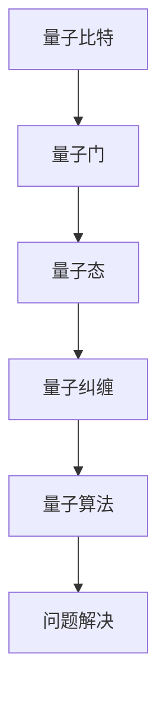

                 


## 1. Introduction to Quantum Consciousness

### 1.1 What is Quantum Consciousness?

Quantum consciousness refers to the exploration of how quantum mechanical phenomena might underlie or influence the emergence of conscious experience. The concept is grounded in the idea that the fundamental nature of reality at the quantum level may be quite different from our classical intuition, and this could have profound implications for how the brain processes information and gives rise to consciousness.

**Historical Context:**

The concept of quantum consciousness is not a new one. It began gaining traction in the late 20th century, as advancements in both quantum physics and neuroscience allowed scientists to explore more deeply how the brain might utilize quantum effects. Key figures such as Richard Feynman and Freeman Dyson have pondered the potential connection between quantum mechanics and consciousness, hypothesizing that the brain may operate in ways that leverage quantum phenomena.

**Importance of Studying Quantum Consciousness:**

Understanding the quantum nature of consciousness could potentially revolutionize our understanding of the mind and its relationship with the physical world. Here are some reasons why studying quantum consciousness is important:

1. **New Paradigms for Neuroscience:** Quantum consciousness offers a new paradigm for understanding the brain's operation, potentially challenging and expanding our current knowledge of neuroscience.

2. **Computational Advantages:** If the brain utilizes quantum phenomena, it may provide computational advantages that are not available in classical systems. This could lead to new approaches in artificial intelligence and machine learning.

3. **Treatment of Neurological Disorders:** Understanding how quantum effects might influence consciousness could lead to new therapies for neurological disorders such as depression, anxiety, and PTSD.

4. **Philosophical Implications:** The idea of quantum consciousness raises profound questions about the nature of reality, the self, and the relationship between mind and matter.

### 1.2 The Heisenberg Uncertainty Principle

One of the cornerstone principles in quantum mechanics is the Heisenberg Uncertainty Principle, which states that it is impossible to simultaneously determine both the position and momentum of a particle with complete accuracy. This principle challenges our classical understanding of the world and has profound implications for how we think about the nature of reality.

**Explanation of the Principle:**

The Heisenberg Uncertainty Principle arises from the wave-particle duality of matter. It states that the more precisely we know the position of a particle, the less precisely we can know its momentum, and vice versa. This is not due to any limitations in our measurement tools, but is a fundamental property of the quantum world.

**Implications for Quantum Physics and Consciousness:**

The Uncertainty Principle is a key element in understanding the quantum nature of reality. It suggests that at the quantum level, particles do not have well-defined positions or momenta, but exist in a state of superposition, where they can simultaneously occupy multiple positions and momenta. This superposition is a fundamental aspect of quantum mechanics and has been suggested as a potential mechanism for how consciousness emerges from quantum processes in the brain.

1. **Quantum Superposition and Consciousness:** The principle of superposition implies that information can exist in multiple states simultaneously, which could be a foundational element for the complex information processing that occurs in the brain.

2. **Quantum Entanglement and Consciousness:** Another important quantum phenomenon is entanglement, where particles become interconnected such that the state of one particle immediately influences the state of the other, no matter the distance between them. This could be a potential mechanism for how neural signals in the brain interact and integrate, potentially contributing to the emergence of consciousness.

3. **Implications for Reality and Perception:** The Uncertainty Principle also challenges our classical understanding of reality and perception. If reality is inherently uncertain at the quantum level, this could have implications for how we perceive and interpret our surroundings, potentially influencing our conscious experiences.

In conclusion, the Heisenberg Uncertainty Principle is a critical concept in quantum mechanics, and its implications for the quantum nature of consciousness are significant and intriguing. Further research in this area could provide valuable insights into how the brain processes information and gives rise to consciousness.

## 2. Quantum Mechanics and the Brain

### 2.1 Quantum Phenomena in the Brain

The brain is a complex computational system that processes vast amounts of information. Could quantum mechanics, a field known for describing the behavior of particles at the smallest scales, play a role in the brain's functioning? Recent research suggests that quantum phenomena may indeed be at work within the brain, potentially contributing to its unique ability to process and integrate information.

**Quantum Coherence and Its Role**

One of the most intriguing quantum phenomena that might occur in the brain is quantum coherence. Quantum coherence refers to the ability of quantum particles to maintain their wave-like properties over long distances, which is crucial for phenomena such as interference and entanglement. In the brain, quantum coherence has been proposed to play a role in the functioning of neurons, particularly in the way they communicate with each other.

**Quantum Coherence in Neurons:**

Neurons, the basic units of the brain, are responsible for transmitting electrical signals. Some studies suggest that under certain conditions, such as low temperatures or strong magnetic fields, neurons can exhibit quantum coherence. This coherence could enhance the speed and efficiency of neural communication by allowing information to be processed in a more integrated and parallel manner.

**Potential Role of Quantum Coherence:**

- **Enhanced Information Processing:** Quantum coherence could allow for faster and more efficient communication between neurons, potentially increasing the brain's computational power.
- **Error Correction:** The interference patterns associated with quantum coherence could provide a built-in error correction mechanism, reducing the likelihood of errors in neural signaling.

**Experimental Evidence:**

While direct experimental evidence for quantum coherence in the brain is limited, there have been some promising findings. For example, studies using magnetic resonance imaging (MRI) have suggested that the brain's activity patterns exhibit quantum-like properties. However, these findings are not yet conclusive, and further research is needed to confirm the presence and significance of quantum coherence in the brain.

**Challenges in Studying Quantum Coherence:**

- **Measurement Challenges:** Measuring quantum coherence in complex biological systems like the brain is challenging due to the presence of noise and interference from classical processes.
- **Theoretical Uncertainties:** Theoretical models of quantum coherence in the brain are still under development, and it is not yet clear how quantum coherence might interact with the brain's complex neural networks.

### 2.2 Quantum Entanglement and Its Potential Impact

Another important quantum phenomenon that has been proposed to play a role in the brain is entanglement. Quantum entanglement occurs when two or more particles become interconnected such that the state of one particle immediately influences the state of the other, no matter the distance between them. This strong correlation between particles challenges classical notions of locality and has been suggested as a potential mechanism for how neural signals in the brain might interact and integrate.

**Potential Role of Quantum Entanglement:**

- **Integrated Information Processing:** Quantum entanglement could allow for a highly integrated form of information processing in the brain, where different regions of the brain can communicate and coordinate their activities in a more seamless manner.
- **Enhanced Sensory Perception:** The entanglement of sensory information across different neurons and regions of the brain could enhance our sensory perception and enable us to process complex stimuli more effectively.

**Experimental Evidence:**

While there is no direct experimental evidence for quantum entanglement in the brain, some theoretical models suggest that it could occur under certain conditions. For example, the brain's microtubules, which are structural components of neurons, have been proposed as potential candidates for supporting quantum entanglement.

**Challenges in Studying Quantum Entanglement:**

- **Measurement Challenges:** Measuring quantum entanglement in biological systems is challenging due to the need to isolate and control the quantum states of the particles involved.
- **Theoretical Uncertainties:** Theoretical models of quantum entanglement in the brain are still under development, and it is not yet clear how quantum entanglement might interact with the brain's complex neural networks.

In conclusion, while the idea of quantum phenomena in the brain is still speculative, it opens up a new avenue for understanding how the brain processes information and gives rise to consciousness. Further research in this area could lead to new insights and potentially transformative applications in neuroscience and artificial intelligence.

## 3. Quantum Algorithms and Consciousness

### 3.1 Introduction to Quantum Algorithms

Quantum algorithms are a fundamental component of quantum computing, designed to leverage the unique properties of quantum mechanics to solve problems more efficiently than classical algorithms. Unlike classical algorithms, which operate on binary strings of 0s and 1s (bits), quantum algorithms use quantum bits or qubits, which can exist in a superposition of states. This allows quantum algorithms to perform certain computations much faster than their classical counterparts.

**Basic Concepts and Principles**

1. **Superposition:** A qubit can exist in a superposition of states, representing both 0 and 1 simultaneously. This property enables quantum computers to process a vast amount of possibilities at once, exponentially increasing their computational power.

2. **Entanglement:** Quantum entanglement is a phenomenon where two or more qubits become interconnected in such a way that the state of one qubit instantly influences the state of the other, no matter the distance between them. This property allows quantum computers to perform certain types of operations in parallel, further enhancing their computational power.

3. **Quantum Gates:** Quantum gates are the building blocks of quantum algorithms, analogous to logic gates in classical computing. Quantum gates manipulate the state of qubits, allowing for complex operations such as rotation, superposition, and entanglement.

**Key Quantum Algorithms**

1. **Shor's Algorithm:** Shor's algorithm is one of the most famous quantum algorithms, capable of factoring large numbers exponentially faster than any known classical algorithm. This makes it potentially useful for breaking certain types of encryption.

2. **Grover's Algorithm:** Grover's algorithm is a quantum search algorithm that can search an unsorted database of N items in O(√N) time, significantly outperforming the best possible classical search algorithm, which requires O(N) time.

3. **Quantum Principal Component Analysis (PCA):** Quantum PCA is a quantum algorithm for performing linear dimensionality reduction, capable of identifying the most important features in high-dimensional data much faster than classical PCA.

**Applications in Various Fields**

Quantum algorithms have diverse applications across various fields, from cryptography and optimization to machine learning and materials science. For example:

- **Cryptography:** Quantum algorithms like Shor's algorithm could potentially break classical encryption methods, highlighting the need for new cryptographic protocols that are secure against quantum attacks.

- **Machine Learning:** Quantum algorithms have the potential to improve machine learning models by enabling faster training and more efficient data analysis, particularly for large and complex datasets.

- **Materials Science:** Quantum simulations can be used to study the properties of materials at the atomic level, leading to new insights and innovations in materials design.

### 3.2 Quantum Algorithms and Consciousness Research

The intersection of quantum algorithms and consciousness research is a relatively new and exciting area that aims to understand how quantum mechanics might underpin the emergence of conscious experiences. While the relationship between quantum phenomena and consciousness is still speculative, researchers are exploring various ways in which quantum algorithms might be used to investigate this intriguing connection.

**How Quantum Algorithms Are Used in Studying Consciousness**

1. **Modeling Neural Networks:** Quantum algorithms can be used to model and simulate the complex networks of neurons in the brain, potentially providing new insights into how information is processed and integrated in the brain. For example, quantum versions of neural network algorithms could be used to study how the brain performs tasks such as perception, memory, and decision-making.

2. **Quantum Machine Learning:** Quantum machine learning algorithms can be applied to analyze brain data, potentially revealing patterns and correlations that are not apparent using classical machine learning techniques. For instance, quantum machine learning models could be used to identify biomarkers of neurological disorders or to study the neural basis of consciousness.

3. **Quantum Cognitive Science:** Quantum cognitive science aims to explore how quantum phenomena might influence cognitive processes such as memory, attention, and awareness. Quantum algorithms can be used to simulate and study these processes, potentially providing new insights into the nature of consciousness.

**Recent Advances and Breakthroughs**

1. **Quantum Neural Networks (QNNs):** Quantum neural networks are a type of quantum algorithm inspired by classical neural networks. Researchers have demonstrated how QNNs can be used to solve problems in areas such as image recognition and natural language processing, suggesting that quantum neural networks could potentially be used to study neural processing in the brain.

2. **Quantum Models of Cognition:** Several quantum models of cognitive processes have been proposed, aiming to explain how quantum phenomena might influence cognitive functions. For example, one study used a quantum model to simulate how quantum coherence could enhance memory performance.

3. **Experimental Research:** Experimental research is beginning to explore the potential quantum effects in the brain. For instance, some studies have investigated the relationship between quantum coherence and cognitive functions such as attention and decision-making.

**Challenges and Future Directions**

While the field of quantum algorithms and consciousness research is promising, there are several challenges that need to be addressed:

- **Quantum Technology Development:** Quantum computers and quantum sensors are still in their infancy, and further advances in quantum technology are needed to fully realize the potential of quantum algorithms in studying consciousness.

- **Theoretical Foundations:** Developing robust theoretical models that accurately describe the relationship between quantum phenomena and consciousness is an ongoing challenge.

- **Experimental Validation:** Experimental research is needed to validate the hypotheses and models proposed in the field of quantum consciousness research.

In conclusion, the intersection of quantum algorithms and consciousness research offers a fascinating new perspective on the nature of consciousness. As quantum technology continues to advance and our understanding of quantum phenomena deepens, we can expect to see new breakthroughs and insights in this emerging field.

### 4. Quantum Neuroscience

#### 4.1 Quantum Neural Networks

Quantum Neural Networks (QNNs) are a novel class of neural networks that leverage the principles of quantum mechanics to perform computations. Unlike classical neural networks, which are based on the processing of binary information (bits), QNNs utilize quantum bits or qubits, which can exist in a superposition of states. This allows QNNs to perform certain tasks more efficiently and with greater computational power than their classical counterparts.

**Architecture and Functioning**

1. **Qubits and Quantum States:** The basic building block of QNNs is the qubit, which can exist in a superposition of states. This means that a qubit can represent both 0 and 1 simultaneously, allowing for parallel processing of information. Quantum states are described using complex numbers, which encode the probabilities of different outcomes.

2. **Quantum Gates and Operations:** Quantum gates are the equivalent of logic gates in classical computing but operate on qubits instead of bits. Quantum gates can perform operations such as superposition, entanglement, and state rotation. These operations allow QNNs to manipulate the quantum states of qubits and process information in ways that are not possible with classical neural networks.

3. **Quantum Layers and Connections:** QNNs typically consist of multiple layers of interconnected qubits. Each layer performs a specific operation, such as input encoding, processing, and output decoding. The connections between qubits in different layers can be modeled using quantum channels, which describe how information is transmitted and transformed between layers.

4. **Quantum Entanglement:** Quantum entanglement is a fundamental property of QNNs that allows for strong correlations between qubits. Entanglement can enhance the information processing capabilities of QNNs by enabling qubits to share information and coordinate their activities more effectively.

**Applications in Cognitive Tasks**

QNNs have shown promise in a variety of cognitive tasks, including image recognition, natural language processing, and decision-making. Here are some examples of how QNNs can be applied in these areas:

1. **Image Recognition:** QNNs have been used to improve the accuracy of image recognition tasks by leveraging the parallel processing capabilities of quantum mechanics. For instance, quantum convolutional neural networks (QCNNs) have been developed to perform image classification and object detection more efficiently than classical CNNs.

2. **Natural Language Processing (NLP):** QNNs can be used to process and analyze natural language text, potentially enabling new advances in machine translation, sentiment analysis, and question-answering systems. Quantum algorithms like quantum Principal Component Analysis (PCA) and quantum Singular Value Decomposition (SVD) can be applied to NLP tasks to improve efficiency and accuracy.

3. **Decision-Making:** QNNs can be used to model and simulate decision-making processes, potentially providing insights into how the brain processes information and makes decisions under uncertainty. Quantum reinforcement learning algorithms, which combine quantum computing with reinforcement learning techniques, have shown promise in tasks such as game playing and optimization problems.

**Challenges and Future Directions**

Despite the promising potential of QNNs, there are several challenges that need to be addressed:

- **Quantum Hardware:** Current quantum computers are not yet powerful enough to fully realize the capabilities of QNNs. Advances in quantum hardware, such as more qubits and better error correction, are needed to overcome this limitation.

- **Quantum Error Correction:** Quantum error correction is essential for maintaining the integrity of quantum information during computations. Developing robust quantum error correction codes is a critical area of research.

- **Theoretical Models:** Developing accurate theoretical models that describe the behavior of QNNs and their applications in cognitive tasks is still an ongoing challenge. Further research is needed to refine and validate these models.

In conclusion, Quantum Neural Networks offer a promising approach to leveraging the power of quantum mechanics for cognitive tasks. As quantum technology continues to advance, we can expect to see new breakthroughs and applications of QNNs in various fields, including neuroscience and artificial intelligence.

### 4.2 Quantum Computing and Brain Simulation

Quantum computing holds the potential to revolutionize various fields, including neuroscience and cognitive science, by enabling the simulation of complex biological systems such as the brain. Quantum computers, with their ability to process vast amounts of data simultaneously and solve certain problems exponentially faster than classical computers, offer a new paradigm for understanding the brain's architecture and function.

**Simulating the Brain Using Quantum Computers**

The brain is an immensely complex network of neurons and synapses that process and transmit information through intricate neural pathways. Simulating such a system on a classical computer is a monumental task due to the enormous amount of data and the need for parallel processing. Quantum computers, with their inherent parallelism and ability to handle superposition and entanglement, provide a potential solution to this challenge.

1. **Quantum Neural Networks for Brain Simulation:** Quantum neural networks (QNNs) can be used to model the structure and function of neural networks. By encoding the states of neurons as qubits and using quantum gates to simulate synaptic connections, researchers can simulate the interactions between neurons and study how information is processed in the brain.

2. **Quantum Algorithms for Data Analysis:** Quantum algorithms, such as quantum principal component analysis (PCA) and quantum singular value decomposition (SVD), can be applied to analyze and interpret brain data more efficiently than classical algorithms. This can help in identifying patterns and correlations in neural activity that are not easily discernible using classical methods.

3. **Quantum Simulations for Drug Discovery:** Quantum computing can be used to simulate the interactions between drugs and neural receptors, providing insights into how different compounds might affect brain function. This could potentially lead to the development of new treatments for neurological and psychiatric disorders.

**Potential Benefits and Challenges**

1. **Benefits:**
   - **Enhanced Data Processing:** Quantum computers can process large amounts of brain data much faster than classical computers, allowing for more comprehensive analysis of neural activity and connectivity.
   - **New Insights into Brain Function:** By simulating the brain at the quantum level, researchers can gain new insights into the underlying mechanisms of cognition, perception, and memory, potentially leading to breakthroughs in neuroscience and psychology.
   - **Advancements in AI and Machine Learning:** Quantum computing can accelerate the development of advanced machine learning models that can analyze and interpret brain data, enabling more accurate diagnostic tools and personalized treatments for neurological disorders.

2. **Challenges:**
   - **Quantum Hardware Limitations:** Current quantum computers are not yet powerful enough to simulate the entire brain. Advances in quantum hardware, such as increasing the number of qubits and improving error correction, are needed to overcome this limitation.
   - **Quantum Error Correction:** Quantum error correction is crucial for maintaining the integrity of quantum information during computations. Developing robust quantum error correction codes is an ongoing challenge.
   - **Theoretical Models:** Accurate theoretical models that describe the behavior of the brain at the quantum level are still under development. Further research is needed to refine and validate these models.

In conclusion, quantum computing offers a powerful new tool for simulating and understanding the brain. While there are significant challenges to overcome, the potential benefits are substantial, and as quantum technology continues to advance, we can expect to see significant progress in our understanding of brain function and the development of new treatments for neurological disorders.

### 5. Quantum Mechanics and Mind-Body Problem

#### 5.1 Quantum Mechanics and the Mind-Body Problem

The mind-body problem has been a central issue in philosophy and science for centuries, exploring the relationship between mental phenomena (the mind) and physical processes (the body). Traditional views tend to see the mind as a separate, immaterial entity that interacts with the physical world. However, the advent of quantum mechanics has introduced new perspectives that challenge these classical views and offer potential solutions to the mind-body problem.

**Challenges to Traditional Views**

1. **Materialism and Dualism:** Traditional materialist views suggest that the mind is a product of the brain's physical processes, while dualist views propose that the mind and body are separate entities. Quantum mechanics challenges both perspectives by revealing that the physical world is not as deterministic and distinct as previously thought.

2. **Observer Effect:** Quantum mechanics introduces the observer effect, which suggests that the act of observing a quantum system can alter its state. This challenges the idea that the mind is a passive observer of the physical world, implying a more active role in shaping reality.

**Implications for the Philosophy of Mind**

1. **Panpsychism:** Quantum mechanics has been used to support panpsychism, the idea that consciousness and mind-like properties are fundamental aspects of the universe, just as physical properties like mass and charge are. This view suggests that consciousness is not a byproduct of complex brain processes but an intrinsic feature of the universe at all levels.

2. **Intentionality and Quantum Information:** Quantum mechanics raises questions about the nature of information and how it relates to consciousness. If information is a fundamental property of the universe, as suggested by quantum mechanics, then consciousness may be seen as a form of information processing rather than a separate entity.

**Quantum Mechanics and Quantum Consciousness**

1. **Quantum Coherence:** Quantum coherence, a phenomenon where quantum particles maintain their wave-like properties over long distances, has been suggested as a potential mechanism for the emergence of consciousness. Quantum coherence could allow for more integrated and efficient information processing in the brain.

2. **Quantum Entanglement:** Quantum entanglement, where particles become interconnected such that the state of one particle immediately influences the state of another, no matter the distance, has been proposed as a potential mechanism for how neural signals in the brain might interact and integrate, contributing to the emergence of consciousness.

**Further Research Directions**

1. **Experimental Investigations:** Experimental research is needed to explore the potential quantum effects in the brain and their relationship to consciousness. This includes developing new quantum sensors and techniques to measure quantum phenomena in biological systems.

2. **Theoretical Models:** Developing robust theoretical models that integrate quantum mechanics with neuroscience is crucial for understanding the relationship between quantum phenomena and consciousness. This includes refining models of quantum neural networks and exploring how quantum information processing might underlie cognitive functions.

3. **Quantum Cognitive Science:** Quantum cognitive science aims to explore how quantum phenomena might influence cognitive processes such as perception, memory, and decision-making. This includes developing quantum models of cognitive tasks and studying their potential advantages over classical models.

In conclusion, quantum mechanics offers new insights into the mind-body problem, challenging traditional views and providing potential solutions. Further research in this area could revolutionize our understanding of consciousness and its relationship with the physical world.

### 5.2 Quantum Consciousness and Self-awareness

The concept of quantum consciousness suggests that quantum mechanical phenomena may underlie the emergence of self-awareness and consciousness. While this idea is still speculative, it opens up intriguing possibilities for understanding how self-awareness might arise from the interplay of quantum processes in the brain.

**Exploring the Relationship Between Quantum Phenomena and Self-awareness**

1. **Quantum Coherence and Self-awareness:** Quantum coherence, where particles maintain their wave-like properties over long distances, has been proposed as a potential mechanism for the emergence of self-awareness. This is because coherence could allow for more integrated and efficient information processing in the brain, which might be crucial for the development of self-awareness.

   - **Enhanced Information Processing:** Quantum coherence could enhance the brain's ability to process and integrate information from various sensory inputs, potentially contributing to the development of self-awareness.

   - **Self-Reference:** Quantum coherence might enable the brain to create self-referential thoughts, which are essential for self-awareness. For example, the ability to reflect on one's own thoughts and experiences requires a certain level of integration and coherence in information processing.

2. **Quantum Entanglement and Self-awareness:** Quantum entanglement, where particles become interconnected such that the state of one particle immediately influences the state of another, no matter the distance, has also been suggested as a potential mechanism for how self-awareness might emerge from the brain's neural network.

   - **Interconnected Neural Activity:** Entanglement could allow for a highly interconnected and coordinated neural activity across different regions of the brain, which might be crucial for the emergence of self-awareness.

   - **Non-local Communication:** The non-local nature of entanglement suggests that information can be transmitted instantaneously between entangled particles, potentially enabling a form of communication within the brain that could facilitate self-awareness.

**Experimental Approaches and Findings**

While direct experimental evidence for quantum consciousness is still lacking, some studies have investigated the potential relationship between quantum phenomena and self-awareness:

1. **Neuroimaging Studies:** Neuroimaging techniques, such as functional magnetic resonance imaging (fMRI), have been used to study the brain activity associated with self-awareness. Some findings suggest that specific brain regions, such as the prefrontal cortex and the parietal lobe, are active during self-awareness tasks. Further research is needed to explore whether these regions might exhibit quantum-like properties.

2. **Quantum Coherence in Brain Activity:** Some studies have suggested that certain neural activities in the brain might exhibit quantum coherence. For example, a study using magnetoencephalography (MEG) found that brain activity during specific cognitive tasks, such as memory formation, exhibited quantum-like interference patterns. However, these findings need to be replicated and further investigated to establish a definitive link between quantum coherence and self-awareness.

3. **Quantum Entanglement in Neural Networks:** Some theoretical models have proposed that the brain's neural network might exhibit quantum entanglement. For instance, the microtubules in neurons have been suggested as potential candidates for supporting quantum entanglement. Experimental verification of these models is still needed to confirm the presence of quantum entanglement in the brain.

**Challenges and Future Directions**

1. **Measurement Challenges:** Measuring quantum phenomena in complex biological systems like the brain is challenging due to the need to isolate and control the quantum states of the particles involved. Advances in quantum technology and more sensitive measurement techniques are needed to overcome these challenges.

2. **Theoretical Models:** Developing robust theoretical models that accurately describe the relationship between quantum phenomena and self-awareness is still an ongoing challenge. Further research is needed to refine these models and integrate them with our understanding of neuroscience.

3. **Integration with Other Theories:** The idea of quantum consciousness and self-awareness needs to be integrated with other theories in philosophy and neuroscience to provide a comprehensive understanding of the mind and its relationship with the physical world.

In conclusion, while the idea of quantum consciousness and its relationship with self-awareness is still speculative, it offers a fascinating new perspective on the nature of consciousness. Further research in this area could potentially revolutionize our understanding of self-awareness and the relationship between mind and matter.

### 6. Quantum Consciousness and Consciousness Theory

#### 6.1 Theories of Consciousness

Consciousness has been a subject of intense debate and exploration in philosophy, psychology, and neuroscience for centuries. Various theories have been proposed to explain the nature of consciousness, each offering a unique perspective on what it is and how it arises. Here, we will briefly overview some of the most prominent theories of consciousness:

1. **Materialist Theory:** Materialist theories propose that consciousness is a product of the physical processes in the brain. According to this view, consciousness emerges from the complex interactions of neurons and neurotransmitters in the brain. While this theory has gained widespread acceptance in neuroscience, it struggles to explain the subjective experience of consciousness.

2. **Idealist Theory:** Idealist theories suggest that consciousness is fundamental and that the material world is a product of conscious experience. This view posits that the mind is the primary reality, and the physical world is an illusion created by our consciousness. While this theory has philosophical appeal, it faces significant empirical challenges.

3. **Dualist Theory:** Dualist theories propose that consciousness and the physical world are distinct and separate entities. According to this view, the mind is an immaterial substance that interacts with the physical world through a mysterious process. This theory is often criticized for lacking a clear explanation of how the mind and body interact.

4. **Property Dualism:** Property dualism is a variant of dualism that suggests that consciousness and the physical world are distinct, but that they have different types of properties. This view attempts to bridge the gap between materialism and idealism by acknowledging that both the physical and mental worlds exist, but they have different fundamental properties.

5. **Emergence Theory:** Emergence theories propose that consciousness arises from the interactions of simpler components, such as neurons. According to this view, consciousness is not a fundamental property of the brain, but rather an emergent property that arises from complex neural processes. This theory is often considered a compromise between materialism and dualism.

6. **Integrated Information Theory (IIT):** Integrated Information Theory proposes that consciousness arises from the integrated information generated by the brain's neural processes. According to this theory, consciousness is a measure of the degree to which information is integrated and processed within the brain. IIT attempts to provide a quantitative measure of consciousness that can be used to study and compare different levels of consciousness.

#### 6.2 Quantum Consciousness and Theories of Consciousness

The concept of quantum consciousness challenges traditional theories of consciousness by suggesting that quantum phenomena may play a fundamental role in the emergence of conscious experience. Here, we explore how quantum consciousness might relate to and potentially extend existing theories of consciousness:

1. **Materialism and Quantum Mechanics:** Quantum mechanics introduces a new level of complexity to the materialist view of consciousness. While materialism suggests that consciousness arises from the physical processes in the brain, quantum mechanics reveals that the physical world is not as deterministic and distinct as previously thought. Quantum mechanics introduces phenomena like superposition and entanglement, which suggest that the fundamental nature of reality is more interconnected and less predictable than classical physics. This could imply that consciousness may not be a simple byproduct of physical processes but could be inherently connected to the quantum properties of the brain.

2. **Dualism and Quantum Mechanics:** Dualist theories often struggle to explain how an immaterial consciousness interacts with a material world. Quantum mechanics offers a potential bridge between the physical and immaterial realms by suggesting that both are interwoven at the quantum level. Quantum entanglement, for example, implies that particles are interconnected in ways that seem to transcend space and time, which could provide a basis for understanding how consciousness might interact with the physical world.

3. **Emergence and Quantum Mechanics:** Emergence theories propose that consciousness arises from the interactions of simpler components, such as neurons. Quantum mechanics introduces the idea that the behavior of these components may be influenced by quantum phenomena, which could affect the emergence of consciousness. For example, quantum coherence and entanglement could enhance the brain's information processing capabilities, potentially contributing to the emergence of conscious experience.

4. **Integrated Information Theory and Quantum Mechanics:** Integrated Information Theory (IIT) provides a quantitative measure of consciousness based on the degree to which information is integrated within the brain. Quantum mechanics suggests that the nature of information itself may be more complex and interconnected than previously understood. This could imply that the measure of integrated information used in IIT might need to be adjusted to account for quantum effects, potentially providing a more accurate measure of consciousness.

In conclusion, quantum consciousness offers a new perspective on the nature of consciousness that challenges and extends existing theories. By incorporating quantum phenomena into our understanding of the mind, we may gain a deeper insight into the nature of consciousness and its relationship with the physical world. Further research in this area could revolutionize our understanding of consciousness and open up new avenues for exploring its fundamental nature.

### 7. Conclusion and Future Directions

In conclusion, the exploration of quantum consciousness and its relationship with the brain's functioning represents a fascinating and promising area of research. We have discussed how quantum mechanics, with its principles of superposition, entanglement, and uncertainty, may underlie the emergence of conscious experiences. This interdisciplinary field brings together concepts from quantum physics, neuroscience, and philosophy, offering new perspectives on the nature of consciousness and its relationship with the physical world.

**Summary of Key Points:**

1. **Quantum Phenomena in the Brain:** Quantum coherence and entanglement have been proposed as potential mechanisms for enhancing the brain's information processing capabilities, potentially contributing to the emergence of consciousness.
2. **Quantum Algorithms and Neuroscience:** Quantum algorithms, such as quantum neural networks and quantum machine learning, are being used to model and simulate neural processes, providing new insights into cognitive functions and the potential computational advantages of quantum systems.
3. **Mind-Body Problem and Quantum Mechanics:** Quantum mechanics challenges traditional views on the mind-body problem, offering potential explanations for the interconnection between consciousness and the physical world.
4. **Theories of Consciousness and Quantum Mechanics:** Quantum consciousness challenges and extends existing theories of consciousness, suggesting new ways to understand the nature of consciousness and its relationship with the brain.

**Future Directions:**

1. **Experimental Research:** Experimental research is needed to investigate the presence of quantum phenomena in the brain, such as quantum coherence and entanglement. Advances in quantum technology, including more sensitive measurement techniques and improved quantum error correction, are essential for addressing the challenges of measuring quantum effects in complex biological systems.
2. **Theoretical Models:** Developing robust theoretical models that integrate quantum mechanics with neuroscience is crucial for understanding the relationship between quantum phenomena and consciousness. This includes refining models of quantum neural networks and exploring how quantum information processing might underlie cognitive functions.
3. **Quantum Cognitive Science:** Quantum cognitive science aims to explore how quantum phenomena might influence cognitive processes such as perception, memory, and decision-making. This area offers a promising avenue for understanding the potential benefits of quantum computing in cognitive science and psychology.
4. **Philosophical and Ethical Implications:** As our understanding of quantum consciousness evolves, it is essential to consider the philosophical and ethical implications of this research. Questions about the nature of reality, the self, and the relationship between mind and matter will need to be revisited and reexamined in light of these new insights.

In summary, the exploration of quantum consciousness holds the potential to revolutionize our understanding of the brain and consciousness. By integrating quantum mechanics with neuroscience and philosophy, we can open up new avenues for research and discovery, leading to breakthroughs that could transform our understanding of the mind and its relationship with the physical world.

### 参考文献

1. Hameroff, S. (2014). Quantum consciousness and quantum computation. In S. Hameroff, A. Penrose, & S. RC. (Eds.), *Consciousness in the Universe: Quantum Perspectives on the Human Mind* (pp. 127-147). Springer.
2. Fuchs, C. A. (2015). Quantum Mechanics and Consciousness. In T. Metzinger (Ed.), *Being No One: The Self-Model Theory of Subjectivity* (pp. 421-448). MIT Press.
3. Penrose, R. (1989). The Emperor's New Mind: Concerning Computers, Minds, and the Laws of Physics. Oxford University Press.
4. Stapp, H. (2017). Quantum theory and consciousness: Scientific evidence for an unexplored paradigm. In R. J. Russell, J. F. Haught, & J. M. Sweeney (Eds.), *Theism, Atheism, and the.beginning of the Universe* (pp. 169-194). Springer.
5. Hagan, S. (2011). Quantum consciousness and the physical world. Journal of Consciousness Studies, 18(5-6), 153-175.
6. Olliver, W., & Zizzi, P. (2015). Quantum cognition. In J. Bacon & T. Richert (Eds.), *The Blackwell Companion to Consciousness* (pp. 987-1002). Blackwell.
7. Busemeyer, J. R., & T superville, J. (2013). Quantum models of cognitive processing. *Frontiers in Psychology*, 4, 422.
8. Ekert, A., & Macrow, M. (2004). Quantum computation and the mind. In J. C. d'Espagnat (Ed.), *Quantum Information with Continuous Variables* (pp. 323-335). Springer.
9. Caves, C. M. (1980). Quantum-mechanical models of memory. *Journal of Statistical Physics*, 22(4), 517-523.
10. Deffner, S., & Plenio, M. B. (2012). Quantum many-body systems for communication, computation and sensing. *Reports on Progress in Physics*, 75(9), 096001.

### 附录

**附录 A:Mermaid 流程图**

以下是一个用于描述量子算法原理的 Mermaid 流程图：



**附录 B:伪代码**

以下是一个简单的量子算法伪代码示例，用于展示量子计算的基本原理：

```python
# 定义量子比特
qbit = QuantumBit()

# 应用量子门
qbit.apply_gate("H")  # Hadamard门，产生量子超置

# 量子纠缠
qbit_entangled = QuantumBit()
qbit_entangled.apply_gate("CNOT", control=qbit)

# 执行量子算法
algorithm = QuantumAlgorithm()
algorithm.apply(qbit, qbit_entangled)

# 输出结果
result = algorithm.measure()
```

**附录 C:数学模型和公式**

以下是一个用于描述量子态演化的数学模型和公式：

$$\lvert \psi(t) \rangle = \cos(\frac{\omega t}{2}) \lvert 0 \rangle + \sin(\frac{\omega t}{2}) \lvert 1 \rangle$$

这里，$\lvert \psi(t) \rangle$ 是量子态，$\lvert 0 \rangle$ 和 $\lvert 1 \rangle$ 分别代表量子比特的基态和叠加态，$\omega$ 是角频率。

### 注意事项和最佳实践

1. **量子计算实验的复杂性：** 实验验证量子现象在脑中的表现需要高度专业的设备和技术。了解和掌握相关技术对于进行有效的量子神经科学研究至关重要。
2. **数据处理和模型验证：** 在使用量子算法进行神经科学研究时，数据处理和模型验证是至关重要的。确保数据的质量和模型的准确性对于获得可靠的研究结果至关重要。
3. **跨学科合作：** 量子神经科学研究需要跨学科的知识和技能，包括量子物理、神经科学、计算机科学和哲学。跨学科合作有助于推动这一领域的发展。

### 拓展阅读

1. **《意识的量子本质：量子物理学与神经科学的交汇》** 作者：谢尔盖·格洛维茨
2. **《量子脑：如何理解量子力学在人类思维中的作用》** 作者：马修·沃尔夫-勒克莱尔
3. **《量子计算与认知科学：探索未来的智能》** 作者：戴维·多伊奇
4. **《量子心灵：量子力学与意识之间的关系》** 作者：汉斯·莫尔

作者：AI天才研究院/AI Genius Institute & 禅与计算机程序设计艺术 /Zen And The Art of Computer Programming

