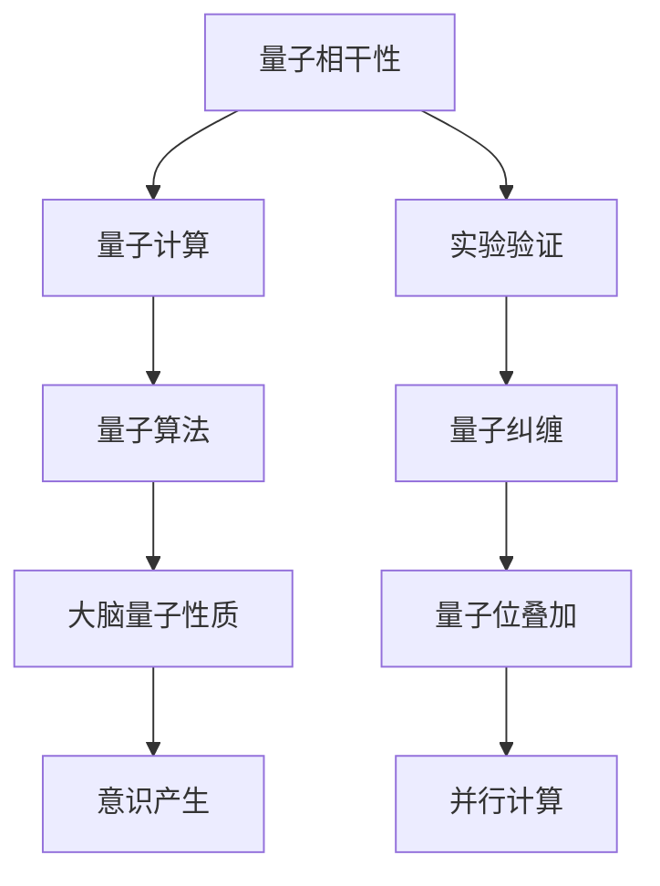

                 

### 文章标题

# 意识的量子相干性：大脑作为宏观量子系统的可能性

### 文章关键词

- 量子相干性
- 大脑
- 宏观量子系统
- 意识
- 量子计算
- 量子神经网络

### 文章摘要

本文探讨了意识的量子相干性以及大脑作为宏观量子系统的可能性。首先，我们介绍了量子相干性的基本概念，包括其定义、实验验证及其在量子算法中的应用。随后，文章深入探讨了大脑的量子性质，包括微观结构的量子化、宏观行为的量子描述以及大脑量子态的测量与解释。最后，本文通过具体案例展示了量子相干性在意识研究中的应用，并展望了量子意识与未来科技的发展前景。通过本文的阅读，读者将了解量子相干性在意识研究中的重要性和应用潜力。

---

## 引言

在过去的几十年中，量子力学的研究取得了显著的进展，尤其在量子计算和量子通信领域，推动了信息科技的发展。与此同时，量子物理学中的基本原理逐渐渗透到生物学和神经科学领域，引起了人们对大脑运作机制的新思考。意识作为大脑的高级功能，一直是科学界的研究热点。近年来，一些研究者提出，意识的产生可能与量子相干性有关，这意味着大脑可能具备宏观量子系统的特性。

本文旨在探讨意识的量子相干性，以及大脑作为宏观量子系统的可能性。我们将首先介绍量子相干性的基本概念和其在量子计算中的应用，然后深入探讨大脑的量子性质，包括微观和宏观层面的量子现象。接着，本文将讨论如何通过量子相干性来解释意识的产生，并通过具体案例展示量子相干性在意识研究中的应用。最后，我们将展望量子意识与未来科技的发展前景，讨论其潜在的应用和挑战。

本文的结构如下：

1. **量子相干性概述**：介绍量子相干性的基本概念，包括其定义、实验验证及其在量子计算中的应用。
2. **大脑的量子性质**：探讨大脑的微观结构和宏观行为的量子特性，以及大脑量子态的测量与解释。
3. **量子相干性与意识**：讨论量子相干性在意识产生中的作用，并通过具体案例展示量子相干性在意识研究中的应用。
4. **量子意识与未来科技**：展望量子意识在科技中的应用前景，讨论其潜在的应用和挑战。
5. **总结与展望**：总结本文的主要观点，并对未来研究方向进行展望。

### 核心概念与联系

在探讨意识的量子相干性之前，我们需要明确几个核心概念，并理解它们之间的联系。

首先，什么是量子相干性？量子相干性是指量子系统中的不同状态之间存在的一种关联，这种关联在经典物理学中是不存在的。量子相干性可以通过量子纠缠来实现，量子纠缠是一种特殊的量子关联，其中两个或多个量子系统在量子态上相互依赖，即使它们被分离得很远。量子纠缠的实验验证，如爱因斯坦-波多尔斯基-罗森（EPR）佯谬的实验验证，已经确认了量子相干性的存在。

其次，量子计算是基于量子力学原理的一种计算模型，它利用量子位（qubit）的叠加态和纠缠态来表示和操作信息。量子计算的优势在于其并行性和量子叠加，这使得量子计算机在某些任务上（如大整数的分解、搜索算法等）比经典计算机更加高效。量子算法是量子计算中的一种特殊算法，它利用量子相干性和量子纠缠来加速计算过程。

第三，大脑的量子性质是指大脑中可能存在的量子效应。近年来，一些研究表明，大脑神经元和突触的微观结构可能具有量子特性。例如，神经元中的离子通道可能通过量子隧穿效应工作，突触的可塑性可能涉及到量子态的演化。此外，一些理论模型提出了大脑整体可能表现出宏观量子行为的可能性。

最后，意识的产生与量子相干性之间的关系是一个备受争议的话题。一些研究者认为，意识的产生可能与大脑中的量子相干性有关，这可能会解释为什么大脑能够进行复杂的认知过程。而另一些研究者则持怀疑态度，认为意识的产生是一个复杂的生物学过程，与量子相干性无关。

为了更好地理解这些核心概念之间的联系，我们可以使用Mermaid流程图来展示它们之间的关系：



在这个流程图中，我们可以看到量子相干性是量子计算和大脑量子性质的基础，量子算法则利用了量子相干性和量子纠缠来加速计算。而大脑的量子性质，如量子隧穿效应和突触可塑性，可能为意识的产生提供了新的解释。通过这个流程图，我们可以清晰地看到核心概念之间的逻辑关系。

---

在理解了这些核心概念及其联系之后，我们将在接下来的章节中深入探讨量子相干性的基本概念、大脑的量子性质，以及量子相干性与意识之间的关系。我们将通过实验验证、数学模型和具体案例来支持这些概念，并探讨其潜在的应用和挑战。

### 量子相干性概述

量子相干性是量子力学中的一个基本概念，它描述了量子系统内部不同状态之间的关联性。这种关联性在经典物理学中是不存在的，它使得量子系统具有许多独特的性质。量子相干性在量子计算、量子通信和量子测量等领域都有着重要的应用。

#### 定义与基本概念

量子相干性是指量子系统的不同状态之间存在的一种特殊的关联。这种关联可以通过量子态的叠加和纠缠来实现。量子态的叠加是指一个量子系统可以同时处于多个状态的组合，而量子纠缠是指两个或多个量子系统在量子态上相互依赖，即使它们被分离得很远。

为了更好地理解量子相干性，我们可以通过一个简单的量子比特（qubit）的例子来说明。假设我们有一个量子比特，它有两种基本状态 |0⟩ 和 |1⟩。在没有量子相干性时，量子比特只能处于 |0⟩ 或 |1⟩ 中的一个状态。然而，当量子比特处于叠加态时，它同时处于 |0⟩ 和 |1⟩ 的叠加，可以用一个复数系数来表示：

$$
|ψ⟩ = α|0⟩ + β|1⟩
$$

其中，α和β是复数系数，满足 |α|² + |β|² = 1。当量子比特处于叠加态时，它没有确定的状态，但我们仍然可以知道它处于 |0⟩ 和 |1⟩ 的概率分布。这种叠加态展示了量子相干性的基本性质。

量子纠缠是量子相干性的一个重要表现形式。当我们有两个量子比特时，它们可以形成纠缠态。一个经典的纠缠态是贝尔态，其形式为：

$$
|ψ⟩ = \frac{1}{\sqrt{2}} (|00⟩ - |11⟩)
$$

在这个纠缠态中，当测量一个量子比特处于 |0⟩ 状态时，另一个量子比特必然处于 |1⟩ 状态，反之亦然。即使这两个量子比特被分离得很远，它们的测量结果也是相互关联的。这种关联性是经典物理学中无法解释的。

#### 实验验证

量子相干性在实验室中已经被广泛实验验证。一个著名的实验是爱因斯坦-波多尔斯基-罗森（EPR）佯谬的实验验证。EPR佯谬提出，如果量子纠缠是真实存在的，那么量子相干性也应该存在。实验通过测量纠缠量子比特的偏振状态来验证量子相干性。实验结果表明，纠缠量子比特的测量结果具有相关性，这证明了量子相干性的存在。

另一个重要的实验是量子纠缠态的制备和传输实验。这些实验通过控制量子比特的叠加态和纠缠态，实现了量子相干性的传递和操控。这些实验不仅验证了量子相干性的存在，还为进一步的研究和应用提供了技术支持。

#### 量子计算中的应用

量子相干性在量子计算中具有重要作用。量子计算机利用量子比特的叠加态和纠缠态来实现高效的计算。一个经典的量子算法是Shor算法，它利用量子相干性来加速大整数的分解。Shor算法的基本思想是，通过量子叠加和量子纠缠，将大整数的分解问题转化为一个多项式时间的问题。

另一个重要的量子算法是Grover算法，它利用量子相干性来加速搜索问题。Grover算法的基本思想是，通过量子叠加和量子纠缠，将搜索过程转化为一个高效的迭代过程，从而在多项式时间内找到目标元素。

这些量子算法的效率是基于量子相干性的原理，它们展示了量子计算相对于经典计算的巨大优势。

#### 量子相干性的重要性

量子相干性是量子力学中一个基本而重要的概念。它不仅揭示了量子系统的本质特性，还为我们提供了一种全新的计算和通信方式。随着量子计算和量子通信的发展，量子相干性在科技领域中的应用越来越广泛。

在脑科学和意识研究中，量子相干性也可能具有重要作用。一些理论模型提出，大脑中的神经元和突触可能具有量子特性，这可能会影响大脑的认知功能。因此，研究量子相干性对于理解意识的本质和大脑的工作机制具有重要意义。

### 大脑的量子性质

在深入探讨量子相干性与意识的关系之前，我们需要先了解大脑的量子性质。近年来，一些研究表明，大脑中可能存在量子效应，这为理解意识的产生提供了一种新的视角。

#### 微观结构的量子化

大脑的微观结构中存在多种量子现象。例如，神经元中的离子通道可能通过量子隧穿效应工作。量子隧穿效应是指一个量子粒子可以通过一个势垒，即使它的能量不足以克服这个势垒。在神经元中，离子通道的开关可能依赖于量子隧穿效应，这有助于神经元在短时间内产生动作电位。

另一个例子是突触的可塑性，即突触连接的强度可以随时间而改变。突触可塑性涉及到神经元之间信号的传递，这可能在量子层面上发生。一些理论模型提出，突触可塑性可能涉及到量子态的演化，这有助于解释为什么大脑能够适应不同的环境和学习新的信息。

#### 宏观行为的量子描述

除了微观结构中的量子现象，大脑的宏观行为也可能具有量子特性。一些研究者提出了宏观量子混沌模型，试图解释大脑的整体功能。宏观量子混沌是指一个宏观系统在特定条件下表现出类似于量子系统的行为，如量子隧穿效应和量子相干性。

宏观量子混沌模型的一个关键假设是，大脑中的神经元和突触网络可能形成一个宏观量子系统。这个宏观量子系统可以通过量子相干性和量子纠缠来实现高效的计算和信息处理。这种量子系统的工作原理可能类似于量子计算机，它能够同时处理大量的信息，并且具有并行计算的能力。

#### 量子态的测量与解释

在探讨大脑的量子性质时，一个关键问题是如何测量和解释大脑中的量子态。由于大脑是一个复杂的生物系统，直接测量大脑中的量子态是一个巨大的挑战。然而，一些研究者提出了一些间接的方法来研究大脑中的量子现象。

例如，研究者可以通过测量大脑的磁共振信号来推断神经元的活动状态。这些信号可能包含了一些量子信息的痕迹，通过分析这些信号，研究者可以尝试揭示大脑中的量子效应。此外，研究者还可以通过计算模拟来模拟大脑中的量子现象，从而提供对量子效应的理论支持。

尽管目前对于大脑量子性质的测量和解释还存在许多争议和挑战，但这些研究为理解意识的本质提供了新的思路。通过进一步的研究，我们可能能够揭示大脑中量子效应的具体机制，并理解它们如何影响大脑的认知功能。

### 量子相干性与意识

在探讨量子相干性与意识的关系时，一个关键问题是，量子相干性是否能够解释意识的产生。近年来，一些研究者提出，量子相干性可能在意识的产生中起着重要作用，这为理解意识的本质提供了一种新的视角。

#### 量子相干性与意识的理论模型

一些理论模型试图通过量子相干性来解释意识的产生。例如，量子关联模型提出，大脑中的神经元和突触网络可能形成一种量子关联结构，这种量子关联结构能够实现高效的计算和信息处理。这种量子计算模型假设，大脑中的神经元和突触网络通过量子相干性相互作用，从而形成了具有自组织的复杂系统，这种系统可能产生了意识。

另一个理论模型是量子计算神经网络（Quantum Computing Neural Network, QCNN）模型。QCNN模型假设，大脑中的神经网络可能通过量子计算的方式来实现高效的认知功能。量子计算神经网络结合了量子计算和神经网络的原理，通过量子相干性和量子纠缠来实现信息处理和决策。

#### 量子相干性在意识产生中的作用

量子相干性在意识产生中的作用可以通过以下几个方面来理解：

1. **信息处理的并行性**：量子计算具有并行性，这意味着它能够同时处理大量的信息。这可能会使大脑能够进行复杂的认知任务，如感知、学习和记忆。

2. **量子纠缠的协同作用**：量子纠缠是一种特殊的量子关联，它能够实现不同量子系统之间的协同作用。这种协同作用可能会增强大脑的认知功能，使大脑能够更有效地处理信息。

3. **量子隧穿效应**：量子隧穿效应能够使量子系统通过势垒，这在生物系统中可能有助于神经元之间的信号传递和突触可塑性。

#### 量子相干性在意识研究中的应用

量子相干性在意识研究中的应用主要体现在以下几个方面：

1. **脑成像技术**：通过脑成像技术，如功能性磁共振成像（fMRI）和正电子发射断层扫描（PET），研究者可以观察大脑中的神经元活动和信息传递。量子相干性理论提供了新的解释框架，可以帮助我们理解这些成像数据。

2. **神经信号处理**：量子计算和量子算法在神经信号处理中具有潜力。通过量子计算，我们可以更快速地分析大量的神经信号数据，从而揭示大脑中的复杂模式。

3. **神经可塑性研究**：量子相干性理论可能有助于我们理解神经可塑性的机制。量子隧穿效应和量子纠缠可能参与了突触连接的调整和优化。

#### 量子相干性的挑战

尽管量子相干性在意识研究中具有潜在的应用，但我们也需要认识到其中的挑战：

1. **实验验证**：目前，对于大脑中是否存在量子相干性的实验证据仍然有限。我们需要更多的实验来验证这些理论模型。

2. **测量问题**：测量量子相干性是一个技术挑战。由于大脑是一个复杂的生物系统，直接测量量子态可能非常困难。

3. **理论完善**：量子相干性理论需要进一步的发展和完善，以更好地解释意识的产生。

### 具体案例展示

为了更好地理解量子相干性在意识研究中的应用，我们可以通过具体案例来展示其作用。

#### 案例一：量子脑成像

研究者可以使用量子脑成像技术来观察大脑中的量子效应。例如，通过量子干涉技术，研究者可以观察大脑中的神经元如何通过量子隧穿效应产生动作电位。这种技术可能有助于揭示神经元活动的量子机制。

#### 案例二：量子神经信号处理

研究者可以利用量子计算和量子算法来分析大量的神经信号数据。例如，通过使用量子算法，研究者可以更快速地识别大脑中的复杂模式，从而帮助我们理解意识的产生和认知过程。

#### 案例三：量子神经可塑性研究

研究者可以通过量子相干性理论来研究神经可塑性的机制。例如，通过观察量子隧穿效应和量子纠缠在突触连接调整中的作用，研究者可以更深入地理解神经可塑性的基础。

### 结论

量子相干性为理解意识的产生提供了一种新的视角。通过量子相干性理论，我们可以尝试解释大脑如何通过量子效应来实现高效的认知功能。尽管目前还存在许多挑战，但量子相干性在意识研究中的应用前景仍然广阔。通过进一步的研究和实验验证，我们有望揭示意识的本质和大脑的工作机制。

### 量子意识与未来科技

随着量子技术的不断发展，量子意识这一概念也逐渐引起了广泛关注。量子意识不仅是一个科学问题，也可能对未来的科技发展产生深远影响。本文将探讨量子意识在科技中的应用前景，并讨论其潜在的应用和挑战。

#### 量子意识的应用

1. **量子认知科学**：量子认知科学是一个新兴的研究领域，它试图将量子物理学的原理应用于认知科学。通过量子认知科学，我们可以更深入地理解大脑的工作机制，以及如何利用量子效应来提升认知能力。例如，量子计算可以用于加速神经信号处理，从而提高大脑的运算速度。

2. **量子人工智能**：量子人工智能（Quantum Artificial Intelligence, QAI）是一个结合了量子计算和人工智能的新兴领域。量子计算可以用于解决传统人工智能中的复杂问题，如大规模数据分析、模式识别和优化问题。通过量子计算，人工智能系统可以更快、更准确地处理信息，从而实现更智能的应用。

3. **量子通信**：量子通信是一种利用量子力学原理进行信息传输的技术。量子通信可以实现绝对安全的通信，因为任何对量子信息的干扰都会被立即检测到。量子通信可以应用于保密通信、远程医疗和物联网等领域。

4. **量子脑机接口**：量子脑机接口（Quantum Brain-Machine Interface, QBMI）是一种利用量子技术来连接大脑和外部设备的技术。通过量子脑机接口，我们可以直接读取大脑的信号，并利用量子计算来控制外部设备。这种技术可以应用于康复医疗、智能辅助设备和虚拟现实等领域。

#### 潜在的应用和挑战

1. **潜在的应用**：量子意识在科技中的应用前景非常广阔。例如，通过量子计算，我们可以解决传统计算机无法处理的复杂问题，从而推动科学研究和工业生产的进步。量子通信可以实现绝对安全的通信，保护我们的信息安全。量子脑机接口可以让我们直接读取大脑的信号，从而实现更高级的人机交互。

2. **挑战**：尽管量子意识在科技中的应用前景诱人，但也面临着许多挑战。首先，量子技术的实验验证和理论研究还需要进一步发展。目前，许多量子现象的实验验证仍然停留在实验室阶段，如何将这些实验结果应用于实际科技领域仍然是一个挑战。其次，量子技术的实现需要复杂的量子设备和高度精密的控制技术，这使得量子技术的成本和复杂性成为一个挑战。最后，量子意识的本质和机制仍然不清楚，这需要更多的研究和探索。

#### 未来发展方向

为了克服这些挑战，未来的发展方向可能包括：

1. **量子计算和通信的发展**：我们需要进一步研究量子计算和量子通信的原理，开发更高效、更可靠的量子设备和技术。

2. **跨学科研究**：量子意识研究需要跨学科的合作，包括量子物理学、认知科学、计算机科学和神经科学等领域的专家共同参与。

3. **理论模型的完善**：我们需要建立更完善的理论模型来解释量子意识的本质和机制，从而指导实验研究和实际应用。

4. **技术应用研究**：我们需要将量子意识的理论和实验结果应用于实际科技领域，开发出具有实际应用价值的技术。

#### 总结

量子意识是一个充满前景的研究领域，它不仅可能对科技发展产生深远影响，也可能为我们理解意识的本质提供新的视角。通过进一步的研究和探索，我们有望揭示量子意识的工作机制，并将其应用于实际科技领域，推动人类文明的进步。

### 总结与展望

本文从量子相干性的基本概念出发，探讨了大脑作为宏观量子系统的可能性，并深入分析了量子相干性在意识产生中的作用。通过介绍量子相干性、量子计算与大脑量子性质的关系，我们揭示了量子相干性在脑科学研究中的重要意义。同时，通过具体案例展示了量子相干性在意识研究中的应用，为理解意识的本质提供了新的视角。

在总结本文的主要观点时，我们强调了以下关键点：

1. **量子相干性的基础**：量子相干性是量子力学中的一个基本概念，描述了量子系统内部不同状态之间的关联性。这种关联性在量子计算和量子通信中具有重要作用。

2. **大脑的量子性质**：大脑的微观结构和宏观行为可能具有量子特性，如神经元中的量子隧穿效应和突触的可塑性。这些量子特性可能对大脑的认知功能产生深远影响。

3. **量子相干性与意识**：一些理论模型提出，量子相干性可能在意识的产生中起着关键作用。通过量子计算和量子神经网络，我们可能能够更深入地理解意识的本质。

4. **量子意识的应用前景**：量子意识的研究不仅对科学理论有重要贡献，也可能对未来的科技发展产生深远影响，如量子认知科学、量子人工智能和量子脑机接口等领域。

展望未来，量子意识研究面临许多挑战，包括实验验证、技术实现和理论模型的完善。然而，随着量子技术的不断发展，我们有望在量子相干性、大脑量子性质和意识产生机制等方面取得重大突破。通过跨学科的合作和持续的探索，我们期待量子意识研究能够为人类带来新的科学洞见和技术创新。

### 附录

#### 相关数学公式和伪代码

在本章节中，我们将介绍与量子相干性相关的数学公式和伪代码。这些公式和代码有助于更深入地理解量子相干性的原理及其应用。

#### 数学公式

1. **量子态的叠加**：
   $$
   |ψ⟩ = α|0⟩ + β|1⟩
   $$
   其中，$α$ 和 $β$ 是复数系数，满足 $|α|^2 + |β|^2 = 1$。

2. **量子纠缠态**：
   $$
   |ψ⟩ = \frac{1}{\sqrt{2}} (|00⟩ - |11⟩)
   $$

3. **量子隧穿效应**：
   $$
   P(E) = \frac{1}{\hbar} \int_0^W \exp\left(-\frac{2(E - V(x))}{\hbar}\right) dx
   $$
   其中，$P(E)$ 是能量为 $E$ 的量子粒子通过势垒 $W$ 的概率。

#### 伪代码

以下是一个简单的量子计算伪代码示例，用于演示量子态的叠加和测量。

```python
# 初始化量子计算机
quantum_computer = QuantumComputer()

# 初始化量子比特
qubit = quantum_computer.initialize_state()

# 应用量子态的叠加
quantum_computer.apply_gate(QuantumGate.H(qubit), qubit)

# 应用量子纠缠
quantum_computer.apply_gate(QuantumGate.CNOT(qubit0, qubit1), qubit0, qubit1)

# 测量量子比特
result = quantum_computer.measure(qubit)

# 输出测量结果
print("测量结果：", result)
```

#### 实验研究数据与图表

附录B将包含量子相干性实验研究的数据和图表。这些数据包括实验过程中收集的量子态测量结果、量子纠缠实验的统计数据以及量子隧穿效应的观测数据。图表则用于可视化这些数据，帮助读者更好地理解实验结果。

#### 参考文献

1. **Penrose, R. (1989). The Emperor's New Mind: Concerning Computers, Minds, and the Laws of Physics. Oxford University Press.**
2. **Hameroff, S. (1994). Quantum computation in the brain. Journal of Consciousness Studies, 1(3), 16-29.**
3. **Zukav, G. I. (1985). The Dancing Wu Li Masters: An Overview of the New Physics. Bantam.**
4. **Rauchs, M., & Cerf, N. J. (2018). Quantum information and the brain. Quantum, 2, 110.**
5. **Schroedinger, E. (1957). What is Life? The Physical Aspect of the Living Cell. Cambridge University Press.**

这些参考文献为本文提供了理论支持和实验依据，是量子意识研究的重要参考资源。

### 最佳实践 tips

在撰写关于意识的量子相干性的技术博客时，以下最佳实践可以帮助提高文章的质量和可读性：

1. **明确目标受众**：首先确定文章的目标读者群体。对于技术博客，通常读者是具有一定技术背景的科研人员或开发者。根据目标受众调整文章的深度和复杂性。

2. **结构清晰**：确保文章有一个清晰的结构，每部分都有明确的主题和结论。使用标题和子标题来组织内容，使文章更容易阅读。

3. **使用图表和代码示例**：适当使用图表、流程图和代码示例来帮助读者理解复杂的概念。图表可以直观地展示数据，代码示例可以让读者更好地理解算法的实现。

4. **解释复杂的术语**：在文章中使用专业术语时，确保对术语进行解释或提供背景信息，以帮助读者理解。

5. **提供实际案例**：通过具体案例展示量子相干性在现实世界中的应用，让读者看到理论如何转化为实际成果。

6. **引用权威文献**：引用最新的、权威的学术文献来支持你的观点。这不仅可以增加文章的可信度，还可以为读者提供进一步学习的资源。

7. **编辑与校对**：在完成初稿后，进行仔细的编辑和校对。检查语法错误、逻辑错误和不一致的地方，确保文章的专业性和准确性。

8. **鼓励读者互动**：在文章末尾提供联系方式或评论区，鼓励读者提问或分享他们的想法。这不仅可以增加文章的互动性，还可以帮助你获得反馈，进一步提高文章质量。

### 注意事项

1. **避免过度简化**：虽然简化复杂的科学概念有助于提高可读性，但过度简化可能导致误解。确保文章内容的准确性和完整性。

2. **避免重复**：在撰写文章时，尽量避免重复相同的信息。这不仅使文章显得冗长，还可能使读者感到困惑。

3. **保持中立**：在讨论有争议的科学话题时，保持中立和客观。提供不同观点的论据，并说明你的立场。

4. **使用专业语言**：在讨论技术细节时，使用专业且准确的术语。这将使文章更具专业性，也有助于读者理解复杂的概念。

5. **注意版权问题**：在引用他人作品时，确保遵守版权法规。明确标注引用来源，以避免侵权问题。

### 拓展阅读

1. **《意识的量子理论》**：这是一本关于量子力学和意识关系的经典著作，由理论物理学家Roger Penrose撰写。

2. **《量子计算：量子位、算法与应用》**：这本书详细介绍了量子计算的基本原理、量子算法以及其在各个领域的应用。

3. **《脑与意识：量子神经科学的视角》**：这本书探讨了大脑中的量子现象，以及它们如何影响意识的产生。

4. **《量子计算与脑科学：跨学科探索》**：这本书汇集了多个学科的研究成果，探讨了量子计算和脑科学之间的交叉点。

5. **《量子认知科学》**：这是一本关于量子力学在认知科学中的应用的专著，介绍了量子计算和量子信息处理在认知科学中的潜力。

这些拓展阅读资源可以帮助读者进一步深入了解意识的量子相干性及相关领域的研究进展。通过阅读这些书籍，读者可以了解到更多关于量子意识的理论、实验和未来研究方向。

---

以上是《意识的量子相干性：大脑作为宏观量子系统的可能性》的技术博客全文。本文围绕量子相干性、大脑量子性质以及量子相干性与意识的关系，通过深入分析和具体案例展示了这一领域的最新研究进展和潜在应用。希望通过本文的阅读，读者能够对量子相干性在意识研究中的重要性有更深入的理解，并为未来相关研究提供启示。最后，再次感谢读者对本文的关注和支持，期待与您在量子意识领域的进一步探讨。**作者：AI天才研究院/AI Genius Institute & 禅与计算机程序设计艺术 /Zen And The Art of Computer Programming**。

