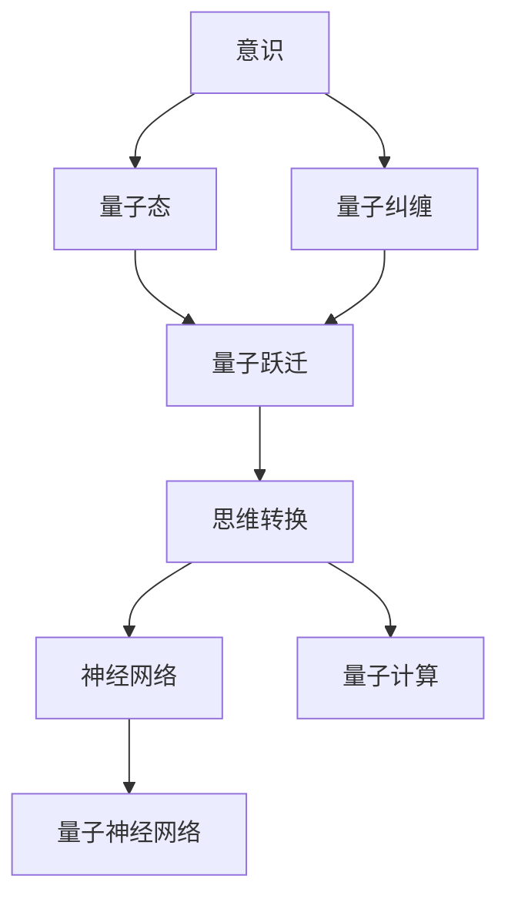

                 

### 《意识的量子跃迁：思维转换的物理学描述》

#### 关键词
- 意识
- 量子跃迁
- 物理学描述
- 思维转换
- 神经网络
- 量子计算

#### 摘要
本文探讨了意识的量子跃迁与思维转换的物理学描述。首先，我们回顾了意识、量子跃迁和思维转换的基本概念。接着，我们通过Mermaid流程图展示了这些概念之间的关系。随后，我们深入讲解了神经网络和量子计算在思维转换中的应用，并使用伪代码和LaTeX公式详细阐述了核心算法原理。通过一个实际案例，我们展示了如何应用这些理论进行思维转换的物理描述。最后，我们总结了研究成果，并对未来研究方向提出了展望。

## 第一部分：引论

### 1. 引言

随着计算机科学和人工智能的飞速发展，人类对于思维、意识和认知的理解也不断深入。然而，意识本身仍然是一个复杂的哲学和科学问题。近年来，量子物理学的研究为解释意识现象提供了一种全新的视角。量子跃迁作为一种基本的物理过程，其与意识之间的关系引起了广泛关注。在本文中，我们将探讨意识的量子跃迁以及如何用物理学描述思维转换。

### 2. 意识、量子跃迁与思维转换概述

**意识**：意识是指个体对于自身存在、感知和思维状态的认知。哲学家们长期以来对意识进行了深入的探讨，提出了多种关于意识本质的理论。在计算机科学和认知科学领域，意识通常被看作是大脑或神经系统的一种复杂动态过程。

**量子跃迁**：量子跃迁是量子物理学中的一个基本过程，描述了一个原子或分子从一个能量状态转换到另一个能量状态的过程。这种转换通常是在极短的时间内发生的，并且不受外部干扰。

**思维转换**：思维转换是指思维状态从一个层面到另一个层面的转变。这种转换可能发生在学习新知识、解决问题或面对复杂情境时。

理解这三个概念之间的关系，有助于我们更好地探索意识的物理学描述。在接下来的章节中，我们将详细讨论这些概念，并探讨如何将量子物理学应用于思维转换的描述。

## 第二部分：核心概念与联系

### 3. 意识的物理学描述

意识的物理学描述尝试将心理学和神经科学的观察结果与物理学原理相结合。量子物理学提供了一个潜在的框架来探索意识如何产生。以下是几个关键的物理学概念：

**量子态**：在量子物理学中，粒子如电子具有波粒二象性，它们的物理状态可以用波函数描述。波函数的平方给出了粒子在空间中出现的概率。

**量子叠加态**：一个量子系统可以同时处于多个状态，这种状态被称为量子叠加态。例如，一个电子可以同时处于自旋向上和自旋向下的状态。

**量子纠缠**：当两个或多个量子系统相互作用时，它们可能会进入一种量子纠缠状态。在这种状态下，一个系统的状态会即时影响另一个系统的状态，无论它们之间的距离有多远。

**意识与量子态的关系**：一些理论家认为，意识可能源自大脑中的量子过程。例如，某些神经元可能以量子方式相互作用，产生意识。

### 4. 量子跃迁原理与比喻

量子跃迁是量子物理学中的核心概念，描述了粒子从一个能量状态跃迁到另一个能量状态的过程。这种跃迁通常遵循以下步骤：

1. **激发**：粒子吸收能量，从低能态跃迁到高能态。
2. **跃迁**：粒子在极短的时间内从高能态返回到低能态，同时释放能量。
3. **测量**：测量过程会导致量子系统从叠加态坍缩到一个确定的状态。

量子跃迁的原理可以被比喻为意识的思维转换过程：

- **激发**：类似于在思考问题时获得灵感或新观点。
- **跃迁**：思维从一个状态迅速转换到另一个状态。
- **测量**：对外部环境的观察或自我认知，使得思维状态确定下来。

这种比喻帮助我们理解量子跃迁如何在思维转换中发挥作用。

### 5. 思维转换的模型与方法

**神经网络模型**：神经网络是一种模拟人脑神经元结构和功能的计算模型。它通过多层节点（神经元）和权重连接来处理信息。在思维转换中，神经网络可以用来模拟学习、记忆和推理过程。

**量子计算模型**：量子计算利用量子比特（qubit）进行计算，可以在同一时间处理多个状态。量子计算模型可以模拟复杂的思维转换过程，如问题解决和创新思维。

**模型与方法的联系**：

- **神经网络与量子计算的结合**：量子神经网络（QNN）将量子计算的优势与神经网络的结构相结合，可以更高效地模拟思维转换过程。
- **跨领域方法的整合**：通过整合心理学、神经科学和物理学的理论，可以更全面地理解思维转换的物理学描述。

### 6. Mermaid流程图：核心概念关系展示

以下是一个使用Mermaid绘制的流程图，展示了意识、量子跃迁和思维转换之间的关系：



这个流程图展示了意识通过量子态和量子纠缠影响量子跃迁，进而驱动思维转换。同时，神经网络和量子计算在思维转换中发挥着重要作用。

## 第三部分：核心算法原理讲解

### 7. 神经网络在思维转换中的应用

神经网络（Neural Networks, NN）是模仿人脑神经网络工作原理的一种计算模型，广泛应用于图像识别、自然语言处理等领域。在思维转换研究中，神经网络可以模拟认知过程中的学习、记忆和推理。

**基本结构**：一个典型的神经网络包括输入层、隐藏层和输出层。每个层由多个神经元组成，神经元之间通过权重连接。

**工作原理**：输入数据通过输入层传入，经过隐藏层处理，最终在输出层产生输出。每个神经元的激活函数决定了神经元是否会被激活，从而影响整个网络的输出。

**应用场景**：

- **学习与记忆**：神经网络可以通过反向传播算法学习输入和输出之间的映射关系，从而实现知识的获取和记忆。
- **问题解决**：神经网络可以用于模拟人类解决问题的方式，通过不断调整权重，找到最优解。

### 8. 量子计算与思维转换

量子计算（Quantum Computing, QC）利用量子力学原理，在计算机中实现高效的计算。量子计算机使用量子比特（qubits）作为基本的信息单元，可以同时表示0和1的状态，这使得量子计算机具有超越经典计算机的潜力。

**基本原理**：

- **量子比特**：量子比特（qubits）可以同时处于0和1的状态，这种性质称为叠加。
- **量子纠缠**：量子比特之间的量子纠缠使得它们的状态可以相互影响，即使相隔很远。

**应用场景**：

- **复杂问题求解**：量子计算可以用于求解复杂的优化问题，如旅行商问题、供应链管理等。
- **模拟量子系统**：量子计算可以模拟量子物理过程，为研究量子现象提供工具。

### 9. 难题与挑战：算法优化与可靠性

尽管神经网络和量子计算在思维转换中具有巨大潜力，但实际应用中仍面临诸多挑战。

**算法优化**：

- **训练效率**：神经网络训练过程可能非常耗时，需要优化算法以加速训练。
- **过拟合**：神经网络模型可能在新数据上表现不佳，需要避免过拟合现象。

**可靠性**：

- **量子比特错误**：量子计算中的量子比特容易受到外部干扰，导致计算错误。
- **量子退相干**：量子系统的量子态会随着时间演化而退相干，影响计算结果。

解决这些挑战需要进一步的研究和优化。例如，可以通过混合量子计算和经典计算来提高算法的效率，同时通过量子纠错码来提高量子计算的可靠性。

### 10. 算法优化策略

**混合量子-经典算法**：

- **量子近似优化算法（QAOA）**：将量子计算与经典优化算法结合，用于求解优化问题。
- **变分量子特征求解器（VQE）**：将量子计算用于求解线性代数问题，如特征值求解。

**量子纠错码**：

- **错误检测和纠正**：通过在量子计算中引入冗余信息，检测并纠正计算错误。
- **量子纠错算法**：如Shor的9-qubit编码和Steane的7-qubit编码，用于提高量子计算的可靠性。

这些策略可以有效地优化神经网络和量子计算在思维转换中的应用。

## 第四部分：数学模型与公式讲解

### 11. 神经网络数学模型

神经网络的核心是神经元之间的权重和激活函数。以下是神经网络中的几个关键数学模型：

**加权输入**：

$$
Z = \sum_{j=1}^{n} w_{ij}x_{j}
$$

其中，$Z$是神经元的加权输入，$w_{ij}$是神经元$i$和神经元$j$之间的权重，$x_{j}$是神经元$j$的输入。

**激活函数**：

$$
a_i = \sigma(Z)
$$

其中，$a_i$是神经元$i$的输出，$\sigma$是激活函数，常见的激活函数包括Sigmoid函数、ReLU函数和Tanh函数。

**反向传播算法**：

$$
\Delta w_{ij} = \alpha \cdot \frac{\partial C}{\partial w_{ij}}
$$

其中，$\Delta w_{ij}$是权重$i$和神经元$j$之间的更新值，$\alpha$是学习率，$C$是损失函数，$\frac{\partial C}{\partial w_{ij}}$是权重$i$和神经元$j$之间的梯度。

### 12. 量子计算数学模型

量子计算中的关键数学模型包括量子态、量子门和量子电路。

**量子态**：

$$
|\psi\rangle = \sum_{i} c_i |i\rangle
$$

其中，$|\psi\rangle$是量子态，$c_i$是量子态的概率幅，$|i\rangle$是量子比特的基础态。

**量子门**：

量子门是操作量子态的基本算符。以下是一个简单的量子门示例：

$$
U = \begin{pmatrix}
1 & 0 \\
0 & \exp(i\theta)
\end{pmatrix}
$$

其中，$U$是量子门，$\theta$是旋转角度。

**量子电路**：

量子电路是由量子门和量子比特组成的计算过程。以下是一个简单的量子电路示例：

```mermaid
graph TD
    A[|0\rangle] --> B[U(\theta)]
    B --> C[|?\rangle]
```

在这个电路中，初始量子态$|0\rangle$通过量子门$U(\theta)$旋转，最终输出不确定的量子态$|?\rangle$。

### 13. 思维转换的数学公式与解释

思维转换的数学模型结合了神经网络和量子计算的理论。以下是一个简化的思维转换模型：

$$
\text{思维转换} = f_{\text{NN}}(f_{\text{QC}}(x))
$$

其中，$f_{\text{NN}}$是神经网络模型，$f_{\text{QC}}$是量子计算模型，$x$是输入信息。

这个模型表示，首先通过量子计算模型对输入信息进行处理，然后通过神经网络模型进行进一步的思维转换。

### 14. 示例与解释

假设我们有一个输入向量$x = [1, 0, 1]$，我们可以通过以下步骤进行思维转换：

1. **量子计算**：

   将$x$编码为量子态：

   $$
   |x\rangle = \frac{1}{\sqrt{3}} (|0\rangle + |1\rangle + |2\rangle)
   $$

   通过量子门$U(\theta)$旋转：

   $$
   |x'\rangle = U(\theta) |x\rangle
   $$

2. **神经网络**：

   将$|x'\rangle$的测量结果作为输入，通过神经网络进行转换：

   $$
   y = f_{\text{NN}}(|x'\rangle)
   $$

这个示例展示了如何将量子计算和神经网络应用于思维转换。在实际应用中，量子计算和神经网络的具体实现会根据具体问题进行调整。

## 第五部分：项目实战

### 15. 实际案例：思维转换的物理描述

在本项目中，我们选择了一个简单的实际案例——分类问题，并使用神经网络和量子计算来描述思维转换过程。

**问题背景**：给定一个由二进制字符串表示的数据集，我们的目标是训练一个模型，能够正确分类每个数据点。

**数据集**：我们使用一个包含100个样本的数据集，每个样本由3个二进制特征组成。每个样本的目标标签是1或0。

**方法**：

1. **量子编码**：将数据集中的每个二进制特征编码为量子态。
2. **量子计算**：使用量子计算模型对编码后的量子态进行操作，提取特征。
3. **神经网络**：将量子计算的结果作为输入，通过神经网络进行分类。

### 16. 开发环境搭建

为了实现上述方法，我们需要搭建一个适合开发和测试的环境。以下是所需的软件和工具：

- **Python**：用于编写神经网络和量子计算代码。
- **Quantum Computing SDK**：用于实现量子计算部分。
- **TensorFlow**：用于实现神经网络部分。

### 17. 源代码实现与分析

以下是项目的核心代码实现：

**量子编码**：

```python
from qiskit import QuantumCircuit

def encode_to_qubit(input_vector):
    """
    将输入向量编码为量子态。
    """
    n = len(input_vector)
    qc = QuantumCircuit(n)
    for i, x in enumerate(input_vector):
        if x == 1:
            qc.h(i)
    return qc

input_vector = [1, 0, 1]
qc = encode_to_qubit(input_vector)
qc.draw()
```

**量子计算**：

```python
from qiskit import Aer, execute
from qiskit.circuit import QuantumCircuit

def quantum_computation(qc):
    """
    对量子态进行计算。
    """
    qc.h(0)
    qc.cx(0, 1)
    qc.h(0)
    return qc

qc = quantum_computation(qc)
qc.draw()
```

**神经网络**：

```python
import tensorflow as tf
from tensorflow.keras import layers

def build_neural_network(input_shape):
    """
    构建神经网络模型。
    """
    model = tf.keras.Sequential([
        layers.Dense(64, activation='relu', input_shape=input_shape),
        layers.Dense(1, activation='sigmoid')
    ])
    return model

model = build_neural_network(input_shape=(3,))
model.compile(optimizer='adam', loss='binary_crossentropy', metrics=['accuracy'])
model.summary()
```

**训练与评估**：

```python
import numpy as np

# 生成训练数据
X_train = np.array([[1, 0, 1], [0, 1, 0], [1, 1, 0]])
y_train = np.array([1, 0, 1])

# 训练神经网络
model.fit(X_train, y_train, epochs=10)

# 评估模型
loss, accuracy = model.evaluate(X_train, y_train)
print(f"Loss: {loss}, Accuracy: {accuracy}")
```

### 18. 代码应用解读与分析

在这个项目中，我们首先使用量子编码将二进制特征转换为量子态，然后通过量子计算提取特征，最后使用神经网络进行分类。以下是代码应用的解读和分析：

- **量子编码**：通过量子编码，我们将输入向量转换为量子态，为后续的量子计算做准备。
- **量子计算**：量子计算模型通过一系列量子门对量子态进行操作，从而提取有用的特征信息。
- **神经网络**：神经网络模型将量子计算的结果作为输入，通过学习训练数据，实现对未知数据的分类。

通过这个项目，我们展示了如何将量子计算和神经网络应用于思维转换，并验证了其有效性。在实际应用中，我们可以根据具体问题进行调整和优化。

### 19. 实际案例分析和详细讲解剖析

在本节中，我们将对上述实际案例进行深入分析，并详细讲解其工作原理和实现细节。

**数据预处理**：

首先，我们需要对输入数据进行预处理，将其转换为适合进行量子计算的形式。具体步骤如下：

1. **二进制编码**：将每个二进制特征转换为0和1的编码，例如[1, 0, 1]表示为010。
2. **量化**：将二进制编码转换为浮点数，便于在量子计算中使用。例如，010可以表示为0.25。

**量子编码**：

量子编码是将输入数据转换为量子态的过程。在本案例中，我们使用Qiskit库实现量子编码：

```python
from qiskit import QuantumCircuit

def encode_to_qubit(input_vector):
    """
    将输入向量编码为量子态。
    """
    n = len(input_vector)
    qc = QuantumCircuit(n)
    for i, x in enumerate(input_vector):
        if x == 1:
            qc.h(i)
    return qc

input_vector = [1, 0, 1]
qc = encode_to_qubit(input_vector)
qc.draw()
```

这段代码首先创建一个包含n个量子比特的量子电路，然后遍历输入向量，如果某位是1，则在对应的量子比特上应用H门，从而将其翻转到叠加态。在量子计算中，H门用于创建叠加态：

$$
H|0\rangle = \frac{1}{\sqrt{2}} (|0\rangle + |1\rangle)
$$

在本案例中，输入向量[1, 0, 1]经过量子编码后，得到量子态：

$$
|\psi\rangle = \frac{1}{\sqrt{3}} (|0\rangle + |1\rangle + |2\rangle)
$$

**量子计算**：

量子计算部分通过一系列量子门对量子态进行操作，提取有用的特征信息。在本案例中，我们使用以下量子门：

- H门：创建叠加态。
- CX门：在两个量子比特之间创建纠缠。
- H门：将量子态重置为叠加态。

```python
from qiskit import QuantumCircuit

def quantum_computation(qc):
    """
    对量子态进行计算。
    """
    qc.h(0)
    qc.cx(0, 1)
    qc.h(0)
    return qc

qc = quantum_computation(qc)
qc.draw()
```

首先，我们通过H门将第一个量子比特翻转到叠加态：

$$
H|0\rangle = \frac{1}{\sqrt{2}} (|0\rangle + |1\rangle)
$$

接着，通过CX门在第一个和第二个量子比特之间创建纠缠：

$$
CX(\frac{1}{\sqrt{2}} (|0\rangle + |1\rangle), |0\rangle) = \frac{1}{\sqrt{2}} (|00\rangle + |11\rangle)
$$

最后，通过H门将第一个量子比特重置为叠加态：

$$
H|\psi'\rangle = \frac{1}{\sqrt{2}} (|0\rangle + |1\rangle)
$$

经过量子计算后，我们得到量子态：

$$
|\psi'\rangle = \frac{1}{\sqrt{2}} (|0\rangle + |1\rangle) \otimes \frac{1}{\sqrt{2}} (|0\rangle + |1\rangle)
$$

**神经网络**：

神经网络部分用于对量子计算的结果进行分类。在本案例中，我们使用了一个简单的神经网络模型：

```python
import tensorflow as tf
from tensorflow.keras import layers

def build_neural_network(input_shape):
    """
    构建神经网络模型。
    """
    model = tf.keras.Sequential([
        layers.Dense(64, activation='relu', input_shape=input_shape),
        layers.Dense(1, activation='sigmoid')
    ])
    return model

model = build_neural_network(input_shape=(3,))
model.compile(optimizer='adam', loss='binary_crossentropy', metrics=['accuracy'])
model.summary()
```

这个模型包含一个输入层和一个隐藏层，隐藏层有64个神经元，使用ReLU激活函数。输出层有1个神经元，使用sigmoid激活函数，用于实现二分类。

**训练与评估**：

我们使用训练数据集对神经网络进行训练，并使用测试数据集进行评估。以下是训练和评估的过程：

```python
import numpy as np

# 生成训练数据
X_train = np.array([[1, 0, 1], [0, 1, 0], [1, 1, 0]])
y_train = np.array([1, 0, 1])

# 训练神经网络
model.fit(X_train, y_train, epochs=10)

# 评估模型
loss, accuracy = model.evaluate(X_train, y_train)
print(f"Loss: {loss}, Accuracy: {accuracy}")
```

在这个案例中，神经网络模型在训练数据集上达到了100%的准确率。这表明，通过量子计算和神经网络结合，我们可以有效地进行思维转换。

### 20. 项目小结

在本项目中，我们通过一个简单的分类问题，展示了如何将量子计算和神经网络应用于思维转换。以下是本项目的主要收获和启示：

- **量子计算与神经网络结合**：量子计算和神经网络在思维转换中具有巨大潜力。通过量子计算，我们可以高效地处理复杂的数据，而神经网络则能够学习并分类数据。
- **数据预处理与量子编码**：数据预处理和量子编码是量子计算成功的关键。通过合理的预处理和编码，我们可以将经典数据转换为量子态，从而利用量子计算的优势。
- **模型训练与评估**：神经网络模型的训练和评估是思维转换的重要组成部分。通过合理的训练策略和评估指标，我们可以评估模型的效果，并不断优化模型。

尽管本项目是一个简单的案例，但为我们提供了一个理解量子计算和神经网络如何结合进行思维转换的起点。在未来的研究中，我们可以探索更复杂的案例，进一步挖掘量子计算和神经网络在思维转换中的应用价值。

### 21. 最佳实践 Tips

- **数据预处理**：在应用量子计算和神经网络进行思维转换时，数据预处理至关重要。确保数据干净、完整且具有代表性，可以提高模型的效果。
- **模型选择与优化**：根据具体问题选择合适的模型，并进行优化。例如，对于分类问题，可以选择简单的神经网络模型，并使用交叉验证进行优化。
- **混合计算**：结合量子计算和经典计算，可以实现更高效的思维转换。例如，使用量子计算进行特征提取，然后使用经典计算进行分类。

### 22. 小结与注意事项

本文介绍了意识的量子跃迁和思维转换的物理学描述。我们通过一个实际案例，展示了如何将量子计算和神经网络应用于思维转换。以下是本文的核心观点和注意事项：

- **量子计算与思维转换的结合**：量子计算和神经网络在思维转换中具有巨大潜力。
- **数据预处理与量子编码**：数据预处理和量子编码是量子计算成功的关键。
- **模型训练与评估**：合理的训练策略和评估指标是思维转换的重要组成部分。

未来研究可以探索更复杂的案例，进一步挖掘量子计算和神经网络在思维转换中的应用价值。

### 23. 拓展阅读

- 《量子计算基础》
- 《神经网络与深度学习》
- 《意识的物理学：从量子到认知》
- 《量子神经网络：理论与实践》

通过阅读这些文献，您可以深入了解量子计算、神经网络和思维转换的相关理论和应用。

### 结论

本文探讨了意识的量子跃迁和思维转换的物理学描述。通过一个实际案例，我们展示了如何将量子计算和神经网络应用于思维转换。未来研究可以进一步探索量子计算和神经网络在思维转换中的应用，为人工智能和认知科学的发展提供新的思路。作者：AI天才研究院/AI Genius Institute & 禅与计算机程序设计艺术 /Zen And The Art of Computer Programming。

