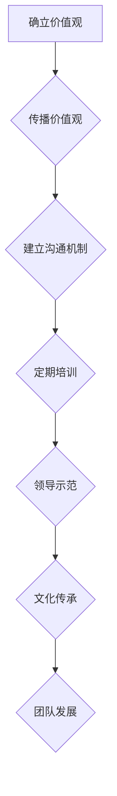
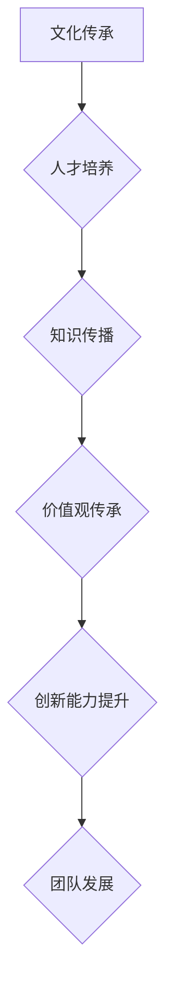

                 

## 打造生生不息的技术团队：文化传承与人才培养

### 关键词：
技术团队文化、人才培养、文化传承、团队协作、激励机制

### 摘要：
本文将深入探讨如何打造一个生生不息的技术团队，通过文化传承与人才培养两大关键策略，实现团队的长远发展。文章首先介绍技术团队文化的核心价值和构建方法，随后详细解析人才培养的策略与实践，并结合实际项目案例，展示文化传承与人才培养的有效结合。通过本文的论述，希望能为技术团队的领导者和成员提供有价值的思考和指导。

## 第一部分：技术团队文化传承

### 第1章：团队文化的核心价值

#### 1.1 文化传承的概念与重要性

文化传承是团队发展的基石，它不仅包含团队的历史积淀，更涵盖了团队的价值观、行为准则和共同愿景。文化传承的重要性在于，它能够为团队成员提供共同的目标和行动指南，增强团队的凝聚力和战斗力。

在技术团队中，文化传承的作用尤为突出。首先，它能够为团队成员提供一个共同的价值观和行为准则，使得团队在面临挑战时能够保持一致的方向和行动。其次，文化传承有助于提升团队成员的归属感和忠诚度，从而减少人才流失。最后，良好的文化传承能够激发团队成员的创新潜力，促进团队的整体进步。

#### 1.2 团队文化传承的实践策略

为了实现文化传承，技术团队需要采取一系列实践策略。首先，团队需要明确自身的核心价值观，并确保这些价值观在团队内部得到广泛传播和认同。其次，团队需要建立有效的沟通和协作机制，确保团队成员能够充分交流思想和经验，从而加深对文化传承的理解和认同。

此外，技术团队还应该通过定期的培训和学习活动，不断强化文化传承。例如，可以通过团队内部分享会、外部专家讲座、团队建设活动等方式，提高团队成员对文化传承的认知和理解。同时，团队领导也需要发挥表率作用，通过自身的言行来传承和弘扬团队文化。

#### 1.3 Mermaid 流程图：团队文化传承路径

为了更好地展示团队文化传承的路径，我们可以使用 Mermaid 流程图来描述。以下是团队文化传承的简化流程图：



在这个流程图中，确立价值观是文化传承的第一步，接着是传播价值观、建立沟通机制、定期培训、领导示范，最终实现文化传承和团队发展。这一过程是一个循环的过程，需要不断地进行和优化，以适应团队的发展和变化。

## 第二部分：人才培养

### 第2章：核心价值观念的构建

#### 2.1 价值观的提炼与传播

在技术团队中，价值观的提炼和传播是文化传承的重要组成部分。首先，团队需要通过深入讨论和广泛调研，提炼出符合团队特点和愿景的核心价值观。这些价值观应该具有明确的指导意义，能够引导团队成员的行为和决策。

在提炼价值观之后，团队需要通过多种途径进行传播。例如，可以通过内部会议、邮件、企业微信等渠道，向所有团队成员传达核心价值观。同时，还可以通过团队文化墙、内部刊物等形式，将核心价值观进行长期展示，以加深团队成员的认同和记忆。

#### 2.2 内部沟通与协作机制

内部沟通与协作机制是价值观传承的重要保障。一个良好的内部沟通机制能够确保团队成员之间能够充分交流思想和经验，从而加深对价值观的理解和认同。为此，团队可以采取以下措施：

- **建立定期会议制度**：通过定期召开团队会议，团队成员可以分享各自的见解和经验，促进价值观的交流和传承。
- **搭建内部沟通平台**：利用企业微信、钉钉等工具，建立内部沟通平台，确保团队成员能够及时获取信息和反馈。
- **设立建议箱**：鼓励团队成员提出建设性意见和建议，通过这种方式，团队成员能够更加深入地参与到团队文化传承的过程中。

#### 2.3 伪代码：价值观驱动的决策模型

为了确保团队成员在决策过程中能够始终遵循核心价值观，团队可以设计一个价值观驱动的决策模型。以下是这个模型的伪代码实现：

```python
function valueDrivenDecision(values, options):
    # 计算每个选项的价值观得分
    score = []
    for option in options:
        score.append(calculateScore(option, values))
    
    # 选择得分最高的选项
    bestOption = options[score.index(max(score))]
    
    return bestOption
```

在这个决策模型中，`values` 表示团队的核心价值观，`options` 表示可供选择的方案。模型通过计算每个选项的价值观得分，选择得分最高的选项作为最佳决策。这样，团队在决策过程中就能够始终遵循核心价值观，确保团队行动的一致性和方向性。

### 第3章：文化传承与人才培养的结合

#### 3.1 文化传承在人才培养中的应用

文化传承在人才培养中扮演着至关重要的角色。通过文化传承，团队成员不仅能够更好地理解团队的目标和愿景，还能够获得宝贵的经验和知识。以下是一些具体的应用方法：

- **导师制度**：通过导师制度，新员工可以快速融入团队，从导师那里获得宝贵的经验和指导。导师可以分享自己的工作经验和教训，帮助新员工更快地成长。
- **项目合作**：通过项目合作，团队成员可以相互学习和交流，共同面对挑战。这种合作不仅有助于提高团队的整体实力，还能够加深团队成员之间的理解和信任。
- **内部培训**：定期开展内部培训，可以帮助团队成员不断提升自己的技能和知识。通过培训，团队成员可以学习到最新的技术和方法，更好地应对工作中的挑战。

#### 3.2 人才培养对文化传承的反作用

人才培养不仅能够促进团队成员的个人成长，还能够对文化传承产生积极的影响。以下是人才培养对文化传承的几种反作用：

- **知识传播**：通过人才培养，团队成员可以将自己的经验和知识传授给新员工，从而扩大文化传承的范围。
- **价值观传承**：通过人才培养，团队成员可以更好地理解和认同团队的核心价值观，从而更加积极地参与到文化传承的过程中。
- **创新能力提升**：通过人才培养，团队成员可以不断学习和掌握新的知识和技能，从而提高团队的创新能力，推动团队文化的发展和变革。

#### 3.3 Mermaid 流程图：文化传承与人才培养的整合

为了更好地展示文化传承与人才培养的整合过程，我们可以使用 Mermaid 流程图来描述。以下是文化传承与人才培养的整合流程图：



在这个流程图中，文化传承是人才培养的基础，人才培养则是文化传承的延续。通过知识传播、价值观传承和创新能力提升，文化传承与人才培养相互促进，共同推动团队的发展。

## 附录

### 附录A：文化传承与人才培养工具与方法

为了更好地实现文化传承与人才培养，团队可以采用一系列工具和方法。以下是几个常用的工具和方法：

- **企业微信**：企业微信是一款集即时通讯、音视频会议、办公自动化等功能于一体的工具，可以用于团队内部沟通和协作。
- **钉钉**：钉钉是一款面向企业级市场的办公平台，提供考勤、审批、日志、培训等功能，可以帮助团队实现高效管理。
- **在线学习平台**：例如 Coursera、edX 等，可以用于团队成员的在线学习和培训。
- **团队建设活动**：通过团队建设活动，例如拓展训练、团建游戏等，可以增强团队成员之间的凝聚力和团队合作精神。

### 附录B：最佳实践、小结、注意事项、拓展阅读

#### 最佳实践

1. **建立明确的价值观**：确保团队成员对核心价值观有清晰的理解和认同。
2. **定期进行内部培训**：通过培训提升团队成员的技能和知识水平。
3. **鼓励知识分享**：建立知识分享机制，鼓励团队成员分享经验和教训。
4. **关注团队成员的职业发展**：为团队成员提供职业发展规划和指导。

#### 小结

文化传承与人才培养是技术团队发展的关键。通过文化传承，团队可以建立共同的目标和价值观，增强团队的凝聚力和战斗力。通过人才培养，团队可以不断提升成员的技能和知识，推动团队的创新和发展。两者相互促进，共同推动团队的长远发展。

#### 注意事项

1. **尊重团队成员的个性和差异**：在文化传承和人才培养过程中，要尊重团队成员的个性和差异，避免“一刀切”的管理方式。
2. **持续优化文化传承与人才培养策略**：随着团队的发展和变化，需要不断调整和优化文化传承与人才培养策略，以适应新的需求和挑战。

#### 拓展阅读

1. 《五项管理：打造卓越团队的核心竞争力》
2. 《团队协作力：高效团队建设的实用指南》
3. 《人才战略：企业持续发展的关键》

## 结语

文化传承与人才培养是技术团队发展的核心，通过这两大策略，团队可以建立共同的价值观，提升成员的技能和知识，推动团队的创新和发展。希望本文能为技术团队的领导者和成员提供有价值的思考和指导，帮助团队实现长远发展。作者：AI天才研究院/AI Genius Institute & 禅与计算机程序设计艺术 /Zen And The Art of Computer Programming。

