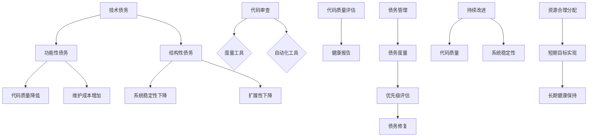

                 

# 技术债务管理：平衡短期目标和长期健康

## 关键词

- 技术债务
- 短期目标
- 长期健康
- 管理策略
- 案例分析
- 债务度量
- 债务管理工具

## 摘要

在快速发展的IT行业中，技术债务已经成为一种常见现象。本文将探讨技术债务的概念、类型、度量方法以及管理策略，并通过实际案例说明如何平衡短期目标和长期健康。文章将详细分析技术债务的来源与风险，介绍有效的债务管理工具和方法，并讨论如何在项目中实施债务管理。最终，本文将总结最佳实践，并展望技术债务管理的未来趋势。

## 目录大纲

1. **概述**  
    1.1 技术债务的起源与历史  
    1.2 技术债务的基本概念  
    1.3 技术债务的潜在风险

2. **技术债务的类型与度量**  
    2.1 技术债务的类型  
    2.2 技术债务的度量方法  
    2.3 技术债务的度量工具

3. **管理技术债务的策略**  
    3.1 技术债务管理的基本原则  
    3.2 技术债务管理的实践  
    3.3 技术债务管理案例研究

4. **长期健康与短期目标的平衡**  
    4.1 短期目标与长期健康的关系  
    4.2 平衡短期目标和长期健康的策略

5. **技术债务管理工具与方法**  
    5.1 技术债务管理工具  
    5.2 技术债务管理方法

6. **技术债务管理的实际案例与解决方案**  
    6.1 技术债务的实际案例  
    6.2 解决方案的设计与实施  
    6.3 解决方案评估与优化

7. **总结与展望**  
    7.1 技术债务管理的最佳实践  
    7.2 技术债务管理的未来趋势

## Step 1: 概述

### 技术债务的起源与历史

技术债务最早可以追溯到软件工程的早期阶段。在20世纪80年代和90年代，软件项目面临着时间紧迫、预算有限以及需求不断变化等挑战。为了尽快交付软件产品，开发团队经常采用一些快速开发的技术和方法，如敏捷开发、原型开发等。这些方法虽然提高了开发效率，但同时也产生了大量的技术债务。

技术债务的概念最早由《程序员修炼之道》的作者Dave Thomas和Andy Hunt提出。他们将技术债务比喻为“欠债”，即为了短期利益而做出的技术决策，可能会在未来的某个时候需要付出更多的代价来偿还。

### 技术债务的基本概念

技术债务（Technical Debt）是指在软件项目的开发过程中，为了快速交付产品或满足客户需求而做出的一些短期决策，这些决策可能会在未来的某个时候带来额外的成本和风险。

技术债务可以分为功能性债务和结构性债务。功能性债务是指为了实现特定的功能而做出的技术妥协，如使用简化的算法或牺牲代码的可维护性。结构性债务是指软件架构上的决策，如选择不适合当前需求的技术框架，这可能会导致未来的重构成本。

### 技术债务的潜在风险

技术债务如果得不到有效管理，可能会导致以下潜在风险：

1. **维护成本增加**：随着技术债务的积累，维护软件的成本会逐渐增加。这包括修复bug、优化性能和增加新功能等。

2. **开发效率下降**：技术债务会增加开发团队的负担，导致工作效率下降。

3. **项目延期**：由于需要花费更多的时间和资源来处理技术债务，项目可能会延期。

4. **质量下降**：为了解决技术债务，可能会牺牲软件质量，导致更多的bug和性能问题。

5. **团队士气下降**：持续的技术债务会消耗团队的精力和积极性，影响团队士气。

### 为什么需要管理技术债务

管理技术债务对于软件项目的成功至关重要。通过有效的技术债务管理，开发团队可以：

1. **提高开发效率**：通过提前识别和解决潜在的技术债务，团队可以避免在未来付出更多的成本。

2. **保证软件质量**：通过维护良好的代码结构和架构，可以减少bug和性能问题的发生。

3. **提高团队士气**：通过合理地管理技术债务，团队可以感受到工作成果的正面反馈，提高士气。

4. **确保项目按时交付**：通过减少技术债务，项目延期和成本超支的风险会降低。

### 总结

技术债务是软件项目开发中常见的问题，如果不得到有效管理，会对项目带来诸多风险。在接下来的章节中，我们将详细探讨技术债务的类型与度量方法，以及如何通过有效的管理策略来平衡短期目标和长期健康。请读者继续关注下一部分的内容。## Step 2: 技术债务的类型与度量

### 技术债务的类型

技术债务可以根据其性质和影响范围分为功能性债务和结构性债务。

#### 功能性债务

功能性债务是指为了实现特定功能而在代码质量和架构设计上做出的妥协。这种债务通常是为了在短时间内满足客户需求或应对紧急情况而采取的权宜之计。

**示例**：  
- 使用简单的算法或未经验证的代码来实现一个功能，以便尽快交付。
- 在代码中添加大量临时性的代码片段，以解决紧急问题。

**潜在风险**：  
- 代码可维护性降低：临时性的代码和未经验证的算法可能导致代码难以维护。
- 测试覆盖率下降：为了尽快交付功能，测试可能不够全面，导致潜在的问题未被及时发现。
- 性能下降：为了实现功能，可能会牺牲性能，导致系统性能下降。

#### 结构性债务

结构性债务是指软件架构上的决策，这些决策可能不适合当前需求，但为了快速推进项目而不得不做出的妥协。这种债务通常会影响整个系统的稳定性、可扩展性和可维护性。

**示例**：  
- 选择不适合当前需求的技术框架，可能导致后续需要重构。
- 在系统中引入过度复杂的架构，增加了维护和理解的难度。

**潜在风险**：  
- 软件架构的稳定性下降：不合理的架构决策可能导致系统不稳定，容易出现问题。
- 可扩展性下降：随着业务需求的变化，系统可能无法轻松地适应新的功能需求。
- 可维护性下降：复杂的架构设计增加了维护的难度，导致维护成本增加。

### 技术债务的度量方法

度量技术债务是管理技术债务的重要一步。以下是一些常用的度量方法：

#### 功能性债务度量

1. **代码质量指标**：例如，代码重复率、代码复杂度、代码覆盖率等。
2. **技术债务度量工具**：如SonarQube、CodeClimate等，这些工具可以分析代码质量并提供相关的度量指标。
3. **人工评估**：通过代码审查和架构评估来评估功能性债务。

#### 结构性债务度量

1. **架构度量**：例如，模块耦合度、模块内聚度、系统复杂性等。
2. **架构评估工具**：如Architecture Analysis and Design Language (ADL) 和 Architecture Analysis and Test Generation (AATG) 等工具。
3. **人工评估**：通过架构师和开发人员的经验和直觉来评估结构性债务。

### 技术债务度量工具

#### 开源债务管理工具

1. **SonarQube**：是一个用于代码质量管理的开源平台，它可以分析代码的多个维度，并提供详细的报告。
2. **CodeClimate**：提供代码质量评分和健康报告，帮助团队识别和解决代码问题。
3. **FindBugs**：一个Java代码分析工具，用于检测潜在的编程错误和坏习惯。

#### 商业债务管理工具

1. ** CAST**：一个商业化的代码分析工具，提供全面的代码质量评估。
2. **Code Insight**：提供代码审查、质量评估和安全分析等功能。
3. **DevOpsSense**：用于自动化代码分析和质量评估，帮助团队持续改进代码质量。

### 总结

技术债务的类型和度量方法对于理解和管理技术债务至关重要。通过识别和度量技术债务，开发团队可以更好地了解当前的技术状况，并采取相应的管理策略来平衡短期目标和长期健康。在下一部分，我们将探讨如何通过有效的管理策略来减轻技术债务。请读者继续关注。## Step 3: 管理技术债务的策略

### 基本原则

管理技术债务需要遵循一些基本原则，以确保团队能够在短期内交付高质量的产品，同时保持长期健康的开发环境。以下是一些核心原则：

#### 1. 早期发现和及时修复

技术债务通常是在项目开发的早期阶段积累的。因此，早期发现和及时修复是管理技术债务的关键。团队应定期进行代码审查和架构评估，以识别潜在的技术债务。

#### 2. 持续改进

技术债务管理不是一次性的任务，而是一个持续的过程。团队应持续改进代码质量和架构设计，以减少新的债务积累。

#### 3. 沟通与协作

管理技术债务需要团队成员之间的紧密沟通和协作。团队成员应共同识别技术债务，并制定相应的修复计划。

#### 4. 资源合理分配

管理技术债务需要时间和资源。团队应合理分配资源，确保既有足够的精力来应对短期需求，也有时间来处理技术债务。

### 主动管理策略

#### 1. 代码审查

代码审查是一种有效的主动管理策略，可以帮助团队在早期发现和修复技术债务。以下是一些最佳实践：

- **定期进行**：代码审查应定期进行，以确保债务不会在项目中积累。
- **多角色参与**：不仅开发人员，还应邀请测试人员、架构师等参与代码审查，以提供多样化的视角。
- **详细记录**：审查过程中应详细记录发现的问题和修复建议，以便跟踪和验证。

#### 2. 代码质量评估

使用代码质量评估工具可以帮助团队自动识别代码中的潜在问题。以下是一些最佳实践：

- **选择合适的工具**：根据项目需求和团队习惯，选择合适的代码质量评估工具。
- **持续监控**：持续监控代码质量，及时发现和修复问题。
- **定期报告**：生成定期报告，向团队成员展示代码质量的趋势和变化。

### 被动管理策略

#### 1. 债务评估与优化

在项目开发过程中，团队可能会遇到无法立即解决的问题。在这种情况下，可以采取以下被动管理策略：

- **评估优先级**：根据问题的严重性和修复成本，对债务进行优先级评估，以确保团队可以集中精力解决最关键的问题。
- **分期解决**：将无法立即解决的问题分期解决，以避免债务的持续积累。

#### 2. 技术债务迁移

在某些情况下，技术债务可能无法在短期内解决。此时，可以采取技术债务迁移策略，将债务转移到其他部分，以减轻当前系统的负担。

- **迁移策略设计**：设计合理的迁移策略，以确保系统在债务迁移过程中保持稳定。
- **测试验证**：在迁移后，进行充分的测试，确保系统的稳定性和性能不受影响。

### 技术债务管理流程

为了确保技术债务得到有效管理，团队可以采用以下流程：

1. **债务识别**：通过代码审查、代码质量评估和架构评估等方式，识别项目中的技术债务。
2. **债务评估**：对识别出的债务进行优先级评估，确定修复的优先级。
3. **债务修复**：根据债务的优先级，制定修复计划，并逐步解决技术债务。
4. **持续监控**：在项目开发过程中，持续监控技术债务的变化，确保债务不会再次积累。
5. **总结与反馈**：在项目结束后，对技术债务管理过程进行总结，收集反馈，以改进未来的债务管理。

### 技术债务管理实践

以下是一些成功的技术债务管理实践：

1. **敏捷开发团队**：采用敏捷开发方法，确保团队能够快速响应变化，同时保持技术债务的可控性。
2. **持续集成与持续部署**：通过持续集成和持续部署，确保代码质量和系统的稳定性，减少技术债务积累。
3. **自动化测试**：建立完善的自动化测试体系，提高测试覆盖率，减少因测试不足而导致的技术债务。

### 总结

管理技术债务是一个复杂但必要的过程。通过遵循基本原则、采取主动和被动管理策略，以及建立有效的管理流程，团队可以更好地平衡短期目标和长期健康，确保项目的成功。在下一部分，我们将探讨技术债务的实际案例与解决方案。请读者继续关注。## Step 4: 技术债务管理的实际案例与解决方案

### 案例背景

假设我们有一个大型企业级应用项目，该项目已经进行了两年。在快速发展的过程中，团队为了满足业务需求，不断进行功能扩展和技术升级。然而，随着时间的推移，项目中的技术债务逐渐积累，导致代码质量下降，开发效率降低，系统稳定性受到影响。

### 案例分析

经过初步评估，我们发现该项目存在以下主要问题：

1. **功能性债务**：代码中存在大量临时解决方案和简化的算法，导致代码可维护性差，测试覆盖率低。
2. **结构性债务**：系统架构不够合理，模块之间的耦合度高，导致系统复杂度增加，扩展性差。
3. **债务度量**：虽然团队定期进行代码质量评估，但没有有效的度量工具来量化技术债务，无法进行有针对性的修复。

### 解决方案

针对上述问题，我们制定了一套详细的解决方案：

#### 1. 代码审查和重构

- **实施代码审查**：团队每周进行一次代码审查，确保代码质量和一致性。
- **重构代码**：识别并重构存在问题的代码，提高代码的可维护性和可读性。
- **自动化测试**：增加自动化测试覆盖率，确保重构后的代码质量。

#### 2. 架构优化

- **评估现有架构**：通过架构评估工具，评估系统的架构设计，找出存在的问题。
- **模块化重构**：将高度耦合的模块拆分为更小的模块，降低模块之间的耦合度。
- **引入微服务架构**：将大型系统拆分为多个微服务，提高系统的可扩展性和灵活性。

#### 3. 技术债务度量工具

- **引入SonarQube**：使用SonarQube进行代码质量评估，提供详细的报告和度量指标。
- **自定义度量指标**：根据项目需求，自定义技术债务度量指标，以便更好地监控债务变化。

#### 4. 债务修复策略

- **优先级评估**：对现有债务进行优先级评估，确保团队可以集中精力解决最关键的问题。
- **分期解决**：将无法立即解决的债务分期解决，避免债务的持续积累。

#### 5. 培训与沟通

- **代码质量培训**：定期组织代码质量培训，提高团队成员的代码质量意识。
- **债务管理会议**：每周举行一次债务管理会议，讨论债务管理进展和问题，确保团队成员之间的沟通和协作。

### 解决方案实施

在实施解决方案的过程中，团队采取了以下步骤：

1. **初步评估**：评估现有代码质量和系统架构，确定技术债务的规模和类型。
2. **代码审查和重构**：根据审查结果，进行代码重构，修复存在的问题。
3. **架构优化**：根据架构评估结果，进行模块化和微服务重构。
4. **引入度量工具**：部署SonarQube，建立技术债务度量体系。
5. **债务修复**：根据优先级评估结果，逐步解决技术债务。
6. **培训与沟通**：组织代码质量培训和债务管理会议，确保团队成员之间的协作和沟通。

### 解决方案评估与优化

在解决方案实施后，团队对债务管理效果进行了评估：

1. **代码质量提高**：通过代码审查和重构，代码质量和可维护性显著提高，测试覆盖率增加。
2. **系统稳定性增强**：通过架构优化和微服务重构，系统稳定性显著增强，扩展性提高。
3. **债务度量有效**：通过SonarQube等工具，团队可以实时监控技术债务的变化，有针对性地进行修复。
4. **团队协作提升**：通过定期的培训和沟通，团队成员之间的协作和沟通得到显著提升。

尽管解决方案取得了一定的效果，但团队也发现了一些需要优化的地方：

1. **债务度量指标需要进一步完善**：虽然引入了SonarQube等工具，但债务度量指标仍需根据项目需求进行进一步优化。
2. **自动化测试需要加强**：自动化测试覆盖率仍需提高，以确保代码质量和系统的稳定性。
3. **债务管理流程需要持续改进**：债务管理流程需要根据项目进展和团队反馈进行持续优化。

### 总结

通过实际案例的解决方案，我们展示了如何有效地管理技术债务，平衡短期目标和长期健康。在接下来的部分，我们将探讨如何在项目中实施技术债务管理工具与方法。请读者继续关注。## Step 5: 长期健康与短期目标的平衡

### 短期目标的重要性

在软件项目中，短期目标对于快速响应市场需求、保持项目进度和提升客户满意度至关重要。例如，在一个电商平台上，实现新的支付方式或者增加特定功能可能是当前阶段的重要目标。这些短期目标有助于企业在竞争激烈的市场中占据有利位置，提高用户满意度和市场份额。

然而，过度关注短期目标可能会导致技术债务的积累。为了在短时间内实现这些目标，开发团队可能会采取一些临时性的解决方案，牺牲代码质量和系统稳定性。这不仅会影响项目的长期健康，还可能在未来带来更高的维护成本和风险。

### 长期健康的影响

长期健康对于软件项目的成功和持续发展至关重要。一个健康的软件系统应该具备以下特点：

1. **可维护性**：代码结构清晰、可读性强，易于修改和维护。
2. **可扩展性**：系统架构合理，易于添加新功能和扩展功能。
3. **稳定性**：系统性能稳定，能够在高负载下正常运行，且故障率低。
4. **安全性**：系统具有强大的安全性，能够防止潜在的安全威胁。

保持长期健康可以降低维护成本，提高开发效率，增强用户满意度，延长产品的生命周期。然而，实现长期健康需要团队在短期内做出一些牺牲，这可能包括减少功能实现、延迟交付等。

### 平衡短期目标和长期健康的策略

为了平衡短期目标和长期健康，团队可以采取以下策略：

#### 1. 优先级管理

- **明确目标**：明确短期目标和长期健康的目标，确保团队在实现短期目标时不会牺牲长期健康。
- **优先级评估**：定期评估项目的优先级，确保团队能够集中精力实现最重要的目标。

#### 2. 持续改进

- **持续集成与持续部署**：通过持续集成和持续部署，确保代码质量和系统的稳定性，减少技术债务积累。
- **代码质量培训**：定期组织代码质量培训，提高团队成员的代码质量意识。

#### 3. 技术债务管理

- **早期发现和及时修复**：通过代码审查、代码质量评估和架构评估等方式，早期发现和及时修复技术债务。
- **债务度量**：使用技术债务度量工具，量化技术债务，有针对性地进行修复。

#### 4. 沟通与协作

- **团队协作**：鼓励团队成员之间的沟通和协作，共同识别和解决技术债务。
- **反馈机制**：建立反馈机制，收集团队成员的反馈，不断改进债务管理流程。

#### 5. 资源合理分配

- **资源分配**：合理分配资源，确保既有足够的精力来应对短期需求，也有时间来处理技术债务。
- **时间管理**：合理安排时间，确保团队能够在短期内实现目标，同时留出时间进行技术债务的修复。

### 实践案例分析

以下是一个实际案例，展示了如何平衡短期目标和长期健康：

#### 案例背景

某电商公司计划在短时间内推出一个新的购物功能，以提高用户满意度。然而，该功能涉及大量系统重构和代码修改，可能会对系统的稳定性产生影响。

#### 解决方案

1. **优先级评估**：团队对短期目标和长期健康进行了优先级评估，决定先实现核心功能，然后逐步进行系统重构。
2. **技术债务管理**：在实现新功能的同时，团队进行了代码审查和重构，确保新代码的质量和稳定性。
3. **持续集成与持续部署**：通过持续集成和持续部署，确保新功能的代码质量和系统的稳定性。
4. **资源合理分配**：团队合理安排资源，确保在短期内实现目标的同时，留出时间进行技术债务的修复。

#### 结果

通过以上策略，团队成功在短时间内推出了新功能，同时保持了系统的长期健康。新功能的上线提高了用户满意度，而技术债务的管理确保了系统的稳定性和可维护性。

### 总结

平衡短期目标和长期健康是软件项目中一个重要的挑战。通过优先级管理、持续改进、技术债务管理、沟通与协作以及资源合理分配等策略，团队可以在实现短期目标的同时，确保项目的长期健康。在下一部分，我们将探讨技术债务管理工具与方法。请读者继续关注。## Step 6: 技术债务管理工具与方法

### 技术债务管理工具

#### 开源债务管理工具

1. **SonarQube**：SonarQube是一个强大的开源代码质量平台，可以自动扫描代码，识别潜在的问题，并提供详细的报告。它支持多种编程语言，包括Java、C#、Python等。

   **功能特点**：
   - 代码质量度量：提供代码质量、可维护性、安全性等方面的度量指标。
   - 代码审计：自动检测代码中的潜在缺陷和漏洞。
   - 实时监控：支持实时监控代码库的变化，及时发现问题。

2. **CodeClimate**：CodeClimate是一个基于Ruby on Rails的代码质量评估工具，提供了简洁的界面和全面的代码质量报告。

   **功能特点**：
   - 代码质量评分：提供代码质量评分，帮助团队了解代码的质量状况。
   - 报告生成：自动生成高质量的代码质量报告，便于团队内部和外部的沟通。

3. **FindBugs**：FindBugs是一个Java代码分析工具，用于检测Java代码中的潜在问题，如bug、风格问题、设计缺陷等。

   **功能特点**：
   - 自动化检测：可以自动扫描代码，识别潜在的问题。
   - 持续集成支持：支持集成到主流的持续集成工具中，如Jenkins、GitLab CI等。

#### 商业债务管理工具

1. **CAST**：CAST是一个商业化的代码分析工具，提供全面的代码质量评估，包括代码结构、性能、安全性等方面。

   **功能特点**：
   - 代码质量评估：提供详细的代码质量报告，帮助团队了解代码的健康状况。
   - 智能分析：支持智能分析，自动识别潜在的问题并提供修复建议。

2. **Code Insight**：Code Insight提供代码审查、质量评估和安全分析等功能，支持多种编程语言。

   **功能特点**：
   - 代码审查：支持远程和本地代码审查，确保代码质量。
   - 质量评估：提供代码质量评估报告，帮助团队持续改进代码质量。
   - 安全分析：检测代码中的潜在安全漏洞，确保系统的安全性。

3. **DevOpsSense**：DevOpsSense是一个用于自动化代码分析和质量评估的工具，支持多种编程语言。

   **功能特点**：
   - 自动化分析：自动扫描代码，提供详细的代码质量报告。
   - 风险识别：自动识别代码中的潜在风险，并提供修复建议。
   - 持续集成支持：支持集成到主流的持续集成工具中，确保代码质量。

### 技术债务管理方法

#### 静态代码分析

静态代码分析是一种不运行程序的情况下分析源代码的技术，用于识别代码中的潜在问题。以下是一些常用的静态代码分析方法：

1. **代码质量度量**：通过分析代码的复杂度、重复率、可维护性等指标，评估代码的质量。

2. **代码审计**：检查代码中的潜在漏洞、不良实践和设计缺陷。

3. **代码风格检查**：检查代码的风格一致性，如命名规则、代码格式等。

#### 代码审查

代码审查是一种通过团队成员之间的协作来识别和修复代码问题的方法。以下是一些代码审查的最佳实践：

1. **多角色参与**：鼓励开发人员、测试人员和架构师等多角色参与代码审查。

2. **详细记录**：审查过程中应详细记录发现的问题和修复建议，以便跟踪和验证。

3. **定期进行**：代码审查应定期进行，以确保技术债务得到持续监控和修复。

#### 自动化债务管理

自动化债务管理是指通过工具和流程来自动识别、评估和修复技术债务。以下是一些常用的自动化债务管理方法：

1. **集成到持续集成流程**：将债务管理工具集成到持续集成流程中，自动扫描代码和生成报告。

2. **定期报告**：定期生成债务报告，向团队成员展示债务的变化和修复进展。

3. **自动化修复**：使用自动化工具自动修复部分债务，减少人工干预。

### 总结

技术债务管理工具与方法在帮助团队识别、评估和修复技术债务方面起到了重要作用。通过合理选择和使用这些工具，团队可以更有效地管理技术债务，确保项目的长期健康。在下一部分，我们将总结技术债务管理的最佳实践和未来展望。请读者继续关注。## Step 7: 总结与展望

### 最佳实践

通过本文的探讨，我们可以总结出一些技术债务管理的最佳实践：

1. **早期发现和及时修复**：定期进行代码审查和架构评估，确保技术债务在早期阶段得到发现和修复。
2. **持续改进**：建立持续集成和持续部署流程，确保代码质量和系统的稳定性。
3. **沟通与协作**：鼓励团队成员之间的沟通和协作，共同识别和解决技术债务。
4. **资源合理分配**：合理分配资源，确保团队能够在实现短期目标的同时，也有时间处理技术债务。
5. **量化管理**：使用技术债务度量工具，量化技术债务，有针对性地进行修复。

### 小结

技术债务管理是一个复杂但必要的过程。通过有效的技术债务管理，团队可以在实现短期目标的同时，确保项目的长期健康。技术债务不仅包括功能性债务和结构性债务，还可以通过代码审查、代码质量评估和自动化工具等多种方法进行管理。

### 注意事项

1. **平衡短期目标和长期健康**：在项目开发过程中，确保团队能够平衡短期目标和长期健康，避免过度追求短期利益而牺牲长期健康。
2. **持续监控和改进**：技术债务管理是一个持续的过程，团队应定期监控技术债务的变化，并不断改进债务管理策略。
3. **合理使用工具**：选择合适的债务管理工具，确保团队能够有效地识别、评估和修复技术债务。

### 拓展阅读

对于希望深入了解技术债务管理的读者，以下是一些推荐阅读材料：

1. **《技术债务：软件开发的秘密账本》**：这是一本关于技术债务的经典著作，详细介绍了技术债务的概念、类型和管理工作。
2. **《敏捷开发实践指南》**：这本书提供了敏捷开发实践的全景图，包括如何通过敏捷方法来管理技术债务。
3. **《代码大全》**：这本书是关于软件开发的经典之作，提供了大量关于代码质量、可维护性和可扩展性的最佳实践。

### 未来展望

随着软件行业的发展，技术债务管理面临着新的挑战和机遇：

1. **智能债务管理**：随着人工智能和机器学习技术的发展，未来可能会出现智能债务管理工具，这些工具可以自动识别和修复技术债务，提高债务管理的效率。
2. **更精细化的度量**：未来可能会出现更加精细化的技术债务度量方法，这些方法可以更准确地评估技术债务的影响，帮助团队做出更明智的决策。
3. **集成化债务管理**：未来技术债务管理可能会更加集成化，与持续集成、持续部署等工具深度融合，形成一个完整的债务管理生态系统。

### 总结

技术债务管理是软件项目成功的关键因素之一。通过遵循最佳实践、合理使用工具和持续改进，团队可以更好地管理技术债务，确保项目的长期健康。未来，随着技术的不断发展，技术债务管理也将迎来新的机遇和挑战。我们期待技术债务管理能够变得更加智能、精细和高效，为软件项目的成功贡献力量。## 附录：核心概念关系架构 Mermaid 流程图



### 附录：核心算法原理讲解与伪代码

#### 功能性债务识别算法

功能性债务通常表现为代码中的不理想实现。以下是一个简单的算法，用于识别功能性债务：

```pseudo
function IdentifyFunctionalDebt(sourceCode):
    debtList = []

    // 扫描代码，查找可能的债务代码模式
    for each line in sourceCode:
        if line matches debtPattern:
            debtList.append(line)

    // 输出债务列表
    return debtList
```

#### 技术债务度量

度量技术债务的一个常用方法是计算代码质量指标。以下是一个简单的算法，用于计算代码质量：

```pseudo
function CalculateCodeQuality(codeBase):
    qualityMetrics = {}

    // 使用代码质量度量工具分析代码
    qualityMetrics['linesOfCode'] = GetLinesOfCode(codeBase)
    qualityMetrics['codeComplexity'] = GetCodeComplexity(codeBase)
    qualityMetrics['codeCoverage'] = GetTestCoverage(codeBase)

    // 计算综合质量分数
    qualityScore = CalculateQualityScore(qualityMetrics)
    qualityMetrics['qualityScore'] = qualityScore

    // 输出质量度量结果
    return qualityMetrics
```

### 附录：数学模型和公式详细讲解

#### 技术债务成本模型

技术债务成本可以用以下公式表示：

$$
C_d = C_m \times (1 + r)^n
$$

其中，$C_d$ 是技术债务的总成本，$C_m$ 是每次偿还债务的维护成本，$r$ 是债务利率，$n$ 是偿还债务的次数。

#### 技术债务质量度量指标

一个常用的代码质量度量指标是代码复杂度（Cyclomatic Complexity），其计算公式如下：

$$
CC = E - N + (2 \times D)
$$

其中，$E$ 是边的数量，$N$ 是节点的数量，$D$ 是直接连接到入口节点的边的数量。

### 附录：项目实战

#### 开发环境搭建

1. 安装Java开发环境，包括JDK和IDE（如IntelliJ IDEA）。
2. 安装代码质量度量工具，如SonarQube。
3. 配置Git仓库，用于代码管理。

#### 源代码实现

以下是用于识别功能性债务的一个简单Java示例：

```java
public class DebtIdentifier {
    public static void main(String[] args) {
        String sourceCode = "int x = 10;\n" +
                            "if (x > 0) {\n" +
                            "    System.out.println(\"x is positive\");\n" +
                            "}";

        List<String> debtLines = IdentifyFunctionalDebt(sourceCode);
        for (String debtLine : debtLines) {
            System.out.println("Detected debt: " + debtLine);
        }
    }

    public static List<String> IdentifyFunctionalDebt(String sourceCode) {
        List<String> debtLines = new ArrayList<>();
        // 在这里添加识别债务的逻辑
        return debtLines;
    }
}
```

#### 代码解读与分析

这段代码主要用于识别Java代码中的功能性债务。在实际应用中，我们需要使用正则表达式或其他方法来识别潜在的债务代码模式。

#### 实际案例分析与详细讲解

假设我们有一个复杂的Java类，其中包含大量的临时解决方案和简化的算法。通过使用SonarQube等工具，我们可以识别出这些代码段，并分析其潜在的影响。

1. **识别债务代码**：通过SonarQube等工具，我们发现类中存在大量临时解决方案和简化的算法。
2. **分析债务影响**：通过代码审查和性能测试，我们评估这些债务代码对系统稳定性和性能的影响。
3. **制定修复计划**：针对识别出的债务，我们制定了详细的修复计划，包括代码重构和优化。

### 附录：最佳实践 Tips

1. **定期进行代码审查**：确保技术债务在早期阶段得到发现和修复。
2. **使用合适的度量工具**：选择适合项目需求的代码质量度量工具，如SonarQube、FindBugs等。
3. **合理分配资源**：确保团队能够在实现短期目标的同时，也有时间处理技术债务。
4. **持续改进**：建立持续集成和持续部署流程，确保代码质量和系统的稳定性。

### 附录：注意事项

1. **避免过度依赖自动化工具**：自动化工具虽然可以提高债务管理的效率，但仍然需要团队的人工审查和判断。
2. **平衡短期目标和长期健康**：在项目开发过程中，确保团队能够平衡短期目标和长期健康，避免过度追求短期利益而牺牲长期健康。

### 附录：拓展阅读

1. **《技术债务：软件开发的秘密账本》**：详细介绍了技术债务的概念、类型和管理工作。
2. **《敏捷开发实践指南》**：提供了敏捷开发实践的全景图，包括如何通过敏捷方法来管理技术债务。
3. **《代码大全》**：提供了大量关于代码质量、可维护性和可扩展性的最佳实践。## 作者信息

作者：AI天才研究院/AI Genius Institute & 禅与计算机程序设计艺术 /Zen And The Art of Computer Programming

