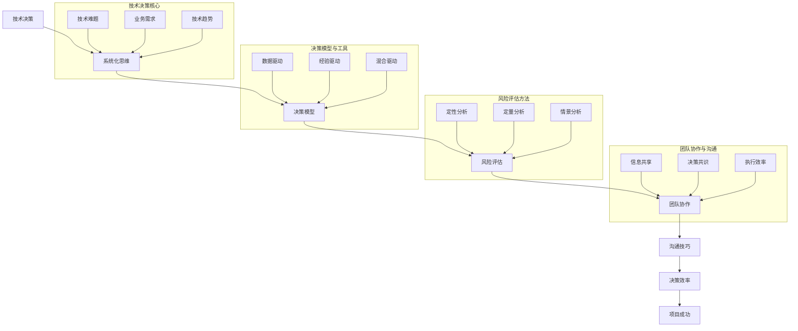

                 

### 文章标题

# 技术决策框架：P9工程师的系统化思维

> 关键词：技术决策，P9工程师，系统化思维，决策模型，风险评估，团队协作

> 摘要：本文将深入探讨技术决策框架，特别是针对P9级别工程师的系统化思维。文章从背景出发，介绍技术决策的挑战，详细讲解一个系统化的技术决策框架的组成部分、应用场景和优势。随后，文章将逐步剖析决策模型与工具、技术风险评估方法、团队协作与沟通技巧，并通过实战案例和策略分析，展示如何在实际项目中应用这些框架和工具，以帮助P9工程师做出更高效、更可靠的技术决策。

### 引言与背景

在当今快速发展的技术领域，工程师面临着日益复杂的技术决策。从选择合适的编程语言和框架，到设计系统架构、优化性能，每一个决策都可能对项目的成功与否产生重大影响。尤其是在高层级的技术决策中，工程师需要具备系统化的思维，以全面考虑各种因素，确保决策的科学性和可持续性。

然而，当前的技术决策往往依赖于经验和个人偏好，缺乏系统化的方法和框架。这不仅增加了决策的难度，也容易导致项目失败或资源浪费。对于P9级别的工程师，他们承担着更高的责任和更大的挑战，需要能够从全局出发，做出符合战略目标和长远利益的技术决策。

因此，本文旨在探讨一个系统化的技术决策框架，帮助P9级别的工程师在面对复杂的技术决策时，能够有条不紊地进行思考和分析，提高决策的效率和质量。通过本文的介绍，读者将了解框架的组成部分、应用场景、优势和局限性，并学会如何在实际项目中应用这些知识和技巧。

### 核心概念与联系

在深入探讨技术决策框架之前，有必要先明确一些核心概念，并展示它们之间的关系。以下是几个关键概念及其相互联系的Mermaid流程图：

**核心概念解释：**

- **技术决策**：指在技术领域做出的选择，包括编程语言、框架、架构设计等。
- **系统化思维**：指从整体和长远的角度出发，综合分析各种因素，以科学的方法进行决策。
- **决策模型**：指用于指导决策的工具和方法，包括数据驱动、经验驱动和混合驱动模型。
- **风险评估**：指在决策过程中对潜在风险的识别、评估和应对。
- **团队协作**：指团队成员之间有效的沟通与协作，以共同完成决策过程。
- **沟通技巧**：指在团队协作中使用的有效沟通方法，确保信息准确、及时地传递。
- **决策效率**：指在决策过程中使用的策略和方法，以提高决策的速度和质量。
- **项目成功**：指通过科学决策和高效执行，最终实现项目目标。

**概念之间的关系：**

- 技术决策需要系统化思维，以确保决策的科学性和全面性。
- 决策模型是系统化思维的核心工具，通过数据驱动、经验驱动和混合驱动模型，可以帮助工程师做出更准确的决策。
- 风险评估是决策模型的重要组成部分，通过对风险的识别、评估和应对，可以降低决策过程中的不确定性。
- 团队协作和沟通技巧是决策过程中不可或缺的要素，通过有效的团队协作和沟通，可以确保决策的共识和执行效率。
- 决策效率和项目成功是系统化技术决策的最终目标，通过科学决策和高效执行，可以确保项目目标的实现。

### 技术决策框架概述

系统化的技术决策框架是一个多层次、多维度的决策体系，旨在帮助工程师在面对复杂的技术决策时，能够系统地分析问题、评估风险、制定策略和执行决策。下面将详细介绍该框架的组成部分、应用场景和优势。

#### 组成部分

系统化的技术决策框架主要由以下几个核心组成部分构成：

1. **决策模型**：决策模型是框架的基础，包括数据驱动模型、经验驱动模型和混合驱动模型。每种模型都有其特定的应用场景和优势。

2. **风险评估**：风险评估是对决策过程中潜在风险的识别、评估和应对。通过定性和定量分析方法，工程师可以全面了解风险，并制定相应的应对策略。

3. **团队协作**：团队协作是决策过程中不可或缺的一环，通过有效沟通和协作，团队成员可以共同解决问题，确保决策的共识和执行效率。

4. **沟通技巧**：沟通技巧是团队协作的基础，通过准确的沟通和反馈，团队成员可以及时了解项目进展和决策意图，减少误解和冲突。

5. **决策效率**：决策效率是指在决策过程中，通过科学的方法和工具，提高决策的速度和质量。高效的决策可以减少项目延误和资源浪费。

#### 应用场景

系统化的技术决策框架适用于各种技术场景，尤其是以下几种：

1. **日常技术决策**：在日常工作中的技术选择，如编程语言、框架、工具等。

2. **项目决策**：在项目启动、设计和实施过程中，对关键技术问题的决策，如系统架构设计、性能优化等。

3. **长期战略决策**：在企业战略规划中，对长期技术方向和投资决策的制定，如技术研发方向、技术创新等。

#### 优势

系统化的技术决策框架具有以下几大优势：

1. **全面性**：框架涵盖了决策的各个环节，从模型选择、风险评估到团队协作和沟通技巧，确保决策的全面性和科学性。

2. **效率提升**：通过系统化的方法和工具，可以显著提高决策效率，减少不必要的讨论和延误。

3. **风险控制**：通过风险评估，可以提前识别和应对潜在风险，降低项目失败的风险。

4. **团队协作**：框架强调团队协作和沟通，有助于建立高效的团队文化和工作模式。

5. **可扩展性**：框架具有高度的可扩展性，可以根据不同场景和需求进行调整和优化。

#### 局限性

尽管系统化的技术决策框架具有诸多优势，但也存在一些局限性：

1. **时间成本**：系统化的决策过程需要投入较多时间和精力，对于时间紧迫的决策，可能不太适用。

2. **依赖数据**：框架中的数据驱动模型依赖高质量的数据，如果数据不足或质量不高，决策的准确性可能会受到影响。

3. **经验依赖**：经验驱动的模型需要工程师具备丰富的经验和专业知识，对于新手工程师，可能存在一定的挑战。

4. **动态变化**：技术环境和业务需求不断变化，框架可能需要定期更新和调整，以确保其适用性和有效性。

### 决策模型与工具

在技术决策过程中，决策模型和工具的选择至关重要。这些模型和工具可以帮助工程师更科学、更系统地做出决策。本文将详细介绍常用的决策模型和工具，并讨论它们在实际应用中的选择原则。

#### 决策模型

决策模型可以分为以下几种类型：

1. **数据驱动模型**：基于数据分析，通过量化的方式评估不同选项的优劣。常见的算法包括线性回归、决策树、支持向量机等。

2. **经验驱动模型**：基于工程师的经验和专业知识，通过主观判断评估不同选项的优劣。这种方法适用于某些定性分析，如系统架构设计、新技术评估等。

3. **混合驱动模型**：结合数据驱动和经验驱动，通过综合分析得到最优决策。这种方法既考虑了数据支持的客观性，也兼顾了专家经验的丰富性。

#### 常用工具

除了决策模型，以下是一些常用的决策工具：

1. **SWOT分析**：分析项目的优势、劣势、机会和威胁，帮助工程师全面了解项目情况。

2. **PEST分析**：分析项目的外部环境，包括政治、经济、社会和技术因素，为决策提供外部视角。

3. **决策树**：通过树状结构展示不同决策路径和结果，帮助工程师可视化分析各种情况。

4. **风险矩阵**：用于评估和分类不同风险，帮助工程师制定应对策略。

#### 选择原则

在实际应用中，选择合适的决策模型和工具需要遵循以下原则：

1. **问题类型**：根据决策问题的类型，选择最合适的模型和工具。对于量化问题，优先选择数据驱动模型；对于定性问题，优先选择经验驱动模型。

2. **数据质量**：对于数据驱动模型，数据的质量至关重要。如果数据不足或质量不高，应考虑使用经验驱动模型。

3. **资源限制**：考虑资源的限制，包括时间、人力和预算等。对于时间紧迫的决策，可能需要简化决策过程。

4. **团队共识**：在团队中达成共识，确保所有成员对决策模型和工具的使用有共同的理解和认同。

#### 实际应用案例分析

以下是一个实际应用案例，展示如何在不同场景下选择和应用决策模型和工具：

1. **项目需求评估**：在评估新项目的需求时，工程师使用SWOT分析和PEST分析，全面了解项目的优势和劣势，以及外部环境的影响。通过这些工具，工程师能够更科学地评估项目的可行性。

2. **技术选型决策**：在选择新的技术栈时，工程师使用决策树，列出不同技术的优缺点，并评估它们在性能、成本、兼容性等方面的表现。通过数据驱动的分析，工程师能够选择最适合项目需求的技术。

3. **风险管理**：在项目实施过程中，工程师使用风险矩阵，识别和评估潜在风险，并制定相应的应对策略。通过这种方法，工程师能够提前识别并解决潜在问题，降低项目失败的风险。

通过这些案例，可以看出决策模型和工具在技术决策中的重要性。工程师需要根据实际情况，灵活选择和应用这些工具，以提高决策的科学性和可靠性。

### 技术风险评估

在技术决策过程中，风险评估是一个至关重要的环节。通过系统化的风险评估，工程师可以提前识别、评估和应对潜在风险，从而降低项目失败的概率，确保项目的顺利推进。本文将详细介绍技术风险评估的方法、过程和策略。

#### 风险识别

风险识别是风险评估的第一步，目的是发现项目或决策过程中可能面临的风险。以下是一些常用的风险识别方法：

1. **专家访谈**：通过与项目相关领域的专家进行访谈，获取他们对潜在风险的看法和建议。这种方法适用于高风险领域，如新技术应用、大规模系统改造等。

2. **历史数据分析**：通过分析过去类似项目的数据，识别出常见的风险类型。这种方法依赖于历史数据的质量和完整性，适用于项目周期较长且具有相似性的项目。

3. **问卷调查**：设计问卷调查，收集项目团队成员和利益相关者的意见。这种方法适用于项目涉及多个部门和利益相关者的场景。

#### 风险评估方法

在识别出潜在风险后，需要对这些风险进行评估，以确定其严重程度和可能性。以下是一些常用的风险评估方法：

1. **定性分析**：通过专家判断和经验，对风险的严重程度和可能性进行评估。定性分析方法适用于风险类型较多且不易量化的场景。

2. **定量分析**：通过数学模型和统计方法，对风险的严重程度和可能性进行量化评估。定量分析方法适用于数据充足且具有明确指标的领域。

3. **情景分析**：构建不同情景下的风险模型，分析各种情景下的风险表现。情景分析方法适用于复杂系统和高风险项目的评估。

#### 风险应对策略

在评估出风险的严重程度和可能性后，需要制定相应的应对策略，以降低风险的影响。以下是一些常见的风险应对策略：

1. **风险规避**：通过调整项目计划或决策，避免风险的发生。例如，在技术选型时，选择已被验证的技术，避免使用未经验证的新技术。

2. **风险减轻**：通过改进技术方案或项目管理方法，降低风险的影响。例如，在系统架构设计中，采用冗余设计，提高系统的容错能力。

3. **风险接受**：在无法规避或减轻风险时，接受风险并制定应对计划。例如，在项目实施过程中，制定应急预案，以应对可能出现的故障。

4. **风险转移**：将风险转移给第三方，如通过外包或购买保险等方式。这种方法适用于高风险但不可控的风险。

#### 实际应用案例分析

以下是一个实际应用案例，展示如何在实际项目中应用技术风险评估：

1. **案例背景**：某公司计划开发一款基于云计算的电商平台，但由于云计算技术相对较新，存在一定的技术风险。

2. **风险识别**：通过专家访谈和问卷调查，识别出以下潜在风险：
   - 云服务提供商的稳定性风险
   - 云计算技术的安全性风险
   - 云服务成本的不确定性

3. **风险评估**：使用定量分析方法和情景分析，对风险进行评估，确定其严重程度和可能性。结果表明，云计算技术的安全性风险是最主要的。

4. **风险应对策略**：制定以下应对策略：
   - 风险规避：选择信誉良好的云服务提供商，避免使用小众或未经验证的服务。
   - 风险减轻：采用加密技术和安全协议，提高系统的安全性。
   - 风险接受：为应对可能的成本不确定性，预留一定的预算。

通过这个案例，可以看出技术风险评估在项目决策中的重要性。通过系统化的风险评估，工程师可以更好地应对潜在风险，确保项目的成功实施。

### 团队协作与沟通

在技术决策过程中，团队协作和沟通是至关重要的。一个高效的团队可以通过有效的沟通和协作，共同解决技术难题，确保决策的顺利实施。本文将探讨团队协作的重要性、有效沟通的技巧以及如何在决策过程中实现团队协作。

#### 团队协作的重要性

团队协作在技术决策中具有重要意义，主要体现在以下几个方面：

1. **资源整合**：团队成员具有不同的专业知识和技能，通过协作，可以充分利用这些资源，提高决策的全面性和科学性。

2. **知识共享**：团队成员之间可以分享经验和最佳实践，促进知识的传播和积累，提高团队的整体能力。

3. **决策共识**：通过团队协作，团队成员可以共同分析问题、评估风险和制定策略，形成决策共识，确保决策的执行力和可持续性。

4. **创新能力**：团队协作可以激发成员的创新思维，通过多样化的观点和思路，提出更加创新和有效的解决方案。

#### 有效沟通的技巧

有效沟通是团队协作的基础，以下是一些关键技巧：

1. **明确目标**：在沟通前，确保所有团队成员都明确项目的目标、需求和预期结果。这样可以避免因理解不同而产生的误解和冲突。

2. **倾听与表达**：倾听是沟通的关键，通过倾听，可以了解团队成员的观点和意见。同时，清晰、准确地表达自己的观点和想法，避免误解和歧义。

3. **使用简洁的语言**：尽量使用简洁、易懂的语言，避免使用专业术语或复杂句子，以确保信息传递的准确性。

4. **积极反馈**：在沟通过程中，及时给予积极反馈，可以增强团队成员的信心，促进沟通的顺畅进行。

5. **避免打断**：在团队成员发言时，避免打断对方，给予充分的表达机会，以充分了解对方的观点。

#### 团队协作在决策过程中的实现

在技术决策过程中，实现团队协作和沟通需要遵循以下步骤：

1. **组建跨职能团队**：根据项目需求，组建由不同职能领域的专家组成的团队，确保决策的全面性和科学性。

2. **明确分工与职责**：为团队成员明确分工和职责，确保每个成员都清楚自己的任务和目标。

3. **定期会议与讨论**：定期召开会议，讨论项目的进展和决策问题，通过集体智慧，共同分析问题、评估风险和制定策略。

4. **文档记录**：在会议和讨论过程中，及时记录重要观点和结论，确保信息传递的准确性和完整性。

5. **建立信任与共识**：通过团队协作和沟通，建立团队成员之间的信任，形成决策共识，确保决策的顺利实施。

通过以上步骤，可以实现团队协作在决策过程中的有效实现，提高决策的质量和执行力。

#### 实战案例与策略分析

为了更好地理解团队协作和沟通在技术决策中的应用，以下是一个实际案例：

**案例背景**：某互联网公司计划开发一款新型社交应用，需要进行技术选型和架构设计。

**团队协作与沟通步骤**：

1. **组建跨职能团队**：包括产品经理、UI/UX设计师、后端开发工程师、前端开发工程师、测试工程师等。

2. **明确目标与需求**：通过会议讨论，明确应用的目标、需求和预期功能，确保团队成员对项目有共同的理解。

3. **技术选型与讨论**：团队成员就不同的技术选型（如前端框架、后端架构等）进行讨论，分享各自的观点和经验，通过集体智慧选择最适合的技术方案。

4. **文档记录与反馈**：在讨论过程中，记录重要观点和决策，通过邮件或共享文档系统与团队成员共享，及时获取反馈。

5. **定期会议与讨论**：定期召开会议，讨论项目的进展、遇到的问题和解决方案，确保团队成员之间保持沟通和协作。

**策略分析**：

1. **信任与共识**：通过定期的沟通和讨论，团队成员之间建立了信任，形成了决策共识，确保技术选型和架构设计的顺利实施。

2. **知识共享**：在讨论过程中，团队成员分享了各自的经验和最佳实践，提高了团队的整体能力，为项目的成功奠定了基础。

3. **灵活调整**：在项目推进过程中，通过定期的沟通和反馈，团队能够及时调整技术方案和决策，确保项目能够灵活应对变化。

通过这个案例，可以看出团队协作和沟通在技术决策中的重要性。通过有效的团队协作和沟通，团队能够共同解决问题，提高决策的质量和执行力，确保项目的成功实施。

### 技术趋势与前瞻

随着技术的快速发展，了解和预测技术趋势对于工程师的技术决策具有重要意义。本文将分析当前技术发展趋势，预测未来技术方向，并探讨这些趋势对技术决策的影响。

#### 当前技术发展趋势

1. **云计算与边缘计算**：云计算已经成为了企业IT基础设施的重要组成部分。而边缘计算作为云计算的延伸，通过在靠近数据源的地方处理数据，降低了延迟和带宽需求，提高了系统的响应速度和可靠性。

2. **人工智能与机器学习**：人工智能和机器学习技术在各个领域得到了广泛应用，从自动驾驶、智能客服到金融风控，这些技术正在改变各行各业的生产和运作方式。

3. **区块链**：区块链技术以其去中心化、不可篡改的特性，在金融、供应链管理等领域展示了巨大的潜力。区块链正在从概念验证走向实际应用，逐步成为企业技术决策的重要考量因素。

4. **物联网（IoT）**：物联网技术通过将物理设备互联，使得数据采集和分析变得更加便捷。智能家居、智慧城市等应用场景正在不断扩展，物联网技术的普及将带来新的技术挑战和机遇。

5. **5G与6G**：5G技术的商用已经推动了一系列应用的创新，如增强现实（AR）、虚拟现实（VR）、工业互联网等。而6G技术的研究正在进行中，预计将进一步提高通信速度和网络容量，带来更多的创新应用。

#### 未来技术预测

1. **量子计算**：量子计算有望解决传统计算机难以处理的复杂问题，如大数据分析、药物研发等。尽管目前量子计算机还处于研发阶段，但随着技术的进步，量子计算在未来可能会成为重要的计算工具。

2. **生物技术与合成生物学**：生物技术和合成生物学的快速发展，使得人类能够设计并制造新的生物系统和材料。这些技术将在医疗健康、环境保护等领域带来深远影响。

3. **虚拟现实（VR）与增强现实（AR）**：随着硬件和算法的进步，VR和AR技术将更加成熟，成为教育、娱乐、远程工作等领域的有力工具。

4. **自动驾驶与智能交通**：自动驾驶技术将显著改变交通模式，提高交通效率和安全性。智能交通系统结合物联网、人工智能等技术，将使城市交通更加智能化。

#### 对技术决策的影响

技术趋势的发展对工程师的技术决策产生了深远的影响：

1. **创新驱动**：技术趋势为工程师提供了新的创新方向，鼓励他们在技术选型和架构设计中考虑前沿技术，以推动项目的创新和领先。

2. **风险因素**：随着新技术的应用，工程师需要评估新技术带来的潜在风险，如安全性、可靠性、兼容性等，确保项目能够顺利实施。

3. **长远规划**：工程师需要具备前瞻性，根据技术发展趋势，制定长远的技术规划和战略，以适应未来的变化和需求。

4. **持续学习**：技术趋势的快速变化要求工程师不断学习新知识、掌握新技能，以保持竞争力。

通过了解和预测技术趋势，工程师可以在技术决策中更加科学和全面地考虑各种因素，提高决策的质量和项目的成功率。

### 实战案例与策略分析

在本节中，我们将通过一个具体的实战案例，详细分析如何在一个项目中应用技术决策框架，并探讨其中的策略和决策过程。通过这个案例，读者可以更好地理解系统化技术决策框架的实际应用。

#### 案例背景

某大型互联网公司计划开发一款全新的社交媒体平台，该平台需要支持海量的用户和大量的数据交互。为了确保项目的成功，公司决定采用系统化的技术决策框架，以指导项目的技术选型、架构设计和风险管理。

#### 案例分析

1. **需求分析**：

   - **业务需求**：平台需要支持用户实时互动、内容分享、消息推送等功能。
   - **技术需求**：需要高并发、高可用、可扩展的架构设计。
   - **用户体验**：提供流畅、高效的用户交互体验。

2. **技术选型与决策**：

   - **前端技术**：基于React框架进行开发，因其组件化、灵活性和高效性，适合大型应用。
   - **后端技术**：采用微服务架构，分别处理用户认证、内容发布、消息推送等不同功能模块。后端服务基于Spring Boot框架，具有良好的可扩展性和稳定性。

3. **架构设计**：

   - **数据存储**：使用分布式数据库架构，包括MySQL、Redis等，以支持高并发和海量数据存储。
   - **消息队列**：使用RabbitMQ进行消息传递，确保系统之间的高效通信和消息的可靠传递。

4. **风险评估与应对策略**：

   - **性能风险**：通过负载测试和性能优化，确保系统在高并发情况下的稳定性。
   - **安全性风险**：采用HTTPS、OAuth2.0等安全协议，确保用户数据和隐私安全。
   - **兼容性风险**：确保前端代码在不同浏览器和设备上的一致性。

5. **团队协作与沟通**：

   - **定期会议**：项目团队每周召开技术评审会议，讨论项目进展、遇到的问题和解决方案。
   - **代码审查**：在代码提交前进行严格的代码审查，确保代码质量。
   - **文档记录**：项目文档实时更新，记录关键决策、设计方案和问题解决方案。

#### 案例总结与启示

通过这个案例，我们可以看到系统化技术决策框架在项目中的应用效果：

1. **科学决策**：通过明确的需求分析和技术选型，项目团队能够做出科学、合理的决策。
2. **风险管理**：通过全面的风险评估和应对策略，项目团队能够有效降低潜在风险，确保项目的顺利实施。
3. **团队协作**：通过定期的会议、代码审查和文档记录，项目团队能够高效协作，提高项目的执行效率。

这一案例为其他项目提供了宝贵的经验，启示我们：

- 在项目初期，充分的需求分析和技术选型是确保项目成功的关键。
- 风险管理是项目决策过程中不可或缺的一部分，必须提前识别和应对潜在风险。
- 团队协作和沟通是项目成功的重要保障，必须建立良好的协作机制和沟通渠道。

### 最佳实践 tips、小结、注意事项、拓展阅读

#### 最佳实践 tips

1. **充分需求分析**：在项目初期，进行详尽的需求分析，明确业务需求和用户体验，以确保技术决策的准确性。

2. **风险评估与应对**：制定全面的风险评估计划，并提前制定应对策略，降低项目风险。

3. **持续学习与更新**：技术不断发展，工程师需要持续学习新知识、新技术，以适应技术变化。

4. **文档记录**：及时更新项目文档，记录关键决策、设计方案和问题解决方案，便于后续参考。

#### 小结

本文介绍了技术决策框架的组成部分、决策模型与工具、风险评估、团队协作与沟通技巧，并通过实战案例展示了框架的实际应用。通过系统化的技术决策框架，工程师可以做出更科学、更高效的决策，确保项目的成功实施。

#### 注意事项

1. **时间与资源**：系统化决策过程需要投入较多时间和资源，应考虑项目的实际情况。

2. **数据质量**：对于数据驱动的决策模型，确保数据的质量和完整性，以提高决策的准确性。

3. **团队共识**：在决策过程中，确保团队成员达成共识，减少冲突和误解。

#### 拓展阅读

1. 《软件架构设计：解决大型软件项目的复杂性问题》
2. 《敏捷开发实践指南》
3. 《DevOps实践指南：基础设施即代码》

通过拓展阅读，读者可以进一步深入了解相关领域的知识和最佳实践，提高自己的技术决策能力。

### 作者信息

作者：AI天才研究院/AI Genius Institute & 禅与计算机程序设计艺术 /Zen And The Art of Computer Programming

感谢您的阅读，希望本文对您的技术决策有所帮助。如果您有任何问题或建议，欢迎随时联系我们。祝您在技术决策的道路上不断进步，取得更多成功！

