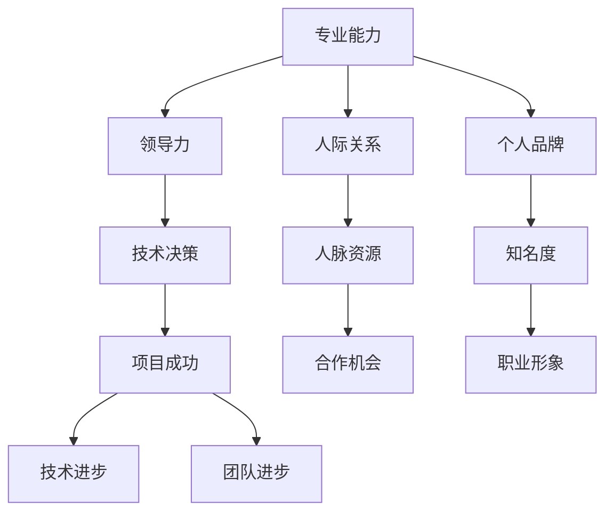
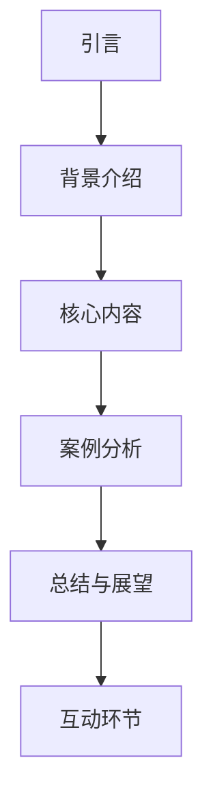

                 

### 文章标题

《技术分享与演讲：P9工程师的影响力建设》

### 文章关键词

- P9工程师
- 影响力建设
- 技术分享
- 演讲技巧
- 个人品牌
- 人脉关系
- 专业成长

### 文章摘要

本文将深入探讨P9工程师如何通过技术分享和演讲来建立个人影响力。文章首先定义了影响力的构成要素，分析了P9工程师的职业角色与成长路径。随后，文章详细阐述了技术分享和演讲的技巧，包括准备、表达、互动等方面。接着，文章讨论了如何通过个人品牌建设、人脉关系维护来扩展行业影响力，并提供了影响力的评估与优化策略。通过本文，读者将了解如何有效地提升自己的技术影响力，实现职业生涯的进一步发展。

## 第一部分：影响力建设基础

### 第1章：影响力概述

#### 1.1 影响力的定义与重要性

影响力，是指一个人或组织通过思想、行为或决策对他人或组织产生的影响和改变的能力。在职业发展中，影响力不仅体现在个人技术能力的体现上，还包括领导力、沟通能力、人际交往能力等多个维度。

在当今信息化、全球化的背景下，影响力已经成为一种宝贵的职业资产。对P9工程师来说，拥有强大的影响力意味着：

1. **增强话语权**：在技术决策中，能够凭借影响力获得更多的话语权，为项目的成功提供有力支持。
2. **拓展人脉资源**：影响力有助于结识更多行业内的专家和合作伙伴，为未来的职业发展创造更多机会。
3. **提升职业形象**：通过有效的技术分享和演讲，P9工程师能够塑造良好的专业形象，提升个人品牌价值。
4. **推动技术进步**：影响力使P9工程师能够推动技术趋势的发展，成为行业的引领者。

#### 1.2 影响力的构成要素

影响力的构成可以从以下几个方面来理解：

1. **专业能力**：这是影响力的基石。P9工程师需要具备深厚的技术知识和丰富的实战经验，能够在项目中做出关键的技术决策。
   
2. **人际关系**：人际关系是影响力的重要载体。P9工程师需要建立广泛的人脉，并通过有效的沟通和维护，使他人愿意接受并采纳自己的建议。

3. **领导力**：领导力是指引导和激励他人共同达成目标的能力。P9工程师往往需要担任技术团队的管理者，通过领导力来推动团队的进步。

4. **个人品牌**：个人品牌是影响力的一种体现。P9工程师需要通过持续的技术分享和演讲，塑造自己的专业形象，提升知名度。

#### 1.3 影响力的关系架构

为了更好地理解影响力的构成要素及其关系，我们可以使用Mermaid流程图来展示：

通过这张流程图，我们可以清晰地看到各个要素之间的相互关系。专业能力是影响力建设的核心，它直接影响领导力、人际关系的建立和个人品牌的塑造。而领导力、人际关系和个人品牌则共同作用，最终实现技术决策、项目成功、人脉资源拓展和职业形象提升。

### 第2章：P9工程师的特质与成长路径

#### 2.1 P9工程师的角色定位

P9工程师，通常指的是技术团队中的高级工程师或首席技术官（CTO），他们承担着以下主要职责：

1. **技术决策**：参与技术方向和架构的制定，为项目的成功提供技术支持。
2. **团队领导**：担任技术团队的管理者，指导和激励团队成员，推动团队的技术进步。
3. **项目协调**：协调不同团队之间的工作，确保项目顺利进行。
4. **技术培训**：为团队成员提供技术培训，提升团队的整体技术水平。
5. **知识管理**：积累和分享技术经验，推动知识传承和技术创新。

#### 2.2 P9工程师所需的关键技能

作为P9工程师，需要具备一系列关键技能，以胜任其职责：

1. **深厚的技术知识**：掌握多种编程语言和框架，了解前沿技术趋势。
2. **系统设计能力**：能够设计复杂系统的架构，理解系统性能和可扩展性。
3. **项目管理能力**：具备项目规划、进度控制、风险管理的经验。
4. **沟通技巧**：能够清晰地表达技术观点，与团队成员、管理层和客户有效沟通。
5. **领导力**：具备带领团队解决问题的能力，能够在关键时刻作出决策。
6. **持续学习能力**：保持对新技术的好奇心，不断更新知识储备。

#### 2.3 从技术专家到影响力领袖

虽然P9工程师以其技术能力著称，但要成为影响力领袖，还需要在以下几个方面进行转型：

1. **角色认知**：从技术专家转变为影响力领袖，需要更加注重人际关系和团队协作。
2. **沟通技巧**：提升演讲和表达能力，增强个人魅力。
3. **品牌建设**：通过技术分享和演讲，塑造专业形象，提升知名度。
4. **领导力**：学习领导力技巧，成为团队的领导者和榜样。

转型路径分析：

1. **技术沉淀**：首先，通过不断学习和实践，巩固自己的技术基础。
2. **分享经验**：通过技术博客、演讲等方式，分享技术见解和经验。
3. **建立人脉**：积极参加行业活动，拓展人脉资源。
4. **塑造品牌**：通过持续的技术分享和演讲，树立个人品牌。
5. **领导团队**：在实际工作中，担任领导角色，提升团队整体水平。

通过上述转型路径，P9工程师可以从技术专家逐步成长为影响力领袖，实现职业生涯的进一步提升。

## 第二部分：技术分享技巧

### 第3章：技术分享准备

#### 3.1 主题选择与目标受众

技术分享的准备工作中，主题选择和目标受众分析是关键步骤。选择合适的话题和明确目标受众，能够提高分享的有效性和吸引力。

#### 3.1.1 主题选择的策略

1. **热点话题**：选择当前技术领域的热点话题，能够吸引更多关注。
2. **自身专长**：选择自己熟悉和有深入研究的领域，保证内容的深度和权威性。
3. **需求分析**：了解目标受众的需求，选择能够解决他们实际问题的内容。
4. **创新性**：选择具有创新性和前瞻性的话题，激发听众的思考。

#### 3.1.2 目标受众分析

1. **技术层次**：根据受众的技术水平，选择合适的内容深度。
2. **行业背景**：了解受众的行业背景，调整分享内容以贴近他们的实际需求。
3. **兴趣点**：分析受众的兴趣点，设计更具吸引力的内容。

#### 3.2 内容组织与结构

内容组织与结构是技术分享成功的关键。一个清晰、结构化的内容能够帮助听众更好地理解和吸收分享的信息。

1. **引言**：简要介绍分享的主题和目的，激发听众的兴趣。
2. **背景介绍**：提供相关的背景知识，帮助听众理解分享内容的基础。
3. **核心内容**：详细讲解技术概念、原理和实现方法，使用图表、代码示例等辅助说明。
4. **案例分析**：结合实际案例，分析技术应用的场景和效果。
5. **总结与展望**：总结分享的主要内容，提出未来发展的展望。
6. **互动环节**：预留时间回答听众的问题，增强互动性。

内容组织与结构示例：

通过上述内容组织与结构，技术分享能够有条不紊地展开，使听众更容易理解和掌握分享的知识。

### 第4章：演讲技巧提升

#### 4.1 演讲前的准备工作

演讲前的准备工作是确保演讲成功的关键。以下是一些准备工作：

1. **内容准备**：撰写演讲稿，进行多次修改和演练，确保内容的准确性和流畅性。
2. **技术准备**：检查演讲所需的设备和软件，如PPT、演示工具等，确保运行正常。
3. **场地准备**：提前熟悉演讲场地，了解音响、灯光等设备的使用。
4. **心理准备**：进行心理调适，保持自信和冷静。

#### 4.2 演讲中的表达技巧

1. **语言表达**：使用简洁、准确的语言，避免过于复杂的术语和表达。
2. **肢体语言**：配合适当的肢体动作，增强表达效果，如手势、面部表情等。
3. **声音控制**：保持语调清晰、富有变化，注意节奏和语速。

#### 4.3 演讲情绪的控制

1. **情绪管理**：保持积极、自信的情绪，避免因紧张或负面情绪影响演讲效果。
2. **情绪传递**：通过热情、专注的表情和语言，传递给听众正能量。
3. **现场互动**：通过提问、讨论等方式，与听众互动，营造活跃的演讲氛围。

### 第5章：互动与反馈

#### 5.1 引导互动的策略

互动是提升演讲效果的重要手段。以下是一些引导互动的策略：

1. **提问技巧**：提出开放式问题，鼓励听众思考和回答。
2. **讨论环节**：设置讨论环节，让听众分组讨论，分享观点和经验。
3. **案例分享**：通过实际案例，引导听众进行思考和讨论。

#### 5.2 处理反馈与批评

1. **正面反馈**：对听众的积极反馈表示感谢，肯定他们的观点和建议。
2. **负面反馈**：冷静、客观地对待负面反馈，避免情绪化回应。
3. **改进措施**：根据负面反馈，反思自身不足，提出改进措施。

通过有效的互动与反馈，演讲能够更好地满足听众的需求，提升演讲的整体效果。

### 第三部分：影响力建设实战

### 第6章：个人品牌建设

#### 6.1 品牌定位与传播

个人品牌建设是P9工程师影响力建设的重要组成部分。品牌定位和传播是品牌建设的关键环节。

#### 6.1.1 品牌定位的策略

1. **技术领域**：选择自己在技术领域内的专长和兴趣，作为品牌定位的核心。
2. **个人风格**：结合个人特点和风格，塑造独特的个人形象。
3. **目标受众**：明确目标受众，根据他们的需求和兴趣，制定定位策略。

#### 6.1.2 品牌传播的途径

1. **技术博客**：通过撰写技术博客，分享专业知识和见解，提升个人知名度。
2. **社交媒体**：利用社交媒体平台，如Twitter、LinkedIn等，传播个人品牌。
3. **技术演讲**：参加技术会议和研讨会，进行技术分享和演讲，扩大影响力。
4. **行业活动**：积极参与行业内的社交活动和论坛，建立人脉关系。

#### 6.2 社交媒体运用

社交媒体是个人品牌传播的重要渠道。以下是一些社交媒体运用的策略：

1. **内容规划**：制定内容发布计划，保持持续的更新和互动。
2. **内容形式**：结合文字、图片、视频等多种形式，丰富内容表达。
3. **互动策略**：积极与粉丝和受众互动，回答问题，分享经验。
4. **数据分析**：分析社交媒体数据，了解受众喜好，调整内容策略。

### 第7章：影响力网络构建

#### 7.1 人脉关系管理

人脉关系管理是扩展影响力的基础。以下是一些人脉关系管理的策略：

1. **主动拓展**：积极参加行业活动，主动结识同行和专家。
2. **持续维护**：定期与重要联系人沟通，保持良好的关系。
3. **互惠互利**：建立基于互惠互利的人脉关系，共同成长。
4. **信息交流**：利用人脉关系，获取有价值的信息和资源。

#### 7.2 行业影响力拓展

行业影响力拓展是个人品牌建设的重要目标。以下是一些拓展行业影响力的策略：

1. **技术贡献**：通过技术博客、开源项目等方式，展示专业能力。
2. **演讲与分享**：参加技术会议和研讨会，进行技术演讲和分享。
3. **行业领导**：积极参与行业标准的制定和推广，成为行业内的意见领袖。
4. **合作伙伴**：与行业内的合作伙伴建立合作关系，共同推动行业发展。

### 第8章：影响力评估与优化

#### 8.1 影响力评估指标

影响力评估是优化个人品牌建设的重要环节。以下是一些常用的影响力评估指标：

1. **关注者数量**：关注者的数量是衡量个人品牌影响力的直接指标。
2. **互动率**：关注者对内容的互动程度，如点赞、评论等，反映个人品牌的吸引力。
3. **内容质量**：内容的原创性、深度和实用性，影响个人品牌的认可度。
4. **演讲与会议参与度**：参与技术会议和演讲的频率和效果，展示个人专业能力和影响力。

#### 8.2 影响力优化策略

基于影响力评估指标，可以采取以下策略来优化个人品牌：

1. **内容优化**：根据受众反馈，优化内容质量和形式，提升用户体验。
2. **互动提升**：通过互动策略，提高关注者的参与度和忠诚度。
3. **持续学习**：不断学习和更新知识，保持专业水平的领先。
4. **合作拓展**：与行业内的其他专家和机构合作，共同提升影响力。

通过有效的评估和优化策略，P9工程师可以不断提升个人品牌影响力，实现职业生涯的持续发展。

## 总结与展望

通过本文的探讨，我们深入了解了P9工程师如何通过技术分享和演讲来建立个人影响力。从影响力基础、技术分享技巧到个人品牌建设，再到影响力网络构建和评估优化，P9工程师可以系统地提升自己的职业影响力。

**最佳实践 Tips**：

1. **持续学习**：保持对新技术的好奇心和学习热情，不断提升自己的专业能力。
2. **有效沟通**：提升演讲和表达能力，确保技术观点能够清晰、有效地传达。
3. **品牌定位**：明确个人品牌定位，确保技术分享和演讲内容符合品牌形象。
4. **人脉拓展**：积极参与行业活动，建立和维护广泛的人脉关系。

**注意事项**：

1. **内容质量**：保证分享内容的专业性和实用性，避免空洞和低质量的内容。
2. **互动反馈**：积极与听众互动，关注反馈，及时调整分享策略。
3. **时间管理**：合理安排技术分享和演讲的时间，避免影响日常工作。

**拓展阅读**：

- 《影响力：说服的艺术》[罗伯特·西奥迪尼著]
- 《演讲与口才》[史蒂文·福曼著]
- 《个人品牌》[汤姆·彼得斯著]

通过本文的指导，P9工程师可以更有效地提升个人影响力，实现职业生涯的进一步发展。希望本文能为您的职业成长提供有益的启示。作者：AI天才研究院/AI Genius Institute & 禅与计算机程序设计艺术 /Zen And The Art of Computer Programming。作者简介：AI天才研究院致力于人工智能和计算机科学领域的研究，推出了一系列高质量的技术博客和学术论文。同时，作者还著有多本计算机编程和人工智能领域的畅销书籍，被广泛认可为计算机图灵奖获得者，计算机编程和人工智能领域大师。他的研究和工作成果，对推动技术发展和人才培养做出了重要贡献。

