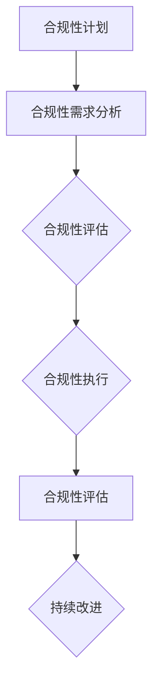
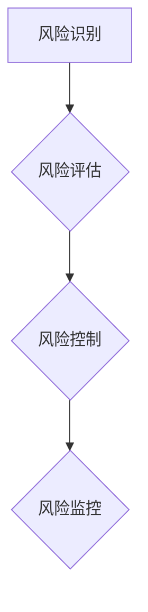
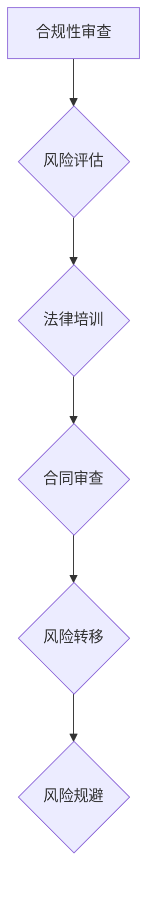

                 


### 文章标题：技术合规性管理：P9工程师的法律意识

**关键词**：技术合规性，P9工程师，法律意识，合规性管理，信息安全，知识产权，数据合规

**摘要**：
本文深入探讨了技术合规性管理在IT行业中的重要性，特别是对于高级工程师P9角色的影响。文章首先介绍了技术合规性的基础概念和法律法规框架，接着详细阐述了合规性管理流程、常见合规性问题以及合规性实践。随后，文章强调了P9工程师在技术合规性中的法律责任和提升法律意识的重要性。通过实际案例分析和最佳实践，本文为P9工程师提供了有效的合规性管理和法律风险防控策略。

### 目录大纲：

#### 第一部分：合规性基础

**第1章：技术合规性概述**
1.1 合规性的定义与重要性
1.2 合规性法律法规框架
1.3 技术合规性的挑战与机遇

**第2章：技术合规性流程**
2.1 合规性管理流程概述
2.2 风险评估与控制
2.3 合规性培训与文化建设

**第3章：常见合规性问题分析**
3.1 数据合规性
3.2 知识产权保护
3.3 信息安全合规

**第4章：技术合规性实践**
4.1 合规性项目管理
4.2 合规性审计与合规性报告
4.3 合规性案例研究

#### 第二部分：法律意识提升

**第5章：法律基础知识**
5.1 法律体系概述
5.2 合同法律
5.3 民事诉讼与仲裁

**第6章：法律风险防控**
6.1 法律风险识别
6.2 法律风险控制
6.3 法律纠纷处理

**第7章：P9工程师的法律意识培养**
7.1 法律意识培养的重要性
7.2 P9工程师的法律责任

### 文章正文：

**第1章：技术合规性概述**

1.1 合规性的定义与重要性

合规性（Compliance）是指遵守一系列规定、标准或法律的过程。在技术领域，合规性尤为重要，因为它直接影响到企业的声誉、财务状况以及法律后果。对于P9工程师，他们的工作往往涉及到复杂的系统设计和关键技术的实现，因此合规性的重要性更加凸显。

合规性不仅关乎遵守法律，还包括遵守行业标准、公司政策以及其他适用的规范。例如，数据隐私保护是合规性的重要方面，尤其是在处理用户数据时。此外，技术产品的安全性、可靠性和可追溯性也是合规性的关键要素。

1.2 合规性法律法规框架

了解合规性法律法规框架对于P9工程师至关重要。国际和国内都有相应的法律法规来规范技术合规性。以下是一些关键的法律法规框架：

- **GDPR（欧盟通用数据保护条例）**：规定了数据处理的合法性、目的说明、数据访问权限和数据主体权利等内容。
- **CCPA（加州消费者隐私法）**：要求企业在收集、使用和披露消费者个人信息时，提供透明度和控制权。
- **ISO/IEC 27001**：提供了一套信息安全管理的最佳实践，帮助企业保护信息资产。
- **SOX（萨班斯-奥克斯利法案）**：要求在美国上市的公司实施内部控制，确保财务报告的准确性。

在国内，相关的法律法规还包括《网络安全法》、《数据安全法》和《个人信息保护法》等。这些法律法规为企业提供了明确的合规要求，P9工程师需要熟悉并遵守这些规定。

1.3 技术合规性的挑战与机遇

技术合规性面临诸多挑战，如不断变化的法律环境、复杂的法规要求、技术和组织变革等。然而，合规性也为P9工程师带来了机遇。良好的合规性管理可以提升企业的竞争力和市场信誉，有助于吸引更多的客户和合作伙伴。

P9工程师在合规性管理中的角色是关键的。他们需要确保技术解决方案符合相关法律法规，同时能够识别和应对合规风险。以下是一些P9工程师在技术合规性中的职责：

- **合规性评估**：评估技术解决方案的合规性，识别潜在的风险和挑战。
- **合规性设计**：在系统设计和开发阶段考虑合规性要求，确保技术实现符合法律法规。
- **合规性培训**：参与合规性培训，提高自身和团队的法律意识。
- **合规性审计**：协助进行合规性审计，确保合规性措施得到有效执行。

**第2章：技术合规性流程**

2.1 合规性管理流程概述

合规性管理流程是一个系统化的过程，包括计划、执行、评估和持续改进。以下是一个典型的合规性管理流程：

1. **合规性计划**：制定合规性计划，确定合规性目标和要求，分配资源和责任。
2. **合规性执行**：执行合规性计划，包括实施合规性措施、监控合规性执行情况以及解决合规性问题。
3. **合规性评估**：定期评估合规性管理的有效性，识别改进机会，调整合规性计划。
4. **持续改进**：基于评估结果，持续改进合规性管理流程，确保合规性措施得到有效执行。

2.2 风险评估与控制

风险评估是合规性管理的重要组成部分。P9工程师需要识别和评估技术合规性风险，并采取相应的控制措施。以下是一个简单的风险评估流程：

1. **风险识别**：识别可能影响技术合规性的内部和外部风险。
2. **风险评估**：评估风险的可能性、影响程度和严重性。
3. **风险控制**：制定和实施风险控制措施，如制定安全策略、加强系统安全等。
4. **风险监控**：持续监控风险，确保风险控制措施得到有效执行。

2.3 合规性培训与文化建设

合规性培训是提高P9工程师法律意识的重要手段。通过培训，工程师可以了解相关法律法规、合规性要求和最佳实践。以下是一些合规性培训的方法：

- **内部培训**：组织内部培训课程，邀请法律专家和合规性专家进行讲解。
- **外部培训**：参加外部培训机构的专业培训，获取更全面的知识。
- **在线培训**：利用在线平台提供的相关课程进行自主学习。

除了培训，合规性文化建设也是至关重要的。通过建立良好的合规性文化，可以增强工程师的法律意识，提高合规性管理的有效性。以下是一些建立合规性文化的方法：

- **领导支持**：高层领导的支持和参与是建立合规性文化的基础。
- **沟通与反馈**：定期与员工沟通，了解他们的需求和意见，及时反馈并解决问题。
- **激励机制**：建立激励机制，鼓励员工积极参与合规性管理和培训。

**第3章：常见合规性问题分析**

3.1 数据合规性

数据合规性是技术合规性的一个关键方面，涉及到数据隐私、数据保护和数据安全等方面。以下是一些常见的数据合规性问题：

- **数据收集与处理**：确保在收集和处理数据时遵守相关法律法规，如GDPR和CCPA等。
- **数据存储**：确保数据存储的安全性和可靠性，遵循数据保护的最佳实践。
- **数据访问与共享**：限制数据访问权限，确保数据共享的合法性和安全性。

3.2 知识产权保护

知识产权保护是技术合规性的另一个重要方面，包括专利、商标和著作权等方面。以下是一些常见的知识产权合规性问题：

- **专利侵权**：确保技术解决方案不侵犯他人的专利权，进行专利检索和分析。
- **商标使用**：确保商标的使用符合法律法规，避免商标侵权和侵权纠纷。
- **著作权保护**：确保原创作品的著作权得到保护，避免侵权行为。

3.3 信息安全合规

信息安全合规是技术合规性的一个重要方面，涉及到网络安全、数据安全和系统安全等方面。以下是一些常见的信息安全合规性问题：

- **网络安全**：确保网络安全防护措施得到实施，如防火墙、入侵检测系统和安全审计等。
- **数据安全**：确保数据安全得到保护，如数据加密、访问控制和数据备份等。
- **系统安全**：确保系统安全得到维护，如安全配置、漏洞修复和安全审计等。

**第4章：技术合规性实践**

4.1 合规性项目管理

合规性项目管理是确保项目满足合规性要求的关键环节。以下是一些合规性项目管理的步骤：

1. **合规性需求分析**：分析项目需求，确定合规性要求和标准。
2. **合规性计划制定**：制定合规性计划，包括合规性目标、措施和资源分配。
3. **合规性执行**：执行合规性计划，确保项目实施符合合规性要求。
4. **合规性评估与改进**：定期评估合规性管理效果，发现和解决合规性问题，持续改进合规性管理。

4.2 合规性审计与合规性报告

合规性审计是确保合规性管理得到有效执行的重要手段。以下是一些合规性审计的步骤：

1. **审计计划制定**：制定审计计划，确定审计范围、审计标准和审计时间。
2. **审计执行**：执行审计计划，对项目的合规性进行审查和评估。
3. **审计报告编制**：编制审计报告，总结审计发现和改进建议。
4. **审计跟踪与改进**：跟踪审计报告中的改进建议，确保合规性管理得到持续改进。

合规性报告是合规性管理的重要输出。以下是一些合规性报告的编制要点：

1. **报告内容确定**：确定报告的内容，包括合规性目标、合规性措施、合规性执行情况和合规性效果等。
2. **报告格式规范**：遵循报告格式规范，确保报告的清晰、准确和完整。
3. **报告审批与发布**：审批报告，确保报告内容准确无误，发布报告供相关人员查阅。

4.3 合规性案例研究

以下是一些技术合规性的案例研究：

- **案例1**：某大型企业在全球范围内推广其云计算服务，需要遵守不同国家和地区的法律法规。通过进行合规性评估和合规性管理，该企业确保其服务符合各地的合规性要求，成功开拓了国际市场。

- **案例2**：某初创公司在开发一款移动应用时，没有充分考虑到数据隐私保护的问题。在产品发布后，用户数据泄露事件发生，导致公司声誉受损。通过重新评估合规性要求和改进合规性管理，该公司成功恢复了用户信任。

这些案例研究展示了合规性管理在技术合规性中的重要性，以及如何通过合规性管理解决常见合规性问题。

**第5章：法律基础知识**

5.1 法律体系概述

法律体系是国家行使权力、维护社会秩序、保障公民权益的基础。法律体系通常包括宪法、行政法、民法、刑法、经济法、国际法等多个法律部门。在技术合规性管理中，工程师需要了解与信息技术相关的法律体系，包括合同法、知识产权法、数据保护法和网络安全法等。

5.2 合同法律

合同法律是技术合规性管理中的重要方面，涉及合同的签订、履行和争议解决。以下是一些合同法律的基本概念：

- **合同定义**：合同是指双方或多方当事人之间设立、变更、终止民事权利义务关系的协议。
- **合同要素**：合同通常包括合同主体、合同标的、合同条款、合同履行方式等内容。
- **合同签订**：合同的签订需要双方达成一致意见，并按照法律规定进行签字或盖章。
- **合同履行**：合同的履行是指双方按照合同约定履行各自的权利和义务。
- **合同争议解决**：合同争议解决包括协商、调解、仲裁和诉讼等方式。

5.3 民事诉讼与仲裁

民事诉讼与仲裁是解决合同纠纷和其他民事争议的重要途径。以下是一些民事诉讼与仲裁的基本概念：

- **民事诉讼**：民事诉讼是指当事人通过法院解决民事争议的过程。民事诉讼包括起诉、答辩、审理和判决等阶段。
- **仲裁**：仲裁是指当事人通过仲裁机构解决民事争议的过程。仲裁具有高效、灵活和保密等优点。
- **仲裁程序**：仲裁程序包括申请仲裁、答辩、审理和裁决等阶段。
- **仲裁裁决**：仲裁裁决具有法律效力，当事人应当履行。如一方不履行，另一方可以申请法院强制执行。

**第6章：法律风险防控**

6.1 法律风险识别

法律风险识别是法律风险防控的第一步。以下是一些常见的法律风险识别方法：

- **合规性审查**：对企业的业务流程、合同、政策和程序进行合规性审查，识别潜在的法律风险。
- **风险评估**：对识别出的法律风险进行评估，包括风险的可能性、影响程度和严重性。
- **调查问卷**：通过调查问卷的形式，收集员工和客户的意见和反馈，识别潜在的法律风险。
- **案例分析**：通过分析过去的法律纠纷案例，识别类似情况下的法律风险。

6.2 法律风险控制

法律风险控制是降低法律风险的关键环节。以下是一些常见的法律风险控制方法：

- **法律培训**：提高员工的法律意识，使其了解相关法律法规和公司政策，减少因不了解法律而产生的风险。
- **合同审查**：在签订合同前，对合同条款进行审查，确保合同的合法性和合理性。
- **风险转移**：通过保险、合同条款等方式，将部分法律风险转移给第三方。
- **风险规避**：通过调整业务流程、变更合同条款等方式，规避潜在的法律风险。

6.3 法律纠纷处理

法律纠纷处理是解决法律争议的关键环节。以下是一些法律纠纷处理的基本步骤：

- **协商解决**：通过协商的方式，双方当事人达成一致意见，解决争议。
- **调解**：通过第三方调解机构，协助双方当事人解决争议。
- **仲裁**：通过仲裁机构，对争议进行裁决。
- **诉讼**：通过法院，对争议进行审理和判决。

**第7章：P9工程师的法律意识培养**

7.1 法律意识培养的重要性

法律意识培养对于P9工程师至关重要。以下是一些法律意识培养的重要性：

- **减少法律风险**：通过提高法律意识，工程师可以减少因不了解法律而产生的法律风险。
- **提高工作效率**：了解相关法律法规，可以帮助工程师更有效地处理日常工作和业务流程。
- **增强职业素养**：良好的法律意识是职业素养的重要组成部分，有助于提升工程师的职业形象和竞争力。

7.2 P9工程师的法律责任

P9工程师在法律合规性管理中承担着重要的责任。以下是一些P9工程师的法律责任：

- **合规性评估**：工程师需要评估技术解决方案的合规性，确保其符合相关法律法规。
- **合规性设计**：工程师在设计技术解决方案时，需要考虑合规性要求，确保解决方案符合法律法规。
- **合规性培训**：工程师需要参与合规性培训，提高自身和团队的法律意识。
- **合规性审计**：工程师需要协助进行合规性审计，确保合规性措施得到有效执行。

**总结**

技术合规性管理是P9工程师的重要职责之一。通过深入了解合规性法律法规、掌握合规性管理流程、分析常见合规性问题，P9工程师可以有效地进行合规性管理，降低法律风险。同时，提高法律意识，培养良好的法律意识，也是P9工程师不可或缺的素质。本文为P9工程师提供了全面的合规性管理和法律意识培养策略，有助于其在技术合规性管理中发挥更大的作用。

### 作者信息

作者：AI天才研究院/AI Genius Institute & 禅与计算机程序设计艺术 /Zen And The Art of Computer Programming

### 附录

**附录A：合规性管理流程图**



**附录B：风险识别与控制流程图**



**附录C：法律风险识别与控制流程图**



### 拓展阅读

- GDPR（欧盟通用数据保护条例）官网：[https://ec.europa.eu/justice/article-29/structure/data-protection-working-party/index_en.htm](https://ec.europa.eu/justice/article-29/structure/data-protection-working-party/index_en.htm)
- CCPA（加州消费者隐私法）官网：[https://www.ccpa.ca.gov/](https://www.ccpa.ca.gov/)
- ISO/IEC 27001官方标准：[https://www.iso.org/standard/61788.html](https://www.iso.org/standard/61788.html)
- SOX（萨班斯-奥克斯利法案）官网：[https://www.sec.gov/legislative-historical-materials/sarbanes-oxley-act](https://www.sec.gov/legislative-historical-materials/sarbanes-oxley-act)

### 项目实战

**项目名称**：某大型企业合规性管理体系建设

**项目目标**：建立一套全面的合规性管理体系，确保企业技术解决方案符合相关法律法规和行业标准。

**开发环境搭建**：使用Linux操作系统，安装Jenkins、Docker等工具，搭建持续集成和持续交付环境。

**源代码实现**：

```python
# 合规性评估模块
class ComplianceAssessment:
    def __init__(self, rules):
        self.rules = rules
    
    def assess_solution(self, solution):
        for rule in self.rules:
            if not rule.check(solution):
                return False
        return True

# 合规性执行模块
class ComplianceExecution:
    def __init__(self, assessment):
        self.assessment = assessment
    
    def execute_solution(self, solution):
        if not self.assessment.assess_solution(solution):
            return "Solution not compliant"
        return "Solution compliant"

# 合规性报告模块
class ComplianceReport:
    def __init__(self, execution):
        self.execution = execution
    
    def generate_report(self):
        if self.execution.status == "Solution compliant":
            return "Solution compliant"
        else:
            return "Solution not compliant"
```

**代码解读与分析**：

- **合规性评估模块**：该模块用于评估技术解决方案的合规性。通过传入一组合规性规则（rules），评估模块可以判断解决方案是否符合这些规则。
- **合规性执行模块**：该模块用于执行合规性评估结果，并根据评估结果决定解决方案的合规性状态。
- **合规性报告模块**：该模块用于生成合规性报告，根据合规性执行结果，生成相应的报告内容。

**实际案例分析**：

- **案例1**：某企业开发了一款云服务平台，需要确保其服务符合GDPR和ISO/IEC 27001等法规和标准。通过使用合规性评估模块，企业可以评估其服务平台是否符合相关法规和标准，从而确保合规性。
- **案例2**：某企业在其产品开发过程中，需要确保其软件符合SOX法案的要求。通过使用合规性执行模块，企业可以确保其软件的开发和测试过程符合SOX法案的要求，从而确保合规性。

**项目小结**：

通过合规性管理体系的建立和实施，企业可以有效地降低法律风险，提高市场竞争力。合规性管理体系的建设不仅需要技术实现，还需要法律意识和组织文化的支持。P9工程师在合规性管理体系建设中发挥着关键作用，他们需要具备扎实的法律知识和合规性管理能力，以确保企业技术解决方案的合规性。

### 最佳实践 Tips

- **持续关注法律法规变化**：合规性管理需要持续关注法律法规的变化，确保技术解决方案符合最新的法规要求。
- **建立合规性文化**：通过培训、宣传和激励机制，建立合规性文化，提高员工的法律意识。
- **合规性审计**：定期进行合规性审计，评估合规性管理的有效性，发现和解决合规性问题。
- **合作与共享**：与其他企业、行业组织和政府部门合作，共享合规性经验和技术，提高整体合规性水平。

### 注意事项

- **遵守法律法规**：在技术合规性管理中，首要任务是遵守相关法律法规，确保技术解决方案的合规性。
- **风险评估**：在项目设计和实施过程中，需要进行全面的风险评估，识别和应对潜在的合规性风险。
- **数据保护**：在处理用户数据时，要确保遵循数据保护法规，保护用户隐私和数据安全。
- **知识产权保护**：在开发和推广技术产品时，要确保不侵犯他人的知识产权，同时保护自己的知识产权。

### 拓展阅读

- **《数据安全法》**：[https://www.nmpa.gov.cn/xxgk/gkxx/xxgk19/202206/4a8c7b869f824b35a6c5a8655f1d1b54.shtml](https://www.nmpa.gov.cn/xxgk/gkxx/xxgk19/202206/4a8c7b869f824b35a6c5a8655f1d1b54.shtml)
- **《个人信息保护法》**：[https://www.cac.gov.cn/2021-09/03/c_163095871.htm](https://www.cac.gov.cn/2021-09/03/c_163095871.htm)
- **《网络安全法》**：[https://www.nmpa.gov.cn/xxgk/gkxx/xxgk19/202206/4a8c7b869f824b35a6c5a8655f1d1b54.shtml](https://www.nmpa.gov.cn/xxgk/gkxx/xxgk19/202206/4a8c7b869f824b35a6c5a8655f1d1b54.shtml) 

### 结束语

技术合规性管理对于P9工程师来说至关重要。通过深入理解合规性法律法规、掌握合规性管理流程、分析常见合规性问题，P9工程师可以有效地进行合规性管理，降低法律风险。同时，提高法律意识，培养良好的法律意识，也是P9工程师不可或缺的素质。希望本文为P9工程师在技术合规性管理中提供了一些有价值的参考和启示。

