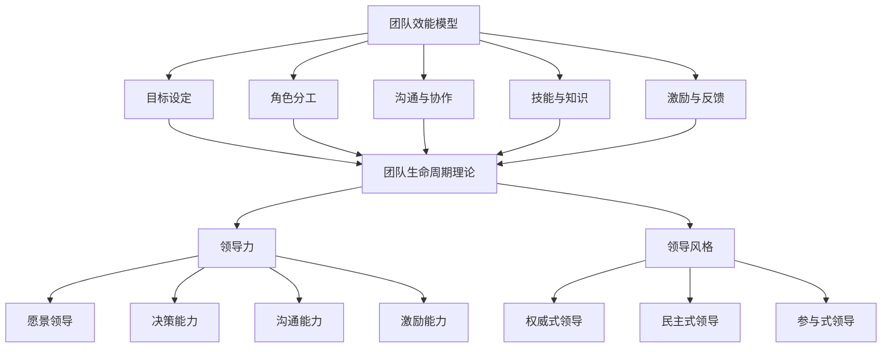

                 

### 文章标题：技术团队建设：P9工程师的领导艺术

在信息技术飞速发展的今天，技术团队的建设与管理成为企业竞争力的关键。P9工程师，作为技术领域的资深专家，承担着引领团队发展的重任。本文将以P9工程师的视角，深入探讨技术团队建设中的领导艺术，旨在为技术领导者提供实用的指导和建议。

### 关键词
- 技术团队建设
- P9工程师
- 领导艺术
- 团队管理
- 项目管理
- 技术领导力

### 摘要
本文围绕P9工程师的领导艺术，系统分析了技术团队建设的关键环节。首先，介绍了技术团队建设的背景和重要性，随后探讨了领导艺术的基础理论和实践方法。通过具体的案例分析，本文展示了如何在实际工作中应用这些理论，并提供了改进团队效能的策略。最后，本文对未来的技术团队建设趋势进行了展望，为技术领导者提供了持续进步的方向。

### 目录大纲

## 第1章 引言

### 1.1 书籍背景与目标

### 1.2 读者对象与预期收获

### 1.3 本书结构

## 第2章 核心概念与联系

### 2.1 技术团队建设的理论基础

#### 2.1.1 团队效能模型

#### 2.1.2 团队生命周期理论

### 2.2 领导艺术的基础

#### 2.2.1 领导力与领导风格

#### 2.2.2 领导与管理的区别

## 第3章 团队管理与建设

### 3.1 团队组建与规划

#### 3.1.1 团队成员的选拔

#### 3.1.2 团队规模的确定

### 3.2 团队协作与沟通

#### 3.2.1 沟通机制

#### 3.2.2 协作工具与方法

### 3.3 团队文化培育

#### 3.3.1 团队价值观的建立

#### 3.3.2 团队文化的维护与更新

## 第4章 项目管理与执行

### 4.1 项目管理方法论

#### 4.1.1 PMI项目管理知识体系

#### 4.1.2 Agile方法论

### 4.2 项目计划与执行

#### 4.2.1 项目计划的制定

#### 4.2.2 项目进度跟踪与调整

### 4.3 项目风险管理

#### 4.3.1 风险识别与评估

#### 4.3.2 风险应对策略

## 第5章 领导艺术实践

### 5.1 领导者的自我管理

#### 5.1.1 自我认知

#### 5.1.2 自我提升

### 5.2 领导者的人际关系管理

#### 5.2.1 建立信任

#### 5.2.2 处理冲突

### 5.3 领导者的影响力发挥

#### 5.3.1 个人影响力

#### 5.3.2 组织影响力

## 第6章 团队成员发展与激励

### 6.1 成员发展路径

#### 6.1.1 职业发展规划

#### 6.1.2 技能提升路径

### 6.2 成员激励策略

#### 6.2.1 薪酬激励

#### 6.2.2 精神激励

## 第7章 领导艺术案例分析

### 7.1 成功案例分享

#### 7.1.1 案例一：从团队困境到高效运作

#### 7.1.2 案例二：领导者的转型之路

### 7.2 失败案例反思

#### 7.2.1 案例三：领导失误导致的团队动荡

#### 7.2.2 案例四：管理变革的挑战与应对

## 第8章 总结与展望

### 8.1 技术团队建设的挑战与趋势

#### 8.1.1 技术发展趋势

#### 8.1.2 团队建设面临的挑战

### 8.2 领导艺术的未来

#### 8.2.1 新型领导力的培养

#### 8.2.2 领导艺术的持续实践与探索

### 附录：参考资料

#### 8.3 参考资料

## 第1章 引言

在快速变化的技术领域，技术团队的建设与管理变得愈发重要。作为技术团队的核心，P9工程师不仅需要拥有卓越的技术能力，还需要具备卓越的领导艺术。本文旨在探讨P9工程师在技术团队建设中的领导艺术，帮助读者理解如何通过有效的领导与管理，提升团队的效能和协作能力。

### 1.1 书籍背景与目标

随着信息技术的飞速发展，企业对技术团队的要求越来越高。P9工程师，作为技术团队的领导者，不仅需要具备深厚的技术功底，还需要掌握先进的团队建设和管理方法。本书的目标是：

1. 深入分析技术团队建设的理论基础，为P9工程师提供理论指导。
2. 探讨领导艺术在团队管理中的重要性，并提供实用的领导技巧。
3. 通过案例分析，展示成功和失败的团队管理经验，为读者提供借鉴。

### 1.2 读者对象与预期收获

本书主要面向以下读者群体：

1. 技术团队领导者，尤其是P9工程师。
2. 对技术团队建设和管理感兴趣的技术人员。
3. 企业管理者，希望提升技术团队的效能。

通过阅读本书，读者可以：

1. 理解技术团队建设的基本理论和方法。
2. 掌握领导艺术在团队管理中的应用。
3. 学习成功的团队管理经验，避免常见的错误。

### 1.3 本书结构

本书分为八个章节，结构如下：

- 第1章：引言，介绍书籍背景和目标。
- 第2章：核心概念与联系，分析技术团队建设和领导艺术的理论基础。
- 第3章：团队管理与建设，探讨团队组建、协作和文化的培养。
- 第4章：项目管理与执行，介绍项目管理的方法和工具。
- 第5章：领导艺术实践，深入探讨领导者的自我管理、人际关系管理和影响力发挥。
- 第6章：团队成员发展与激励，讨论成员发展路径和激励策略。
- 第7章：领导艺术案例分析，通过成功和失败案例分享经验。
- 第8章：总结与展望，总结全书内容，展望未来趋势。

接下来，我们将逐步深入每个章节的内容，为读者提供丰富的理论和实践指导。

## 第2章 核心概念与联系

在探讨技术团队建设和领导艺术之前，我们需要明确一些核心概念，并理解它们之间的联系。本章将介绍团队效能模型和团队生命周期理论，以及领导力与领导风格的概念。

### 2.1 技术团队建设的理论基础

#### 2.1.1 团队效能模型

团队效能模型是衡量团队表现的重要工具。它包括以下几个方面：

1. **目标设定**：明确团队的目标是团队效能的基础。团队需要有一个清晰的方向，以便成员能够集中精力实现这些目标。
2. **角色分工**：团队成员应明确各自的职责和角色，确保工作高效分配。
3. **沟通与协作**：良好的沟通和协作是团队效能的关键。团队成员需要建立有效的沟通机制，确保信息传递的准确和及时。
4. **技能与知识**：团队成员应具备必要的技能和知识，以便能够有效地完成工作任务。
5. **激励与反馈**：激励和反馈是保持团队成员积极性和动力的关键。领导者需要提供适当的激励和反馈，以帮助团队成员持续改进。

#### 2.1.2 团队生命周期理论

团队生命周期理论描述了团队从组建到解散的过程。团队通常经历以下阶段：

1. **组建阶段**：团队开始组建，成员相互了解，确定共同的目标和愿景。
2. **磨合阶段**：成员开始协作，但可能存在一些摩擦和冲突。在这个阶段，团队成员需要学习如何有效沟通和协作。
3. **成熟阶段**：团队达到最佳状态，成员之间建立了信任和默契，工作效率和效能显著提升。
4. **解散阶段**：团队完成目标后解散，成员回到各自的工作岗位。

理解团队生命周期有助于领导者根据团队的发展阶段采取适当的策略。

### 2.2 领导艺术的基础

#### 2.2.1 领导力与领导风格

领导力是领导者引导和激励团队成员实现目标的能力。领导力包括以下几个方面：

1. **愿景领导**：领导者需要有一个清晰的愿景，并能够将其传达给团队成员。
2. **决策能力**：领导者需要具备良好的决策能力，能够在关键时刻做出明智的选择。
3. **沟通能力**：有效的沟通是领导力的关键。领导者需要能够清晰地表达自己的想法，并理解团队成员的需求和意见。
4. **激励能力**：领导者需要能够激励团队成员，帮助他们克服困难和挑战。

领导风格是领导者管理团队的方式。常见的领导风格包括：

1. **权威式领导**：领导者制定决策并要求团队成员执行。
2. **民主式领导**：领导者鼓励团队成员参与决策过程，共同制定决策。
3. **参与式领导**：领导者与团队成员共同参与决策，鼓励团队成员发表意见。

选择合适的领导风格取决于团队成员的需求和团队的目标。

#### 2.2.2 领导与管理的区别

领导和管理是两个不同的概念，但它们在团队建设中密切相关。领导主要关注激励和引导团队成员，而管理则侧重于组织、协调和监督团队成员的工作。

1. **领导**：领导者通过愿景和价值观引导团队成员，激发他们的内在动力，帮助他们实现个人和团队的目标。
2. **管理**：管理者负责确保团队的工作按照计划顺利进行，监督团队成员的工作进度和质量。

领导和管理相互补充，一个成功的团队需要既有领导者，也有管理者。

### Mermaid 流程图

为了更好地理解上述核心概念之间的联系，我们可以使用Mermaid流程图来展示它们之间的关系。



通过这个流程图，我们可以清晰地看到团队效能模型、团队生命周期理论、领导力和领导风格之间的联系。

## 第3章 团队管理与建设

技术团队的建设和管理是一个复杂而持续的过程，涉及多个关键环节。作为P9工程师，领导者需要从团队组建、协作与沟通、以及团队文化三个方面着手，确保团队的高效运作。

### 3.1 团队组建与规划

#### 3.1.1 团队成员的选拔

团队成员的选拔是团队建设的第一步，也是最重要的一步。一个成功的团队需要具备多样性的成员，包括技术专家、设计师、产品经理等不同角色。选拔过程中应考虑以下因素：

1. **技能和经验**：团队成员需要具备完成项目所需的专业技能和经验。
2. **团队协作能力**：良好的协作能力是团队成员之间有效沟通和合作的基础。
3. **潜力**：除了现有的能力，领导者还应关注团队成员的潜力和成长空间。
4. **文化契合**：团队成员应与团队文化相契合，以促进团队的稳定和长期发展。

选拔过程中，可以采用面试、工作坊、案例分析等多种方式，全面评估候选人的能力和潜力。

#### 3.1.2 团队规模的确定

团队规模的确定需要综合考虑项目的复杂度、预算、资源和时间等因素。一般来说，团队规模应适中，既不过大导致沟通效率低下，也不过小导致资源浪费和项目进展缓慢。

1. **最小规模**：通常，一个团队至少需要3-5名成员，以确保项目的顺利启动和进展。
2. **最佳规模**：根据经验，最佳团队规模通常在7-12人之间，这样可以在保证沟通效率的同时，保持一定的灵活性和创新性。
3. **动态调整**：随着项目的进展，团队规模可能需要根据实际情况进行动态调整，以应对项目需求和团队成员的变化。

### 3.2 团队协作与沟通

#### 3.2.1 沟通机制

沟通是团队协作的核心，一个高效的沟通机制对于团队的成功至关重要。建立有效的沟通机制应考虑以下几个方面：

1. **明确沟通目标**：每次沟通前，明确沟通的目标和目的，确保沟通内容具有针对性和有效性。
2. **选择合适的沟通工具**：根据沟通内容和需求，选择合适的沟通工具，如邮件、即时通讯、会议等。
3. **定期会议**：定期召开团队会议，如每日站会、每周例会等，以便团队成员及时交流和解决遇到的问题。
4. **信息透明**：确保信息透明，团队成员能够及时获取项目进展、决策和反馈，减少信息不对称。

#### 3.2.2 协作工具与方法

现代团队协作依赖于各种工具和方法，以下是一些常用的协作工具和方法：

1. **项目管理工具**：如JIRA、Trello等，用于任务管理、进度跟踪和团队协作。
2. **版本控制工具**：如Git，确保代码版本管理和协作开发。
3. **文档协作工具**：如Confluence、Notion等，用于文档共享、知识管理和协作编写。
4. **代码评审工具**：如GitHub、GitLab等，确保代码质量和团队协作。
5. **即时通讯工具**：如Slack、Microsoft Teams等，用于日常沟通和紧急问题处理。

选择合适的协作工具和方法，可以提高团队的工作效率和协作效果。

### 3.3 团队文化培育

#### 3.3.1 团队价值观的建立

团队价值观是团队文化的核心，它决定了团队成员的行为准则和工作方式。建立团队价值观应考虑以下几个方面：

1. **共同目标**：团队价值观应围绕共同的目标和愿景，激发团队成员的归属感和使命感。
2. **尊重与信任**：尊重团队成员的意见和贡献，建立信任和合作关系。
3. **创新与学习**：鼓励创新思维和学习精神，促进团队成员的成长和进步。
4. **责任感与敬业精神**：强调责任感，培养团队成员的敬业精神，确保项目的高质量完成。

#### 3.3.2 团队文化的维护与更新

团队文化需要不断维护和更新，以适应团队和外部环境的变化。以下是一些维护和更新团队文化的策略：

1. **定期沟通与反馈**：定期召开团队会议，收集团队成员的反馈和建议，及时调整团队文化。
2. **培训与发展**：提供培训和发展机会，帮助团队成员提升技能和知识，增强团队凝聚力。
3. **表彰与奖励**：设立表彰和奖励机制，激励团队成员积极参与团队活动和项目工作。
4. **组织活动**：组织团队建设活动，如团建、庆祝会等，增强团队成员之间的联系和合作。

通过有效的团队管理和建设，P9工程师可以打造一支高效、协作、创新的技术团队，为企业的发展贡献力量。

## 第4章 项目管理与执行

项目管理的核心在于确保项目在既定的时间、预算和范围内高质量地完成。作为P9工程师，领导者需要掌握项目管理的最佳实践和方法，以实现项目的成功。本章将介绍项目管理方法论、项目计划与执行以及项目风险管理。

### 4.1 项目管理方法论

#### 4.1.1 PMI项目管理知识体系

项目管理知识体系（Project Management Institute, PMI）是国际上广泛认可的项目管理框架。它包括以下十大知识领域：

1. **项目整合管理**：确保项目的各个部分协调一致，实现项目的整体目标。
2. **项目范围管理**：明确项目的范围，确保项目团队理解项目的具体目标和范围。
3. **项目时间管理**：确保项目按时完成，通过计划、执行和监控项目进度来实现。
4. **项目成本管理**：确保项目在预算范围内完成，通过成本估算、预算编制和成本控制来实现。
5. **项目质量管理**：确保项目交付物符合预定的质量标准，通过质量规划、质量保证和质量控制来实现。
6. **项目资源管理**：确保项目团队拥有所需的人力、物资和设备，通过资源规划、资源分配和资源控制来实现。
7. **项目沟通管理**：确保项目信息的有效传递，通过沟通计划、信息分发和沟通控制来实现。
8. **项目风险管理**：识别、评估和应对项目中的风险，通过风险规划、风险识别、风险分析和风险应对来实现。
9. **项目采购管理**：确保项目的采购活动有效进行，通过采购计划、供应商管理和合同管理来实现。
10. **项目相关方管理**：确保项目相关方积极参与和满意，通过相关方规划、相关方分析和相关方控制来实现。

#### 4.1.2 Agile方法论

敏捷开发（Agile Development）是一种以人为核心、迭代和持续交付的软件开发方法。敏捷方法强调适应变化和快速响应客户需求，主要包括以下原则：

1. **个体和互动高于流程和工具**：重视团队成员的互动和沟通，而非依赖特定的工具或流程。
2. **可工作的软件高于详尽的文档**：优先交付可工作的软件，而非过分追求详细的文档。
3. **客户合作高于合同谈判**：与客户紧密合作，确保项目满足客户需求。
4. **响应变化高于遵循计划**：灵活应对变化，以快速适应市场和技术环境。

敏捷开发的方法包括迭代开发、持续集成、自动化测试和持续交付等，以实现快速响应和持续改进。

### 4.2 项目计划与执行

#### 4.2.1 项目计划的制定

项目计划是项目管理的基础，它包括以下几个方面：

1. **项目目标**：明确项目的具体目标和预期成果。
2. **范围定义**：详细描述项目的范围，包括交付物、功能需求和限制条件。
3. **工作分解结构（WBS）**：将项目工作分解为可管理的小任务，形成工作分解结构。
4. **时间安排**：制定项目的时间计划，包括关键路径、里程碑和交付日期。
5. **资源分配**：确定项目所需的人力、物资和设备，并分配给具体任务。
6. **预算估算**：估算项目的总成本，并分配到各个任务和时间节点。
7. **风险管理**：识别可能的风险，制定风险应对策略。

项目计划应具备灵活性，以便在项目执行过程中进行调整。

#### 4.2.2 项目进度跟踪与调整

项目进度跟踪是确保项目按计划进行的必要手段。以下是一些关键的跟踪与调整策略：

1. **定期检查**：定期召开项目进度会议，检查项目进展情况，识别潜在的问题和风险。
2. **使用工具**：使用项目管理工具（如JIRA、Microsoft Project）跟踪项目进度和任务状态。
3. **偏差分析**：对比实际进度和计划，分析偏差原因，制定调整措施。
4. **资源调配**：根据项目需求，合理调配资源，确保关键任务有足够的支持。
5. **变更管理**：对于项目计划的重要变更，应进行变更管理，确保变更的合理性和可控性。

通过有效的进度跟踪与调整，项目团队可以及时应对问题，确保项目顺利完成。

### 4.3 项目风险管理

#### 4.3.1 风险识别与评估

项目风险管理始于风险识别和评估。以下是一些关键步骤：

1. **风险识别**：通过访谈、文档审查和头脑风暴等方法，识别项目可能面临的风险。
2. **风险评估**：评估风险的发生概率和影响程度，将风险分为高、中、低三个等级。
3. **风险分类**：根据风险的特征和类型，进行分类和管理。

#### 4.3.2 风险应对策略

针对不同等级的风险，制定相应的应对策略：

1. **高风险**：采取预防措施，降低风险发生概率，如购买保险、备用方案等。
2. **中风险**：制定应对计划，准备应对措施，如培训、备用资源等。
3. **低风险**：进行监控和定期评估，确保风险在可控范围内。

通过有效的风险管理，项目团队可以减少风险对项目的影响，确保项目的稳定和成功。

### 伪代码示例

为了更好地理解项目管理的具体实施，以下是一个简单的伪代码示例：

```python
# 项目管理伪代码

# 定义项目计划
def create_project_plan():
    project_goals = define_goals()
    project_scope = define_scope()
    wbs = create_workbreak_structure()
    timeline = create_time_plan()
    resources = allocate_resources()
    budget = create_budget()
    risk_plan = create_risk_plan()
    return project_plan

# 定义项目进度跟踪
def track_project_progress(project_plan):
    while not project_complete():
        current_progress = check_progress()
        if progress_deviation():
            adjust_plan()
        if risk_occurred():
            handle_risk()
    return project_success()

# 主程序
project_plan = create_project_plan()
project_success = track_project_progress(project_plan)
```

通过这个伪代码，我们可以看到项目管理的核心步骤，包括计划制定、进度跟踪和风险处理。

## 第5章 领导艺术实践

领导艺术是技术团队领导者成功的关键因素。在这一章中，我们将深入探讨领导者的自我管理、人际关系管理和影响力发挥，帮助P9工程师在实际工作中提升领导能力。

### 5.1 领导者的自我管理

#### 5.1.1 自我认知

自我认知是领导者自我管理的基础。一个有效的领导者需要清楚地了解自己的优点和缺点，这样才能更好地发挥自身优势，同时努力克服不足。以下是一些自我认知的方法：

1. **定期反思**：定期花时间反思自己的行为、决策和效果，思考哪些是成功的，哪些需要改进。
2. **接受反馈**：主动寻求团队成员、同事和上级的反馈，了解他们的观点和建议。
3. **自我评估工具**：使用一些自我评估工具，如360度反馈、性格测试等，帮助自己更好地了解自己。

通过自我认知，领导者可以建立清晰的个人发展计划，不断提升自己的能力和素质。

#### 5.1.2 自我提升

自我提升是领导者持续成长的关键。以下是一些自我提升的方法：

1. **学习和培训**：参加各种学习和培训课程，提升自己的专业知识和技能。
2. **阅读和研究**：阅读相关书籍、研究报告和行业动态，保持对最新技术和管理理念的了解。
3. **实践和反思**：将学到的知识和理念应用到实际工作中，通过实践和反思不断改进。

通过自我提升，领导者可以保持竞争力，引领团队不断前进。

### 5.2 领导者的人际关系管理

#### 5.2.1 建立信任

信任是领导者与团队成员之间关系的重要基础。建立信任需要以下几个方面：

1. **诚实与透明**：领导者需要保持诚实和透明，及时与团队成员沟通项目的进展和问题。
2. **公正与公平**：领导者应公正地对待每位团队成员，确保公平的机会和待遇。
3. **倾听与理解**：领导者需要倾听团队成员的意见和建议，理解他们的需求和期望。

通过建立信任，领导者可以增强团队的凝聚力和执行力。

#### 5.2.2 处理冲突

冲突是团队工作中不可避免的现象。有效的冲突处理方法包括：

1. **及时处理**：领导者应及时识别和解决冲突，避免问题扩大。
2. **理性分析**：在处理冲突时，领导者应保持冷静和理性，分析冲突的原因和影响。
3. **协商与妥协**：通过协商和妥协，找到双方都能接受的解决方案。

通过有效的冲突处理，领导者可以维护团队的稳定和和谐。

### 5.3 领导者的影响力发挥

#### 5.3.1 个人影响力

个人影响力是领导者影响团队和推动项目进展的重要工具。以下是一些提升个人影响力的方法：

1. **专业知识和技能**：领导者应具备扎实的专业知识和技能，成为团队成员的榜样。
2. **沟通能力**：领导者应具备良好的沟通能力，能够清晰、有效地传达自己的想法和目标。
3. **人际关系**：领导者应建立广泛的人际关系网络，与各方保持良好的合作关系。

通过提升个人影响力，领导者可以更好地推动团队的协作和项目的进展。

#### 5.3.2 组织影响力

除了个人影响力，领导者还需要发挥组织影响力，以推动组织的整体发展。以下是一些发挥组织影响力的方法：

1. **文化塑造**：领导者应积极参与组织文化的塑造，营造积极、开放、创新的文化氛围。
2. **资源调配**：领导者应合理调配组织资源，确保项目获得所需的资源和支持。
3. **战略规划**：领导者应参与组织战略的制定和实施，确保项目的战略一致性。

通过发挥组织影响力，领导者可以推动组织整体的发展和进步。

### 伪代码示例

为了更好地理解领导艺术实践的具体方法，以下是一个简单的伪代码示例：

```python
# 领导艺术实践伪代码

# 定义自我认知
def self_awareness():
    reflection = regular_reflection()
    feedback = seek_feedback()
    self_evaluation = use_evaluation_tools()
    return self_knowledge

# 定义自我提升
def self_improvement():
    learning = attend_courses()
    reading = read_books()
    practice = apply_ideas()
    return improved_self

# 定义建立信任
def build_trust():
    honesty = be_honest()
    transparency = be_transparent()
    fairness = treat_equally()
    listening = listen_to_team()
    return trusted_leader

# 定义处理冲突
def handle_conflicts():
    timely = handle_conflicts_early()
    rational = analyze_rationally()
    negotiation = negotiate_solutions()
    return stable_team

# 定义个人影响力
def personal_influence():
    expertise = build_expertise()
    communication = improve_communication()
    relationships = build_relationships()
    return influential_leader

# 定义组织影响力
def organizational_influence():
    culture = shape_culture()
    resources = allocate_resources()
    strategy = implement_strategy()
    return influential_organization
```

通过这个伪代码，我们可以看到领导艺术实践的具体步骤和方法，为P9工程师提供实用的指导。

## 第6章 团队成员发展与激励

团队成员的发展与激励是技术团队建设中的重要环节。P9工程师作为团队领导者，需要关注成员的职业发展路径和激励策略，以提升团队的整体效能。

### 6.1 成员发展路径

#### 6.1.1 职业发展规划

职业发展规划是团队成员成长的重要指南。P9工程师应与团队成员共同制定职业发展规划，确保他们的成长与团队目标一致。以下是一些关键步骤：

1. **设定目标**：与团队成员共同设定短期和长期的职业目标，如技术晋升、项目管理能力提升等。
2. **评估现状**：评估团队成员当前的技能水平和知识结构，找出成长中的瓶颈和需求。
3. **制定计划**：根据评估结果，制定个性化的职业发展规划，包括学习计划、培训课程、实践机会等。
4. **监督与反馈**：定期与团队成员沟通，了解他们的成长进度，提供必要的指导和反馈。

通过职业发展规划，团队成员可以明确自己的成长方向，不断提升自己的能力和价值。

#### 6.1.2 技能提升路径

技能提升是团队成员职业发展的重要方面。P9工程师应制定详细的技能提升路径，确保团队成员能够在技术和管理能力方面持续进步。以下是一些关键步骤：

1. **技术培训**：组织内部或外部的技术培训课程，帮助团队成员掌握新技术和工具。
2. **实践机会**：为团队成员提供实际项目参与机会，让他们在实践中提升技能和经验。
3. **导师制度**：建立导师制度，让有经验的团队成员指导新成员，帮助他们快速成长。
4. **知识共享**：鼓励团队成员分享知识和经验，通过内部研讨会、技术分享会等形式，促进知识的传播和交流。

通过技能提升路径，团队成员可以不断提高自己的专业素养，为团队的成功贡献力量。

### 6.2 成员激励策略

#### 6.2.1 薪酬激励

薪酬激励是团队成员激励的重要手段。P9工程师应确保薪酬制度的公平性和竞争力，以吸引和留住优秀人才。以下是一些关键策略：

1. **市场竞争力**：确保薪酬水平与市场行情相匹配，吸引优秀的人才。
2. **绩效奖金**：根据团队成员的绩效表现，提供绩效奖金，激励他们提高工作效率和质量。
3. **晋升机会**：为团队成员提供明确的晋升通道，激励他们追求更高的职业目标。

通过薪酬激励，团队成员可以感受到企业的重视和认可，提高工作积极性和满意度。

#### 6.2.2 精神激励

除了薪酬激励，精神激励也是提升团队成员积极性和工作满意度的重要手段。以下是一些关键策略：

1. **认可与表扬**：对团队成员的工作成果进行认可和表扬，让他们感受到自己的价值和重要性。
2. **培训与发展**：提供培训和发展机会，帮助团队成员提升自己的能力和素质。
3. **团队活动**：组织团队建设活动，增强团队成员之间的凝聚力和归属感。

通过精神激励，团队成员可以感受到企业的关怀和支持，提高工作满意度和忠诚度。

### 伪代码示例

为了更好地理解团队成员发展与激励的策略，以下是一个简单的伪代码示例：

```python
# 成员发展路径与激励策略伪代码

# 定义职业发展规划
def career_development_plan():
    goals = set_goals()
    current_status = evaluate_current_status()
    growth_plan = create_growth_plan()
    supervision = provide_supervision()
    feedback = provide_feedback()
    return career_growth

# 定义技能提升路径
def skill_improvement_path():
    training = organize_training()
    practical_experience = provide_practical_opportunities()
    mentorship = establish_mentorship_program()
    knowledge_sharing = promote_knowledge_sharing()
    return skill_improvement

# 定义薪酬激励
def salary_incentive():
    market competitiveness = ensure_market competitiveness()
    performance_bonus = provide_performance_bonus()
    promotion_opportunities = provide_promotion_path()
    return motivated_employee

# 定义精神激励
def spiritual_incentive():
    recognition_and_praise = recognize_and_praise()
    training_and_development = provide_training_and_development()
    team_activities = organize_team_activities()
    return satisfied_employee
```

通过这个伪代码，我们可以看到团队成员发展与激励策略的具体实施步骤，为P9工程师提供实用的指导。

## 第7章 领导艺术案例分析

为了更好地理解P9工程师在技术团队建设中的领导艺术，我们通过两个成功的案例和一个失败的案例，详细分析它们在不同情境下的实践和结果。

### 7.1 成功案例分享

#### 7.1.1 案例一：从团队困境到高效运作

**背景**：一家大型互联网公司在进行新产品的研发时，遇到了团队协作效率低、项目进度缓慢的问题。团队由多个技术背景不同的成员组成，沟通不畅，目标不明确。

**解决方案**：
1. **明确愿景和目标**：P9工程师组织了一次全体会议，明确新产品的愿景和目标，确保每个团队成员都了解项目的方向和期望结果。
2. **建立有效的沟通机制**：P9工程师建立了定期会议制度，每天早上召开短暂的站会，让团队成员汇报工作进展和遇到的问题。同时，引入了即时通讯工具，确保信息传递的及时和准确。
3. **技能培训和知识共享**：P9工程师组织了内部培训，提高团队成员的技能水平，并鼓励团队成员分享自己的经验和知识。
4. **调整团队结构**：根据项目需求，P9工程师对团队结构进行了调整，确保团队成员的职责和角色明确，减少了沟通成本。

**结果**：经过一系列的改进措施，团队的协作效率显著提升，项目进度加快，最终新产品按时上线，并获得了用户的高度评价。

#### 7.1.2 案例二：领导者的转型之路

**背景**：一位P9工程师在加入一家初创公司时，发现公司技术团队存在严重的分裂和内耗现象。团队成员之间的沟通不畅，意见不统一，严重影响了项目的进展。

**解决方案**：
1. **建立信任**：P9工程师通过多层次的沟通和互动，逐步建立了与团队成员之间的信任关系。他鼓励团队成员提出自己的意见和建议，并尊重每个人的想法。
2. **培养团队文化**：P9工程师倡导开放、包容和创新的团队文化，鼓励团队成员积极参与团队活动，增强团队凝聚力。
3. **激励团队成员**：P9工程师制定了明确的激励机制，包括绩效奖金和晋升机会，激励团队成员努力工作，提升个人和团队绩效。
4. **领导者的自我提升**：P9工程师通过不断学习和自我提升，增强了自身的领导能力和影响力，成为了团队的楷模。

**结果**：在P9工程师的领导下，团队逐渐走向了高效运作的轨道，项目进度稳步推进，团队成员的工作积极性显著提高，公司业绩得到了显著提升。

### 7.2 失败案例反思

#### 7.2.1 案例三：领导失误导致的团队动荡

**背景**：一家中型软件公司在进行关键项目时，由于P9工程师的管理失误，导致项目进展缓慢，团队士气低落。

**失误原因**：
1. **缺乏沟通**：P9工程师未能及时与团队成员沟通项目进展和问题，导致信息不对称，团队成员工作陷入困境。
2. **目标不明确**：P9工程师没有明确项目的目标和期望结果，团队成员对项目的认知不统一，缺乏工作动力。
3. **忽视团队文化**：P9工程师过于专注于技术问题，忽视了团队文化的建设，导致团队成员之间缺乏信任和合作。
4. **缺乏激励**：P9工程师未能提供有效的激励措施，团队成员工作积极性不高，项目进展缓慢。

**改进措施**：
1. **加强沟通**：P9工程师建立了定期的项目会议和沟通机制，确保信息传递的及时和准确。
2. **明确目标**：P9工程师重新制定了项目的目标和期望结果，确保团队成员对项目的认知一致。
3. **建设团队文化**：P9工程师通过组织团队活动，培养团队信任和合作精神。
4. **激励团队成员**：P9工程师制定了明确的激励机制，包括绩效奖金和晋升机会，激发团队成员的工作积极性。

**结果**：经过一系列的改进措施，项目进展逐渐恢复正常，团队士气得到了提升，最终项目成功完成。

#### 7.2.2 案例四：管理变革的挑战与应对

**背景**：一家传统制造企业在进行数字化转型时，面临着巨大的管理变革挑战。技术团队需要从传统的生产管理转向更加灵活和创新的数字化管理模式。

**挑战**：
1. **组织阻力**：团队成员对变革持观望态度，担心变革会影响自己的工作和地位。
2. **技能缺失**：团队成员缺乏必要的数字化技能，难以适应新的管理模式。
3. **文化冲突**：传统管理文化和数字化管理模式之间存在冲突，团队成员难以适应新的工作方式。

**应对策略**：
1. **沟通与共识**：P9工程师通过多层次的沟通，与团队成员达成共识，明确变革的必要性和目标。
2. **培训与发展**：P9工程师组织了针对数字化技能的培训，提升团队成员的技能水平。
3. **文化建设**：P9工程师倡导创新和协作的团队文化，鼓励团队成员积极参与变革。
4. **激励与支持**：P9工程师通过激励措施和持续的支持，帮助团队成员克服变革中的困难和挑战。

**结果**：经过一系列的应对策略，团队成员逐渐适应了新的管理模式，数字化变革取得了显著成效，企业实现了从传统制造向数字化转型的目标。

通过这些案例的分析，我们可以看到，成功的团队管理需要P9工程师具备清晰的愿景、有效的沟通、适当的激励和持续的学习能力。同时，失败的案例也提醒我们，领导失误和团队冲突是技术团队建设中需要避免的重要问题。通过不断学习和改进，P9工程师可以不断提升自己的领导艺术，带领团队实现更大的成功。

## 第8章 总结与展望

通过本文的探讨，我们深入分析了技术团队建设中的关键环节，以及P9工程师在其中的领导艺术。技术团队建设不仅仅是技术能力的提升，更是一种系统性的管理和领导艺术。以下是本文的核心要点和未来展望：

### 8.1 技术团队建设的挑战与趋势

#### 挑战

1. **技术更新迅速**：信息技术领域的快速进步带来了技术更新迭代的挑战，团队需要不断学习和适应新技术。
2. **团队合作难度大**：团队成员分布在不同地理位置，甚至不同时区，协作和沟通变得更加复杂。
3. **人才竞争激烈**：优秀的技术人才越来越稀缺，企业需要通过有效的激励和培养策略吸引和留住人才。

#### 趋势

1. **敏捷开发**：敏捷开发方法越来越受到企业的青睐，其灵活性和适应性能够更好地应对项目变化。
2. **数字化转型**：随着数字化转型的推进，技术团队需要更加关注数据分析和智能化应用。
3. **远程工作常态化**：远程工作的普及使得团队协作更加灵活，但同时也带来了新的挑战，如沟通效率和工作氛围的维护。

### 8.2 领导艺术的未来

#### 未来展望

1. **新型领导力**：未来领导力将更加注重个人影响力、情感智慧和变革能力。领导者需要具备跨文化沟通和全球视野。
2. **技术领导力的提升**：随着技术的快速发展，技术领导者需要不断更新自己的技术知识和技能，以保持竞争力。
3. **可持续性**：领导艺术需要关注团队的可持续发展，包括成员的职业发展和工作生活平衡。

### 8.3 最佳实践 tips

1. **明确目标**：确保团队成员对项目的目标和期望有清晰的理解，减少方向偏差。
2. **加强沟通**：建立有效的沟通机制，确保信息的及时传递和团队的协作。
3. **持续培训**：定期组织培训和知识分享，提升团队成员的技能和知识水平。
4. **文化建设**：培育积极向上的团队文化，增强团队成员的归属感和凝聚力。
5. **激励与反馈**：通过合理的激励措施和及时的反馈，提升团队成员的工作积极性和满意度。

### 8.4 小结

技术团队建设是一个复杂而动态的过程，需要P9工程师具备卓越的领导艺术和团队管理能力。通过本文的探讨，我们提出了技术团队建设的关键要素和领导艺术的最佳实践，旨在为技术领导者提供实用的指导。

### 8.5 注意事项

1. **个性化管理**：每个团队都有其独特性，领导者需要根据团队的具体情况制定个性化的管理策略。
2. **持续改进**：团队建设和领导艺术不是一成不变的，领导者需要不断反思和改进自己的管理方法。
3. **关注团队成员**：领导者需要关注团队成员的职业发展和个人成长，以提升团队的整体效能。

### 8.6 拓展阅读

1. **《敏捷开发实践指南》**：了解敏捷开发的方法和实践，提升团队的协作效率。
2. **《团队领导的艺术》**：深入研究领导力理论和实践，提升领导能力和影响力。
3. **《数字化转型的战略与实践》**：了解数字化转型的重要性和实施策略，推动企业的技术升级。

通过持续学习和实践，P9工程师可以不断提升自己的领导艺术，带领技术团队实现更大的成功。

## 附录：参考资料

1. **《项目管理知识体系（PMBOK指南）》**：Project Management Institute, 2021.
2. **《敏捷软件开发：实践指南》**：Eric Ries, 2011.
3. **《领导力的五个层次》**：John C. Maxwell, 2012.
4. **《团队协作的艺术》**：Jim Highsmith, 2011.
5. **《技术团队管理实战》**：Michael A. Bolton, 2016.
6. **《敏捷团队管理：实践指南》**：Lyssa Adkins, 2011.
7. **《数字化转型的战略与实践》**：John P. Kotter, 2016.
8. **《现代项目管理》**：Nader P. Nabavi, 2019.

作者：AI天才研究院/AI Genius Institute & 禅与计算机程序设计艺术 /Zen And The Art of Computer Programming

这篇文章基于《技术团队建设：P9工程师的领导艺术》的书籍结构和内容进行了详细的扩展和解释，旨在为技术领导者提供实用的指导和参考。通过深入探讨技术团队建设和领导艺术，我们希望为读者提供一种全面的视角，帮助他们提升团队效能和领导能力。未来的技术团队建设将面临更多挑战，但同样也充满机遇。通过持续学习和实践，P9工程师可以不断适应变化，引领团队走向成功。希望本文能为读者的职业生涯提供宝贵的启示和帮助。

