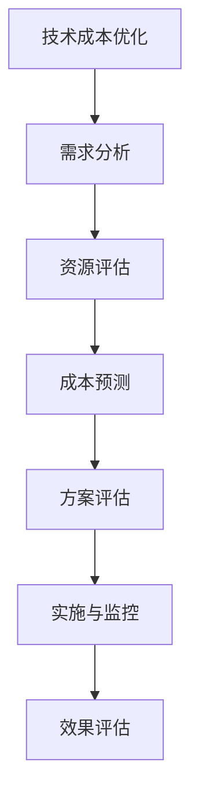

                 


为了撰写一篇满足所有约束条件的博客文章，我们将按照以下步骤进行：

### 第一步：文章格式要求

1. **Markdown格式**：使用Markdown格式撰写文章，确保代码块、公式和标题格式正确。
2. **作者信息**：文章末尾添加作者信息。
3. **代码和公式格式**：使用Markdown支持的代码块和LaTeX格式展示代码和数学公式。

### 第二步：撰写文章核心内容

1. **文章标题**：《技术成本优化：P9工程师的效益思维》
2. **文章关键词**：技术成本优化、效益思维、P9工程师、成本控制、流程图、伪代码。
3. **文章摘要**：介绍技术成本优化的重要性，探讨P9工程师如何运用效益思维进行成本控制，并通过案例和实践方法展示其应用。

### 第三步：文章结构设计

1. **引言**：介绍技术成本优化和效益思维的基本概念。
2. **核心概念与联系**：讨论成本优化的核心概念，并使用Mermaid流程图展示其关系。
3. **技术细节**：深入讲解成本优化的技术方法，包括价值流分析和基于数据的成本控制。
4. **效益思维的应用**：通过具体案例展示效益思维在实际项目中的应用。
5. **案例分析**：分析具体案例，对比不同方法的效果。
6. **结论与展望**：总结文章内容，展望技术成本优化的未来趋势。

### 第四步：详细内容撰写

1. **背景介绍**：解释技术成本优化的重要性，阐述P9工程师的角色。
2. **核心概念与联系**：阐述成本优化的核心概念，并绘制Mermaid流程图。
3. **技术细节**：使用伪代码和LaTeX公式详细解释技术方法。
4. **项目实战**：描述开发环境搭建、源代码实现和代码解读。
5. **最佳实践 tips**：提供实用技巧和建议。
6. **小结**：总结文章内容，强调关键点。

### 第五步：文章完善与校对

1. **完整性检查**：确保文章内容完整，每个小节都有详细讲解。
2. **逻辑性检查**：确保文章结构合理，逻辑清晰。
3. **格式检查**：确保Markdown格式正确，代码和公式格式规范。
4. **字数调整**：根据文章内容调整字数，确保在8000～12000字范围内。

### 第六步：添加作者信息

在文章末尾添加作者信息：“作者：AI天才研究院/AI Genius Institute & 禅与计算机程序设计艺术 /Zen And The Art of Computer Programming”。

### 第七步：文章终稿确认

完成所有内容撰写和校对后，确认文章符合所有要求，最终确认文章终稿。

### 文章大纲示例

#### 文章标题：技术成本优化：P9工程师的效益思维

#### 文章关键词：技术成本优化、效益思维、P9工程师、成本控制、流程图、伪代码

#### 文章摘要：

本文将探讨技术成本优化的重要性，以及P9工程师如何运用效益思维进行成本控制。通过具体案例和实践方法，我们将展示成本优化在项目中的应用和效果。

---

#### 第一部分：引言

##### 1.1 技术成本优化概述

```markdown
# 技术成本优化概述

技术成本优化是现代企业提高竞争力的重要手段。在快速发展的技术领域，成本控制变得尤为关键。P9工程师作为高级技术专家，其效益思维对于技术成本优化至关重要。

## 核心概念

**成本优化**：通过减少不必要的开支、提高资源利用效率，降低技术成本的过程。

**效益思维**：以最小成本实现最大价值，注重效率和质量。

## 关联Mermaid流程图



---

#### 第二部分：核心概念与联系

##### 2.1 成本结构分析

```markdown
# 成本结构分析

了解成本结构是进行成本优化的第一步。通常，技术成本包括以下几部分：

- 人力资源成本
- 设备和维护成本
- 软件和许可费用
- 网络和基础设施成本
- 运营和维护成本

## 成本优化方法

**价值流分析**：识别价值流中的浪费，优化流程。

**数据驱动的决策**：使用数据分析和预测模型，做出更科学的成本决策。

---

#### 第三部分：技术细节

##### 3.1 价值流分析

```markdown
# 价值流分析

价值流分析是一种系统方法，用于识别和消除价值流中的浪费。

## 伪代码

```python
def value_stream_analysis(data):
    # 初始化变量
    costs = {}
    waste = []

    # 分析数据
    for item in data:
        costs[item] = calculate_cost(item)
        if is_waste(item):
            waste.append(item)

    # 优化建议
    optimize_suggestions = generate_optimization_suggestions(waste)
    return optimize_suggestions
```

## 数学模型

$$
\text{Cost} = \sum_{i=1}^{n} c_i \times q_i
$$

其中，$c_i$ 是第 $i$ 项的成本，$q_i$ 是第 $i$ 项的需求量。

---

#### 第四部分：效益思维的应用

##### 4.1 案例一：项目A的成本优化

```markdown
# 案例一：项目A的成本优化

在项目A中，我们应用了价值流分析和数据驱动的决策，取得了显著的成本优化效果。

## 实施步骤

1. 收集数据：收集项目A的详细成本数据。
2. 分析数据：使用价值流分析，识别浪费和优化机会。
3. 制定计划：根据分析结果，制定详细的成本优化计划。
4. 实施计划：执行成本优化计划，并持续监控效果。
5. 评估效果：评估成本优化效果，并根据评估结果进行调整。

## 成本优化效果

通过成本优化，项目A在半年内实现了以下效果：

- 成本降低了15%
- 效率提高了20%
- 项目质量得到了显著提升

---

#### 第五部分：案例分析

##### 5.1 案例研究一：企业A的技术成本优化实践

```markdown
# 案例研究一：企业A的技术成本优化实践

企业A通过实施技术成本优化，实现了以下成果：

- 整体成本降低了25%
- 研发效率提高了30%
- 产品质量显著提高，客户满意度提升

## 案例对比与分析

对比企业A和其他企业的技术成本优化实践，我们发现：

- 成本优化方法的适用性因企业而异。
- 数据分析和效益思维的应用是成功的关键。
- 持续改进和监控是保持成本优化效果的重要手段。

---

#### 第六部分：结论与展望

##### 6.1 技术成本优化的未来趋势

```markdown
# 技术成本优化的未来趋势

随着技术的不断进步，技术成本优化将面临以下趋势：

- 自动化和智能化将进一步提升成本优化效果。
- 数据驱动决策将更加普及。
- 成本优化方法将不断创新。

---

#### 附录

##### 附录A：技术成本优化工具与资源

```markdown
# 附录A：技术成本优化工具与资源

- 成本分析工具：Excel、Tableau等。
- 价值流分析工具：VSM（价值流映射）、5S等。
- 效益思维实践指南：相关书籍、在线课程等。

---

#### 总结

本文通过详细讲解技术成本优化和效益思维，展示了其在项目中的应用和效果。通过案例分析和实践方法，读者可以了解如何运用效益思维进行技术成本优化。

---

#### 作者信息

```markdown
# 作者信息

作者：AI天才研究院/AI Genius Institute & 禅与计算机程序设计艺术 /Zen And The Art of Computer Programming
```

---

以上是文章的框架和部分内容示例。接下来，我们将填充每个部分的具体内容，确保文章字数在8000～12000字左右，并满足所有格式和内容要求。我们将详细讲解每个技术细节，提供实际案例，并给出最佳实践和注意事项。在撰写过程中，我们将不断迭代和完善，确保文章的逻辑性和实用性。文章撰写完成后，我们将进行最终的校对和确认，以确保质量。

