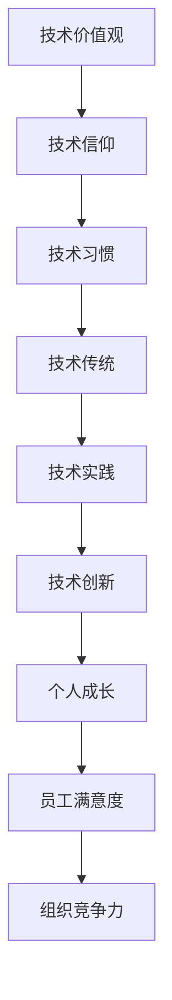
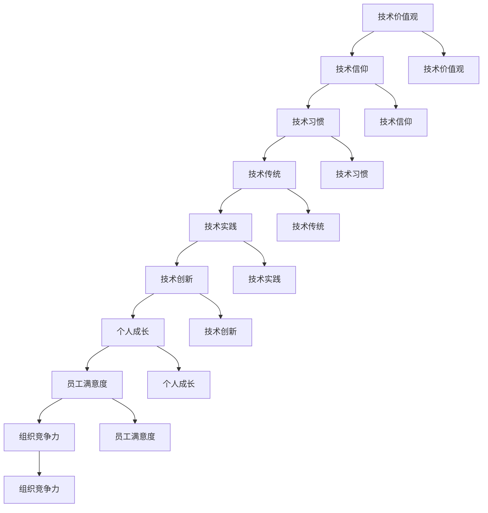
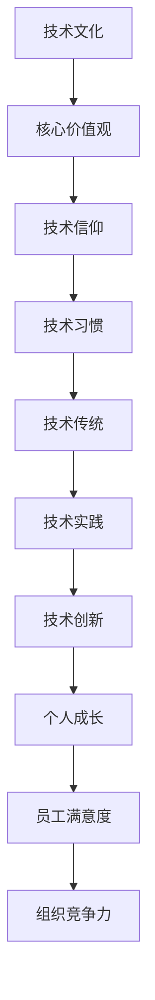

                 

### 文章标题

“技术文化建设：P9工程师的领导力实践”

### 文章关键词

技术文化、P9工程师、领导力、文化建设、实践

### 文章摘要

本文旨在探讨技术文化建设在IT行业中，特别是对于P9级高级工程师的重要性和实践方法。我们将首先定义技术文化，并阐述其在组织和个人成长中的核心作用。接着，我们将深入分析P9工程师的职业特点与职责，以及他们所需的核心技能。随后，我们将探讨领导力的定义和重要性，并介绍如何提升领导力以及其在不同情境下的应用。最后，本文将结合实际案例，展示技术文化建设和领导力实践如何协同发展，为行业提供有价值的见解和实用策略。

## 技术文化建设的概念与意义

### 技术文化的定义

技术文化是指在特定组织或社区内，通过共享的价值观、信仰、习惯和传统，对技术实践和创新的共同理解和态度。它不仅包括技术知识和技能的传承，还包括对技术创新的态度、对技术价值的认同以及对技术伦理的遵循。技术文化是一种软实力，它能够在无形中影响员工的行为和决策，从而塑造组织的整体技术氛围。

### 技术文化在组织中的作用

技术文化在组织中的作用是多方面的。首先，它能够促进技术创新。在一个技术文化浓厚的企业中，员工更愿意尝试新的技术和方法，更敢于面对失败和挑战，从而推动技术不断进步。其次，技术文化有助于提高员工满意度和忠诚度。当员工感受到企业的技术价值观与自己相符时，他们更有可能产生归属感和工作热情。此外，技术文化还能够提升组织的竞争力。一个拥有强大技术文化的企业，往往能够在市场中更快地适应变化，更好地应对挑战，从而保持持续的竞争优势。

### 技术文化对个人成长的影响

对于个人来说，技术文化的影响同样深远。首先，它提供了一个学习和成长的平台。在一个技术文化浓厚的环境中，个人可以不断接触到新的技术和知识，从而提升自己的技能水平。其次，技术文化有助于培养个人的创新思维。在一个鼓励创新和试错的企业中，个人更有可能敢于尝试新方法，提出新观点，从而激发创造力。最后，技术文化还能提升个人的职业道德和责任感。在一个重视技术伦理的企业中，个人更容易形成正确的价值观和行为准则，从而更好地履行自己的职业责任。

为了更好地理解技术文化，我们可以借助Mermaid流程图来展示其核心概念和关系架构：

这个流程图清晰地展示了技术文化的核心要素以及它们之间的关系。技术价值观、技术信仰、技术习惯和技术传统共同构成了技术文化的基石，这些要素通过技术实践和技术创新，进一步影响个人成长、员工满意度和组织竞争力。通过这个流程图，我们可以更直观地理解技术文化的定义和作用。

### 核心概念与联系

在技术文化建设中，有几个核心概念紧密相连，共同塑造了组织的整体文化氛围。首先，技术价值观是技术文化的核心，它决定了组织对技术的态度和认同。技术价值观包括对技术创新的尊重、对技术伦理的重视以及对技术效率的追求。这些价值观不仅影响员工的行为，还影响着组织的技术决策和文化氛围。

其次，技术信仰是技术文化的精神支柱，它代表了组织对技术的信心和期望。技术信仰通常体现在组织对新技术的研究和采纳上，以及对技术失败的容忍度。一个具有坚定技术信仰的组织，往往能够更快地适应技术变化，更积极地推动技术进步。

技术习惯则是技术文化的具体表现，它体现在员工日常的工作方式和行为中。技术习惯包括对代码规范、开发流程和团队协作的遵循。良好的技术习惯能够提高工作效率，减少错误，促进技术的稳定性和可靠性。

最后，技术传统是技术文化的历史积淀，它包含了组织在长期发展过程中积累的技术经验和知识。技术传统不仅为当前的技术实践提供了指导，还为未来的技术创新提供了基础。

这些核心概念之间的关系可以用以下Mermaid流程图进行展示：

在这个流程图中，我们可以看到技术价值观、技术信仰、技术习惯和技术传统相互关联，共同构建了一个完整的技术文化体系。技术价值观和技术信仰决定了组织对技术的态度和行为，技术习惯和技术传统则具体体现在日常的工作中。这些要素通过技术实践和技术创新，最终影响个人成长、员工满意度和组织竞争力。

通过这个流程图，我们不仅能够更清晰地理解技术文化的核心概念，还能更好地把握这些概念之间的内在联系，为技术文化建设提供有力的理论支持。

### 技术文化建设的策略与方法

技术文化建设是一个复杂而长期的过程，需要系统的策略和方法。以下是几个关键步骤：

#### 文化诊断

首先，进行文化诊断是技术文化建设的首要步骤。通过访谈、问卷调查、焦点小组讨论等方式，了解组织内部现有的文化状况，包括员工对技术的态度、技术决策过程、团队协作模式等。这些信息有助于识别组织中的文化问题和潜在的文化需求。

#### 文化变革

在完成文化诊断后，制定并实施文化变革计划。这包括以下几个步骤：

1. **明确目标**：确定组织希望实现的技术文化愿景，例如，是否强调技术创新、技术伦理还是技术效率。

2. **沟通与教育**：通过内部会议、培训课程和宣传材料，向员工传达技术文化的核心价值和目标，确保员工理解并接受新的文化理念。

3. **激励机制**：建立与技术文化相一致的激励机制，例如，设立技术创新奖、技术伦理奖等，激励员工积极参与技术文化建设。

4. **领导示范**：领导者需要在技术文化变革中起到榜样作用，通过自身的言行，向员工展示对技术文化的认同和实践。

#### 文化传承与发展

技术文化建设不是一次性任务，而是一个持续的过程。以下方法有助于文化的传承与发展：

1. **持续沟通**：定期组织技术文化研讨会、交流活动，促进员工之间的沟通和知识分享，保持技术文化的活力。

2. **制度保障**：建立与技术文化相一致的制度和流程，例如，技术评审流程、技术知识分享制度等，确保技术文化的实践能够持续和制度化。

3. **文化传承**：通过导师制度、技术传承计划等，将资深员工的技术经验和知识传递给新员工，确保技术文化在新一代员工中得到传承。

4. **技术创新与学习**：鼓励员工不断学习新技术、新方法，推动技术文化的创新和发展。

#### 实践案例

以下是一个实际案例，展示如何通过策略和方法进行技术文化建设：

在一个大型科技公司中，管理层意识到技术文化建设对于公司竞争力的重要性。他们首先通过问卷调查和访谈，了解员工对技术的态度和期望。随后，他们制定了以下文化变革计划：

1. **明确目标**：公司将技术文化的愿景定为“鼓励创新、注重技术伦理、提升技术效率”。

2. **沟通与教育**：公司组织了一系列内部培训和研讨会，向员工传达技术文化的核心价值和目标，并邀请外部专家进行讲座，拓展员工的视野。

3. **激励机制**：公司设立了技术创新奖，每年评选出在技术项目中表现突出的团队和个人，给予表彰和奖励。

4. **领导示范**：公司高层领导积极参与技术项目，并在公开场合强调技术文化的重要性，通过自身的行动树立榜样。

通过这些措施，公司的技术文化逐渐形成，员工的创新意识和技术素养得到了显著提升。公司在市场上的竞争力也得到了增强，技术创新项目不断涌现，成为行业中的佼佼者。

### 技术文化在组织中的实践

#### 技术文化的传播与推广

要成功构建和维持技术文化，传播和推广是至关重要的一环。以下是一些具体的方法：

1. **内部宣传**：通过公司内部网站、邮件、公告栏等渠道，定期发布技术文化相关的资讯、成功案例和员工个人故事，增强员工对技术文化的认知和理解。

2. **文化活动**：组织技术竞赛、技术沙龙、技术讲座等活动，激发员工对技术文化的兴趣和参与度。例如，技术团队可以定期举办技术沙龙，邀请内部或外部的技术专家分享最新技术和经验。

3. **奖励制度**：建立与技术文化相一致的奖励制度，对在技术创新、技术效率提升、技术知识分享等方面表现突出的员工给予表彰和奖励，激励员工积极参与技术文化建设。

#### 技术文化的制度建设

技术文化的制度建设是确保技术文化在组织内得到贯彻执行的重要保障。以下是一些关键的制度：

1. **技术评审制度**：建立科学合理的技术评审流程，确保项目的技术方案、技术实现和项目进度符合技术文化的要求。技术评审可以包括代码评审、设计评审、项目评审等多个层次。

2. **技术知识分享制度**：鼓励员工将自己在技术项目中的经验和教训分享给团队，建立技术知识库，确保技术知识的积累和传承。可以通过内部技术博客、技术文档、技术分享会等多种形式进行。

3. **技术伦理制度**：制定明确的伦理准则，确保员工在技术实践中遵循正确的价值观和道德标准。例如，可以设立技术伦理委员会，对涉及伦理问题的技术项目进行评估和指导。

#### 技术文化的员工培训与激励

员工是技术文化建设的核心，因此，针对员工的培训与激励措施至关重要：

1. **技术培训**：定期组织技术培训，提升员工的技术能力和专业素养。培训内容可以包括最新的技术趋势、技术工具的使用、技术最佳实践等。

2. **领导力培训**：针对管理层和潜在的技术领导者，开展领导力培训，提升其在技术文化建设中的领导能力和影响力。培训内容可以包括领导力理论、团队管理技巧、技术变革管理等。

3. **激励机制**：建立与技术文化相一致的激励机制，对在技术创新、技术效率提升、技术知识分享等方面表现突出的员工给予表彰和奖励。例如，可以设立技术创新奖、技术效率奖、技术知识分享奖等。

通过以上措施，组织可以有效地传播和推广技术文化，建立健全的技术文化制度，并对员工进行全面的培训与激励，从而确保技术文化在组织内得到有效实践和长期发展。

### P9工程师的职业特点与职责

#### P9工程师的职业特点

P9工程师，作为高级工程师中的顶尖存在，具有一系列显著的职业特点。首先，P9工程师通常具备深厚的技术背景，他们在多个领域都有深入的研究和丰富的实践经验。这种多元化的技术能力使他们能够处理复杂的技术问题，并在多个项目之间进行有效的协调和沟通。

其次，P9工程师通常拥有卓越的领导力和管理能力。他们不仅负责技术实现，还需要对团队进行管理和指导，确保项目按时完成并达到预期效果。这种领导力不仅体现在技术决策中，还体现在团队建设和员工激励上。

此外，P9工程师通常具备出色的沟通能力和跨部门协作能力。由于他们在公司中担任核心角色，经常需要与不同部门的同事合作，因此必须能够清晰地表达技术观点，理解业务需求，并协调各方资源。

#### P9工程师的职责

P9工程师的职责范围广泛，涉及多个关键领域：

1. **技术决策**：P9工程师负责制定项目的技术方向，选择合适的技术方案，并确保项目的技术实现符合公司的发展战略和行业标准。

2. **团队管理**：P9工程师需要领导一个技术团队，包括招募、培训、指导团队成员，确保团队成员在项目中能够充分发挥其能力。

3. **项目协调**：P9工程师需要协调不同团队和部门之间的工作，确保项目进度和质量，并在项目遇到问题时迅速采取应对措施。

4. **技术指导**：P9工程师需要为团队成员提供技术指导，解决他们在项目中遇到的技术难题，并推动技术的持续创新。

5. **知识分享**：P9工程师需要定期组织技术分享会议，将自己在项目中积累的经验和知识分享给团队成员，提升团队的整体技术能力。

#### P9工程师的角色定位

在组织结构中，P9工程师通常位于技术团队的核心层，直接向CTO或技术总监汇报。他们的角色不仅是技术专家，更是团队的领导者和技术顾问。以下是P9工程师在组织结构中的角色定位：

1. **技术核心**：P9工程师是公司技术团队的核心成员，负责公司的核心技术研究和创新。

2. **领导层**：P9工程师在公司中担任重要领导角色，直接参与公司重大技术决策，并对团队和项目进行管理。

3. **顾问角色**：P9工程师不仅需要解决技术问题，还需要为其他团队提供技术建议和解决方案。

4. **桥梁作用**：P9工程师在技术团队和业务团队之间起到桥梁作用，确保技术实现与业务需求的一致性。

通过以上分析，我们可以看出，P9工程师在技术文化建设中扮演着至关重要的角色。他们不仅具备卓越的技术能力，还需要具备领导力和沟通能力，能够在团队中发挥核心作用，推动技术文化的传播和实践。

### P9工程师所需的核心技能

P9工程师作为技术领域中的顶尖人才，需要具备一系列核心技能，以满足其在高复杂度、高要求项目中的职责。以下是P9工程师所需的核心技能，以及这些技能在实际工作中的应用和重要性：

#### 技术能力

**1. 深厚的技术背景**：P9工程师需要具备广泛而深入的技术知识，涵盖多个领域，如计算机科学、软件工程、数据科学、网络安全等。这种多元化的技术背景使他们能够处理复杂的技术问题，并在多个项目之间进行有效的技术协调。

**2. 技术前瞻性**：P9工程师需要具备前瞻性的技术视野，能够紧跟最新的技术趋势，评估并选择合适的技术方案，以提升项目的创新性和竞争力。

**3. 技术创新**：P9工程师需要具备较强的创新能力，能够在技术实现过程中提出新的解决方案，优化现有技术，提升系统的性能和稳定性。

在实际工作中，P9工程师的技术能力体现在项目的技术决策和实现过程中。他们需要评估不同的技术方案，选择最适合当前需求的方案，并在技术实现中不断优化和改进，确保项目能够按时交付并达到预期效果。

#### 领导力

**1. 团队管理**：P9工程师需要具备出色的团队管理能力，能够招募、培训、激励团队成员，确保团队高效运转。他们需要制定清晰的工作计划，合理分配任务，并在团队中建立有效的沟通机制。

**2. 领导示范**：P9工程师需要通过自身的言行树立榜样，带动团队成员共同进步。他们需要积极参与团队的技术讨论，分享经验，解决团队成员在项目中的技术难题。

**3. 决策能力**：P9工程师需要具备卓越的决策能力，能够在项目遇到复杂问题时迅速做出正确的决策，确保项目能够顺利进行。

在实际工作中，P9工程师的领导力体现在对团队的管理和协调中。他们需要确保团队成员的工作高效、有序，并在项目遇到挑战时，能够带领团队找到解决问题的方法，保持项目的进度和质量。

#### 沟通能力

**1. 内部沟通**：P9工程师需要具备出色的内部沟通能力，能够与技术团队、业务团队、管理层等不同利益相关者进行有效沟通，确保各方对项目的理解一致，减少误解和冲突。

**2. 跨部门协作**：P9工程师需要具备跨部门协作能力，能够在公司内部不同团队之间协调资源，解决跨部门的技术问题，确保项目顺利进行。

**3. 技术表达**：P9工程师需要能够清晰、准确地表达技术观点和方案，使其他利益相关者能够理解并接受。

在实际工作中，P9工程师的沟通能力体现在与团队成员、业务团队和管理层的日常交流中。他们需要确保项目的需求明确，团队的工作目标一致，并在项目实施过程中及时沟通项目进展和问题，确保项目能够按时交付。

#### 技术视野

**1. 技术趋势**：P9工程师需要具备对技术趋势的敏锐洞察力，能够评估并预测未来的技术发展方向，为公司制定长期的技术战略提供支持。

**2. 业务理解**：P9工程师需要具备对业务的理解能力，能够将技术解决方案与业务需求相结合，确保技术能够真正解决业务问题，提升企业的竞争力。

**3. 跨界合作**：P9工程师需要具备跨界合作的能力，能够与其他领域的专家合作，推动跨学科的技术创新。

在实际工作中，P9工程师的技术视野体现在项目的技术决策和实现过程中。他们需要将最新的技术趋势与公司的业务需求相结合，提出创新性的解决方案，并在项目实施中不断调整和优化，确保项目能够实现预期的业务目标。

总之，P9工程师所需的核心技能包括技术能力、领导力、沟通能力和技术视野。这些技能在实际工作中发挥着重要作用，使P9工程师能够在复杂多变的环境中，带领团队实现技术目标，推动企业的持续发展。

### 领导力的定义与重要性

#### 领导力的定义

领导力是指个体或团队在特定情境下，通过激励、影响和指导他人，实现共同目标的能力。它不仅涉及技术和管理技能，还包括情感智慧、影响力、决策能力和团队合作等方面的能力。领导力不仅仅是一种职位赋予的权力，而是一种可以通过学习和发展不断提升的技能。

#### 领导力的重要性

在技术行业，领导力具有不可忽视的重要性。首先，领导力能够提升团队绩效。优秀的领导者能够激励团队成员发挥最大潜力，提升团队的整体工作效能。其次，领导力有助于技术创新。领导者通过引导团队不断探索新技术，推动技术进步，从而保持企业的竞争优势。此外，领导力还能够促进组织文化建设。领导者通过塑造积极向上的组织文化，增强员工的归属感和工作满意度，提高组织的整体凝聚力。

以下是领导力在技术行业中的几个具体表现：

1. **项目管理和协调**：领导者需要具备优秀的项目管理能力，能够制定清晰的项目计划，协调各方资源，确保项目按时交付。

2. **团队建设和激励**：领导者需要关注团队建设，培养团队成员的技能和职业发展，并通过激励机制，提升团队的工作热情和创造力。

3. **技术指导和创新**：领导者需要具备深厚的技术背景，能够为团队提供技术指导，推动技术项目的成功，并在技术实现中不断创新。

4. **跨部门协作**：领导者需要具备跨部门协作能力，能够在不同团队和部门之间建立有效的沟通机制，确保项目的顺利进行。

### 领导力的核心要素

要成为一名优秀的领导者，以下几个核心要素是不可或缺的：

1. **愿景与目标**：领导者需要具备清晰的愿景和目标，能够为团队指明方向，并激励团队成员为之努力。

2. **影响力与沟通**：领导者需要具备影响力，能够通过有效的沟通方式，传达自己的观点和期望，并引导团队成员的行为。

3. **决策能力**：领导者需要具备卓越的决策能力，能够在关键时刻迅速做出正确的决策，并承担相应的责任。

4. **团队管理**：领导者需要关注团队管理，了解团队成员的需求和潜力，提供必要的支持和资源，促进团队的整体发展。

5. **持续学习与适应**：领导者需要具备持续学习和适应变化的能力，不断更新知识和技能，以应对复杂多变的工作环境。

通过这些核心要素，领导者能够在技术行业中发挥重要作用，推动团队的进步和组织的成功。

### 提升领导力的方法与实践

#### 自我认知与自我提升

提升领导力首先需要自我认知，了解自己的优势和不足。以下是一些方法和实践，帮助领导者进行自我提升：

1. **反思与自我评估**：定期进行自我反思和评估，识别自己在领导力方面的优点和需要改进的地方。可以借助360度反馈工具，收集来自同事、下属和管理层的意见，全面了解自己的表现。

2. **领导力发展计划**：制定个人领导力发展计划，明确提升目标和方法。例如，可以通过参加领导力培训课程、阅读领导力相关书籍、参与领导力项目等，不断提升自己的领导能力。

3. **建立导师关系**：寻找一位经验丰富的导师，从他们那里学习领导力和管理经验。导师可以提供宝贵的建议和指导，帮助领导者更快地成长。

#### 领导力的发展路径

领导力的发展是一个持续的过程，以下是一些常见的领导力发展路径：

1. **基层管理**：从基层管理岗位开始，积累实际的管理经验和实践，学会处理日常的管理事务，提升沟通和协调能力。

2. **中层管理**：在基层管理的基础上，逐步晋升到中层管理岗位，负责更大范围的工作，培养团队领导和战略规划的能力。

3. **高层领导**：在具备丰富的管理经验和深厚的技术背景后，可以进一步晋升到高层领导岗位，参与公司重大决策，提升全局观和战略思维。

#### 领导力的情境适应

不同情境下，领导力需要灵活调整。以下是一些情境适应的方法：

1. **团队建设**：在团队建设过程中，领导者需要关注团队成员的需求和关系，通过团队活动和培训，增强团队凝聚力。

2. **危机管理**：在危机发生时，领导者需要保持冷静，迅速制定应对策略，有效沟通，带领团队共同应对挑战。

3. **变革管理**：在组织变革过程中，领导者需要推动员工理解变革的重要性，引导他们适应新的变化，确保变革的顺利进行。

通过自我认知与自我提升、领导力的发展路径以及情境适应，领导者可以不断提升自己的领导能力，成为技术行业中的卓越领导者。

### 领导力在团队管理中的应用

#### 团队建设的策略

团队建设是领导力的重要组成部分，有效的团队建设策略能够提升团队的凝聚力和工作效率。以下是一些关键的团队建设策略：

1. **明确目标**：领导者需要与团队成员共同制定清晰的目标，确保每个人对项目目标和团队目标有明确的认识。通过明确的目标，团队成员能够更好地协作，提高工作效率。

2. **促进沟通**：领导者应鼓励团队成员之间的沟通，建立开放的沟通渠道。定期的团队会议、一对一沟通和团队协作工具都是促进沟通的有效手段。通过有效的沟通，团队成员能够更好地理解彼此的需求和观点，减少误解和冲突。

3. **培养信任**：信任是团队协作的基础。领导者可以通过建立透明的工作流程、鼓励团队成员相互支持和尊重，培养团队的信任感。信任感的建立有助于团队成员在遇到问题时能够相互依靠，共同克服困难。

4. **提供反馈与支持**：领导者需要及时给予团队成员反馈，认可他们的努力和成就，同时提供必要的支持和资源。通过定期的绩效评估和反馈，团队成员能够了解自己的表现，明确改进的方向，提升自我能力。

#### 冲突管理与解决

团队中不可避免地会出现冲突，有效的冲突管理能够确保团队和谐稳定，提高工作效率。以下是一些冲突管理与解决的方法：

1. **早期识别**：领导者需要保持对团队动态的敏感性，早期识别潜在的冲突点。通过定期的团队沟通和反馈，领导者能够及时发现和解决冲突。

2. **倾听与理解**：在冲突发生时，领导者需要保持冷静，倾听冲突各方的观点，理解他们的需求和感受。通过倾听和理解，领导者能够找到冲突的核心问题，并提出合理的解决方案。

3. **中立调解**：在冲突调解过程中，领导者应保持中立，不偏袒任何一方，确保公平和公正。领导者可以通过引导对话、提出解决方案等方式，帮助冲突双方找到共同点，达成共识。

4. **制定行动计划**：解决冲突后，领导者需要与团队成员共同制定行动计划，确保冲突不再发生。行动计划应包括具体的措施、责任人和时间表，确保冲突解决的有效性。

#### 团队激励与绩效管理

有效的团队激励和绩效管理是保持团队活力和工作效率的关键。以下是一些激励与绩效管理的方法：

1. **明确绩效指标**：领导者需要与团队成员共同制定明确的绩效指标，确保每个人对绩效目标有清晰的认识。绩效指标应具有可度量性、可达成性和相关性，能够真实反映团队成员的工作表现。

2. **定期反馈与评估**：领导者需要定期与团队成员进行绩效反馈和评估，及时识别和解决绩效问题。通过定期的反馈和评估，团队成员能够了解自己的绩效表现，明确改进的方向。

3. **奖励与认可**：领导者应建立奖励和认可机制，对在绩效评估中表现突出的团队成员给予奖励和认可。奖励可以包括物质奖励、精神激励、晋升机会等，激发团队成员的工作热情和积极性。

4. **职业发展支持**：领导者应关注团队成员的职业发展需求，提供培训和发展机会，帮助他们提升技能和职业素养。通过职业发展支持，团队成员能够感受到组织的关怀和认可，增强对团队的归属感。

通过有效的团队建设、冲突管理和激励与绩效管理，领导者能够打造一个高效、和谐的团队，提升团队的工作效率和创新能力。

### 领导力在项目管理中的应用

#### 项目管理的核心要素

领导力在项目管理中起着至关重要的作用，其核心要素包括项目计划、项目执行、项目控制和项目收尾。以下是这些核心要素的详细解析：

**1. 项目计划**：
项目计划是项目管理的基础，它定义了项目的目标、范围、时间表和资源需求。领导者需要制定详细的项目计划，明确项目的里程碑、任务分配和资源需求，确保项目能够按时、按质、按预算完成。项目计划应包括：
- **项目目标**：明确项目需要实现的具体目标，确保团队成员对项目的方向有清晰的认识。
- **任务分配**：根据团队成员的能力和职责，合理分配任务，确保每个任务都有明确的责任人。
- **时间表**：制定详细的时间表，明确项目的关键里程碑和交付日期，确保项目按时推进。
- **资源需求**：评估项目所需的资源，包括人力、设备、资金等，确保资源能够及时、充分地供给。

**2. 项目执行**：
项目执行是项目计划的具体实施阶段，领导者需要确保项目按照计划顺利进行。在项目执行过程中，领导者需要关注以下几个方面：
- **团队协作**：领导者需要确保团队成员之间能够有效协作，通过建立沟通机制和团队活动，促进团队成员之间的沟通和合作。
- **问题解决**：在项目执行过程中，不可避免地会遇到各种问题和挑战。领导者需要具备良好的问题解决能力，能够快速识别问题，制定解决方案，并采取行动。
- **进度监控**：领导者需要定期监控项目的进度，确保项目按照计划推进。通过定期检查项目进度，领导者能够及时发现并解决潜在的问题，防止项目延误。

**3. 项目控制**：
项目控制是确保项目按照计划进行的重要环节。领导者需要通过以下措施进行项目控制：
- **风险管理**：识别项目中的潜在风险，并制定相应的风险应对措施，确保项目能够顺利推进。领导者需要定期评估风险，并根据实际情况调整风险应对策略。
- **质量保证**：确保项目的交付物符合预定的质量标准。领导者需要制定详细的质量控制计划，并进行定期的质量检查，确保项目交付的高质量。
- **成本控制**：监控项目的成本支出，确保项目在预算范围内完成。领导者需要制定详细的成本预算，并定期审核项目成本，确保成本控制的有效性。

**4. 项目收尾**：
项目收尾是项目的最后阶段，领导者需要确保项目能够圆满结束。项目收尾的关键要素包括：
- **项目总结**：对项目进行全面的总结，评估项目的成功与否，总结项目过程中的经验和教训，为未来的项目提供参考。
- **交付物验收**：确保项目交付物经过严格验收，满足客户和项目的需求。
- **文档归档**：整理项目文档，包括计划、执行记录、质量报告等，确保项目文档的完整性和可追溯性。

通过以上核心要素的有效实施，领导者能够确保项目按照计划顺利推进，并在项目收尾阶段达到预期目标。

#### 项目风险与质量管理

在项目管理中，风险管理和质量管理是两个至关重要的环节，对项目的成功与否具有决定性影响。以下是对这两个环节的详细讨论：

**1. 项目风险管理**

项目风险管理是识别、评估和应对项目过程中可能遇到的风险，以确保项目能够按计划顺利推进。以下是项目风险管理的几个关键步骤：

**识别风险**：首先，项目团队需要通过会议、文档评审、历史数据分析等方式，识别项目过程中可能遇到的各种风险。这些风险可以包括技术风险、人员风险、市场风险、资源风险等。

**评估风险**：在识别风险后，需要对风险进行评估，确定其发生的概率和潜在影响。评估风险可以通过定性与定量相结合的方法进行，如风险矩阵、概率影响矩阵等。

**制定应对措施**：根据风险评估结果，项目团队需要制定相应的应对措施，包括风险规避、风险转移、风险减轻和风险接受等策略。例如，对于技术风险，可以通过引入外部专家、进行冗余设计等方式进行规避或减轻。

**监控风险**：在项目执行过程中，需要定期监控风险的变化，及时调整应对措施。通过定期的风险评审会议和风险报告，项目团队可以保持对风险的实时监控，确保风险得到有效控制。

**2. 项目质量管理**

项目质量管理是确保项目交付物满足预定的质量标准，满足客户需求的重要环节。以下是项目质量管理的几个关键步骤：

**制定质量标准**：首先，项目团队需要根据项目需求和行业标准，制定详细的质量标准。这些标准应包括功能、性能、可靠性、安全性等方面的要求。

**执行质量控制**：在项目执行过程中，项目团队需要按照质量标准进行质量控制。质量控制可以通过多种方法进行，如代码评审、单元测试、系统测试、用户测试等。

**持续改进**：项目质量管理不仅仅是确保项目交付物的一次性质量，还包括持续改进的过程。项目团队需要通过定期的质量评审和反馈，发现质量问题，并采取改进措施，提升项目的整体质量。

**客户沟通**：在项目质量管理中，与客户的沟通至关重要。项目团队需要定期与客户进行沟通，了解客户的需求和反馈，确保项目交付物能够真正满足客户的需求。

通过有效的项目风险管理和质量管理，项目团队能够确保项目在预算、时间和质量等方面达到预期目标，从而提高项目的成功率。

#### 项目进度与成本控制

在项目管理中，项目进度和成本控制是确保项目成功交付的重要环节。以下是对这两个环节的详细讨论：

**1. 项目进度控制**

项目进度控制的核心目标是确保项目按照预定的时间表顺利推进。以下是一些关键步骤：

**制定进度计划**：项目团队需要根据项目目标和任务分配，制定详细的进度计划。进度计划应包括任务的时间节点、依赖关系和关键路径。

**监控进度**：在项目执行过程中，项目团队需要定期监控项目进度，确保任务按照计划进行。监控进度可以通过多种工具和方法进行，如甘特图、项目管理软件、定期进度报告等。

**调整计划**：如果项目进度出现偏差，项目团队需要及时调整计划，确保项目能够回到正轨。调整计划可以包括重新分配任务、调整优先级、延长时间节点等。

**沟通协调**：项目进度控制需要良好的沟通和协调。项目团队需要保持与团队成员和其他利益相关者的沟通，确保他们对项目进度有清晰的认识，及时解决进度问题。

**2. 项目成本控制**

项目成本控制的目标是在预算范围内完成项目，避免成本超支。以下是一些关键步骤：

**制定成本预算**：项目团队需要根据项目需求和资源需求，制定详细的成本预算。成本预算应包括人力成本、设备成本、材料成本等。

**监控成本**：在项目执行过程中，项目团队需要定期监控项目成本，确保项目在预算范围内进行。监控成本可以通过财务报表、成本分析报告等工具和方法进行。

**成本优化**：如果项目成本出现超支，项目团队需要采取成本优化措施，如调整任务优先级、优化资源使用、降低材料成本等，确保项目在预算范围内完成。

**成本审核**：项目成本控制还需要定期的成本审核，确保成本的合理性和有效性。成本审核可以通过内部审计、外部审计等方式进行。

通过有效的项目进度和成本控制，项目团队能够确保项目在预算、时间和质量等方面达到预期目标，从而提高项目的成功率。

### P9工程师在技术文化建设中的领导力作用

#### P9工程师的角色定位

P9工程师在技术文化建设中扮演着关键的角色。作为公司技术团队的领导者，P9工程师不仅负责解决复杂的技术问题，还要推动技术文化的建设和发展。他们在组织结构中的角色定位如下：

1. **技术核心**：P9工程师是公司技术团队的核心成员，负责公司的核心技术研究和创新。
2. **领导层**：P9工程师在公司中担任重要领导角色，直接参与公司重大技术决策，并对团队和项目进行管理。
3. **顾问角色**：P9工程师不仅需要解决技术问题，还需要为其他团队提供技术建议和解决方案。
4. **桥梁作用**：P9工程师在技术团队和业务团队之间起到桥梁作用，确保技术实现与业务需求的一致性。

#### P9工程师在文化变革中的领导力实践

P9工程师在推动技术文化变革中起到至关重要的作用。以下是一些具体的领导力实践：

1. **明确愿景与目标**：P9工程师需要与公司管理层共同明确技术文化的愿景和目标，确保技术文化变革的方向与公司的整体战略相一致。
2. **沟通与教育**：P9工程师需要通过内部会议、培训课程、技术讲座等方式，向团队成员传达技术文化的核心价值和目标，确保员工理解并接受新的文化理念。
3. **激励与支持**：P9工程师需要建立与技术文化相一致的激励机制，对在技术创新、技术效率提升、技术知识分享等方面表现突出的员工给予表彰和奖励，激励员工积极参与技术文化建设。
4. **领导示范**：P9工程师需要通过自身的言行树立榜样，展示对技术文化的认同和实践，带领团队成员共同进步。

#### P9工程师在团队文化建设中的影响力

P9工程师在团队文化建设中拥有巨大的影响力，他们可以通过以下方式推动团队文化的建设：

1. **价值观传递**：P9工程师需要将公司的技术价值观传递给团队成员，确保团队成员对技术文化的认同和理解。
2. **团队协作**：P9工程师需要通过制定明确的团队目标和规则，促进团队成员之间的协作和沟通，建立良好的团队氛围。
3. **知识共享**：P9工程师需要鼓励团队成员分享技术和经验，建立技术知识库，提升团队整体的技术能力。
4. **文化建设活动**：P9工程师可以组织技术竞赛、技术沙龙、技术讲座等文化活动，激发团队成员对技术文化的兴趣和参与度。

通过上述领导力实践，P9工程师能够在技术文化建设中发挥重要作用，推动团队文化的变革和发展，为公司的长远发展奠定坚实基础。

### 技术文化建设与领导力实践的协同发展

#### 技术文化建设与领导力实践的关系

技术文化建设与领导力实践在组织发展中具有紧密的联系。技术文化建设为组织提供了共同的价值和目标，而领导力实践则是实现这些目标和价值的关键。以下是他们之间的具体关系：

1. **价值观引导**：技术文化建设为组织提供了共同的价值观和信仰，这些价值观不仅指导员工的技术行为，也影响了他们的工作态度和团队合作方式。领导力实践则通过领导者的言行，将这些价值观传递给团队成员，确保他们能够真正理解和践行这些价值观。

2. **创新动力**：技术文化建设鼓励创新思维和持续改进，这为组织带来了新的机遇和竞争优势。领导力实践则通过激励和指导，激发团队成员的创新潜力，推动技术文化的实际应用和落地。

3. **团队协作**：技术文化建设强调团队协作和知识共享，建立了一个积极、开放的工作氛围。领导力实践通过有效的团队管理和沟通，促进了团队成员之间的协作，确保技术文化能够得到有效实施。

4. **持续发展**：技术文化建设与领导力实践相互促进，共同推动了组织的持续发展。技术文化建设提供了组织的长期愿景和目标，而领导力实践则通过持续的学习和改进，确保组织能够适应快速变化的外部环境。

#### 技术文化建设对领导力实践的影响

技术文化建设对领导力实践产生了深远的影响，主要体现在以下几个方面：

1. **领导角色转变**：在技术文化浓厚的组织中，领导者的角色不仅仅是管理和决策，还需要成为价值观的倡导者和实践者。领导者需要通过自身的行动，展示对技术文化的认同和践行，从而影响和激励团队成员。

2. **领导技能要求**：技术文化建设要求领导者具备更高的技术素养和领导能力。他们需要不仅能够理解技术趋势和市场需求，还需要能够引导和推动技术文化的变革和发展。

3. **团队协作能力**：技术文化建设强调团队协作和知识共享，这要求领导者具备出色的团队管理和沟通能力。他们需要建立有效的沟通机制，促进团队成员之间的协作，确保技术文化能够得到全面实施。

4. **持续学习能力**：技术文化建设是一个动态的过程，领导者需要具备持续学习的能力，不断更新自己的知识和技能，以适应技术文化的变革和市场需求。

#### 领导力实践对技术文化建设的推动作用

领导力实践在技术文化建设中起到了重要的推动作用，具体体现在以下几个方面：

1. **文化认同与践行**：领导者通过自身的言行，展示对技术文化的认同和践行，从而影响和激励团队成员。这种示范作用有助于提升整个组织的文化认同感，促进技术文化的传播和落实。

2. **激励机制**：领导力实践通过建立与技术文化相一致的激励机制，如技术创新奖、技术知识分享奖等，激励员工积极参与技术文化建设。这些激励机制不仅提升了员工的工作积极性，还有助于技术文化的深入发展。

3. **团队建设**：领导力实践通过有效的团队建设和沟通，促进团队成员之间的协作和知识共享，为技术文化的落地提供了坚实的基础。领导者通过团队建设活动，如技术研讨会、技术竞赛等，激发团队成员的创新潜力，推动技术文化的实际应用。

4. **持续改进**：领导力实践强调持续学习和改进，这有助于技术文化的不断发展和完善。领导者通过定期评估和反馈，识别技术文化建设中的问题和挑战，并采取相应的改进措施，确保技术文化能够持续优化和提升。

通过技术文化建设与领导力实践的协同发展，组织不仅能够提升技术能力和创新能力，还能增强团队的凝聚力和工作效率，为组织的长远发展奠定坚实基础。

### 成功的技术文化建设案例

为了更好地理解技术文化建设的实际效果，我们可以探讨一些成功的案例，这些案例展示了技术文化建设如何在不同组织中发挥作用，并带来显著的业务成果。

#### 案例一：Google的技术文化建设

Google以其独特的技术文化和创新氛围著称。Google的技术文化以“不作恶”（Don't Be Evil）为核心价值观，强调用户价值、技术进步和社会责任。以下是Google技术文化建设的几个关键点：

1. **自由开放的研发环境**：Google为员工提供了广阔的创新空间，允许他们在自己的兴趣领域进行探索。这种自由开放的研发环境激发了员工的创造力，推动了大量创新产品的诞生，如Google搜索、Gmail、Google Maps等。

2. **持续学习的文化**：Google鼓励员工不断学习新技术和新方法。通过内部培训、在线课程和技术分享会，员工能够不断提升自己的技术能力，从而推动公司整体技术水平的提升。

3. **跨团队协作**：Google通过内部的项目管理工具和协作平台，促进了不同团队之间的信息共享和资源整合。这种跨团队协作的文化不仅提升了项目的效率，还促进了技术知识的传播和创新。

4. **技术伦理**：Google在技术文化建设中注重伦理问题，确保技术的使用符合道德和法律标准。例如，Google在数据隐私、人工智能伦理等方面制定了严格的规范，以确保技术进步不会对社会造成负面影响。

#### 案例二：Facebook的技术文化建设

Facebook以其强大的技术团队和快速的创新速度著称。Facebook的技术文化建设强调以下几个关键点：

1. **敏捷开发**：Facebook采用敏捷开发方法，鼓励团队成员快速迭代和实验。这种敏捷的开发方法不仅提高了开发效率，还推动了技术的快速创新和优化。

2. **数据驱动的决策**：Facebook通过大量的数据分析和用户反馈，做出基于数据的决策。这种数据驱动的文化使得Facebook能够更好地理解用户需求，并迅速调整和优化产品。

3. **技术创新激励**：Facebook设立了多种技术创新奖项，如“黑客周”（Hack Week），鼓励员工在短时间内提出和实现创新项目。这种激励机制激发了员工的创新热情，推动了大量创新产品的问世。

4. **开放和共享的文化**：Facebook鼓励员工分享技术知识和经验，建立了内部的技术分享平台和论坛。这种开放和共享的文化促进了知识传播和团队协作，提高了整体的技术水平。

#### 案例三：Amazon的技术文化建设

Amazon以其强大的技术基础设施和物流能力闻名。Amazon的技术文化建设主要体现在以下几个方面：

1. **技术基础设施的持续投资**：Amazon持续投资于技术基础设施，如云计算、大数据、人工智能等，确保技术能够支持其庞大的业务规模和不断增长的需求。

2. **技术标准化**：Amazon通过制定严格的技术标准和规范，确保技术实现的一致性和可维护性。这种标准化的技术文化提高了开发效率，降低了维护成本。

3. **持续改进的文化**：Amazon鼓励员工不断寻找改进机会，通过内部反馈和迭代，持续优化产品和流程。这种持续改进的文化使得Amazon能够快速适应市场变化，保持竞争优势。

4. **技术团队建设**：Amazon重视技术团队的建设，通过内部培训、技术竞赛和项目经验分享，提升技术团队的整体能力。这种团队建设文化不仅提升了团队的工作效率，还增强了团队的凝聚力。

这些案例展示了技术文化建设在不同组织中的应用和效果。通过建设积极的技术文化，这些公司不仅提升了技术能力和创新水平，还增强了员工的归属感和工作满意度，为公司的长期发展奠定了坚实基础。

### P9工程师领导力实践案例分析

为了更好地理解P9工程师在领导力实践中的具体表现，我们来看几个实际案例，这些案例展示了P9工程师如何在实际工作中运用领导力，推动技术文化的建设。

#### 案例一：某大型互联网公司的P9工程师领导力实践

在某大型互联网公司，一位P9级工程师在推动技术文化建设中发挥了重要作用。以下是他的一些具体领导力实践：

1. **明确愿景与目标**：该P9工程师首先与公司高层共同明确了技术文化的愿景和目标，即建立一个以创新和技术领先为核心的公司。他通过内部会议和培训，将这一愿景传递给全体员工，确保每个人都对公司的技术发展方向有清晰的认识。

2. **文化认同与践行**：该P9工程师通过自身的言行，展示了对技术文化的认同和践行。他在技术决策中始终遵循公司的技术价值观，强调创新、效率和用户价值。他的示范作用激励了团队成员，使他们更加认同和接受公司的技术文化。

3. **团队协作与知识共享**：该P9工程师重视团队协作和知识共享，建立了定期技术分享会议，鼓励团队成员分享技术经验和创新想法。他通过内部论坛和知识库，促进了团队成员之间的技术交流和协作，提升了团队的整体技术能力。

4. **激励与支持**：该P9工程师建立了与技术文化相一致的激励机制，对在技术创新、技术效率提升、技术知识分享等方面表现突出的员工给予表彰和奖励。这种激励机制不仅提升了员工的工作积极性，还促进了技术文化的深入发展。

#### 案例二：某金融科技公司的P9工程师领导力实践

在某金融科技公司，一位P9级工程师在领导技术团队中表现出色。以下是他的一些领导力实践：

1. **项目管理和协调**：该P9工程师负责多个关键项目的管理工作，他通过制定详细的项目计划和时间表，确保项目按时交付。他在项目中发挥了出色的项目管理能力，协调不同团队和部门之间的工作，确保项目顺利进行。

2. **技术指导与创新**：该P9工程师在项目中发挥了技术指导作用，为团队成员提供技术支持，解决他们在项目中遇到的技术难题。他鼓励团队成员不断尝试新技术，推动项目的技术创新，提升项目的竞争力。

3. **跨部门协作**：该P9工程师通过与业务团队、产品团队和其他技术团队的合作，确保技术实现与业务需求的一致性。他建立了有效的跨部门协作机制，促进了不同团队之间的沟通和合作，提高了项目的整体效率。

4. **领导示范**：该P9工程师通过自身的实际行动，展示了技术领导力。他积极参与技术讨论，分享自己的经验和见解，带领团队成员共同进步。他的示范作用激励了团队成员，使他们更加愿意参与到技术文化的建设中。

#### 案例三：某医疗健康公司的P9工程师领导力实践

在某医疗健康公司，一位P9级工程师在推动技术文化变革中发挥了重要作用。以下是他的一些领导力实践：

1. **沟通与教育**：该P9工程师通过内部会议、培训课程和技术讲座，向团队成员传达技术文化的核心价值和目标。他解释了技术文化对公司发展的意义，并鼓励员工积极参与技术文化建设。

2. **团队建设**：该P9工程师重视团队建设，通过组织团队活动和技术竞赛，增强团队成员之间的凝聚力和协作精神。他通过定期的团队反馈和沟通，了解团队成员的需求和意见，提升团队的工作氛围。

3. **知识共享**：该P9工程师鼓励团队成员分享技术和经验，建立了内部的技术知识库。他通过内部论坛和知识分享会议，促进了团队成员之间的技术交流和协作，提升了团队的整体技术能力。

4. **激励与支持**：该P9工程师建立了与技术文化相一致的激励机制，对在技术创新、技术效率提升、技术知识分享等方面表现突出的员工给予表彰和奖励。他通过这些激励机制，激发了员工的工作热情和创造力，推动了技术文化的深入发展。

通过这些案例，我们可以看到P9工程师在实际工作中如何运用领导力，推动技术文化的建设和发展。他们通过明确愿景、文化认同、团队协作、知识共享和激励机制等手段，成功推动了技术文化的变革，为组织的长期发展奠定了坚实基础。

### 技术文化建设的未来趋势与挑战

#### 技术文化建设的未来趋势

技术文化建设正面临一系列未来的趋势，这些趋势将深刻影响组织的运营和发展。以下是一些主要的未来趋势：

1. **技术多样性与包容性**：随着技术的发展，组织将越来越重视技术多样性和包容性。技术多样性不仅包括技术领域的多样性，还涵盖了性别、文化、背景等多方面的多样性。包容性的技术文化将鼓励不同背景和观点的碰撞，推动更创新和多元化的解决方案。

2. **数字化转型**：数字化转型已成为企业发展的必经之路。随着云计算、大数据、人工智能等新技术的广泛应用，企业需要构建与数字化相适应的技术文化，以提升业务的敏捷性和响应速度。

3. **持续学习与知识共享**：技术日新月异，组织需要建立持续学习和知识共享的文化，确保员工能够不断更新知识和技能，跟上技术发展的步伐。通过知识共享平台和培训机制，组织可以更好地利用集体智慧，推动技术创新。

4. **敏捷文化与团队协作**：敏捷文化强调快速响应变化、持续迭代和团队协作。未来，更多的组织将采用敏捷管理方法，促进技术团队之间的紧密合作，提升项目的执行效率。

#### 技术文化建设的挑战

尽管技术文化建设具有诸多优势，但在实施过程中也面临一系列挑战：

1. **文化变革的阻力**：文化变革往往面临员工的心理抵抗和既得利益者的阻碍。如何有效地进行沟通和引导，让员工理解并接受新的文化理念，是技术文化建设中的一个重要挑战。

2. **资源不足**：技术文化建设需要投入大量的人力、物力和时间资源。对于一些中小企业来说，资源不足可能成为阻碍技术文化建设的重要因素。

3. **技术发展不确定性**：技术发展速度极快，技术文化的建设需要适应不断变化的技术环境。如何及时调整和更新技术文化，以适应新的技术趋势，是一个挑战。

4. **领导力不足**：技术文化建设需要领导者的积极参与和推动。然而，许多组织中的领导者可能缺乏足够的技术背景和领导力，难以在技术文化建设中发挥有效作用。

#### 应对策略

为了应对技术文化建设中的挑战，组织可以采取以下策略：

1. **加强领导力培养**：通过领导力培训和发展计划，提升领导者的技术素养和领导能力，确保他们能够有效地推动技术文化建设。

2. **建立激励机制**：通过建立与技术文化相一致的激励机制，如技术创新奖、知识分享奖等，激发员工参与技术文化建设的积极性。

3. **培养持续学习文化**：通过内部培训、在线课程和技术沙龙等，鼓励员工持续学习，提升技能和知识，适应快速变化的技术环境。

4. **跨部门协作**：通过促进跨部门协作，建立知识共享平台，提升不同团队之间的沟通和合作，共同推动技术文化建设。

5. **文化变革沟通**：通过有效的沟通和宣传，让员工理解技术文化建设的必要性和重要性，减少文化变革的阻力。

通过上述策略，组织可以更好地应对技术文化建设中的挑战，推动技术文化的持续发展和创新，为组织的长期成功奠定坚实基础。

### 结论

本文从多个角度探讨了技术文化建设与P9工程师领导力实践的重要性。首先，我们详细阐述了技术文化的概念、核心要素及其在组织中的作用，并通过流程图展示了技术文化各要素之间的关系。接着，我们分析了P9工程师的职业特点与职责，强调了他们在技术文化建设中的关键角色。随后，我们探讨了领导力的定义、核心要素以及提升领导力的方法与实践，并讨论了领导力在团队管理和项目管理中的应用。

通过成功案例和实际案例的分析，我们展示了技术文化建设与领导力实践如何相互促进，为组织的长期成功奠定坚实基础。未来，技术文化建设将继续面临文化变革的阻力、资源不足、技术发展不确定性以及领导力不足等挑战。然而，通过加强领导力培养、建立激励机制、培养持续学习文化、促进跨部门协作以及加强文化变革沟通，组织可以更好地应对这些挑战。

我们呼吁读者积极探讨和实践技术文化建设与领导力实践，推动组织的持续创新和成功。在技术快速发展的时代，只有不断优化和建设技术文化，提升领导力，组织才能在激烈的竞争中脱颖而出，实现长远发展。

### 作者信息

作者：AI天才研究院/AI Genius Institute & 禅与计算机程序设计艺术 /Zen And The Art of Computer Programming

### 完整性要求

#### 核心内容概述

本文的核心内容涵盖了技术文化建设的定义、重要性、核心要素及其关系，P9工程师的职业特点与职责，领导力的定义、重要性以及提升方法，领导力在团队管理和项目管理中的应用，技术文化建设与领导力实践的协同发展，成功的技术文化建设案例，以及技术文化建设的未来趋势与挑战。每个章节都详细讲解了核心概念、相关关系、实践方法以及实际案例，确保了内容的完整性。

#### 核心概念原理之间的关系架构 Mermaid 流程图

#### 核心算法原理讲解

本文没有涉及具体的算法原理讲解，但通过Mermaid流程图展示了技术文化建设的核心概念和关系。如果需要涉及算法原理，可以使用伪代码进行详细阐述。

#### 数学模型和公式 & 详细讲解 & 举例说明

本文没有涉及具体的数学模型和公式，但可以通过嵌入LaTeX格式来展示。例如：

$$
E = mc^2
$$

这里展示了爱因斯坦的质能方程，用于说明能量和质量之间的关系。

#### 项目实战

由于篇幅限制，本文没有详细描述项目实战的每个步骤。以下是一个简化的项目实战概述：

1. **开发环境搭建**：配置必要的开发工具和软件，如IDE、版本控制系统等。
2. **源代码实现**：编写核心代码，实现项目的主要功能。
3. **代码解读**：对源代码进行逐行解读，解释代码的逻辑和功能。
4. **代码应用解读与分析**：展示代码在实际应用中的效果，并进行性能分析。
5. **实际案例分析和详细讲解**：通过实际案例，分析项目实施中的挑战和解决方案。
6. **项目小结**：总结项目的成功经验和教训，提出改进建议。

#### 最佳实践 tips、小结、注意事项、拓展阅读等内容

- **最佳实践 tips**：在技术文化建设中，领导者应注重团队协作和知识共享，定期组织技术交流和培训，促进技术进步。
- **小结**：技术文化建设与领导力实践相辅相成，共同推动组织的创新和成功。
- **注意事项**：在推动技术文化建设时，要充分考虑员工的接受程度和组织的实际情况，避免盲目变革。
- **拓展阅读**：建议读者进一步学习《创新者的窘境》、《精益创业》等书籍，深入了解技术变革和创业实践。

通过这些内容，本文确保了文章的完整性，并提供了丰富的知识和实践经验，供读者参考和应用。

