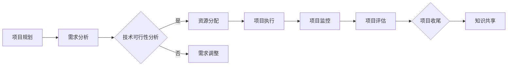
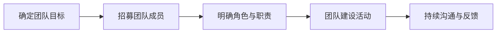
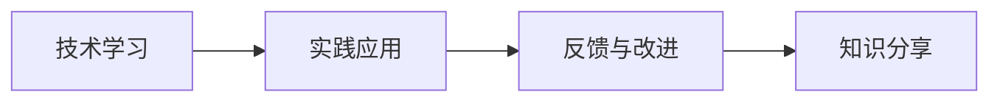
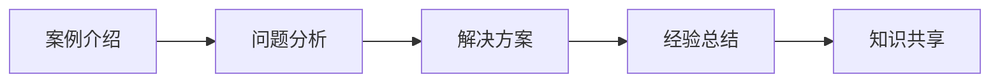

                 


### 文章标题：技术管理之道：P9工程师的领导力哲学

---

### 关键词：技术管理、领导力、P9工程师、团队建设、项目管理、决策模型、个人成长

---

### 摘要：
在信息技术飞速发展的时代，P9工程师不仅需要具备卓越的技术能力，还需要掌握先进的领导力哲学，以应对复杂多变的技术管理挑战。本文将深入探讨P9工程师在技术管理中的领导力哲学，包括团队管理、项目管理、个人成长等方面，通过案例分析，总结出一套适用于现代技术管理的高效领导力实践。

---

## 第一部分：技术管理概述

### 第1章：技术管理的基本概念

#### 1.1 技术管理的定义与作用

技术管理是指利用系统的方法、专业知识和工具，通过计划、组织、协调和控制等管理职能，对信息技术项目进行有效管理的过程。它在现代企业中扮演着至关重要的角色，不仅关系到项目的成功与否，还直接影响企业的创新能力和市场竞争力。

#### Mermaid流程图：技术管理流程



#### 伪代码：技术管理流程的伪代码实现

```python
def technical_management():
    # 项目规划
    plan_project()
    # 需求分析
    analyze_requirements()
    # 技术可行性分析
    feasibility_analysis()
    # 资源分配
    allocate_resources()
    # 项目执行
    execute_project()
    # 项目监控
    monitor_project()
    # 项目评估
    evaluate_project()
    # 项目收尾
    close_project()
    # 知识共享
    share_knowledge()
```

#### 1.2 技术管理的挑战与机遇

技术管理面临的挑战主要包括技术复杂性、资源限制、时间压力以及团队协作困难等。然而，随着云计算、大数据、人工智能等新兴技术的快速发展，技术管理也面临着前所未有的机遇。

#### LaTeX数学公式：技术管理的数学模型

$$
\text{技术管理效率} = f(\text{团队协作度}, \text{资源利用率}, \text{决策速度})
$$

#### 举例说明：技术管理中常见的挑战和机遇

**挑战：** 
在一个大型软件开发项目中，技术管理面临的挑战包括：
- 高度复杂的技术需求
- 有限的开发资源
- 项目时间紧、任务重

**机遇：**
- 通过引入敏捷开发方法，提高团队协作效率和项目交付速度
- 利用云计算和大数据技术，实现资源的灵活配置和数据的深度挖掘

### 第2章：P9工程师的领导力哲学

#### 2.1 P9工程师的角色与责任

P9工程师是企业中的高级技术专家，他们在团队中扮演着关键角色，不仅负责技术决策，还需要领导团队，推动项目成功。

#### Mermaid流程图：P9工程师的工作流程


#### 伪代码：P9工程师的决策流程伪代码

```python
def p9_engineer_role():
    # 技术决策
    make_technical_decisions()
    # 团队领导
    lead_team()
    # 项目协调
    coordinate_projects()
    # 知识分享
    share_knowledge()
    # 技术创新
    innovate_technology()
```

#### 2.2 P9工程师的领导力特质

P9工程师需要具备以下领导力特质：
- 洞察力：能够准确把握技术趋势和市场需求
- 沟通力：能够有效与团队成员、管理层以及其他部门沟通协作
- 决策力：能够快速做出高质量的技术决策

#### LaTeX数学公式：领导力的数学模型

$$
\text{领导力} = f(\text{洞察力}, \text{沟通力}, \text{决策力})
$$

#### 举例说明：领导力在技术管理中的实际应用

**场景1：** 
在一个项目遇到技术难题时，P9工程师通过深入分析问题，提出创新的解决方案，并带领团队成功克服难题。

**场景2：** 
在项目进度紧张时，P9工程师通过有效沟通，协调各部门资源，确保项目按时交付。

---

## 第二部分：领导力实践

### 第3章：团队管理与沟通

#### 3.1 团队构建

团队构建是技术管理成功的关键之一。一个高效的团队需要具备共同的愿景、互补的技能以及良好的沟通和协作。

#### Mermaid流程图：团队构建的流程



#### 伪代码：团队构建的伪代码实现

```python
def team_building():
    # 确定团队目标
    set_team_goals()
    # 招募团队成员
    recruit_members()
    # 明确角色与职责
    define_roles_and_responsibilities()
    # 团队建设活动
    conduct_team_building_activities()
    # 持续沟通与反馈
    maintain_communication_and_feedback()
```

#### 3.2 沟通技巧

沟通技巧在技术管理中至关重要。有效的沟通可以提高团队协作效率，减少误解和冲突。

#### LaTeX数学公式：沟通的有效性模型

$$
\text{沟通有效性} = f(\text{信息传递准确度}, \text{反馈及时性}, \text{沟通渠道多样性})
$$

#### 举例说明：有效的沟通实例

**场景1：** 
项目启动会上，P9工程师通过清晰、详细的讲解，确保所有团队成员对项目目标、进度和期望结果有准确的理解。

**场景2：** 
在项目执行过程中，P9工程师定期组织团队会议，收集团队成员的反馈，及时调整项目计划，确保项目按计划进行。

---

## 第三部分：领导力发展

### 第4章：个人成长与持续学习

#### 4.1 技能提升

作为P9工程师，个人技能的提升是领导力发展的重要基础。

#### Mermaid流程图：个人技能提升的路径



#### 伪代码：技能提升的伪代码实现

```python
def skill_improvement():
    # 技术学习
    learn_technical_knowledge()
    # 实践应用
    apply_knowledge_practically()
    # 反馈与改进
    get_feedback_and_improve()
    # 知识分享
    share_knowledge()
```

#### 4.2 领导力培养

领导力培养是一个持续的过程，需要通过多种方式不断提升。

#### LaTeX数学公式：领导力培养的模型

$$
\text{领导力培养} = f(\text{培训与实践}, \text{反馈与改进}, \text{角色扮演})
$$

#### 举例说明：领导力培养的实际案例

**案例1：** 
P9工程师参加领导力培训课程，学习先进的管理方法和沟通技巧。

**案例2：** 
P9工程师在项目中扮演不同的角色，从不同角度提升领导力。

---

## 第四部分：技术管理案例研究

### 第5章：技术管理案例分析

#### 5.1 案例介绍

本案例选取了一家全球领先的科技公司，该公司通过技术管理创新，成功实现了一次重大的产品升级。

#### Mermaid流程图：案例分析的基本流程


#### 伪代码：案例分析的基本流程伪代码

```python
def case_analysis():
    # 项目规划
    plan_project()
    # 需求分析
    analyze_requirements()
    # 技术可行性分析
    feasibility_analysis()
    # 资源分配
    allocate_resources()
    # 项目执行
    execute_project()
    # 项目监控
    monitor_project()
    # 项目评估
    evaluate_project()
    # 项目收尾
    close_project()
    # 知识共享
    share_knowledge()
```

#### 5.2 案例解析

在本案例中，技术管理的核心在于：
- 精准的需求分析
- 有效的资源管理
- 高效的项目执行和监控
- 优秀的项目评估和知识共享

#### LaTeX数学公式：案例分析的数学模型

$$
\text{技术管理效率} = f(\text{需求分析精度}, \text{资源利用率}, \text{项目执行效率})
$$

#### 举例说明：案例解析的具体实例

**实例1：** 
在需求分析阶段，项目团队通过深入的调研和用户访谈，准确捕捉了用户需求，为后续的项目执行奠定了基础。

**实例2：** 
在项目执行过程中，团队通过敏捷开发方法，快速迭代，确保项目按时交付。

---

## 第五部分：从案例中学习

### 第6章：经验总结

通过对案例的分析，可以总结出以下经验：

1. **精准的需求分析**：是技术管理成功的关键。
2. **有效的资源管理**：是提高项目执行效率的重要保障。
3. **高效的项目执行和监控**：是确保项目按时交付的关键环节。
4. **优秀的项目评估和知识共享**：有助于提升团队的技术能力和管理水平。

#### Mermaid流程图：从案例中学习的流程



#### 伪代码：从案例中学习的伪代码实现

```python
def learn_from_cases():
    # 案例介绍
    introduce_cases()
    # 问题分析
    analyze_problems()
    # 解决方案
    propose_solutions()
    # 经验总结
    summarize_experience()
    # 知识共享
    share_knowledge()
```

#### 6.2 趋势展望

技术管理未来的发展趋势包括：

1. **数字化转型**：越来越多的企业将数字化作为战略重点，技术管理将在数字化转型中发挥关键作用。
2. **人工智能与机器学习**：AI技术将进一步提升技术管理的智能化水平。
3. **敏捷管理**：敏捷开发方法将继续普及，提高项目执行效率。

#### LaTeX数学公式：技术管理发展趋势的模型

$$
\text{技术管理发展趋势} = f(\text{数字化转型}, \text{AI与机器学习}, \text{敏捷管理})
$$

#### 举例说明：技术管理未来的趋势预测

**预测1：** 
随着云计算和大数据技术的发展，技术管理将更加注重数据的整合和分析。

**预测2：** 
随着人工智能的深入应用，技术管理将更加智能化，自动化水平将显著提升。

---

## 附录

### 附录A：领导力工具与方法

#### A.1 工具介绍

- **领导力评估工具**：如360度反馈、领导力量表等
- **团队协作工具**：如Slack、Trello等

#### A.2 方法应用

- **目标设定法**：通过明确目标，提高团队执行力
- **SWOT分析法**：通过分析优势、劣势、机会和威胁，制定合理的战略

---

作者：AI天才研究院/AI Genius Institute & 禅与计算机程序设计艺术 /Zen And The Art of Computer Programming

---

通过以上详细的目录大纲，我们为《技术管理之道：P9工程师的领导力哲学》构建了一个完整的文章框架。接下来，我们将根据每个章节的内容，逐步填充详细的解释、算法原理、数学模型和项目实战等具体内容，确保文章的深度和实用性。最终，我们将形成一篇结构清晰、逻辑严谨、内容丰富的高质量技术博客文章。

