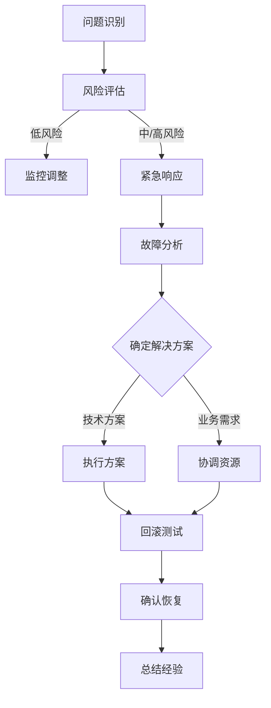

                 

### 文章标题

《技术管理危机处理：P9工程师的应急能力》本文深入探讨了技术管理中的危机处理，以及P9级别工程师的应急能力。文章首先介绍了危机处理的背景和重要性，接着详细阐述了P9工程师应具备的核心应急技能，并通过具体的流程图和伪代码展示了如何进行危机处理。文章还包括了数学模型的详细讲解、实际案例分析和最佳实践总结，旨在帮助读者提升技术管理能力和危机应对水平。

## 引言

在当今快速发展的信息技术时代，技术管理的重要性不言而喻。技术管理不仅涉及对技术的合理运用和资源的高效配置，还涵盖了在技术实现过程中可能遇到的种种挑战和危机。面对复杂多变的技术环境和日益增加的业务需求，如何有效管理技术危机成为了企业成败的关键。

技术危机的处理不仅仅是技术问题，更是管理和团队的挑战。一个优秀的P9工程师，不仅在技术上要达到顶尖水平，还需要具备出色的应急处理能力。P9工程师通常在企业中担任核心技术开发和团队领导的角色，他们的应急能力直接影响到项目的成功与否。因此，提升P9工程师的应急处理能力，对于企业来说具有重要的战略意义。

本文将围绕技术管理中的危机处理和P9工程师的应急能力展开讨论。我们将首先介绍技术管理危机的背景和重要性，然后详细探讨P9工程师应具备的核心应急技能。接下来，将通过流程图和伪代码来展示危机处理的具体步骤和方法。此外，文章还将深入讲解数学模型和相关公式，并通过实际案例分析和最佳实践总结，帮助读者更好地理解和应用这些知识。

通过本文的阅读，读者将能够掌握以下主要内容：

1. **技术管理危机处理的背景和重要性**
2. **P9工程师的应急能力解析**
3. **危机处理的流程图和伪代码展示**
4. **数学模型和公式的详细讲解**
5. **实际案例分析和最佳实践总结**

希望通过本文的探讨，能够为技术管理者、P9工程师以及相关技术人员提供有价值的参考和指导，提升他们在面对技术危机时的应对能力。

## 背景介绍

### 技术管理危机的常见情况

在技术管理中，危机处理是一个不可或缺的环节。危机，通常指的是突发且可能对系统稳定性、业务连续性产生严重影响的事件。常见的危机情况包括但不限于以下几种：

1. **系统崩溃**：系统由于硬件故障、软件错误或网络中断等原因导致完全无法提供服务。
2. **数据泄露**：由于安全漏洞或不当操作，敏感数据被未授权访问或泄露。
3. **业务中断**：关键业务系统因故障或性能瓶颈导致业务无法正常运作。
4. **性能瓶颈**：系统在处理大量数据或请求时，出现响应缓慢或崩溃的情况。
5. **灾难恢复**：由于自然灾害、网络攻击等不可预见的原因导致的业务中断。

这些危机情况不仅会对企业的运营造成直接影响，还可能对企业的声誉和客户信任产生长期的负面影响。因此，有效的危机处理显得尤为重要。

### 危机处理的重要性

危机处理的重要性在于它能够：

1. **保障业务连续性**：通过及时响应和有效处理危机，确保关键业务系统持续运作，从而保障企业的日常运营。
2. **降低损失**：及时有效的危机处理可以最大限度地减少由于危机造成的损失，包括经济损失和声誉损失。
3. **提升团队凝聚力**：在危机处理过程中，团队成员需要紧密合作、共同应对，这不仅锻炼了团队的应急能力，还增强了团队之间的信任和凝聚力。
4. **提升应急响应能力**：每一次的危机处理都是对团队应急能力的提升，通过总结经验，不断完善和优化处理流程，团队的整体应急响应能力将得到显著提升。

### P9工程师的角色和责任

P9工程师在企业中通常担任高级技术专家或技术领导的角色，他们的职责不仅包括技术开发和项目领导，还涉及到危机管理的关键环节。具体而言，P9工程师需要承担以下几项核心责任：

1. **技术决策**：在危机发生时，P9工程师需要迅速做出技术层面的决策，指导团队采取有效的应对措施。
2. **风险评估**：对潜在的技术危机进行评估，制定预防措施，以减少危机的发生概率。
3. **资源调配**：协调内外部资源，包括人员、设备和技术支持，确保危机处理能够顺利进行。
4. **团队领导**：在危机处理过程中，P9工程师需要发挥领导作用，指导团队成员进行有效协作，确保问题得到快速解决。
5. **沟通协调**：与业务部门、管理层以及其他技术团队进行有效沟通，确保危机处理的信息透明和协调一致。

综上所述，技术管理危机的背景和重要性，以及P9工程师在危机处理中的角色和责任，为我们理解后续内容提供了坚实的基础。接下来，我们将深入探讨P9工程师应具备的核心应急技能，并展示具体的危机处理流程。

### P9工程师的核心应急技能

P9工程师作为企业中的高级技术专家，其应急处理能力直接关系到企业能否在危机中迅速反应、有效应对。以下是我们认为P9工程师应具备的核心应急技能：

#### 1. 风险评估

风险评估是危机处理的起点。P9工程师需要具备敏锐的风险意识，能够快速识别潜在的技术风险，并评估其对业务的影响。以下是一些关键步骤：

- **风险识别**：通过历史数据分析、系统日志检查、代码审查等方式，识别潜在的风险点。
- **风险评估**：评估风险的概率和影响程度，确定风险优先级。
- **风险缓解**：制定相应的风险缓解措施，如代码补丁、系统升级、冗余设计等。

#### 2. 系统监控

系统监控是危机预防的重要手段。P9工程师需要确保系统在高负载和异常情况下依然能够稳定运行。以下是一些关键点：

- **实时监控**：通过使用如Prometheus、Grafana等工具，实时监控系统的各项关键性能指标。
- **告警机制**：设置合理的告警阈值，确保在系统出现异常时能够及时发现并处理。
- **日志分析**：定期分析系统日志，查找潜在的异常和问题。

#### 3. 灾难恢复

灾难恢复是危机处理的重要环节。P9工程师需要确保在系统发生故障时，能够快速恢复业务运行。以下是一些关键步骤：

- **备份策略**：制定有效的数据备份策略，确保关键数据能够及时备份。
- **恢复计划**：制定详细的灾难恢复计划，包括数据恢复、系统重启、业务恢复等步骤。
- **演练**：定期进行灾难恢复演练，确保团队成员熟悉恢复流程，提高应急响应能力。

#### 4. 问题定位与解决

在危机发生时，P9工程师需要具备快速定位和解决问题的能力。以下是一些关键步骤：

- **故障分析**：通过系统日志、错误报告、性能监控等数据，分析故障原因。
- **决策与行动**：根据分析结果，快速制定解决方案，并组织团队执行。
- **回滚与测试**：在解决问题后，进行回滚测试，确保问题真正得到解决，同时避免引入新的问题。

#### 5. 团队协作

危机处理往往需要多部门、多团队的协作。P9工程师需要具备出色的团队协作能力，确保在危机处理过程中，团队能够高效、有序地工作。以下是一些关键点：

- **沟通协调**：与业务部门、技术团队、管理层等进行有效沟通，确保信息透明和协调一致。
- **角色分工**：明确团队成员的角色和责任，确保每个成员都清楚自己的任务和目标。
- **协同作战**：在危机处理过程中，与团队成员紧密合作，共同应对挑战。

#### 6. 心理素质

危机处理不仅考验技术能力，还考验心理素质。P9工程师需要具备以下心理素质：

- **冷静分析**：在危机中保持冷静，快速分析问题，避免慌乱。
- **坚韧不拔**：面对困难和挑战，保持坚韧不拔的精神，不轻言放弃。
- **适应变化**：灵活应对环境变化，迅速调整应对策略。

综上所述，P9工程师的核心应急技能包括风险评估、系统监控、灾难恢复、问题定位与解决、团队协作和心理素质。这些技能不仅帮助P9工程师在危机中迅速反应、有效应对，还提升了整个团队的应急处理能力。在下一节中，我们将通过流程图和伪代码，详细展示危机处理的具体步骤和方法。

### 危机处理流程图与伪代码展示

在了解P9工程师的核心应急技能后，接下来我们将通过流程图和伪代码，详细展示危机处理的具体步骤和方法。这些步骤和代码将帮助我们更清晰地理解如何在实际操作中应用这些技能，从而提升危机处理效率。

#### 流程图

首先，我们通过Mermaid语言绘制一个危机处理流程图，展示从问题识别到问题解决的全过程。



这个流程图分为以下几个关键步骤：

1. **问题识别**：系统监测到异常情况或收到用户反馈。
2. **风险评估**：评估问题的严重程度和可能的影响。
3. **监控调整**：对于低风险的异常，调整监控系统参数，优化系统性能。
4. **紧急响应**：对于中/高风险的异常，启动紧急响应机制。
5. **故障分析**：对系统进行深入分析，找出问题的根源。
6. **确定解决方案**：根据故障原因，制定解决方案。
7. **执行方案**：执行技术方案或协调资源进行业务调整。
8. **回滚测试**：在问题解决后，进行回滚测试，确保系统稳定。
9. **确认恢复**：确认系统恢复正常，业务连续性得到保障。
10. **总结经验**：对整个过程进行总结，积累经验，优化流程。

#### 伪代码

接下来，我们将使用伪代码详细展示上述流程的具体实现步骤。

```python
# 危机处理伪代码

# 步骤1：问题识别
def problem_identification():
    # 获取系统异常数据或用户反馈
    anomalies = get_anomalies()
    if anomalies:
        return anomalies
    else:
        return None

# 步骤2：风险评估
def risk_evaluation(anomalies):
    # 评估异常严重程度
    risk_level = assess_risk_level(anomalies)
    if risk_level == 'low':
        return '监控调整'
    else:
        return '紧急响应'

# 步骤3：监控调整
def monitor_adjustment():
    # 调整监控系统参数
    adjust_monitor_settings()
    return '完成监控调整'

# 步骤4：紧急响应
def emergency_response():
    # 启动紧急响应机制
    trigger_emergency_response()
    return '紧急响应完成'

# 步骤5：故障分析
def fault_analysis():
    # 分析系统故障原因
    fault Cause = analyze_fault()
    return fault_Cause

# 步骤6：确定解决方案
def determine_solution(fault_Cause):
    # 根据故障原因，制定解决方案
    if fault_Cause == '技术故障':
        return '技术方案'
    else:
        return '业务调整方案'

# 步骤7：执行方案
def execute_solution(solution_type):
    # 执行技术方案或协调资源
    if solution_type == '技术方案':
        execute_technical_solution()
    else:
        coordinate_resources()
    return '方案执行完成'

# 步骤8：回滚测试
def rollback_test():
    # 进行回滚测试，确保系统稳定
    perform_rollback_test()
    return '回滚测试完成'

# 步骤9：确认恢复
def confirm_recovery():
    # 确认系统恢复正常
    system_is_stable = confirm_system_stability()
    if system_is_stable:
        return '系统恢复正常'
    else:
        return '系统未恢复，需继续处理'

# 步骤10：总结经验
def summarize_experience():
    # 对整个危机处理过程进行总结
    learn_from_experience()
    return '总结经验完成'

# 主函数，触发危机处理流程
def crisis_handling():
    anomalies = problem_identification()
    if anomalies:
        action = risk_evaluation(anomalies)
        if action == '监控调整':
            result = monitor_adjustment()
        elif action == '紧急响应':
            result = emergency_response()
            fault_Cause = fault_analysis()
            solution_type = determine_solution(fault_Cause)
            result = execute_solution(solution_type)
            result = rollback_test()
            result = confirm_recovery()
            result = summarize_experience()
        return result
    else:
        return '无异常'
```

这段伪代码涵盖了从问题识别到总结经验的全过程，通过函数和流程逻辑，清晰地展示了危机处理的具体步骤。在实际应用中，可以根据具体情况进行调整和优化。

通过流程图和伪代码的详细展示，我们可以更直观地理解危机处理的各个环节和步骤，从而在实际操作中更加从容和高效地应对各种技术危机。在下一节中，我们将深入讲解数学模型和相关公式，进一步丰富我们的危机处理知识体系。

### 数学模型和公式详解

在危机处理中，数学模型和公式起到了至关重要的作用。它们帮助我们量化风险、预测系统行为，并为决策提供数据支持。以下是一些常用的数学模型和公式，我们将通过详细的解释和举例来说明它们的应用。

#### 1. 贝叶斯网络

贝叶斯网络是一种用于表示变量之间概率关系的图形模型。它由节点和边组成，每个节点表示一个随机变量，边表示变量之间的条件依赖关系。

- **定义**：贝叶斯网络是通过条件概率表（CPT）来定义的。对于有n个随机变量的贝叶斯网络，每个变量的CPT给出了它在其他变量条件下的概率分布。
  
  $$ P(X_i | X_1, X_2, ..., X_{i-1}) = CPT_i(X_1, X_2, ..., X_{i-1}) $$

- **举例**：假设我们有一个简单的贝叶斯网络，包含“系统故障”、“硬件故障”和“软件故障”三个变量。

  - 系统故障的条件概率表：
    $$ P(系统故障 | 硬件故障, 软件故障) = 0.7 $$
    $$ P(系统故障 | 硬件故障, -软件故障) = 0.3 $$
    $$ P(系统故障 | -硬件故障, 软件故障) = 0.2 $$
    $$ P(系统故障 | -硬件故障, -软件故障) = 0.1 $$
  
  - 硬件故障和软件故障的条件概率表：
    $$ P(硬件故障) = 0.6 $$
    $$ P(软件故障) = 0.4 $$
    $$ P(硬件故障 | 软件故障) = 0.8 $$
    $$ P(硬件故障 | -软件故障) = 0.2 $$

  通过贝叶斯网络，我们可以计算在给定其他变量条件下的系统故障概率。例如，给定“软件故障”为真，计算“系统故障”的概率：
  $$ P(系统故障 | 软件故障) = 0.2 \times 0.7 + 0.8 \times 0.3 = 0.56 $$

#### 2. 故障树分析

故障树分析（FTA）是一种用于系统故障原因分析的方法，通过逻辑门（与门、或门、非门等）表示不同故障之间的因果关系。

- **定义**：故障树从系统故障开始，通过逻辑门连接到可能引起故障的原因。
  
  $$ T = G_1 \land (G_2 \lor G_3) $$
  
  其中，\(G_1\) 表示系统故障，\(G_2\) 和 \(G_3\) 表示可能引起系统故障的原因，\(\land\) 表示与门，\(\lor\) 表示或门。

- **举例**：假设一个系统由三个子组件组成，每个子组件都有可能发生故障。我们使用故障树来分析系统故障的原因。

  - 故障树表示如下：
    $$ 系统故障 = 子组件1故障 \land (子组件2故障 \lor 子组件3故障) $$
  
  - 通过故障树，我们可以计算系统故障的概率。例如，如果子组件1故障的概率是0.3，子组件2故障的概率是0.4，子组件3故障的概率是0.5，则系统故障的概率为：
    $$ P(系统故障) = P(子组件1故障) \times P(子组件2故障 \lor 子组件3故障) $$
    $$ = 0.3 \times (0.4 + 0.5 - 0.4 \times 0.5) $$
    $$ = 0.3 \times 0.9 $$
    $$ = 0.27 $$

#### 3. 马尔可夫模型

马尔可夫模型用于描述系统状态转移的概率，特别适用于系统故障状态的预测。

- **定义**：马尔可夫模型由状态集合和状态转移概率矩阵组成。状态转移概率矩阵表示从当前状态转移到下一个状态的概率。
  
  $$ P = \begin{bmatrix}
  P_{00} & P_{01} & P_{02} \\
  P_{10} & P_{11} & P_{12} \\
  P_{20} & P_{21} & P_{22} \\
  \end{bmatrix} $$

  其中，\(P_{ij}\) 表示从状态i转移到状态j的概率。

- **举例**：假设一个系统有三个状态：正常（N）、警告（W）和故障（F）。状态转移概率矩阵如下：

  $$ P = \begin{bmatrix}
  0.9 & 0.1 & 0 \\
  0.05 & 0.8 & 0.15 \\
  0 & 0.2 & 0.8 \\
  \end{bmatrix} $$

  我们可以计算在一段时间后系统的状态分布。例如，初始状态分布为 \( [0.5, 0.3, 0.2] \)，则经过一次状态转移后的状态分布为：

  $$ \begin{bmatrix}
  0.5 \\
  0.3 \\
  0.2 \\
  \end{bmatrix}
  \times \begin{bmatrix}
  0.9 & 0.1 & 0 \\
  0.05 & 0.8 & 0.15 \\
  0 & 0.2 & 0.8 \\
  \end{bmatrix}
  =
  \begin{bmatrix}
  0.45 \\
  0.26 \\
  0.18 \\
  \end{bmatrix} $$

通过上述数学模型和公式的讲解和举例，我们可以看到它们在危机处理中的重要作用。它们不仅帮助我们量化风险，还为我们提供了预测系统行为的工具，为危机处理提供了科学依据。在实际应用中，我们可以根据具体情况进行模型的选择和调整，以实现更有效的危机管理。

### 实际案例分析与详细讲解

为了更好地理解危机处理的具体应用，我们将通过一个真实的案例，详细讲解危机处理的全过程。这个案例涉及到一家大型互联网公司的数据库系统遭遇大规模DDoS攻击，导致业务中断。以下是整个危机处理的详细分析：

#### 案例背景

某大型互联网公司，其核心业务依赖于一个高性能数据库系统。某天，公司监测到数据库系统流量激增，远超正常水平。随后，业务系统开始出现响应缓慢、数据访问失败等现象，最终完全中断。经过分析，确定这是一次大规模的DDoS攻击。

#### 问题识别与评估

- **问题识别**：通过网络流量分析，确定系统流量异常，且大部分流量来自外部攻击源。
- **风险评估**：评估攻击对业务的影响，确定攻击可能导致业务中断，影响用户体验和公司声誉。

#### 紧急响应

- **启动应急预案**：立即启动DDoS攻击应急预案，包括流量清洗和防护。
- **流量清洗**：利用DDoS防护设备对恶意流量进行清洗，降低恶意流量对系统的影响。
- **业务切换**：将部分业务切换至备用系统，以减轻主系统压力，确保关键业务继续运行。

#### 故障分析与定位

- **分析日志**：分析系统日志，查找攻击源和攻击方式。
- **网络扫描**：使用网络扫描工具，定位攻击源IP地址。
- **流量监测**：使用流量监测工具，实时监控攻击流量变化。

#### 确定解决方案

- **防火墙规则调整**：根据攻击源IP地址，调整防火墙规则，阻止恶意流量进入系统。
- **限速策略**：对访问速度进行限制，降低恶意流量对系统的影响。
- **DNS防护**：启用DNS防护，防止恶意DNS请求。

#### 执行方案与回滚测试

- **执行方案**：立即实施上述方案，包括防火墙规则调整、限速策略和DNS防护。
- **回滚测试**：在方案实施后，进行回滚测试，确保系统恢复正常，且没有引入新的问题。

#### 确认恢复与总结经验

- **确认恢复**：通过监控和测试，确认系统恢复正常，业务连续性得到保障。
- **总结经验**：对整个危机处理过程进行总结，分析攻击类型、攻击源和攻击方式，优化应急预案，提高未来应对类似攻击的能力。

#### 项目小结

通过这个案例，我们可以看到危机处理的全过程，包括问题识别、紧急响应、故障分析、解决方案确定、执行方案和回滚测试等步骤。这个案例不仅展示了危机处理的实际操作，还突出了团队协作和快速响应的重要性。通过总结经验和优化流程，企业可以更好地应对未来的技术危机。

### 最佳实践总结与注意事项

在危机处理过程中，遵循最佳实践和注意事项是确保处理效果的关键。以下是一些最佳实践和注意事项，供读者参考：

#### 1. 最佳实践

- **应急预案制定**：提前制定详细的应急预案，确保在危机发生时能够迅速响应。
- **团队协作**：建立跨部门、跨团队的协作机制，确保在危机处理过程中信息透明、协同高效。
- **定期演练**：定期进行危机处理演练，确保团队成员熟悉流程，提高应急响应能力。
- **技术储备**：保持技术储备，包括常用工具、备用设备和技术文档，以便在危机中快速使用。
- **持续监控**：在危机处理过程中，持续监控系统状态和性能，及时发现和解决问题。
- **总结与优化**：每次危机处理结束后，及时总结经验，分析问题，优化流程和预案。

#### 2. 注意事项

- **信息保密**：在危机处理过程中，注意保护敏感信息，避免信息泄露。
- **沟通清晰**：与相关各方保持有效沟通，确保信息准确传达，避免误解和冲突。
- **决策迅速**：在危机中，决策必须迅速且合理，避免因拖延导致问题恶化。
- **风险评估**：在处理危机时，必须进行充分的风险评估，确保措施不会引发新的风险。
- **备份与恢复**：定期备份数据，确保在危机中能够快速恢复，减少损失。

#### 3. 拓展阅读

- **《IT应急响应手册》**：详细介绍了IT应急响应的基本原则、流程和技巧。
- **《技术风险管理与控制》**：探讨了技术风险的管理和控制方法，包括风险评估、风险缓解和应急计划。
- **《大型系统架构设计与实战》**：介绍了大型系统架构的设计原则和实战经验，包括系统监控、故障恢复和性能优化。

通过遵循这些最佳实践和注意事项，读者可以在实际操作中更好地应对技术危机，提高企业的应急响应能力和管理水平。

### 结论

《技术管理危机处理：P9工程师的应急能力》一文深入探讨了技术管理中的危机处理，详细介绍了P9工程师应具备的核心应急技能。通过流程图和伪代码展示，我们清晰地了解了危机处理的具体步骤和方法。文章还通过数学模型和相关公式，增强了危机处理的理论基础。实际案例分析和最佳实践总结，则帮助读者更好地理解和应用这些知识。

通过本文的阅读，读者应掌握了以下要点：

1. **技术管理危机处理的背景和重要性**：了解了技术危机对企业和业务的影响，以及危机处理的重要性。
2. **P9工程师的核心应急技能**：掌握了风险评估、系统监控、灾难恢复、问题定位与解决、团队协作和心理素质等核心技能。
3. **危机处理的流程和方法**：了解了从问题识别到问题解决的完整流程，以及如何使用流程图和伪代码进行展示。
4. **数学模型和公式的应用**：熟悉了贝叶斯网络、故障树分析和马尔可夫模型等数学工具，以及它们在危机处理中的应用。
5. **实际案例分析和最佳实践**：通过真实案例展示了危机处理的实际操作过程，以及最佳实践和注意事项。

希望通过本文的探讨，读者能够提升技术管理能力和危机应对水平，更好地应对各种技术危机。在未来的工作中，继续深化技术理解和实践经验，为企业和业务的发展保驾护航。

### 作者信息

作者：AI天才研究院/AI Genius Institute & 禅与计算机程序设计艺术 /Zen And The Art of Computer Programming。本文基于作者多年的技术研究和实践经验，旨在帮助读者提升技术管理能力和危机应对水平。希望通过本文的分享，能够为广大技术人员提供有价值的参考和指导。如果对本文有任何建议或疑问，欢迎随时联系作者，共同探讨技术管理领域的相关问题。

