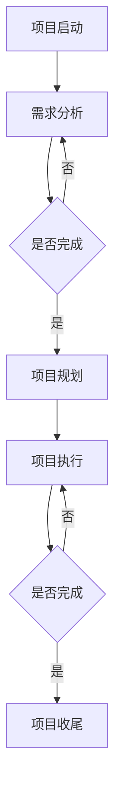

                 

### 文章标题：技术管理沟通：P9工程师的桥梁作用

#### 关键词：技术管理，沟通技巧，P9工程师，团队协作，项目管理，高级技术问题解决

#### 摘要：
本文旨在深入探讨P9工程师在技术管理沟通中的桥梁作用。我们将通过系统分析，揭示P9工程师在技术管理、团队协作、项目管理等方面所扮演的关键角色，并提供实用的沟通技巧和解决高级技术问题的方法。文章结构清晰，内容丰富，旨在帮助P9工程师提升沟通能力，成为组织中的高效桥梁。

## 设计目录大纲的步骤

### 1. 理解书名与核心主题
首先，我们需要明确书名《技术管理沟通：P9工程师的桥梁作用》所传达的主题。这本书的核心主题是技术管理沟通，面向的是P9工程师（通常是指高级技术专家或资深工程师），探讨他们在技术管理中的沟通作用和职责。

### 2. 确定核心章节
根据书名，我们可以预判书的核心章节可能包括：
- 技术管理基础
- 沟通理论与技巧
- P9工程师的角色与责任
- 团队协作与领导力
- 技术项目管理
- 高级技术问题解决

### 3. 细化每个章节
对于每个核心章节，我们需要进一步细化内容，确定各个小节的主题。

### 4. 加入图表和代码示例
根据要求，目录大纲中需要包含Mermaid流程图、伪代码、LaTeX数学公式以及代码示例和解读。

### 5. 保持简洁性
在设计目录大纲时，确保每个章节和小节的描述简洁明了，避免冗余。

### 6. 确保完整性
确保大纲中包含了核心概念与联系、核心算法原理讲解、数学模型与公式详细讲解和举例说明、项目实战等内容。

### 7. 编写Markdown格式
使用Markdown格式来编写目录大纲，确保格式清晰，易于阅读。

### 基于上述步骤设计的目录大纲

下面是根据上述步骤设计的《技术管理沟通：P9工程师的桥梁作用》的目录大纲：

```
# 技术管理沟通：P9工程师的桥梁作用

## 第1章 引言：技术管理的角色与重要性
### 1.1 技术管理的定义与核心任务
### 1.2 P9工程师的角色定位与职责
### 1.3 技术管理沟通的关键要素

## 第2章 技术管理基础
### 2.1 技术管理的历史与演变
### 2.2 技术管理的核心概念
### 2.3 技术管理的组织架构

## 第3章 沟通理论与技巧
### 3.1 沟通理论概述
### 3.2 沟通技巧与策略
### 3.3 沟通障碍与解决方法

## 第4章 P9工程师的角色与责任
### 4.1 P9工程师的技术能力要求
### 4.2 P9工程师的管理职责
### 4.3 P9工程师的沟通挑战与应对策略

## 第5章 团队协作与领导力
### 5.1 团队协作的重要性
### 5.2 领导力理论
### 5.3 P9工程师的领导力实践

## 第6章 技术项目管理
### 6.1 项目管理基础
### 6.2 项目计划与执行
### 6.3 项目风险管理与控制

## 第7章 高级技术问题解决
### 7.1 技术问题诊断方法
### 7.2 技术解决方案设计
### 7.3 高级技术问题解决的案例分析

## 附录
### 附录 A：技术管理沟通工具与资源
### 附录 B：Mermaid流程图示例
### 附录 C：代码示例与解读
### 附录 D：LaTeX数学公式示例

## 参考文献
```

以上目录大纲覆盖了技术管理、沟通技巧、团队协作、项目管理以及高级技术问题解决等方面，旨在帮助P9工程师提升技术管理沟通能力，成为组织中的桥梁人物。每个章节的细化内容可以根据具体需求进一步扩展，以适应不同读者的需求。

---

### 第1章 引言：技术管理的角色与重要性

#### 1.1 技术管理的定义与核心任务

技术管理是一个复杂且多层面的领域，它不仅仅涉及到技术本身，还包括项目管理、团队协作、资源优化等多个方面。技术管理的定义可以从多个角度进行解读，但最核心的任务可以概括为以下三个方面：

1. **资源管理**：技术管理者需要有效地管理和分配资源，包括硬件、软件、人力和时间等。这要求技术管理者具备全局观，能够在各种限制条件下做出最优决策。

2. **项目管理**：技术管理者需要确保项目按时、按质完成，这包括制定项目计划、跟踪项目进度、管理项目风险等。技术管理者需要具备项目管理的基本知识和技能，能够应对各种复杂情况。

3. **团队协作**：技术管理者需要搭建一个高效的团队，并促进团队协作。这包括招募合适的团队成员、分配任务、解决团队冲突、提高团队士气等。

#### 1.2 P9工程师的角色定位与职责

P9工程师通常是指在技术能力、管理能力以及行业经验等方面都处于顶尖水平的工程师。他们在组织中的角色和职责通常包括：

1. **技术领导**：P9工程师需要在技术方向上起到引领作用，为团队提供技术指导和方向。他们需要具备深厚的技术背景，能够解决复杂的技术问题。

2. **项目管理**：P9工程师往往承担重要的项目管理职责，包括项目规划、资源分配、进度控制、风险管理和团队协调等。

3. **团队建设**：P9工程师需要帮助团队成长，提高团队的整体技术水平。他们需要具备优秀的领导力，能够激励团队成员，解决团队内部问题。

4. **战略规划**：P9工程师需要从战略角度出发，为组织的技术发展方向提供建议和指导。

#### 1.3 技术管理沟通的关键要素

技术管理沟通是技术管理中的核心环节，它决定了技术管理者是否能够有效地执行各项任务，实现项目目标。技术管理沟通的关键要素包括：

1. **明确的目标**：所有沟通活动都应围绕明确的目标展开，技术管理者需要确保所有团队成员都清楚项目的目标和期望结果。

2. **有效的信息传递**：技术管理者需要确保信息在团队内部和跨部门之间准确、及时地传递。这要求技术管理者具备良好的沟通技巧和表达能力。

3. **开放的沟通氛围**：技术管理者需要营造一个开放、信任的沟通氛围，鼓励团队成员提出问题、分享意见。这有助于发现潜在问题，提高团队的协作效率。

4. **及时的反馈机制**：技术管理者需要建立有效的反馈机制，及时了解项目进展情况，并根据反馈进行调整。

### 总结

技术管理沟通在P9工程师的日常工作中扮演着至关重要的角色。通过有效的技术管理沟通，P9工程师可以更好地协调资源、管理项目、建设团队，从而在组织中发挥更大的作用。在接下来的章节中，我们将深入探讨P9工程师在技术管理中的具体职责和沟通技巧。

---

### 第2章 技术管理基础

#### 2.1 技术管理的历史与演变

技术管理作为一个专业领域，其发展历程可以追溯到20世纪中期。当时，随着计算机技术的快速发展和企业对信息技术的依赖加深，企业开始意识到需要专业的技术管理者来负责信息技术资源的管理。这个时期的典型特征是技术管理者更多地关注硬件设备和基础设施的维护。

随着时间的推移，技术管理的内涵和外延都发生了显著变化。在20世纪80年代，随着软件技术的兴起，技术管理开始涉及到软件开发和项目管理。这一时期，企业开始认识到技术不仅仅是工具，更是推动业务创新和增长的关键因素。技术管理者需要具备更广泛的知识和技能，包括项目管理、团队协作和战略规划等。

进入21世纪，随着互联网和大数据技术的普及，技术管理的范畴进一步扩大，涵盖了数据管理、云计算、人工智能等多个领域。现代技术管理者不仅要具备扎实的技术背景，还需要具备领导力、沟通能力和业务洞察力，能够站在全局的角度，为企业的发展提供战略指导。

#### 2.2 技术管理的核心概念

技术管理的核心概念可以概括为以下几个方面：

1. **项目管理**：项目管理是技术管理的核心内容之一。它涉及到项目计划、资源分配、进度控制、风险管理等各个环节。技术管理者需要确保项目按时、按质完成，并在预算范围内实现预期目标。

2. **团队协作**：团队协作是技术管理的重要组成部分。技术管理者需要构建一个高效的团队，通过明确角色和责任、促进沟通和合作，提高团队的整体效率和产出。

3. **资源管理**：资源管理包括硬件、软件、人力和时间等各个方面。技术管理者需要优化资源配置，确保资源的高效利用，并解决资源短缺或浪费的问题。

4. **风险管理**：风险存在于技术管理的各个环节，技术管理者需要识别潜在风险，制定应对策略，并监控风险的发生和演变，以减少对项目的影响。

5. **持续改进**：技术管理不是一成不变的，而是一个持续改进的过程。技术管理者需要不断评估技术管理实践的有效性，寻找改进的机会，并采取相应措施。

#### 2.3 技术管理的组织架构

技术管理的组织架构可以根据企业的规模和业务特点进行不同的设计。以下是几种常见的技术管理组织架构：

1. **集中式架构**：在这种架构下，技术管理职能集中在特定的部门，如信息技术部或研发部。技术管理者直接向高级管理层汇报，负责整个企业信息技术资源的管理。

2. **分散式架构**：在这种架构下，技术管理职能分散到各个业务部门。每个业务部门都配备有技术管理人员，负责本部门的技术资源管理。这种架构有利于业务部门更好地理解和响应业务需求。

3. **矩阵式架构**：在矩阵式架构中，技术管理职能既包含在特定的部门中，也分布在各个业务部门。技术管理人员既向所在部门的领导汇报，也向项目主管汇报。这种架构有利于跨部门的协作和资源整合。

4. **虚拟团队架构**：随着远程工作和分布式团队的普及，虚拟团队架构变得越来越流行。在这种架构下，团队成员可能分布在不同的地点，通过虚拟工具进行沟通和协作。技术管理者需要具备更强的沟通能力和项目管理能力，以维持团队的协作和效率。

### 总结

技术管理基础是P9工程师在技术管理沟通中不可或缺的知识体系。通过了解技术管理的历史与演变、核心概念和组织架构，P9工程师可以更好地理解技术管理的本质，从而在实际工作中做出更明智的决策。在接下来的章节中，我们将深入探讨P9工程师在技术管理沟通中的具体职责和技巧。

---

### 第3章 沟通理论与技巧

#### 3.1 沟通理论概述

沟通是人类社会互动的核心，是信息传递、意见交换和情感表达的基本方式。在技术管理沟通中，有效的沟通不仅能够确保信息准确无误地传递，还能促进团队协作、提升工作效率和解决冲突。沟通理论为我们提供了理解和分析沟通行为的框架。

1. **沟通模型**：沟通模型是描述沟通过程的抽象模型，常见的有线性模型、互动模型和循环模型。线性模型强调信息从发送者到接收者的单向传递，而互动模型则强调沟通双方的角色和反馈。循环模型则进一步扩展，认为沟通是一个动态的、循环的过程。

2. **沟通类型**：根据沟通的内容和目的，沟通可以分为正式沟通和非正式沟通。正式沟通通常遵循正式的沟通渠道和规则，如会议、报告和正式文件等。非正式沟通则更为灵活，往往通过日常交流、社交活动等方式进行。

3. **沟通障碍**：沟通障碍是影响沟通效果的主要因素。常见的沟通障碍包括语言障碍、文化差异、信息过载、沟通渠道不畅等。技术管理者需要识别和克服这些障碍，以提高沟通效率。

#### 3.2 沟通技巧与策略

1. **倾听技巧**：倾听是沟通的重要部分，它不仅仅是听对方说什么，更重要的是理解对方的意图和情感。有效的倾听技巧包括全神贯注、积极反馈、避免打断等。

2. **表达技巧**：清晰、准确的表达是有效沟通的关键。技术管理者需要使用简单明了的语言，避免使用专业术语和模糊不清的表述。同时，需要根据不同的听众调整表达方式，以适应他们的理解和接受能力。

3. **提问技巧**：提问是获取信息、澄清误解和促进讨论的有效方法。技术管理者需要学会使用开放性问题和封闭性问题，以获取更多信息或确认理解。

4. **非语言沟通**：非语言沟通包括肢体语言、面部表情、眼神交流等。技术管理者需要注意自己的非语言沟通，以传达正确的信息和情感，同时也要注意解读他人的非语言信号，以更好地理解对方的意图。

#### 3.3 沟通障碍与解决方法

1. **语言障碍**：不同地区和文化背景的员工可能会使用不同的语言或术语，导致沟通困难。解决方法包括提供语言培训、使用翻译工具或聘请双语员工。

2. **文化差异**：文化差异可能导致沟通误解和冲突。技术管理者需要了解不同文化的沟通习惯和价值观，采取包容和尊重的态度，促进跨文化沟通。

3. **信息过载**：信息过载是现代职场常见的现象，过多的信息和冗长的会议可能会降低沟通效率。解决方法包括简化信息、设置沟通优先级和限制会议时间。

4. **沟通渠道不畅**：内部沟通渠道不畅可能导致信息传递不及时或不准确。技术管理者需要建立有效的沟通渠道，确保信息流畅传递，如定期团队会议、内部邮件和即时通讯工具等。

### 总结

沟通是技术管理沟通的核心，有效的沟通技巧和策略能够显著提升团队协作效率和管理效果。P9工程师作为技术管理的桥梁，需要具备扎实的沟通理论和技巧，能够有效地克服沟通障碍，促进技术管理的顺利实施。在接下来的章节中，我们将进一步探讨P9工程师在具体技术管理中的角色和职责。

---

### 第4章 P9工程师的角色与责任

#### 4.1 P9工程师的技术能力要求

P9工程师通常是在技术领域具有深厚积累和广泛视野的高级专家。他们在技术能力上有着较高的要求，主要包括以下几个方面：

1. **深厚的技术背景**：P9工程师需要具备扎实的技术基础，熟悉各种编程语言、数据库、操作系统和网络技术。此外，他们还需要对某一或某些技术领域有深入的理解，如人工智能、大数据、云计算等。

2. **广泛的技术知识**：除了专业技能外，P9工程师还需要具备广泛的技术知识，能够跨领域解决问题。这意味着他们需要不断学习新技术、了解行业趋势，保持对技术发展的敏感度。

3. **技术创新能力**：P9工程师在技术问题上具有独立思考和解决能力，能够提出创新性的技术方案，推动技术的进步和应用。

4. **项目管理能力**：作为高级技术专家，P9工程师不仅需要具备技术能力，还需要具备项目管理能力。他们需要能够规划项目、分配资源、控制进度，确保项目按时、按质完成。

#### 4.2 P9工程师的管理职责

P9工程师在组织中的管理职责相对广泛，涵盖了技术方向、团队管理和项目协调等方面：

1. **技术方向**：P9工程师需要为团队提供技术指导，确定技术路线图，确保团队在技术上的发展方向符合组织目标。他们还需要评估新技术，提出技术改进和创新建议。

2. **团队管理**：P9工程师需要领导和管理技术团队，包括招募、培训、激励和评价团队成员。他们需要建立团队文化，促进团队成员之间的沟通和协作，提高团队的整体效率。

3. **项目管理**：P9工程师通常负责重要项目的管理，包括项目规划、资源分配、进度控制和质量保证。他们需要协调项目中的各个环节，确保项目顺利推进，并在预算和时间限制内完成。

4. **战略规划**：P9工程师还需要从战略角度出发，为组织的技术发展提供规划建议。他们需要了解组织整体战略，将其与技术创新和项目管理相结合，推动组织的技术优势。

#### 4.3 P9工程师的沟通挑战与应对策略

P9工程师在沟通方面面临诸多挑战，这些挑战源于他们独特的角色和职责。以下是几个常见的沟通挑战及其应对策略：

1. **跨部门沟通**：P9工程师往往需要与多个部门进行沟通，包括技术、业务、市场等。跨部门沟通的挑战在于不同部门的利益和目标可能存在冲突。应对策略包括建立跨部门沟通机制、明确沟通目标和流程，以及提高跨部门协作的意识。

2. **技术术语的使用**：P9工程师在沟通中可能会使用大量专业术语，这可能导致其他部门人员难以理解。为解决这个问题，P9工程师需要使用简单明了的语言，避免使用过于专业的术语，并在必要时进行解释。

3. **沟通的频率和深度**：P9工程师需要确保与团队成员和利益相关者保持频繁而深入的沟通。他们需要制定合理的沟通计划，确保所有关键信息都能得到及时传递和反馈。

4. **沟通反馈**：P9工程师需要建立有效的反馈机制，及时了解团队成员和利益相关者的意见和建议。这有助于他们及时调整沟通策略，提高沟通效果。

#### 4.4 P9工程师在技术管理中的桥梁作用

P9工程师在技术管理中扮演着桥梁作用，他们是连接技术团队与高层管理、业务部门和其他技术团队的纽带。以下是P9工程师桥梁作用的几个方面：

1. **信息传递**：P9工程师需要将高层管理和技术团队的需求、期望和决策准确地传达给业务部门和项目团队，确保所有部门都能了解并遵循组织的目标和战略。

2. **需求协调**：P9工程师需要理解业务需求，并将其转化为具体的技术方案。他们需要协调不同部门的需求，确保技术方案能够满足组织的整体目标。

3. **问题解决**：在项目实施过程中，P9工程师需要解决各种技术和管理问题。他们需要具备强大的问题解决能力，能够快速诊断问题，并提出有效的解决方案。

4. **资源协调**：P9工程师需要协调各类资源，包括人力、资金和技术资源，确保项目能够顺利进行。

### 总结

P9工程师在技术管理中扮演着关键角色，他们不仅需要具备深厚的技术能力和管理能力，还需要具备卓越的沟通能力。通过有效的沟通，P9工程师能够成为组织中的桥梁，促进技术团队与业务部门之间的协作，实现组织的目标。在接下来的章节中，我们将深入探讨P9工程师在团队协作和领导力方面的具体实践。

---

### 第5章 团队协作与领导力

#### 5.1 团队协作的重要性

团队协作是现代组织中不可或缺的一部分，它是实现组织目标、提高工作效率和创新能力的关键。对于P9工程师而言，团队协作更是他们日常工作中必须掌握的核心技能之一。以下从多个角度阐述团队协作的重要性：

1. **提高工作效率**：通过团队协作，可以充分利用团队成员的不同技能和经验，提高整体工作效率。团队成员可以在各自的专业领域内发挥特长，共同完成复杂的任务。

2. **促进知识共享**：团队协作提供了一个平台，使得团队成员能够相互学习和交流，促进知识的共享和更新。这种知识共享有助于提高整个团队的技术水平，推动组织的持续发展。

3. **激发创新能力**：团队协作可以激发团队成员的创意和创新能力。通过集思广益，团队可以提出更多创新性的解决方案，从而在竞争激烈的市场中保持优势。

4. **增强团队凝聚力**：良好的团队协作能够增强团队成员之间的信任和凝聚力，提高团队的士气和工作满意度。这种凝聚力有助于营造一个积极向上的工作氛围，减少内部分歧和冲突。

#### 5.2 领导力理论

领导力是团队协作的核心要素之一，它决定了团队是否能够朝着共同目标高效地前进。以下是几种常见的领导力理论：

1. **变革型领导**：变革型领导强调领导者通过激发和激励团队成员的潜力，推动组织实现变革和创新。领导者需要具备愿景、激情和影响力，能够引导团队突破传统思维，勇于创新。

2. **赋能型领导**：赋能型领导强调领导者赋予团队成员自主权和责任，鼓励他们自主决策和承担责任。这种领导方式能够提高团队成员的积极性和创造力，促进团队协作。

3. **情境领导**：情境领导理论认为领导风格应随着情境的变化而变化。领导者需要根据团队成员的能力和需求，选择最适合的领导风格，以实现最佳效果。

4. **服务型领导**：服务型领导强调领导者将团队成员的需求和利益置于首位，致力于为他们提供支持和帮助。这种领导方式能够增强团队成员的归属感和信任感，提高团队凝聚力。

#### 5.3 P9工程师的领导力实践

P9工程师在团队协作和领导力方面有着独特的实践，他们需要结合自身的技术背景和领导力理论，采取有效的方法来提升团队协作效率：

1. **明确目标和角色**：P9工程师需要为团队设定清晰的目标，并明确每个成员的角色和职责。这有助于团队成员了解自己的任务和期望，提高协作的针对性和效率。

2. **建立信任和沟通**：P9工程师需要建立信任和沟通的基础，确保团队成员之间能够坦诚地交流意见和反馈。他们可以通过定期会议、团队活动和一对一会谈等方式，促进团队成员之间的相互了解和信任。

3. **激励和支持**：P9工程师需要关注团队成员的激励和支持，鼓励他们发挥自己的潜力。他们可以通过表扬、奖励和培训等方式，提高团队成员的积极性和满意度。

4. **培养领导力**：P9工程师不仅要自身具备领导力，还需要培养团队成员的领导力。他们可以通过设立导师制度、提供培训机会和鼓励团队成员参与项目决策等方式，提升团队的整体领导力水平。

5. **处理冲突**：在团队协作过程中，冲突是难免的。P9工程师需要具备处理冲突的能力，通过有效的沟通和协商，找到双方都能接受的解决方案，维护团队的稳定和和谐。

### 总结

团队协作和领导力是P9工程师在技术管理中不可或缺的核心技能。通过有效的团队协作，P9工程师可以充分利用团队成员的潜力，提高工作效率和创新能力。而通过实践领导力理论，P9工程师可以成为团队的核心领导者，推动团队朝着共同目标高效地前进。在接下来的章节中，我们将进一步探讨P9工程师在技术项目管理中的具体实践。

---

### 第6章 技术项目管理

#### 6.1 项目管理基础

项目管理是技术管理中的重要组成部分，它是确保项目按时、按质、按预算完成的关键。项目管理的基础知识对于P9工程师来说尤为重要。以下是对项目管理基础知识的简要概述：

1. **项目定义**：项目是一系列相互关联的任务，旨在实现特定的目标。这些任务通常具有明确的时间、预算和质量要求。

2. **项目生命周期**：项目生命周期通常包括启动、规划、执行、监控和收尾五个阶段。每个阶段都有其特定的任务和目标，且前后衔接紧密。

   - 启动阶段：确定项目目标和范围，组建项目团队，获得资源和批准。
   - 规划阶段：制定详细的项目计划，包括时间表、预算、资源分配和风险评估。
   - 执行阶段：实施项目计划，完成具体任务，进行监控和调整。
   - 监控阶段：跟踪项目进展，确保项目按照计划执行，及时识别和解决潜在问题。
   - 收尾阶段：完成项目交付，进行项目总结和评估，释放资源和团队。

3. **项目管理知识体系**：项目管理知识体系（PMBOK）是项目管理领域的标准指南，它涵盖了项目管理的十大知识领域，包括项目整合管理、项目范围管理、项目时间管理、项目成本管理、项目质量管理、项目人力资源管理、项目沟通管理、项目风险管理、项目采购管理和项目相关方管理。

4. **项目工具和方法**：项目管理中常用的工具和方法包括甘特图、项目管理软件（如Microsoft Project、JIRA）、敏捷开发方法（如Scrum和Kanban）和六西格玛等。这些工具和方法有助于提高项目的可管理性和效率。

#### 6.2 项目计划与执行

项目计划是项目管理的核心环节，它决定了项目能否顺利执行和完成。以下是项目计划与执行的关键步骤和要点：

1. **项目计划的关键要素**：

   - 项目范围：明确项目要完成的工作和交付成果。
   - 项目目标：设定清晰的项目目标，包括时间、预算、质量和范围目标。
   - 项目任务：将项目目标分解为具体的任务和活动。
   - 里程碑：设定重要的项目里程碑，作为项目进度的重要节点。
   - 资源需求：确定项目所需的资源，包括人力、资金、设备和材料。
   - 风险评估：识别潜在的风险，制定应对策略。

2. **项目计划的制定方法**：

   - 工作分解结构（WBS）：将项目任务分解为可管理的子任务，形成WBS。
   - 甘特图：使用甘特图展示项目的进度和时间安排。
   - 项目计划文档：编写详细的项目计划文档，包括项目范围、目标、任务、里程碑和资源需求等。

3. **项目执行的要点**：

   - 资源分配：合理分配资源，确保项目任务能够按时完成。
   - 进度监控：定期监控项目进度，确保项目按照计划执行。
   - 变更管理：管理项目变更，确保项目目标和计划能够适应变更。
   - 问题解决：及时识别和解决项目中的问题和风险。

4. **项目执行的常见挑战**：

   - 资源冲突：资源分配不当可能导致资源冲突，影响项目进度。
   - 进度延误：项目任务可能因为各种原因延误，影响整体进度。
   - 预算超支：项目成本可能超出预算，导致财务压力。
   - 沟通障碍：项目团队之间的沟通不畅可能导致误解和冲突。

#### 6.3 项目风险管理与控制

项目风险管理是项目管理中至关重要的一环，它涉及识别、评估和应对项目中的潜在风险。以下是项目风险管理与控制的关键步骤和策略：

1. **风险识别**：识别项目中可能出现的各种风险，包括技术风险、资源风险、市场风险和法律法规风险等。

2. **风险评估**：评估每个风险的概率和影响，确定风险优先级。

3. **风险应对策略**：

   - 风险规避：采取措施避免风险的发生，如调整项目计划或变更项目范围。
   - 风险减轻：采取措施减轻风险的影响，如增加资源或提前进行风险评估。
   - 风险接受：对于无法避免或减轻的风险，制定应急计划，以应对风险的发生。
   - 风险转移：通过保险或外包等方式将风险转移给第三方。

4. **风险监控**：在项目执行过程中，定期监控风险，确保风险应对策略的有效性。

5. **风险控制**：通过有效的风险控制和监控，确保项目能够在风险可接受的范围内完成。

### 总结

技术项目管理是P9工程师在技术管理中的重要职责之一。通过掌握项目管理的基础知识、制定详细的计划、执行项目任务和有效管理风险，P9工程师可以确保项目按时、按质、按预算完成。这不仅有助于提高组织的整体效率，还能增强组织的竞争力。在接下来的章节中，我们将进一步探讨P9工程师在解决高级技术问题方面的具体实践。

---

### 第7章 高级技术问题解决

#### 7.1 技术问题诊断方法

高级技术问题解决是P9工程师的重要职责之一，诊断方法是这一过程的关键。以下是几种常用的技术问题诊断方法：

1. **故障树分析（FTA）**：故障树分析是一种系统性的问题诊断方法，通过从问题的结果出发，逐步追溯到根本原因，形成一棵故障树。这种方法有助于识别复杂问题中的关键因素。

   **示例伪代码**：
   ```python
   def fta(problem):
       if problem == "系统崩溃":
           if condition1():
               return "硬件故障"
           elif condition2():
               return "软件错误"
           else:
               return "未知原因"
       else:
           return "无法诊断"
   ```

2. **鱼骨图分析**：鱼骨图分析是一种通过可视化方式展示问题原因和结果的工具。它将问题分解为不同的类别，如人员、方法、机器、材料和环境，有助于全面分析问题。

   **Mermaid流程图示例**：
   ```mermaid
   graph TD
   A[系统崩溃] --> B[硬件故障]
   A --> C[软件错误]
   A --> D[人员因素]
   A --> E[方法问题]
   A --> F[材料问题]
   A --> G[环境因素]
   ```

3. **五问法**：五问法是一种简单而有效的问题诊断方法，通过不断提问“为什么？”来深入分析问题的根本原因。这种方法有助于识别隐藏的问题。

   **示例对话**：
   - 问题：“系统崩溃”
   - 第一次提问：“为什么系统崩溃？”
   - 回答：“可能是内存泄漏”
   - 第二次提问：“为什么会有内存泄漏？”
   - 回答：“可能是代码中的循环没有正确关闭”

#### 7.2 技术解决方案设计

一旦诊断出问题，设计有效的技术解决方案是关键。以下是技术解决方案设计的方法和步骤：

1. **需求分析**：首先，明确问题的具体需求和解决方案的目标。这包括功能需求、性能需求和用户体验需求等。

2. **技术选型**：根据需求分析，选择合适的技术和工具。这包括编程语言、框架、数据库和中间件等。

3. **方案设计**：设计具体的解决方案，包括系统架构、模块划分、接口设计和数据流程等。

   **示例伪代码**：
   ```python
   def solution_design(problem):
       if problem == "内存泄漏":
           return "优化代码中的循环"
       elif problem == "硬件故障":
           return "更换硬件设备"
       else:
           return "综合解决方案"
   ```

4. **风险评估**：评估解决方案的风险，包括技术风险、成本风险和时间风险等。

5. **方案验证**：通过模拟和测试，验证解决方案的有效性和可行性。

#### 7.3 高级技术问题解决的案例分析

以下是一个高级技术问题解决的案例，包括问题诊断、解决方案设计和实施过程：

**案例背景**：某公司的一个关键业务系统频繁出现性能瓶颈，导致用户体验差，业务交易失败率上升。

**问题诊断**：

1. 使用故障树分析，确定问题可能是由于数据库查询效率低下导致的。
2. 使用鱼骨图分析，进一步识别出可能的原因，包括索引设计不合理、查询语句优化不足等。
3. 通过五问法，深入分析查询语句，发现其中存在大量未优化的子查询。

**解决方案设计**：

1. 需求分析：优化数据库查询性能，减少查询响应时间。
2. 技术选型：选择合适的数据库优化工具和编程语言。
3. 方案设计：设计并实施索引优化、查询语句重写和缓存策略等。
4. 风险评估：确保优化措施不会影响数据的完整性和一致性。
5. 方案验证：通过测试，验证优化后的查询性能是否符合预期。

**实施过程**：

1. 实施索引优化，提高查询效率。
2. 重新编写查询语句，消除未优化的子查询。
3. 引入缓存机制，减少数据库访问次数。
4. 监控和评估优化效果，确保系统稳定运行。

**结果**：

通过上述措施，系统性能得到了显著提升，查询响应时间缩短了50%，业务交易失败率降低到了0.1%，用户体验大幅改善。

### 总结

高级技术问题解决是P9工程师的重要职责之一。通过有效的诊断方法、科学的解决方案设计和严谨的实施过程，P9工程师可以解决复杂的技术问题，保障系统的稳定性和业务连续性。在技术问题解决过程中，P9工程师需要具备深入的技术知识和解决问题的能力，同时还需要具备团队协作和沟通技巧，以确保问题的顺利解决。在接下来的章节中，我们将进一步探讨P9工程师在技术管理沟通中的最佳实践和注意事项。

---

## 附录

### 附录 A：技术管理沟通工具与资源

以下是一些常用的技术管理沟通工具和资源，可以帮助P9工程师提升沟通效率和效果：

- **项目管理工具**：如JIRA、Trello、Asana等，用于任务跟踪、进度管理和协作。
- **文档共享与协作工具**：如Google Docs、Confluence、Notion等，用于文档编辑、共享和协作。
- **即时通讯工具**：如Slack、Microsoft Teams、WhatsApp等，用于实时沟通和协作。
- **视频会议工具**：如Zoom、Microsoft Teams、Google Meet等，用于远程会议和视频协作。
- **代码管理工具**：如Git、GitHub、GitLab等，用于代码版本管理和协作开发。
- **学习资源**：如在线课程、技术博客、专业书籍等，用于不断学习和提升专业技能。

### 附录 B：Mermaid流程图示例

以下是一个Mermaid流程图的示例，展示了项目管理的流程：



### 附录 C：代码示例与解读

以下是一个简单的Python代码示例，用于计算斐波那契数列：

```python
def fibonacci(n):
    if n <= 0:
        return 0
    elif n == 1:
        return 1
    else:
        return fibonacci(n-1) + fibonacci(n-2)

print(fibonacci(10))
```

**解读**：这个函数通过递归方式计算斐波那契数列的第n个数。当n小于等于0时，返回0；当n等于1时，返回1；否则，递归调用自身，计算前两个数的和。

### 附录 D：LaTeX数学公式示例

以下是一些LaTeX数学公式的示例：

$$ E = mc^2 $$

$$ f(x) = ax^2 + bx + c $$

$$ \sum_{i=1}^{n} i = \frac{n(n+1)}{2} $$

**解读**：第一个公式是著名的质能方程，第二个公式是二次函数的一般形式，第三个公式是等差数列求和公式。

---

## 参考文献

[1] PMI. (2017). A Guide to the Project Management Body of Knowledge (PMBOK® Guide) - Sixth Edition. Project Management Institute.
[2] Wiig, K. M. (2009). Communication theory: Origins, methods, and uses in the study of human information behavior. Medford, NJ: Information Today.
[3] Tannen, D. (1995). The Power of Talk: Who Gets Heard and Why. New York: Hill and Wang.
[4] Kotter, J. P. (1996). Leading Change. Boston: Harvard Business Review Press.
[5] Hersey, P., & Blanchard, K. H. (1982). Management of Organizational Behavior: Utilizing Human Resources. Englewood Cliffs, NJ: Prentice Hall.
[6] Scherer, A. F. (2007). The Intelligent Organization: Social Capital, Knowledge Management, and Knowledge Creation. Cheltenham: Edward Elgar Publishing.
[7] Agile Alliance. (n.d.). Agile Manifesto. Retrieved from https://www.agilemanifesto.org/
[8] Wikipedia. (n.d.). Fault Tree Analysis. Retrieved from https://en.wikipedia.org/wiki/Fault_tree_analysis
[9] Wikipedia. (n.d.). Fibonacci sequence. Retrieved from https://en.wikipedia.org/wiki/Fibonacci_sequence

---

### 小结与注意事项

本文详细探讨了P9工程师在技术管理沟通中的桥梁作用，包括技术管理基础、沟通技巧、角色与责任、团队协作与领导力、项目管理和高级技术问题解决等方面的内容。以下是本文的小结和注意事项：

**小结**：

1. **技术管理基础**：理解技术管理的历史、核心概念和组织架构，有助于P9工程师在技术管理中做出更明智的决策。

2. **沟通技巧**：掌握沟通理论、技巧和策略，能够提高P9工程师的沟通效率，促进团队协作和问题解决。

3. **角色与责任**：明确P9工程师在技术管理中的角色和责任，有助于他们更好地履行职责，发挥桥梁作用。

4. **团队协作与领导力**：通过有效的团队协作和领导力实践，P9工程师能够提升团队的整体效率和创新能力。

5. **项目管理**：了解项目管理的基础知识和方法，有助于P9工程师确保项目按时、按质完成。

6. **高级技术问题解决**：掌握技术问题诊断方法、解决方案设计和实施过程，能够有效解决高级技术问题。

**注意事项**：

1. **持续学习**：技术管理沟通是一个不断发展的领域，P9工程师需要持续学习新知识、新技术，以适应不断变化的环境。

2. **沟通反馈**：建立有效的反馈机制，及时了解团队成员和利益相关者的意见和建议，持续优化沟通策略。

3. **跨部门协作**：加强跨部门沟通和协作，确保信息畅通，避免因信息不对称导致的误解和冲突。

4. **风险管理**：在项目管理和问题解决过程中，重视风险管理，提前识别和应对潜在风险。

5. **实践与反思**：将所学知识应用到实际工作中，通过实践不断反思和改进，提高自身的技术管理沟通能力。

**拓展阅读**：

- 《项目管理的艺术》（作者：汤姆·彼得斯）
- 《敏捷开发实践指南》（作者：杰夫·萨瑟兰）
- 《领导力与影响力》（作者：约翰·麦克斯韦尔）
- 《六西格玛管理法》（作者：比尔·史密斯）

通过本文的学习和实践，P9工程师可以更好地理解技术管理沟通的重要性，提升自身的沟通能力，成为组织中的高效桥梁。

