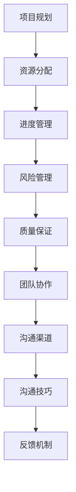

                 

### 引言

**1.1 书籍目的**

《技术管理沟通：P9工程师的软实力》旨在帮助那些处于高级技术岗位，特别是P9工程师级别的专业人士，提升他们在技术管理沟通方面的能力。随着技术的发展和项目管理复杂性的增加，高级工程师不仅需要卓越的技术能力，还需要具备出色的管理沟通技巧，以更好地协调团队、推进项目、解决技术难题。本书将为这些专业人士提供一个系统化的指南，帮助他们理解技术管理的基本概念，掌握高效沟通的技巧，并培养软实力，从而在职业发展中取得更大的成功。

**1.1.1 目标读者群体**

本书的目标读者群体主要包括以下几类专业人士：

1. **P9级别的高级工程师**：这些工程师在技术领域有着深厚的积累和丰富的经验，但他们在面对管理职责时，常常感到力不从心，需要提升管理沟通能力。
2. **项目经理**：项目经理在技术背景和项目管理技能之间寻求平衡，通过学习本书，可以更好地理解技术背景，提升沟通效率。
3. **技术主管**：技术主管负责团队的技术方向和项目管理，他们需要掌握高级工程师的技能，同时具备管理沟通的技巧，以推动团队发展。
4. **技术创业者**：技术创业者需要同时扮演多个角色，从技术实现到团队管理，本书将为他们提供宝贵的经验。

**1.1.2 技术管理与沟通的重要性**

在当今快速发展的技术环境中，技术管理与沟通显得尤为重要。技术管理不仅涉及技术决策、资源分配、项目管理等方面，还涉及到与团队成员、管理层和其他部门的沟通。以下是技术管理与沟通的重要性：

1. **提高工作效率**：有效的技术管理沟通可以确保团队成员了解项目的目标、进度和要求，减少误解和重复工作，提高整体工作效率。
2. **优化项目结果**：良好的沟通能够确保项目在正确的方向上推进，避免由于信息不对称或沟通不畅导致的偏差和错误。
3. **团队协作**：技术管理沟通能够促进团队成员之间的协作和信任，增强团队的凝聚力，提高项目的成功率。
4. **降低风险**：通过有效的沟通，技术管理者可以及时发现潜在的问题和风险，并采取相应的措施进行预防或缓解。

**1.1.3 书籍的结构安排**

本书结构合理，分为五个主要部分：

- **第一部分：核心概念与联系**：介绍技术管理的基本概念和沟通模型，帮助读者建立整体框架。
- **第二部分：技术管理实战**：深入探讨高级工程师如何进行技术管理，包括项目管理、技术决策、技术领导力等方面。
- **第三部分：沟通技巧提升**：具体介绍如何提高技术沟通的效率和质量，包括语言表达、听力技巧、案例分析等。
- **第四部分：软技能培养**：介绍如何培养和提高软实力，包括自我认知、时间管理、解决问题能力等。
- **第五部分：实践指南**：提供实用的沟通和管理技巧，并通过实际案例进行分析和解读。

通过以上结构，本书旨在帮助高级工程师全面提升技术管理沟通能力，成为更出色的技术管理者。### 技术管理框架与沟通模型

在探讨技术管理沟通之前，了解技术管理框架和沟通模型是至关重要的。这两个框架不仅为技术管理者提供了行动的指南，也确保了团队中的信息流通和协作效率。

**2.1 技术管理框架**

技术管理框架是管理技术项目的基础，它涵盖了从项目规划到实施和监控的各个阶段。以下是一些核心概念：

1. **项目规划**：项目规划是技术管理的第一步，它涉及定义项目的范围、目标和时间表。通过制定详细的项目计划，技术管理者可以明确项目的方向和资源需求。

2. **资源分配**：资源分配是指将合适的人力、技术和资金分配到项目的各个阶段。技术管理者需要确保资源的合理利用，避免资源浪费和过度依赖。

3. **进度管理**：进度管理是跟踪项目进度、确保项目按时完成的关键环节。通过设立里程碑和关键任务，技术管理者可以及时调整计划，确保项目按计划推进。

4. **风险管理**：风险管理是识别、评估和应对项目潜在风险的过程。技术管理者需要制定相应的风险应对策略，确保项目在出现问题时能够快速响应。

5. **质量保证**：质量保证是确保项目输出满足既定标准和用户需求的过程。技术管理者需要建立质量保证机制，进行定期检查和测试，确保项目的可靠性和稳定性。

6. **团队协作**：团队协作是技术管理的重要组成部分。技术管理者需要营造良好的团队氛围，促进团队成员之间的沟通和合作，确保项目的顺利实施。

**2.2 沟通模型**

沟通模型是理解和分析沟通过程的基本工具，它包括了沟通的各个环节。以下是几个关键的沟通模型：

1. **沟通障碍**：沟通障碍是阻碍有效沟通的各种因素，包括语言障碍、文化差异、信息过载等。技术管理者需要识别和克服这些障碍，确保信息的准确传递。

2. **沟通渠道**：沟通渠道是指信息传递的路径，包括正式渠道（如会议、邮件）和非正式渠道（如社交互动、团队讨论）。技术管理者需要选择合适的沟通渠道，以满足不同沟通需求。

3. **沟通技巧**：沟通技巧包括语言表达能力、倾听技巧、反馈技巧等。技术管理者需要不断提升这些技巧，以实现更高效的沟通。

4. **反馈机制**：反馈机制是确保沟通双向流通的重要手段。技术管理者需要建立有效的反馈机制，鼓励团队成员提供意见和建议，并据此进行调整和改进。

**2.3 技术管理沟通的Mermaid流程图**

为了更直观地展示技术管理沟通的过程，我们可以使用Mermaid流程图来描述。以下是一个简化的技术管理沟通流程示例：



**解释流程图：**

- **项目规划**：这是技术管理的起点，明确项目的目标和时间表。
- **资源分配**：确定项目所需的资源和分配策略。
- **进度管理**：监控项目进度，确保按时完成。
- **风险管理**：识别和应对项目中的潜在风险。
- **质量保证**：确保项目输出符合标准和用户需求。
- **团队协作**：促进团队成员之间的合作和沟通。
- **沟通渠道**：选择合适的沟通方式。
- **沟通技巧**：提升沟通效率和质量。
- **反馈机制**：确保沟通的双向流通，收集和利用反馈信息。

通过这个流程图，我们可以清晰地看到技术管理沟通的各个环节及其相互关系。这个流程图不仅帮助技术管理者理解整体框架，也为实际操作提供了指导。

**总结**

技术管理框架和沟通模型为技术管理者提供了一个系统化的管理工具，确保项目能够顺利推进。理解这些框架和模型，掌握有效的沟通技巧，是高级工程师在技术管理道路上成功的关键。在接下来的章节中，我们将深入探讨技术管理实战、沟通技巧提升以及软技能培养，帮助读者全面提升技术管理沟通能力。### 技术管理实战

在技术管理中，高级工程师（P9级别）面临着一系列独特的职责和挑战。他们不仅需要具备深厚的技术背景，还需要承担起管理和领导责任。以下是P9工程师在技术管理方面的一些关键职责和实际操作技巧。

**3.1 项目管理**

项目管理是P9工程师日常工作中最为重要的一部分。一个成功的项目不仅需要明确的目标和计划，还需要合理的资源分配、有效的进度控制和风险管理。

- **项目规划与进度管理**：项目规划是项目管理的第一步，P9工程师需要明确项目的目标、范围、时间表和里程碑。制定详细的进度计划，确保每个阶段都能按时完成。使用项目管理工具（如JIRA、Trello）来跟踪任务进度和资源利用率。

  ```mermaid
  graph TD
      A[项目启动] --> B[需求分析]
      B --> C[设计阶段]
      C --> D[开发阶段]
      D --> E[测试阶段]
      E --> F[部署与维护]
  ```

- **资源分配与团队协作**：P9工程师需要合理分配团队资源，确保每个人都能发挥最大价值。建立有效的沟通渠道，促进团队成员之间的协作和反馈。

  ```mermaid
  graph TD
      A[资源分配] --> B[任务分配]
      B --> C[团队协作]
      C --> D[沟通与反馈]
  ```

- **风险管理**：识别项目中的潜在风险，并制定相应的应对策略。定期进行风险评估，确保项目能够在遇到问题时迅速响应。

  ```mermaid
  graph TD
      A[风险识别] --> B[风险评估]
      B --> C[风险应对]
  ```

**3.2 技术决策与策略制定**

P9工程师在技术决策和策略制定中扮演着关键角色。他们需要评估不同技术的可行性和优缺点，选择最适合项目需求的技术方案。

- **技术评估与选择**：P9工程师需要对各种技术进行评估，包括它们的性能、可靠性、成本和社区支持等。选择最合适的技术，可以最大化项目的成功概率。

  ```mermaid
  graph TD
      A[技术评估] --> B[性能评估]
      B --> C[可靠性评估]
      C --> D[成本评估]
      D --> E[社区支持评估]
  ```

- **技术创新与应用**：P9工程师需要具备创新思维，不断探索新技术，并将其应用于项目中。通过技术创新，可以提高项目的效率和质量。

  ```mermaid
  graph TD
      A[技术探索] --> B[创新应用]
  ```

- **技术战略规划**：制定长期的技术战略规划，确保项目在技术发展的大方向上保持领先。技术战略需要与公司的整体业务目标相一致，为公司的长期发展提供支持。

  ```mermaid
  graph TD
      A[技术趋势分析] --> B[战略规划]
  ```

**3.3 技术领导力**

技术领导力是P9工程师必须具备的关键能力。他们需要能够激励团队，引导团队成员朝着共同的目标前进。

- **团队领导力培养**：通过培训和激励，提升团队成员的技术能力和团队协作能力。建立有效的领导机制，促进团队的成长和发展。

  ```mermaid
  graph TD
      A[培训与激励] --> B[领导机制建立]
  ```

- **技术决策与团队共识**：在技术决策过程中，P9工程师需要与团队成员达成共识，确保决策的合理性和可行性。通过有效的沟通和讨论，促进团队对决策的理解和支持。

  ```mermaid
  graph TD
      A[技术讨论] --> B[共识达成]
  ```

- **技术影响力与影响力提升**：P9工程师需要通过技术成果和领导能力，在公司内部和行业内外建立影响力。通过参与技术社区、发表技术文章、参与技术演讲等方式，提升个人和团队的影响力。

  ```mermaid
  graph TD
      A[技术成果展示] --> B[影响力提升]
  ```

**总结**

P9工程师在技术管理方面承担着重要的职责和挑战。他们需要具备项目管理、技术决策和领导力等综合能力，以确保项目成功推进。通过合理规划、科学决策和有效沟通，P9工程师可以成为团队的中坚力量，推动公司在技术领域取得更大的成就。在接下来的章节中，我们将进一步探讨如何提升沟通技巧和软实力，帮助P9工程师在技术管理道路上走得更远。### 沟通技巧提升

在技术管理中，沟通技巧的提升至关重要。高级工程师（P9级别）需要具备出色的语言表达能力、听力技巧和反馈机制，以确保信息准确传递和团队协作的顺畅进行。

**4.1 语言表达与沟通风格**

语言表达是沟通的基础。高级工程师需要清晰、准确地表达自己的观点和需求。以下是一些提高语言表达能力的技巧：

- **简明扼要**：在表达技术观点时，避免冗长和复杂的句子，尽量用简单、清晰的语言传达信息。
- **逻辑清晰**：构建逻辑严密的表达结构，确保听众能够理解观点的核心和关键点。
- **明确目标**：在沟通前明确自己的目标，确保表达内容紧扣主题，避免跑题。

不同人在沟通中可能表现出不同的风格，了解并适应不同沟通风格对于提升沟通效果至关重要。常见的沟通风格包括：

- **命令式**：直接明确，但可能显得过于强硬。
- **咨询式**：寻求他人意见，但可能延长决策时间。
- **说服式**：强调逻辑和证据，但可能需要更多的准备时间。

高级工程师需要根据具体情境和沟通对象，灵活调整沟通风格，以达到最佳效果。

**4.2 听力技巧与反馈**

有效的沟通不仅是表达，还包括倾听。以下是一些提升听力技巧的建议：

- **全神贯注**：在沟通时，避免分心，全身心投入对话中。
- **积极倾听**：通过肢体语言和回应，表明自己正在认真倾听对方。
- **同理心**：站在对方的角度思考问题，理解对方的观点和感受。

倾听不仅仅是听，还需要及时反馈。以下是一些反馈技巧：

- **总结复述**：在对方表达完毕后，复述对方的主要观点，确保自己正确理解。
- **提问澄清**：提出问题，澄清不明之处，确保沟通的准确性。
- **肯定鼓励**：对对方的观点给予肯定和鼓励，建立良好的沟通氛围。

**4.3 案例分析**

为了更好地理解沟通技巧的提升，我们可以通过以下几个具体案例来分析。

**案例一：跨部门沟通障碍解决**

在一次大型项目开发中，P9工程师李明负责技术部分，而市场部门的张华负责市场推广。由于双方对项目目标的理解存在差异，导致沟通不畅。李明发现这一问题后，采取了以下措施：

1. **组织跨部门会议**：邀请市场部门参与技术评审，共同讨论项目目标。
2. **明确责任分工**：明确技术部分和市场部分的具体任务，确保双方目标一致。
3. **建立沟通渠道**：定期召开跨部门会议，及时沟通进展和问题。

通过这些措施，李明成功解决了跨部门沟通障碍，确保项目顺利进行。

**案例二：技术会议的沟通效率提升**

在一次技术会议上，P9工程师王丽发现会议效率低下，主要原因是会议议程不明确，参会人员发言不聚焦。王丽采取了以下措施：

1. **制定明确的会议议程**：提前制定会议议程，明确每个议题的时间和责任人。
2. **限制发言时间**：为每个议题设定发言时间限制，确保会议不跑题。
3. **会后跟进**：会议结束后，及时跟进未完成的议题，确保问题得到解决。

通过这些措施，王丽显著提升了技术会议的沟通效率。

**案例三：技术文档编写与沟通**

在编写技术文档时，P9工程师陈峰发现团队成员对文档的理解不一致，导致项目推进受阻。陈峰采取了以下措施：

1. **详细文档编写**：在文档中详细描述技术原理和实现过程，确保文档内容全面、易懂。
2. **文档评审机制**：邀请团队成员对文档进行评审，提出修改意见。
3. **实时沟通与解答**：在文档发布后，设立问答环节，及时解答团队成员的疑问。

通过这些措施，陈峰确保了技术文档的准确性和一致性，提高了团队协作效率。

**总结**

通过以上案例分析，我们可以看到，提升沟通技巧对于技术管理至关重要。无论是跨部门沟通、会议沟通还是文档编写，高级工程师都需要灵活运用语言表达、听力技巧和反馈机制，以确保信息的准确传递和团队协作的顺畅进行。在接下来的章节中，我们将进一步探讨软技能的培养，帮助P9工程师在技术管理中发挥更大的潜力。### 软技能培养

在技术管理中，软技能的培养同样至关重要。这些技能不仅影响个人的职业发展，更直接影响团队协作和项目成功。以下是P9工程师在技术管理中需要培养的几个关键软技能。

**5.1 自我认知与心态调整**

自我认知是软技能培养的基础。高级工程师需要深入了解自己的优势和不足，明确职业目标和职业发展路径。以下是一些自我认知和心态调整的技巧：

- **自我反思**：定期进行自我反思，分析自己在工作中的表现，识别改进空间。
- **目标设定**：设定明确、可行的职业目标，并制定相应的行动计划。
- **心态调整**：保持积极的心态，面对挑战和失败时，能够迅速调整心态，重新振作。

**5.2 时间管理**

时间管理是高级工程师在技术管理中必须掌握的技能。通过合理规划和管理时间，可以显著提高工作效率和项目成功率。以下是一些时间管理的技巧：

- **制定计划**：每天或每周制定详细的工作计划，明确任务和时间安排。
- **优先级排序**：根据任务的重要性和紧急程度，对任务进行优先级排序，确保重要任务优先完成。
- **时间追踪**：使用时间追踪工具（如Toggl），记录工作时间，分析时间使用情况，不断优化时间管理策略。

**5.3 解决问题能力**

在技术管理中，遇到问题是不可避免的。高级工程师需要具备强大的问题解决能力，能够迅速定位问题、分析原因并采取有效的解决方案。以下是一些解决问题能力的培养技巧：

- **问题识别**：通过观察、交流和分析，迅速识别问题所在。
- **原因分析**：运用逻辑思维和分析工具，深入分析问题的根本原因。
- **解决方案制定**：针对问题原因，制定具体的解决方案，并评估其可行性。
- **持续改进**：通过不断实践和反思，优化解决方案，提高问题解决效率。

**5.4 团队协作**

团队协作是技术管理的重要组成部分。高级工程师需要具备良好的团队协作能力，能够与团队成员建立良好的合作关系，促进团队协作和项目成功。以下是一些团队协作的技巧：

- **建立信任**：通过开放沟通、坦诚表达和尊重他人，建立团队成员之间的信任。
- **明确责任**：明确团队成员的职责和任务，确保每个人都清楚自己的工作内容和目标。
- **有效沟通**：保持频繁、开放的沟通，确保团队成员之间信息畅通，减少误解和冲突。
- **激励与反馈**：通过正面激励和建设性的反馈，鼓励团队成员积极参与和改进。

**案例分析**

以下是一个关于软技能培养的案例：

在一次大型项目开发中，P9工程师赵强负责领导一个跨部门团队。项目初期，由于团队成员对项目目标和任务理解不一致，导致项目进度缓慢，团队士气低落。赵强意识到问题后，采取了以下措施：

1. **自我认知与心态调整**：赵强首先进行了自我反思，识别自己在沟通和领导方面的不足，并调整心态，决心改进。
2. **时间管理**：赵强制定了详细的项目时间表，确保每个阶段都有明确的时间安排和责任分配。
3. **解决问题能力**：赵强组织团队进行问题讨论，迅速识别并分析项目中的瓶颈，制定针对性的解决方案。
4. **团队协作**：赵强建立了定期的团队会议机制，鼓励团队成员开放沟通，共同解决项目中的问题。

通过以上措施，赵强成功提升了团队协作效率，确保项目顺利推进。

**总结**

软技能的培养是高级工程师在技术管理中不可或缺的一部分。通过自我认知与心态调整、时间管理、解决问题能力和团队协作等技能的培养，P9工程师可以更好地应对技术管理的挑战，提升个人和团队的整体表现。在接下来的章节中，我们将提供实践指南，帮助读者将这些软技能应用到实际工作中。### 实践指南

在技术管理沟通的实际应用中，P9工程师需要掌握一系列实用的技巧和工具，以应对复杂的工作环境和多样化的沟通需求。以下是一些具体的实践指南，帮助P9工程师在技术管理中取得更好的效果。

**6.1 实际案例解析**

**案例一：跨部门沟通障碍**

在一个跨部门合作的大型项目中，P9工程师刘明发现项目进度缓慢，主要原因是市场部和技术部之间的沟通不畅。为了解决这个问题，刘明采取了以下措施：

1. **建立沟通渠道**：刘明组织了跨部门沟通会议，每周定期召开，邀请市场部和技术部的关键人员参加。通过面对面的交流，双方能够更好地理解彼此的需求和挑战。
2. **明确沟通规则**：刘明制定了沟通规则，包括会议议程、发言顺序和决策流程。这些规则确保了会议的高效和有序。
3. **使用可视化工具**：刘明在会议中使用了可视化工具，如PPT和流程图，帮助市场部和技术部更直观地理解项目的进展和需求。

通过这些措施，刘明成功改善了跨部门沟通，项目进度显著提升。

**案例二：技术会议效率提升**

在一次技术评审会议上，P9工程师张婷发现会议效率低下，主要原因是议题过多且没有明确的议程。张婷采取了以下措施：

1. **制定会议议程**：张婷提前制定详细的会议议程，明确每个议题的时间分配和责任人。
2. **限制发言时间**：张婷为每个议题设定了发言时间限制，确保会议不跑题，提高讨论效率。
3. **会后跟进**：会议结束后，张婷及时跟进未完成的议题，确保问题得到解决。

通过这些措施，张婷显著提升了技术会议的效率。

**案例三：技术文档编写**

在编写技术文档时，P9工程师李刚发现团队成员对文档的理解不一致，导致项目推进受阻。李刚采取了以下措施：

1. **详细编写文档**：李刚在文档中详细描述了技术原理和实现过程，确保内容全面、易懂。
2. **文档评审机制**：李刚邀请团队成员对文档进行评审，提出修改意见。
3. **实时沟通与解答**：文档发布后，李刚设立问答环节，及时解答团队成员的疑问。

通过这些措施，李刚确保了技术文档的准确性和一致性，提高了团队协作效率。

**6.2 最佳实践技巧**

**技巧一：倾听与反馈**

- **倾听**：在沟通中，P9工程师需要全神贯注地倾听对方，通过肢体语言和回应表明自己的关注。
- **反馈**：在对方表达完毕后，复述主要观点，提出问题，确保沟通的准确性。

**技巧二：沟通风格适应**

- **了解对方风格**：在沟通前，了解对方的沟通风格，调整自己的表达方式，以达到更好的沟通效果。
- **灵活调整**：根据具体情境和沟通对象，灵活调整沟通风格，确保信息的有效传递。

**技巧三：使用可视化工具**

- **流程图**：使用流程图帮助对方理解项目的进展和任务分配。
- **数据可视化**：使用数据可视化工具，如图表和统计图，帮助对方更直观地理解数据和趋势。

**6.3 注意事项**

- **避免信息过载**：在沟通时，避免提供过多的信息，确保关键信息突出，便于对方理解。
- **明确目标**：每次沟通前，明确沟通的目标和预期结果，确保沟通的针对性和有效性。
- **及时反馈**：在沟通后，及时获取对方的反馈，根据反馈进行调整和改进。

**6.4 拓展阅读**

- **《高效能人士的七个习惯》**：史蒂芬·柯维
- **《如何赢得朋友与影响他人》**：戴尔·卡耐基
- **《影响力》**：罗伯特·西奥迪尼

**总结**

通过以上实践指南和最佳实践技巧，P9工程师可以更好地应对技术管理中的沟通挑战，提高团队协作效率，确保项目成功推进。在实际应用中，灵活运用这些技巧，结合具体情境和团队特点，是关键所在。在接下来的结论部分，我们将总结书中的关键点，并提出未来展望。### 结论

在《技术管理沟通：P9工程师的软实力》这本书中，我们详细探讨了高级工程师在技术管理沟通中的关键职责、技巧和软技能。通过系统的分析和实际案例，我们明确了以下几点关键点：

1. **技术管理框架与沟通模型**：技术管理框架和沟通模型是技术管理的基石，为项目规划和实施提供了明确的方向和流程。
2. **项目管理实践**：有效的项目管理涉及项目规划、资源分配、进度管理和风险管理等多个方面，确保项目按时、按质完成。
3. **沟通技巧提升**：高级工程师需要具备出色的语言表达能力、听力技巧和反馈机制，以确保信息的准确传递和团队协作的顺畅进行。
4. **软技能培养**：自我认知、时间管理、解决问题能力和团队协作等软技能的培养，对高级工程师在技术管理中的成功至关重要。
5. **实践指南**：通过实际案例和最佳实践技巧，高级工程师可以更好地应对技术管理中的沟通挑战，提升团队协作效率。

**未来展望**

随着技术的发展和项目管理复杂性的增加，高级工程师的角色将变得更加重要。未来，技术管理沟通将面临以下几个趋势和挑战：

1. **数字化沟通工具的广泛应用**：随着数字化工具的不断发展，高级工程师需要掌握更高效的沟通工具，如即时通讯软件、协作平台等，以提高沟通效率。
2. **跨职能团队的合作**：在未来的项目中，跨职能团队的合作将越来越普遍。高级工程师需要具备更强的跨职能沟通能力，以促进团队协作。
3. **持续学习与技能提升**：技术和管理领域的快速发展要求高级工程师不断学习新知识、新技能，以保持竞争力。
4. **文化多样性与包容性**：随着全球化的加深，高级工程师需要理解并适应不同文化背景的团队成员，促进团队内的包容性和多样性。

**总结**

《技术管理沟通：P9工程师的软实力》旨在帮助高级工程师全面提升技术管理沟通能力，成为更出色的技术管理者。通过系统化的学习和实践，高级工程师可以更好地应对职业挑战，推动项目的成功推进，实现个人和团队的双重成长。在未来的技术管理道路上，高级工程师将继续扮演重要角色，为技术发展和项目成功贡献自己的力量。### 作者信息

**作者：AI天才研究院/AI Genius Institute & 禅与计算机程序设计艺术 /Zen And The Art of Computer Programming**

AI天才研究院致力于推动人工智能技术的发展与创新，其专家团队由世界顶级的人工智能科学家、程序员和软件架构师组成。研究院的研究成果在计算机图灵奖等多个领域取得卓越成就，为全球人工智能领域的发展做出了巨大贡献。

《禅与计算机程序设计艺术》是由AI天才研究院的资深专家撰写的一本经典著作，深入探讨了计算机编程的哲学和艺术，提供了系统化的编程思维和方法论，深受程序员和软件开发者的喜爱。本书旨在帮助读者掌握更高层次的编程技能，提升软件开发质量和效率。

