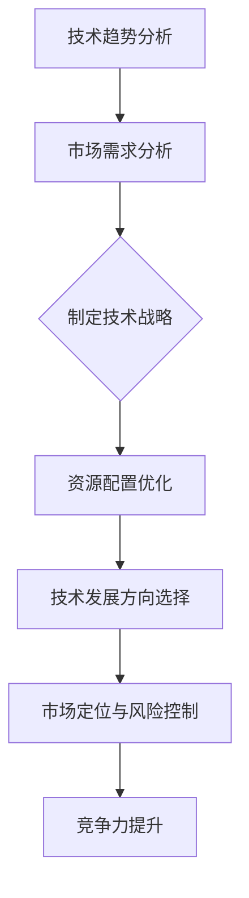
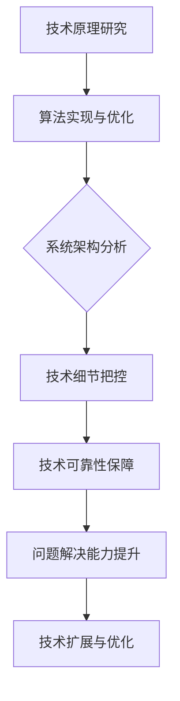
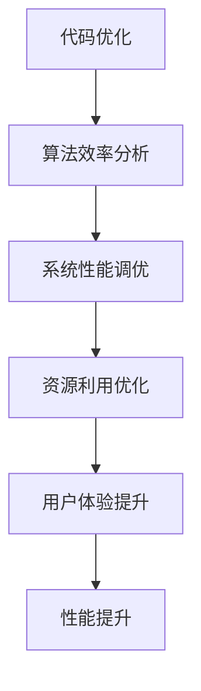
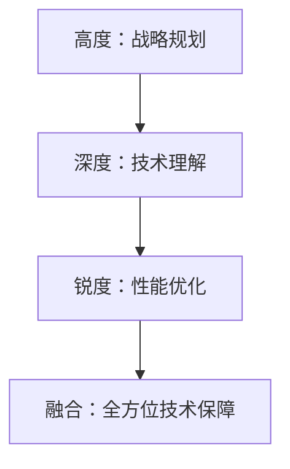

                 

# 技术规划的三个维度：高度、深度和锐度

## 关键词
技术规划，高度，深度，锐度，视野，原理，细节，优化，实现

## 摘要
本文旨在深入探讨技术规划的三个关键维度：高度、深度和锐度。通过阐述这些维度的核心概念及其相互关系，本文帮助读者理解如何在一个复杂的IT环境中进行有效的技术规划。我们将从背景介绍开始，逐步深入探讨每个维度的定义、重要性以及在实际应用中的具体表现，并通过实例分析和伪代码演示来加深对核心概念和算法原理的理解。最终，本文将总结技术规划的最佳实践，并给出持续学习和技术更新的建议。

### 引言

在信息技术迅速发展的今天，技术规划成为企业创新和竞争力提升的关键因素。技术规划不仅仅是选择合适的技术工具或框架，它还涉及到对技术趋势的敏锐洞察、对技术原理的深刻理解以及对技术细节的精准把控。在这三者中，高度、深度和锐度是技术规划不可或缺的三个维度。

**高度**是指技术视野与战略规划，它决定了技术规划的方向和格局。一个具有高度的技术规划能够把握技术发展的趋势，为企业带来长远的发展机遇。

**深度**是指技术原理与实现，它关乎技术的基础和底层逻辑。深入理解技术原理能够帮助企业在面对复杂问题时提供有效的解决方案。

**锐度**是指技术细节与优化，它关注技术的性能和效率。细节决定成败，锐度高的技术规划能够在竞争激烈的市场中为企业提供竞争优势。

本文将依次探讨这三个维度，并通过具体实例和伪代码来展示技术规划的实际应用，帮助读者更好地理解和应用这些维度。

### 高度：技术视野与战略

技术高度主要关注技术趋势和市场环境，是技术规划的战略层面。一个具有高度的技术规划能够帮助企业在快速变化的市场中把握机遇，避免盲目跟风，确保技术投资的有效性。

#### 定义

技术高度，是指对技术趋势的敏锐洞察和对市场需求的准确把握。它涉及到技术发展方向的选择、创新战略的制定以及资源配置的优化。

#### 重要性

- **市场定位**：通过高瞻远瞩的技术视野，企业可以准确把握市场需求，从而在市场中占据有利位置。
- **风险控制**：技术高度能够帮助企业预见潜在的风险，提前做好应对措施，降低不确定性。
- **竞争力提升**：高技术高度意味着企业能够率先采用前沿技术，形成竞争优势。

#### 应用实践

**案例研究**

以人工智能为例，谷歌在其技术规划中高度重视人工智能的发展。谷歌不仅投入大量资源进行基础研究，还积极应用人工智能技术于其产品和服务中，如搜索引擎优化、自动驾驶汽车等。这种高技术高度的战略规划，使得谷歌在人工智能领域取得了显著的竞争优势。

#### Mermaid流程图



#### 伪代码演示

```python
def technical_sight_analysis():
    # 收集技术趋势数据
    trend_data = get_trend_data()

    # 分析市场需求
    market需求的洞察力 = analyze_market_demand(trend_data)

    # 制定技术战略
    technical_strategy = create_technical_strategy(market需求的洞察力)

    # 资源配置优化
    optimize_resources(technical_strategy)

    # 技术发展方向选择
    choose_technical_direction(technical_strategy)

    # 市场定位与风险控制
    market_position_and_risk_control(technical_strategy)

    # 竞争力提升
    enhance_competitiveness(technical_strategy)
```

### 深度：技术原理与实现

技术深度是技术规划的核心层面，它关注技术的理论基础和实现细节。一个深入的技术规划能够确保企业在技术实施过程中具备坚实的基础和灵活的应对能力。

#### 定义

技术深度，是指对技术原理的深刻理解和对实现细节的精准把控。它涉及到技术基础理论的研究、算法的实现以及底层逻辑的分析。

#### 重要性

- **技术可靠性**：深入了解技术原理能够提高技术的可靠性，减少故障率。
- **问题解决**：对技术细节的掌握使得企业在面对技术难题时能够快速找到解决方案。
- **技术扩展**：深度理解技术原理有助于技术的后续扩展和优化。

#### 应用实践

**案例研究**

以分布式系统为例，亚马逊的AWS提供了广泛的服务，其背后是对分布式系统的深度理解。亚马逊通过深入研究分布式算法和系统架构，构建了稳定、高效、可扩展的云计算服务，为全球企业提供强大的基础设施支持。

#### Mermaid流程图



#### 伪代码演示

```python
def technical_depth_analysis():
    # 技术原理研究
    technical_principles = study_technical_principles()

    # 算法实现与优化
    algorithm_implement = implement_algorithm(technical_principles)

    # 系统架构分析
    system_architecture = analyze_system_architecture(algorithm_implement)

    # 技术细节把控
    technical_details = control_technical_details(system_architecture)

    # 技术可靠性保障
    ensure_technical_reliability(technical_details)

    # 问题解决能力提升
    enhance_problem_solving_ability(technical_details)

    # 技术扩展与优化
    extend_and_optimize_technical_depth(technical_details)
```

### 锐度：技术细节与优化

技术锐度是技术规划的精细化层面，它关注技术的性能优化和效率提升。一个具有锐度的技术规划能够在细节上寻求突破，提高技术的竞争力。

#### 定义

技术锐度，是指对技术细节的精准把控和优化。它涉及到代码优化、算法效率分析、系统性能调优等方面。

#### 重要性

- **性能提升**：锐度高的技术规划能够显著提升系统的性能和响应速度。
- **资源利用**：通过细节优化，提高资源利用效率，降低运营成本。
- **用户体验**：优化的技术细节能够提供更好的用户体验，增强用户满意度。

#### 应用实践

**案例研究**

以搜索引擎优化为例，谷歌通过对其搜索算法的锐度优化，实现了高效的搜索结果排序和快速响应。谷歌通过对算法的持续优化，确保了其搜索服务的市场领先地位。

#### Mermaid流程图



#### 伪代码演示

```python
def technical_sharpness_optimization():
    # 代码优化
    optimized_code = optimize_code()

    # 算法效率分析
    algorithm_efficiency = analyze_algorithm_efficiency(optimized_code)

    # 系统性能调优
    system_performance = tune_system_performance(algorithm_efficiency)

    # 资源利用优化
    resource_utilization = optimize_resource_utilization(system_performance)

    # 用户体验提升
    user_experience = enhance_user_experience(resource_utilization)

    # 性能提升
    final_performance = improve_performance(user_experience)
```

### 高度、深度与锐度的融合

技术规划的成功不仅依赖于单一维度的卓越，更在于三个维度之间的相互融合。高度、深度和锐度的有机融合能够为企业提供全方位的技术保障，确保在快速变化的市场中保持竞争力。

#### 相互关系

- **高度与深度的互补**：高度决定了技术规划的方向和格局，深度提供了技术实施的基础和支撑。两者相互补充，共同构建技术规划的核心框架。
- **锐度与高度的协同**：锐度关注技术细节和性能优化，与高度的战略规划相协同，使得技术实施更加高效和精准。
- **深度与锐度的深化**：深度对技术原理的深刻理解，为锐度提供了优化的方向和理论基础；而锐度对细节的持续优化，又进一步深化了对技术原理的理解。

#### 融合应用

**案例研究**

以云计算服务为例，亚马逊AWS的成功在于其高度的战略规划、深度的技术理解和锐度的细节优化。AWS通过深入研究云计算技术，制定了清晰的发展战略，并在实现细节和性能优化上不断追求卓越，形成了强大的竞争力。

#### Mermaid流程图



### 技术规划实践

在实际的技术规划过程中，企业需要结合高度、深度和锐度三个维度，制定系统的技术规划流程，确保技术规划的有效实施。

#### 技术规划流程

1. **需求分析**：明确技术规划的目标和需求，包括业务需求、市场趋势等。
2. **技术评估**：对潜在技术进行评估，包括技术成熟度、性能、成本等。
3. **战略制定**：根据需求分析和技术评估结果，制定技术规划的战略方向。
4. **实施规划**：细化技术实施计划，包括技术选型、资源分配等。
5. **监控与优化**：实施过程中持续监控，并根据反馈进行优化调整。

#### 技术评估与选择

在技术评估和选择过程中，企业需要综合考虑技术的高度、深度和锐度：

- **高度**：评估技术的市场前景和战略匹配度。
- **深度**：评估技术的理论基础和实现细节。
- **锐度**：评估技术的性能优化潜力。

#### 技术实施与监控

技术实施过程中，企业需要：

- **确保技术战略与实际操作一致**。
- **持续监控技术性能和用户体验**。
- **及时调整和优化技术细节**。

### 持续学习与技术更新

在技术快速发展的时代，持续学习和技术更新是技术规划的重要保障。企业应：

- **建立技术动态追踪机制**：关注行业最新动态和技术趋势。
- **提供持续学习资源**：包括在线课程、研讨会、技术论坛等。
- **制定持续学习策略**：鼓励员工不断学习和提升技能。

### 结论

技术规划是企业在信息技术环境中持续发展的关键。高度、深度和锐度三个维度共同构成了技术规划的核心框架。通过本文的探讨，我们理解了这三个维度在技术规划中的重要性及其相互关系。在未来的技术规划中，企业应全面考虑这三个维度，实现高度的战略视野、深度的技术理解和锐度的细节优化，从而在激烈的市场竞争中立于不败之地。

### 附录

**相关技术资料与工具**

- **技术文献推荐**：《深度学习》、《算法导论》等。
- **技术工具介绍**：Python、Mermaid等。
- **在线资源链接**：Coursera、edX等在线学习平台。

### 作者信息

作者：AI天才研究院/AI Genius Institute & 禅与计算机程序设计艺术 /Zen And The Art of Computer Programming

