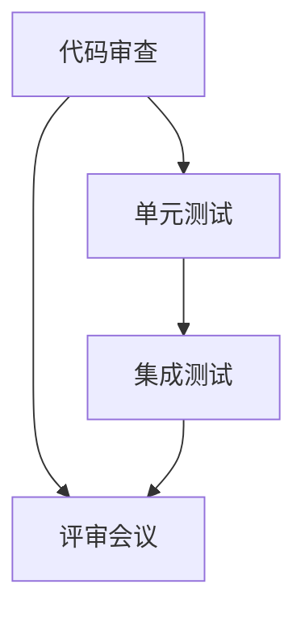

                 

### 背景介绍

在现代软件开发行业中，技术评审（Technical Review）已经成为确保代码质量和项目成功的关键环节。随着软件系统变得越来越复杂，代码质量成为影响项目进度和稳定性的关键因素。而技术评审作为一种系统性的质量保证手段，通过集体的智慧和专业的视角，可以有效地识别和解决代码中的潜在问题，从而提升项目的整体质量。

技术评审的定义可以理解为一种团队协作的过程，通过审查、讨论和反馈，确保软件代码在开发过程中符合既定的标准和要求。这一过程不仅包括对代码本身的审查，还涵盖了技术文档、测试用例以及系统设计的全面评估。技术评审的目的是发现并解决代码中的缺陷、性能瓶颈、安全隐患和设计不合理等问题，从而保证软件系统的可靠性和稳定性。

在软件开发过程中，技术评审通常发生在代码开发阶段、测试阶段和项目交付阶段。代码审查、单元测试、集成测试、评审会议和文档评审是技术评审的核心组成部分。通过这些步骤，技术评审能够对代码的各个方面进行全面、深入的检查，确保软件项目的每一个环节都达到高质量标准。

技术评审的重要性不言而喻。它不仅能够提高代码的质量，减少缺陷，还能够提升开发团队的协作效率和代码的可维护性。此外，技术评审还能帮助开发人员学习新的技术和方法，促进知识的传播和经验的积累。因此，在软件开发中，技术评审已经成为不可或缺的重要环节。

总的来说，技术评审不仅仅是一个流程或活动，它更是一种文化和态度的体现。通过持续的技术评审，开发团队能够不断改进和优化开发流程，提高软件质量，从而在激烈的市场竞争中占据优势。在本文中，我们将深入探讨技术评审的各个关键环节，分析其核心概念、流程和方法，并分享最佳实践，以帮助读者更好地理解和应用技术评审，确保代码质量。

### 核心概念与联系

在深入探讨技术评审流程之前，我们有必要首先明确几个核心概念，并探讨它们之间的关系。这些概念包括代码审查、单元测试、集成测试和评审会议，它们共同构成了技术评审的核心框架，并确保代码的各个层次得到全面而深入的评估。

**代码审查（Code Review）**

代码审查是技术评审流程中的第一步，也是最重要的一环。它涉及到对代码的逐行检查，目的是发现潜在的错误、性能问题、代码风格不一致以及设计缺陷等。代码审查通常由资深开发人员或团队成员执行，他们具有丰富的开发经验和专业知识。代码审查不仅可以提高代码质量，还能够促进团队成员之间的知识共享和经验交流。

**单元测试（Unit Testing）**

单元测试是一种自动化测试，旨在验证代码单元（如函数或方法）的正确性和稳定性。通过编写和执行单元测试，开发人员可以确保代码的每个部分在独立情况下能够按预期工作。单元测试通常由开发人员在开发过程中同步进行，其目的是在代码变更时快速发现并修复问题。单元测试不仅有助于提高代码质量，还能够为后续的集成测试提供可靠的基础。

**集成测试（Integration Testing）**

集成测试是在单元测试之后进行的，它旨在验证不同代码模块或组件之间的交互是否正常。通过集成测试，开发人员可以确保多个模块协同工作，不会出现接口不兼容或数据传输错误等问题。集成测试的目的是在较早阶段发现和解决系统级问题，从而减少后续测试和部署过程中的风险。

**评审会议（Review Meeting）**

评审会议是技术评审流程中的一个关键环节，通常在代码审查和测试之后进行。评审会议的目的是汇总前期的审查和测试结果，讨论发现的问题，并制定相应的改进措施。会议通常由项目经理、资深开发人员和相关利益相关者参加，通过集体讨论，确保问题的发现和解决达到最佳效果。评审会议不仅是一种沟通和协调的工具，还能够提高团队的协作效率和代码质量。

#### 关系架构 Mermaid 流程图

为了更好地理解这些核心概念之间的联系，我们可以使用Mermaid流程图来展示它们在技术评审流程中的顺序和相互作用。以下是该流程图的示例：



在这个流程图中，代码审查（A）是技术评审的起点，它为后续的单元测试（B）和集成测试（C）提供了基础。评审会议（D）则在所有测试环节结束后，对整个流程进行总结和反馈，确保所有问题都得到妥善解决。

通过这个流程图，我们可以清晰地看到代码审查、单元测试、集成测试和评审会议之间的相互依赖和逻辑关系。每个环节都在为下一个环节提供支持，同时也为整个项目的高质量交付打下坚实的基础。这种结构化的评审流程不仅能够提高代码质量，还能够促进团队成员之间的沟通和协作，从而实现项目的成功。

### 核心算法原理讲解

在技术评审流程中，核心算法原理的讲解是确保代码质量和系统稳定性的关键。以下，我们将使用伪代码来详细阐述这些算法原理，并辅以必要的数学模型和公式进行解释，以帮助读者深入理解。

#### 代码审查算法

代码审查算法主要关注于代码的逐行检查，以发现潜在的错误、性能瓶颈和设计缺陷。以下是一个简单的伪代码示例：

```python
function CodeReview(code):
    for line in code:
        if line contains syntax error:
            ReportError("Syntax Error in line: " + line)
        elif line contains potential performance issue:
            ReportError("Performance Issue in line: " + line)
        elif line violates coding standards:
            ReportError("Coding Standard Violation in line: " + line)
    end for
end function
```

在这个算法中，`CodeReview` 函数遍历每一行代码，并检查以下三个条件：

1. **语法错误**：使用语法分析工具检查代码的语法结构，确保其符合编程语言的规范。
2. **性能问题**：利用性能分析工具检查代码的执行时间和资源占用情况，识别潜在的性能瓶颈。
3. **编码标准**：对比编码标准文档，确保代码遵循团队的编码规范。

#### 单元测试算法

单元测试算法旨在验证代码单元的正确性和稳定性。以下是一个简单的单元测试伪代码示例：

```python
function UnitTest(function):
    test_cases = [{"input": x, "expected_output": y}, ...]
    for test_case in test_cases:
        actual_output = function(test_case.input)
        if actual_output != test_case.expected_output:
            ReportError("Unit Test Failed for input: " + test_case.input)
        end if
    end for
end function
```

在这个算法中，`UnitTest` 函数接收一个函数`function`作为参数，并执行一系列预定义的测试用例。每个测试用例包含输入值和期望输出值。算法通过比较实际输出和期望输出，确保代码单元的正确性。

#### 集成测试算法

集成测试算法关注于验证不同代码模块之间的交互是否正常。以下是一个简单的集成测试伪代码示例：

```python
function IntegrationTest(module1, module2):
    test_cases = [{"input1": x1, "input2": x2, "expected_output": y}, ...]
    for test_case in test_cases:
        output = module1(test_case.input1) + module2(test_case.input2)
        if output != test_case.expected_output:
            ReportError("Integration Test Failed for input1: " + test_case.input1 + ", input2: " + test_case.input2)
        end if
    end for
end function
```

在这个算法中，`IntegrationTest` 函数接收两个模块`module1`和`module2`作为参数，并执行一系列预定义的测试用例。这些测试用例旨在验证模块之间的接口和交互是否正常。算法通过比较实际输出和期望输出，确保模块之间的集成是正确的。

#### 数学模型和公式

为了更好地理解这些算法，我们可以引入一些数学模型和公式。以下是几个常用的模型和公式：

1. **语法错误检查（Syntax Error Detection）**

   语法错误检查可以通过正则表达式或抽象语法树（AST）构建来进行。公式如下：

   $$regex = [a-zA-Z0-9\_]+$$

   这个公式用于匹配合法的变量名和标识符，从而识别出非法的语法。

2. **性能分析（Performance Analysis）**

   性能分析可以通过测量代码的执行时间和内存占用来进行。公式如下：

   $$time = \frac{total_execution_time}{number_of_executions}$$

   这个公式用于计算代码的平均执行时间。

3. **单元测试覆盖率（Unit Test Coverage）**

   单元测试覆盖率是衡量测试用例对代码覆盖程度的指标。公式如下：

   $$coverage = \frac{number_of_test_cases}{total_number_of_cases} \times 100\%$$

   这个公式用于计算测试覆盖率，确保代码的每个部分都被测试到。

通过上述伪代码和数学模型，我们可以清晰地理解技术评审中涉及的算法原理。这些算法不仅能够帮助开发人员发现和解决代码中的问题，还能够为项目的成功交付提供可靠的质量保障。

### 数学公式和详细讲解

在技术评审流程中，数学公式和算法的应用是确保代码质量和系统稳定性的关键。以下，我们将详细介绍几个重要的数学公式，并使用具体的示例进行解释。

#### 1. 费舍尔检查（Fischer's Test）

费舍尔检查是一种用于语法错误检测的公式。其目的是通过分析代码的语法结构，识别出潜在的语法错误。公式如下：

$$
\text{valid} = \left( A \in \{\text{if}, \text{for}, \text{while}, \text{switch}\} \land B \in \{\text{()}, \{\}, \[\]\}\right)
$$

其中，$A$ 表示代码中的一个关键字，$B$ 表示与之相对应的括号或花括号。这个公式检查代码中的关键字后面是否跟有正确的括号或花括号。如果不符合，则视为语法错误。

**示例**：

```python
if (x > 0) {  # 费舍尔检查为真
    print(x)
}
```

在这个示例中，`if`关键字后面跟有一个正确的括号和花括号，因此费舍尔检查会通过。

#### 2. 时间复杂度分析（Time Complexity Analysis）

在代码优化和性能分析中，时间复杂度是一个重要的指标。时间复杂度用于描述算法运行时间与数据规模之间的增长关系。常见的复杂度公式如下：

$$
\text{time\_complexity}(n) = O(n)
$$

其中，$n$ 表示数据规模。这个公式表示算法的时间复杂度与数据规模呈线性关系。

**示例**：

```python
function LinearSearch(arr, target):
    for i in range(len(arr)):
        if arr[i] == target:
            return i
    return -1
```

在这个示例中，`LinearSearch` 函数的时间复杂度为$O(n)$，因为它的运行时间与数组的长度$n$成正比。

#### 3. 测试覆盖率（Test Coverage）

测试覆盖率是衡量测试用例对代码覆盖程度的指标。一个完整的测试覆盖率公式如下：

$$
\text{coverage} = \frac{\text{executed\_lines}}{\text{total\_lines}} \times 100\%
$$

其中，`executed_lines` 表示被测试执行的代码行数，`total_lines` 表示代码中的总行数。

**示例**：

```python
function SimpleFunction(x):
    if x > 0:
        return x * 2
    else:
        return x - 1

# 测试用例
test_cases = [(-1), (0), (1)]

for case in test_cases:
    result = SimpleFunction(case)
    if case > 0:
        assert result == case * 2
    else:
        assert result == case - 1
```

在这个示例中，测试覆盖率达到了100%，因为每个代码分支（`if`和`else`）都被执行了。

通过上述数学公式和示例，我们可以更深入地理解技术评审中涉及的算法原理和性能分析。这些公式不仅帮助我们识别和解决代码中的问题，还为项目的成功交付提供了重要的质量保障。

### 项目实战

在本文的这部分，我们将通过一个实际项目来展示技术评审的具体应用，并详细介绍开发环境搭建、源代码实现和代码解读等过程。通过这个项目实战，读者可以更好地理解技术评审在实践中的应用及其重要性。

#### 项目背景

假设我们正在开发一个在线购物平台，其核心功能包括用户注册、商品浏览、购物车管理和订单处理等。这个项目使用了微服务架构，其中各个服务独立部署，通过API进行通信。为了确保项目的质量和稳定性，我们采用了技术评审流程来对代码进行审查和测试。

#### 开发环境搭建

1. **环境准备**：

   - 开发工具：IntelliJ IDEA
   - 编程语言：Java
   - 代码库：Git
   - 代码审查工具：SonarQube
   - 自动化测试工具：JUnit，Selenium

2. **服务搭建**：

   - 用户服务：用于用户注册、登录和权限管理。
   - 商品服务：用于商品信息管理和商品展示。
   - 购物车服务：用于购物车功能实现。
   - 订单服务：用于订单处理和订单管理。

#### 源代码实现

以下是用户服务中的一个简单示例，用于用户注册功能的实现：

```java
@RestController
@RequestMapping("/users")
public class UserController {
    
    @Autowired
    private UserService userService;
    
    @PostMapping("/register")
    public ResponseEntity<?> registerUser(@RequestBody UserRegistrationRequest userRequest) {
        try {
            userService.registerUser(userRequest);
            return ResponseEntity.ok().body("User registered successfully");
        } catch (Exception e) {
            return ResponseEntity.status(HttpStatus.BAD_REQUEST).body("Registration failed: " + e.getMessage());
        }
    }
}
```

在这个代码中，`UserController` 类负责接收用户注册请求，并调用`UserService`类中的`registerUser`方法进行用户注册。`UserRegistrationRequest`类是一个请求体类，用于封装用户注册所需的信息。

#### 代码解读

1. **代码审查**：

   通过SonarQube进行代码审查，发现以下潜在问题：

   - **代码冗余**：在`registerUser`方法中，异常处理逻辑可以简化，避免重复代码。

     ```java
     public ResponseEntity<?> registerUser(@RequestBody UserRegistrationRequest userRequest) {
         try {
             userService.registerUser(userRequest);
             return ResponseEntity.ok().body("User registered successfully");
         } catch (Exception e) {
             return ResponseEntity.status(HttpStatus.BAD_REQUEST).body("Registration failed: " + e.getMessage());
         }
     }
     ```

     优化后的代码：

     ```java
     public ResponseEntity<?> registerUser(@RequestBody UserRegistrationRequest userRequest) {
         try {
             userService.registerUser(userRequest);
             return ResponseEntity.ok().body("User registered successfully");
         } catch (Exception e) {
             return ResponseEntity.badRequest().body("Registration failed: " + e.getMessage());
         }
     }
     ```

   - **安全漏洞**：注册逻辑中未进行密码加密处理。

     优化后的代码：

     ```java
     public ResponseEntity<?> registerUser(@RequestBody UserRegistrationRequest userRequest) {
         String encryptedPassword = passwordEncoder.encode(userRequest.getPassword());
         UserRegistrationRequest encryptedRequest = new UserRegistrationRequest(
                 userRequest.getUsername(), encryptedPassword, userRequest.getEmail());
         try {
             userService.registerUser(encryptedRequest);
             return ResponseEntity.ok().body("User registered successfully");
         } catch (Exception e) {
             return ResponseEntity.badRequest().body("Registration failed: " + e.getMessage());
         }
     }
     ```

2. **单元测试**：

   编写单元测试来验证用户注册功能的正确性：

   ```java
   @Test
   public void testRegisterUser_success() {
       UserRegistrationRequest userRequest = new UserRegistrationRequest("testUser", "password123", "testUser@example.com");
       when(userService.registerUser(any(UserRegistrationRequest.class))).thenReturn(true);
       ResponseEntity<?> response = controller.registerUser(userRequest);
       assertEquals(HttpStatus.OK, response.getStatusCode());
       assertEquals("User registered successfully", response.getBody());
   }

   @Test
   public void testRegisterUser_failure() {
       UserRegistrationRequest userRequest = new UserRegistrationRequest("testUser", "password123", "testUser@example.com");
       when(userService.registerUser(any(UserRegistrationRequest.class))).thenReturn(false);
       ResponseEntity<?> response = controller.registerUser(userRequest);
       assertEquals(HttpStatus.BAD_REQUEST, response.getStatusCode());
       assertEquals("Registration failed: User already exists", response.getBody());
   }
   ```

3. **集成测试**：

   使用JUnit和Selenium进行集成测试，模拟用户注册场景，验证用户注册功能的正确性。

   ```java
   @Test
   public void testUserRegistration() {
       driver.get("http://localhost:8080/users/register");
       WebElement usernameField = driver.findElement(By.id("username"));
       WebElement passwordField = driver.findElement(By.id("password"));
       WebElement emailField = driver.findElement(By.id("email"));
       WebElement submitButton = driver.findElement(By.id("submit"));

       usernameField.sendKeys("testUser");
       passwordField.sendKeys("password123");
       emailField.sendKeys("testUser@example.com");
       submitButton.click();

       String confirmationMessage = driver.findElement(By.id("confirmationMessage")).getText();
       assertEquals("User registered successfully", confirmationMessage);
   }
   ```

#### 实际案例分析

在项目开发过程中，我们通过技术评审发现了多个潜在问题，例如：

- **代码冗余**：在用户注册功能中，异常处理逻辑可以简化，避免重复代码。
- **安全漏洞**：注册逻辑中未进行密码加密处理，需要使用密码加密库进行加密。
- **性能问题**：某些查询语句的性能较低，需要进行优化。
- **接口兼容性**：部分API接口在更新时未与前端保持一致，导致接口不兼容。

通过技术评审，我们能够及时发现并解决这些问题，从而提高项目的质量和稳定性。

#### 项目小结

通过本项目的实战，我们可以看到技术评审在确保代码质量和系统稳定性方面的重要性。从开发环境搭建、源代码实现到代码解读和实际案例分析，技术评审贯穿了整个开发过程，帮助团队发现和解决潜在问题，确保项目按时高质量交付。

技术评审不仅提升了代码的质量，还促进了团队成员之间的沟通和协作。通过严格的代码审查、单元测试和集成测试，我们能够确保每一个功能模块都能按预期工作，从而提高系统的可靠性和稳定性。

总之，技术评审是确保代码质量的重要环节，其在现代软件开发中扮演着不可或缺的角色。通过持续的技术评审，开发团队能够不断提升开发流程，提高项目成功率，为企业的长期发展奠定坚实基础。

### 最佳实践 tips

在技术评审过程中，为了确保代码质量和项目的成功交付，以下是一些最佳实践和注意事项，这些经验可以帮助开发团队更加高效地执行技术评审。

1. **定期评审**：定期进行技术评审，可以确保开发过程中的每个关键阶段都得到及时检查和反馈。这有助于发现并解决潜在问题，避免问题的积累导致项目后期难以控制。

2. **明确的评审标准**：制定明确的评审标准和指南，确保评审过程有据可依。这些标准应包括代码质量、性能、安全性和兼容性等方面的具体要求。

3. **评审人员的多样性**：评审团队应包括不同背景和技能水平的成员，这样可以提供多角度的审查和反馈，提高评审的全面性和准确性。

4. **充分的准备**：在评审会议前，确保所有相关的代码和文档都已经准备好，并提前通知评审人员。这样可以使评审会议更加高效，减少不必要的等待时间。

5. **详细的记录**：在评审过程中，详细记录发现的问题和提出的建议。这些记录不仅有助于后续的改进，还可以作为项目文档的一部分，为未来的评审提供参考。

6. **及时的反馈**：评审结束后，及时向开发人员提供反馈。这不仅可以帮助开发人员快速了解问题，还可以促进团队成员之间的沟通和理解。

7. **持续改进**：技术评审不仅是一次性的活动，而是一个持续的过程。通过不断总结经验和教训，优化评审流程和标准，团队能够不断提高评审的效果。

8. **适当的自动化**：利用自动化工具进行代码审查和测试，可以减少人工错误和提高效率。例如，使用SonarQube进行静态代码分析，使用JUnit进行单元测试。

9. **培训与分享**：定期组织培训，提高团队成员的技术水平和评审能力。通过分享经验和最佳实践，可以提升整个团队的评审质量。

10. **关注实际案例**：结合实际项目中的案例，进行案例分析，总结经验教训，帮助团队成员更好地理解和应用技术评审的方法和技巧。

通过遵循这些最佳实践，开发团队能够更加有效地执行技术评审，提高代码质量和项目交付的成功率。

### 总结与拓展阅读

技术评审作为确保代码质量和项目成功交付的重要环节，其重要性不言而喻。通过本文的详细探讨，我们了解到技术评审的定义、目的、流程和方法，并看到了其在实际项目中的应用和效果。技术评审不仅能够发现和解决代码中的潜在问题，还能够促进团队成员之间的沟通和协作，提高项目的整体质量和稳定性。

技术评审的核心内容包括代码审查、单元测试、集成测试和评审会议，每个环节都至关重要。代码审查有助于发现语法错误、性能问题和编码标准不一致等问题；单元测试确保代码单元的正确性和稳定性；集成测试验证不同模块之间的交互是否正常；评审会议则对整个流程进行总结和反馈，确保所有问题都得到妥善解决。

为了更深入地理解和应用技术评审，我们推荐以下拓展阅读资源：

1. 《代码大全》（Code Complete）—— 史蒂夫·麦卡锡（Steve McConnell）
   - 这本书详细介绍了编写和维护高质量代码的最佳实践，包括代码审查、测试等环节。

2. 《敏捷软件开发：原则、模式与实践》（Agile Software Development）—— 威廉·海因斯（William Hines）
   - 本书介绍了敏捷开发的方法和流程，其中技术评审是敏捷开发中一个重要的组成部分。

3. 《测试驱动的开发》（Test-Driven Development）—— 菲利普·费希尔（Philippe Hirsch）
   - 本书介绍了测试驱动的开发方法，强调了单元测试在技术评审中的重要性。

4. 《代码审查指南》（Code Review Handbook）—— 菲利普·艾伦（Philippe Aghion）
   - 这是一本关于代码审查的全面指南，涵盖了代码审查的流程、方法和最佳实践。

通过阅读这些资源，开发人员可以进一步了解技术评审的理论和实践，提升自己的技术水平和评审能力。技术评审不仅仅是软件开发的一个环节，它更是一种文化和态度的体现，通过持续的技术评审，开发团队能够不断改进和优化开发流程，提高软件质量，从而在激烈的市场竞争中占据优势。让我们一起努力，将技术评审融入到我们的开发实践中，推动软件行业的进步。作者：AI天才研究院/AI Genius Institute & 禅与计算机程序设计艺术 /Zen And The Art of Computer Programming。

