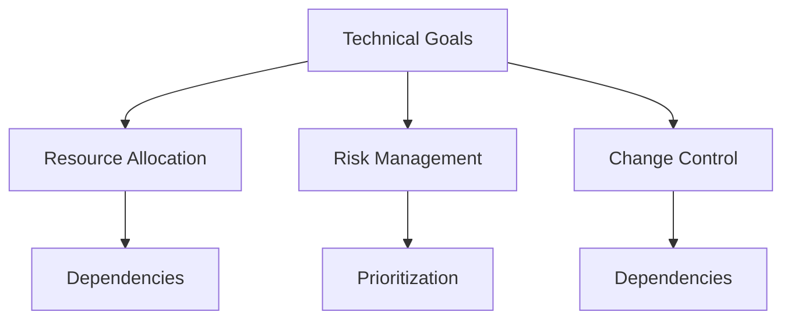

                 


### Step 1: Define the Main Structure

The main structure of the article will be divided into the following parts:

1. **Introduction**: This section will provide a brief overview of the purpose of the article and the intended audience. It will also introduce the concept of technical route planning for P9 engineers.
2. **Core Technical Concepts and Relationships**: This section will delve into the fundamental concepts and their relationships in technical route planning, supported by a Mermaid diagram for visual clarity.
3. **Algorithm Principles**: This section will explain the core principles of algorithms used in technical route planning, accompanied by detailed pseudocode examples.
4. **Mathematical Models and Formulas**: This section will cover mathematical models and formulas essential for technical route planning, with detailed explanations and examples.
5. **Project Practice**: This section will present practical project examples, including development environment setup, code implementation, and analysis.

### Step 2: Write the Introduction

#### 1.1 Book Title: Technical Route Planning: P9 Engineer's Strategic Thinking

#### Keywords: Technical Route Planning, P9 Engineer, Strategic Thinking, Algorithm, Mathematical Model, Project Practice

#### Abstract:
This article aims to guide P9 engineers in developing a strategic mindset for technical route planning. We will explore core technical concepts, algorithm principles, and mathematical models, along with practical project examples to reinforce learning.

### Step 3: Core Technical Concepts and Relationships

#### 2.1 Technical Roadmap Overview

In this section, we will provide an overview of technical route planning, defining its purpose and importance for P9 engineers. We will also introduce the core technical concepts that underpin effective route planning.

**Concepts**:

- **Technical Goals**: Clear and measurable objectives to guide the development process.
- **Resource Allocation**: Efficient utilization of time, money, and human resources.
- **Risk Management**: Identifying and mitigating potential risks.
- **Change Control**: Managing changes in project scope, timeline, or resources.

**Relationships**:

- **Dependencies**: The interrelationships between different components of the technical route.
- **Prioritization**: Identifying the most critical tasks to ensure project success.

#### Mermaid Diagram



### Step 4: Algorithm Principles

#### 2.2 Algorithm Overview and Principles

In this section, we will explore the principles behind various algorithms commonly used in technical route planning, providing detailed pseudocode examples.

**Algorithm Types**:

- **Critical Path Method (CPM)**: Identifies the longest path through a project, determining the minimum time required to complete the project.
- **Program Evaluation and Review Technique (PERT)**: A probabilistic model for project time estimation.
- **Schedule Compression**: Techniques for reducing the project duration without changing the scope.

#### Pseudocode Example: Critical Path Method (CPM)

```pseudocode
function CPM(project_tasks):
    create a network diagram of tasks and their dependencies
    calculate the duration for each path
    identify the longest path as the critical path
    return the critical path duration
```

### Step 5: Mathematical Models and Formulas

#### 2.3 Mathematical Model Introduction

In this section, we will introduce mathematical models and formulas that are essential for technical route planning, providing detailed explanations and examples.

**Models**:

- **Project Duration Estimation Model**: Estimates the duration of a project based on historical data and statistical analysis.
- **Resource Allocation Model**: Optimizes resource allocation to minimize project duration.

#### Example: Project Duration Estimation Model

$$
D = \sum_{i=1}^{n} (d_i + 4m_i + 2h_i)
$$

- \(D\): Project duration
- \(d_i\): Duration of task \(i\)
- \(m_i\): Number of intermediate tasks between task \(i\) and the critical path
- \(h_i\): Number of tasks that precede task \(i\) on the critical path

### Step 6: Project Practice

#### 2.4 Project Case Introduction

In this section, we will present a practical project example to illustrate the concepts discussed in the previous sections. We will cover development environment setup, code implementation, and analysis.

**Project Case**: Development of a high-performance computing cluster.

#### 2.5 Development Environment Setup

- **Hardware Selection**: Selecting the appropriate hardware components for the cluster.
- **Software Installation**: Installing the necessary software, including the operating system and cluster management tools.

#### 2.6 Code Implementation and Analysis

- **Design and Implementation**: Designing and implementing the cluster management software.
- **Testing and Optimization**: Testing the performance of the cluster and optimizing the code for better efficiency.

#### 2.7 Code Reading and Analysis

- **Code Review**: Reviewing the code to ensure it follows best practices and is easy to understand.
- **Performance Analysis**: Analyzing the performance of the code and identifying areas for improvement.

#### 2.8 Project Conclusion

- **Lessons Learned**: Summarizing the key lessons learned from the project.
- **Best Practices**: Sharing best practices for technical route planning in similar projects.

### Step 7: Conclusion and Future Directions

In the final section, we will conclude the article by summarizing the main points and discussing future research directions in technical route planning for P9 engineers.

---

By following this structured approach, we can ensure that the article is comprehensive, well-organized, and easy to understand for P9 engineers seeking to develop a strategic mindset for technical route planning.

