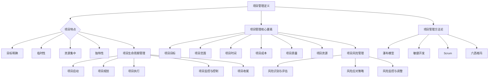

                 

### 文章关键词

- 技术项目管理
- P9工程师
- 项目执行力
- 团队协作
- 项目案例
- 代码质量
- 风险管理

### 文章摘要

本文旨在探讨技术项目管理中P9工程师的执行力体现。首先，文章对项目管理的核心概念进行了介绍，包括项目定义、核心要素和方法论。接着，文章深入分析了P9工程师的角色定位、职业素养、技术能力要求和管理职责。然后，通过实际案例展示了项目管理在不同类型项目中的应用，如大型互联网项目、初创企业项目和企业内部项目管理。最后，文章探讨了项目管理的未来发展趋势，以及技术创新对项目管理的影响。本文通过详细的理论讲解和实战案例分析，为读者提供了对技术项目管理的全面理解。

## 第一部分：项目管理的核心概念与基础

### 1.1 项目管理的基本概念

项目管理是引导团队完成特定任务、达到预定目标的过程。项目与日常运营不同，它是一次性的、具有明确的目标和期限。项目管理涉及多个学科和功能部门的协作，包括规划、执行、监控和收尾等阶段。

#### 什么是项目管理

项目管理可以定义为：“通过计划、执行、监控和收尾等一系列活动，确保项目目标实现的过程。”项目管理不仅仅关注项目的最终交付物，还强调在项目生命周期中的资源管理、风险控制和进度控制。

- **项目定义**：项目是“一个由一系列具有明确目标、期限和资源的任务组成的临时性工作。”
- **项目特点**：
  - **目标明确**：项目具有明确的目标和预期成果。
  - **临时性**：项目是一次性的，一旦目标实现，项目就结束。
  - **资源集中**：项目需要集中资源，包括人力、资金、物资和时间等。
  - **独特性**：每个项目都是独特的，没有重复的项目。

#### 项目管理的核心要素

项目管理的核心要素包括项目目标、范围、时间、成本、质量和资源。

- **项目目标**：项目目标是项目的核心，是项目团队共同努力的方向。
- **项目范围**：项目范围定义了项目的边界，包括项目应该做什么，不应该做什么。
- **项目时间**：项目时间管理涉及确定项目进度、制定进度计划、监控进度和调整计划。
- **项目成本**：项目成本管理包括预算编制、成本控制、成本分析和成本审计。
- **项目质量**：项目质量管理确保项目交付物符合预定的质量标准。
- **项目资源**：项目资源管理涉及人员、设备、资金和材料的分配和使用。

#### 项目管理的方法论

项目管理方法论是指导项目团队实现项目目标的一系列方法和工具。常见的项目管理方法论包括：

- **瀑布模型**：瀑布模型是一种线性顺序的开发方法，每个阶段完成后才能进入下一个阶段。
- **敏捷开发**：敏捷开发强调快速迭代、客户反馈和灵活性，以适应变化的需求。
- **Scrum**：Scrum是一种基于敏捷开发的方法，强调团队协作、任务分解和迭代开发。
- **六西格玛**：六西格玛是一种质量管理方法，通过减少缺陷和提高效率来提高项目质量。

### 1.2 项目生命周期管理

项目生命周期是指从项目启动到项目结束的全过程。项目生命周期管理包括项目启动、规划、执行、监控与控制和项目收尾等阶段。

#### 1.2.1 项目启动

项目启动是项目生命周期的第一步，主要任务是确定项目目标、范围和可行性。项目启动阶段的关键活动包括：

- **项目立项**：确定项目目标和范围，评估项目可行性。
- **组建项目团队**：选择合适的项目团队成员，明确团队成员的职责和角色。
- **制定项目章程**：项目章程是项目的正式文件，概述项目目标、范围、期限和预算。

#### 1.2.2 项目规划

项目规划是制定项目计划的过程，包括确定项目范围、时间、成本和质量等。项目规划阶段的关键活动包括：

- **工作分解结构（WBS）**：将项目任务分解为可管理的工作包。
- **项目计划**：制定项目进度计划、资源计划和成本计划。
- **风险评估**：识别项目风险，评估风险的概率和影响，制定风险应对策略。

#### 1.2.3 项目执行

项目执行是项目生命周期的核心阶段，主要任务是完成项目规划中的工作。项目执行阶段的关键活动包括：

- **任务分配**：将项目任务分配给项目团队成员。
- **资源分配**：确保项目所需的资源得到合理分配和使用。
- **团队协作**：通过沟通和协作确保项目任务的顺利完成。

#### 1.2.4 项目监控与控制

项目监控与控制是确保项目按计划进行的过程，包括监控项目进度、成本和质量等。项目监控与控制阶段的关键活动包括：

- **进度监控**：定期检查项目进度，确保项目按计划进行。
- **成本控制**：监控项目成本，确保项目在预算范围内完成。
- **质量控制**：确保项目交付物符合预定的质量标准。

#### 1.2.5 项目收尾

项目收尾是项目生命周期的最后阶段，主要任务是完成项目交付物的验收和项目总结。项目收尾阶段的关键活动包括：

- **项目验收**：确保项目交付物符合项目要求，并获得客户的认可。
- **项目总结**：总结项目经验，识别项目中的成功和失败因素，为未来的项目提供参考。

### 1.3 项目风险管理

项目风险管理是识别、评估和应对项目风险的过程。项目风险管理有助于降低项目风险，确保项目顺利进行。

#### 1.3.1 风险识别与评估

风险识别是识别项目可能面临的风险的过程。风险评估是评估风险的概率和影响，以确定风险的重要性和优先级。

- **风险识别**：通过访谈、文档审查和专家判断等方法识别项目风险。
- **风险评估**：使用定量和定性的方法评估风险的概率和影响。

#### 1.3.2 风险应对策略

风险应对策略是制定应对项目风险的计划。常见的风险应对策略包括风险规避、风险减轻、风险接受和风险转移。

- **风险规避**：避免项目面临的风险。
- **风险减轻**：降低项目风险的概率或影响。
- **风险接受**：接受项目风险，并制定相应的应对措施。
- **风险转移**：将项目风险转移给第三方。

#### 1.3.3 风险监控与调整

风险监控是监控项目风险状态的过程。根据风险监控的结果，项目团队需要调整风险应对策略，确保项目风险得到有效控制。

- **风险监控**：定期评估项目风险状态，识别新风险。
- **风险调整**：根据风险监控结果调整风险应对策略。

### 结论

项目管理是确保项目成功的关键因素。通过了解项目管理的核心概念、生命周期管理和风险管理，P9工程师可以更好地在项目管理中发挥其执行力，确保项目的顺利进行和成功交付。

### 1.1.1 什么是项目管理

项目管理是一个系统化的过程，旨在通过引导和监督项目团队实现项目目标。项目管理不仅仅是简单的任务分配和进度跟踪，它还涉及到多个方面，包括资源管理、风险管理、质量管理和沟通管理等。以下是项目管理的定义和一些核心概念：

**项目管理的定义**：

项目管理是“通过计划、执行、监控和收尾等一系列活动，确保项目目标实现的过程。”项目管理旨在确保项目按时、按预算、按质量完成，并满足客户需求。

**项目的特点**：

1. **目标明确**：每个项目都有明确的目标和预期成果，这是项目的核心驱动力。
2. **临时性**：项目是一次性的，当项目目标实现后，项目就会结束。
3. **资源集中**：项目需要集中资源，包括人力、资金、物资和时间等，以实现项目目标。
4. **独特性**：每个项目都是独特的，没有重复的项目。

**项目管理的主要活动**：

1. **项目规划**：项目规划是制定项目计划的过程，包括确定项目范围、时间、成本和质量等。
2. **项目执行**：项目执行是完成项目计划中的工作，包括任务分配、资源分配和团队协作等。
3. **项目监控与控制**：项目监控与控制是确保项目按计划进行的过程，包括监控项目进度、成本和质量等。
4. **项目收尾**：项目收尾是完成项目交付物的验收和项目总结的过程。

#### 项目管理的基本概念

项目管理涉及一系列活动，这些活动需要按照一定的顺序和规则进行，以确保项目目标的实现。以下是项目管理的一些核心概念：

1. **项目目标**：项目目标是项目的核心驱动力，是项目团队共同努力的方向。项目目标应该是明确、具体、可衡量和有时限的。
2. **项目范围**：项目范围定义了项目的边界，包括项目应该做什么，不应该做什么。项目范围管理是确保项目目标实现的关键。
3. **项目时间**：项目时间管理涉及确定项目进度、制定进度计划、监控进度和调整计划。确保项目按时完成是项目管理的重要目标。
4. **项目成本**：项目成本管理包括预算编制、成本控制、成本分析和成本审计。确保项目在预算范围内完成是项目管理的重要任务。
5. **项目质量**：项目质量管理确保项目交付物符合预定的质量标准。高质量的项目交付物可以提高客户满意度，减少后期维护成本。
6. **项目资源**：项目资源管理涉及人员、设备、资金和材料的分配和使用。有效管理项目资源可以提高项目效率，降低成本。

#### 项目管理的方法论

项目管理方法论是指导项目团队实现项目目标的一系列方法和工具。以下是几种常见的项目管理方法论：

1. **瀑布模型**：瀑布模型是一种线性顺序的开发方法，每个阶段完成后才能进入下一个阶段。瀑布模型适合于需求稳定、项目范围明确的项目。
2. **敏捷开发**：敏捷开发强调快速迭代、客户反馈和灵活性，以适应变化的需求。敏捷开发适用于需求变化频繁、项目范围不确定的项目。
3. **Scrum**：Scrum是一种基于敏捷开发的方法，强调团队协作、任务分解和迭代开发。Scrum适用于需要快速响应市场变化、项目需求不确定的项目。
4. **六西格玛**：六西格玛是一种质量管理方法，通过减少缺陷和提高效率来提高项目质量。六西格玛适用于质量要求高、追求零缺陷的项目。

#### 项目生命周期管理

项目生命周期是指从项目启动到项目结束的全过程。项目生命周期管理包括项目启动、规划、执行、监控与控制和项目收尾等阶段。

1. **项目启动**：项目启动是项目生命周期的第一步，主要任务是确定项目目标、范围和可行性。项目启动阶段的关键活动包括项目立项、组建项目团队和制定项目章程。
2. **项目规划**：项目规划是制定项目计划的过程，包括确定项目范围、时间、成本和质量等。项目规划阶段的关键活动包括工作分解结构（WBS）的制定、项目计划的制定和风险评估。
3. **项目执行**：项目执行是项目生命周期的核心阶段，主要任务是完成项目规划中的工作。项目执行阶段的关键活动包括任务分配、资源分配和团队协作。
4. **项目监控与控制**：项目监控与控制是确保项目按计划进行的过程，包括监控项目进度、成本和质量等。项目监控与控制阶段的关键活动包括进度监控、成本控制和质量控制。
5. **项目收尾**：项目收尾是项目生命周期的最后阶段，主要任务是完成项目交付物的验收和项目总结。项目收尾阶段的关键活动包括项目验收和项目总结。

### 1.3 项目风险管理

项目风险管理是识别、评估和应对项目风险的过程。项目风险管理有助于降低项目风险，确保项目顺利进行。

#### 1.3.1 风险识别与评估

风险识别是识别项目可能面临的风险的过程。风险评估是评估风险的概率和影响，以确定风险的重要性和优先级。

**风险识别**：

1. **访谈**：通过与项目团队成员和其他相关利益者进行访谈，了解项目可能面临的风险。
2. **文档审查**：审查项目文档，如需求文档、设计文档和测试文档，识别潜在风险。
3. **专家判断**：利用专家的经验和知识，识别项目风险。

**风险评估**：

1. **定性评估**：通过专家判断或风险矩阵等方法，对风险的概率和影响进行定性评估。
2. **定量评估**：通过概率和影响矩阵等方法，对风险的概率和影响进行定量评估。

#### 1.3.2 风险应对策略

风险应对策略是制定应对项目风险的计划。常见的风险应对策略包括风险规避、风险减轻、风险接受和风险转移。

**风险规避**：

- 避免项目面临的风险，例如，重新评估项目需求，以规避与供应商合作的风险。

**风险减轻**：

- 降低项目风险的概率或影响，例如，通过冗余设计和备份系统来减轻系统故障的风险。

**风险接受**：

- 接受项目风险，并制定相应的应对措施，例如，为可能的延误准备备用计划。

**风险转移**：

- 将项目风险转移给第三方，例如，通过保险来转移财务风险。

#### 1.3.3 风险监控与调整

风险监控是监控项目风险状态的过程。根据风险监控的结果，项目团队需要调整风险应对策略，确保项目风险得到有效控制。

**风险监控**：

- 定期评估项目风险状态，识别新风险。
- 通过风险日志记录风险的状态和变化。

**风险调整**：

- 根据风险监控结果，调整风险应对策略。
- 根据项目进展和变化，更新风险应对计划。

### 结论

项目管理是确保项目成功的关键因素。通过了解项目管理的核心概念、生命周期管理和风险管理，P9工程师可以更好地在项目管理中发挥其执行力，确保项目的顺利进行和成功交付。

### 1.2 项目生命周期管理

项目生命周期管理是指对项目从启动到结束的全过程进行系统化的管理和控制，确保项目目标的实现。项目生命周期通常被分为几个关键阶段，每个阶段都有其特定的任务和目标。以下是项目生命周期管理的详细解释：

#### 1.2.1 项目启动

项目启动是项目生命周期的第一步，它的主要目标是明确项目的目标和范围，确保项目团队和利益相关者对项目的共同理解。以下是项目启动阶段的关键活动：

1. **项目立项**：
   - 确定项目需求和目标。
   - 对项目进行可行性研究，评估项目的商业价值和实施风险。
   - 确定项目的范围，定义项目的边界和项目应包含的工作内容。

2. **组建项目团队**：
   - 选择合适的项目团队成员，包括项目经理、技术专家、业务分析师等。
   - 明确团队成员的职责和角色，确保每个成员都了解自己的任务和责任。

3. **制定项目章程**：
   - 项目章程是一个正式文档，概述项目的目标、范围、关键里程碑和预期成果。
   - 项目章程还需要包括项目的关键利益相关者、项目的预算和资源分配等信息。

#### 1.2.2 项目规划

项目规划阶段的目标是制定详细的计划，以确保项目能够按计划进行。以下是项目规划阶段的关键活动：

1. **工作分解结构（WBS）**：
   - 将项目工作分解为可管理的任务和子任务，形成工作分解结构。
   - 确保每个任务都是可交付的、可度量的、有明确责任人的。

2. **项目计划**：
   - 制定项目的时间计划、资源计划、成本计划和风险计划。
   - 确定项目的关键里程碑和交付物，以及各阶段的进度。
   - 确保项目计划的可行性，并进行定期评审和更新。

3. **风险评估**：
   - 识别项目可能面临的风险，评估其概率和影响。
   - 制定风险应对策略，包括风险规避、减轻、接受和转移。

#### 1.2.3 项目执行

项目执行阶段是项目生命周期的核心，这个阶段的主要任务是完成项目计划中的工作。以下是项目执行阶段的关键活动：

1. **任务分配**：
   - 根据项目计划和团队成员的技能和经验，将任务分配给合适的成员。
   - 确保每个成员都了解自己的任务要求、责任和交付日期。

2. **资源分配**：
   - 确保项目所需的资源（如人力、资金、设备等）得到合理分配。
   - 管理资源的使用，确保项目在预算和资源限制内顺利进行。

3. **团队协作**：
   - 促进团队成员之间的沟通和协作，确保项目的进展和目标的实现。
   - 解决项目执行过程中出现的问题和冲突，确保项目的顺利进行。

#### 1.2.4 项目监控与控制

项目监控与控制阶段的目标是确保项目按照计划进行，及时发现并解决问题。以下是项目监控与控制阶段的关键活动：

1. **进度监控**：
   - 定期检查项目的进度，确保项目按照计划进行。
   - 通过进度报告和会议，与项目团队和利益相关者沟通项目的进展情况。

2. **成本控制**：
   - 监控项目的成本支出，确保项目在预算范围内完成。
   - 通过成本报告和财务审计，确保项目的成本管理得到有效控制。

3. **质量控制**：
   - 确保项目交付物的质量符合预定的标准和要求。
   - 通过质量检查和测试，及时发现并纠正项目中的质量问题。

#### 1.2.5 项目收尾

项目收尾阶段是项目生命周期的最后一步，主要任务是完成项目交付物的验收和项目总结。以下是项目收尾阶段的关键活动：

1. **项目验收**：
   - 完成项目的最终交付物，并进行验收。
   - 确保项目交付物符合项目需求和预期质量。

2. **项目总结**：
   - 总结项目的经验教训，识别项目的成功和失败因素。
   - 归档项目文档，为未来类似项目提供参考。

3. **项目关闭**：
   - 正式关闭项目，解除项目团队和资源的约束。
   - 完成项目相关的财务结算和人员安排。

通过上述项目生命周期管理，P9工程师可以更好地理解项目管理的各个环节，并在项目管理中发挥关键作用，确保项目的成功交付。

### 1.3 项目风险管理

项目风险管理是项目管理中不可或缺的一部分，它涉及识别、评估和应对项目中的潜在风险，以确保项目能够按时、按预算、按质量完成。以下是项目风险管理的详细解释：

#### 1.3.1 风险识别与评估

风险识别是项目风险管理的第一步，它的目标是识别项目可能面临的所有潜在风险。以下是风险识别的关键活动：

1. **风险识别方法**：
   - **访谈**：通过与项目团队成员和其他利益相关者的访谈，收集对项目风险的意见和建议。
   - **文档审查**：审查项目文档，如需求文档、设计文档和测试文档，以识别潜在的风险。
   - **专家判断**：利用专家的经验和知识，识别可能影响项目的风险。

2. **风险记录**：
   - 将识别到的风险记录在风险日志中，包括风险的描述、概率和影响等信息。

风险评估是评估风险的概率和影响的过程，以确定风险的重要性和优先级。以下是风险评估的关键活动：

1. **定性评估**：
   - 使用专家判断或风险矩阵等方法，对风险的概率和影响进行定性评估。风险矩阵通常使用一个二维表格，将风险的概率和影响进行量化。

2. **定量评估**：
   - 使用定量方法，如概率分布和期望值，对风险的概率和影响进行定量评估。这可以帮助项目团队更准确地了解风险的程度。

#### 1.3.2 风险应对策略

一旦风险被识别和评估，项目团队需要制定相应的风险应对策略。以下是常见的风险应对策略：

1. **风险规避**：
   - 通过调整项目计划或改变项目范围，完全避免某个特定风险。

2. **风险减轻**：
   - 通过采取预防措施或改进项目流程，降低风险的概率或影响。

3. **风险接受**：
   - 对某些风险采取接受策略，但这通常需要制定相应的应急计划，以应对风险发生。

4. **风险转移**：
   - 通过合同、保险或其他方式，将风险转移给第三方，如供应商或客户。

#### 1.3.3 风险监控与调整

风险监控是项目风险管理的关键环节，它涉及定期评估项目风险的状态，以及根据项目进展和变化调整风险应对策略。以下是风险监控与调整的关键活动：

1. **风险监控**：
   - 定期审查风险日志，评估风险的状态和变化。
   - 通过定期的风险评审会议，与项目团队成员讨论和更新风险信息。

2. **风险调整**：
   - 根据风险监控的结果，调整风险应对策略。
   - 对新识别的风险进行评估和应对，确保项目风险得到有效控制。

通过有效的项目风险管理，P9工程师可以更好地控制项目风险，确保项目的顺利进行和成功交付。风险管理的实践不仅有助于预防潜在问题，还能提高项目团队对变化的适应能力。

### 结论

项目管理的核心概念、生命周期管理和风险管理是确保项目成功的三大基石。通过了解这些概念和方法，P9工程师可以在项目管理中发挥关键作用，确保项目目标的实现。项目管理不仅需要理论知识的支持，还需要实践中的灵活应用。随着项目环境的不断变化，P9工程师需要具备持续学习和适应变化的能力，以应对各种挑战。在实际工作中，P9工程师应该积极参与项目规划、执行和监控，确保项目在预算、时间和质量方面的成功交付。

## 第二部分：P9工程师的执行力体现

在技术项目管理中，P9工程师的角色至关重要。他们不仅需要具备深厚的技术功底，还需要拥有出色的执行力和管理能力。本部分将深入探讨P9工程师的角色定位、职业素养、技术能力要求和管理职责，以展示P9工程师在项目管理中的执行力体现。

### 2.1 P9工程师的角色定位

P9工程师通常在技术团队中担任高级技术专家或技术领导者的角色。他们的职责不仅仅是编写代码，还包括指导团队、规划项目和技术决策。以下是P9工程师的主要角色定位：

1. **高级技术专家**：P9工程师需要具备高级技术技能，能够解决复杂的技术问题，并对新技术的采用和实施提供专业指导。
2. **技术领导者**：P9工程师负责技术团队的领导，包括团队建设、技能培训和项目规划。
3. **项目管理者**：P9工程师参与项目管理和决策，确保项目在技术方面的可行性和成功实施。
4. **技术咨询**：P9工程师为其他团队成员提供技术咨询，解决技术难题，推动技术进步。

### 2.2 职业素养

P9工程师的职业素养是其在项目管理中发挥执行力的关键。以下是一些关键的职业素养：

1. **责任心**：P9工程师需要对项目成功承担责任，确保项目按时、按预算、按质量完成。
2. **沟通能力**：P9工程师需要具备良好的沟通能力，能够有效地与团队成员、利益相关者和客户沟通，确保信息的准确传递。
3. **团队合作**：P9工程师需要能够与团队成员紧密合作，共同解决问题，推动项目进展。
4. **持续学习**：P9工程师需要不断学习新技术和最佳实践，保持技术领先地位，并在项目中应用这些知识和技能。
5. **决策能力**：P9工程师需要具备快速决策能力，能够在复杂情况下做出明智的决策。

### 2.3 技术能力要求

P9工程师的技术能力是其在项目管理中发挥执行力的基础。以下是一些关键的技术能力要求：

1. **编程技能**：P9工程师需要熟练掌握多种编程语言，如Java、Python、C++等，能够编写高效、可维护的代码。
2. **系统设计能力**：P9工程师需要具备系统设计能力，能够设计复杂、高可用的系统架构。
3. **算法与数据结构**：P9工程师需要熟练掌握各种算法和数据结构，能够解决复杂计算问题。
4. **软件开发最佳实践**：P9工程师需要了解并遵循软件开发最佳实践，如代码审查、持续集成和持续交付等。
5. **技术趋势把握**：P9工程师需要关注技术趋势，了解新兴技术，如人工智能、云计算、区块链等，并将其应用于项目中。

### 2.4 管理职责

P9工程师在项目管理中承担着重要的管理职责，以下是具体的职责：

1. **团队管理**：P9工程师需要管理技术团队，包括人员安排、技能培训和绩效评估等。
2. **项目管理**：P9工程师参与项目管理和决策，确保项目在技术方面的可行性和成功实施。
3. **技术决策**：P9工程师在项目中提供技术决策，确保项目的技术方案可行且高效。
4. **风险控制**：P9工程师识别和评估项目技术风险，并制定相应的风险应对策略。
5. **知识传承**：P9工程师负责将技术知识和经验传承给团队成员，提高团队的技术水平。

通过以上分析，可以看出P9工程师在技术项目管理中扮演着多重角色，他们的执行力体现在职业素养、技术能力要求和管理职责等多个方面。P9工程师的出色表现对项目的成功至关重要，他们的努力和贡献将确保项目在技术上的成功交付。

### 2.2 高效团队建设

在技术项目管理中，高效团队建设是确保项目成功的关键因素之一。P9工程师作为团队的核心成员，需要积极参与团队建设，促进团队成员之间的沟通与协作。以下是一些高效的团队建设策略：

#### 2.2.1 团队成员的角色与职责

一个高效团队的基础是清晰的团队成员角色与职责分配。P9工程师需要确保每个成员都明确自己的工作内容和责任，以避免工作中的冲突和混淆。以下是一些常见的团队成员角色及其职责：

1. **项目经理**：负责整个项目的规划、执行、监控和控制，确保项目按时、按预算、按质量完成。
2. **开发人员**：负责编写代码、设计和实现系统功能，确保代码质量和技术方案的可行性。
3. **测试工程师**：负责编写测试用例、执行测试和报告缺陷，确保项目交付物的质量。
4. **业务分析师**：负责理解业务需求，将需求转化为技术需求，并与开发人员和测试工程师沟通。
5. **运维工程师**：负责系统的部署、维护和监控，确保系统的高可用性和稳定性。

#### 2.2.2 团队沟通与协作

有效的沟通是团队协作的基石。P9工程师需要建立一套高效的沟通机制，确保信息的准确传递和及时反馈。以下是一些沟通与协作的策略：

1. **定期会议**：定期举行团队会议，讨论项目进展、解决问题和制定下一步计划。会议可以分为日常站会、周会、月度评审等，以适应不同的沟通需求。
2. **信息共享**：利用项目管理工具（如JIRA、Trello等）和协作平台（如Slack、Microsoft Teams等）共享项目信息和资源，确保团队成员能够随时获取最新的信息。
3. **代码审查**：实施代码审查机制，确保代码的质量和一致性。P9工程师可以担任代码审查的主持人，确保审查过程高效且有价值。
4. **反馈机制**：建立反馈机制，鼓励团队成员提出问题和建议，并确保问题得到及时解决。这有助于提高团队的透明度和协作性。

#### 2.2.3 团队绩效评估与激励

团队绩效评估是团队建设的重要环节，它有助于激励团队成员，提高团队的整体效率。以下是一些团队绩效评估与激励的策略：

1. **定期评估**：定期对团队成员的工作绩效进行评估，包括技术能力、工作态度、团队合作等方面。评估结果可以作为薪酬调整、晋升和培训的依据。
2. **奖励机制**：建立奖励机制，对表现优秀的团队成员给予奖励，如奖金、晋升机会、培训机会等。这可以激励团队成员更加努力地工作，提高团队的整体绩效。
3. **员工关怀**：关注团队成员的身心健康，提供必要的支持和关怀。这可以增强团队成员的归属感和忠诚度，提高团队的凝聚力。
4. **职业发展规划**：为团队成员提供职业发展规划，帮助他们提升技能、拓展视野，实现个人和团队的目标。

通过以上策略，P9工程师可以有效地建设高效团队，提高团队的整体执行力，确保项目的顺利进行和成功交付。

### 2.3 项目执行与落地

项目执行与落地是技术项目管理的核心阶段，这一阶段的目标是将项目规划转化为实际成果。P9工程师在这一过程中扮演着关键角色，需要确保项目计划的有效执行和成功落地。以下是项目执行与落地过程中的关键任务和注意事项。

#### 2.3.1 项目计划与执行

项目计划是项目成功的基础，而执行则是确保计划得到落实的关键。以下是项目计划与执行过程中的关键任务：

1. **任务分解**：将项目任务分解为可管理的工作包，并明确每个工作包的责任人和交付日期。
2. **资源分配**：根据项目需求和团队成员的技能，合理分配人力资源和其他资源，确保项目所需资源得到充分利用。
3. **进度跟踪**：制定项目进度计划，并定期监控项目的实际进度，确保项目按计划进行。
4. **沟通与协作**：确保团队成员之间的沟通畅通，及时解决项目中出现的问题，促进团队协作。

#### 2.3.2 代码质量与效率

代码质量是项目成功的关键因素之一。P9工程师需要确保代码的质量和效率，以下是相关的注意事项：

1. **代码审查**：实施代码审查机制，确保代码的一致性和可维护性。P9工程师可以担任代码审查的主持人，确保审查过程高效且有价值。
2. **代码规范**：制定和遵守代码规范，确保代码的可读性和一致性。
3. **性能优化**：对关键代码进行性能分析，优化代码，提高系统的运行效率。
4. **自动化测试**：实施自动化测试，确保代码的稳定性和可靠性。

#### 2.3.3 项目验收与交付

项目验收与交付是项目执行的最后一个阶段，这一阶段的目标是确保项目交付物符合预定的质量标准和客户需求。以下是项目验收与交付过程中的关键任务：

1. **验收测试**：进行验收测试，确保项目交付物符合客户需求和预期质量标准。
2. **用户培训**：为用户提供培训，确保他们能够正确使用系统。
3. **文档交付**：确保项目文档齐全，包括设计文档、用户手册和操作指南等。
4. **项目总结**：总结项目经验，识别项目中的成功和失败因素，为未来的项目提供参考。

#### 注意事项

在项目执行与落地过程中，P9工程师需要关注以下几点：

1. **风险管理**：定期评估项目风险，制定和执行相应的风险应对策略，确保项目风险得到有效控制。
2. **质量管理**：确保项目交付物符合预定的质量标准，通过质量控制措施提高项目交付物的质量。
3. **团队协作**：促进团队成员之间的沟通与协作，确保项目顺利进行。
4. **持续改进**：根据项目反馈，不断优化项目流程和技术方案，提高项目的执行效率。

通过有效的项目计划与执行、代码质量与效率管理以及项目验收与交付，P9工程师可以确保项目在技术上的成功交付，为项目的整体成功做出重要贡献。

### 第三部分：项目实战案例分析

在技术项目管理中，实战案例分析是理解项目管理原理和实际应用的重要方式。本部分将通过三个具体案例，展示项目管理在不同类型项目中的实际应用，包括大型互联网项目、初创企业项目和企业内部项目管理。

#### 3.1 案例一：大型互联网项目

**案例背景与目标**：

这是一个大型互联网项目，目标是为一家电商平台开发一个全新的一站式购物平台。项目涉及前端、后端、数据库、支付系统等多个技术模块，需要在短时间内完成并上线。

**项目实施过程**：

1. **项目启动**：首先，项目团队进行了需求调研和可行性分析，明确了项目的目标和范围。然后，组建了项目团队，包括项目经理、前端开发人员、后端开发人员、数据库管理员和测试工程师。

2. **项目规划**：项目团队制定了详细的项目计划，包括时间表、资源分配和风险评估。工作分解结构（WBS）被用来将项目任务分解为可管理的工作包。

3. **项目执行**：项目进入执行阶段，团队成员开始根据项目计划进行工作。项目采用了敏捷开发方法，通过迭代和增量开发，快速实现功能并不断迭代优化。

4. **项目监控与控制**：项目团队定期召开会议，监控项目进度和资源使用情况。通过JIRA等项目管理工具，及时更新任务状态和问题报告，确保项目按计划进行。

5. **项目验收与交付**：项目经过多个迭代后，完成了所有功能模块的开发和测试。最终，项目通过了验收测试，成功上线，并获得了用户的好评。

**项目成果与反思**：

通过有效的项目管理，项目团队在规定的时间内成功完成了大型互联网项目，满足了用户需求，提高了平台的用户体验。项目成功的关键因素包括：

- 明确的项目目标和范围。
- 敏捷开发方法的灵活应用。
- 系统的监控与控制机制。
- 高效的团队协作和沟通。

然而，项目也暴露出一些问题，如部分模块的开发时间不足，导致上线前需要快速修复。这提醒团队在未来项目中要更充分地进行需求分析和规划。

#### 3.2 案例二：初创企业项目

**案例背景与目标**：

这是一个初创企业的项目，目标是为一家初创公司开发一个创新的移动应用程序。由于初创企业的资源有限，项目需要在较低的成本和较短的周期内完成。

**项目实施过程**：

1. **项目启动**：项目团队由项目经理、UI/UX设计师、移动开发人员和测试工程师组成。首先，团队进行了市场调研和用户需求分析，明确了应用的核心功能和用户体验。

2. **项目规划**：由于时间和成本限制，项目团队决定采用最小可行产品（MVP）策略，先开发核心功能，然后根据用户反馈进行迭代优化。

3. **项目执行**：项目团队快速实现了MVP版本，并在短时间内完成了前端和后端开发、测试和部署。项目采用了敏捷开发方法，通过迭代和快速反馈，确保应用能够在预算和时间限制内完成。

4. **项目监控与控制**：由于初创企业的资金和资源有限，项目团队采取了严格的成本控制和进度监控，通过每日站会和周报及时跟踪项目进展。

5. **项目验收与交付**：MVP版本成功上线后，团队进行了用户测试和市场推广，收集了用户反馈，并根据反馈进行了多次迭代优化。

**项目成果与反思**：

通过有效的项目管理，初创企业成功在预算和时间限制内完成了移动应用程序的开发和上线，获得了用户的好评和投资。项目成功的关键因素包括：

- 最小可行产品（MVP）策略的灵活应用。
- 敏捷开发方法的快速迭代。
- 成本控制和进度监控的高效执行。
- 用户反馈和迭代优化的持续应用。

然而，项目也面临了一些挑战，如资金不足和开发人员资源短缺。这提醒团队在未来的项目中要更好地规划资源和管理风险。

#### 3.3 案例三：企业内部项目管理

**案例背景与目标**：

这是一个企业内部的项目，目标是为一家大型企业改进其内部信息管理系统。项目涉及多个部门的协作，需要在复杂的组织环境中实现。

**项目实施过程**：

1. **项目启动**：项目团队由项目经理、业务分析师、系统架构师、开发人员和IT支持人员组成。首先，团队进行了需求调研和系统评估，明确了项目的目标和范围。

2. **项目规划**：由于项目的复杂性和跨部门协作，项目团队制定了详细的项目计划，包括项目时间表、资源分配和风险评估。工作分解结构（WBS）被用来明确每个工作包的责任人和交付日期。

3. **项目执行**：项目团队在执行阶段，采用了敏捷开发方法，通过迭代和增量开发，逐步实现系统功能。同时，项目团队通过定期的跨部门沟通和协调，确保项目在复杂的组织环境中顺利进行。

4. **项目监控与控制**：项目团队定期召开评审会议，监控项目进度和资源使用情况。通过项目管理工具，及时更新任务状态和问题报告，确保项目按计划进行。

5. **项目验收与交付**：项目经过多个迭代后，最终完成了系统的开发和测试。在项目验收阶段，通过用户测试和反馈，确保系统符合业务需求，并成功上线。

**项目成果与反思**：

通过有效的项目管理，企业成功实现了内部信息管理系统的改进，提高了工作效率和部门协作。项目成功的关键因素包括：

- 明确的项目目标和范围。
- 敏捷开发方法的灵活应用。
- 跨部门沟通和协调的高效执行。
- 系统测试和用户反馈的持续应用。

然而，项目也面临了一些挑战，如跨部门协作和需求变更管理。这提醒团队在未来的项目中要更好地管理跨部门协作和需求变化，确保项目顺利进行。

### 结论

通过上述三个实战案例，可以看出项目管理在不同类型的项目中都有其独特的应用和实践。无论是大型互联网项目、初创企业项目还是企业内部项目管理，有效的项目管理都是项目成功的关键。P9工程师在项目管理中扮演着重要角色，通过明确的目标、科学的规划、高效的执行和严格的监控，确保项目的成功交付。

## 第四部分：项目管理的未来发展趋势

随着技术的快速发展和市场需求的不断变化，项目管理也在不断演进和变革。未来，项目管理将面临许多新的挑战和机遇。以下是项目管理未来发展趋势的几个关键方向：

### 4.1 技术创新对项目管理的挑战与机遇

**人工智能与项目管理**

人工智能（AI）技术的应用将极大地改变项目管理的现状。AI可以用于项目预测、进度优化、资源调配和风险管理等方面。例如，通过机器学习算法，可以预测项目进度和成本，提供更准确的决策支持。AI还可以自动化项目报告和分析，提高项目管理效率。

**大数据与项目管理**

大数据技术的应用使得项目团队能够从大量数据中提取有价值的信息，用于项目规划和决策。大数据分析可以帮助识别潜在风险、优化资源分配和提高项目效率。例如，通过对历史项目的数据分析，可以找出项目成功的关键因素和常见的失败原因。

**云计算与项目管理**

云计算为项目管理提供了灵活的计算资源和协作平台。通过云计算，项目团队能够快速获取所需的计算资源，降低项目成本。此外，云平台上的项目管理工具可以实现实时协作和进度跟踪，提高项目的透明度和协作效率。

### 4.2 项目管理的发展趋势

**全生命周期项目管理**

未来的项目管理将更加注重项目全生命周期的管理，从项目启动到项目结束的每个阶段都将得到充分关注。这包括项目规划、执行、监控、控制和收尾等阶段。通过全生命周期项目管理，可以更好地确保项目目标的实现和资源的合理利用。

**信息化项目管理**

信息化项目管理是未来项目管理的发展方向之一。通过使用先进的信息技术和工具，项目团队能够更高效地进行项目管理和协作。例如，项目管理软件可以帮助团队更好地规划项目进度、管理资源和跟踪项目风险。

**国际化项目管理**

随着全球化的加深，国际化项目管理变得越来越重要。未来的项目管理将需要更多的跨文化沟通和协调能力，以应对不同国家和地区的项目需求和挑战。国际化项目管理需要团队成员具备全球视野和跨文化沟通能力，以确保项目的顺利进行和成功交付。

### 4.3 项目管理的未来展望

**项目管理专业化的趋势**

随着项目管理的复杂性和专业化程度的提高，未来的项目管理将更加注重专业知识和技能的积累。P9工程师和其他高级项目管理专业人员将扮演更加重要的角色，他们的专业知识和经验将成为项目成功的关键。

**持续学习和自我提升**

未来的项目管理将需要更多的持续学习和自我提升。项目管理人员需要不断学习新技术、新方法和最佳实践，以应对不断变化的项目环境和需求。通过不断学习和自我提升，项目管理人员可以保持专业竞争力，确保项目的成功交付。

**项目管理与业务战略的结合**

未来的项目管理将更加注重与业务战略的结合。项目管理人员需要将项目管理与企业的长期战略目标相结合，确保项目成果能够为企业带来实际价值和竞争优势。

通过上述分析，可以看出项目管理未来将面临许多新的挑战和机遇。技术创新和信息化的发展将为项目管理带来更多的工具和方法，而项目管理专业化和与业务战略的结合将进一步提升项目管理的效率和效果。P9工程师和其他项目管理专业人员需要不断学习和适应这些变化，以确保在未来的项目管理中发挥重要作用。

### 4.1 技术创新对项目管理的挑战与机遇

随着技术的不断进步，项目管理也在经历深刻的变革。以下将从人工智能、大数据和云计算三个方面探讨技术创新对项目管理的挑战与机遇。

#### 人工智能与项目管理

人工智能（AI）技术正在迅速渗透到各个领域，项目管理也不例外。AI的引入为项目管理带来了诸多新的工具和方法，如预测分析、自动化任务分配、进度优化和风险管理。

**挑战**：

1. **数据隐私与安全**：随着AI在项目管理中的应用，大量的项目数据将被收集和分析，这可能导致数据隐私和安全问题。
2. **技术依赖**：过度依赖AI可能会导致项目管理团队失去自主性和决策能力，一旦技术出现故障，项目可能面临巨大风险。
3. **人才短缺**：AI应用需要专业的AI工程师和数据科学家，但这方面的人才相对短缺，可能会限制AI在项目管理中的推广。

**机遇**：

1. **预测与分析**：AI可以通过机器学习算法对历史数据进行深度分析，预测项目进度和成本，提供更准确的决策支持。
2. **自动化与效率提升**：AI可以自动化许多重复性任务，如项目报告生成、资源调配等，提高项目管理效率。
3. **个性化建议**：AI可以根据项目数据和团队成员的表现，提供个性化的工作建议和优化方案。

#### 大数据与项目管理

大数据技术的应用使得项目管理团队能够从海量数据中提取有价值的信息，从而优化项目决策和执行。

**挑战**：

1. **数据处理能力**：大数据处理需要强大的计算能力和存储资源，对于资源有限的团队来说，这可能是一个挑战。
2. **数据质量和完整性**：大数据的质量直接影响项目的决策，但如果数据存在错误或不完整，可能会对项目产生负面影响。
3. **数据隐私和法律合规**：在处理大数据时，需要遵守相关数据隐私和法律合规要求，否则可能面临法律风险。

**机遇**：

1. **实时监控与分析**：大数据技术可以实时监控项目进度和资源使用情况，提供即时的分析和反馈，帮助团队快速响应和调整。
2. **风险预测**：通过大数据分析，可以提前识别潜在的项目风险，并采取预防措施，降低风险发生的概率。
3. **用户需求分析**：大数据可以帮助项目团队更好地理解用户需求和市场趋势，从而优化产品设计和功能。

#### 云计算与项目管理

云计算为项目管理提供了强大的计算资源和协作平台，极大地提高了项目的可扩展性和灵活性。

**挑战**：

1. **云服务依赖**：云计算虽然提供了便利，但也带来了依赖问题。如果云服务提供商出现问题，项目可能面临中断。
2. **成本控制**：云服务的使用成本可能会随着需求的增长而上升，项目团队需要仔细监控和优化资源使用，以避免不必要的支出。
3. **数据迁移与整合**：对于已经使用本地系统的项目，迁移到云平台可能面临数据迁移和系统集成的问题。

**机遇**：

1. **弹性资源调配**：云计算可以根据项目需求动态调整资源，提高资源利用率，降低运营成本。
2. **协同工作**：云平台上的协作工具可以实现实时沟通和协作，提高团队的工作效率和项目透明度。
3. **敏捷开发**：云计算的灵活性和可扩展性支持敏捷开发方法，使项目团队能够快速响应变化，缩短项目交付周期。

通过技术创新，项目管理不仅面临挑战，也迎来了前所未有的机遇。项目管理人员需要不断学习和适应新技术，以充分发挥其优势，提高项目管理效率和质量。

### 4.2 项目管理的发展趋势

项目管理领域正经历着显著的变化，这些变化不仅来自于技术创新，还来自于管理实践的不断进步。以下是项目管理未来的几个主要发展趋势：

**全生命周期项目管理**

传统的项目管理往往关注项目生命周期中的某一个阶段，如规划或执行。然而，未来的项目管理将更加注重全生命周期管理，即从项目启动到结束的每个阶段都得到充分的关注和优化。全生命周期项目管理有助于确保项目目标的持续一致性和项目的整体成功。

- **项目启动阶段**：更加注重项目需求的准确理解和范围的明确，以减少后期变更和风险。
- **规划阶段**：全面考虑项目的资源、时间、成本和质量，制定详细的项目计划。
- **执行阶段**：通过持续监控和调整，确保项目按计划进行，并及时解决出现的问题。
- **监控与控制阶段**：实时跟踪项目进度和性能，确保项目目标的实现。
- **收尾阶段**：进行项目总结和知识传承，为未来类似项目提供参考。

**信息化项目管理**

信息化项目管理是未来项目管理的发展方向之一。随着信息技术的不断进步，越来越多的项目管理工具和平台被开发出来，以支持项目的规划、执行和监控。

- **项目管理软件**：如JIRA、Asana、Trello等，可以帮助团队更好地规划项目进度、管理任务和协作。
- **自动化工具**：如自动化测试工具、自动化部署工具等，可以提高项目执行效率，减少人为错误。
- **数据分析平台**：如Tableau、Power BI等，可以帮助项目团队从海量数据中提取有价值的信息，用于项目决策。

**国际化项目管理**

全球化趋势使得越来越多的项目跨越国界，国际化项目管理变得越来越重要。国际化项目管理需要团队具备跨文化沟通和协调能力，能够处理不同国家和地区之间的项目需求。

- **多语言支持**：项目管理工具需要支持多语言，以适应不同国家和地区的团队成员。
- **跨文化沟通**：项目团队成员需要了解不同文化背景，避免文化冲突，提高团队协作效率。
- **本地化需求**：项目需求需要根据不同国家和地区的实际情况进行本地化调整，以更好地满足用户需求。

**数字化转型**

数字化转型是当今企业的普遍趋势，项目管理也不例外。数字化转型意味着将传统的项目管理方法与数字技术相结合，以提高项目的效率和质量。

- **云计算应用**：通过云计算，项目团队能够灵活地获取和分配资源，实现项目的弹性管理。
- **数据分析与决策**：通过大数据分析和人工智能技术，项目团队能够更准确地预测项目风险和趋势，做出更明智的决策。
- **数字化工具与平台**：利用数字化工具和平台，项目团队能够实现高效的项目协作和资源管理。

**可持续性管理**

随着社会对可持续发展的关注日益增加，项目管理也需要考虑环境、社会和经济的可持续性。可持续性管理意味着在项目规划和执行过程中，注重减少环境影响、促进社会福祉和提高经济效益。

- **绿色项目管理**：采用环保技术和方法，减少项目的环境影响。
- **社会责任**：在项目设计和实施中，考虑项目对当地社区和社会的影响。
- **经济可持续性**：通过优化资源使用和成本控制，实现项目的经济可持续性。

通过上述发展趋势，可以看出项目管理正在向着更加全面、高效、可持续的方向发展。项目管理人员需要不断学习和适应这些变化，以应对未来的挑战和机遇。

### 5.1 项目管理工具与资源

在现代项目管理中，使用合适的工具和资源可以大大提高项目的效率和质量。以下是几种常用的项目管理工具和资源的介绍，以及如何有效地利用它们。

#### 5.1.1 常用项目管理工具

**JIRA**：

JIRA是一款功能强大的项目管理工具，适用于各种规模的项目。它可以用于任务跟踪、进度管理、版本控制和团队协作。JIRA提供了丰富的插件和自定义功能，可以根据项目的具体需求进行调整。

**Trello**：

Trello是一款基于看板（Kanban）理念的项目管理工具，界面简洁直观。它通过卡片和看板的方式展示任务状态，适用于小型项目和团队协作。Trello易于使用，可以快速上手。

**Asana**：

Asana是一款功能全面的项目管理工具，适用于不同规模和类型的团队。它提供了任务管理、进度跟踪、团队协作和报告分析等功能。Asana支持多种视图模式，如列表、看板和甘特图，方便用户根据需要选择。

**Microsoft Project**：

Microsoft Project是一款专业的项目管理工具，适用于复杂项目和大型的组织。它提供了详细的计划、进度跟踪、资源管理和报告功能。Microsoft Project支持与Microsoft Office系列软件的集成，便于数据共享和协作。

#### 5.1.2 项目管理资源网站推荐

**Atlassian**：

Atlassian是一家提供JIRA和其他项目管理工具的公司，其官方网站提供了大量的资源，包括教程、案例分析、最佳实践和社区支持。

**Project Management Institute (PMI)**：

PMI是全球领先的项目管理专业组织，其网站提供了丰富的项目管理资源，包括项目管理知识体系（PMBOK指南）、项目管理课程、认证信息和行业动态。

**Capterra**：

Capterra是一个项目管理和企业资源计划（ERP）软件的评测和推荐网站。用户可以在Capterra上找到适合自己需求的项目管理工具，并查看其他用户的评测和反馈。

**GitHub**：

GitHub是全球最大的开源代码托管平台，用户可以在这里找到各种开源项目管理工具的源代码，学习如何使用这些工具，甚至贡献自己的代码。

通过使用这些工具和资源，项目团队可以更好地管理项目，提高工作效率，确保项目按时、按预算、按质量完成。

### 5.2 参考文献

1. PMI (2017). 《项目管理知识体系指南（PMBOK指南）》第6版。项目管理协会。
2. McKinsey & Company (2020). 《数字化转型：如何重塑企业的商业模式》。麦肯锡公司。
3. Gartner (2021). 《项目管理软件市场指南》。Gartner公司。
4. Atlassian (2021). 《JIRA教程：如何高效使用JIRA进行项目管理》。Atlassian公司。
5. Capterra (2021). 《项目管理软件评测与推荐》。Capterra公司。

---

## 结论

在技术项目管理中，P9工程师的角色至关重要。他们不仅需要具备深厚的技术功底，还需要拥有出色的执行力和管理能力。本文详细探讨了技术项目管理的核心概念、生命周期管理、风险管理，以及P9工程师在项目管理中的执行力体现。通过案例分析和未来趋势展望，本文揭示了项目管理在现代技术环境中的重要性和复杂性。

P9工程师在项目管理中应发挥以下关键作用：

1. **领导与指导**：作为高级技术专家和技术领导者，P9工程师应指导团队成员，确保项目目标的实现。
2. **团队协作**：通过促进团队沟通与协作，提高项目执行效率。
3. **风险控制**：识别和评估项目风险，制定有效的风险应对策略，确保项目顺利推进。
4. **持续学习**：不断学习新技术和最佳实践，为项目带来创新和效率。

对于未来的项目管理，P9工程师应关注以下几点：

1. **技术趋势**：紧跟技术发展，掌握新技术，提高项目效率和质量。
2. **团队建设**：注重团队建设，提升团队整体执行力。
3. **持续改进**：不断优化项目管理流程，提高项目成功交付率。
4. **国际化视野**：具备国际化视野，适应全球化的项目管理需求。

通过本文的探讨，希望读者能够对技术项目管理有更深入的理解，并在实际工作中发挥P9工程师的执行力，推动项目的成功交付。在项目管理中，持续的学习和实践是关键，只有不断适应和改进，才能在快速变化的技术环境中取得成功。

