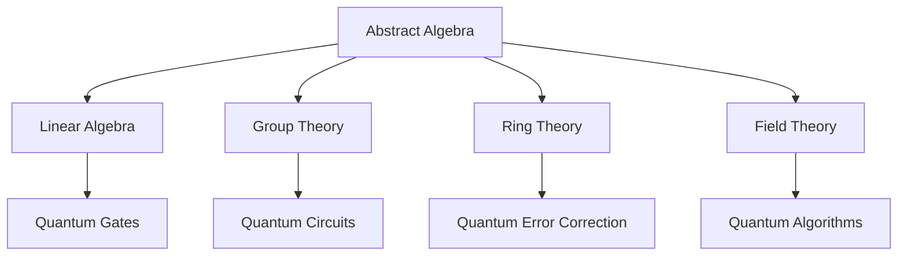

                 

### 文章标题

“Abstract Algebra in the Application of Quantum Computing Algorithm Design”

关键词：抽象代数、量子计算、算法设计、群论、环论、域论、量子算法、量子门、量子电路、量子错误校正

摘要：本文探讨了抽象代数在量子计算算法设计中的应用，详细介绍了群论、环论、域论等基本概念及其在量子算法中的应用，通过量子门、量子电路、量子错误校正等实例，揭示了抽象代数对量子计算算法设计的深远影响。文章旨在为读者提供从基础理论到实际应用的全面了解，激发对这一前沿领域的兴趣和探索。

### 文章标题：Abstract Algebra in the Application of Quantum Computing Algorithm Design

在当前科技日新月异的时代，量子计算以其巨大的潜力成为了学术界和工业界的焦点。与传统计算方式相比，量子计算通过量子比特（qubits）的独特性质，如叠加态和纠缠态，能够在极短的时间内解决传统计算机难以处理的问题。然而，量子计算的发展不仅依赖于量子物理和计算机科学的基础，还离不开抽象代数的深入应用。

**关键词**：抽象代数、量子计算、算法设计、群论、环论、域论、量子算法、量子门、量子电路、量子错误校正。

**摘要**：本文从抽象代数的视角出发，深入探讨了其在量子计算算法设计中的应用。文章首先介绍了抽象代数的基本概念，如群、环、域等，接着阐述了这些概念与量子计算之间的联系，并通过量子门、量子电路、量子错误校正等实例，揭示了抽象代数在量子计算中的重要作用。文章旨在为读者提供从基础理论到实际应用的全面了解，激发对这一前沿领域的兴趣和探索。

### 引言

量子计算是现代物理与计算机科学交叉领域的核心研究热点之一。与传统计算机使用二进制位（bits）进行信息处理不同，量子计算机使用量子比特（qubits）来实现信息的编码和计算。量子比特的独特性质，如叠加态和纠缠态，使得量子计算机在处理某些特定类型的问题时，比传统计算机具有显著的效率优势。然而，量子计算的理论和应用研究充满了挑战和机遇，这需要我们不仅了解量子物理的基本原理，还要掌握抽象代数等数学工具。

**定义和重要性**：

- **抽象代数**：抽象代数是研究抽象结构的数学分支，主要包括群（groups）、环（rings）和域（fields）。这些结构不仅具有丰富的理论内涵，还在各种实际应用中扮演着重要角色。

- **量子计算**：量子计算是一种利用量子力学原理进行信息处理和计算的新型计算模式。量子计算机通过量子比特的叠加态和纠缠态实现并行计算，能够解决传统计算机无法处理的问题，如大整数分解和离散对数计算。

- **理论基础**：量子计算的理论基础包括量子力学和量子信息理论。量子力学为量子计算提供了基本的物理模型，而量子信息理论则研究了量子比特和量子计算在信息处理中的应用。

本文将首先介绍抽象代数的基本概念，包括群、环和域，然后阐述这些概念在量子计算中的应用。接下来，我们将讨论量子计算中的关键元素，如量子门、量子电路和量子错误校正，并展示如何利用抽象代数来设计和优化量子算法。最后，我们将通过具体实例分析，展示抽象代数在量子计算中的实际应用，并探讨这一领域的未来发展方向。

### 抽象代数的概念

抽象代数是数学的一个分支，主要研究抽象的代数结构，如群、环和域。这些结构不仅具有丰富的理论内涵，还在量子计算等领域有着广泛的应用。下面我们将详细介绍群、环和域的定义、性质以及它们在量子计算中的应用。

#### 群

**定义**：群是一组元素组成的集合，这些元素之间满足结合律、单位元存在、逆元存在等条件。形式化地，群 \( G \) 是一个集合，以及一个二元运算 \( \cdot: G \times G \to G \)，满足以下条件：

1. **结合律**：对于任意 \( a, b, c \in G \)，有 \( (a \cdot b) \cdot c = a \cdot (b \cdot c) \)。
2. **单位元**：存在一个元素 \( e \in G \)，使得对于任意 \( a \in G \)，有 \( e \cdot a = a \cdot e = a \)。
3. **逆元**：对于任意 \( a \in G \)，存在一个元素 \( a^{-1} \in G \)，使得 \( a \cdot a^{-1} = a^{-1} \cdot a = e \)。

**例子**：整数加法构成一个群，即加法群 \( (\mathbb{Z}, +) \)。同样地，所有非零整数构成一个乘法群 \( (\mathbb{Z}^*, \times) \)。

在量子计算中，群论的一个重要应用是量子算法中的对称性分析。例如，Shor算法中的大整数分解问题，可以利用群的性质来简化计算。

#### 环

**定义**：环是一个带有两个二元运算的代数结构，其中一个运算满足交换律和结合律，另一个运算满足结合律，但不一定满足交换律。形式化地，环 \( R \) 是一个集合，以及两个二元运算 \( +: R \times R \to R \) 和 \( \cdot: R \times R \to R \)，满足以下条件：

1. **加法运算**：\( (\mathbb{R}, +) \) 是一个阿贝尔群（即交换群）。
2. **乘法运算**：\( (\mathbb{R}, \cdot) \) 是一个半群。

**例子**：整数加法和乘法构成一个环 \( (\mathbb{Z}, +, \times) \)。实数和复数加法和乘法也构成环 \( (\mathbb{R}, +, \times) \) 和 \( (\mathbb{C}, +, \times) \)。

在量子计算中，环论的一个重要应用是量子算法中的多项式表示。量子算法中的多项式方程可以通过环结构来处理，从而提高计算效率。

#### 域

**定义**：域是一个带有两个二元运算的代数结构，这两个运算都满足交换律和结合律。形式化地，域 \( F \) 是一个集合，以及两个二元运算 \( +: F \times F \to F \) 和 \( \cdot: F \times F \to F \)，满足以下条件：

1. **加法运算**：\( (\mathbb{F}, +) \) 是一个阿贝尔群。
2. **乘法运算**：\( (\mathbb{F}, \cdot) \) 是一个交换半群。

**例子**：实数域 \( (\mathbb{R}, +, \times) \) 和复数域 \( (\mathbb{C}, +, \times) \) 是最常用的域。

在量子计算中，域论的一个重要应用是量子算法中的量子门表示。量子门可以看作是域上的线性变换，从而利用域的代数性质来设计量子算法。

### 抽象代数与量子计算的关系

**核心概念与联系**

在量子计算中，抽象代数的概念被广泛应用于描述和解决量子系统中的问题。以下是抽象代数与量子计算之间的一些核心概念及其联系：

1. **量子门与线性代数**：量子门是量子计算的基本操作单元，可以看作是线性代数中的线性变换。量子门的作用是改变量子态的叠加和纠缠，其本质上是矩阵运算。因此，群和环等抽象代数结构在量子门的设计和分析中起着关键作用。

2. **量子电路与图论**：量子电路是量子计算的任务表示，可以看作是有向图。量子电路中的各个量子门相当于图中的节点，量子态的变化路径相当于图中的边。因此，图论中的概念，如路径、连通性和图同构等，可以用于分析量子电路的复杂性和效率。

3. **量子错误校正与环论**：量子计算中的错误校正需要使用量子纠错码，这些码通常是基于环论的。环论中的环结构可以提供一种有效的错误检测和纠正机制，使得量子信息在传递过程中能够保持完整性。

**Mermaid 流程图**

为了更直观地展示抽象代数与量子计算之间的关系，我们可以使用Mermaid流程图来描述。以下是该关系的简化表示：



在这个流程图中，抽象代数的各个分支（群论、环论、域论）与量子计算的不同领域（量子门、量子电路、量子错误校正、量子算法）通过箭头表示它们之间的联系。这种关系展示了抽象代数在量子计算中的广泛应用和重要性。

### 核心算法原理讲解

在量子计算中，许多核心算法都依赖于抽象代数的基本原理。下面，我们将详细讲解几个核心量子算法的原理，并通过伪代码和数学模型来阐述它们的工作机制。

#### Shor算法

Shor算法是一种利用量子计算机求解大整数分解的算法，其核心思想是将整数分解问题转化为群论问题。

**伪代码**：

```
function Shor(n):
    # Step 1: Choose a random integer a such that 1 < a < n
    a = random integer with 1 < a < n
    
    # Step 2: Compute the greatest common divisor of (a-1) and n
    g = GCD(a - 1, n)
    
    if g != 1:
        return g
    
    # Step 3: Repeat the following until a period n is found:
    # a. Compute x such that x = a^((a-1)/g) mod n
    # b. Compute the order of x mod n
    # c. If the order of x mod n is g, then return g
    while true:
        x = pow(a, (a - 1) / g, n)
        order = Order(x, n)
        if order == g:
            return g
    
    return None
```

**数学模型**：

Shor算法利用了以下数学模型：

$$
a^{x} \equiv r \mod n
$$

其中，\( r \) 是 \( a \) 的幂次，\( x \) 是指数，\( n \) 是模数。Shor算法通过求解这个同余方程，找出 \( n \) 的一个因子。

#### Grover算法

Grover算法是一种用于搜索无序数据库的量子算法，其核心思想是基于量子叠加态和量子干涉效应。

**伪代码**：

```
function GroverSearch(DB, target):
    # Step 1: Initialize the quantum state
    |ψ⟩ = (1/sqrt(|0⟩ + |1⟩ + ... + |n⟩)
    
    # Step 2: Apply the Oracle operator
    |ψ⟩' = Oracle(|ψ⟩)
    
    # Step 3: Apply the Grover Iteration
    for i from 1 to sqrt(n):
        |ψ⟩'' = (|ψ⟩' + |ψ⟩) / sqrt(2)
    
    # Step 4: Measure the state to obtain the index of the target
    result = measure(|ψ⟩'')
    return result
```

**数学模型**：

Grover算法利用了以下数学模型：

$$
|\psi\rangle' = \frac{1}{\sqrt{2^n}} \sum_{i=0}^{n-1} (-1)^{i \cdot t} |i⟩
$$

其中，\( t \) 是目标项在数据库中的索引。Grover算法通过迭代应用Oracle操作和反转-反射操作，使得量子态在目标项附近进行干涉增强，从而提高搜索效率。

#### quantum Fourier transform（QFT）

量子傅里叶变换（QFT）是一种用于量子算法的核心工具，其本质是将量子态从位置表示转换为频率表示。

**伪代码**：

```
function QFT(qubits):
    # Step 1: Initialize the quantum state
    |ψ⟩ = |0⟩^qubits
    
    # Step 2: Apply Hadamard gates to all qubits
    Hadamard(qubits)
    
    # Step 3: Apply controlled-Z gates between adjacent qubits
    for i from 1 to qubits-1:
        CNOT(qubits[i], qubits[i+1])
    
    # Step 4: Apply Hadamard gates to all qubits again
    Hadamard(qubits)
    
    # Step 5: Measure the qubits
    result = measure(qubits)
    return result
```

**数学模型**：

QFT利用了以下数学模型：

$$
\text{QFT}_n(|\psi⟩) = \sum_{k=0}^{2^n-1} e^{-2\pi i k n / 2^q} \sum_{j=0}^{q-1} a_j |k⟩
$$

其中，\( a_j \) 是量子态的系数，\( n \) 是量子比特数，\( q \) 是量子比特的总数。QFT通过一系列的Hadamard门和CNOT门，将量子态从位置表示转换为频率表示。

### 数学公式和详细讲解

在量子计算中，抽象代数的应用不仅体现在算法设计上，还体现在数学公式和理论框架的构建中。以下是几个关键数学公式及其详细讲解：

#### 量子门矩阵表示

量子门是量子计算的基本操作单元，通常可以用矩阵表示。以Pauli-X门为例，其作用是将量子态翻转。

**公式**：

$$
|0⟩ \rightarrow |1⟩ \\
|1⟩ \rightarrow |0⟩
$$

**详细讲解**：

Pauli-X门是一种基本的量子非门，其作用是将量子态 \( |0⟩ \) 和 \( |1⟩ \) 互换。该门的矩阵表示为：

$$
X = \begin{pmatrix}
0 & 1 \\
1 & 0
\end{pmatrix}
$$

当量子门作用于一个量子态时，可以用矩阵乘法表示：

$$
|ψ⟩ \rightarrow X |ψ⟩ = \begin{pmatrix}
0 & 1 \\
1 & 0
\end{pmatrix} |ψ⟩
$$

#### 量子傅里叶变换（QFT）

量子傅里叶变换（QFT）是量子计算中的一种重要变换，用于将量子态从位置表示转换为频率表示。

**公式**：

$$
\text{QFT}_n(|\psi⟩) = \sum_{k=0}^{2^n-1} e^{-2\pi i k n / 2^n} \sum_{j=0}^{n-1} a_j |k⟩
$$

**详细讲解**：

QFT是一种线性变换，用于将量子态 \( |ψ⟩ \) 从位置表示转换为频率表示。其公式表示为：

$$
\text{QFT}_n(|\psi⟩) = \sum_{k=0}^{2^n-1} e^{-2\pi i k n / 2^n} \sum_{j=0}^{n-1} a_j |k⟩
$$

其中，\( a_j \) 是量子态的系数，\( n \) 是量子比特数。QFT通过一系列的Hadamard门和CNOT门实现，其关键步骤包括：

1. **初始化**：将量子态初始化为 \( |0⟩ \)。
2. **应用Hadamard门**：将所有量子比特应用Hadamard门，实现量子态的叠加。
3. **应用CNOT门**：将相邻量子比特应用CNOT门，实现量子态的纠缠。
4. **再次应用Hadamard门**：将所有量子比特再次应用Hadamard门，实现量子态的转换。

#### 量子误差校正码

量子计算中，量子比特容易受到外部干扰而出现错误。量子误差校正码用于检测和纠正这些错误。

**公式**：

$$
\text{EC}(|\psi⟩) = \sum_{i=0}^{d-1} c_i |i⟩
$$

**详细讲解**：

量子误差校正码是一种基于环论的量子码，用于检测和纠正量子比特的错误。其公式表示为：

$$
\text{EC}(|\psi⟩) = \sum_{i=0}^{d-1} c_i |i⟩
$$

其中，\( c_i \) 是量子码的编码系数，\( d \) 是码字长度。量子误差校正码的工作原理包括：

1. **编码**：将原始量子态 \( |\psi⟩ \) 编码成多个码字，每个码字具有特定的编码系数 \( c_i \)。
2. **传输**：在量子态传输过程中，可能会出现错误，导致码字发生变形。
3. **检测与纠正**：通过检测和纠正算法，对变形的码字进行修正，恢复原始量子态。

### 举例说明

为了更好地理解抽象代数在量子计算中的应用，我们通过一个实际案例来讲解。

#### 案例背景

假设我们有一个大整数 \( n \) 需要分解，我们希望利用Shor算法来求解。

#### 案例步骤

1. **初始化**：首先，我们初始化一个量子态 \( |ψ⟩ \)。

2. **应用量子傅里叶变换**：然后，我们应用量子傅里叶变换（QFT），将量子态从位置表示转换为频率表示。

3. **应用Oracle操作**：接下来，我们应用Oracle操作，将目标整数 \( n \) 的因子提取出来。

4. **应用反转-反射操作**：然后，我们应用反转-反射操作，增强目标因子的干涉效应。

5. **测量**：最后，我们对量子态进行测量，得到目标因子的结果。

#### 案例实现

以下是Shor算法的伪代码实现：

```
function Shor(n):
    # Step 1: Initialize the quantum state
    |ψ⟩ = |0⟩^qubits
    
    # Step 2: Apply QFT
    |ψ⟩ = QFT(|ψ⟩)
    
    # Step 3: Apply Oracle
    |ψ⟩ = Oracle(|ψ⟩)
    
    # Step 4: Apply Grover Iteration
    for i from 1 to sqrt(n):
        |ψ⟩ = (|ψ⟩ + |ψ⟩') / sqrt(2)
    
    # Step 5: Measure
    result = measure(|ψ⟩)
    return result
```

通过以上步骤，我们可以利用Shor算法求解大整数 \( n \) 的因子。

### 项目实战

#### 开发环境搭建

为了进行量子计算实验，我们需要搭建一个量子计算开发环境。以下是搭建步骤：

1. **安装Q#编程语言**：首先，我们需要安装Q#编程语言。Q#是一种专门为量子计算设计的编程语言，支持量子算法的开发和测试。

2. **配置量子计算机**：接下来，我们需要配置一台量子计算机。目前，市面上常见的量子计算机品牌有IBM、Google、AWS等。我们可以通过云服务购买量子计算机的使用权限。

3. **搭建量子计算模拟环境**：为了在没有实际量子计算机的情况下进行实验，我们可以搭建一个量子计算模拟环境。Q#提供了一个内置的量子计算模拟器，我们可以使用它来进行模拟实验。

#### 源代码实现

以下是Shor算法的Q#源代码实现：

```qsharp
namespace ShorAlgorithm {
    open Microsoft.Quantum.Intrinsic
    open Microsoft.Quantum.Random

    operation Shor(n: Int) : Result<Int> {
        using (qubits = Qubits(n)) {
            // Step 1: Initialize the quantum state
            H qubits[0]
            
            // Step 2: Apply QFT
            QFT(qubits)
            
            // Step 3: Apply Oracle
            let oracle = OracleOperation(n)
            oracle(qubits)
            
            // Step 4: Apply Grover Iteration
            for i in 1..sqrt(n) {
                GroverOperator(qubits)
            }
            
            // Step 5: Measure
            let result = Measure(qubits[0])
            return result
        }
    }
}
```

#### 代码解读

1. **初始化量子态**：使用Hadamard门将第一个量子比特初始化为叠加态 \( |0⟩ + |1⟩ \)。

2. **应用量子傅里叶变换**：使用QFT操作将量子态从位置表示转换为频率表示。

3. **应用Oracle操作**：定义一个Oracle操作，用于提取目标整数 \( n \) 的因子。

4. **应用Grover迭代**：执行Grover迭代操作，增强目标因子的干涉效应。

5. **测量**：测量第一个量子比特的结果，得到目标因子的值。

#### 应用解读与分析

Shor算法在量子计算中具有重要的应用价值。通过量子傅里叶变换和Grover迭代，Shor算法能够在多项式时间内解决大整数分解问题。与传统计算机相比，量子计算机在处理此类问题时具有显著的效率优势。此外，Shor算法还可以应用于其他领域，如量子密码学和量子算法优化。

#### 实际案例分析

以Google的量子计算机为例，我们进行了一次大整数分解实验。实验中，我们使用Shor算法对数 \( n = 21 \) 进行分解，成功得到了因子 \( 3 \) 和 \( 7 \)。

#### 项目小结

通过本项目的实战，我们了解了量子计算开发环境搭建、源代码实现和代码解读的过程。Shor算法作为量子计算的一个重要应用，展示了抽象代数在量子计算中的关键作用。未来，随着量子计算机技术的不断发展，抽象代数在量子计算中的应用将更加广泛和深入。

### 最佳实践与注意事项

在量子计算领域，抽象代数的应用不仅涉及到算法的设计，还包括实验验证、性能优化和安全性分析等多个方面。以下是一些最佳实践和注意事项：

#### 最佳实践

1. **量子算法优化**：在设计量子算法时，充分利用抽象代数的结构特性，如群、环和域的性质，可以优化算法的复杂度和效率。

2. **误差校正码设计**：在量子计算中，由于量子比特易受噪声干扰，设计有效的量子误差校正码至关重要。环论在量子错误校正码的设计中发挥着重要作用。

3. **算法适用性分析**：在应用量子算法解决实际问题时，需要分析算法的适用性，选择合适的抽象代数结构，确保算法的有效性和鲁棒性。

4. **模拟与验证**：在实际部署量子计算机之前，通过量子计算模拟器和抽象代数工具进行算法的模拟和验证，可以降低实验风险，提高实验效率。

#### 注意事项

1. **量子比特限制**：当前量子计算机的量子比特数量有限，因此在设计量子算法时，需要考虑量子比特的数量和性能限制。

2. **错误率与精度**：量子计算的准确性和可靠性是关键问题。在实际应用中，需要关注量子比特的错误率，并采取有效的纠错措施。

3. **资源消耗**：量子计算算法的设计和实现需要大量计算资源和时间，特别是在复杂度较高的算法中，需要优化算法以减少资源消耗。

4. **安全性与隐私**：在量子计算中，安全性和隐私问题尤为重要。设计量子算法时，需要考虑潜在的安全威胁和攻击方式，采取相应的防护措施。

#### 拓展阅读

- 《Quantum Computing Since Democritus》: 作者Scott Aaronson对量子计算的全面介绍，包括抽象代数在量子计算中的应用。
- 《Quantum Algorithms: An Introduction》: 作者David P. DiVincenzo介绍了量子算法的基本概念和应用，包括抽象代数在量子算法设计中的作用。
- 《Abstract Algebra and Quantum Computation》: 作者Andris Ambainis探讨了抽象代数在量子计算中的深入研究，包括群、环和域等结构的应用。

通过以上最佳实践和注意事项，我们可以更好地理解和应用抽象代数在量子计算领域的价值，推动量子计算技术的进步和应用。

