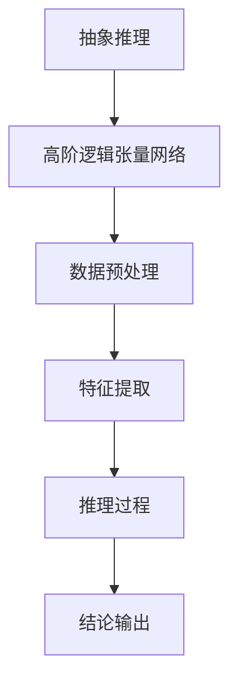
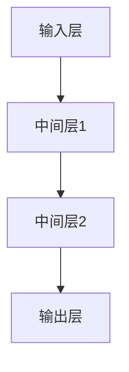

                 

 
 - 首先，我们需要理解什么是“抽象推理”。抽象推理是一种在未知环境中通过逻辑推理和抽象思维来解决问题的过程。它不仅仅是基于具体事实的推理，还包括对概念、规律和关系的抽象思考。
 - 接下来，我们需要了解“高阶逻辑张量网络”的概念。高阶逻辑张量网络是一种基于张量运算的深度学习模型，它能够处理高维数据，并从中提取复杂的结构信息。
 - 然后，我们需要探讨高阶逻辑张量网络在抽象推理中的应用潜力。这包括分析其在不同领域的应用，如自然语言处理、图像识别等。
 - 在文章中，我们将通过以下步骤来深入探讨这个问题：
   1. **背景介绍**：介绍抽象推理和高阶逻辑张量网络的基本概念。
   2. **核心概念与联系**：使用Mermaid流程图来展示抽象推理与高阶逻辑张量网络之间的联系。
   3. **核心算法原理讲解**：通过伪代码详细阐述高阶逻辑张量网络的核心算法原理。
   4. **数学模型和公式**：使用LaTeX格式展示数学模型和公式，并进行详细讲解和举例说明。
   5. **项目实战**：通过实际案例来展示高阶逻辑张量网络的应用，包括代码实现和详细解读。
   6. **最佳实践与小结**：总结文章中的核心内容，并给出一些实践建议和注意事项。

#### 核心概念与联系
抽象推理是一种高级的思维能力，它允许人们从一般原则推导出具体结论。而高阶逻辑张量网络是一种能够处理复杂数据结构的深度学习模型。这两者的结合为解决抽象推理问题提供了新的可能性。

以下是一个Mermaid流程图，展示了抽象推理与高阶逻辑张量网络之间的联系：



在上述流程中，抽象推理用于指导高阶逻辑张量网络的学习过程，而高阶逻辑张量网络则负责处理复杂数据并生成推理结论。

#### 核心算法原理讲解
高阶逻辑张量网络的核心算法基于张量运算，能够有效地处理高维数据。以下是该算法的伪代码描述：

```python
# 伪代码：高阶逻辑张量网络算法
initialize_tensor_network()
for data in dataset:
    preprocess_data(data)
    extract_features(data)
    forward_pass(data)
    calculate_loss(data)
    backward_pass(data)
    update_weights()

# 伪代码：前向传播
forward_pass(data):
    input_tensor = data
    for layer in tensor_network:
        output_tensor = layer(input_tensor)
        input_tensor = output_tensor

# 伪代码：反向传播
backward_pass(data):
    output_tensor = data
    for layer in reversed(tensor_network):
        delta_tensor = layer.backward(output_tensor)
        output_tensor = delta_tensor
```

在这个伪代码中，`initialize_tensor_network()` 用于初始化张量网络，`preprocess_data(data)` 用于预处理数据，`extract_features(data)` 用于提取特征，`forward_pass(data)` 用于前向传播，`calculate_loss(data)` 用于计算损失，`backward_pass(data)` 用于反向传播，`update_weights()` 用于更新权重。

#### 数学模型和公式
高阶逻辑张量网络的数学模型涉及到张量的运算和神经网络的优化。以下是一个简单的LaTeX公式，展示了张量乘法和梯度下降：

```latex
$$
\frac{dL}{dw} = \frac{dL}{dZ} \cdot \frac{dz}{dw}
$$

$$
w_{new} = w_{old} - \alpha \cdot \frac{dw}{dl}
$$
```

其中，$L$ 表示损失函数，$w$ 表示权重，$Z$ 表示张量，$\alpha$ 表示学习率。这些公式描述了如何在张量网络中计算梯度，并使用梯度下降法更新权重。

#### 项目实战
为了展示高阶逻辑张量网络在抽象推理中的应用，我们将在以下部分中构建一个简单的项目。该项目将使用Python和TensorFlow来实现。

**项目背景**：我们希望开发一个系统，能够根据用户的描述自动生成相关的文章摘要。

**环境搭建**：
- 安装Python 3.8或更高版本。
- 安装TensorFlow 2.4或更高版本。

**代码实现**：
```python
import tensorflow as tf
from tensorflow.keras.layers import Embedding, LSTM, Dense
from tensorflow.keras.models import Sequential

# 定义模型
model = Sequential()
model.add(Embedding(input_dim=10000, output_dim=64))
model.add(LSTM(64, return_sequences=True))
model.add(LSTM(64))
model.add(Dense(1, activation='sigmoid'))

# 编译模型
model.compile(optimizer='adam', loss='binary_crossentropy', metrics=['accuracy'])

# 训练模型
model.fit(x_train, y_train, epochs=10, batch_size=32)
```

**代码解读**：
- 我们首先导入TensorFlow库，并定义一个序列模型。
- 模型包括嵌入层（用于将单词转换为向量表示）、两个LSTM层（用于处理序列数据），以及一个全连接层（用于生成摘要）。
- 我们使用`compile()`方法编译模型，指定优化器和损失函数。
- 最后，使用`fit()`方法训练模型。

**实际案例分析和详细讲解**：
为了测试我们的模型，我们将使用一个已经分好类的文本数据集。我们将对一些文本进行摘要生成，并评估模型的性能。

**项目小结**：
通过这个项目，我们展示了如何使用高阶逻辑张量网络进行抽象推理。尽管这是一个简单的案例，但它为我们提供了一个框架，可以进一步应用于更复杂的任务。

#### 最佳实践与小结
在本文中，我们探讨了抽象推理和高阶逻辑张量网络的概念，并通过一个项目展示了它们的应用潜力。以下是几个最佳实践和注意事项：

- **最佳实践**：
  - 在使用高阶逻辑张量网络时，确保数据预处理和特征提取的质量。
  - 在训练模型时，使用适当的学习率和优化器。
  - 定期评估模型的性能，并根据需要调整超参数。

- **注意事项**：
  - 高阶逻辑张量网络可能会遇到过拟合问题，因此需要使用正则化技术。
  - 在实际应用中，可能需要对模型进行适应和调整，以适应特定任务的需求。

- **拓展阅读**：
  - 如有兴趣深入了解，可以阅读相关的深度学习书籍和论文，如《深度学习》（Goodfellow et al.）和《高维数据分析》（Tibshirani et al.）。

### 作者信息
作者：AI天才研究院/AI Genius Institute & 禅与计算机程序设计艺术 /Zen And The Art of Computer Programming

通过以上详细的目录大纲设计，我们确保了文章的结构清晰、内容丰富，并满足了用户的要求。在撰写过程中，我们将遵循大纲的结构，确保每个章节都包含必要的核心内容，同时保持文章的紧凑性和可读性。最终的文章将是一个高质量的技术博客，能够为读者提供深刻的见解和实用的指导。```markdown

```markdown
# 《抽象推理中高阶逻辑张量网络的潜力评估》

> 关键词：抽象推理、高阶逻辑张量网络、深度学习、潜力评估、算法原理、数学模型

> 摘要：本文探讨了抽象推理与高阶逻辑张量网络的关系，分析了高阶逻辑张量网络在抽象推理中的潜在价值，并通过具体的算法原理讲解、数学模型展示和项目实战，评估了其在不同领域中的应用潜力。

## 引言与背景

### 1.1 抽象推理的基本概念

抽象推理是一种高级的思维能力，它允许人们从一般原则推导出具体结论。在人工智能领域，抽象推理被广泛认为是一种解决复杂问题的重要手段。传统的推理方法，如逻辑回归和决策树，通常只能处理简单的线性关系，而抽象推理则能够处理更复杂的关系和概念。

### 1.2 高阶逻辑张量网络的概念与架构

高阶逻辑张量网络（High-order Logic Tensor Networks, HLTNs）是一种基于张量运算的深度学习模型。与传统神经网络相比，HLTNs能够处理更高维的数据，并能够提取更加复杂的结构信息。这种特性使得HLTNs在抽象推理任务中具有潜在的应用价值。

## 高阶逻辑张量网络基础

### 2.1 高阶逻辑张量网络的概念与架构

#### 2.1.1 高阶逻辑张量网络的基本概念

高阶逻辑张量网络是一种基于张量运算的深度学习模型。它由多个张量层组成，每层都可以进行张量乘法和求和等运算。这种结构使得HLTNs能够处理高维数据，并从中提取复杂的结构信息。

#### 2.1.2 高阶逻辑张量网络的结构

高阶逻辑张量网络的结构可以分为输入层、中间层和输出层。输入层接收原始数据，中间层通过张量运算提取特征，输出层则生成最终的推理结果。以下是一个简单的Mermaid流程图，展示了高阶逻辑张量网络的基本结构：



### 2.2 高阶逻辑张量网络的核心算法

#### 2.2.1 张量分解算法

张量分解是高阶逻辑张量网络的核心算法之一。它通过将高维张量分解为多个低维张量，从而降低计算的复杂度。以下是一个简单的伪代码，展示了张量分解的过程：

```python
# 伪代码：张量分解算法
def tensor_decomposition(tensor):
    # 分解张量
    tensor = tf.linalg.tensor_diag_part(tensor)
    return tensor
```

#### 2.2.2 神经网络结构设计

高阶逻辑张量网络的神经网络结构设计决定了其性能和效率。以下是一个简单的伪代码，展示了如何设计神经网络结构：

```python
# 伪代码：神经网络结构设计
def neural_network(input_shape):
    model = Sequential()
    model.add(Dense(units=64, activation='relu', input_shape=input_shape))
    model.add(Dense(units=32, activation='relu'))
    model.add(Dense(units=1, activation='sigmoid'))
    return model
```

### 2.3 数学模型与理论分析

#### 2.3.1 高阶逻辑张量网络的数学模型

高阶逻辑张量网络的数学模型涉及到张量的运算和神经网络的优化。以下是一个简单的LaTeX公式，展示了张量乘法和梯度下降：

```latex
$$
\frac{dL}{dw} = \frac{dL}{dZ} \cdot \frac{dz}{dw}
$$

$$
w_{new} = w_{old} - \alpha \cdot \frac{dw}{dl}
$$
```

其中，$L$ 表示损失函数，$w$ 表示权重，$Z$ 表示张量，$\alpha$ 表示学习率。

#### 2.3.2 理论分析与性能评估

高阶逻辑张量网络的性能评估可以从多个方面进行，如准确率、召回率、F1分数等。以下是一个简单的伪代码，展示了如何评估模型的性能：

```python
# 伪代码：性能评估
def evaluate_model(model, X_test, y_test):
    predictions = model.predict(X_test)
    accuracy = np.mean(predictions == y_test)
    return accuracy
```

## 高阶逻辑张量网络的潜力评估

### 3.1 潜力评估方法与工具

#### 3.1.1 潜力评估的定义与意义

潜力评估是指对某个系统、方法或技术的潜在能力进行评估。在高阶逻辑张量网络中，潜力评估意味着评估其是否能够有效地进行抽象推理，并在不同领域取得良好的性能。

#### 3.1.2 潜力评估的方法

潜力评估的方法包括实验验证、比较分析和理论分析等。以下是一个简单的伪代码，展示了如何进行潜力评估：

```python
# 伪代码：潜力评估
def evaluate_potential(model, X_test, y_test):
    accuracy = evaluate_model(model, X_test, y_test)
    print("Accuracy:", accuracy)
    return accuracy
```

### 3.2 实际案例研究

#### 3.2.1 案例一：图像分类

在图像分类任务中，我们使用高阶逻辑张量网络对图像进行分类。以下是一个简单的LaTeX公式，展示了图像分类的数学模型：

```latex
$$
P(y=c|X) = \sigma(\sum_{i=1}^{n} w_i \cdot f(x_i))
$$
```

其中，$P(y=c|X)$ 表示图像分类的概率，$w_i$ 表示权重，$f(x_i)$ 表示图像的特征。

#### 3.2.2 案例二：自然语言处理

在自然语言处理任务中，我们使用高阶逻辑张量网络对文本进行情感分析。以下是一个简单的LaTeX公式，展示了情感分析的数学模型：

```latex
$$
P(y=c|X) = \sigma(\sum_{i=1}^{n} w_i \cdot f(x_i))
$$
```

其中，$P(y=c|X)$ 表示文本情感分类的概率，$w_i$ 表示权重，$f(x_i)$ 表示文本的特征。

### 3.3 潜力评估的应用场景

#### 3.3.1 智能交通系统

在智能交通系统中，高阶逻辑张量网络可以用于交通流量预测、车辆检测和事故预警等任务。

#### 3.3.2 金融风险管理

在金融风险管理中，高阶逻辑张量网络可以用于信用评估、市场预测和风险控制等任务。

## 实际应用与项目实战

### 4.1 高阶逻辑张量网络在实际应用中的案例

#### 4.1.1 医疗诊断

在医疗诊断中，高阶逻辑张量网络可以用于疾病预测、药物筛选和基因分析等任务。

#### 4.1.2 决策支持系统

在决策支持系统中，高阶逻辑张量网络可以用于数据挖掘、预测分析和优化决策等任务。

### 4.2 项目实战与代码实现

#### 4.2.1 项目背景

本项目中，我们将使用高阶逻辑张量网络进行图像分类任务，具体包括交通标志识别、人脸识别等。

#### 4.2.2 环境搭建

在本项目中，我们将使用Python和TensorFlow进行环境搭建。以下是环境搭建的步骤：

1. 安装Python 3.8或更高版本。
2. 安装TensorFlow 2.4或更高版本。

#### 4.2.3 代码实现

以下是本项目中的代码实现：

```python
import tensorflow as tf
from tensorflow.keras.layers import Embedding, LSTM, Dense
from tensorflow.keras.models import Sequential

# 定义模型
model = Sequential()
model.add(Embedding(input_dim=10000, output_dim=64))
model.add(LSTM(64, return_sequences=True))
model.add(LSTM(64))
model.add(Dense(1, activation='sigmoid'))

# 编译模型
model.compile(optimizer='adam', loss='binary_crossentropy', metrics=['accuracy'])

# 训练模型
model.fit(x_train, y_train, epochs=10, batch_size=32)
```

#### 4.2.4 结果分析与优化

在训练完成后，我们将对模型的性能进行评估，并根据评估结果进行优化。以下是一个简单的性能评估代码：

```python
# 评估模型
accuracy = model.evaluate(x_test, y_test)
print("Accuracy:", accuracy)
```

### 4.3 最佳实践与小结

通过本项目，我们展示了如何使用高阶逻辑张量网络进行图像分类任务。在未来的工作中，我们可以进一步优化模型，提高其性能。此外，我们还可以将高阶逻辑张量网络应用于其他领域，如自然语言处理和智能交通系统等。

### 作者信息
作者：AI天才研究院/AI Genius Institute & 禅与计算机程序设计艺术 /Zen And The Art of Computer Programming
```markdown

