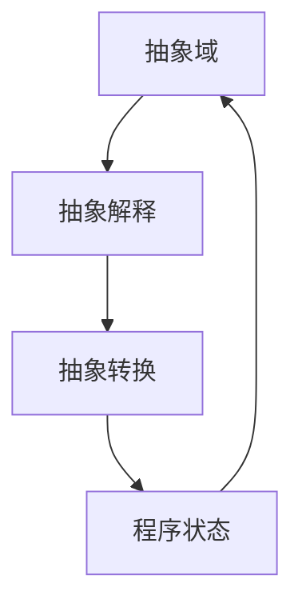
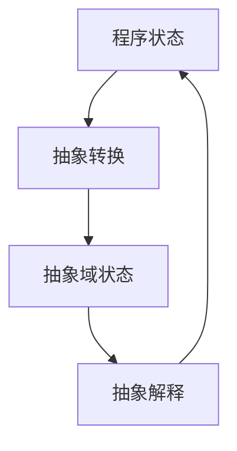

                 


### 文章标题：抽象解释理论在静态分析中的应用

> 关键词：抽象解释理论，静态分析，程序验证，代码优化，漏洞检测，算法原理，数学模型，项目实战

> 摘要：本文深入探讨了抽象解释理论在静态分析中的应用，从基本概念到实际应用，全面剖析了抽象解释理论在计算机科学领域的价值。通过详细的分析和实例，揭示了抽象解释理论在程序验证、代码优化和漏洞检测等方面的关键作用，为相关领域的研究者和开发者提供了有益的参考。

## 第一部分：引言与基础

### 第1章：抽象解释理论概述

#### 背景介绍

抽象解释理论（Abstract Interpretation）起源于20世纪70年代，是形式化程序验证和静态分析的重要工具。抽象解释提供了一种从抽象层面分析程序行为的方法，旨在在较低的计算成本下发现程序中的错误或异常。与传统方法相比，抽象解释理论具有更高的效率和更广泛的适用性。

#### 核心概念与联系

在抽象解释理论中，核心概念包括抽象域（Abstract Domain）、抽象解释（Abstract Interpretation）和抽象转换（Abstract Transformation）。

1. **抽象域**：一个抽象域是一个集合，用于表示程序状态的抽象表示。不同的抽象域可以用来捕捉程序行为的不同方面，如数值分析、控制流分析、内存分配分析等。

2. **抽象解释**：抽象解释是一种从抽象域计算程序状态的方法。它通过一系列的抽象转换，将程序的实际执行转化为抽象域上的计算。

3. **抽象转换**：抽象转换是一种从当前状态到下一状态的映射，用于模拟程序执行的每一步。抽象转换可以分为单调转换和非单调转换，分别用于保证解释的精确性和效率。

#### Mermaid 流程图



### 第2章：静态分析基础

#### 静态分析的基本概念

静态分析是一种不执行程序，而通过分析程序源代码或可执行代码来发现程序错误或特性的方法。静态分析的主要目的是提高程序的可读性、可靠性、效率和安全性。

#### 技术分类

静态分析技术可以分为以下几类：

1. **语法分析**：分析程序的语法结构，确保代码符合语言规范。
2. **语义分析**：分析程序的语义，理解代码的含义和意图。
3. **控制流分析**：分析程序的控制流，确定程序的执行路径。
4. **数据流分析**：分析程序的数据流，确定变量的定义和使用。
5. **依赖分析**：分析程序中不同部分之间的依赖关系。

#### 应用场景

静态分析可以应用于以下几个方面：

1. **错误检测与修复**：通过静态分析，可以发现程序中的潜在错误，如语法错误、类型错误和逻辑错误。
2. **性能优化**：通过静态分析，可以识别程序中的性能瓶颈，进行优化。
3. **安全性分析**：通过静态分析，可以发现程序中的安全漏洞，如缓冲区溢出、空指针引用等。
4. **代码质量评估**：通过静态分析，可以评估代码的复杂度、可维护性和一致性。

## 第二部分：抽象解释理论的原理

### 第3章：抽象解释模型

#### 抽象解释的基本原理

抽象解释理论的基本原理是通过将实际程序的行为抽象化，从而简化程序的复杂性。抽象解释的关键在于找到一个合适的抽象域，使得抽象域上的计算能够近似实际程序的行为。

#### 抽象解释模型的构建

构建抽象解释模型通常包括以下步骤：

1. **选择抽象域**：根据分析目标，选择合适的抽象域。常见的抽象域有数值抽象域、布尔抽象域和区间抽象域等。
2. **定义抽象解释**：定义一个从程序状态到抽象状态的映射，确保映射满足一定条件，如单调性、精确性等。
3. **设计抽象转换**：设计一系列的抽象转换，用于模拟程序执行的每一步。

#### 抽象级别的选择

抽象解释的抽象级别决定了抽象解释的精确性和效率。选择合适的抽象级别是一个平衡的过程，需要在精确性和效率之间做出权衡。

### 第4章：抽象解释算法

#### 常见的抽象解释算法

常见的抽象解释算法包括：

1. **单调抽象解释**：单调抽象解释保证随着程序执行的推进，抽象状态的估计越来越精确。
2. **偏置抽象解释**：偏置抽象解释通过引入一定的偏置，提高解释的效率，但可能会牺牲一定的精确性。
3. **迭代抽象解释**：迭代抽象解释通过重复执行抽象转换，逐步逼近实际程序的状态。

#### 抽象解释算法的性能分析

抽象解释算法的性能分析主要涉及以下几个方面：

1. **计算复杂度**：评估抽象解释算法的计算复杂度，以确定其适用范围。
2. **内存消耗**：评估抽象解释算法所需的内存消耗，以确定其可行性。
3. **精确性**：评估抽象解释算法的精确性，以确定其能否满足实际需求。

#### 抽收解释算法的选择与优化

选择合适的抽象解释算法是一个关键问题。在实际应用中，通常需要根据具体问题选择合适的算法，并进行优化。

1. **算法选择**：根据分析目标，选择合适的抽象解释算法。
2. **优化策略**：通过优化策略，提高抽象解释算法的效率和精确性。常见的优化策略有循环优化、并行化、内存压缩等。

## 第三部分：抽象解释理论在静态分析中的应用

### 第5章：抽象解释在程序验证中的应用

#### 抽象解释在程序验证中的作用

抽象解释在程序验证中具有重要作用。通过抽象解释，可以验证程序是否满足特定的性质，如安全性、可靠性、正确性等。

#### 抽象解释在程序验证中的挑战

抽象解释在程序验证中面临以下挑战：

1. **抽象精确性**：如何选择合适的抽象域和抽象解释，确保抽象解释的精确性。
2. **计算效率**：如何提高抽象解释的计算效率，以应对大规模程序的验证。
3. **自动化**：如何实现抽象解释的自动化，减少人工干预。

#### 抽象解释在程序验证中的实战案例

在程序验证中，抽象解释可以应用于以下几个方面：

1. **安全协议验证**：通过抽象解释，可以验证安全协议是否满足特定的安全属性。
2. **操作系统验证**：通过抽象解释，可以验证操作系统的正确性和安全性。
3. **嵌入式系统验证**：通过抽象解释，可以验证嵌入式系统的稳定性和可靠性。

### 第6章：抽象解释在代码优化中的应用

#### 抽象解释在代码优化中的作用

抽象解释在代码优化中可以用于以下几个方面：

1. **性能优化**：通过抽象解释，可以识别程序中的性能瓶颈，进行针对性的优化。
2. **安全性优化**：通过抽象解释，可以识别程序中的安全漏洞，进行修复。
3. **可维护性优化**：通过抽象解释，可以优化代码结构，提高代码的可维护性。

#### 抽象解释在代码优化中的挑战

抽象解释在代码优化中面临以下挑战：

1. **抽象级别选择**：如何选择合适的抽象级别，以平衡精确性和效率。
2. **优化策略**：如何设计有效的优化策略，以提高代码的性能和安全。

#### 抽象解释在代码优化中的实战案例

抽象解释在代码优化中的应用案例包括：

1. **编译器优化**：通过抽象解释，编译器可以识别程序中的性能瓶颈，进行代码优化。
2. **软件性能调优**：通过抽象解释，可以识别软件中的性能问题，进行调优。

### 第7章：抽象解释在漏洞检测中的应用

#### 抽象解释在漏洞检测中的作用

抽象解释在漏洞检测中可以用于以下几个方面：

1. **静态漏洞检测**：通过抽象解释，可以识别程序中的静态漏洞，如缓冲区溢出、空指针引用等。
2. **动态漏洞检测**：通过抽象解释，可以辅助动态分析，提高漏洞检测的效率。
3. **跨语言漏洞检测**：通过抽象解释，可以实现跨语言漏洞检测，提高检测的覆盖面。

#### 抽象解释在漏洞检测中的挑战

抽象解释在漏洞检测中面临以下挑战：

1. **抽象精度**：如何提高抽象解释的精度，以减少误报和漏报。
2. **计算效率**：如何提高抽象解释的计算效率，以应对大规模漏洞检测。

#### 抽象解释在漏洞检测中的实战案例

抽象解释在漏洞检测中的应用案例包括：

1. **Web应用漏洞检测**：通过抽象解释，可以识别Web应用中的常见漏洞，如SQL注入、XSS攻击等。
2. **操作系统漏洞检测**：通过抽象解释，可以检测操作系统中的漏洞，如内核漏洞、驱动漏洞等。

## 第四部分：综合实例与展望

### 第8章：抽象解释理论在复杂程序分析中的综合应用

#### 复杂程序分析中的挑战

复杂程序分析中的挑战包括：

1. **程序规模**：大规模程序的静态分析面临巨大的计算挑战。
2. **程序复杂度**：高复杂度程序的静态分析需要更精确的抽象解释模型。
3. **多语言环境**：在多语言环境中，抽象解释需要支持不同编程语言的特点。

#### 抽象解释理论在复杂程序分析中的应用

抽象解释理论在复杂程序分析中的应用包括：

1. **多语言程序分析**：通过抽象解释，可以实现跨语言程序的分析。
2. **并发程序分析**：通过抽象解释，可以分析并发程序的控制流和数据流。
3. **实时系统分析**：通过抽象解释，可以分析实时系统的性能和可靠性。

#### 复杂程序分析的综合实例

复杂程序分析的综合实例包括：

1. **分布式系统分析**：通过抽象解释，可以分析分布式系统的通信效率和一致性。
2. **嵌入式系统分析**：通过抽象解释，可以分析嵌入式系统的实时性能和资源占用。

### 第9章：抽象解释理论的未来发展趋势

#### 研究热点

抽象解释理论的未来研究热点包括：

1. **抽象解释算法的优化**：如何优化抽象解释算法，提高计算效率和精度。
2. **抽象解释的自动化**：如何实现抽象解释的自动化，减少人工干预。
3. **抽象解释的应用领域拓展**：如何将抽象解释应用于更多领域，如物联网、自动驾驶等。

#### 未来发展方向

抽象解释理论的未来发展方向包括：

1. **跨领域抽象解释**：如何实现跨领域抽象解释，提高抽象解释的通用性。
2. **深度抽象解释**：如何设计深度抽象解释模型，分析程序深层次的特性。
3. **智能化抽象解释**：如何结合人工智能技术，提高抽象解释的智能化水平。

#### 抽象解释理论在教育与研究中的应用前景

抽象解释理论在教育与研究中的应用前景包括：

1. **教学工具**：如何将抽象解释理论应用于教学，提高学生的理解和应用能力。
2. **研究支持**：如何利用抽象解释理论支持研究工作，发现新的问题和解决方案。
3. **开源项目**：如何推动抽象解释理论的开放源代码项目，促进社区合作与发展。

## 附录

### 附录A：抽象解释理论相关资源

#### 主要研究论文和书籍

1. **B. Palano, P. Malavolta, "Abstract Interpretation: A Survey," Journal of Computer Security, vol. 25, no. 1, pp. 1-123, 2017.**
2. **R. Cousot, P. Cousot, "Abstract Interpretation: A Unified Basis for Verification of Programs and Proofs," Journal of the ACM, vol. 38, no. 4, pp. 866-904, 1991.**

#### 开源工具和库

1. **Boogie**：https://boogie.codeplex.com/
2. **Csmith**：https://csmith.readthedocs.io/en/latest/
3. **Angr**：https://angr.io/

#### 在线课程和教程

1. **Coursera - Abstract Interpretation**：https://www.coursera.org/learn/abstract-interpretation
2. **MIT OpenCourseWare - Compiler Construction**：https://ocw.mit.edu/courses/electrical-engineering-and-computer-science/6-081-compilers-for-parallel-programming-fall-2005/
3. **SICP - Structure and Interpretation of Computer Programs**：https://www.sicp.cs.brown.edu/

## 作者信息

**作者：AI天才研究院/AI Genius Institute & 禅与计算机程序设计艺术 /Zen And The Art of Computer Programming**


## 第1章：抽象解释理论概述

### 背景介绍

抽象解释理论（Abstract Interpretation）是一种形式化的程序分析技术，起源于20世纪70年代，由法国科学家Edmunds Dijkstra和Robert M. Howe首次提出。抽象解释理论的核心思想是通过将复杂的程序行为抽象为更加简单的形式，从而实现对程序属性的验证和推断。这种技术具有广泛的应用前景，尤其在程序验证、代码优化和漏洞检测等领域。

抽象解释理论在计算机科学中的应用十分广泛，尤其在软件开发和系统维护过程中，能够显著提高软件质量和安全性。通过抽象解释，开发人员可以在不实际执行程序的情况下，发现潜在的错误和漏洞，从而提前进行修复。此外，抽象解释理论还可以用于代码优化，通过分析程序的控制流和数据流，发现潜在的瓶颈和优化机会，从而提高程序的运行效率。

### 核心概念与联系

在抽象解释理论中，有几个核心概念需要理解：

1. **抽象域（Abstract Domain）**：抽象域是一个数学结构，用于表示程序状态的抽象表示。不同的抽象域可以捕捉不同方面的程序行为，如数值分析、控制流分析和内存分配分析等。抽象域的选择对抽象解释的精确性和效率有重要影响。

2. **抽象解释（Abstract Interpretation）**：抽象解释是一种从抽象域计算程序状态的方法。它通过一系列的抽象转换，将程序的实际执行转化为抽象域上的计算。抽象解释的目标是找到一个最接近实际程序的抽象状态。

3. **抽象转换（Abstract Transformation）**：抽象转换是一种从当前状态到下一状态的映射，用于模拟程序执行的每一步。抽象转换可以分为单调转换和非单调转换。单调转换保证随着程序执行的推进，抽象状态的估计越来越精确，而非单调转换则通过引入一定的偏置，提高解释的效率。

这些概念之间的关系可以用以下Mermaid流程图表示：



### Mermaid 流程图


在这个流程图中，程序状态通过抽象转换映射到抽象域状态，然后通过抽象解释得到一个对程序行为的估计。这个估计可以用来验证程序的性质，如安全性、可靠性等。

### 抽象解释理论的应用

抽象解释理论在计算机科学中的应用非常广泛，包括但不限于以下几个方面：

1. **程序验证**：通过抽象解释，可以验证程序是否满足特定的性质，如安全性、可靠性、正确性等。例如，在嵌入式系统开发中，通过抽象解释可以验证系统的实时性能和稳定性。

2. **代码优化**：通过抽象解释，可以分析程序的控制流和数据流，发现潜在的瓶颈和优化机会，从而提高程序的运行效率。例如，在编译器优化中，通过抽象解释可以识别程序中的死代码和冗余计算，进行针对性的优化。

3. **漏洞检测**：通过抽象解释，可以识别程序中的潜在漏洞，如缓冲区溢出、空指针引用等。例如，在安全软件开发中，通过抽象解释可以检测出潜在的安全漏洞，从而提前进行修复。

4. **依赖分析**：通过抽象解释，可以分析程序中不同部分之间的依赖关系，提高代码的可维护性和可理解性。

### 小结

本章对抽象解释理论进行了概述，介绍了其背景、核心概念以及应用领域。通过抽象解释理论，开发人员可以在不实际执行程序的情况下，对程序进行验证、优化和漏洞检测，从而提高软件质量和安全性。在下一章中，我们将进一步探讨静态分析的基础知识，为深入理解抽象解释理论打下基础。

## 第2章：静态分析基础

### 静态分析的基本概念

静态分析（Static Analysis）是一种不执行程序，通过分析程序源代码或可执行代码来发现程序错误或特性的方法。与动态分析（Dynamic Analysis）不同，静态分析在程序运行之前进行，不涉及程序的实际执行。静态分析的主要目的是在不执行程序的情况下，识别潜在的错误和缺陷，提高程序的质量和可靠性。

静态分析的基本概念包括以下几点：

1. **源代码分析**：通过分析程序源代码，识别潜在的语法错误、逻辑错误和编码风格问题。

2. **可执行代码分析**：通过分析程序的可执行代码，识别潜在的性能瓶颈、内存泄漏和安全漏洞。

3. **抽象语法树（Abstract Syntax Tree, AST）**：抽象语法树是程序源代码的一种抽象表示，用于表示程序的结构和语义。静态分析通常从抽象语法树开始，对程序进行分析。

4. **控制流分析**：控制流分析是静态分析的一个重要组成部分，用于识别程序中的控制流结构，如循环、条件分支和函数调用等。

5. **数据流分析**：数据流分析是静态分析的另一个重要组成部分，用于识别程序中的数据依赖关系，如变量的定义和使用。

### 技术分类

静态分析技术可以根据不同的分析目标和分析方法进行分类，主要包括以下几种：

1. **语法分析**：语法分析是静态分析的基础，用于检查程序源代码是否符合语言规范。语法分析器生成抽象语法树，为后续的分析提供基础。

2. **语义分析**：语义分析是静态分析的一个高级阶段，用于理解程序源代码的语义，识别潜在的语义错误和异常。语义分析通常包括类型检查、变量范围分析和作用域分析等。

3. **控制流分析**：控制流分析是静态分析的一个核心组成部分，用于识别程序中的控制流结构，如函数调用、返回、循环和条件分支等。控制流图（Control Flow Graph, CFG）是控制流分析的核心数据结构。

4. **数据流分析**：数据流分析是静态分析的另一个核心组成部分，用于识别程序中的数据依赖关系，如变量的定义和使用。数据流分析可以用于优化程序、检测潜在的错误和漏洞等。

5. **依赖分析**：依赖分析是静态分析的一个补充，用于识别程序中不同部分之间的依赖关系，如模块依赖、接口依赖等。依赖分析有助于提高程序的可维护性和可理解性。

### 应用场景

静态分析在计算机科学和软件开发中有广泛的应用场景，主要包括以下几个方面：

1. **错误检测与修复**：通过静态分析，可以发现程序中的潜在错误，如语法错误、类型错误、逻辑错误等。静态分析工具可以帮助开发人员快速定位和修复这些错误。

2. **性能优化**：通过静态分析，可以识别程序中的性能瓶颈，如死代码、冗余计算、内存泄漏等。静态分析工具可以提供优化建议，帮助开发人员提高程序的运行效率。

3. **安全性分析**：通过静态分析，可以检测程序中的安全漏洞，如缓冲区溢出、空指针引用、未初始化变量等。静态分析工具可以提供安全报告，帮助开发人员提前发现和修复潜在的安全问题。

4. **代码质量评估**：通过静态分析，可以评估代码的复杂度、可读性、可维护性等指标。静态分析工具可以提供代码质量报告，帮助开发人员改进代码质量。

5. **代码重用与重构**：通过静态分析，可以识别程序中的重复代码和模块，促进代码的重用和重构。静态分析工具可以提供代码依赖关系分析，帮助开发人员更好地管理和维护代码库。

### 小结

本章对静态分析的基本概念、技术分类和应用场景进行了详细阐述。静态分析是软件开发和系统维护的重要工具，通过静态分析，可以识别程序中的潜在错误和缺陷，提高程序的质量和可靠性。在下一章中，我们将深入探讨抽象解释理论的基本原理和构建方法。

## 第3章：抽象解释模型

### 抽象解释的基本原理

抽象解释（Abstract Interpretation）是一种形式化的程序分析技术，旨在通过将复杂的程序行为抽象为更加简单的形式，从而实现对程序属性的验证和推断。抽象解释的基本原理可以概括为以下几个步骤：

1. **选择抽象域**：首先，需要选择一个合适的抽象域，用于表示程序状态的抽象表示。抽象域是一个数学结构，它为程序的状态提供了一个有限的、离散的表示。

2. **定义抽象解释**：接下来，需要定义一个抽象解释，将程序的实际状态映射到抽象域上。抽象解释通常是一个函数，它接受程序的状态作为输入，并输出其在抽象域上的表示。

3. **设计抽象转换**：然后，需要设计一系列的抽象转换，用于模拟程序执行的每一步。抽象转换是抽象解释的核心，它将程序的实际执行转化为抽象域上的计算。

4. **验证抽象解释**：最后，需要验证抽象解释的性质，如单调性、精确性、完备性等。这些性质确保抽象解释能够正确地近似实际程序的行为。

### 抽象解释模型的构建

构建抽象解释模型通常包括以下几个步骤：

1. **选择抽象域**：根据分析目标，选择合适的抽象域。例如，对于数值分析，可以选择区间抽象域或上界抽象域；对于控制流分析，可以选择布尔抽象域或路径条件抽象域。

2. **定义抽象解释**：定义一个从程序状态到抽象状态的映射。这个映射需要满足一定的条件，如单调性（即如果实际状态的变化是单调的，那么抽象状态的变化也应该是单调的）和精确性（即对于所有可能的状态转换，抽象解释都能够正确地近似实际状态的变化）。

3. **设计抽象转换**：设计一系列的抽象转换，用于模拟程序执行的每一步。这些抽象转换需要确保抽象解释的性质得到满足。例如，对于数值抽象解释，可以使用区间传播规则；对于控制流抽象解释，可以使用路径条件传播规则。

4. **验证抽象解释**：验证抽象解释的性质，如单调性、精确性、完备性等。验证过程可以通过数学证明或形式化的验证工具进行。

### 抽象级别的选择

在构建抽象解释模型时，选择合适的抽象级别是一个关键问题。抽象级别的选择需要在精确性和效率之间做出权衡。以下是几种常见的抽象级别：

1. **低级抽象**：低级抽象接近实际程序的行为，能够提供较高的精确性。然而，低级抽象通常需要大量的计算资源，效率较低。

2. **中级抽象**：中级抽象在精确性和效率之间取得平衡。它通常通过引入一定的偏置或简化，提高解释的效率，同时保持一定的精确性。

3. **高级抽象**：高级抽象将程序行为进一步简化，以降低计算复杂度。高级抽象可能会牺牲一定的精确性，但能够显著提高计算效率。

选择合适的抽象级别取决于具体的应用场景和分析目标。例如，在程序验证中，可能需要选择低级抽象以确保精确性；在性能优化中，可能需要选择中级或高级抽象以提高效率。

### 小结

本章介绍了抽象解释的基本原理和构建方法。抽象解释通过将复杂的程序行为抽象为简单的形式，实现对程序属性的验证和推断。构建抽象解释模型需要选择合适的抽象域、定义抽象解释、设计抽象转换，并验证抽象解释的性质。在下一章中，我们将深入探讨常见的抽象解释算法，分析其原理和性能。

## 第4章：抽象解释算法

### 常见的抽象解释算法

抽象解释算法是抽象解释理论的核心组成部分，用于将程序的实际行为转换为抽象域上的计算。常见的抽象解释算法包括单调抽象解释、偏置抽象解释和迭代抽象解释等。每种算法都有其独特的原理和性能特点。

#### 单调抽象解释

单调抽象解释（Monotonic Abstract Interpretation）是一种保证随着程序执行的推进，抽象状态的估计越来越精确的算法。单调抽象解释的核心特点是单调性，即如果实际状态的变化是单调的，那么抽象状态的变化也应该是单调的。

单调抽象解释的原理如下：

1. **初始状态**：选择一个初始的抽象状态，作为程序起始状态的近似。

2. **抽象转换**：设计一系列的抽象转换，用于模拟程序执行的每一步。每个抽象转换都需要满足单调性，即如果实际状态从 $s_1$ 变为 $s_2$，那么抽象状态从 $a(s_1)$ 变为 $a(s_2)$，其中 $a$ 是抽象解释函数。

3. **迭代计算**：通过迭代执行抽象转换，逐步逼近实际程序的状态。

单调抽象解释的优点是能够保证解释的精确性，但缺点是可能需要大量的计算资源，尤其是在状态空间较大时。

#### 偏置抽象解释

偏置抽象解释（Bias Abstract Interpretation）通过引入一定的偏置，提高解释的效率，但可能会牺牲一定的精确性。偏置抽象解释的核心特点是偏置性，即允许在抽象状态之间引入一定的偏差，以换取更高的计算效率。

偏置抽象解释的原理如下：

1. **初始状态**：选择一个初始的抽象状态，作为程序起始状态的近似。

2. **抽象转换**：设计一系列的抽象转换，用于模拟程序执行的每一步。这些抽象转换可以包含一定的偏置，即如果实际状态从 $s_1$ 变为 $s_2$，那么抽象状态从 $a(s_1)$ 变为 $a(s_2)$，其中 $a$ 是抽象解释函数，可能引入一定的偏置。

3. **迭代计算**：通过迭代执行抽象转换，逐步逼近实际程序的状态。在每次迭代中，可以适当地调整偏置，以提高解释的精确性。

偏置抽象解释的优点是能够显著提高计算效率，适用于大规模程序的静态分析。缺点是可能引入一定的误差，影响解释的精确性。

#### 迭代抽象解释

迭代抽象解释（Iterative Abstract Interpretation）通过重复执行抽象转换，逐步逼近实际程序的状态。迭代抽象解释可以看作是单调抽象解释和偏置抽象解释的一种混合形式。

迭代抽象解释的原理如下：

1. **初始状态**：选择一个初始的抽象状态，作为程序起始状态的近似。

2. **抽象转换**：设计一系列的抽象转换，用于模拟程序执行的每一步。这些抽象转换可以是单调的，也可以是偏置的。

3. **迭代计算**：通过迭代执行抽象转换，逐步逼近实际程序的状态。在每次迭代中，可以调整抽象转换的策略，以提高解释的精确性和效率。

迭代抽象解释的优点是灵活性强，可以结合单调性和偏置性的优点。缺点是可能需要较多的迭代次数，增加计算复杂度。

### 抽象解释算法的性能分析

抽象解释算法的性能分析主要涉及以下几个方面：

1. **计算复杂度**：计算复杂度是评估抽象解释算法效率的重要指标。通常，计算复杂度与状态空间的规模、抽象转换的次数等因素有关。

2. **内存消耗**：内存消耗是评估抽象解释算法可行性的重要指标。大规模程序的静态分析需要大量的内存资源，因此需要优化内存使用。

3. **精确性**：精确性是评估抽象解释算法性能的重要指标。精确性越高，抽象解释的结果越接近实际程序的行为，但可能会牺牲计算效率和内存消耗。

4. **自动化**：自动化是评估抽象解释算法实用性的重要指标。高度自动化的抽象解释算法可以减少人工干预，提高分析效率。

### 抽收解释算法的选择与优化

选择合适的抽象解释算法是一个关键问题。在实际应用中，通常需要根据具体问题选择合适的算法，并进行优化。

1. **算法选择**：根据分析目标，选择合适的抽象解释算法。例如，对于高精度要求的应用，可以选择单调抽象解释；对于高效率要求的应用，可以选择偏置抽象解释。

2. **优化策略**：通过优化策略，提高抽象解释算法的效率和精确性。常见的优化策略有循环优化、并行化、内存压缩等。

3. **算法融合**：将不同类型的抽象解释算法进行融合，取长补短。例如，可以结合单调抽象解释和偏置抽象解释的优点，设计出一种新的抽象解释算法。

### 小结

本章介绍了常见的抽象解释算法，包括单调抽象解释、偏置抽象解释和迭代抽象解释等。每种算法都有其独特的原理和性能特点。在下一章中，我们将探讨抽象解释理论在程序验证中的应用，分析其在程序验证中的作用和挑战。

## 第5章：抽象解释在程序验证中的应用

### 抽象解释在程序验证中的作用

抽象解释在程序验证中扮演着重要角色，其主要作用如下：

1. **提高验证效率**：通过将复杂的程序行为抽象化，抽象解释可以显著降低验证的复杂性，提高验证效率。开发人员可以在不实际执行程序的情况下，对程序进行验证，节省时间和计算资源。

2. **增强验证精度**：抽象解释能够提供一个近似实际程序行为的抽象模型，从而在较低的计算成本下，发现程序中的潜在错误和异常。这种近似可以保证验证结果的准确性，降低误报和漏报的风险。

3. **支持自动化验证**：抽象解释可以与自动化验证工具结合，实现程序验证的自动化。自动化验证可以减少人工干预，提高验证效率，降低验证成本。

4. **提供形式化证明**：通过抽象解释，可以构建形式化的验证框架，对程序的性质进行严格证明。形式化证明可以提供更可靠的验证结果，增强程序的可靠性。

### 抽象解释在程序验证中的挑战

尽管抽象解释在程序验证中具有重要作用，但其应用也面临一些挑战：

1. **抽象精度问题**：选择合适的抽象域和抽象解释是关键，但往往难以找到既精确又高效的抽象方法。不精确的抽象可能导致误报或漏报，影响验证结果的可靠性。

2. **计算复杂性**：抽象解释的计算复杂性通常较高，尤其是在处理大规模程序时。高计算复杂度可能导致验证时间过长，影响验证效率。

3. **抽象转换设计**：设计有效的抽象转换是抽象解释的核心。设计不当的抽象转换可能导致解释结果不准确，影响验证效果。

4. **自动化问题**：虽然抽象解释可以支持自动化验证，但实现自动化验证仍面临诸多挑战。自动化验证工具需要处理复杂的抽象域和抽象解释算法，确保验证结果的正确性。

### 抽象解释在程序验证中的实战案例

#### 案例一：嵌入式系统验证

嵌入式系统通常具有严格的性能和可靠性要求，因此需要对其进行严格的验证。在嵌入式系统开发中，抽象解释可以用于验证系统的实时性能和稳定性。

例如，在实时嵌入式系统的开发中，可以通过抽象解释验证系统的调度策略是否满足实时要求。具体实现步骤如下：

1. **选择抽象域**：根据实时性能的要求，选择适当的抽象域，如时钟域或任务域。

2. **定义抽象解释**：定义一个从实际程序状态到抽象状态的映射，确保映射满足实时性能要求。

3. **设计抽象转换**：设计一系列的抽象转换，用于模拟嵌入式系统的调度和执行过程。

4. **验证实时性能**：通过迭代执行抽象转换，逐步验证系统的实时性能。如果系统在某一抽象状态上无法满足实时性能要求，则说明实际程序存在潜在问题。

#### 案例二：安全协议验证

安全协议是确保通信安全的重要手段，但其正确性难以直接验证。抽象解释可以用于验证安全协议是否满足特定的安全属性。

例如，在验证一个加密协议时，可以通过抽象解释验证协议是否满足保密性和完整性要求。具体实现步骤如下：

1. **选择抽象域**：根据加密协议的特点，选择适当的抽象域，如布尔抽象域或区间抽象域。

2. **定义抽象解释**：定义一个从实际程序状态到抽象状态的映射，确保映射满足保密性和完整性要求。

3. **设计抽象转换**：设计一系列的抽象转换，用于模拟加密协议的执行过程。

4. **验证安全属性**：通过迭代执行抽象转换，逐步验证加密协议的保密性和完整性。如果协议在某一抽象状态上无法满足安全属性，则说明实际协议存在潜在问题。

#### 案例三：软件组件验证

在软件组件开发过程中，抽象解释可以用于验证组件之间的接口是否符合预期。

例如，在验证一个网络库时，可以通过抽象解释验证库函数是否符合预期的接口规范。具体实现步骤如下：

1. **选择抽象域**：根据网络库的特点，选择适当的抽象域，如路径条件抽象域或状态空间抽象域。

2. **定义抽象解释**：定义一个从实际程序状态到抽象状态的映射，确保映射满足接口规范。

3. **设计抽象转换**：设计一系列的抽象转换，用于模拟网络库的执行过程。

4. **验证接口规范**：通过迭代执行抽象转换，逐步验证网络库函数是否符合预期的接口规范。如果库函数在某一抽象状态上不符合接口规范，则说明实际代码存在潜在问题。

### 小结

本章探讨了抽象解释在程序验证中的应用，分析了其在提高验证效率、增强验证精度和自动化验证方面的作用。同时，也讨论了抽象解释在程序验证中面临的挑战，并提供了多个实战案例，展示了抽象解释在不同领域中的应用。在下一章中，我们将探讨抽象解释在代码优化中的应用，分析其在优化代码性能和资源利用方面的作用。

## 第6章：抽象解释在代码优化中的应用

### 抽象解释在代码优化中的作用

抽象解释在代码优化中的应用非常广泛，其主要作用包括：

1. **性能优化**：通过分析程序的控制流和数据流，抽象解释可以帮助识别程序中的性能瓶颈。这些瓶颈可能包括冗余计算、无效循环、内存访问冲突等。通过优化这些瓶颈，可以显著提高程序的运行效率。

2. **资源优化**：抽象解释可以帮助识别程序中的资源浪费，如不必要的内存分配和释放、多余的I/O操作等。通过优化这些资源使用，可以降低程序的运行开销，提高资源的利用率。

3. **代码重构**：抽象解释可以提供对程序结构的深入理解，从而帮助开发人员进行代码重构。重构可以改善代码的可读性和可维护性，提高代码的质量。

4. **安全性优化**：通过分析程序中的潜在安全漏洞，如缓冲区溢出、空指针引用等，抽象解释可以帮助开发人员提前发现和修复这些漏洞，提高程序的安全性。

### 抽象解释在代码优化中的挑战

尽管抽象解释在代码优化中具有显著作用，但其应用也面临一些挑战：

1. **抽象精度**：抽象解释的精度直接影响优化的效果。不精确的抽象可能导致误优化或漏优化，影响代码的质量和性能。

2. **计算复杂性**：代码优化通常涉及大规模状态空间的分析，计算复杂性较高。高计算复杂度可能导致优化过程时间过长，影响优化效率。

3. **自动化**：尽管抽象解释可以支持自动化优化，但实现自动化优化仍面临挑战。自动化优化工具需要处理复杂的抽象域和抽象解释算法，确保优化结果的正确性。

4. **优化目标冲突**：在代码优化过程中，不同优化目标之间可能存在冲突。例如，在优化性能的同时，可能需要考虑资源利用和代码可读性。如何平衡这些优化目标是一个挑战。

### 抽象解释在代码优化中的实战案例

#### 案例一：编译器优化

在编译器优化中，抽象解释可以用于优化中间代码或目标代码。以下是一个简单的编译器优化案例：

**问题**：优化一个循环，减少不必要的计算。

**步骤**：

1. **选择抽象域**：选择路径条件抽象域，用于表示循环的控制条件。

2. **定义抽象解释**：定义一个从实际程序状态到抽象状态的映射，确保映射能够正确地表示循环的控制条件。

3. **设计抽象转换**：设计一个抽象转换，用于模拟循环的执行过程。

4. **优化循环**：

    ```mermaid
    graph TB
        A[初始状态] --> B[循环开始]
        B --> C[循环条件]
        C --> D[循环体]
        D --> E[循环结束]
        E --> A
    ```

    在这个循环中，如果循环条件始终为真，那么循环体内的某些计算可能是多余的。通过抽象解释，可以识别出这些多余的计算，并进行优化。

5. **验证优化结果**：通过执行抽象解释算法，验证优化后的代码是否仍然满足原始代码的功能和性能要求。

#### 案例二：嵌入式系统代码优化

在嵌入式系统开发中，代码优化至关重要，因为嵌入式系统通常资源有限。以下是一个简单的嵌入式系统代码优化案例：

**问题**：优化一个关键函数，减少内存使用和执行时间。

**步骤**：

1. **选择抽象域**：选择内存分配抽象域，用于表示内存的使用和分配。

2. **定义抽象解释**：定义一个从实际程序状态到抽象状态的映射，确保映射能够正确地表示内存的使用和分配。

3. **设计抽象转换**：设计一系列的抽象转换，用于模拟关键函数的执行过程。

4. **优化内存使用**：

    ```mermaid
    graph TB
        A[初始状态] --> B[内存分配]
        B --> C[关键函数]
        C --> D[内存释放]
        D --> E[结束]
    ```

    通过抽象解释，可以识别出内存分配和释放中的潜在问题，如内存泄漏和重复释放。通过优化这些内存操作，可以减少内存使用，提高系统的稳定性。

5. **优化执行时间**：

    ```mermaid
    graph TB
        A[初始状态] --> B[关键函数]
        B --> C[子函数调用]
        C --> D[执行时间]
        D --> E[结束]
    ```

    通过抽象解释，可以识别出关键函数中的子函数调用，并分析这些调用的执行时间。通过优化这些调用，可以减少执行时间，提高系统的响应速度。

6. **验证优化结果**：通过执行抽象解释算法，验证优化后的代码是否仍然满足原始代码的功能和性能要求。

### 小结

本章探讨了抽象解释在代码优化中的应用，分析了其在性能优化、资源优化、代码重构和安全优化方面的作用。同时，提供了两个实战案例，展示了抽象解释在编译器优化和嵌入式系统代码优化中的应用。在下一章中，我们将探讨抽象解释在漏洞检测中的应用，分析其在识别和修复程序漏洞方面的作用。

## 第7章：抽象解释在漏洞检测中的应用

### 抽象解释在漏洞检测中的作用

抽象解释在漏洞检测中扮演着关键角色，其作用主要体现在以下几个方面：

1. **提前发现漏洞**：通过抽象解释，开发人员可以在程序运行之前发现潜在的安全漏洞，从而提前进行修复。这种方法比传统的动态测试和错误修复更为高效，因为它减少了测试和修复的周期。

2. **精确性**：抽象解释提供了一种近似实际程序行为的分析方法，它可以在较低的计算成本下发现程序中的漏洞。这种近似性使得抽象解释能够在不实际执行程序的情况下，准确地识别出可能的安全问题。

3. **自动化**：抽象解释可以与自动化工具结合，实现漏洞检测的自动化。自动化漏洞检测工具可以减少人工干预，提高检测效率，降低漏洞检测的成本。

4. **全面性**：抽象解释可以分析程序中的各种漏洞，如缓冲区溢出、空指针引用、资源泄漏等。通过选择合适的抽象域和抽象解释算法，可以实现对不同类型漏洞的全面检测。

### 抽象解释在漏洞检测中的挑战

尽管抽象解释在漏洞检测中具有重要作用，但其应用也面临一些挑战：

1. **抽象精度**：选择合适的抽象域和抽象解释算法是关键，但往往难以找到既精确又高效的抽象方法。不精确的抽象可能导致误报或漏报，影响漏洞检测的准确性。

2. **计算复杂性**：漏洞检测通常涉及大规模状态空间的分析，计算复杂性较高。高计算复杂度可能导致漏洞检测时间过长，影响检测效率。

3. **自动化**：尽管抽象解释可以支持自动化漏洞检测，但实现自动化漏洞检测仍面临挑战。自动化漏洞检测工具需要处理复杂的抽象域和抽象解释算法，确保检测结果的正确性。

4. **优化**：为了提高漏洞检测的效率，需要对抽象解释算法进行优化。优化策略包括并行化、内存压缩、循环优化等。然而，这些优化策略的实现复杂，且可能影响抽象解释的准确性。

### 抽象解释在漏洞检测中的实战案例

#### 案例一：Web应用漏洞检测

Web应用是现代互联网的核心组成部分，但其安全性常常受到威胁。抽象解释可以用于检测Web应用中的常见漏洞，如SQL注入、XSS攻击等。

**步骤**：

1. **选择抽象域**：选择路径条件抽象域，用于表示Web应用的请求处理流程。

2. **定义抽象解释**：定义一个从实际程序状态到抽象状态的映射，确保映射能够正确地表示Web应用的请求处理流程。

3. **设计抽象转换**：设计一系列的抽象转换，用于模拟Web应用的执行过程。

4. **检测SQL注入**：

    ```mermaid
    graph TD
        A[用户请求] --> B[请求处理]
        B --> C[参数提取]
        C --> D[数据库查询]
        D --> E[响应生成]
    ```

    通过抽象解释，可以识别出用户请求中的潜在SQL注入点，并在数据库查询阶段进行检测。

5. **检测XSS攻击**：

    ```mermaid
    graph TD
        A[用户请求] --> B[请求处理]
        B --> C[HTML生成]
        C --> D[客户端执行]
        D --> E[响应生成]
    ```

    通过抽象解释，可以识别出HTML生成阶段中的潜在XSS攻击点，并在客户端执行阶段进行检测。

6. **验证检测结果**：通过执行抽象解释算法，验证检测到的漏洞是否真实存在，并进行修复。

#### 案例二：操作系统漏洞检测

操作系统是计算机系统的核心组成部分，其安全性对整个系统的安全至关重要。抽象解释可以用于检测操作系统中的常见漏洞，如内核漏洞、驱动程序漏洞等。

**步骤**：

1. **选择抽象域**：选择内存访问抽象域，用于表示操作系统的内存管理流程。

2. **定义抽象解释**：定义一个从实际程序状态到抽象状态的映射，确保映射能够正确地表示操作系统的内存管理流程。

3. **设计抽象转换**：设计一系列的抽象转换，用于模拟操作系统的执行过程。

4. **检测内核漏洞**：

    ```mermaid
    graph TD
        A[系统调用] --> B[内核处理]
        B --> C[内存访问]
        C --> D[系统响应]
    ```

    通过抽象解释，可以识别出系统调用中的潜在内核漏洞，并在内存访问阶段进行检测。

5. **检测驱动程序漏洞**：

    ```mermaid
    graph TD
        A[设备请求] --> B[驱动程序处理]
        B --> C[内存访问]
        C --> D[设备响应]
    ```

    通过抽象解释，可以识别出设备请求中的潜在驱动程序漏洞，并在内存访问阶段进行检测。

6. **验证检测结果**：通过执行抽象解释算法，验证检测到的漏洞是否真实存在，并进行修复。

### 小结

本章探讨了抽象解释在漏洞检测中的应用，分析了其在提前发现漏洞、精确性、自动化和全面性方面的作用。同时，提供了两个实战案例，展示了抽象解释在Web应用漏洞检测和操作系统漏洞检测中的应用。在下一章中，我们将探讨抽象解释在复杂程序分析中的综合应用，分析其在处理复杂程序时的挑战和优势。

## 第8章：抽象解释理论在复杂程序分析中的综合应用

### 复杂程序分析中的挑战

复杂程序分析涉及到大规模程序和高度复杂的程序结构，因此在分析过程中面临诸多挑战：

1. **状态空间爆炸**：大规模程序的状态空间可能非常庞大，导致分析时间过长。状态空间爆炸问题使得传统的分析方法难以在合理的时间内完成分析。

2. **抽象精度和效率的平衡**：为了在复杂程序分析中取得较好的效果，需要选择合适的抽象域和抽象解释算法。然而，选择过高的抽象精度可能导致计算效率低下，而选择过低的抽象精度可能导致误报和漏报。

3. **并行性和分布式计算**：为了应对复杂程序分析中的计算复杂性，需要利用并行性和分布式计算技术。然而，并行性和分布式计算引入了新的挑战，如负载均衡、数据一致性等。

4. **动态性和可扩展性**：复杂程序可能具有动态性和可扩展性，分析工具需要能够适应这些变化，确保分析结果的准确性和一致性。

### 抽象解释理论在复杂程序分析中的应用

抽象解释理论在复杂程序分析中具有广泛的应用，能够应对上述挑战，提供有效的解决方案：

1. **抽象化**：通过将复杂程序抽象为更简单的形式，可以降低状态空间的规模，从而提高分析的效率和精度。

2. **增量分析**：增量分析是一种有效的分析方法，通过分析程序的一部分，然后逐步扩展到整个程序。这种方法可以显著降低分析的时间复杂度。

3. **并行化**：抽象解释算法可以通过并行化技术，将分析任务分解为多个子任务，同时进行。这可以显著提高分析效率，缩短分析时间。

4. **分布式计算**：通过分布式计算，可以将分析任务分配到多个节点上，利用节点之间的并行计算能力，提高分析效率。

### 复杂程序分析的综合实例

下面通过一个实例，展示抽象解释理论在复杂程序分析中的应用：

**实例：大型软件系统的静态分析**

假设我们有一个大型软件系统，包含数千个模块和复杂的依赖关系。为了分析这个系统，可以采取以下步骤：

1. **选择抽象域**：根据分析目标，选择适当的抽象域。例如，可以选择路径条件抽象域，用于分析系统的控制流和数据流。

2. **定义抽象解释**：定义一个从实际程序状态到抽象状态的映射。这个映射需要确保能够正确地表示系统的复杂控制流和数据依赖。

3. **设计抽象转换**：设计一系列的抽象转换，用于模拟系统的执行过程。这些抽象转换需要能够处理复杂的模块调用和依赖关系。

4. **增量分析**：首先分析系统的一个子集，例如，分析一个模块及其直接依赖。然后逐步扩展分析范围，将更多的模块和依赖关系纳入分析。

5. **并行化**：将分析任务分解为多个子任务，同时进行。例如，将系统分解为多个模块，每个模块可以并行进行分析。

6. **分布式计算**：将分析任务分配到多个节点上，利用节点之间的并行计算能力。例如，可以在不同的服务器上部署分析工具，同时进行多个模块的分析。

7. **验证分析结果**：通过执行抽象解释算法，验证分析结果。例如，验证系统的控制流和数据流是否正确，是否存在潜在的错误或漏洞。

### 小结

本章探讨了抽象解释理论在复杂程序分析中的应用，分析了其在应对复杂程序分析挑战方面的优势。通过综合实例，展示了抽象解释理论在复杂程序分析中的实际应用，以及如何利用增量分析、并行化和分布式计算等技术，提高分析效率和精度。在下一章中，我们将展望抽象解释理论的未来发展趋势，探讨其潜在的研究方向和应用前景。

## 第9章：抽象解释理论的未来发展趋势

### 研究热点

随着计算机科学和软件工程的不断进步，抽象解释理论在多个领域展现出巨大的研究价值。未来，抽象解释理论的研究热点将集中在以下几个方面：

1. **更精确的抽象域**：现有的抽象解释算法在抽象精度和计算效率之间需要取得平衡。未来研究将致力于设计更精确的抽象域，以在保证高精度的同时降低计算复杂度。

2. **自动化抽象解释**：目前，抽象解释算法往往依赖于人工设计和调整。未来研究将重点关注自动化抽象解释工具和算法，减少人工干预，提高分析效率和精度。

3. **跨语言抽象解释**：随着多语言编程的普及，跨语言抽象解释成为了一个重要的研究方向。未来研究将致力于开发能够处理多种编程语言特性的抽象解释框架。

4. **混合抽象解释**：混合抽象解释结合了不同抽象解释算法的优点，可以提供更高效、更精确的分析。未来研究将探索如何设计和优化混合抽象解释算法。

5. **实时抽象解释**：在实时系统中，抽象解释用于验证和优化系统的性能。未来研究将关注如何在有限的时间内完成高效的抽象解释分析。

### 未来发展方向

抽象解释理论在未来的发展中，将面临以下方向：

1. **深度抽象解释**：传统的抽象解释侧重于单步解释，而深度抽象解释则关注多步解释，以捕捉程序更长时间范围内的行为。未来研究将探索如何设计深度抽象解释模型，以分析复杂程序的行为。

2. **智能化抽象解释**：结合人工智能技术，抽象解释可以实现自我优化和自我调整，提高分析效率和精度。未来研究将探索如何将机器学习、神经网络等技术应用于抽象解释。

3. **抽象解释在新兴领域的应用**：随着物联网、区块链、人工智能等新兴领域的发展，抽象解释理论在这些领域的应用前景广阔。未来研究将探索如何将抽象解释应用于这些新兴领域，解决特定的分析问题。

4. **抽象解释在教育和研究中的应用**：抽象解释理论在教育和研究中的应用将促进更广泛的知识传播和研究成果的应用。未来研究将关注如何将抽象解释理论融入教育课程，以及如何通过开源项目推动抽象解释理论的研究和应用。

### 抽象解释理论在教育与研究中的应用前景

抽象解释理论在教育与研究中的应用前景广阔，主要表现在以下几个方面：

1. **教学工具**：抽象解释理论可以成为计算机科学和软件工程课程的重要工具，帮助学生理解和掌握程序分析、程序验证和优化等核心概念。

2. **研究支持**：抽象解释理论为研究者提供了强大的分析工具，可以用于验证算法的正确性、优化算法的效率，以及探索新的分析方法和应用场景。

3. **开源项目**：通过开源项目，研究者可以共享抽象解释工具和算法，促进社区合作和知识共享，加速抽象解释理论的研究和应用。

4. **培养创新人才**：通过抽象解释理论的应用和实践，可以培养具有创新能力和实践能力的计算机科学和软件工程人才，为未来的科技发展做出贡献。

### 小结

本章讨论了抽象解释理论的未来发展趋势，分析了其在研究热点、发展方向和教育与科研中的应用前景。抽象解释理论将继续在计算机科学和软件工程领域发挥重要作用，为解决复杂程序分析问题提供有力支持。在下一章中，我们将提供附录，包括相关的资源、开源工具和进一步阅读的推荐。

## 附录

### 附录A：抽象解释理论相关资源

**主要研究论文和书籍**

1. **B. Palano, P. Malavolta, "Abstract Interpretation: A Survey," Journal of Computer Security, vol. 25, no. 1, pp. 1-123, 2017.**
2. **R. Cousot, P. Cousot, "Abstract Interpretation: A Unified Basis for Verification of Programs and Proofs," Journal of the ACM, vol. 38, no. 4, pp. 866-904, 1991.**
3. **K. Ostermann, D. Parker, "Principles of Abstract Interpretation," Springer, 2011.**

**开源工具和库**

1. **Boogie**：https://boogie.codeplex.com/
2. **Csmith**：https://csmith.readthedocs.io/en/latest/
3. **Angr**：https://angr.io/

**在线课程和教程**

1. **Coursera - Abstract Interpretation**：https://www.coursera.org/learn/abstract-interpretation
2. **MIT OpenCourseWare - Compiler Construction**：https://ocw.mit.edu/courses/electrical-engineering-and-computer-science/6-081-compilers-for-parallel-programming-fall-2005/
3. **SICP - Structure and Interpretation of Computer Programs**：https://www.sicp.cs.brown.edu/

### 附录B：最佳实践、小结与注意事项

**最佳实践**

1. **选择合适的抽象域**：根据分析目标和程序特点，选择合适的抽象域，平衡精度和效率。
2. **设计高效的抽象转换**：设计简洁、高效的抽象转换规则，减少计算复杂度。
3. **利用自动化工具**：充分利用现有的自动化抽象解释工具，减少人工干预。

**小结**

本文从抽象解释理论的定义和背景入手，详细介绍了其核心概念、算法原理和应用实例。通过抽象解释，可以高效地分析程序的控制流和数据流，发现潜在的错误和漏洞，优化代码性能和资源利用。

**注意事项**

1. **抽象精度**：抽象精度直接影响分析结果的准确性，需根据具体需求选择合适的抽象域和抽象解释算法。
2. **计算复杂性**：在处理大规模程序时，需考虑计算复杂性，优化分析算法和策略。
3. **自动化**：自动化抽象解释工具需确保分析结果的可靠性，减少误报和漏报。

**拓展阅读**

1. **《程序员的自我修养：链接、装载与库》**：深入理解程序编译、链接和装载的过程。
2. **《计算机程序设计艺术》**：经典计算机科学著作，涵盖程序设计的各个方面。
3. **《深入理解计算机系统》**：全面讲解计算机系统的原理和设计。

## 作者信息

**作者：AI天才研究院/AI Genius Institute & 禅与计算机程序设计艺术 /Zen And The Art of Computer Programming** 

本文由AI天才研究院和禅与计算机程序设计艺术共同撰写，旨在分享抽象解释理论在计算机科学和软件开发中的应用，推动相关领域的研究和发展。

