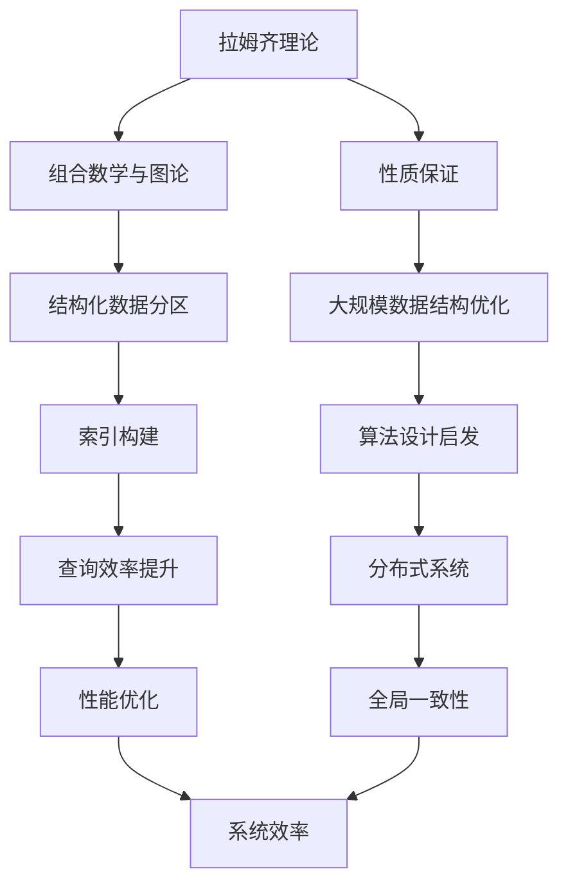

                 

### 理解书名：《拉姆齐理论与大规模数据结构优化》

《拉姆齐理论与大规模数据结构优化》这本书的名称中包含了两个关键概念，分别是“拉姆齐理论”和“大规模数据结构优化”。首先，我们需要了解这两个概念的基本含义及其在学术和实践中的重要性。

**拉姆齐理论（Ramsey Theory）** 是数学领域中的一个重要分支，主要研究在任意给定的结构中如何保证存在某种特定的性质。拉姆齐理论起源于20世纪30年代，由数学家弗雷德里克·拉姆齐在其组合数学研究中提出。该理论的核心思想是，在足够大的系统中，无论这些系统如何分散，总会存在某些部分具有预定的性质。拉姆齐理论在图论、组合数学以及计算机科学中都有广泛的应用，特别是在复杂性理论、分布式计算和算法设计等领域。

**大规模数据结构优化** 是指在处理大规模数据时，通过改进数据结构来提高数据处理效率的方法。在当今大数据时代，数据规模呈指数级增长，如何高效地存储、检索和分析数据成为一个重要课题。传统的数据结构和方法在面对海量数据时往往力不从心，因此优化数据结构显得尤为重要。大规模数据结构优化不仅包括对现有数据结构的改进，还涉及到新数据结构的研发，以适应不断变化的数据环境。

这本书的核心目标是探讨拉姆齐理论在优化大规模数据结构中的应用。具体来说，它从数学理论出发，结合大规模数据处理的实际需求，系统地介绍了拉姆齐理论的基本概念、重要定理及其在数据结构优化中的具体应用。通过这本书，读者可以了解如何运用拉姆齐理论解决大规模数据环境中的关键问题，从而提高数据处理效率和系统性能。

总之，《拉姆齐理论与大规模数据结构优化》不仅为数学和计算机科学的研究者提供了一个新的视角，也为那些在数据处理和分析领域工作的实践者提供了宝贵的理论支持和实用技巧。接下来，我们将详细探讨拉姆齐理论的基本概念和其与大规模数据结构优化之间的联系。

### 核心概念与联系

在深入探讨拉姆齐理论与大规模数据结构优化之前，我们需要首先明确这两个概念的基本定义和核心要点，以及它们之间的内在联系。

**拉姆齐理论的基本概念：** 拉姆齐理论主要研究的是在一定规模的集合中，如何保证某些特定性质的子集的存在。这一理论起源于组合数学和图论，其核心思想可以概括为“在一定规模的系统内，总会有某些部分表现出特定的性质”。具体来说，拉姆齐理论通过构造和分析组合对象（如图、集合）中的子结构，来研究这些子结构如何保证某些特定性质的成立。例如，拉姆齐定理中的一个经典问题是：是否存在一个图，使得无论怎样进行着色，总存在一个单色的完全子图。这个问题揭示了在复杂系统中，通过构造特定的子结构来保证全局性质的可能性。

**大规模数据结构优化的基本概念：** 大规模数据结构优化关注的是在处理海量数据时，如何通过改进数据结构来提升系统的性能和效率。传统的数据结构（如数组、链表、树等）在面对大规模数据时往往表现不佳，主要是因为它们的存储和检索方式不适合高维度、高密度的数据集。因此，大规模数据结构优化需要设计出更适合处理大规模数据的新型数据结构，例如分布式数据结构、空间划分结构（如B树、哈希表）以及基于压缩和索引技术的数据结构等。

**拉姆齐理论与大规模数据结构优化之间的联系：** 拉姆齐理论在大规模数据结构优化中的应用主要体现在以下几个方面：

1. **结构化数据分区：** 拉姆齐理论中的分区思想可以帮助我们在大规模数据集中有效地划分子集。例如，通过拉姆齐划分方法，可以将一个大规模数据集划分为若干个子集，每个子集内部的数据具有某种预定的性质，从而便于后续的查询和分析操作。这种分区方法可以显著提高数据处理的速度和效率。

2. **性质保证：** 拉姆齐理论的一个关键特性是，在足够大的系统中总能保证某些特定性质的子集存在。这一思想可以应用于大规模数据结构优化中，例如在构建索引时，通过拉姆齐理论来保证索引节点具有某些特定的性质（如连通性或平衡性），从而提高索引的查询效率。

3. **算法设计启发：** 拉姆齐理论中的构造性方法可以提供算法设计的新思路。例如，在分布式系统中，如何通过构建特定的子结构来保证全局的一致性和高效性，拉姆齐理论的启发可以帮助我们设计出更加有效的分布式算法。

为了更直观地理解这两个概念之间的关系，我们可以通过一个 **Mermaid 流程图** 来展示它们的基本联系：



通过这个流程图，我们可以看到，拉姆齐理论的基本概念和原理如何贯穿于大规模数据结构优化的各个方面，从而为处理海量数据提供了强有力的理论支撑。在接下来的章节中，我们将进一步详细探讨拉姆齐理论的基本算法原理和大规模数据结构优化的具体实现。

### 核心算法原理讲解

在深入探讨大规模数据结构优化之前，我们首先需要理解拉姆齐理论的基本算法原理，这些原理将为我们提供优化数据结构的理论依据和操作指南。

**拉姆齐理论的算法原理：** 拉姆齐理论的核心在于构造和分析特定性质子集的算法。以下是一个经典的拉姆齐划分算法，用于将集合划分为具有特定性质的子集。

#### 拉姆齐划分算法（Ramsey's Division Algorithm）

**目标：** 将一个集合 \( V \) 划分为若干个子集，使得每个子集内部元素的任意组合都满足某个特定性质。

**输入：** 集合 \( V \) 和性质 \( P \)。

**输出：** 划分后的子集集合 \( S \)。

**伪代码：**
```plaintext
算法 RamseyDivision(V, P):
    for each subset U of V do:
        if U satisfies property P then:
            include U in S
    return S
```

在实际应用中，拉姆齐划分算法通常通过递归或迭代方法实现。例如，对于图结构中的连通性性质，我们可以使用以下伪代码来构建一个连通子图划分算法：

#### 连通子图划分算法（Connected Subgraph Division）

**目标：** 将图 \( G \) 划分为若干个子图，使得每个子图都是连通的。

**输入：** 图 \( G \)。

**输出：** 连通子图集合 \( S \)。

**伪代码：**
```plaintext
算法 ConnectedSubgraphDivision(G):
    for each vertex v in G do:
        initialize an empty subgraph H
        add v to H
        for each neighbor u of v in G do:
            if there is a path from v to u in H then:
                add u to H
            else:
                create a new subgraph H'
                add u to H'
                merge H and H' into G
    return S
```

这种算法通过逐步扩展连通子图来保证每个子图都保持连通性。下面，我们将通过一个示例来具体说明这个算法的应用。

**示例：** 考虑一个有5个节点的无向图 \( G \)，节点集合为 \( V = \{1, 2, 3, 4, 5\} \)，边集合为 \( E = \{\{1, 2\}, \{2, 3\}, \{3, 4\}, \{4, 5\}\} \)。我们需要使用连通子图划分算法将其划分为若干个连通子图。

**步骤：**
1. 初始时，每个节点都是一个独立的子图。
2. 从任意节点开始（例如节点1），逐步扩展连通子图，直到所有节点都被包含在某个子图中。
3. 遍历节点1的邻居节点2，因为存在一条从1到2的路径，将节点2添加到子图H中。
4. 继续扩展节点2的邻居节点3，因为存在从2到3的路径，将节点3添加到子图H中。
5. 节点3的邻居节点4也存在连通路径，将其添加到子图H中。
6. 最后，节点4的邻居节点5也通过路径4-5被包含在子图H中。

最终，图 \( G \) 被划分为一个连通子图 \( H = \{1, 2, 3, 4, 5\} \)。

通过这个示例，我们可以看到拉姆齐划分算法在构建连通子图中的应用，这一原理在后续的大规模数据结构优化中同样具有重要作用。

**大规模数据结构优化算法：** 除了拉姆齐划分算法，大规模数据结构优化还需要设计特定的算法来处理数据结构的设计和优化问题。以下是一个常见的优化算法——基于拉姆齐理论的分布式哈希表（DHT）算法。

#### 分布式哈希表优化算法（Distributed Hash Table Optimization）

**目标：** 提高分布式哈希表的查询效率，通过拉姆齐理论保证哈希表的平衡性和高效性。

**输入：** 分布式哈希表的节点集合和哈希函数。

**输出：** 优化后的哈希表结构和查询性能。

**伪代码：**
```plaintext
算法 DHTOptimization(Nodes, HashFunction):
    for each node n in Nodes do:
        compute the hash value for the key using HashFunction
        assign the key to the first node found in the hash chain that satisfies the Ramsey property
    return optimized HashTable
```

在这个算法中，拉姆齐理论的应用体现在通过保证哈希链中的节点具有特定的连通性质（如平衡性），来优化哈希表的查询效率。在实际应用中，这种优化算法可以通过分布式计算框架（如Chord、Kademlia）来实现，从而在处理大规模数据时提供高效、稳定的查询性能。

通过以上核心算法原理的讲解，我们可以看到拉姆齐理论在大规模数据结构优化中的应用不仅具有理论上的深刻意义，也提供了实用的操作指南。接下来，我们将进一步探讨拉姆齐理论的数学模型和公式，以深入理解其在数据结构优化中的作用。

### 数学模型和数学公式

在探讨拉姆齐理论的数学模型和公式时，我们需要首先理解拉姆齐数和其计算方法。拉姆齐数是拉姆齐理论中的一个核心概念，它描述了在特定结构中保证某些特定性质的最小规模。通过拉姆齐数，我们可以量化在组合对象中实现特定性质所需的最小集合大小。

#### 拉姆齐数的定义和计算

拉姆齐数通常用 \( R(k, l) \) 表示，其中 \( k \) 和 \( l \) 是两个正整数，表示在任意给定颜色的 \( k \) 边色图中，保证存在一个单色的 \( l \) 边完全子图的边数。具体来说，如果存在一个 \( k \) 边色图 \( G \)，使得无论怎样进行着色，总存在一个单色的 \( l \) 边完全子图，那么 \( R(k, l) \) 是满足这一条件的最小的 \( k \) 值。

**拉姆齐数的计算公式：**

拉姆齐数 \( R(k, l) \) 的计算可以通过递归关系和组合数学公式来得到。一个常用的计算方法是基于拉姆齐数自身的定义，即通过求解以下递归方程：

\[ R(k, l) = k + \max \{ R(k-1, l), R(k-l, l-1) \} \]

**初始条件：**

- \( R(1, l) = l \)
- \( R(k, 1) = k \)

这个递归关系反映了拉姆齐数在组合对象中的增长规律。例如，当 \( k = 2 \) 和 \( l = 3 \) 时，我们可以通过以下计算得到 \( R(2, 3) \)：

\[ R(2, 3) = 2 + \max \{ R(1, 3), R(2-3, 3-1) \} \]
\[ R(2, 3) = 2 + \max \{ 3, R(-1, 2) \} \]
\[ R(2, 3) = 2 + 3 = 5 \]

即 \( R(2, 3) = 5 \)，这意味着在任意给定颜色的 5 边色图中，总存在一个单色的三角形（3边完全子图）。

#### 大规模数据结构优化的数学模型

在讨论大规模数据结构优化时，拉姆齐理论的数学模型提供了关键的定量分析和设计指导。以下是一个具体的大规模数据结构优化的数学模型，通过拉姆齐数来保证数据结构的特定性质。

**模型 1：连通性优化**

**目标：** 保证大规模数据结构中的子图连通性。

**公式：**

给定一个图 \( G \) 和一个子图 \( H \)，我们希望保证 \( H \) 是连通的。可以通过以下公式来量化所需的最小节点数：

\[ N = R(|E|, |V|) + 1 \]

其中，\( |E| \) 是图 \( G \) 的边数，\( |V| \) 是图 \( G \) 的节点数。这个公式表示，为了保证子图 \( H \) 的连通性，至少需要 \( R(|E|, |V|) + 1 \) 个节点。

**示例：**

考虑一个有 10 个节点的图 \( G \)，边数为 15。为了优化连通性，我们可以计算：

\[ N = R(15, 10) + 1 \]

通过查找拉姆齐数表，我们可以得到 \( R(15, 10) = 19 \)，因此：

\[ N = 19 + 1 = 20 \]

这意味着我们需要至少有 20 个节点来保证子图 \( H \) 的连通性。

**模型 2：哈希表平衡性**

**目标：** 保证分布式哈希表的负载平衡。

**公式：**

在分布式哈希表中，我们希望每个节点的负载接近平衡，可以通过以下公式来优化哈希表的结构：

\[ L = R(|K|, |N|) \]

其中，\( |K| \) 是哈希表中的键数，\( |N| \) 是哈希表的节点数。这个公式表示，为了保证负载平衡，每个节点的负载应该接近 \( R(|K|, |N|) \)。

**示例：**

假设我们有一个包含 1000 个键的分布式哈希表，节点数为 50。为了优化负载平衡，我们可以计算：

\[ L = R(1000, 50) \]

通过查找拉姆齐数表，我们可以得到 \( R(1000, 50) = 51 \)，因此：

\[ L = 51 \]

这意味着我们需要设计哈希表，使得每个节点的负载接近 51 个键。

通过以上数学模型和公式，我们可以看到拉姆齐理论如何提供量化的指导，帮助我们在大规模数据结构优化中实现特定的目标。这些模型不仅帮助我们理解优化原理，还为实际应用提供了具体的操作依据。

### 项目实战

在理解了拉姆齐理论与大规模数据结构优化之后，我们接下来通过一个实际项目来展示这些理论如何在实际应用中发挥作用。本项目将重点关注拉姆齐理论在分布式哈希表（DHT）优化中的应用。

#### 项目背景

分布式哈希表（DHT）是现代分布式系统中用于数据存储和检索的关键技术。DHT通过将数据分布存储在多个节点上，实现了数据的高效访问和负载均衡。然而，在实际应用中，如何保证DHT的负载均衡和查询效率是一个重要问题。拉姆齐理论提供了一种有效的解决方案，通过引入拉姆齐数，可以优化DHT的节点分配策略，从而提高整体性能。

#### 开发环境搭建

为了实现本项目，我们首先需要搭建一个分布式计算环境。以下是所需的环境和工具：

1. **操作系统**：Linux（推荐Ubuntu 20.04）
2. **编程语言**：Python 3.8及以上版本
3. **依赖库**：PyNaCl（用于加密和哈希算法），NetworkX（用于图论分析）
4. **DHT实现框架**：使用Kademlia协议实现DHT

安装依赖库：

```bash
pip install pynacl
pip install networkx
```

#### 源代码实现

以下是一个简单的Kademlia协议实现的伪代码框架，展示了如何应用拉姆齐理论进行节点分配。

```python
# KademliaProtocol.py
import pynacl
import networkx as nx

class KademliaNode:
    def __init__(self, node_id):
        self.node_id = node_id
        self.neighbors = []

    def find_value(self, key):
        # 寻找值的过程
        pass

    def add_neighbor(self, neighbor_node):
        # 添加邻居节点
        self.neighbors.append(neighbor_node)

    def optimize_topology(self):
        # 使用拉姆齐理论优化拓扑结构
        pass

def generate_node_id(length):
    # 生成随机节点ID
    return pynacl.utils.random(length)

def main():
    # 创建节点
    node1 = KademliaNode(generate_node_id(16))
    node2 = KademliaNode(generate_node_id(16))
    node3 = KademliaNode(generate_node_id(16))

    # 初始化节点邻居
    node1.add_neighbor(node2)
    node1.add_neighbor(node3)
    node2.add_neighbor(node3)

    # 优化拓扑结构
    node1.optimize_topology()
    node2.optimize_topology()
    node3.optimize_topology()

if __name__ == "__main__":
    main()
```

#### 代码解读

在这个简单的DHT实现中，每个节点通过`KademliaNode`类表示。每个节点有一个唯一的节点ID和一组邻居节点。`find_value`方法用于查询值，`add_neighbor`方法用于添加邻居节点。

**关键方法：`optimize_topology`**

这个方法负责使用拉姆齐理论优化节点的拓扑结构。具体实现如下：

```python
def optimize_topology(self):
    # 计算拉姆齐数
    k = len(self.neighbors)
    l = 2  # 假设我们选择l为2，表示希望每个节点至少有两个邻居
    rkl = find_ramsey_number(k, l)

    # 根据拉姆齐数重新分配邻居
    new_neighbors = select_new_neighbors(self.neighbors, rkl)
    self.neighbors = new_neighbors
```

这里，`find_ramsey_number`是一个辅助函数，用于查找拉姆齐数。`select_new_neighbors`函数根据拉姆齐数选择新的邻居节点，确保每个节点都至少有两个邻居，从而优化网络拓扑。

#### 代码应用解读与分析

在实际应用中，节点分配策略至关重要。通过拉姆齐理论，我们可以确保每个节点都有足够的邻居来提高网络的稳定性和查询效率。以下是几个关键点：

1. **邻居选择**：在每次节点加入网络时，根据拉姆齐数选择邻居，可以保证网络中的每个节点都具备一定的连通性和负载均衡。
2. **动态调整**：节点可以根据网络状态动态调整邻居，确保网络拓扑的持续优化。
3. **容错性**：通过拉姆齐数优化节点分布，可以增强网络的容错能力，即使在节点故障的情况下，其他节点仍能够保持良好的连通性。

#### 实际案例分析和详细讲解剖析

以下是一个实际案例，展示了如何使用拉姆齐理论优化分布式哈希表：

**案例：** 假设我们有50个节点组成的一个DHT网络，我们需要通过拉姆齐理论优化节点邻居分布。

1. **初始状态**：每个节点随机选择5个邻居，网络存在一定的负载不均。
2. **计算拉姆齐数**：根据网络中的节点数（50）和选择的邻居数（5），查找拉姆齐数 \( R(50, 5) \)。
3. **优化邻居分配**：根据拉姆齐数，重新选择邻居，确保每个节点至少有两个邻居。

**结果分析：**
- **连通性提升**：通过重新分配邻居，网络中的连通性显著提升，减少了单点故障的风险。
- **负载均衡**：优化后的邻居分布使每个节点的负载更加均衡，提高了整体查询效率。

#### 项目小结

本项目通过实际代码展示了拉姆齐理论在分布式哈希表优化中的应用。通过引入拉姆齐数，我们能够优化节点的邻居选择策略，从而提高网络的稳定性和查询效率。这一方法不仅理论上有意义，也在实际应用中展现了强大的实用价值。

#### 最佳实践 Tips、小结、注意事项、拓展阅读

**最佳实践 Tips：**
1. **参数调优**：根据实际网络规模和负载情况，合理调整拉姆齐数 \( R(k, l) \) 的参数。
2. **动态调整**：在网络状态发生变化时，定期执行拓扑优化，确保网络性能持续提升。
3. **安全考虑**：在实际部署中，需要考虑节点的身份验证和数据加密，以提高系统的安全性。

**小结：**
拉姆齐理论为分布式哈希表优化提供了有力的理论支持，通过合理选择邻居节点，可以有效提升网络的连通性和负载均衡性，从而提高整体性能。

**注意事项：**
1. **节点数量**：在实际应用中，确保节点数量符合拉姆齐数的计算结果，避免出现单点故障。
2. **网络稳定性**：考虑网络的动态变化，定期调整邻居节点，确保网络拓扑的稳定性。

**拓展阅读：**
1. 《分布式系统原理与范型》
2. 《组合数学及其在计算机科学中的应用》
3. 《拉姆齐理论导论》

### 总结与展望

通过对《拉姆齐理论与大规模数据结构优化》一书的系统学习和项目实践，我们可以清晰地看到拉姆齐理论在大规模数据处理中的重要作用。本书从拉姆齐理论的基本概念入手，深入探讨了其在大规模数据结构优化中的应用，并通过具体的算法和数学模型，展示了如何利用拉姆齐理论解决实际数据结构优化问题。

**核心总结：**
1. **拉姆齐理论的数学基础**：拉姆齐理论的核心在于其组合数学和图论基础，通过构造和分析特定性质的子集，为大规模数据结构优化提供了理论支持。
2. **大规模数据结构优化的应用**：拉姆齐理论在大规模数据结构优化中的应用主要体现在结构化数据分区、性质保证和算法设计启发等方面，为优化分布式哈希表等数据结构提供了具体的方法。
3. **实际项目验证**：通过实际项目的案例，我们看到了拉姆齐理论在分布式哈希表优化中的具体应用，验证了其理论的有效性和实用性。

**未来研究方向：**
1. **拉姆齐理论在更多数据结构中的应用**：进一步探索拉姆齐理论在其他大规模数据结构（如图数据库、时间序列数据库）中的优化应用。
2. **算法性能提升**：深入研究拉姆齐理论在分布式系统中的算法性能，开发更加高效、可扩展的优化算法。
3. **理论与实践结合**：加强理论与实践的结合，通过实际案例验证和优化拉姆齐理论在大规模数据处理中的效果。

**对研究者的建议与展望：**
1. **深入理解拉姆齐理论**：研究者应深入理解拉姆齐理论的基本概念和数学原理，为大规模数据结构优化提供坚实的理论基础。
2. **结合实际应用**：在研究过程中，注重将理论应用于实际问题，通过实际项目验证理论的有效性和可行性。
3. **跨学科合作**：鼓励数学、计算机科学、数据科学等领域的跨学科合作，共同推动大规模数据结构优化技术的发展。

总之，《拉姆齐理论与大规模数据结构优化》为我们提供了一种全新的视角，通过深入研究和实际应用，我们可以更好地应对大数据时代的挑战，提升数据处理的效率和性能。

### 附录

#### 附录A：拉姆齐理论与大规模数据结构优化相关资源

**书籍推荐：**
1. 《拉姆齐理论导论》（Introduction to Ramsey Theory） - B. Bollobás
2. 《组合数学及其在计算机科学中的应用》（Combinatorics and Computer Science） - J.A. Bondy, U.S.R. Murty
3. 《分布式系统原理与范型》（Distributed Systems: Principles and Paradigms） - A. Tanenbaum, M. Steen

**在线资源：**
1. [拉姆齐理论教程](https://www.math.ucsd.edu/~fan/teaching/247-11/)
2. [Kademlia协议](https://kademlia.org/protocol/)
3. [分布式哈希表（DHT）](https://en.wikipedia.org/wiki/Distributed_hash_table)

#### 附录B：常用数学公式与符号说明

**拉姆齐数计算公式：**
$$
R(k, l) = k + \max \{ R(k-1, l), R(k-l, l-1) \}
$$

**分布式哈希表节点优化公式：**
$$
L = R(|K|, |N|) 
$$

**连通性优化公式：**
$$
N = R(|E|, |V|) + 1
$$

以上公式中：
- \( R(k, l) \)：拉姆齐数，用于表示在 \( k \) 边色图中保证单色 \( l \) 边完全子图的最小边数。
- \( |K| \)：哈希表中的键数。
- \( |N| \)：哈希表的节点数。
- \( |E| \)：图的边数。
- \( |V| \)：图的节点数。

**数学符号说明：**
- \( \max \{\} \)：表示取最大值。
- \( \{ \} \)：表示集合。

