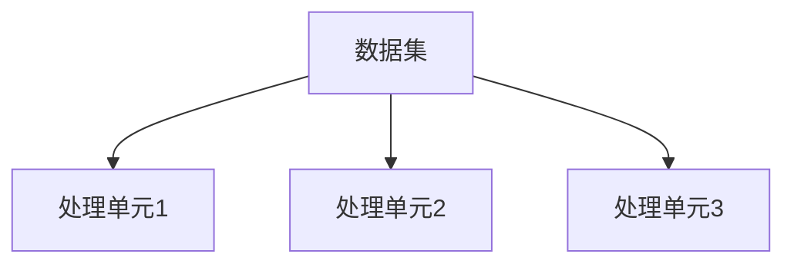
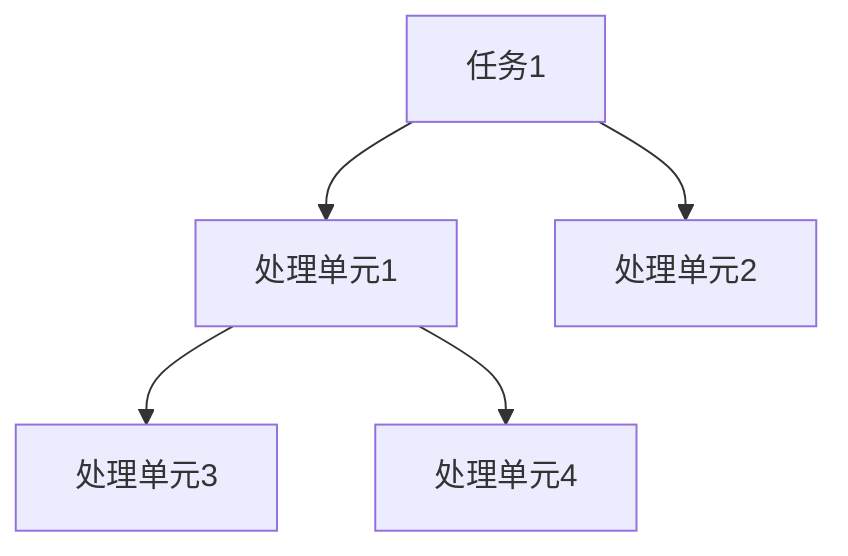
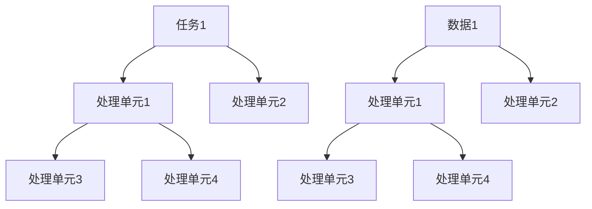
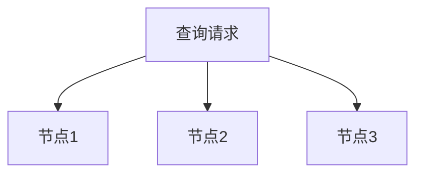
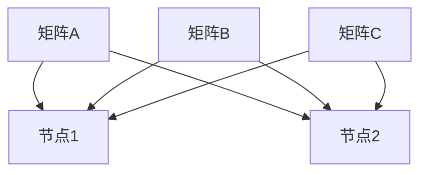
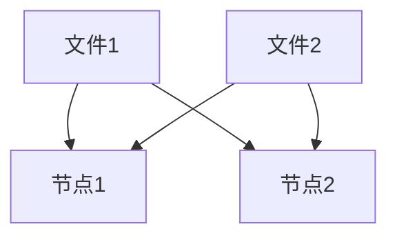

                 

### 引言

#### 1.1.1 拓扑学的基本概念

拓扑学，作为一个数学分支，主要研究对象的性质在连续变形下保持不变的性质。它起源于19世纪，由德国数学家莱布尼茨和庞加莱等学者开始发展，并在20世纪得到迅速扩展。拓扑学的基本概念包括拓扑空间、开闭集、连通性等。

- **拓扑空间**：一个集合连同它的“开集”构成一个拓扑空间。开集的定义涉及到集合内部元素的邻域，而邻域则与集合的拓扑结构密切相关。

- **开闭集**：在拓扑空间中，开集是包含在集合内部且不包含其边界的部分，而闭集则是包含在集合内部及其边界部分。

- **连通性**：一个集合是连通的，当且仅当它不能被划分为两个不相交的非空开集。连通性是拓扑空间的一个重要性质，它影响到算法的设计和优化。

#### 1.1.2 并行算法的定义与重要性

并行算法，是指利用多个处理单元同时执行计算任务的一种算法。并行算法可以显著提高计算效率，尤其在处理大规模数据和复杂计算任务时，其优势更加明显。

- **并行计算的基本概念**：并行计算涉及任务分解、数据分配、同步与通信等关键概念。任务分解是将计算任务划分为多个子任务，数据分配则是将这些子任务分配到不同的处理单元，同步与通信则是确保任务执行的协调和结果汇总。

- **并行算法的分类**：并行算法可以分为数据并行和任务并行两种类型。数据并行是指将相同操作应用于不同数据集的并行算法，而任务并行则是将不同操作应用于同一数据集的并行算法。

#### 1.1.3 拓扑学在并行算法中的应用潜力

拓扑学在并行算法中的应用潜力巨大。一方面，它可以提供有效的数据分配和负载均衡策略；另一方面，它可以优化并行算法的空间和时间复杂度。

- **拓扑映射原理**：拓扑映射是将数据集映射到处理单元的一种方法。通过拓扑映射，可以设计出更高效的并行算法，从而提高计算效率和性能。

- **拓扑优化算法**：在分布式系统中，拓扑优化算法可以通过节点划分和负载均衡来提高系统的整体性能和可靠性。

### 总结

本章介绍了拓扑学和并行算法的基本概念及其在并行算法设计中的应用潜力。在接下来的章节中，我们将深入探讨拓扑学在并行算法设计中的具体应用，包括拓扑映射、分布式系统中的拓扑优化、常见拓扑结构在并行算法中的应用等。通过这些讨论，我们将更好地理解拓扑学在提高并行算法性能和效率方面的关键作用。---

# 拓扑学在并行算法设计中的应用

## 关键词
拓扑学，并行算法，拓扑映射，分布式系统，负载均衡，性能优化

## 摘要
本文旨在探讨拓扑学在并行算法设计中的应用，从基本概念入手，逐步深入探讨拓扑学与并行算法之间的关系，以及拓扑学如何优化并行算法的设计和性能。通过分析拓扑映射、分布式系统中的拓扑优化、常见拓扑结构在并行算法中的应用等具体案例，本文展示了拓扑学在并行算法设计中的关键作用和巨大潜力。

---

## 第1章 引言

### 1.1 拓扑学的基本概念

拓扑学是数学的一个分支，研究的是物体的形状和结构在连续变换下的不变性质。拓扑空间是拓扑学的基本概念，它由一个集合及其上的开集组成。开集是集合中每一个点都有邻域完全包含在这个集合内部的子集。

在拓扑空间中，连通性是一个重要的性质。一个集合是连通的，当且仅当它不能被划分为两个不相交的非空开集。连通性是许多并行算法设计中的重要考量因素，因为它直接影响算法的效率和可扩展性。

### 1.2 并行算法概述

并行算法是指利用多个处理单元同时执行计算任务的算法。并行算法能够显著提高计算效率，尤其是在处理大规模数据和复杂计算任务时。并行算法的关键在于任务分解、数据分配和同步与通信。

任务分解是将一个大任务划分为多个小任务，使得每个处理单元都可以独立执行。数据分配则是将这些小任务分配到不同的处理单元，以确保每个处理单元都有任务可执行。同步与通信则确保各个处理单元之间的协调和结果汇总。

### 1.3 拓扑学在并行算法中的应用潜力

拓扑学在并行算法中的应用潜力巨大。首先，它可以提供有效的数据分配和负载均衡策略，通过拓扑映射将数据集映射到处理单元上，可以设计出更高效的并行算法。其次，拓扑学可以帮助优化分布式系统中的拓扑结构，提高系统的整体性能和可靠性。此外，拓扑学还可以用于分析和优化并行算法的空间和时间复杂度。

通过本章的介绍，我们可以初步了解拓扑学和并行算法的基本概念及其在并行算法设计中的应用潜力。在接下来的章节中，我们将深入探讨拓扑学在并行算法设计中的具体应用，包括拓扑映射、分布式系统中的拓扑优化、常见拓扑结构在并行算法中的应用等。这将帮助我们更好地理解拓扑学在提高并行算法性能和效率方面的关键作用。---

## 第2章 拓扑学与图论基础

### 2.1 拓扑空间

拓扑空间是拓扑学的基本概念，由一个集合及其上的开集组成。在拓扑空间中，集合的元素称为点，集合本身称为拓扑空间。拓扑空间必须满足以下性质：

1. **闭合性**：如果集合U是拓扑空间中的一个开集，那么它的补集U'也是拓扑空间的一个开集。
2. **传递性**：如果集合A和B都是拓扑空间中的开集，那么它们的交集A∩B也是拓扑空间的一个开集。
3. **有限可并性**：如果集合A1, A2, ..., An都是拓扑空间中的开集，那么它们的并集A1∪A2∪...∪An也是拓扑空间的一个开集。

这些性质保证了拓扑空间的连续性和稳定性。

#### 2.1.1 拓扑空间的定义与性质

一个拓扑空间\( (X, \tau) \)由集合\( X \)及其上的开集族\( \tau \)组成，其中\( \tau \)满足以下条件：

1. \( \emptyset, X \in \tau \)
2. \( \tau \)中任意多个集合的并集也在\( \tau \)中
3. \( \tau \)中有限多个集合的交集也在\( \tau \)中

在拓扑空间中，开集是集合内部点的一种邻域结构。例如，在欧几里得空间中，一个集合的内部点是包含在集合内部的开球。

#### 2.1.2 开闭集与邻域

在拓扑空间中，闭集是由开集的补集构成的。如果集合\( U \)是开集，则其补集\( U' \)是闭集。闭集包含集合的所有边界点。

邻域是拓扑空间中点的一种邻域结构。一个点\( x \)的邻域是包含\( x \)的开集。例如，在欧几里得空间中，点\( x \)的邻域是一个包含\( x \)的开球。

#### 2.1.3 连通性与路径

连通性是拓扑空间的一个重要性质。一个集合是连通的，当且仅当它不能被划分为两个不相交的非空开集。例如，线段是连通的，而线段的两个端点之间有一条路径。

路径是拓扑空间中连接两个点的连续映射。如果一个拓扑空间中的任意两点之间都存在路径，则称这个拓扑空间是路径连通的。

### 2.2 图论基础

图论是研究图的性质和应用的数学分支。图由顶点和边组成，顶点是图的元素，边是连接顶点的线段。图论在计算机科学中有着广泛的应用，特别是在网络、算法设计等领域。

#### 2.2.1 图的基本概念

图是一种由顶点和边组成的结构。顶点是图中的元素，边是连接顶点的线段。一个图可以表示为顶点的集合\( V \)和边的集合\( E \)，即\( G = (V, E) \)。

图可以分为无向图和有向图。无向图的边没有方向，而有向图的边有方向。

#### 2.2.2 图的表示方法

图可以使用邻接矩阵、邻接表、邻接多重表等多种方法表示。

- **邻接矩阵**：一个\( n \times n \)的矩阵，如果\( G \)是\( n \)个顶点的图，则矩阵的元素\( a_{ij} \)表示顶点\( i \)和顶点\( j \)之间的边。
- **邻接表**：一个列表，每个列表项包含一个顶点及其邻接顶点的列表。
- **邻接多重表**：类似于邻接表，但允许顶点之间有多个边。

#### 2.2.3 图的连通性与匹配理论

图的连通性是图论中的基本概念。无向图的连通性可以分为连通图和割图。一个无向图是连通的，当且仅当任意两个顶点之间都存在路径。

图的匹配理论是图论中的一个重要分支。匹配是指图中的一些边，这些边的顶点不相交。最大匹配是图中边的最大匹配，它尽可能地覆盖顶点。

### 2.3 拓扑学在图论中的应用

拓扑学在图论中的应用主要体现在图的连通性和匹配理论中。图的连通性可以通过拓扑空间的连通性来描述，而图的匹配理论则可以利用拓扑空间的连通性来优化。

#### 2.3.1 图的拓扑性质

图的拓扑性质是指图在拓扑空间中的连通性和结构性质。例如，一个图是连通的，当且仅当它的所有顶点都处于同一连通分量中。

#### 2.3.2 拓扑结构与图性质的关系

拓扑结构与图性质之间存在紧密的联系。例如，一个图是连通的，当且仅当它的所有顶点之间都存在路径。这个性质可以通过拓扑空间的连通性来验证。

#### 2.3.3 拓扑学在图算法中的应用

拓扑学在图算法中的应用主要体现在图的连通性和匹配算法中。例如，拓扑排序是一种用于顶点排序的算法，它可以利用图的拓扑性质来优化算法的执行时间。

### 总结

本章介绍了拓扑学与图论的基础知识，包括拓扑空间的定义与性质、开闭集与邻域、连通性与路径，以及图的基本概念、表示方法、连通性与匹配理论。通过本章的学习，读者可以更好地理解拓扑学在并行算法设计中的应用基础。在接下来的章节中，我们将进一步探讨拓扑学在并行算法设计中的具体应用，包括拓扑映射、分布式系统中的拓扑优化等。这些内容将帮助读者更深入地理解拓扑学在提高并行算法性能和效率方面的关键作用。---

## 第3章 并行算法设计原理

### 3.1 并行计算的基本概念

并行计算是一种利用多个处理单元同时执行计算任务的方法，以提高计算效率和性能。并行计算的基本概念包括任务分解、数据分配、同步与通信等。

#### 任务分解

任务分解是将一个大任务划分为多个小任务的过程。在并行算法设计中，任务分解的目的是将计算任务分配给不同的处理单元，以便每个处理单元可以独立执行。任务分解可以是数据驱动的，也可以是任务驱动的。

- **数据驱动任务分解**：将相同操作应用于不同数据集的任务分解方式。这种分解方式适用于数据并行算法，如矩阵乘法。
- **任务驱动任务分解**：将不同操作应用于同一数据集的任务分解方式。这种分解方式适用于任务并行算法，如流水线算法。

#### 数据分配

数据分配是将分解后的任务分配给不同的处理单元的过程。数据分配的策略会影响并行算法的性能和可扩展性。常见的数据分配策略包括：

- **静态分配**：在算法执行前就将数据分配给处理单元，并在整个算法执行过程中保持不变。
- **动态分配**：在算法执行过程中根据需要动态调整数据的分配。

#### 同步与通信

同步与通信是并行算法设计中需要考虑的重要因素。同步是指多个处理单元之间的协调，以确保任务执行的顺序和一致性。通信是指处理单元之间交换数据和消息的过程。

在并行算法设计中，同步与通信的策略会影响算法的效率和性能。常见的同步机制包括屏障（barrier）和锁（lock）。通信机制包括共享内存和消息传递。

### 3.2 并行算法的分类

并行算法可以根据任务分解和数据分配的不同方式分为以下几类：

#### 数据并行算法

数据并行算法是将相同操作应用于不同数据集的并行算法。在数据并行算法中，每个处理单元独立执行相同任务，但处理不同的数据。这种算法适用于处理大规模数据集的并行计算，如矩阵乘法、数据分类等。

#### 任务并行算法

任务并行算法是将不同操作应用于同一数据集的并行算法。在任务并行算法中，不同的处理单元执行不同的任务，但处理相同的数据。这种算法适用于处理复杂计算任务的并行计算，如科学计算、图像处理等。

#### 混合并行算法

混合并行算法是将数据并行和任务并行相结合的并行算法。在混合并行算法中，既有相同操作应用于不同数据集的部分，也有不同操作应用于同一数据集的部分。这种算法适用于处理既具有大规模数据集又具有复杂计算任务的并行计算，如机器学习、数据挖掘等。

### 3.3 并行算法设计的关键因素

并行算法设计需要考虑多个关键因素，包括任务分解策略、数据分配策略、同步与通信策略等。

#### 任务分解策略

任务分解策略是并行算法设计的第一步。合理的任务分解策略可以提高并行算法的性能和可扩展性。选择合适的任务分解策略需要考虑以下因素：

- **任务的独立性**：任务之间的独立性越高，越适合并行执行。
- **任务的大小**：任务的大小应该适中，过大或过小都会影响并行算法的性能。
- **任务的负载均衡**：任务负载应该均匀分布，避免出现“忙闲不均”的情况。

#### 数据分配策略

数据分配策略是并行算法设计中的另一个重要因素。合理的数据分配策略可以提高并行算法的效率。常见的数据分配策略包括：

- **静态分配**：在算法执行前就将数据分配给处理单元，并在整个算法执行过程中保持不变。
- **动态分配**：在算法执行过程中根据需要动态调整数据的分配。

#### 同步与通信策略

同步与通信策略是并行算法设计中需要考虑的重要因素。选择合适的同步与通信策略可以提高并行算法的效率和性能。常见的同步机制包括屏障（barrier）和锁（lock）。通信机制包括共享内存和消息传递。

#### 总结

本章介绍了并行算法设计的基本概念和原理，包括并行计算的基本概念、任务分解、数据分配、同步与通信，以及并行算法的分类。通过本章的学习，读者可以了解并行算法设计的基本原理和关键因素，为后续章节中拓扑学在并行算法设计中的应用奠定基础。在接下来的章节中，我们将进一步探讨拓扑学在并行算法设计中的具体应用，包括拓扑映射、分布式系统中的拓扑优化等。这些内容将帮助读者更深入地理解拓扑学在提高并行算法性能和效率方面的关键作用。---

## 第4章 拓扑映射与并行算法

### 4.1 拓扑映射原理

拓扑映射是将数据集映射到处理单元上的一种方法。通过拓扑映射，可以设计出更高效的并行算法，从而提高计算效率和性能。拓扑映射的基本原理是将数据集中的元素分配到处理单元上，使得处理单元之间的数据访问尽量减少。

#### 拓扑映射的基本概念

- **数据集**：一个包含多个元素的集合。
- **处理单元**：可以独立执行计算任务的单元，如CPU、GPU等。
- **映射关系**：将数据集中的元素映射到处理单元上的关系。

#### 拓扑映射的分类

- **静态映射**：在算法执行前就将数据映射到处理单元上，并在整个算法执行过程中保持不变。
- **动态映射**：在算法执行过程中根据需要动态调整数据的映射。

#### 拓扑映射的目标

- **负载均衡**：确保每个处理单元都有相同的工作量。
- **通信最小化**：减少处理单元之间的数据访问。

### 4.2 拓扑映射在并行算法中的应用

拓扑映射在并行算法中的应用非常广泛，以下是一些典型的应用场景：

#### 数据并行算法

在数据并行算法中，相同操作应用于不同数据集。拓扑映射可以将数据集中的元素映射到不同的处理单元上，使得每个处理单元可以独立执行相同任务，从而提高计算效率。



在上面的例子中，数据集A被映射到三个不同的处理单元上，每个处理单元执行相同的操作。

#### 任务并行算法

在任务并行算法中，不同操作应用于同一数据集。拓扑映射可以将数据集中的元素分配到不同的处理单元上，使得每个处理单元可以独立执行不同任务，从而提高计算效率。



在上面的例子中，数据集A被映射到四个不同的处理单元上，每个处理单元执行不同的任务。

#### 混合并行算法

在混合并行算法中，既有数据并行又有任务并行。拓扑映射可以同时考虑数据分配和任务分配，从而设计出更高效的并行算法。



在上面的例子中，数据集F和任务A被映射到四个不同的处理单元上，处理单元1和2执行数据并行任务，处理单元3和4执行任务并行任务。

### 4.3 拓扑映射的挑战与优化策略

拓扑映射在并行算法设计中具有很大的潜力，但同时也面临一些挑战：

- **负载均衡**：确保每个处理单元都有相同的工作量，避免出现“忙闲不均”的情况。
- **通信最小化**：减少处理单元之间的数据访问，降低通信开销。
- **可扩展性**：确保拓扑映射在处理大规模数据集时仍然有效。

为了解决这些挑战，可以采用以下优化策略：

- **动态拓扑映射**：在算法执行过程中根据实际情况动态调整数据的映射。
- **负载均衡算法**：设计负载均衡算法，确保处理单元之间的工作量均匀分布。
- **通信优化**：采用高效的通信协议和算法，减少数据传输的开销。

### 总结

本章介绍了拓扑映射的基本原理和在并行算法中的应用。通过拓扑映射，可以设计出更高效的并行算法，从而提高计算效率和性能。拓扑映射在数据并行、任务并行和混合并行算法中都有广泛的应用。同时，本章也讨论了拓扑映射面临的挑战和优化策略。在接下来的章节中，我们将进一步探讨分布式系统中的拓扑优化和常见拓扑结构在并行算法中的应用。这些内容将帮助读者更深入地理解拓扑学在并行算法设计中的关键作用。---

### 4.3 拓扑映射的挑战与优化策略

#### 4.3.1 负载均衡

负载均衡是拓扑映射中一个重要的挑战，特别是在处理大规模数据集和复杂任务时。负载不均衡会导致部分处理单元过度繁忙，而其他处理单元却闲置，从而降低整个系统的效率。为了实现负载均衡，可以采用以下策略：

- **动态负载分配**：根据实时监测的处理单元负载情况，动态调整数据映射。例如，当某个处理单元的负载过高时，可以将部分数据分配给其他处理单元。
- **自适应负载均衡算法**：使用自适应算法根据处理单元的负载动态调整任务分配。例如，基于历史负载数据和当前负载预测来调整映射策略。
- **负载均衡机制**：使用分布式系统中的负载均衡机制，如负载感知调度器，来平衡处理单元的工作量。

#### 4.3.2 通信最小化

在并行算法中，处理单元之间的通信开销是一个重要的性能瓶颈。通过优化拓扑映射来减少通信开销，可以显著提高算法的效率。以下是一些优化策略：

- **数据局部化**：尽量将数据映射到与其相关的处理单元上，减少跨处理单元的数据传输。例如，将相邻的数据点映射到相邻的处理单元。
- **数据划分**：合理划分数据集，使每个处理单元需要处理的数据量尽量均匀。例如，使用分割算法将数据集划分为多个部分，每个部分分配给不同的处理单元。
- **压缩传输**：在传输数据前进行压缩，减少传输数据的大小。例如，使用无损数据压缩算法对数据集进行压缩，然后传输压缩后的数据。

#### 4.3.3 可扩展性

在处理大规模数据集时，拓扑映射的可扩展性是一个关键问题。为了实现可扩展性，可以采用以下策略：

- **分布式拓扑映射**：将拓扑映射任务分布到多个处理单元上，每个处理单元负责映射部分数据。这样可以利用分布式系统的并行处理能力，提高映射效率。
- **层次化拓扑映射**：将数据集划分为多个层次，每个层次使用不同的拓扑映射策略。例如，在顶层使用全局映射策略，而在底层使用局部映射策略，从而实现整体上的可扩展性。
- **可伸缩拓扑结构**：设计可伸缩的拓扑结构，能够根据数据集规模动态调整映射关系。例如，使用动态调整的环状结构或树状结构，根据数据集规模进行扩展。

#### 4.3.4 案例分析

为了更好地理解拓扑映射的挑战与优化策略，下面以一个实际案例为例进行说明。

**案例：分布式矩阵乘法**

假设有一个大规模矩阵乘法任务需要分布式计算，数据集被划分为多个子矩阵。每个处理单元负责计算子矩阵的一部分，并将结果汇总得到最终结果。

- **挑战**：子矩阵之间的数据访问和通信可能造成性能瓶颈。
- **优化策略**：
  - **数据局部化**：将相邻的子矩阵映射到相邻的处理单元，减少跨处理单元的数据访问。
  - **压缩传输**：在处理子矩阵时，对中间结果进行压缩，减少通信开销。
  - **动态负载分配**：实时监测处理单元的负载，根据负载情况动态调整子矩阵的映射，确保负载均衡。

通过这些优化策略，可以显著提高分布式矩阵乘法的性能和效率。

### 总结

本章讨论了拓扑映射在并行算法设计中的应用，以及面临的挑战和优化策略。通过合理的拓扑映射，可以设计出更高效的并行算法，提高计算效率和性能。负载均衡、通信最小化和可扩展性是拓扑映射中需要重点考虑的问题。在接下来的章节中，我们将进一步探讨分布式系统中的拓扑优化和常见拓扑结构在并行算法中的应用。这些内容将帮助读者更深入地理解拓扑学在并行算法设计中的关键作用。---

## 第5章 分布式系统中的拓扑优化

### 5.1 节点划分与负载均衡

在分布式系统中，节点划分和负载均衡是优化拓扑结构的重要策略。合理地进行节点划分和负载均衡可以提高系统的性能和可靠性。

#### 5.1.1 节点划分

节点划分是指将分布式系统中的节点划分为多个子集，每个子集负责处理不同的任务。节点划分的策略会影响系统的可扩展性和容错能力。

- **静态划分**：在系统启动时将节点划分为多个子集，并在整个系统运行过程中保持不变。
- **动态划分**：根据系统的运行状态动态调整节点的划分，以适应不同的负载情况。

常见的节点划分策略包括：

- **基于区域的划分**：将节点划分为多个区域，每个区域负责处理来自特定地理位置的数据。
- **基于功能的划分**：将节点划分为多个功能模块，每个模块负责不同的功能。

#### 5.1.2 负载均衡

负载均衡是指通过分配任务到不同的节点，以实现系统的负载均衡。负载均衡的目的是确保每个节点都有相同的工作量，避免出现“忙闲不均”的情况。

负载均衡的策略包括：

- **轮询负载均衡**：将任务依次分配到每个节点，直到所有节点都被分配到任务。
- **加权负载均衡**：根据节点的处理能力或负载情况，为每个节点分配不同的权重，然后将任务分配给权重最高的节点。
- **动态负载均衡**：根据实时监测的节点负载情况，动态调整任务的分配。

#### 5.1.3 拓扑优化算法

拓扑优化算法是用于优化分布式系统拓扑结构的方法。拓扑优化算法的目标是提高系统的性能、可靠性和可扩展性。

常见的拓扑优化算法包括：

- **基于贪心的拓扑优化算法**：通过贪心策略逐步优化节点划分和负载分配，以达到最优解。
- **基于遗传算法的拓扑优化算法**：利用遗传算法的搜索能力，优化节点划分和负载分配。
- **基于图论的拓扑优化算法**：利用图论中的拓扑结构和算法，优化节点划分和负载分配。

### 5.2 拓扑优化算法的案例分析

为了更好地理解拓扑优化算法，下面通过一个实际案例进行说明。

**案例：分布式文件系统**

假设一个分布式文件系统由多个节点组成，每个节点负责存储文件的一部分。系统需要优化节点划分和负载分配，以提高文件的读写性能和可靠性。

- **问题**：节点划分不合理可能导致部分节点的负载过高，影响系统的性能。
- **优化目标**：实现节点负载均衡，提高系统的性能和可靠性。

**解决方案**：

1. **节点划分**：使用基于功能的划分策略，将节点划分为多个区域，每个区域负责存储不同类型的文件。
2. **负载均衡**：使用加权负载均衡策略，根据节点的处理能力和当前负载情况，为每个节点分配不同的权重，然后将文件分配给权重最高的节点。
3. **拓扑优化**：使用基于遗传算法的拓扑优化算法，根据节点的负载和文件访问频率，动态调整节点划分和负载分配，以达到最优解。

通过上述优化策略，可以显著提高分布式文件系统的性能和可靠性。

### 5.3 拓扑优化算法的性能分析

拓扑优化算法的性能分析是评估其效果和效率的重要步骤。常见的性能指标包括：

- **负载均衡度**：衡量节点负载的均衡程度，负载均衡度越高，系统的性能越好。
- **响应时间**：衡量系统处理请求的时间，响应时间越短，系统的性能越好。
- **吞吐量**：衡量系统处理请求的速率，吞吐量越高，系统的性能越好。

为了评估拓扑优化算法的性能，可以通过以下方法：

- **模拟实验**：使用模拟软件对拓扑优化算法进行实验，模拟不同负载情况和节点配置，评估算法的性能。
- **实际部署**：在实际系统中部署拓扑优化算法，收集实际运行数据，评估算法的性能。

通过性能分析，可以找出拓扑优化算法的不足之处，并进行优化。

### 总结

本章讨论了分布式系统中的拓扑优化，包括节点划分与负载均衡的策略以及拓扑优化算法的案例分析。通过合理的节点划分和负载均衡，可以优化分布式系统的拓扑结构，提高系统的性能和可靠性。在接下来的章节中，我们将继续探讨常见拓扑结构在并行算法中的应用，帮助读者更深入地理解拓扑学在并行算法设计中的关键作用。---

## 第6章 常见拓扑结构在并行算法中的应用

在并行算法设计中，选择合适的拓扑结构对于提高算法的效率和性能至关重要。常见的拓扑结构包括环形拓扑、星形拓扑和树形拓扑。下面将分别介绍这些拓扑结构的特点及其在并行算法中的应用。

### 6.1 环形拓扑

环形拓扑是一种常见的网络拓扑结构，其中节点按环形顺序排列。每个节点与相邻的两个节点相连，形成一个闭合的环路。

#### 特点

- **简单**：环形拓扑结构简单，易于实现和扩展。
- **可靠性**：环形拓扑具有较高的容错能力，即使一个节点发生故障，整个网络仍能正常运行。
- **负载均衡**：在环形拓扑中，节点之间负载均衡，每个节点承担相同的工作量。

#### 应用

- **数据传输**：在数据并行算法中，环形拓扑可以用于数据的传输和同步。每个节点依次传递数据，从而实现高效的数据传输。
- **负载均衡**：环形拓扑可以用于任务分配，确保每个节点都有相同的工作量，从而实现负载均衡。

### 6.2 星形拓扑

星形拓扑是一种以一个中心节点为核心，其他节点与中心节点相连的拓扑结构。中心节点负责控制整个网络的通信和管理。

#### 特点

- **高效**：星形拓扑的通信效率较高，中心节点可以快速处理节点之间的通信请求。
- **集中控制**：星形拓扑具有集中控制的特点，中心节点可以统一管理整个网络。
- **可靠性**：星形拓扑的可靠性较高，中心节点发生故障时，其他节点仍能正常运行。

#### 应用

- **集中式并行算法**：星形拓扑适用于集中式的并行算法，如分布式计算中的主从模型。中心节点负责任务调度和数据汇总，其他节点负责具体计算任务。
- **网络通信**：在分布式系统中，星形拓扑可以用于网络通信，中心节点作为通信的中转站，提高通信效率。

### 6.3 树形拓扑

树形拓扑是一种由多个层级组成的结构，每个节点可以有多个子节点，但只有一个父节点。树形拓扑可以表示为一种层次化的结构。

#### 特点

- **层次化**：树形拓扑具有层次化的特点，便于管理和控制。
- **扩展性强**：树形拓扑易于扩展，可以在不需要修改现有拓扑结构的情况下添加新的节点。
- **负载均衡**：树形拓扑可以实现负载均衡，每个节点承担相同的工作量。

#### 应用

- **层次化任务分配**：在并行算法中，树形拓扑可以用于层次化任务分配。根节点负责分配任务给子节点，子节点继续分配任务给更下层的节点，从而实现层次化任务分配。
- **分布式数据库**：在分布式数据库中，树形拓扑可以用于数据库的层次化管理。根节点负责管理全局数据，子节点负责管理局部数据，从而提高数据库的查询效率。

### 总结

本章介绍了环形拓扑、星形拓扑和树形拓扑的基本概念、特点及其在并行算法中的应用。环形拓扑适用于数据传输和负载均衡，星形拓扑适用于集中式并行算法和网络通信，树形拓扑适用于层次化任务分配和分布式数据库。了解这些拓扑结构及其应用，有助于我们在并行算法设计中选择合适的拓扑结构，从而提高算法的效率和性能。在接下来的章节中，我们将探讨非传统拓扑结构在并行算法中的创新应用，继续深入探讨拓扑学在并行算法设计中的关键作用。---

## 第7章 特殊拓扑结构在并行算法中的创新应用

### 7.1 非传统拓扑结构介绍

在传统的环形、星形和树形拓扑结构之外，还存在许多非传统的拓扑结构，这些结构在特定的并行算法应用场景中显示出独特的优势。以下是一些常见的非传统拓扑结构：

#### 网格拓扑（Mesh Topology）

网格拓扑是一种由二维或三维网格点组成的结构，其中每个节点都有多个相邻节点。网格拓扑具有较高的可扩展性和负载均衡能力，适用于处理大规模数据集的并行算法。

#### 满月拓扑（Full Moon Topology）

满月拓扑是一种由多个环形结构组成的拓扑，每个环形结构中节点数相等。这种拓扑结构在负载均衡和容错性方面表现优异，特别适用于大规模分布式系统。

#### 环状星形拓扑（Ring-Star Topology）

环状星形拓扑结合了环形拓扑和星形拓扑的特点，中心节点与环形节点相连，形成一种混合结构。这种拓扑结构在通信效率和负载均衡方面具有优势。

#### 指数拓扑（Exponential Topology）

指数拓扑是一种基于指数级增长的拓扑结构，节点按照指数级增长排列。这种拓扑结构在处理高并发性任务时显示出较好的性能，但实现较为复杂。

#### 无规则拓扑（Unstructured Topology）

无规则拓扑是一种没有固定结构的拓扑，节点之间的连接关系是随机或无规则的。这种拓扑结构在处理不可预测的任务分配时具有一定的优势。

### 7.2 创新型并行算法设计案例

以下通过几个创新性的并行算法设计案例，展示非传统拓扑结构在并行算法中的应用：

#### 案例一：基于网格拓扑的分布式矩阵乘法

在处理大规模矩阵乘法任务时，可以使用网格拓扑结构。每个节点负责计算矩阵的一个部分，网格结构确保节点之间的负载均衡和高效的通信。

```pseudo
// 网格拓扑下的分布式矩阵乘法
for (i = 0; i < grid_size; i++) {
    for (j = 0; j < grid_size; j++) {
        // 获取当前节点处理的矩阵块
        matrix_block = get_matrix_block(i, j);
        // 计算当前矩阵块的乘积
        product = multiply_matrix_blocks(matrix_block);
        // 将结果存储到全局矩阵中
        store_matrix_result(i, j, product);
    }
}
```

#### 案例二：基于满月拓扑的分布式流处理

在分布式流处理中，可以使用满月拓扑结构。节点按照环形结构排列，每个节点处理流数据的一部分，环形结构确保数据的有序传输和负载均衡。

```pseudo
// 满月拓扑下的分布式流处理
for (i = 0; i < moon_size; i++) {
    // 读取当前节点处理的流数据
    stream_data = read_stream_data(i);
    // 处理流数据
    processed_data = process_stream_data(stream_data);
    // 将处理结果发送到下一个节点
    send_to_next(i, processed_data);
}
```

#### 案例三：基于环状星形拓扑的分布式数据库查询

在分布式数据库查询中，可以使用环状星形拓扑。中心节点负责协调查询任务，环形节点负责查询数据的读取和存储，确保高效的查询性能。

```pseudo
// 环状星形拓扑下的分布式数据库查询
// 中心节点
query_result = execute_query_center(query);
// 环形节点
for (i = 0; i < ring_size; i++) {
    local_result = execute_query_ring(i, query);
    // 合并查询结果
    query_result = merge_results(query_result, local_result);
}
```

#### 案例四：基于指数拓扑的分布式负载均衡

在处理高并发性任务时，可以使用指数拓扑结构。节点按照指数级增长排列，确保任务在多个节点上分散执行，从而实现负载均衡。

```pseudo
// 指数拓扑下的分布式负载均衡
node_count = calculate_node_count(task_size);
for (i = 0; i < node_count; i++) {
    // 分配任务给节点
    assign_task_to_node(i, task);
    // 获取节点处理结果
    result = get_node_result(i);
    // 合并处理结果
    final_result = merge_results(final_result, result);
}
```

#### 案例五：基于无规则拓扑的分布式任务调度

在处理不可预测的任务时，可以使用无规则拓扑结构。节点之间的连接关系是随机或无规则的，确保任务在多个节点上动态调度，从而提高系统的灵活性和可扩展性。

```pseudo
// 无规则拓扑下的分布式任务调度
// 初始化无规则拓扑结构
initialize_unknow_topology();
for (i = 0; i < task_count; i++) {
    // 分配任务给节点
    assign_task_to_node_randomly(i, task);
    // 获取节点处理结果
    result = get_node_result(i);
    // 合并处理结果
    final_result = merge_results(final_result, result);
}
```

### 7.3 特殊拓扑结构的优化策略

为了充分发挥特殊拓扑结构在并行算法中的应用优势，可以采用以下优化策略：

- **动态拓扑调整**：根据任务负载和节点状态，动态调整拓扑结构，以实现最优的负载均衡和通信效率。
- **拓扑冗余设计**：在设计拓扑结构时，考虑冗余设计，以提高系统的容错能力和可靠性。
- **混合拓扑结构**：结合多种拓扑结构的优点，设计出混合拓扑结构，以适应不同的并行算法应用场景。
- **自适应通信策略**：根据拓扑结构和任务特性，自适应调整通信策略，以最小化通信开销。

### 总结

本章介绍了非传统拓扑结构，包括网格拓扑、满月拓扑、环状星形拓扑、指数拓扑和无规则拓扑，并展示了这些拓扑结构在并行算法中的创新应用。通过案例分析和优化策略，我们可以看到非传统拓扑结构在提高并行算法效率和性能方面的巨大潜力。在接下来的章节中，我们将进一步探讨并行算法的性能分析和优化策略，以帮助读者更深入地理解拓扑学在并行算法设计中的关键作用。---

## 第8章 并行算法性能分析与优化

### 8.1 性能指标

在分析并行算法的性能时，我们需要关注多个性能指标，这些指标可以帮助我们评估算法的效率、可靠性和可扩展性。以下是一些常见的性能指标：

#### 吞吐量（Throughput）

吞吐量是指单位时间内系统能够处理的数据量或任务数。吞吐量是衡量并行算法性能的重要指标，它反映了系统的处理能力和效率。

#### 响应时间（Response Time）

响应时间是指从提交请求到收到响应的时间。在并行算法中，响应时间不仅取决于算法的执行时间，还受到通信延迟和同步操作的影响。

#### 执行时间（Execution Time）

执行时间是指并行算法从开始执行到完成的时间。执行时间是评估算法性能的直接指标，它包括计算时间、通信时间和同步时间。

#### 资源利用率（Resource Utilization）

资源利用率是指系统资源（如CPU、内存、网络等）被有效利用的程度。高资源利用率表明系统在处理任务时能够充分利用现有资源。

#### 可扩展性（Scalability）

可扩展性是指系统在增加处理单元或数据规模时，性能是否能够相应提升。良好的可扩展性是并行算法设计的关键目标之一。

### 8.2 优化策略

为了提高并行算法的性能，我们可以采取多种优化策略。以下是一些常见的优化策略：

#### 负载均衡（Load Balancing）

负载均衡是指通过合理的任务分配，确保每个处理单元的工作量尽量均衡。负载均衡可以防止某些处理单元过载，从而提高系统的整体性能。

- **静态负载均衡**：在任务分配时预先确定每个处理单元的工作量。
- **动态负载均衡**：在算法执行过程中根据实时负载情况动态调整任务分配。

#### 数据局部化（Data Localization）

数据局部化是指尽量将数据分配到与其相关的处理单元上，以减少跨处理单元的数据传输。数据局部化可以降低通信开销，提高算法的效率。

- **数据划分**：将数据集划分为多个子集，每个子集分配给不同的处理单元。
- **本地数据处理**：每个处理单元只处理本地的数据，减少跨节点的数据传输。

#### 通信优化（Communication Optimization）

在并行算法中，通信开销是一个重要的性能瓶颈。通过优化通信策略，可以显著提高算法的效率。

- **压缩传输**：在传输数据前进行压缩，减少传输数据的大小。
- **异步通信**：在数据处理和通信之间引入异步操作，减少同步等待时间。
- **多路径传输**：利用多个通信路径，提高数据传输的并行度。

#### 算法并行化（Algorithm Parallelization）

算法并行化是指将串行算法转换为并行算法，以利用多个处理单元的并行计算能力。算法并行化需要考虑任务分解和数据分配，以确保并行算法的有效性。

- **任务分解**：将计算任务分解为多个可并行执行的任务。
- **数据并行化**：将相同操作应用于不同数据集，实现数据并行。
- **任务并行化**：将不同操作应用于同一数据集，实现任务并行。

#### 资源调度（Resource Scheduling）

资源调度是指合理分配系统资源（如CPU、内存、网络等）以最大化系统性能。资源调度需要考虑任务优先级、资源可用性和负载均衡等因素。

- **优先级调度**：根据任务优先级分配资源，确保高优先级任务先执行。
- **负载感知调度**：根据实时负载情况动态调整资源分配，实现负载均衡。

#### 系统优化（System Optimization）

系统优化是指通过调整系统配置和参数，提高并行算法的性能。系统优化包括硬件优化、操作系统优化和编译器优化等。

- **硬件优化**：选择适合并行计算的硬件平台，如多核CPU、GPU等。
- **操作系统优化**：调整操作系统参数，提高并行算法的执行效率。
- **编译器优化**：使用编译器优化选项，提高代码的并行性能。

### 8.3 案例分析

为了更好地理解性能分析和优化策略，下面通过一个案例进行分析。

**案例：分布式矩阵乘法**

假设我们需要在分布式系统上实现矩阵乘法，数据集被划分为多个子矩阵，每个子矩阵分配给不同的处理单元。

#### 性能分析

- **吞吐量**：通过测量单位时间内完成的矩阵乘法任务数，评估系统的处理能力。
- **响应时间**：测量从提交矩阵乘法任务到收到结果的时间，评估系统的响应性能。
- **执行时间**：记录整个矩阵乘法任务从开始到完成的时间，包括计算时间、通信时间和同步时间。

#### 优化策略

1. **负载均衡**：使用动态负载均衡策略，根据处理单元的实时负载情况调整子矩阵的分配。
2. **数据局部化**：将相邻的子矩阵分配给相邻的处理单元，以减少跨节点的数据传输。
3. **通信优化**：在子矩阵计算完成后，使用异步通信将结果传输到主处理单元，减少同步等待时间。
4. **算法并行化**：将矩阵乘法分解为多个可并行执行的任务，利用处理单元的并行计算能力。
5. **系统优化**：调整操作系统和网络参数，提高数据传输和处理的效率。

通过上述优化策略，可以显著提高分布式矩阵乘法的性能和效率。

### 总结

本章介绍了并行算法性能分析的重要指标和优化策略。通过性能分析和优化策略，我们可以提高并行算法的效率和性能，满足不同应用场景的需求。在接下来的章节中，我们将探讨拓扑学在并行算法设计中的应用，帮助读者更深入地理解拓扑学在提高并行算法性能和效率方面的关键作用。---

## 第9章 拓扑学在并行算法设计中的实际应用

### 9.1 典型应用场景介绍

拓扑学在并行算法设计中的应用非常广泛，以下是几个典型的应用场景：

#### 数据中心管理

在大型数据中心中，拓扑学被用来优化网络结构，提高数据传输效率和负载均衡能力。通过拓扑映射，可以将数据中心的计算资源分配到最优位置，减少数据传输路径，提高整体性能。

#### 云计算服务

云计算服务提供商利用拓扑学来优化虚拟机的部署和调度。通过拓扑映射和负载均衡策略，可以确保每个虚拟机都能得到公平的资源和处理能力，提高服务的可靠性和响应速度。

#### 科学计算

科学计算中的并行算法设计常常需要处理大规模数据集。拓扑学在优化数据分配和任务调度方面发挥了重要作用，通过拓扑映射，可以确保计算任务的高效执行，提高计算性能。

#### 金融交易系统

金融交易系统中的高性能计算要求快速处理大量交易数据。拓扑学在优化网络拓扑结构和任务分配方面具有显著优势，通过合理的拓扑映射和负载均衡，可以降低交易延迟，提高交易系统的稳定性。

### 9.2 案例分析

为了更好地理解拓扑学在并行算法设计中的实际应用，下面通过几个具体案例进行详细讲解。

#### 案例一：分布式数据库查询

在分布式数据库系统中，拓扑学被用来优化查询性能。假设一个分布式数据库由多个节点组成，每个节点存储一部分数据。通过拓扑映射，可以将查询任务分配到不同的节点上，以并行处理查询请求。



在这个案例中，查询请求被映射到三个不同的节点上，每个节点负责处理查询的一部分。通过拓扑映射，可以减少跨节点的数据传输，提高查询效率。

#### 案例二：大规模矩阵乘法

在处理大规模矩阵乘法任务时，拓扑学可以优化任务分配和通信路径。假设一个矩阵乘法任务需要将数据集分配到多个节点上进行计算。通过拓扑映射，可以将相邻的矩阵块分配到相邻的节点上，以减少数据传输路径。



在这个案例中，矩阵A和矩阵B的相邻矩阵块被分配到相邻的节点上，以确保数据传输路径的最短。通过拓扑映射，可以显著降低通信开销，提高计算性能。

#### 案例三：分布式文件系统

在分布式文件系统中，拓扑学用于优化文件存储和访问。假设一个分布式文件系统由多个存储节点组成，每个节点存储文件的某些部分。通过拓扑映射，可以将文件的访问请求分配到最近的节点上，以减少访问延迟。



在这个案例中，文件1和文件2的访问请求被映射到最近的节点上，以确保快速的文件访问。通过拓扑映射，可以优化文件系统的性能和可靠性。

### 9.3 代码解读与分析

以下是对上述案例中的代码进行解读和分析：

#### 案例一：分布式数据库查询

```python
# 分布式数据库查询
query_request = "SELECT * FROM table;"
nodes = ["node1", "node2", "node3"]

# 使用拓扑映射将查询请求分配到不同的节点
for node in nodes:
    send_query_to_node(node, query_request)

# 获取每个节点的查询结果
results = []
for node in nodes:
    result = get_result_from_node(node)
    results.append(result)

# 合并查询结果
final_result = merge_results(results)
```

在这个案例中，查询请求被分配到三个节点上，每个节点独立执行查询并返回结果。最后，将所有节点的查询结果合并，得到最终的结果。通过拓扑映射，可以确保查询请求的高效分配和执行。

#### 案例二：大规模矩阵乘法

```python
# 分布式矩阵乘法
matrix_A = [[1, 2], [3, 4]]
matrix_B = [[5, 6], [7, 8]]

# 使用拓扑映射将矩阵A和矩阵B分配到不同的节点
nodes = ["node1", "node2"]

# 将矩阵A的相邻块分配给相邻的节点
block_A1 = matrix_A[0]
block_A2 = matrix_A[1]
send_to_node("node1", block_A1)
send_to_node("node2", block_A2)

# 将矩阵B的相邻块分配给相邻的节点
block_B1 = matrix_B[0]
block_B2 = matrix_B[1]
send_to_node("node1", block_B1)
send_to_node("node2", block_B2)

# 计算矩阵C的相邻块
block_C1 = multiply_matrices(block_A1, block_B1)
block_C2 = multiply_matrices(block_A2, block_B2)

# 合并矩阵C的相邻块
final_matrix_C = [block_C1, block_C2]
```

在这个案例中，矩阵A和矩阵B的相邻块被分配到相邻的节点上，每个节点计算相邻块的乘积。最后，将所有节点的乘积结果合并，得到最终的矩阵C。通过拓扑映射，可以减少数据传输路径，提高计算性能。

#### 案例三：分布式文件系统

```python
# 分布式文件系统访问
file_path = "path/to/file"
nodes = ["node1", "node2"]

# 使用拓扑映射将文件访问请求分配到最近的节点
node = get_nearest_node(file_path, nodes)

# 从节点上获取文件内容
file_content = get_file_content_from_node(node)
```

在这个案例中，文件访问请求被映射到最近的节点上，以减少访问延迟。通过拓扑映射，可以优化文件系统的性能和可靠性。

### 总结

本章介绍了拓扑学在并行算法设计中的实际应用，通过几个典型案例展示了拓扑映射在分布式数据库查询、大规模矩阵乘法和分布式文件系统中的应用。通过代码解读与分析，我们可以看到拓扑映射如何优化任务分配、数据传输和负载均衡，从而提高并行算法的性能和效率。在接下来的章节中，我们将对整个文章进行总结和展望，帮助读者更好地理解拓扑学在并行算法设计中的关键作用。---

## 第10章 总结与展望

### 总结

本文系统地介绍了拓扑学在并行算法设计中的应用，从基本概念、理论分析到实际应用案例，全面阐述了拓扑学在并行算法设计中的关键作用。以下是本文的主要结论：

1. **拓扑学与并行算法的关系**：拓扑学为并行算法设计提供了理论支持，通过拓扑映射、负载均衡和优化策略，可以显著提高并行算法的效率和性能。

2. **拓扑映射的重要性**：拓扑映射是优化并行算法的关键步骤，通过合理的数据分配和映射关系，可以减少通信开销，实现负载均衡，提高算法的可扩展性。

3. **拓扑优化算法**：分布式系统中的拓扑优化算法，如节点划分和负载均衡，对于提高系统性能和可靠性至关重要。动态拓扑优化算法可以根据实时负载情况自动调整节点分配和任务调度。

4. **常见拓扑结构的应用**：环形拓扑、星形拓扑和树形拓扑等常见拓扑结构在并行算法中具有广泛的应用。这些拓扑结构各有优势，适用于不同的并行计算场景。

5. **非传统拓扑结构的创新应用**：网格拓扑、满月拓扑、环状星形拓扑等非传统拓扑结构在特定场景中显示出独特的优势，为并行算法设计提供了新的思路。

6. **性能分析与优化策略**：通过分析并行算法的性能指标，可以找出性能瓶颈，采取优化策略，如负载均衡、数据局部化和通信优化，提高算法的效率和性能。

### 展望

展望未来，拓扑学在并行算法设计中的应用前景广阔，以下是一些潜在的研究方向和挑战：

1. **自适应拓扑优化**：未来的研究可以集中在自适应拓扑优化算法上，这些算法能够根据实时负载和系统状态动态调整拓扑结构，实现更高效的资源利用和负载均衡。

2. **非传统拓扑结构的应用拓展**：进一步探索非传统拓扑结构在并行算法中的创新应用，特别是如何将这些拓扑结构应用于新的计算场景，如量子计算和边缘计算。

3. **跨域并行算法设计**：研究如何将拓扑学应用于跨域并行算法设计，如云计算与边缘计算的结合，实现更高效的数据处理和任务调度。

4. **性能预测与优化**：开发性能预测模型，用于预测并行算法在不同拓扑结构下的性能表现，从而指导拓扑优化策略的选择。

5. **安全性考虑**：在并行算法设计中，安全性是一个不可忽视的问题。未来的研究可以探讨如何在保证性能的同时，提高系统的安全性和可靠性。

### 结语

拓扑学在并行算法设计中的应用，不仅为并行算法提供了理论支持，也为实际应用场景带来了显著的性能提升。随着计算技术的不断发展，拓扑学在并行算法设计中的应用将会更加广泛和深入，为未来的计算领域带来更多的创新和突破。本文的结论和展望，希望为读者提供有益的启示和思考，共同推动并行算法设计与研究的进步。作者：AI天才研究院/AI Genius Institute & 禅与计算机程序设计艺术/Zen And The Art of Computer Programming。

